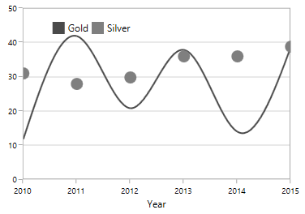
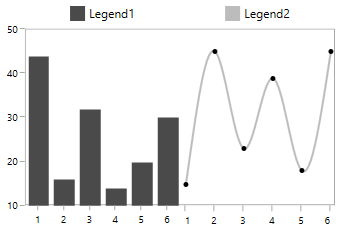
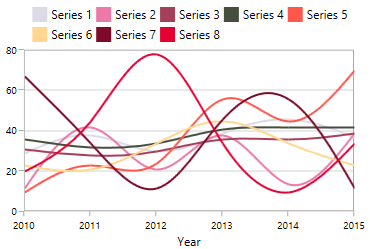

# Legend

Legend provides metadata which helps for identifying elements in chart like [chart series](http://help.syncfusion.com/wpf/sfchart/series), 
[technical indicators](http://help.syncfusion.com/wpf/sfchart/technical-indicators), and [trendlines](http://help.syncfusion.com/wpf/sfchart/trendlines). 
You can define the legend using the following code example.



<chart:SfChart.Legend>

       <chart:ChartLegend />                                 

</chart:SfChart.Legend>



Each legend composed of the following parts:

## Legend Icon

Represents the symbol associated with each legend item. By default, the legend icon is Rectangle. 

This can be customized using the [`LegendIcon`](http://help.syncfusion.com/cr/cref_files/wpf/sfchart/Syncfusion.SfChart.WPF~Syncfusion.UI.Xaml.Charts.ChartSeriesBase~LegendIcon.html) property in any series as in below code snippet:



<chart:SfChart.Legend>

      <chart:ChartLegend/>

</chart:ChartLegend>

<chart:SplineSeries XBindingPath="Year" Label="Series 1"
	                  
                    ItemsSource="{Binding List}" YBindingPath="India"
                     
					          LegendIcon="Diamond" />



The following properties are used to customize the legend icons.

* [`IconWidth`](http://help.syncfusion.com/cr/cref_files/wpf/sfchart/Syncfusion.SfChart.WPF~Syncfusion.UI.Xaml.Charts.ChartLegend~IconWidth.html)-Gets or sets the double value that represents the legend icon(s) width.
* [`IconHeight`](http://help.syncfusion.com/cr/cref_files/wpf/sfchart/Syncfusion.SfChart.WPF~Syncfusion.UI.Xaml.Charts.ChartLegend~IconHeight.html)-Gets or sets the double value that represents that legend icon(s) height.
* [`IconVisibility`](http://help.syncfusion.com/cr/cref_files/wpf/sfchart/Syncfusion.SfChart.WPF~Syncfusion.UI.Xaml.Charts.ChartLegend~IconVisibility.html)-Gets or sets the Visibility of the legend icon.
* [`ItemMargin`](http://help.syncfusion.com/cr/cref_files/wpf/sfchart/Syncfusion.SfChart.WPF~Syncfusion.UI.Xaml.Charts.ChartLegend~ItemMargin.html)-Gets or sets the margin for the legend items.
* [`CornerRadius`](http://help.syncfusion.com/cr/cref_files/wpf/sfchart/Syncfusion.SfChart.WPF~Syncfusion.UI.Xaml.Charts.ChartLegend~CornerRadius.html)-Gets or sets the corner radius of the legend.

The following code example illustrates the customization of legend icon.



<chart:SfChart.Legend>

    <chart:ChartLegend  IconHeight="10" IconWidth="10" 

                        Margin="0,0,0,5"

                        HorizontalAlignment="Center"

                        VerticalAlignment="Center"                                    

                        DockPosition="Top"

                        BorderBrush="Black" BorderThickness="1"

                        IconVisibility="Visible" CornerRadius="5" 

                        ItemMargin="10">                   

    </chart:ChartLegend>

</chart:SfChart.Legend>       



The visibility of the legend icon can be changed by setting [`IconVisibility`](http://help.syncfusion.com/cr/cref_files/wpf/sfchart/Syncfusion.SfChart.WPF~Syncfusion.UI.Xaml.Charts.ChartLegend~IconVisibility.html) property in ChartLegend. 



<chart:SfChart.Legend>

   <chart:ChartLegend  IconHeight="8" IconWidth="8"  

                       IconVisibility="Collapsed" />                                 

</chart:SfChart.Legend>



**Custom** **Legend** **Icon**

We can add custom icon for the legend using [`LegendIconTemplate`](http://help.syncfusion.com/cr/cref_files/wpf/sfchart/Syncfusion.SfChart.WPF~Syncfusion.UI.Xaml.Charts.ChartSeriesBase~LegendIconTemplate.html) property in ChartSeries as in below example.



<chart:SfChart.Legend>

</chart:ChartLegend>

</chart:SfChart.Legend>

<chart:SplineSeries XBindingPath="Year"  Label="Gold" 
  
	                  ItemsSource="{Binding List}" YBindingPath="India" >

       <chart:SplineSeries.LegendIconTemplate>

           <DataTemplate>

                <Ellipse Height="15" Width="15" Fill="White" 
			                   
                         Stroke="#4a4a4a" StrokeThickness="2"></Ellipse>
      </DataTemplate>

    </chart:SplineSeries.LegendIconTemplate>

</chart:SplineSeries>



## Label

This allows us to specify the label for each series which is to be displayed in legend label.



<chart:SfChart.Legend>

    <chart:ChartLegend>

    </chart:ChartLegend>

</chart:SfChart.Legend>

<chart:SplineSeries XBindingPath="Year" Label="Spline"
   
	                  ItemsSource="{Binding List}" YBindingPath="India"/>



## Checkbox 

Used to view or collapse the associated series. By default, the CheckboxVisibilty is *Collapsed*. 

We can enable it by using the [`CheckBoxVisibilty`](http://help.syncfusion.com/cr/cref_files/wpf/sfchart/Syncfusion.SfChart.WPF~Syncfusion.UI.Xaml.Charts.ChartLegend~CheckBoxVisibility.html) property as in below code example:



<chart:SfChart.Legend>

        <chart:ChartLegend CheckBoxVisibility="Visible" />

</chart:SfChart.Legend>



The series can be collapsed by unchecking the CheckBox as below:

## Positioning the Legend

**Legend** **Position**

This allows us to position the legends inside or outside of the chart area (plotting area). 
By default, it will be displayed outside and positioned at top (using [`DockPosition`](http://help.syncfusion.com/cr/cref_files/wpf/sfchart/Syncfusion.SfChart.WPF~Syncfusion.UI.Xaml.Charts.ChartLegend~DockPosition.html)) of the chart area.



<chart:SfChart.Legend>

     <chart:ChartLegend LegendPosition="Inside" />                                 

</chart:SfChart.Legend>



**Docking**

Legends can be docked left, right, and top or bottom around the chart area using [`DockPosition`](http://help.syncfusion.com/cr/cref_files/wpf/sfchart/Syncfusion.SfChart.WPF~Syncfusion.UI.Xaml.Charts.ChartLegend~DockPosition.html) property. 
By default, the ChartLegend is docked at the top of the chart as mentioned earlier.

To display the legend at the bottom, you can set the [`DockPosition`](http://help.syncfusion.com/cr/cref_files/wpf/sfchart/Syncfusion.SfChart.WPF~Syncfusion.UI.Xaml.Charts.ChartLegend~DockPosition.html) as **Bottom** as in below code snippet.


<chart:SfChart.Legend>

    <chart:ChartLegend  DockPosition="Bottom"/>

</chart:SfChart.Legend>



**Floating** **Legends**

To position the legend at any arbitrary location inside chart, we need to set [`DockPosition`](http://help.syncfusion.com/cr/cref_files/wpf/sfchart/Syncfusion.SfChart.WPF~Syncfusion.UI.Xaml.Charts.ChartLegend~DockPosition.html)
as **Floating** and provide its relative position using [`OffsetX`](http://help.syncfusion.com/cr/cref_files/wpf/sfchart/Syncfusion.SfChart.WPF~Syncfusion.UI.Xaml.Charts.ChartLegend~OffsetX.html)
and [`OffsetY`](http://help.syncfusion.com/cr/cref_files/wpf/sfchart/Syncfusion.SfChart.WPF~Syncfusion.UI.Xaml.Charts.ChartLegend~OffsetY.html) properties. 
Offset specifies x or y distance from origin.


<chart:SfChart.Legend>

      <chart:ChartLegend  DockPosition="Floating" OffsetX="30" OffsetY="10"/>

</chart:SfChart.Legend>



## Legend Header

Chart provides support to add any UIElement as a header for legend items. 

You can define the header for legend using the following code example.



<chart:SfChart.Legend>

      <chart:ChartLegend>

          <chart:ChartLegend.Header>

               <TextBlock Text="Medals" VerticalAlignment="Center"  

                           HorizontalAlignment="Center" Margin="15"/>

            </chart:ChartLegend.Header>

     </chart:ChartLegend>

</chart:SfChart.Legend>



## Multiple Legends

Chart control supports showing the legend in multiple panels, to view the legend clearly when multiple areas and greater numbers of chart series are present. 

The following code example shows how to create multiple legends in a single chart.


<chart:SfChart.Legend>

   <chart:ChartLegendCollection>

       <chart:ChartLegend chart:SfChart.Column="0"/>

       <chart:ChartLegend chart:SfChart.Column="1" />

    </chart:ChartLegendCollection>

</chart:SfChart.Legend>

<chart:ColumnSeries Interior="#4a4a4a" Label="Legend1"

                    ItemsSource="{Binding SneakersDetail}" XBindingPath="Brand" 
					
					          YBindingPath="ItemsCount1" />

<chart:SplineSeries Label="Legend2" ItemsSource="{Binding SneakersDetail}"  

                    XBindingPath="Brand" YBindingPath="ItemsCount" >

    <chart:SplineSeries.XAxis>

          <chart:CategoryAxis chart:SfChart.Column="1">

          </chart:CategoryAxis>

     </chart:SplineSeries.XAxis>

</chart:SplineSeries>



## Legends for Accumulation Series

For the series like Pie, Doughnut, Funnel and Pyramid, legends will be generated for all the data points. But for remaining series, each legend corresponds to each series. By default, the Interior color of the segment (data point) is applied to the legend icon. 

The following code snippets explains how the legends displaying for accumulation series.


<chart:SfChart.Legend>

   <chart:ChartLegend />                                 

</chart:SfChart.Legend>

<chart:PieSeries  Palette="Custom" XBindingPath="Category" 
	
	                ItemsSource="{Binding Tax}" YBindingPath="Percentage"/>



Note: Here Legend ‘Label’ will be the x value of the Pie chart.

## Series visibility on legend

We can limit the number of series and trendlines to be displayed in legend using [`VisibilityOnLegend`](http://help.syncfusion.com/cr/cref_files/wpf/sfchart/Syncfusion.SfChart.WPF~Syncfusion.UI.Xaml.Charts.ChartSeriesBase~VisibilityOnLegend.html)
property as shown in below example.


<chart:SfChart.Legend>

    <chart:ChartLegend>                  

    </chart:ChartLegend>

</chart:SfChart.Legend>

<chart:SplineSeries XBindingPath="Year" Label="Gold" 

                    VisibilityOnLegend="Collapsed"

                    ItemsSource="{Binding List}" YBindingPath="India">

</chart:SplineSeries>

<chart:ColumnSeries XBindingPath="Year"

                    VisibilityOnLegend="Visible"

                    Label="Silver" YBindingPath="America"

                    ItemsSource="{Binding List}" />   



## Legend Orientation

Orientation of the Legend can be vertical or horizontal. By default the [`Orientation`](http://help.syncfusion.com/cr/cref_files/wpf/sfchart/Syncfusion.SfChart.WPF~Syncfusion.UI.Xaml.Charts.ChartLegend~Orientation.html) is *Horizontal*. 



<chart:SfChart.Legend>

   <chart:ChartLegend  Orientation="Vertical"/>

</chart:SfChart.Legend>



## Customization

**ItemTemplate**

You can customize each legend item using `ItemTemplate` property in ChartLegend as in below code snippet:





<chart:SfChart.Resources>
        <local:ImageConverter x:Key="imageConverter"></local:ImageConverter>
</chart:SfChart.Resources>

<chart:ChartLegend.ItemTemplate>

   <DataTemplate>

     <Grid Margin="10,0,10,0" >

       <Grid.RowDefinitions>

         <RowDefinition/>

         <RowDefinition/>

      </Grid.RowDefinitions>

      <Image  Width="30" Height="15"  

              Source="{Binding Converter={StaticResource imageConverter}}">
      </Image>

      <TextBlock HorizontalAlignment="Center" FontSize="12"  Grid.Row="1"  
	       
	       	       Foreground="Black" FontWeight="SemiBold" Text="{Binding Label}">                                 
      
      </TextBlock>

    </Grid>

  </DataTemplate>

</chart:ChartLegend.ItemTemplate>





public class ImageConverter:IValueConverter

{

 public object Convert(object value, Type targetType, object parameter, System.Globalization.CultureInfo culture)

  {

   LegendItem item = value as LegendItem;

   if (item.Label == "Gold")

     return new BitmapImage(new Uri(("gold_symb.png"),UriKind.RelativeOrAbsolute));

   else

    return new BitmapImage(new Uri(("silver_symb.png"), UriKind.RelativeOrAbsolute));

  }

  public object ConvertBack(object value, Type targetType, object parameter, System.Globalization.CultureInfo culture)

  {

    return value;

  }

}





**Customizing** **Legend** **Items** **Layout**

When there is more number of legends, the legend exceeds the chart will be cropped, as it arranged horizontally. To avoid the cropping we can change the existing arrangement layout (one which arrange each legend items horizontally) using 
`ItemsPanel` property as in below code snippet:


<chart:SfChart.Legend>

   <chart:ChartLegend>

     <chart:ChartLegend.ItemsPanel>

        <ItemsPanelTemplate>

           <WrapPanel></WrapPanel>

         </ItemsPanelTemplate>

      </chart:ChartLegend.ItemsPanel>

  </chart:ChartLegend>

</chart:SfChart.Legend>



