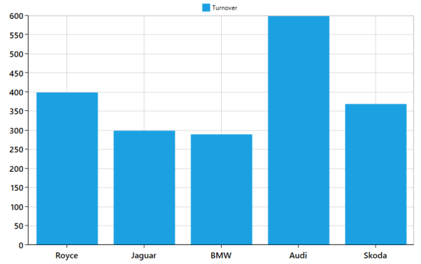

# Legend

Legend contains a list of ChartSeries, TechnicalIndicators, and Trendlines that appear in a chart. The following properties are used to customize the appearance of the ChartLegend.

Legend List

<table>
<tr>
<th>
Properties</th><th>
Description</th></tr>
<tr>
<td>
DockPosition</td><td>
Gets or sets the Dock value that is used to position the legend at the top, bottom, left, right, or in a floating position.</td></tr>
<tr>
<td>
LegendPosition</td><td>
Gets or sets the LegendPosition that specifies whether the legend position is inside or outside the chart area.</td></tr>
<tr>
<td>
OffsetX</td><td>
Gets or sets the double value that specifies the LegendPosition in x-coordinates. This property is only useful if the DockPosition is set as Floating.</td></tr>
<tr>
<td>
OffsetY</td><td>
Gets or sets the double value that specifies the LegendPosition in y-coordinates. This property is only useful if the DockPosition is set as Floating.</td></tr>
<tr>
<td>
Header</td><td>
Gets or sets the object that represents the content of a chart. This is a property type object, so you can specify any object as the Header for chart.</td></tr>
<tr>
<td>
HeaderTemplate</td><td>
Gets or sets the DataTemplate that specifies the UI of the Header.</td></tr>
<tr>
<td>
Orientation</td><td>
Gets or sets the Orientation that specifies the legend orientation vertically or horizontally.</td></tr>
<tr>
<td>
ItemMargin</td><td>
Gets or sets the margin of legend items.</td></tr>
<tr>
<td>
CornerRadius</td><td>
Gets or sets the corner radius of the legend.</td></tr>
<tr>
<td>
CheckBoxVisibility</td><td>
Gets or sets the Visibility of the CheckBox in the legend.</td></tr>
<tr>
<td>
IconVisibility</td><td>
Gets or sets the Visibility of the legend icon(s).</td></tr>
<tr>
<td>
IconWidth</td><td>
Gets or sets the double value that represents the legend icon(s) width.</td></tr>
<tr>
<td>
IconHeight</td><td>
Gets or sets the double value that represents that  legend icon(s) height.</td></tr>
</table>

The following code example shows how to create a simple legend. For sample data, refer to the data section in the code example of [Line Series](http://help.syncfusion.com/UG/winrt/Documents/lineseries.htm).



 <syncfusion:SfChart x:Name="ColumnChart">

            <!-- Assign DataContext object for the Chart-->

            <syncfusion:SfChart.DataContext>

                <local:CategoryDataViewModel/>

            </syncfusion:SfChart.DataContext>

            <!-- Add Legend to the Chart-->

            <syncfusion:SfChart.Legend>

                <syncfusion:ChartLegend/>

            </syncfusion:SfChart.Legend>

            <!-- Add Axes to the Chart-->

            <syncfusion:SfChart.PrimaryAxis>

                <syncfusion:CategoryAxis/>

            </syncfusion:SfChart.PrimaryAxis>

            <syncfusion:SfChart.SecondaryAxis>

                <syncfusion:NumericalAxis/>

            </syncfusion:SfChart.SecondaryAxis>

            <!-- Add ColumnSeries to the Chart-->

            <syncfusion:ColumnSeries Label="Turnover" ItemsSource="{BindingCategoricalDatas}"

                         XBindingPath="Category" YBindingPath="Value"/>

        </syncfusion:SfChart>  


The following screenshot illustrates a chart with a simple legend.

###Each LegendItem contains the following parts:

####Icon- You can set the icon using the LegendIcon property available in each series. You can customize height and width of an icon symbol using the IconWidth and IconHeight properties available in ChartLegend. You can also show or collapse the icon symbol using the IconVisibility property in ChartLegend.

####Label- You can set the label using the Label property available in each series.

####CheckBox- It is used to show or collapse the associated series. By default, the CheckBox is collapsed. You can enable it by setting CheckBoxVisibility property in ChartLegend.

Note: Usually, a legend item provides information about a series. However, for series like PieSeries, each legend item provides information about a single data point.

###Positioning

By default, the ChartLegend is positioned at the top of the chart. You can also change the position to left, right, or bottom using the DockPosition property. This can be used to position it at any location relative to the chart. To position the ChartLegend at any location, you need to first set DockPosition to Float and then provide its relative position using the OffsetX and OffsetY properties.

The following code example shows how to create a ChartLegend for a chart.



        <syncfusion:SfChart.Legend>

            <syncfusion:ChartLegend DockPosition="Bottom" Orientation="Horizontal" 

                      CheckBoxVisibility="Visible"/>

        </syncfusion:SfChart.Legend>


###Multiple Legends

The SfChart control supports showing the legend in multiple panels, to view the legend clearly when multiple areas and greater numbers of chart series are present. Also, you can place the legend inside or outside of the chart area. To have multiple legends in a single chart, an instance for ChartLegendCollection needs to be created.

The following code example shows how to create multiple legends in a single chart. For sample data, please refer to the data section in the code sample of [Line Series.](http://help.syncfusion.com/ug/wpf/)



<syncfusion:SfChart Height="500" Width="600" x:Name="LineChart">

            <syncfusion:SfChart.ColumnDefinitions>

                <syncfusion:ChartColumnDefinition/>

                <syncfusion:ChartColumnDefinition/>

            </syncfusion:SfChart.ColumnDefinitions>

            <syncfusion:SfChart.DataContext>

                <local:ChartViewModel/>

            </syncfusion:SfChart.DataContext>

            <syncfusion:SfChart.Legend>

                <syncfusion:ChartLegendCollection>

                    <syncfusion:ChartLegend syncfusion:ChartBase.Column="0"/>

                    <syncfusion:ChartLegend syncfusion:ChartBase.Column="1"/>

                </syncfusion:ChartLegendCollection>

            </syncfusion:SfChart.Legend>

            <syncfusion:SfChart.PrimaryAxis>

                <syncfusion:CategoryAxis  LabelFormat="yyyy"/>

            </syncfusion:SfChart.PrimaryAxis>

            <syncfusion:SfChart.SecondaryAxis>

                <syncfusion:NumericalAxis/>

            </syncfusion:SfChart.SecondaryAxis>

       <syncfusion:ColumnSeries Label="Sports" ItemsSource="{Binding Data}" 

                               XBindingPath="Year" YBindingPath="Sports">

            </syncfusion:ColumnSeries>

       <syncfusion:SplineAreaSeries Label="Books" ItemsSource="{Binding Data}" 

                               XBindingPath="Year" YBindingPath="Books">

            <syncfusion:SplineAreaSeries.XAxis>

                <syncfusion:CategoryAxis syncfusion:ChartBase.Column="1"

                    LabelFormat="yyyy" Visibility="Visible"/>

                </syncfusion:SplineAreaSeries.XAxis>

            </syncfusion:SplineAreaSeries>

        </syncfusion:SfChart >




    public class ChartViewModel

    {

        public ChartViewModel()

        {

            this.Data = new ObservableCollection<Entertainment>();

            DateTime yr = new DateTime(2002, 5, 1);

            Data.Add(new Entertainment() { Year = yr.AddYears(1), Sports = 28, Books = 31, Music = 36, Dance = 39 });

            Data.Add(new Entertainment() { Year = yr.AddYears(2), Sports = 24, Books = 28, Music = 32, Dance = 36 });

            Data.Add(new Entertainment() { Year = yr.AddYears(3), Sports = 26, Books = 32, Music = 34, Dance = 40 });

            Data.Add(new Entertainment() { Year = yr.AddYears(4), Sports = 27, Books = 36, Music = 41, Dance = 44 });

            Data.Add(new Entertainment() { Year = yr.AddYears(5), Sports = 32, Books = 36, Music = 42, Dance = 45 });

            Data.Add(new Entertainment() { Year = yr.AddYears(6), Sports = 35, Books = 39, Music = 42, Dance = 48 });

            Data.Add(new Entertainment() { Year = yr.AddYears(7), Sports = 30, Books = 37, Music = 43, Dance = 46 });

        }

        public ObservableCollection<Entertainment> Data { get; set; }

    }

    public class Entertainment

    {

        public DateTime Year { get; set; }

        public double Sports { get; set; }

        public double Books { get; set; }

        public double Music { get; set; }

        public double Dance { get; set; }

    }



The following screenshot shows a chart with multiple legends.

{{ '' | markdownify }}

Note: You can change the legend visibility from chart series by using VisibilityOnLegend property

