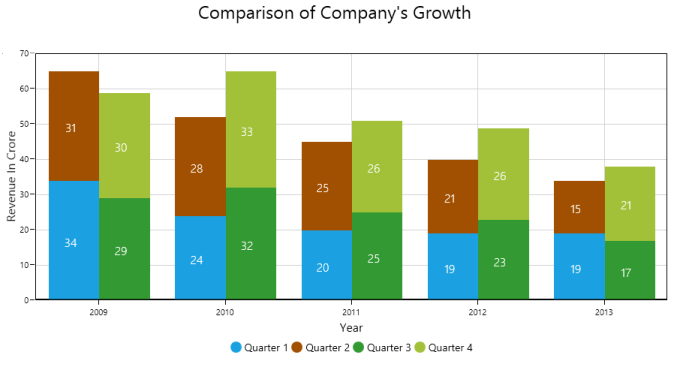

# SfChart

SfChart provides a perfect way to visualize data with a high level of user interactivity that focus on development,productivity and simplicity of use. SfChart also provides a wide variety of charting features that can be used to visualize large quantities of data, flexibility of binding data and user customization. 

    

## Key features

* SfChart supports 38 different types of [series](http://help.syncfusion.com/wpf/sfchart/series), ranging from simple [bar series](http://help.syncfusion.com/wpf/sfchart/series#column-and-bar-charts) to complex [financial charts](http://help.syncfusion.com/wpf/sfchart/series#financial-charts). Each type of chart represents a unique style of representing data with more user friendly and greater UI visualization.
* Capable of rendering large amount of data within the few milliseconds (ms). 
* Allows you to map data from the specified path, by achieving [data binding](http://help.syncfusion.com/wpf/sfchart/databinding) concept.
* Interactive zooming[http://help.syncfusion.com/wpf/sfchart/interactive-features#zooming-and-panning] can be done with touch mode enabled that allows you to explore portions of large charts in more detail, with excellent performance.
* When you need more information about particular segment in a chart, a little mouse over on the series provides much more information by including [tooltip](http://help.syncfusion.com/wpf/sfchart/interactive-features#tooltip), [crosshair](http://help.syncfusion.com/wpf/sfchart/interactive-features#crosshair) and [track ball](http://help.syncfusion.com/wpf/sfchart/interactive-features#trackball) behavior.
* Supports 10 different types of [technical indicators](http://help.syncfusion.com/wpf/sfchart/technical-indicators) that determine financial, stock or economic trends by analyzing a set of recorded data. 
* Supports multiple axes that can be stacked and spanned for multiple panes.
* SfChart provides support for rendering multiple series at same time, with options to compare and visualize two different chart series simultaneously.
* User friendly and provides various options for you to customize chart features like [axis](http://help.syncfusion.com/wpf/sfchart/axis), [labels](http://help.syncfusion.com/wpf/sfchart/adornments), [legends](http://help.syncfusion.com/wpf/sfchart/legend), [series](http://help.syncfusion.com/wpf/sfchart/series) etc and visualize them accordingly. 

