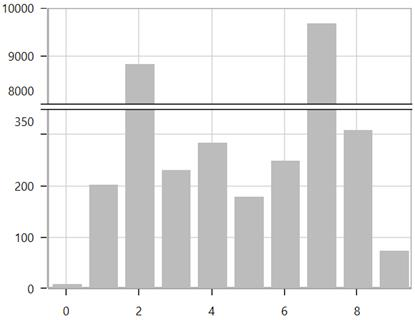
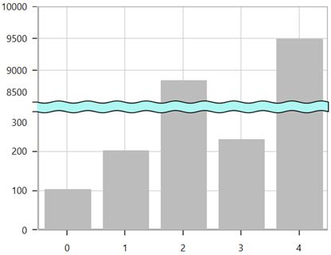

# Scale Breaks

Scale break is a stripe drawn in the chart area to denote the break in the continuity of data points. Scale breaks are useful when there is a large difference in the data points. Scale break allows you to have different ranges on the same axis to visualize the data effectively.

## Positioning the Breaks

SfChart provides `Start` and `End` properties for defining the scale break range (ranges that needs to be skipped). These values are based on axis values. 

The following image has data points with both greater and smaller magnitude, but the segments with smaller values is not visualized properly.

Applying scale breaks helps in proper visualization of all the data points.





<chart:SfChart.SecondaryAxis>

<chart:NumericalAxis>                                

<chart:NumericalAxis.AxisScaleBreaks>                     

<chart:ChartAxisScaleBreak Start="300"

End="8500">

</chart:ChartAxisScaleBreak>

</chart:NumericalAxis>

</chart:SfChart.SecondaryAxis>





NumericalAxis axis = new NumericalAxis();

ChartAxisScaleBreak scaleBreak = new ChartAxisScaleBreak();

scaleBreak.Start = 300;

scaleBreak.End = 8500;

axis.AxisScaleBreaks.Add(scaleBreak);

chart.SecondaryAxis = axis;





## Break Position Customization

For the defined break range, its position in the chart area can be customized using the `BreakPosition` property in numerical axis.

Break position is determined based on the following factors:

###Data Count

Based on the number of data points that fall in axis ranges (other than break range) scale break will be positioned.

In the below image the range [0,350] contains maximum number of data compared to the range 

[8000, 10000] hence the break is positioned in such a way that allocates more space to the range [0,350].

Range [0,350] takes nearly 4/5th of the axis height and the range [8000,10000] takes 1/5th.





<chart:SfChart.SecondaryAxis>

<chart:NumericalAxis x:Name="axis" BreakPosition="DataCount">                                

<chart:NumericalAxis.AxisScaleBreaks>                     

<chart:ChartAxisScaleBreak Start="350"

End="8000">  

</chart:ChartAxisScaleBreak>

</chart:NumericalAxis>

</chart:SfChart.SecondaryAxis>





NumericalAxis axis = new NumericalAxis();

axis.BreakPosition = ScaleBreakPosition.DataCount;

ChartAxisScaleBreak scaleBreak = new ChartAxisScaleBreak();

scaleBreak.Start = 350;

scaleBreak.End = 8000;

axis.AxisScaleBreaks.Add(scaleBreak);

chart.SecondaryAxis = axis;





###Scale

Scale option allows you to position the breaks based on the delta of each axis range relative to the other.





<chart:SfChart.SecondaryAxis>

<chart:NumericalAxis x:Name="axis" BreakPosition="Scale">                                

<chart:NumericalAxis.AxisScaleBreaks>                     

<chart:ChartAxisScaleBreak Start="350"

End="8000">  

</chart:ChartAxisScaleBreak>

</chart:NumericalAxis>

</chart:SfChart.SecondaryAxis>





NumericalAxis axis = new NumericalAxis();

axis.BreakPosition = ScaleBreakPosition.Scale;

ChartAxisScaleBreak scaleBreak = new ChartAxisScaleBreak();

scaleBreak.Start = 350;

scaleBreak.End = 8000;

axis.AxisScaleBreaks.Add(scaleBreak);

chart.SecondaryAxis = axis;





###Percent

Percent option allows to position the breaks at the specified percentage of the axis available height.

Percentage can be specified using `BreakPercent` property. Default BreakPercent value is 50.

In the below image, each break is given percent value as 50. First break is positioned at the 50% of the axis, and the next break is positioned at 50% of the remaining space and so on.





<chart:SfChart.SecondaryAxis>

<chart:NumericalAxis x:Name="axis" BreakPosition="Percent ">                                

<chart:NumericalAxis.AxisScaleBreaks>                     

<chart:ChartAxisScaleBreak Start="300"

End="8000" BreakPercent="50"> 

</chart:ChartAxisScaleBreak>                     

<chart:ChartAxisScaleBreak Start="12500"

End="19000" BreakPercent="50"> 

</chart:ChartAxisScaleBreak>

</chart:NumericalAxis.AxisScaleBreaks>

</chart:NumericalAxis>

</chart:SfChart.SecondaryAxis>





NumericalAxis axis = new NumericalAxis();

axis.BreakPosition = ScaleBreakPosition.Percent;

ChartAxisScaleBreak scaleBreak1 = new ChartAxisScaleBreak();

scaleBreak1.Start = 300;

scaleBreak1.End = 8000;

scaleBreak1.BreakPercent = 50;

axis.AxisScaleBreaks.Add(scaleBreak1);

ChartAxisScaleBreak scaleBreak2 = new ChartAxisScaleBreak();

scaleBreak2.Start = 12500;

scaleBreak2.End = 19000;

scaleBreak2.BreakPercent = 50;

axis.AxisScaleBreaks.Add(scaleBreak2);

chart.SecondaryAxis = axis;





## Multiple Breaks

Multiple breaks can be included in the chart.





<chart:SfChart.SecondaryAxis>

<chart:NumericalAxis>                                

<chart:NumericalAxis.AxisScaleBreaks>                     

<chart:ChartAxisScaleBreak Start="300"

End="8000"> 

</chart:ChartAxisScaleBreak>                   

<chart:ChartAxisScaleBreak Start="12500"

End="19000"> 

</chart:ChartAxisScaleBreak>

</chart:NumericalAxis.AxisScaleBreaks>

</chart:NumericalAxis>

</chart:SfChart.SecondaryAxis>





NumericalAxis axis = new NumericalAxis();

ChartAxisScaleBreak scaleBreak1 = new ChartAxisScaleBreak();

scaleBreak1.Start = 300;

scaleBreak1.End = 8000;

axis.AxisScaleBreaks.Add(scaleBreak1);

ChartAxisScaleBreak scaleBreak2 = new ChartAxisScaleBreak();

scaleBreak2.Start = 12500;

scaleBreak2.End = 19000;

axis.AxisScaleBreaks.Add(scaleBreak2);

chart.SecondaryAxis = axis;





## Customization

The following are the customizing options for scale break.

Line type, background, spacing, stroke, stroke thickness of the scale break can be customized using `LineType`, `Fill`, `BreakSpacing`, `Stroke`, `StrokeThickness` properties respectively.





<chart:SfChart.SecondaryAxis>

<chart:NumericalAxis>                                

<chart:NumericalAxis.AxisScaleBreaks>                     

<chart:ChartAxisScaleBreak Start="300"  BreakSpacing="12"

End="8500" LineType="Wave" 

Fill="PaleTurquoise"

Stroke="Black" StrokeThickness="1.2" >  

</chart:ChartAxisScaleBreak>

</chart:NumericalAxis.AxisScaleBreaks> 

</chart:NumericalAxis>

</chart:SfChart.SecondaryAxis>





NumericalAxis axis = new NumericalAxis();

ChartAxisScaleBreak scaleBreak = new ChartAxisScaleBreak();

scaleBreak.Start = 300;

scaleBreak.End = 8500;

scaleBreak.LineType = BreakLineType.Wave;

scaleBreak.BreakSpacing = 12;

scaleBreak.Fill = new SolidColorBrush(Colors.PaleTurquoise);

scaleBreak.Stroke = new SolidColorBrush(Colors.Black);

scaleBreak.StrokeThickness = 1.2;

axis.AxisScaleBreaks.Add(scaleBreak);

chart.SecondaryAxis = axis;





