# Series

ChartSeries is the visual representation of the data. SfChart offers many types of series ranging from LineSeries to FinancialSeries like HiLo and Candle. Based on your requirements and specifications, any type of Series can be added for data visualization. The following APIs are common for most of the series types.

The following APIs are common for most of the series types.

<table>
<tr>
<th>
Property</th><th>
Definition</th></tr>
<tr>
<td>
XBindingPath</td><td>
Gets or sets a string that represents the X values of a series.</td></tr>
<tr>
<td>
YBindingPath</td><td>
Gets or sets a string that represents the Y values of a series.</td></tr>
<tr>
<td>
Stroke</td><td>
Gets or sets the {{ '[Brush](http://msdn.microsoft.com/en-us/library/system.windows.media.brush.aspx)' | markdownify }} that specifies how the series outline is painted.</td></tr>
<tr>
<td>
StrokeThickness                               </td><td>
Gets or sets the width of the series outline.</td></tr>
<tr>
<td>
Palette</td><td>
Gets or sets the ChartColorPalette of the series.</td></tr>
<tr>
<td>
Interior</td><td>
Gets or sets the {{ '[Brush](http://msdn.microsoft.com/en-us/library/system.windows.media.brush.aspx)' | markdownify }} that specifies how the series interior is painted</td></tr>
</table>

## LineSeries

LineSeries displays a set of points connected by a straight line. Line Charts join points on a plot by straight lines, showing data trends at equal intervals. Line Chart treats the input as non-numeric, categorical information, equally spaced along the x-axis. 

The following code example explains how to create a simple LineSeries using given data.




<syncfusion:SfChart x:Name="Chart"   Margin="5,0,10,0">

<syncfusion:SfChart.DataContext>

<local:ViewModel></local:ViewModel>

</syncfusion:SfChart.DataContext>

<syncfusion:SfChart.PrimaryAxis>

<syncfusion:CategoryAxis  Header="Company Name"/>

</syncfusion:SfChart.PrimaryAxis>

<syncfusion:SfChart.SecondaryAxis>

<syncfusion:NumericalAxis  Header="Gross Revenue (cr.)"/>

</syncfusion:SfChart.SecondaryAxis>

<syncfusion:LineSeries  x:Name="series1" Palette="Metro"   XBindingPath="CompanyName" YBindingPath="CompanyTurnOver" ItemsSource="{Binding CompanyDetails}"/>

</syncfusion:SfChart>  





    public class CompanyDetails

    {

        public string CompanyName { get; set; }

        public double CompanyTurnOver { get; set; }

    }

    public class ViewModel

    {

        public ObservableCollection<CompanyDetails> CompanyDetails { get; set; }

        public ViewModel()

        {

            CompanyDetails = new ObservableCollection<CompanyDetails>();

            CompanyDetails.Add(new CompanyDetails() { CompanyName = "Royce", CompanyTurnOver = 290 });

            CompanyDetails.Add(new CompanyDetails() { CompanyName = "Thomson", CompanyTurnOver = 340 });

            CompanyDetails.Add(new CompanyDetails() { CompanyName = "Paribas", CompanyTurnOver = 230 });

            CompanyDetails.Add(new CompanyDetails() { CompanyName = "Trimble", CompanyTurnOver = 380 });

            CompanyDetails.Add(new CompanyDetails() { CompanyName = "Aruba", CompanyTurnOver = 300 });

        }

    }




## ColumnSeries

ColumnSeries is rendered by a collection of rectangles of varying heights, aligned vertically. ColumnSeries is used to show data changes over a period of time or to illustrate comparisons among items.

In ColumnSeries, categories are represented along PrimaryAxis and values are represented along SecondaryAxis. You can also set the ChartColorPalette for the series using the Palette property. ColumnSeries appearance can also be customized using CustomTemplate property.



	<syncfusion:SfChart x:Name="Chart"   Margin="5,0,10,0">

	<syncfusion:SfChart.DataContext>

	<local:ViewModel></local:ViewModel>

	</syncfusion:SfChart.DataContext>

	<syncfusion:SfChart.PrimaryAxis>

	<syncfusion:CategoryAxis  Header="Company Name"/>

	</syncfusion:SfChart.PrimaryAxis>

	<syncfusion:SfChart.SecondaryAxis>

	<syncfusion:NumericalAxis  Header="Gross Revenue (cr.)"/>

	</syncfusion:SfChart.SecondaryAxis>

	<syncfusion:ColumnSeries  x:Name="series1" Palette="Metro"  XBindingPath="CompanyName" YBindingPath="CompanyTurnOver" ItemsSource="{Binding CompanyDetails}"/>

	</syncfusion:SfChart>



## BarSeries

BarSeries is rendered using a collection of rectangles of varying heights, aligned horizontally. BarSeries is used to represent data that occurs over time and for showing categorical information, since the categories can be displayed horizontally. The categories are represented along PrimaryAxis and values are represented along SecondaryAxis.



    <syncfusion:BarSeries Interior="LightBlue"   x:Name="series1"  Stroke="Red" StrokeThickness="3"  XBindingPath="CompanyName" YBindingPath="CompanyTurnOver" ItemsSource="{Binding CompanyDetails}"/>



## AreaSeries

AreaSeries is rendered using a collection of line segments connected to form a closed loop area, filled with the specified color. AreaSeries focuses on the magnitude of change over time and can be used to draw attention to the total value across a trend. Values are represented in SecondaryAxis and categories are represented in PrimaryAxis.



<syncfusion:AreaSeries Interior="LightBlue"   x:Name="series1"  Stroke="Red" StrokeThickness="3"  XBindingPath="CompanyName" YBindingPath="CompanyTurnOver" ItemsSource="{Binding CompanyDetails}"/>



## SplineSeries

SplineSeries resembles line series, but the difference between them is that instead of connecting the data points with line segments, the data points are connected by smooth Bezier curves. The SplineSeries is often used for data modeling, by taking a limited set of known data and approximating the intervene values. In SplineSeries, data is taken as category data and is distributed evenly along x-axis.



    <syncfusion:SplineSeries    x:Name="series1"  Palette="Metro"  XBindingPath="CompanyName" YBindingPath="CompanyTurnOver" ItemsSource="{Binding CompanyDetails}"/>



## ScatterSeries

ScatterSeries is a type of mathematical diagram that uses [Cartesian coordinates](http://en.wikipedia.org/wiki/Cartesian_coordinate_system) to display values for two variables for a set of data, with each point being represented by an ellipse.



<syncfusion:ScatterSeries    x:Name="series1"  ScatterWidth="20" ScatterHeight="20"  XBindingPath="CompanyName" YBindingPath="CompanyTurnOver" ItemsSource="{Binding CompanyDetails}"/>



## BubbleSeries

BubbleSeries is a visualization technique. It has a set of numeric quantities, represented by closely packed circles, whose areas are proportional to the quantities. The BubbleSeries is often used in software engineering to represent dataflow and also in scientific modeling.

The following APIs are used in BubbleSeries.

<table>
<tr>
<th>
Property</th><th>
Definition</th></tr>
<tr>
<td>
MinimumRadius</td><td>
Gets or sets the minimum radius constraint of the bubble.</td></tr>
<tr>
<td>
MaximumRadius</td><td>
Gets or sets the maximum radius constraint of the bubble.</td></tr>
<tr>
<td>
Size</td><td>
Gets or sets the suggested size of the bubble.</td></tr>
</table>
 


<syncfusion:BubbleSeries   x:Name="series1"  MinimumRadius="20" MaximumRadius="40" Size="Value"  XBindingPath="CompanyName" YBindingPath="CompanyTurnOver" ItemsSource="{Binding CompanyDetails}"/> 



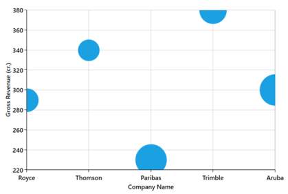

## SplineAreaSeries

SplineAreaSeries connects a series of data points using smooth Bezier line curves, with the underlying areas filled. The Bezier curve takes a set of data points and interpolates the intermediate values. The SplineAreaSeries fills the area between the Bezier curve and axis line.



<syncfusion:SplineAreaSeries   x:Name="series1"  Stroke="Red" StrokeThickness="3" Interior="Blue"   XBindingPath="CompanyName" YBindingPath="CompanyTurnOver" ItemsSource="{Binding CompanyDetails}"/>



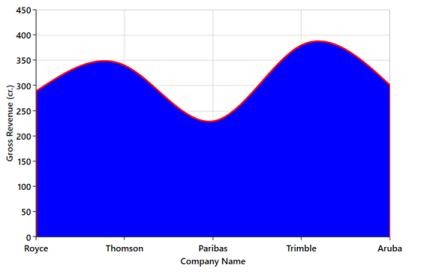

## StepAreaSeries

StepAreaSeries is similar to AreaSeries but it does not use the shortest distance to connect two data points using Bezier curves. Instead, this ChartSeries uses vertical and horizontal lines to connect the data points in a series forming a step-like progression.



<syncfusion:StepAreaSeries   x:Name="series1"  Stroke="Red" StrokeThickness="3" Interior="Blue"   XBindingPath="CompanyName" YBindingPath="CompanyTurnOver" ItemsSource="{Binding CompanyDetails}"/>



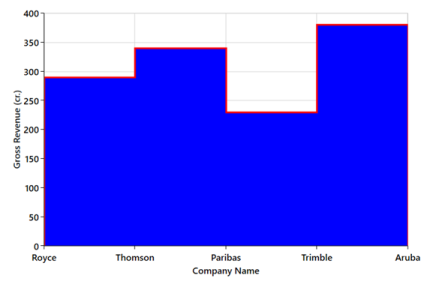

## StepLineSeries

StepLineSeries is similar to LineSeries, but it does not use the shortest distance to connect two data points. Instead, this ChartSeries uses vertical and horizontal lines to connect the data points in a series, forming a step-like progression.



    <syncfusion:StepLineSeries   x:Name="series1"  Stroke="Red" StrokeThickness="3" Interior="Blue"   XBindingPath="CompanyName" YBindingPath="CompanyTurnOver" ItemsSource="{Binding CompanyDetails}"/>  



## FastLineSeries

The FastLineSeries is a special kind of line series that can render a collection with a huge number of datapoints. A FastLineSeries can be rendered using polyline segment. FastLineSeries boost performance of rendering of LineSeries. FastLineSeries is used in a scenario where a number of points are to be rendered in a short span of time.



<syncfusion:FastLineSeries   x:Name="series1"   StrokeThickness="3" Interior="Blue"   XBindingPath="CompanyName" YBindingPath="CompanyTurnOver" ItemsSource="{Binding CompanyDetails}"/>



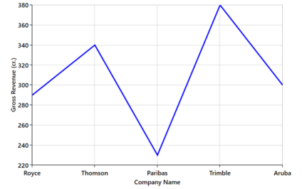

## Stacking Series

The following APIs are used in Stacking Series.

### Stacking Series API

<table>
<tr>
<th>
Property</th><th>
Definition</th></tr>
<tr>
<td>
GroupingLabel</td><td>
Gets or sets the string that is used to group the stacking series.</td></tr>
</table>

## StackingColumnSeries

StackingColumnSeries resembles multiple types of series of the ColumnSeries. Each series is vertically stacked one above the other. When there is only one series, then it is ColumnSeries. StackingColumnSeries shows the relationship of individual items to the whole and used for more complex comparisons of data.



<syncfusion:SfChart x:Name="Chart"   Margin="5,0,10,0">

<syncfusion:SfChart.DataContext>

<local:ViewModel1></local:ViewModel1>

</syncfusion:SfChart.DataContext>

<syncfusion:SfChart.PrimaryAxis>

<syncfusion:CategoryAxis  Header="Company Name"/>

</syncfusion:SfChart.PrimaryAxis>

<syncfusion:SfChart.SecondaryAxis>

<syncfusion:NumericalAxis Interval="100" Header="Gross Revenue (cr.)"/>

</syncfusion:SfChart.SecondaryAxis>

<syncfusion:StackingColumnSeries   x:Name="series1"  GroupingLabel="Company Details"  Interior="Blue" Stroke="Red"   XBindingPath="CompanyName" YBindingPath="CompanyTurnOver" ItemsSource="{Binding CompanyDetails}"/>

<syncfusion:StackingColumnSeries   x:Name="series2"  GroupingLabel="Company Details"  Interior="DarkGray" Stroke="Green"   XBindingPath="CompanyName" YBindingPath="CompanyTurnOver" ItemsSource="{Binding CompanyDetails}"/>

</syncfusion:SfChart>



## StackingColumn100Series

StackingColumn100Series resembles StackingColumnSeries. StackingColumn100Series displays multiple data series, stacked as columns, and the cumulative portion of each stacked element always comes to a total of 100%. StackingColumn100Series is used when the relationship between the stacked elements are more important than the amounts. 



<syncfusion:StackingColumn100Series   x:Name="series1"  GroupingLabel="Company Details"  Interior="Blue" Stroke="Red"   XBindingPath="CompanyName" YBindingPath="CompanyTurnOver" ItemsSource="{Binding CompanyDetails}"/>

<syncfusion:StackingColumn100Series   x:Name="series2"  GroupingLabel="Company Details"  Interior="DarkGray" Stroke="Green"   XBindingPath="CompanyName" YBindingPath="CompanyTurnOver" ItemsSource="{Binding CompanyDetails}"/>



## StackingBarSeries

StackingBarSeries is a multiple series type of BarSeries. Each BarSeries is then stacked horizontally, side by side to each other. When there exists only one series, it resembles a simple BarSeries. StackingBarSeries is used to show combined values for each category.



<syncfusion:StackingBarSeries   x:Name="series1"  GroupingLabel="Company Details"  Interior="Blue" Stroke="Red"   XBindingPath="CompanyName" YBindingPath="CompanyTurnOver" ItemsSource="{Binding CompanyDetails}"/>

<syncfusion:StackingBarSeries   x:Name="series2"  GroupingLabel="Company Details"  Interior="DarkGray" Stroke="Green"   XBindingPath="CompanyName" YBindingPath="CompanyTurnOver" ItemsSource="{Binding CompanyDetails}"/>


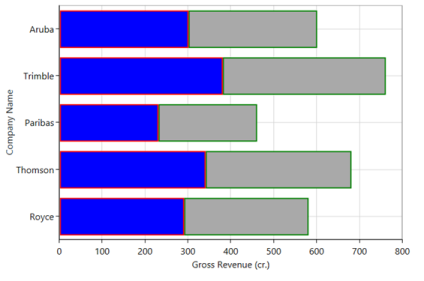

## StackingBar100Series

StackingBar100Series resembles a StackingBarSeries. StackingBar100Series displays multiple series as stacked bars and the cumulative portion of each stacked element is always 100%. StackingBar100Series is used when the combined values in categories is more important than amounts. 



<syncfusion:StackingBar100Series   x:Name="series1"  GroupingLabel="Company Details"  Interior="Blue" Stroke="Red"   XBindingPath="CompanyName" YBindingPath="CompanyTurnOver" ItemsSource="{Binding CompanyDetails}"/>

<syncfusion:StackingBar100Series   x:Name="series2"  GroupingLabel="Company Details"  Interior="DarkGray" Stroke="Green"   XBindingPath="CompanyName" YBindingPath="CompanyTurnOver" ItemsSource="{Binding CompanyDetails}"/>



## StackingAreaSeries

StackingAreaSeries is representing areas stacked vertically one above the other. StackingAreaSeries is preferred in the form of multiple series type of AreaSeries. When there is only one series, then it is a simple AreaSeries. StackingAreaSeries is used when the fluctuations over a period of time in all series to be are visible at the same time.



<syncfusion:StackingAreaSeries   x:Name="series1"  GroupingLabel="Company Details"  Interior="Blue" Stroke="Red"   XBindingPath="CompanyName" YBindingPath="CompanyTurnOver" ItemsSource="{Binding CompanyDetails}"/>

<syncfusion:StackingAreaSeries   x:Name="series2"  GroupingLabel="Company Details"  Interior="DarkGray" Stroke="Green"   XBindingPath="CompanyName" YBindingPath="CompanyTurnOver" ItemsSource="{Binding CompanyDetails}"/>



## StackingArea100Series

StackingArea100Series is similar to StackingAreaSeries, but this series displays multiple data series as stacked areas, and the cumulative portion of each stacked element always totals 100%. StackingArea100Series displays the trend of the percentage that each value contributes over time or other category data.



<syncfusion:StackingArea100Series   x:Name="series1"  GroupingLabel="Company Details"  Interior="Blue" Stroke="Red"   XBindingPath="CompanyName" YBindingPath="CompanyTurnOver" ItemsSource="{Binding CompanyDetails}"/>

<syncfusion:StackingArea100Series   x:Name="series2"  GroupingLabel="Company Details"  Interior="DarkGray" Stroke="Green"   XBindingPath="CompanyName" YBindingPath="CompanyTurnOver" ItemsSource="{Binding CompanyDetails}"/>



## FastStackingColumnSeries

FastStackingColumnSeries is similar to StackingColumnSeries with y-coordinate values stacked over one another. FastStackingColumnSeries allows data to be visualized as a sum of series parts. FastStackingColumnSeries loads faster and provides better performance. FastStackingColumnSeries is used in real-time charts to visualize more number of points.



<syncfusion:FastStackingColumnBitmapSeries  x:Name="series1"   Interior="Blue" Stroke="Red"   XBindingPath="CompanyName"YBindingPath="CompanyTurnOver" ItemsSource="{Binding CompanyDetails}"/>

<syncfusion:FastStackingColumnBitmapSeries x:Name="series2"   Interior="DarkGray" Stroke="Green"   XBindingPath="CompanyName"YBindingPath="CompanyTurnOver" ItemsSource="{Binding CompanyDetails}"/>



## PieSeries

A PieSeries is a CircularChart, divided into sectors, illustrating numerical proportion. The following APIs are used in PieSeries.

<table>
<tr>
<th>
Property</th><th>
Definition</th></tr>
<tr>
<td>
LabelPosition</td><td>
Gets or sets the CircularSeriesLabelPosition that controls the positioning of PieSeries adornment labels.</td></tr>
<tr>
<td>
StartAngle</td><td>
Gets or sets the starting angle of the PieSeries. By default, it starts at 0. The value must fall between 0 and 360 degrees.</td></tr>
<tr>
<td>
EndAngle</td><td>
Gets or sets the end angle of the PieSeries. By default, it takes 360 for a complete circle. The value must fall between 0 and 360 degrees.</td></tr>
<tr>
<td>
ConnectorType</td><td>
Gets or sets the ConnectorMode that specifies connector line type of the PieSeries.</td></tr>
<tr>
<td>
EnableSmartLabels</td><td>
Gets or sets the bool value that describes the smart labels in PieSeries</td></tr>
<tr>
<td>
PieCoefficient</td><td>
Gets or sets the double value that is used to control the pie chart rendering size.</td></tr>
<tr>
<td>
ExplodeAll</td><td>
Gets or sets the bool value, to explode all the segments in PieSeries or not.</td></tr>
<tr>
<td>
ExplodeIndex</td><td>
Gets or sets the segment index value to denote which segment is to be exploded.</td></tr>
<tr>
<td>
ExplodeRadius</td><td>
Gets or sets the distance between the actual center point of the chart and the exploded segment start point.</td></tr>
</table>



<syncfusion:PieSeries  x:Name="series1"   EnableSmartLabels="True" LabelPosition="OutsideExtended"  XBindingPath="CompanyName" YBindingPath="CompanyTurnOver" ItemsSource="{Binding CompanyDetails}">

<syncfusion:PieSeries.AdornmentsInfo>

<syncfusion:ChartAdornmentInfo AdornmentsPosition="Bottom" ShowLabel="True" HorizontalAlignment="Center" UseSeriesPalette="True" ShowConnectorLine="True" ConnectorHeight="80" SegmentLabelContent="LabelContentPath">

</syncfusion:ChartAdornmentInfo>

</syncfusion:PieSeries.AdornmentsInfo>

</syncfusion:PieSeries>



## Semi PieSeries

By having custom StartAngle and EndAngle, you can draw pie series in different shapes like semicircular or quarter circular series.



<syncfusion:SfChart Name="chart" >

<syncfusion:PieSeries StartAngle="180" EndAngle="360" x:Name="pieSeries" Palette="Metro" XBindingPath="_Date" YBindingPath="Low" ItemsSource="{Binding StockPriceDetails}"/>

</syncfusion:SfChart>



## DoughnutSeries

DoughnutSeries displays data in rings, where the rings represent the data series. The DoughnutSeries is similar to PieSeries. DoughnutSeries is used to show the relationship between parts of data and whole data.

The following APIs are used in DoughnutSeries.

<table>
<tr>
<th>
Property</th><th>
Definition</th></tr>
<tr>
<td>
LabelPosition</td><td>
Gets or sets the CircularSeriesLabelPosition that controls the positioning of DoughnutSeries adornment labels</td></tr>
<tr>
<td>
StartAngle</td><td>
Gets or sets the starting angle of the DoughnutSeries. By default, it starts at 0. The value must fall between 0 and 360 degrees.</td></tr>
<tr>
<td>
EndAngle</td><td>
Gets or sets the end angle of the DoughnutSeries. By default, it takes 360 for a complete circle. The value must fall between 0 and 360 degrees.</td></tr>
<tr>
<td>
ConnectorType</td><td>
Gets or sets the ConnectorMode that specifies connector line type of the DoughnutSeries.</td></tr>
<tr>
<td>
EnableSmartLabels</td><td>
Gets or sets the bool value that describes the smart labels in DoughnutSeries.</td></tr>
<tr>
<td>
DoughnutCoefficient</td><td>
Gets or sets the double value that is used to control the DoughnutSeries rendering size.</td></tr>
</table>



<syncfusion:DoughnutSeries  x:Name="series1"   EnableSmartLabels="True" DoughnutCoefficient="0.5" LabelPosition="OutsideExtended"  XBindingPath="CompanyName" YBindingPath="CompanyTurnOver" ItemsSource="{Binding CompanyDetails}">

<syncfusion:DoughnutSeries.AdornmentsInfo>

<syncfusion:ChartAdornmentInfo AdornmentsPosition="Bottom" ShowLabel="True" HorizontalAlignment="Center" UseSeriesPalette="True" ShowConnectorLine="True" ConnectorHeight="80" SegmentLabelContent="LabelContentPath">

</syncfusion:ChartAdornmentInfo>

</syncfusion:DoughnutSeries.AdornmentsInfo>

</syncfusion:DoughnutSeries>



## Semi DoughnutSeries

By having custom StartAngle and EndAngle, you can draw doughnut series in different shapes like semicircular or quarter circular series.



<syncfusion:SfChart Name="chart" >

<syncfusion:DoughnutSeries   StartAngle="180" EndAngle="360" x:Name="doughnutseries" Palette="Metro"   XBindingPath="_Date" YBindingPath="Low"ItemsSource="{Binding StockPriceDetails}"/>

<syncfusion:DoughnutSeries.AdornmentsInfo>
<syncfusion:ChartAdornmentInfo AdornmentsPosition="Bottom"

ShowLabel="True"

HorizontalAlignment="Center"

UseSeriesPalette="True" 

ShowConnectorLine="True"

ConnectorHeight="80" 

SegmentLabelContent="LabelContentPath">

</syncfusion:ChartAdornmentInfo>

</syncfusion:DoughnutSeries.AdornmentsInfo>

</syncfusion:SfChart>



## PyramidSeries

PyramidSeries has the form of a triangle with lines dividing it into sections. A related topic is placed in each section. Because of the triangular shape, each section has a different width. Depending on the Y co-ordinates, this width indicates a level of hierarchy among other categories.

The following APIs are used in PyramidSeries.

<table>
<tr>
<th>
Property</th><th>
Definition</th></tr>
<tr>
<td>
GapRatio</td><td>
Gets or sets the double value, used to set the gap for PyramidSeries.</td></tr>
<tr>
<td>
ExplodeOffset</td><td>
Gets or sets the double value that is used to set theExplodeOffset.</td></tr>
<tr>
<td>
PyramidMode</td><td>
Represents the mode for the PyramidSeries.</td></tr>
</table>



<syncfusion:PyramidSeries  x:Name="series1"   PyramidMode="Linear"  XBindingPath="CompanyName" YBindingPath="CompanyTurnOver" ItemsSource="{Binding CompanyDetails}">

</syncfusion:PyramidSeries>        


## FunnelSeries

FunnelSeries is similar to PyramidSeries, displays data in a funnel shape that equals to 100% when totaled. It is a single series, representing data as portions of 100% and does not use any axes. FunnelSeries is used to represent stages in a process, and show the amount for each stage.

The following APIs used in FunnelSeries.

<table>
<tr>
<th>
 Property</th><th>
Definition</th></tr>
<tr>
<td>
GapRatio</td><td>
Gets or sets the double value that is used to set the gap.</td></tr>
<tr>
<td>
ExplodeOffset</td><td>
Gets or sets the double value that is used to set theExplodeOffset</td></tr>
<tr>
<td>
FunnelMode</td><td>
Represents the mode for the FunnelSeries.</td></tr>
</table>



<syncfusion:FunnelSeries  x:Name="series1"   FunnelMode="ValueIsHeight" MinHeight="10"  XBindingPath="CompanyName" YBindingPath="CompanyTurnOver" ItemsSource="{Binding CompanyDetails}">

</syncfusion:FunnelSeries>



## RangeColumnSeries

RangeColumnSeries is a collection of vertical columns where positioning and height depends on the high and low values of each data point. RangeColumnSeries is used when minimum and maximum need to be specified for the ColumnSeries.

The following APIs used in RangeColumnSeries.

<table>
<tr>
<td>
Property</td><td>
Definition</td></tr>
<tr>
<td>
High</td><td>
Gets or sets the string that describes high value in Y-axis.</td></tr>
<tr>
<td>
Low</td><td>
Gets or sets the string that describes low value in Y-axis.</td></tr>
</table>



<syncfusion:RangeColumnSeries x:Name="series1"  Low="Value"   XBindingPath="CompanyName" High="CompanyTurnOver" ItemsSource="{Binding CompanyDetails}">

</syncfusion:RangeColumnSeries>



## RangeAreaSeries

RangeAreaSeries is used to display continuous data points as a set of lines that vary between high and low values over intervals of time and across different categories. RangeAreaSeries is used to display higher and lower bounds in a convenient manner.

The following APIs used in RangeAreaSeries.

<table>
<tr>
<th>
 Property</th><th>
        Definition</th></tr>
<tr>
<td>
High</td><td>
Gets or sets the string that describes high value in Y-axis.</td></tr>
<tr>
<td>
Low</td><td>
Gets or sets the string that describes low value in Y-axis.</td></tr>
<tr>
<td>
HighValueInterior</td><td>
Gets or sets the brush that represents the interior color for the high value data.</td></tr>
<tr>
<td>
LowValueInterior</td><td>
Gets or sets the brush that represents the interior color for the low value data.</td></tr>
</table>



<syncfusion:RangeAreaSeries x:Name="series1"  Low="Value"   LowValueInterior="Blue"  XBindingPath="CompanyName" High="CompanyTurnOver" ItemsSource="{Binding CompanyDetails}">

</syncfusion:RangeAreaSeries>



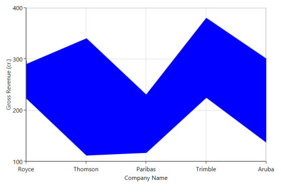

## RadarSeries

RadarSeries represents a collection of data, displayed by quantitative variables, represented on axes starting from the same point. The relative position and angle of the axes is not uniform. RadarSeries is useful when you want to look at several different factors, related to one item. RadarSeries have multiple axes along which data can be allotted. 

The following APIs are used in RadarSeries.

<table>
<tr>
<th>
Property</th><th>
Definition</th></tr>
<tr>
<td>
IsClosed</td><td>
Gets or sets the bool that describes the radar series need to close or not.</td></tr>
<tr>
<td>
DrawType</td><td>
Gets or sets the ChartSeriesDrawType that describes the series rendering type is Area or Line.</td></tr>
</table>



<syncfusion:RadarSeries x:Name="series1"    XBindingPath="CompanyName" YBindingPath="CompanyTurnOver" IsClosed="True" DrawType="Line" ItemsSource="{Binding CompanyDetails}">

</syncfusion:RadarSeries>



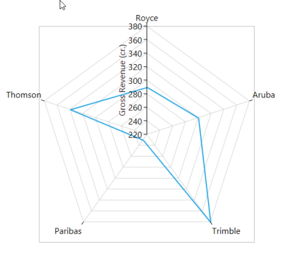

## PolarSeries

PolarSeries displays data points that are grouped by category, on a 360 degree circle. PolarSeries are most commonly used to plot polar data, where each point is determined by an angle and a distance. PolarSeries provides visual comparison between several quantitative or qualitative aspects of a situation. It also provides a visual comparison between several situations that are drawn using same axes.

The following APIs are used in PolarSeries.

<table>
<tr>
<th>
Property</th><th>
Definition</th></tr>
<tr>
<td>
IsClosed</td><td>
Gets or sets the bool that describes the polar series need to close or not.</td></tr>
<tr>
<td>
DrawType</td><td>
Gets or sets the ChartSeriesDrawType that describes the series rendering type as Area or Line.</td></tr>
</table>



<syncfusion:PolarSeries x:Name="series1"    XBindingPath="CompanyName" YBindingPath="CompanyTurnOver" IsClosed="True" DrawType="Line" ItemsSource="{Binding CompanyDetails}">

</syncfusion:PolarSeries>


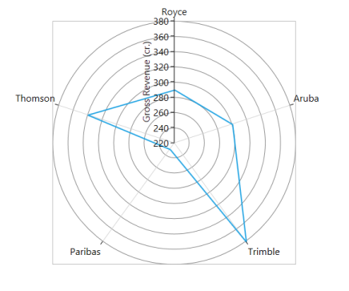

## HiLoSeries

In HiLoSeries, each segment is represented by a line. The height of the line depends on the value of the data point, high or low. HiLoSeries is primarily used in financial applications to show high and low price for a given stock.

The following APIs are used in HiLoSeries.

<table>
<tr>
<th>
Property</th><th>
       Definition</th></tr>
<tr>
<td>
High</td><td>
Gets or sets the string that describes high value in Y-axis.</td></tr>
<tr>
<td>
Low</td><td>
Gets or sets the string that describes low value in Y-axis.</td></tr>
</table>



<syncfusion:HiLoSeries x:Name="series1"    XBindingPath="CompanyName" High="CompanyTurnOver" Low="Value"  ItemsSource="{Binding CompanyDetails}">

</syncfusion:HiLoSeries>



## HiLoOpenCloseSeries

HiLoOpenCloseSeries displays each data point as a group of horizontal and one vertical line. The height of the vertical line depends on the difference between the high value and low value of the data point. The width of the horizontal lines depends on the time span interval. 

The line that indicates the open value is at the left side of the vertical line, and the line that indicates the closed value is at its right side. In addition to showing high and low value of the stock, open and close represent the stock’s opening and closing price, respectively.

The following APIs are used in HiLoOpenCloseSeries.

<table>
<tr>
<th>
Property</th><th>
Definition</th></tr>
<tr>
<td>
High</td><td>
Gets or sets the string that describes high value in Y-axis.</td></tr>
<tr>
<td>
Low</td><td>
Gets or sets the string that describes low value in Y-axis.</td></tr>
<tr>
<td>
Open</td><td>
Gets or sets the string that describes open value in Y-axis.</td></tr>
<tr>
<td>
Close</td><td>
Gets or sets the string that describes close value in Y-axis.</td></tr>
</table>



<syncfusion:HiLoOpenCloseSeries x:Name="series1"    XBindingPath="CompanyName" High="CompanyTurnOver" Low="Value" Open="Open" Close="Close" ItemsSource="{Binding CompanyDetails}">

</syncfusion:HiLoOpenCloseSeries>



## CandleSeries

CandleSeries displays each data point as a combination of a vertical column and a vertical line. The height of the vertical line represents the difference between high and low value of a data point, whereas the height of the vertical column represents the difference between open and close values of a data point. CandleSeries is most widely used in decision making places, like the stock market.

The following APIs are used in CandleSeries.

<table>
<tr>
<th>
Property</th><th>
  Definition</th></tr>
<tr>
<td>
High</td><td>
Gets or sets the string that describes high value in Y-axis.</td></tr>
<tr>
<td>
Low</td><td>
Gets or sets the string that describes low value in Y-axis.</td></tr>
<tr>
<td>
Open</td><td>
Gets or sets the string that describes open value in Y-axis.</td></tr>
<tr>
<td>
Close</td><td>
Gets or sets the string that describes close value in Y-axis.</td></tr>
<tr>
<td>
Bear Fill Color</td><td>
Represents the brush color for the segments that show stock price has gone up in measured time interval.</td></tr>
<tr>
<td>
Bull Fill Color</td><td>
Represents that brush color for the segments that show stock price has gone down in measured time interval.</td></tr>
</table>



<syncfusion:CandleSeries x:Name="series1" BearFillColor="Green" BullFillColor="Red"   XBindingPath="CompanyName"High="CompanyTurnOver" Low="Value" Open="Open" Close="Close" ItemsSource="{Binding CompanyDetails}">

</syncfusion:CandleSeries>



## FastLineBitmapSeries

FastLineBitmapSeries displays a series of line segments rendered using WritableBitmap. The advantage of FastLineBitmapSeries renders a million data point in a fraction of seconds.

The following APIs are used in FastLineBitmapSeries.

<table>
<tr>
<th>
Property</th><th>
 Definition</th></tr>
<tr>
<td>
EnableAntiAliasing</td><td>
Gets or sets the bool that is used to avoid jagged patterns in the line.</td></tr>
<tr>
<td>
StrokeDashArray</td><td>
Gets or sets a collection of Double values that indicates the pattern of dashes and gaps that is used to outline shapes.</td></tr>
</table>



<syncfusion:FastLineBitmapSeries EnableAntiAliasing="True" ItemsSource="{Binding TestingModel}" XBindingPath="Year" YBindingPath="Open">

 </syncfusion:FastLineBitmapSeries>



## FastColumnBitmapSeries

FastColumnBitmapSeries displays a series of column segments rendered using WritableBitmap. The advantage of FastColumnBitmapSeries renders millions of data points in a fraction of seconds. FastColumnBitmapSeries is used to boost up the performance of the ColumnSeries.



<syncfusion:FastColumnBitmapSeries ItemsSource="{Binding TestingModel}" XBindingPath="Year" YBindingPath="Open">

</syncfusion:FastColumnBitmapSeries>



## FastScatterBitmapSeries

FastScatterBitmapSeries represents a series of points in the form of an ellipse, rendered using WritableBitmap. The advantage of FastScatterBitmapSeries is that it provides fast rendering of a million data points in a fraction of a second. If a large number of points in scatter series need to be rendered in a small amount of time, then it proves beneficial to use FastScatterBitmapSeries.

The following APIs are used in FastScatterBitmapSeries.

<table>
<tr>
<th>
Property</th><th>
    Definition</th></tr>
<tr>
<td>
ScatterWidth</td><td>
Gets or sets the suggested width of the FastScatterBitmapSeries.</td></tr>
<tr>
<td>
ScatterHeight</td><td>
Gets or sets the suggested height of the FastScatterBitmapSeries.</td></tr>
</table>



<syncfusion:FastScatterBitmapSeries ScatterHeight="15" ScatterWidth="15" ItemsSource="{Binding TestingModel}" XBindingPath="Year" YBindingPath="Open">

 </syncfusion:FastScatterBitmapSeries>



## FastStepLineBitmapSeries

FastStepLineSeries is similar to FastLineBitmapSeries, but it does not use the shortest distance to connect two data points. Instead, this ChartSeries uses vertical and horizontal lines to connect the data points in a series, forming a step-like progression. The advantage of using FastStepLineBitmapSeries is that a million points can be rendered in a fraction of seconds. The FastStepLineBitmapSeries is used in case there are a large number of points to be plotted. 

The following APIs are used in FastStepLineBitmapSeries.

<table>
<tr>
<th>
Property</th><th>
   Definition</th></tr>
<tr>
<td>
EnableAntiAliasing</td><td>
Gets or sets the bool that is used to avoid jagged patterns in the line.</td></tr>
</table>



<syncfusion:FastStepLineBitmapSeries EnableAntiAliasing="True"   ItemsSource="{Binding TestingModel}" XBindingPath="Year" YBindingPath="Open">

            </syncfusion:FastStepLineBitmapSeries>



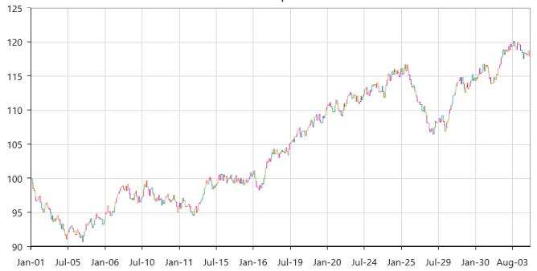

## FastBarBitmapSeries

FastBarBitmapSeries displays a series of bar segments rendered using WritableBitmap horizontally. The advantage of FastBarBitmapSeries is that it renders a million data points in a fraction of seconds. FastBarBitmapSeries is used to boost up the performance of the series.



<syncfusion:FastBarBitmapSeries ItemsSource="{Binding TestingModel}" XBindingPath="Year" YBindingPath="Open">

</syncfusion:FastBarBitmapSeries>



## FastHiLoBitmapSeries

FastHiLoBitmapSeries represents a series of line segments with high and low values rendered using WritableBitmap. FastHiLoBitmapSeries proves to be useful when a large collection of points need to be rendered in a short span of time.

The following APIs are used in FastHiLoBitmapSeries.

<table>
<tr>
<th>
 Property</th><th>
  Definition</th></tr>
<tr>
<td>
High</td><td>
Gets or sets the string that describes high value in Y-axis.</td></tr>
<tr>
<td>
Low</td><td>
Gets or sets the string that describes low value in Y-axis.</td></tr>
</table>



<syncfusion:FastHiLoBitmapSeries ItemsSource="{Binding TestingModel}" XBindingPath="Year" High="High"  Low="Low" >

 </syncfusion:FastHiLoBitmapSeries>



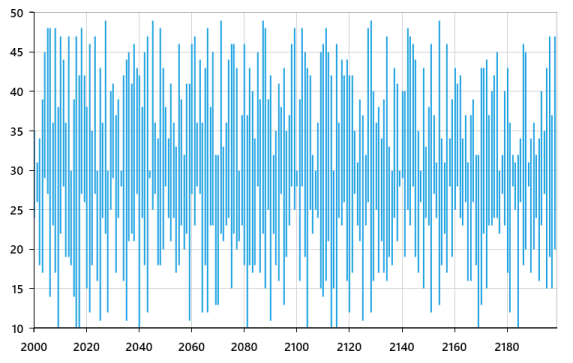

## FastHiLoOpenCloseBitmapSeries

FastHiLoOpenCloseBitmapSeries represents a series of vertical line segments with high and low values and horizontal line segments with open and close values. The segments in the FastHiLoOpenCloseBitmapSeries are rendered using WritableBitmap. FastHiLoOpenCloseBitmapSeries proves to be useful when a large collection of points are to be rendered in a short span of time.

The following APIs are used in FastHiLoOpenCloseBitmapSeries.

<table>
<tr>
<th>
Property</th><th>
  Definition</th></tr>
<tr>
<td>
High</td><td>
Gets or sets the string that describes high value in Y-axis.</td></tr>
<tr>
<td>
Low</td><td>
Gets or sets the string that describes low value in Y-axis.</td></tr>
<tr>
<td>
Open</td><td>
Gets or sets the string that describes open value in Y-axis.</td></tr>
<tr>
<td>
Close</td><td>
Gets or sets the string that describes close value in Y-axis.</td></tr>
</table>



<syncfusion:FastHiLoOpenCloseBitmapSeries ItemsSource="{Binding TestingModel}" XBindingPath="Year" High="High" Open="Open" Low="Low" Close="Close">

</syncfusion:FastHiLoOpenCloseBitmapSeries>



## FastCandleBitampSeries

FastCandleBitmapSeries renders using bitmap and it displays each data point as a combination of a vertical column and a vertical line, like CandleSeries. It used in applications with a high performance requirement.

The following APIs are used in FastCandleBitmapSeries.

<table>
<tr>
<th>
 Property</th><th>
   Definition</th></tr>
<tr>
<td>
High</td><td>
Gets or sets the string that describes high value in Y-axis.</td></tr>
<tr>
<td>
Low</td><td>
Gets or sets the string that describes low value in Y-axis.</td></tr>
<tr>
<td>
Open</td><td>
Gets or sets the string that describes open value in Y-axis.</td></tr>
<tr>
<td>
Close</td><td>
Gets or sets the string that describes close value in Y-axis.</td></tr>
<tr>
<td>
Bear Fill Color</td><td>
Represents the brush color for the segments that shows stock price has gone up in measured time interval.</td></tr>
<tr>
<td>
Bull Fill Color</td><td>
Represents that brush color for the segments that shows stock price has gone down in measured time interval.</td></tr>
</table>



<syncfusion:FastCandleBitmapSeries ItemsSource="{Binding TestingModel}" XBindingPath="Year" High="High" Open="Open" Low="Low" Close="Close">

</syncfusion:FastCandleBitmapSeries>



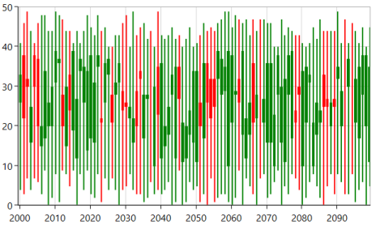

FastCandleBitmapSeries

## HistogramSeries

HistogramSeries is a collection of vertical columns drawn continuously at finite intervals. Each column in the series represents the frequency of an output factor value measured during a specific finite interval. HistogramSeries can be accompanied with a normal distribution curve over the vertical columns illustrating frequency distribution of the measuring factor. HistogramSeries is one of the seven basic tools of quality control. HistogramSeries is often used to plot the density of data.

The following APIs are used in HistogramSeries.

<table>
<tr>
<th>
Property</th><th>
   Definition</th></tr>
<tr>
<td>
HistogramInterval</td><td>
Gets or sets double that represent the interval value for HistogramSeries.</td></tr>
<tr>
<td>
ShowNormalDistributionCurve</td><td>
Gets or sets bool that represents a value whether to display normal distribution curve.</td></tr>
</table>



 <syncfusion:HistogramSeries ShowNormalDistributionCurve="True"

ItemsSource="{Binding power}" HistogramInterval="1"

XBindingPath="Year" YBindingPath="Sports"/>



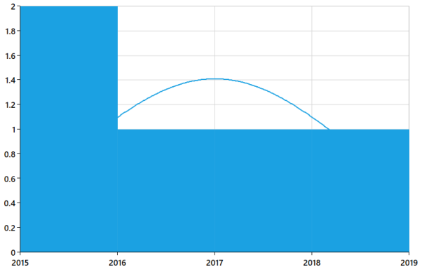

## ErrorBarSeries

ErrorBarSeries is a graphical representation used to indicate the errors or uncertainty in reported values. It is used to find possible variations in measurements, and in Chart control these values are displayed as data points.

SfChart supports four different types of ErrorBarSeries namely Fixed, Percentage, Standard Deviation and Standard Error.

The following properties are used to configure ErrorBarSeries.

<table>
<tr>
<th>
Property</th><th>
Description</th></tr>
<tr>
<td>
Type</td><td>
Gets or sets the ErrorBarType. This property is used to set the type of error to plot.</td></tr>
<tr>
<td>
Mode</td><td>
Gets or sets the ErrorBarMode. This property customizes the horizontal and vertical error bars.</td></tr>
<tr>
<td>
HorizontalErrorValue</td><td>
Gets or sets the double Value. This property will only work in Fixed and Percentage type errors.</td></tr>
<tr>
<td>
VerticalErrorValue</td><td>
Used to get or set the Vertical Error Value. This property will only work in Fixed and Percentage type errors.</td></tr>
<tr>
<td>
HorizontalErrorPath</td><td>
Gets or sets the HorizontalErrorMember path. This property defines the member of the ItemsSource collection and it works only in Custom Type of Error Bar.</td></tr>
<tr>
<td>
VerticalErrorPath</td><td>
Get or set the VerticalErrorMember path. This property defines the member of the ItemsSource collection and it  works only in a Custom Type of Error Bar.</td></tr>
<tr>
<td>
HorizontalLineStyle</td><td>
Gets or sets the HorizontalLineStyle used by this series when it is rendered.</td></tr>
<tr>
<td>
VerticalLineStyle</td><td>
Gets or sets the VerticalLineStyle used by this series when it is rendered</td></tr>
<tr>
<td>
HorizontalCapLineStyle</td><td>
Gets or sets the HorizontalCapLineStyle used by this series when it is rendered</td></tr>
<tr>
<td>
VerticalCapLineStyle</td><td>
Gets or sets the VerticalCapLineStyle used by this series when it is rendered</td></tr>
</table>

### Fixed

Fixed value means each error bar is placed at a constant distance from the data value. This error value corresponds to axis coordinates.

The following screenshot is an example of a Fixed value type.

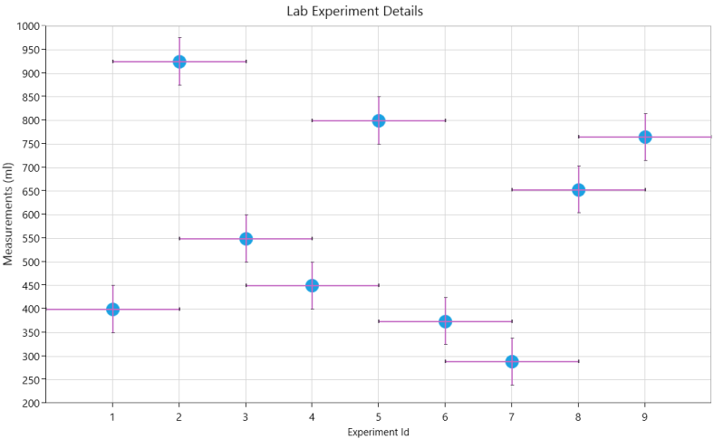



<syncfusion:ErrorBarSeries Name="Errorseries"   ItemsSource="{Binding EnergyProductions}" XBindingPath="ID" YBindingPath="Coal"  HorizontalErrorPath="HorizontalErrorValue" VerticalErrorPath="VerticalErrorValue"    VerticalErrorValue="50" HorizontalErrorValue="1" 

 Mode="Both" Type="Fixed" >

### Percentage

Percentage means the error bar is drawn with the percentage value of the error value to the datapoint.



 <syncfusion:ErrorBarSeries Name="Errorseries" ItemsSource="{Binding EnergyProductions}" XBindingPath="ID" YBindingPath="Coal" HorizontalErrorPath="HorizontalErrorValue" VerticalErrorPath="VerticalErrorValue" VerticalErrorValue="50" HorizontalErrorValue="1" Mode="Both" Type="Percentage" />

The following screenshot is an example of Percentage type.

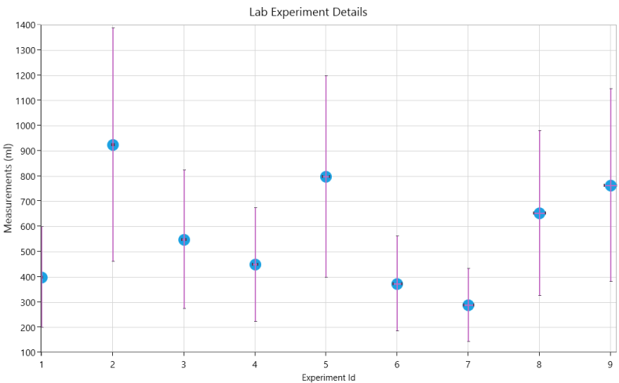

### Standard Deviation

Standard Deviation means that each end of the error bar is placed at a distance N times the standard deviation in user scale units from the computed value.

 <syncfusion:ErrorBarSeries Name="Errorseries"   ItemsSource="{Binding EnergyProductions}" XBindingPath="ID" YBindingPath="Coal" HorizontalErrorPath="HorizontalErrorValue" VerticalErrorPath="VerticalErrorValue"   VerticalErrorValue="50" HorizontalErrorValue="1" Mode="Both" Type="StandardDeviation" />



The following screenshot is an example of Standard Deviation Error Bars.

### Standard Errors

Standard Errors mean that the placement of each end of the error bar corresponds to the standard error of the data point.

<syncfusion:ErrorBarSeries Name="Errorseries"   ItemsSource="{Binding EnergyProductions}" XBindingPath="ID" YBindingPath="Coal"  HorizontalErrorPath="HorizontalErrorValue" VerticalErrorPath="VerticalErrorValue"    VerticalErrorValue="50" HorizontalErrorValue="1" 

Mode="Both" Type="StandardErrors" >

The following screenshot is an example of StandardErrors.

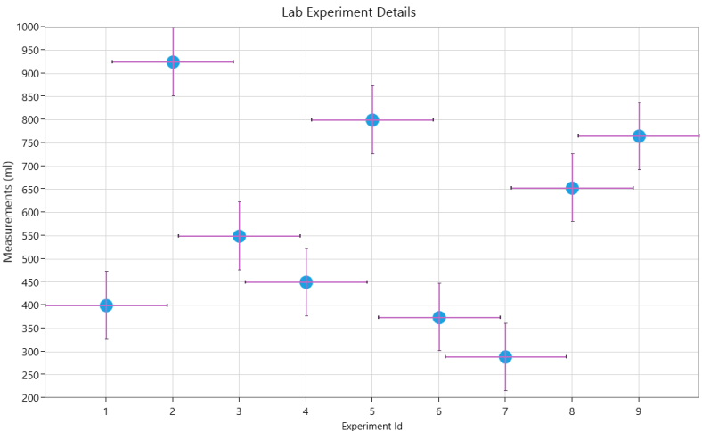

