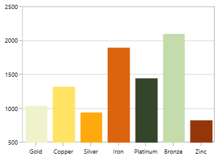
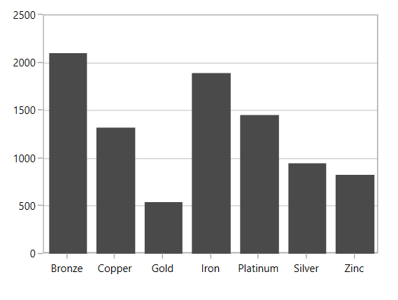
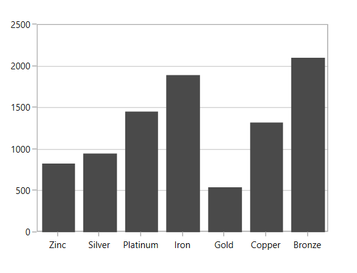
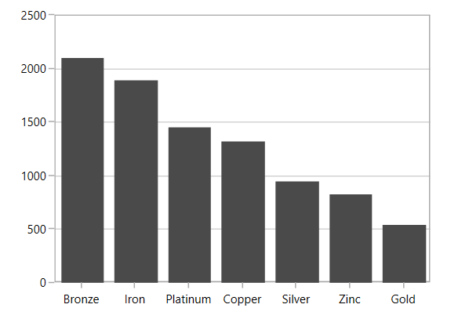
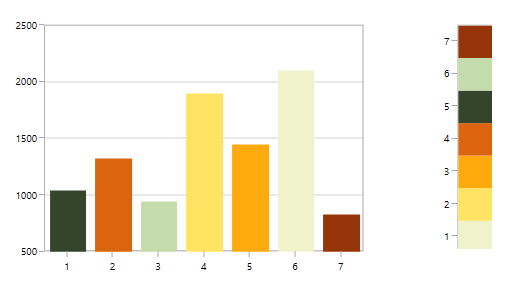

# Sorting

Chart provides the support for sorting the data point either in ascending or descending based on X or Y axis.

### Enable Sorting
This [`IsSortData`](http://help.syncfusion.com/cr/cref_files/wpf/sfchart/Syncfusion.SfChart.WPF~Syncfusion.UI.Xaml.Charts.ChartSeriesBase~IsSortData.html) property used to enable the sorting in series.

### Changing sorting direction

The [`SortDirection`](http://help.syncfusion.com/cr/cref_files/wpf/sfchart/Syncfusion.SfChart.WPF~Syncfusion.UI.Xaml.Charts.ChartSeriesBase~SortDirection.html) property defines the direction of sorting either in Ascending or Descending based on x or y value.

### Changing sorting axis

This [`SortBy`](http://help.syncfusion.com/cr/cref_files/wpf/sfchart/Syncfusion.SfChart.WPF~Syncfusion.UI.Xaml.Charts.ChartSeriesBase~SortBy.html) property decides whether sorting should be done based on x or y values.

The following example illustrates a simple chart (without apply sorting):

## Sorting for category(non-linear) axis

**Sorting x axis in ascending order**:


<syncfusion:ColumnSeries IsSortData="True" SortBy="X"  
	
	                     SortDirection="Ascending"

                         ItemsSource="{Binding Demands}" Interior="#4A4A4A"

                         XBindingPath="Demand"  YBindingPath="Year2011"/>



**Sorting x axis in descending order**:



<syncfusion:ColumnSeries IsSortData="True" SortBy="X"  
	 
	                     SortDirection="Descending"

                         ItemsSource="{Binding Demands}" Interior="#4A4A4A"

                         XBindingPath="Demand"  YBindingPath="Year2011"/>



**Sorting y axis in ascending order**:



<syncfusion:ColumnSeries IsSortData="True" SortBy="Y" 
	                   
					     SortDirection="Ascending"

                         ItemsSource="{Binding Demands}" Interior="#4A4A4A"

                         XBindingPath="Demand"  YBindingPath="Year2011"/>



**Sorting y axis in descending order**:



<syncfusion:ColumnSeries IsSortData="True" SortBy="Y"  
	
	                     SortDirection="Descending"

                         ItemsSource="{Binding Demands}" Interior="#4A4A4A"

                         XBindingPath="Demand"  YBindingPath="Year2011"/>



N> This feature is primarily applicable for indexed (non-linear) axis like CategoryAxis. For linear axis like NumericalAxis, only the order of rendering will be sorted. i.e., the order in which the data point is being rendered.

## Sorting for linear axis

As mentioned above, the sorting for the linear axis is different from CategoryAxis. Here the rendering order of the data point (x or y) will be sorted.

This will be useful especially when we have one or more values added in same data point. Also this rendering order will be captured by applying Palette to each point.

The following example illustrates a simple chart having AutumnBrights palette (without apply sorting):

**Sorting x axis in ascending order**



<syncfusion:ColumnSeries IsSortData="True" SortBy="X" Palette="AutumnBrights"

                         SortDirection="Ascending"

                         ItemsSource="{Binding Demands}" 

                         XBindingPath="Position"  YBindingPath="Year2011"/>



**Sorting x axis in descending order**



<syncfusion:ColumnSeries IsSortData="True" SortBy="X" 
	
	                     Palette="AutumnBrights"

                         SortDirection="Descending"

                         ItemsSource="{Binding Demands}" 

                         XBindingPath="Position"  YBindingPath="Year2011"/>



**Sorting y axis in ascending order**


<syncfusion:ColumnSeries IsSortData="True" SortBy="Y" 
	
	                     Palette="AutumnBrights"

                         SortDirection="Ascending"

                         ItemsSource="{Binding Demands}" 

                         XBindingPath="Position"  YBindingPath="Year2011"/>



**Sorting y axis in descending order**


<syncfusion:ColumnSeries IsSortData="True" SortBy="Y" 
	
	                     Palette="AutumnBrights"

                         SortDirection="Descending"

                         ItemsSource="{Binding Demands}" 

                         XBindingPath="Position"  YBindingPath="Year2011"/>



