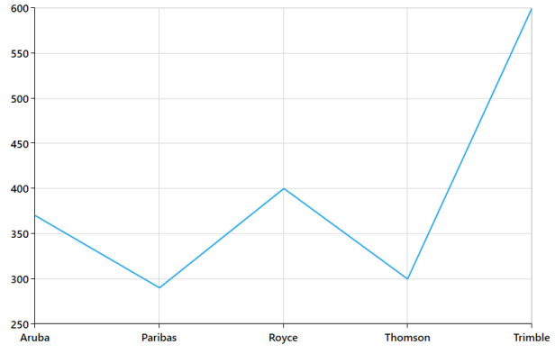

# Sorting 

Chart data can either be sorted or unsorted. You can turn on the Sorting feature when you want the data to be sorted, in ChartSeries by enabling the IsSortData property. Sorting in a series can be performed in different ways by specifying a sorting axis using the SortBy property and the SortDirection property.

The following code example explains how to perform the Sorting operation in Chart.

[XAML]

<syncfusion:LineSeries Label="Series1" IsSortData="True" SortBy="X"                 

                  SortDirection="Descending"  

                  ItemsSource="{Binding CompanyDetails}" 

                  XBindingPath="CompanyName"        YBindingPath="CompanyTurnOver"/>

            &lt;/syncfusion:SfChart&gt;

{  | markdownify }
{:.image }

The following code example and screenshot demonstrate Sorting in Ascending order.

[XAML]

<syncfusion:LineSeries Label="Series1" IsSortData="True" SortBy="X"                 

          SortDirection="Ascending" ItemsSource="{Binding CompanyDetails}" 

          XBindingPath="CompanyName" YBindingPath="CompanyTurnOver"/>

&lt;/syncfusion:SfChart&gt;

{  | markdownify }
{:.image }

