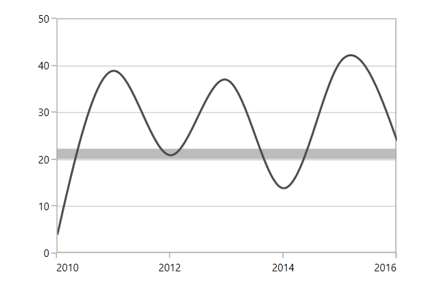
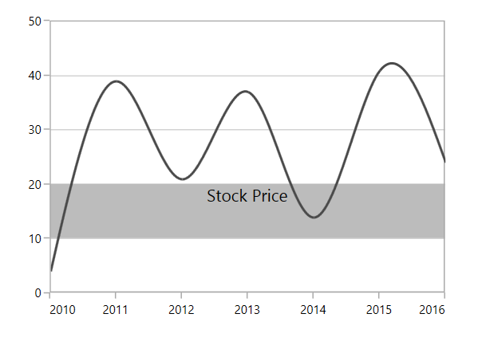
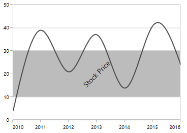
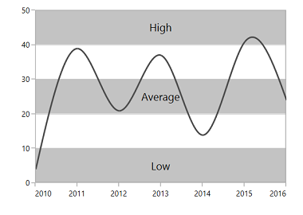
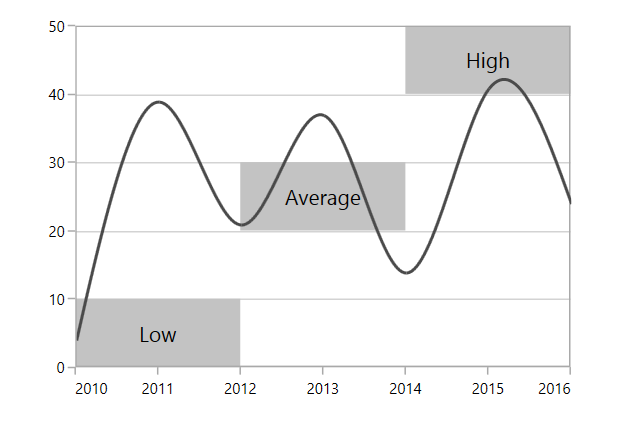
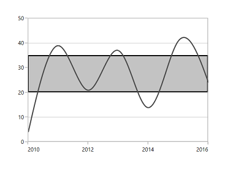

# Striplines

SfChart allows you to add Striplines to the chart, which shades the specific region or range in the plot area background at regular or custom intervals. 

## Positioning the Striplines

SfChart provides [`Start`](http://help.syncfusion.com/cr/cref_files/wpf/sfchart/Syncfusion.SfChart.WPF~Syncfusion.UI.Xaml.Charts.ChartStripLine~Start.html#) and [`Width`](http://help.syncfusion.com/cr/cref_files/wpf/sfchart/Syncfusion.SfChart.WPF~Syncfusion.UI.Xaml.Charts.ChartStripLine~Width.html#) property for defining the Stripline start and end range. These values correspond to the axis values (or range). The Stripline can be filled using brush set in [`Background`](http://help.syncfusion.com/cr/cref_files/wpf/sfchart/Syncfusion.SfChart.WPF~Syncfusion.UI.Xaml.Charts.ChartStripLine~Background.html#) property.



<syncfusion:SfChart.SecondaryAxis>

<syncfusion:NumericalAxis >

<syncfusion:NumericalAxis.StripLines>

<syncfusion:ChartStripLine Start="20" Width="10"  Background="#BCBCBC"/>

</syncfusion:NumericalAxis.StripLines>

</syncfusion:NumericalAxis>

</syncfusion:SfChart.SecondaryAxis>



### Position based on device coordinates

You can specify the stripline width in pixel by enabling [`IsPixelWidth`](http://help.syncfusion.com/cr/cref_files/wpf/sfchart/Syncfusion.SfChart.WPF~Syncfusion.UI.Xaml.Charts.ChartStripLine~IsPixelWidth.html#) Boolean property. By default, this property value is false.

The following code example illustrates the positioning of stripline based on pixels.



<syncfusion:SfChart.SecondaryAxis>

<syncfusion:NumericalAxis >

<syncfusion:NumericalAxis.StripLines>

<syncfusion:ChartStripLine Start="20" Width="10"  

IsPixelWidth="True" Background="#BCBCBC"/>

</syncfusion:NumericalAxis.StripLines>

</syncfusion:NumericalAxis>

</syncfusion:SfChart.SecondaryAxis>



## Label 

We can define any text inside the stripline using [`Label`](http://help.syncfusion.com/cr/cref_files/wpf/sfchart/Syncfusion.SfChart.WPF~Syncfusion.UI.Xaml.Charts.ChartStripLine~Label.html#) property. Also SfChart provide various customization options for this label like alignment, templates, etc.

The [`LabelHorizontalAlignment`](http://help.syncfusion.com/cr/cref_files/wpf/sfchart/Syncfusion.SfChart.WPF~Syncfusion.UI.Xaml.Charts.ChartStripLine~LabelHorizontalAlignment.html#) and [`LabelVerticalAlignment`](http://help.syncfusion.com/cr/cref_files/wpf/sfchart/Syncfusion.SfChart.WPF~Syncfusion.UI.Xaml.Charts.ChartStripLine~LabelVerticalAlignment.html#) property can be used for positioning the labels inside the stripline.



<syncfusion:SfChart.SecondaryAxis>

<syncfusion:NumericalAxis>              

<syncfusion:NumericalAxis.StripLines>

<syncfusion:ChartStripLine Start="10" Width="10"  

Label="Stock Price" 

LabelHorizontalAlignment="Center" 

LabelVerticalAlignment="Top"

Background="#BCBCBC"/>

</syncfusion:NumericalAxis.StripLines>

</syncfusion:NumericalAxis>

</syncfusion:SfChart.SecondaryAxis>



### Rotating the label

The label can be rotated to the specified angle using [`LabelAngle`](http://help.syncfusion.com/cr/cref_files/wpf/sfchart/Syncfusion.SfChart.WPF~Syncfusion.UI.Xaml.Charts.ChartStripLine~LabelAngle.html#) property. The following code example explains the rotation of stripline label:



<syncfusion:SfChart.SecondaryAxis>

<syncfusion:NumericalAxis>     

<syncfusion:NumericalAxis.StripLines>

<syncfusion:ChartStripLine Start="10" Width="20"  

Label="Stock Price" 

LabelAngle="-45"

Background="#BCBCBC"/>

</syncfusion:NumericalAxis.StripLines>

</syncfusion:NumericalAxis>

</syncfusion:SfChart.SecondaryAxis>



N> Here, Start and Width of the stripline as adjusted based on the rotation angle. Stripline won’t adjust its range based on the stripline angle.

### Template support for the label

[`LabelTemplate`](http://help.syncfusion.com/cr/cref_files/wpf/sfchart/Syncfusion.SfChart.WPF~Syncfusion.UI.Xaml.Charts.ChartStripLine~LabelTemplate.html#) property allows you to define the data template for the stripline label like the following code example.



<syncfusion:NumericalAxis>

<syncfusion:NumericalAxis.StripLines>

<syncfusion:ChartStripLine Width="20"

Start="10" 

Label="Stock Price" 

Background="#C3C3C3">

<syncfusion:ChartStripLine.LabelTemplate>

<DataTemplate >

<Border Background="Gray" CornerRadius="5" >

<TextBlock Text="{Binding }" Foreground="White"

FontStyle="Normal" FontSize="10" FontWeight="Bold"

Margin="3">

</TextBlock>                                        

</Border>

</DataTemplate>

</syncfusion:ChartStripLine.LabelTemplate>

</syncfusion:ChartStripLine>

</syncfusion:NumericalAxis.StripLines>

</syncfusion:NumericalAxis>



## Multiple Striplines

You can add multiple number of striplines in the same axis like the following code example,



<syncfusion:SfChart.SecondaryAxis>

<syncfusion:NumericalAxis >

<syncfusion:NumericalAxis.StripLines>

<syncfusion:ChartStripLine 

SegmentStartValue="0" 

Width="10" 

Start="0" Label="Low" Background="#C3C3C3"/>

<syncfusion:ChartStripLine 

Width="10" Start="20"

Label="Average" Background="#C3C3C3"/>

<syncfusion:ChartStripLine 

Width="10" 

Start="40" Label="High" Background="#C3C3C3"/>

</syncfusion:NumericalAxis.StripLines>

</syncfusion:NumericalAxis>

</syncfusion:SfChart.SecondaryAxis>



If you want to repeat the same type of stripline at regular intervals, SfChart provides two properties[`RepeatEvery`](http://help.syncfusion.com/cr/cref_files/wpf/sfchart/Syncfusion.SfChart.WPF~Syncfusion.UI.Xaml.Charts.ChartStripLine~RepeatEvery.html#) and [`RepeatUntil`](http://help.syncfusion.com/cr/cref_files/wpf/sfchart/Syncfusion.SfChart.WPF~Syncfusion.UI.Xaml.Charts.ChartStripLine~RepeatUntil.html#).

N> This can be used to fill plot area background alternatively.



<syncfusion:NumericalAxis.StripLines>

<syncfusion:ChartStripLine RepeatEvery="20" RepeatUntil="50"

Width="10"  Start="0" Background="#C3C3C3"/>

<syncfusion:ChartStripLine RepeatEvery="20" RepeatUntil="50"

Width="10"  Start="10" Background="#A3A3A3"/>

</syncfusion:NumericalAxis.StripLines>



## Segmented Stripline

Striplines can also be placed in a particular region with respect to segment. You can enable the segment striplines using [`IsSegmented`](http://help.syncfusion.com/cr/cref_files/wpf/sfchart/Syncfusion.SfChart.WPF~Syncfusion.UI.Xaml.Charts.ChartStripLine~IsSegmented.html#) property.

So the start and end value of this type of striplines can be defined using [`SegmentStartValue`](http://help.syncfusion.com/cr/cref_files/wpf/sfchart/Syncfusion.SfChart.WPF~Syncfusion.UI.Xaml.Charts.ChartStripLine~SegmentStartValue.html#) and [`SegmentEndValue`](http://help.syncfusion.com/cr/cref_files/wpf/sfchart/Syncfusion.SfChart.WPF~Syncfusion.UI.Xaml.Charts.ChartStripLine~SegmentEndValue.html#) property.

The following code example demonstrates segmented striplines.



<syncfusion:SfChart.SecondaryAxis>

<syncfusion:NumericalAxis >

<syncfusion:NumericalAxis.StripLines>

<syncfusion:ChartStripLine 

IsSegmented="True" SegmentStartValue="0" 

Width="10" SegmentEndValue="2"                                               

SegmentAxisName="Segment1"  

Start="0" Label="Low" Background="#C3C3C3"/>

<syncfusion:ChartStripLine 

IsSegmented="True" SegmentStartValue="2"

SegmentAxisName="Segment2"  

Width="10" SegmentEndValue="4" Start="20"

Label="Average" Background="#C3C3C3"/>

<syncfusion:ChartStripLine 

IsSegmented="True" SegmentStartValue="4" 

Width="10" SegmentEndValue="6" 

SegmentAxisName="Segment3"  

Start="40" Label="High" Background="#C3C3C3"/>

</syncfusion:NumericalAxis.StripLines>

</syncfusion:NumericalAxis>

</syncfusion:SfChart.SecondaryAxis>



## Customization

The background, border brush and border thickness of the stripline can be modified using [`Background`](http://help.syncfusion.com/cr/cref_files/wpf/sfchart/Syncfusion.SfChart.WPF~Syncfusion.UI.Xaml.Charts.ChartStripLine~Background.html#), [`BorderBrush`](http://help.syncfusion.com/cr/cref_files/wpf/sfchart/Syncfusion.SfChart.WPF~Syncfusion.UI.Xaml.Charts.ChartStripLine~BorderBrush.html#) and [`BorderThickness`](http://help.syncfusion.com/cr/cref_files/wpf/sfchart/Syncfusion.SfChart.WPF~Syncfusion.UI.Xaml.Charts.ChartStripLine~BorderThickness.html#) properties  as in the following code example.



<syncfusion:SfChart.SecondaryAxis>

<syncfusion:NumericalAxis >

<syncfusion:NumericalAxis.StripLines>

<syncfusion:ChartStripLine Start="20" Width="15"   

BorderBrush="Black" 

BorderThickness="2"

Background="#C3C3C3"/>

</syncfusion:NumericalAxis.StripLines>

</syncfusion:NumericalAxis>

</syncfusion:SfChart.SecondaryAxis>



### Transparency 

You can set the transparency for the striplines using `Opacity` property as in the following code snippets.



<syncfusion:SfChart.SecondaryAxis>

<syncfusion:NumericalAxis >

<syncfusion:NumericalAxis.StripLines>

<syncfusion:ChartStripLine Start="25" Width="15" 

Opacity="0.4" Background="#C3C3C3"/>

</syncfusion:NumericalAxis.StripLines>

</syncfusion:NumericalAxis>

</syncfusion:SfChart.SecondaryAxis>

<syncfusion:SfChart.Watermark>

<syncfusion:Watermark >

<syncfusion:Watermark.Content>

<TextBlock Text="StockValue">

<TextBlock.RenderTransform>

<RotateTransform Angle="345"/>

</TextBlock.RenderTransform>                        

</TextBlock>

</syncfusion:Watermark.Content>

</syncfusion:SfChart.Watermark>



