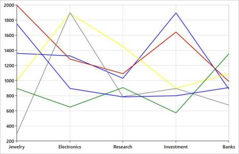
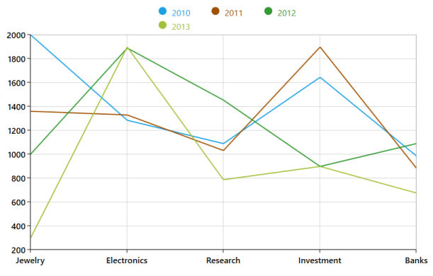
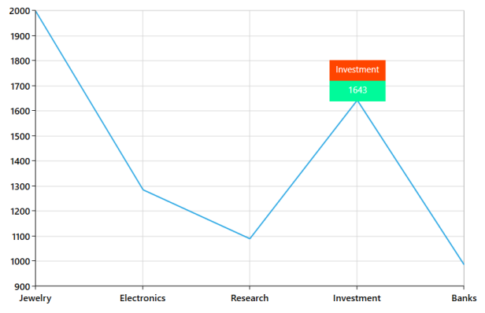

# Styling and Customization

SfChart support various customizing and styling options that allows you to enrich the application. 

## Palettes

SfChart provides options to apply different kinds of themes or palettes to your chart. You can define Palette either for the entire chart or for an individual series. 

We have some predefined palette such as

* Metro
* AutumnBrights
* FloraHues
* Pineapple
* TomotoSpectrum
* RedChrome
* PurpleChrome
* BlueChrome
* GreenChrome
* Elite
* LightCandy
* SandyBeach

Note: Elite, SandyBeach and LightCandy palettes are not supported in the bitmap series types.

The Palette brushes defined in the chart are applied to the series, to differentiate each of them. Likewise, series palette brushes are applied for each segment in a particular series.

###Applying predefined Palettes for each series

The following section shows you how to define the various palettes for each series.

###Metro Palette

Itis the default palette for SfChart, used to apply a set of predefined brushes to the series, in a predefined order. The following code example illustrates how to set the MetroPalette for the chart.



<syncfusion:SfChart HorizontalAlignment="Center" VerticalAlignment="Center" Height="400"Width="650" Palette="Metro" />

The following is the screenshot for the series with multiple palettes.

###Custom palettes for each series

The Custom Palette option enables you to define your own color brushes for the Palette using ColorModel property as given in the following code example.



     <syncfusion:SfChart HorizontalAlignment="Center" VerticalAlignment="Center"Height="400" Width="650"

                            Palette="Custom">

            <syncfusion:SfChart.ColorModel>

                <syncfusion:ChartColorModel>

                    <syncfusion:ChartColorModel.CustomBrushes>

                        <SolidColorBrush Color="Green"/>

                        <SolidColorBrush Color="Blue"/>

                        <SolidColorBrush Color="Red" />

                        <SolidColorBrush Color="Yellow"/>

                        <SolidColorBrush Color="Gray"/>

                    </syncfusion:ChartColorModel.CustomBrushes>

                </syncfusion:ChartColorModel>

            </syncfusion:SfChart.ColorModel>

        </syncfusion:SfChart>



The following screenshot demonstrates series with CustomPalette.

###None Palette

This palette sets the transparent color to the series. You can identify the series existence with the help of [legends](http://help.syncfusion.com/winrt/sfchart/legend) or [adornments](http://help.syncfusion.com/wpf/sfchart/adornments).

###Applying predefined Palette for each segment

The following section shows you how to define the various palettes for each segment of a series.

###Metro Palette

It is the default palette for series also. This palette applies a set of predefined brushes to the segments of a series in a predefined order. The following code example shows you how to set the Metro Palette for the chart series.



     <syncfusion:LineSeries Label="2010" Palette="Metro"

                                     ItemsSource="{Binding Demands}"

                                     XBindingPath="Demand"

                                     YBindingPath="Year2010"

                                     />



###None Palette

It applies the same color to all the segments, as shown in the following screenshot. And the brushes vary for additional series based on that predefined order.

###Applying Custom Palette for each segment

The Custom Palette option enables you to define your own color brushes for the Palette, using ColorModel as shown in the following code example.



<syncfusion:LineSeries Label="2010" Palette="Custom"

                                     ItemsSource="{Binding Demands}"

                                     XBindingPath="Demand"

                                     YBindingPath="Year2010"

                                     >

            <syncfusion:LineSeries.ColorModel>

                <syncfusion:ChartColorModel >

                    <syncfusion:ChartColorModel.CustomBrushes>

                        <SolidColorBrush Color="Green"/>

                        <SolidColorBrush Color="Blue"/>

                        <SolidColorBrush Color="Red" />

                        <SolidColorBrush Color="Yellow"/>

                        <SolidColorBrush Color="Gray"/>

                    </syncfusion:ChartColorModel.CustomBrushes>

                </syncfusion:ChartColorModel>

            </syncfusion:LineSeries.ColorModel>

        </syncfusion:LineSeries>



## Customize Legends

SfChart provides you with the option to customize the legends depending on the application’s requirement.



<syncfusion:SfChart.Legend>

<syncfusion:ChartLegend>

<!-- Custom panel for legend items-->

<syncfusion:ChartLegend.ItemsPanel>

<ItemsPanelTemplate >

<WrapPanel  Width="300"/>

</ItemsPanelTemplate>

</syncfusion:ChartLegend.ItemsPanel>

<!--Custom template for legend item-->

<syncfusion:ChartLegend.ItemTemplate>

<DataTemplate>

<Grid>

<Grid.ColumnDefinitions>

<ColumnDefinition/>

<ColumnDefinition/>

</Grid.ColumnDefinitions>

<!--For Legend icon-->

<Ellipse Margin="35,0,0,0"  Width="15" Height="15" Fill="{Binding Interior}"></Ellipse>

<!--For Legend label-->

<TextBlock Margin="10,5,5,0" FontSize="16" Grid.Column="1" Foreground="{Binding Interior}" Text="{Binding Label}"></TextBlock>

</Grid>

</DataTemplate>

</syncfusion:ChartLegend.ItemTemplate>

</syncfusion:ChartLegend>

</syncfusion:SfChart.Legend>

</Grid>



## Customize Series

You can use the CustomTemplate property to customize the series of the SfChart. This support is available for the following series:

* [LineSeries](http://help.syncfusion.com/wpf/sfchart/series#lineseries)
* [BubbleSeries](http://help.syncfusion.com/wpf/sfchart/series#bubbleseries)
* [ScatterSeries](http://help.syncfusion.com/wpf/sfchart/series#scatterseries)
* [ColumnSeries](http://help.syncfusion.com/wpf/sfchart/series#columnseries)
* [BarSeries](http://help.syncfusion.com/wpf/sfchart/series#barseries)
* [SplineSeries](http://help.syncfusion.com/wpf/sfchart/series#splineseries)
* [StepLineSeries](http://help.syncfusion.com/wpf/sfchart/series#steplineseries)
* [StackingColumnSeries](http://help.syncfusion.com/wpf/sfchart/series#stackingcolumnseries)
* [StackingBarSeries](http://help.syncfusion.com/wpf/sfchart/series#stackingbarseries)
* [Stackingcolumn100Series](http://help.syncfusion.com/wpf/sfchart/series#stackingcolumn100series)
* [StackingBar100Series](http://help.syncfusion.com/wpf/sfchart/series#stackingbar100series)

By using this feature, you can draw custom shapes for the above types of series. Define the DataTemplate for the CustomTemplate and this template is applied to each segment (data point) of the series. 

In this DataTemplate, the respective Segments come as DataContext. For instance, when the CustomTemplate is defined for the LineSeries, the LineSegment comes as data context that is useful for binding the series properties like Fill, Y value, Height, Width, etc.

The following table illustrates the properties available in the corresponding segment class of the series.

### Properties in the segment class

<table>
<tr>
<th>
Series Types</th><th>
Properties</th><th>
Description</th></tr>
<tr>
<td>
LineSeries </td><td>
X1, Y1, X2, Y2</td><td>
These properties define the two points for drawing that line segment.</td></tr>
<tr>
<td>
BubbleSeries</td><td>
Size, RectX, RectY</td><td>
The Size defines the pixel size of each BubbleSegment. The RectX and RectY define the pixel positions where each segment plots.</td></tr>
<tr>
<td>
ScatterSeries,</td><td rowspan = "3">
Height, Width, RectX, RectY</td><td rowspan = "3">
The Height and Width define the size of that particular segment.The RectX and RectY define the pixel positions where each segment plots.</td></tr>
<tr>
<td>
ColumnSeries,StackingColumn,StackingColumn100</td></tr>
<tr>
<td>
BarSeriesStackingBarStackingBar100</td></tr>
<tr>
<td>
SplineSeries</td><td>
P1, P2Q1, Q2Data</td><td>
The P1 and P2 define the starting and ending points of that segment. The Q1 and Q2 defines the control points for the spline (Bezier curve).The Data gives the geometric path of that spline segment.</td></tr>
<tr>
<td>
StepLineSeries</td><td>
X1, Y1, X2,Y2,X3,Y3Points</td><td>
The X1, Y1, and X2, Y2 are the start and end points of that segment and X3 and Y3 represent step points that are useful to draw Waterfall like charts.The Points represent the point collection of the step line segment.</td></tr>
</table>

Other than the above properties, all the segments have the following properties like a metadata for the datapoint and series.

XData - This property returns the actual X value of that particular segment.  

YData - This property returns the actual Y value of that particular segment. 

Item - This gives the underlying model object, so that you can get any property other than X and Y values.

Interior - This property gives the fill brush for that particular segment.

The following code example illustrates the use of CustomTemplate property.



 <syncfusion:ScatterSeries ItemsSource="{Binding Demands}"

                XBindingPath="Demand" ScatterHeight="40"

                YBindingPath="Year2010" ScatterWidth="40">

<syncfusion:ScatterSeries.CustomTemplate> 

<DataTemplate>

    <Canvas>

       <Path Data="M20.125,32l0.5,12.375L10.3125,

        12.375L10.3125,0.5L29.9375,0.5L29.9375,

        12.375L39.75,12.375Z" Stretch="Fill"

        Fill="{Binding Interior}"

        Height="{Binding ScatterHeight}"   

        Width="{Binding ScatterWidth}" 

        Canvas.Left="{Binding RectX}" 

        Canvas.Top="{Binding RectY}"/>

    </Canvas>

</DataTemplate>

</syncfusion:ScatterSeries.CustomTemplate>

</syncfusion:ScatterSeries>



The following screenshot represents chart scatter series. By default, that series displays Ellipse symbol. By using the Custom Template feature, it can be changed to arrow shape:

## Customize Tooltip

SfChart provides the option to define your own template for Tooltip, based on your application’s requirement. The following code example demonstrates the CustomTooltip using the TooltipTemplate property.



	<syncfusion:LineSeries Label="2010" 

	ItemsSource="{Binding Demands}"

	XBindingPath="Demand"

	YBindingPath="Year2010" ShowTooltip="True"

	Palette="None">
	

	<syncfusion:LineSeries.TooltipTemplate>

	<DataTemplate>	

	<Grid >

	<StackPanel HorizontalAlignment="Right">

	<Grid Background="OrangeRed">

	<TextBlock Text="{Binding Item.Demand }" Width="85" Height="25" Margin="5"

	VerticalAlignment="Center"    TextAlignment="Center"  Foreground="White" FontSize="15"/>

	</Grid>	

	<Grid Background="MediumSpringGreen">

	<TextBlock VerticalAlignment="Center" TextAlignment="Center" Margin="5" Text="{Binding YData}" Height="25"

	Width="85" HorizontalAlignment="Center" Foreground="White" FontSize="15"/>

	</Grid>	

	</StackPanel>

	</Grid>

	</DataTemplate>

	</syncfusion:LineSeries.TooltipTemplate>
	

	</syncfusion:LineSeries>



The following screenshot illustrates custom Tooltip.

