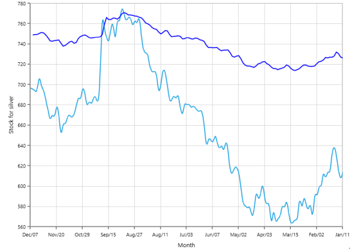
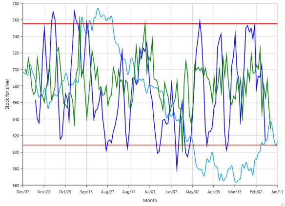
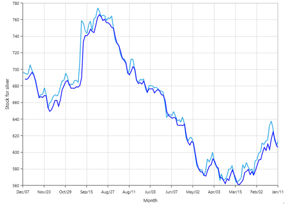
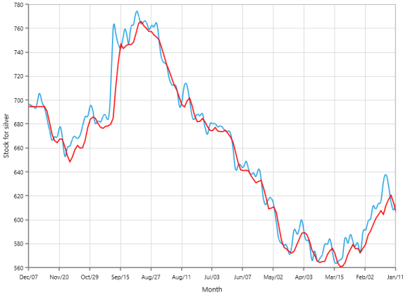

# Technical Indicators

Technical indicators are the base of technical analysis, used to determine the future of financial, stock or economic trends. Indicators serve three broad functions: to alert, to confirm and to predict actions. Future price levels can be predicted easily with the help of given data and it helps when you want to enter or exit a trade and to be able to make a profit.

Adding Technical Indicators to the Chart

This example shows how to add technical indicators to a Chart Series. To add technical indicators to the chart, do the following.

Adding Indicator

Create the instance for any technical indicator and add it to the TechnicalIndicators collection. Here for instance, the AccumulationDistributionIndicator is used.

[XAML]

<syncfusion:SfChart.TechnicalIndicators>

            <syncfusion:AccumulationDistributionIndicator/>

        </syncfusion:SfChart.TechnicalIndicators>       

Binding the data

The data necessary for the indicator to do calculations, are given as specified.

[XAML]

<syncfusion:SfChart.TechnicalIndicators>

            <syncfusion:AccumulationDistributionIndicator High="High" Low="Low" Open="Open" Close="Close"/>

        </syncfusion:SfChart.TechnicalIndicators>

Specifying the Item Source

Finally, the XBindingPath, YBindingPath and the ItemSource are specified to plot and visualize the chart.

[XAML]

<syncfusion:SfChart.TechnicalIndicators>

            <syncfusion:AccumulationDistributionIndicator  Volume="Volume" Period="2" XBindingPath="Year"  SignalLineColor="DarkBlue" ItemsSource="{Binding CompanyDetails}" High="High" Open="Open" Close="Close" Low="Low"/>

        </syncfusion:SfChart.TechnicalIndicators>

{{ '' | markdownify }}
{:.image }

## AverageTrueRangeIndicator

AverageTrueRange (ATR) is a very useful indicator that measures the overall price volatility. 

The following APIs are used in AverageTrueRangeIndicator.

_AverageTrueRangeIndicator_

<table>
<tr>
<td>
Property</td><td>
Definition</td></tr>
<tr>
<td>
Period</td><td>
Gets or sets the Int value that represents the indicator moving average period.</td></tr>
<tr>
<td>
SignalLineColor</td><td>
Gets or sets the Brush value that represents the indicator signal line color.</td></tr>
</table>
If you want to apply ATR indicator to a chart, then do the following.

[XAML]

<syncfusion:SfChart.TechnicalIndicators>

            <syncfusion:AverageTrueRangeIndicator   Period="2" XBindingPath="Year"  SignalLineColor="DarkBlue" ItemsSource="{Binding CompanyDetails}"   High="High" Open="Open" Close="Close" Low="Low"/>

        </syncfusion:SfChart.TechnicalIndicators>

{{ '' | markdownify }}
{:.image }

## SimpleAverageIndicator

A SimpleAverageIndicator displays average price of a stock over a specific period of time. 

The following APIs are used in SimpleAverageIndicator.

_SimpleAverageIndicator_

<table>
<tr>
<td>
Property</td><td>
Definition</td></tr>
<tr>
<td>
Period</td><td>
Gets or sets the Int value that represents the indicator moving average period.</td></tr>
<tr>
<td>
SignalLineColor</td><td>
Gets or sets the Brush value that represents the indicator signal line color.</td></tr>
</table>

If you want to apply SimpleAverageIndicator to a chart, then do the following.

[XAML]

<syncfusion:SfChart.TechnicalIndicators>

            <syncfusion:SimpleAverageIndicator    SignalLineColor=" DarkBlue "  Period="1" XBindingPath="Year"  ItemsSource="{Binding CompanyDetails}"   High="High" Open="Open" Close="Close" Low="Low" Volume="Volume"/>

        </syncfusion:SfChart.TechnicalIndicators>

{{ '' | markdownify }}
{:.image }

## RSITechnicalIndicator

The RelativeStrengthIndex (RSI) is a widely used indicator that indicates overbought (price is too high) and oversold (price is too low) conditions. 

The following APIs are used in RSITechnicalIndicator.

_RSITechnicalIndicator_

<table>
<tr>
<td>
Property</td><td>
Definition</td></tr>
<tr>
<td>
Period</td><td>
Gets or sets the Int value that represents the indicator moving average period.</td></tr>
<tr>
<td>
SignalLineColor</td><td>
Gets or sets the Brush value that represents the color for indicator Line.</td></tr>
<tr>
<td>
UpperLineColor</td><td>
Gets or sets the Brush value that represents the indicator upper Line Color.</td></tr>
<tr>
<td>
LowerLineColor</td><td>
Gets or sets the Brush value that represents the Indicator Lower Line Color.</td></tr>
</table>

If you want to apply RSITechnicalIndicator to a chart, then do the following.

[XAML]

<syncfusion:SfChart.TechnicalIndicators>

            <syncfusion:RSITechnicalIndicator   UpperLineColor="Red" LowerLineColor="Green" SignalLineColor="DarkBlue"  Period="2" XBindingPath="Year"  ItemsSource="{Binding CompanyDetails}"   High="High" Open="Open" Close="Close" Low="Low" Volume="Volume"  >

            </syncfusion:RSITechnicalIndicator>

        </syncfusion:SfChart.TechnicalIndicators>

{{ '' | markdownify }}
{:.image }

## MomentumTechnicalIndicator

This indicator compares whether the current closing price is related to the previous closing price or not.

The following APIs are used in MomentumTechnicalIndicator.

_MomentumTechnicalIndicator_

<table>
<tr>
<td>
Property</td><td>
Definition</td></tr>
<tr>
<td>
Period</td><td>
Gets or sets the Int value that represents the indicator moving average period.</td></tr>
<tr>
<td>
MomentumLineColor</td><td>
Gets or sets the Brush value that represents the indicator momentum (impulse) Line Color.</td></tr>
<tr>
<td>
CenterLineColor</td><td>
Gets or sets the Brush value that represents the Indicator Center Line Color.</td></tr>
</table>

If you want to apply MomentumTechnicalIndicator to a chart, then do the following.

[XAML]

<syncfusion:SfChart.TechnicalIndicators>

            <syncfusion:MomentumTechnicalIndicator   MomentumLineColor="Red" CenterLineColor="DarkBlue"  Period="2" XBindingPath="Year"  ItemsSource="{Binding CompanyDetails}"   High="High" Open="Open" Close="Close" Low="Low" Volume="Volume"/>

        </syncfusion:SfChart.TechnicalIndicators>

{{ '' | markdownify }}
{:.image }

## StochasticTechnicalIndicator

The StochasticTechnicalIndicator is one of the most common indicators used in technical analysis. It is used to measure the range and momentum of price movements. 

The following APIs are used in StochasticTechnicalIndicator.

_StochasticTechnicalIndicator_

<table>
<tr>
<td>
Property</td><td>
Definition</td></tr>
<tr>
<td>
Period</td><td>
Gets or sets the Int value that represents the indicator moving average period.</td></tr>
<tr>
<td>
SignalLineColor</td><td>
Gets or sets the Brush value that represents the indicator signal line color.</td></tr>
<tr>
<td>
KPeriod</td><td>
Gets or sets the Int value that represents the indicator moving to period 5.</td></tr>
<tr>
<td>
DPeriod</td><td>
Gets or sets the Int value that represents the indicator moving to period 3.</td></tr>
<tr>
<td>
UpperLineColor</td><td>
Gets or sets the Brush value that represents the upper line color.</td></tr>
<tr>
<td>
LowerLineColor</td><td>
Gets or sets the Brush value that represents the lower line color.</td></tr>
</table>

If you want to apply StochasticTechnicalIndicator to a chart, then do the following.

[XAML]

<syncfusion:SfChart.TechnicalIndicators>

            <syncfusion:StochasticTechnicalIndicator High="High" Open="Open"  Close="Close" Low="Low" Volume="Volume"  SignalLineColor="DarkBlue"  Period="2" XBindingPath="Year"  KPeriod="7" DPeriod="3" UpperLineColor="Red" LowerLineColor="Red" ItemsSource="{Binding CompanyDetails}"/>

        </syncfusion:SfChart.TechnicalIndicators>

{{ '' | markdownify }}
{:.image }

## ExponentialAverageIndicator

The ExponentialAverageIndicator is similar to SimpleAverageIndicator, except that more weight is given to the latest data. 

The following APIs are used in ExponentialAverageIndicator.

_ExponentialAverageIndicator_

<table>
<tr>
<td>
 Property</td><td>
Definition</td></tr>
<tr>
<td>
Period</td><td>
Gets or sets the Int value that represents the indicator moving average period.</td></tr>
<tr>
<td>
SignalLineColor</td><td>
Gets or sets the Brush value that represents the indicator signal line color.</td></tr>
</table>

 [XAML]

<syncfusion:SfChart.TechnicalIndicators>

            <syncfusion:ExponentialAverageIndicator   Period="1" XBindingPath="Year"  SignalLineColor="DarkBlue" ItemsSource="{Binding CompanyDetails}"   High="High" Open="Open" Close="Close" Low="Low"/>

        </syncfusion:SfChart.TechnicalIndicators>

{{ '' | markdownify }}
{:.image }

## TriangularAverageIndicator

The TriangularAverageIndicator is a simple, average indicator, that has been averaged again (averaging the average). It shows the mean price over a specified number of previous prices. 

The following APIs are used in TriangularAverageIndicator.

_TriangularAverageIndicator_

<table>
<tr>
<td>
Property</td><td>
Definition</td></tr>
<tr>
<td>
Period</td><td>
Gets or sets the Int value that represents the indicator moving average period.</td></tr>
<tr>
<td>
SignalLineColor</td><td>
Gets or sets the Brush value that represents the indicator signal line color.</td></tr>
</table>

[XAML]

<syncfusion:SfChart.TechnicalIndicators>

            <syncfusion:TriangularAverageIndicator High="High" Open="Open"  Close="Close" Low="Low" Volume="Volume"  SignalLineColor="OrangeRed"  Period="2" XBindingPath="Year"  ItemsSource="{Binding CompanyDetails}"/>

        </syncfusion:SfChart.TechnicalIndicators>

{{ '' | markdownify }}
{:.image }

## AccumulationDistributionIndicator

AccumulationDistributionIndicator is used to determine the changes in price and volume. The following APIs are used in AccumulationDistributionIndicator.

_AccumulationDistributionIndicator_

<table>
<tr>
<td>
Property</td><td>
Definition</td></tr>
<tr>
<td>
Period</td><td>
Gets or sets the Int value that represents the indicator moving average period.</td></tr>
<tr>
<td>
SignalLineColor</td><td>
Gets or sets the Brush value that represents the indicator signal line color.</td></tr>
</table>

[XAML]

<syncfusion:SfChart.TechnicalIndicators>

            <syncfusion:AccumulationDistributionIndicator  Volume="Volume" Period="2" XBindingPath="Year"  SignalLineColor="DarkBlue" ItemsSource="{Binding CompanyDetails}"   High="High" Open="Open" Close="Close" Low="Low"/>

        </syncfusion:SfChart.TechnicalIndicators>

{{ '' | markdownify }}
{:.image }

## BollingerBandIndicator

BollingerBandIndicators are volatile bands placed above and below a simple average. 

The following APIs are used in BollingerBandIndicator.

_BollingerBandIndicator_

<table>
<tr>
<td>
Property</td><td>
Definition</td></tr>
<tr>
<td>
Period</td><td>
Gets or sets the HorizontalAlignment value that represents the indicator moving average period.</td></tr>
<tr>
<td>
SignalLineColor</td><td>
Gets or sets the Brush value that represents the indicator signal line color.</td></tr>
<tr>
<td>
UpperLineColor</td><td>
Gets or sets the Brush value that represents the color for the Upper Bollinger Band.</td></tr>
<tr>
<td>
LowerLineColor</td><td>
Gets or sets the Brush value that represents the color for the Lower Bollinger Band.</td></tr>
</table>

[XAML]

<syncfusion:SfChart.TechnicalIndicators>

            <syncfusion:BollingerBandIndicator   UpperLineColor="Red" LowerLineColor="Green" Period="1" XBindingPath="Year"  ItemsSource="{Binding CompanyDetails}"   High="High" Open="Open" Close="Close" Low="Low"/>

        </syncfusion:SfChart.TechnicalIndicators> 

{{ '' | markdownify }}
{:.image }

## MACDTechnicalIndicator

MovingAverageConvergenceDivergence (MACD) technical indicator is one of the simplest and most effective momentum indicators available. 

The following APIs are used in MACDTechnicalIndicator.

_MACDTechnicalIndicator_

<table>
<tr>
<td>
Property</td><td>
Definition</td></tr>
<tr>
<td>
Period</td><td>
Gets or sets the Int value that represents the indicator moving average period.</td></tr>
<tr>
<td>
SignalLineColor</td><td>
Gets or sets the Brush value that represents the indicator signal line color.</td></tr>
<tr>
<td>
Type</td><td>
Gets or sets the MACDType value that represents the Type of the MACD Indicator.</td></tr>
<tr>
<td>
ShortPeriod</td><td>
Gets or sets the Int value that represents the motion of the indicator as Short Period.</td></tr>
<tr>
<td>
LongPeriod</td><td>
Gets or sets the Int value that represents the motion of the indicator as long Period.</td></tr>
<tr>
<td>
ConvergenceLineColor</td><td>
Gets or sets the Brush value that represents the convergence line color.</td></tr>
<tr>
<td>
DivergenceLineColor</td><td>
Gets or sets the Brush value that represents the Divergence Line color.</td></tr>
</table>

[XAML]

<syncfusion:SfChart.TechnicalIndicators>

            <syncfusion:MACDTechnicalIndicator   Type="Line" ConvergenceLineColor="Green" DivergenceLineColor="Red" Period="1" XBindingPath="Year"  SignalLineColor="DarkBlue" ItemsSource="{Binding CompanyDetails}"   High="High" Open="Open" Close="Close" Low="Low" Volume="Volume"/>

        </syncfusion:SfChart.TechnicalIndicators>

{{ '' | markdownify }}
{:.image }

