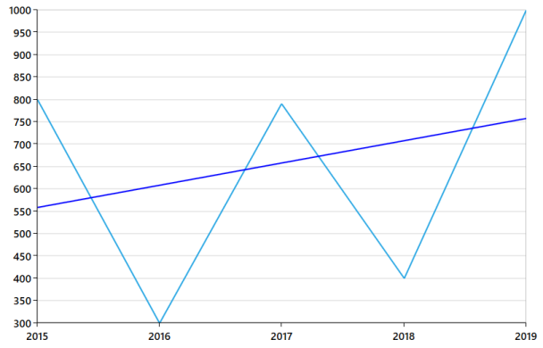
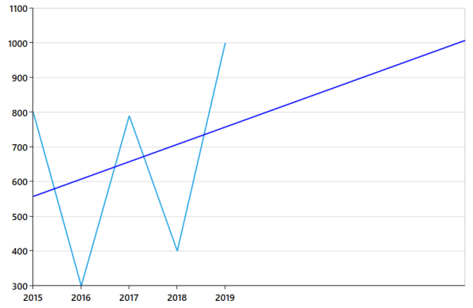
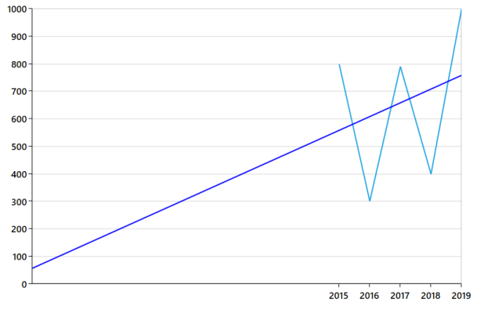

# Trendlines

Trendlines are used to analyze and display the trends in the data graphically. It is built on the assumptions based on current and past price trends. This analysis is also called as regression analysis. Trendlines are commonly used to judge entry and exit investment timing when trading securities. 

The following code examples illustrate how to add Trendlines to the chart.



<syncfusion:LineSeries.Trendlines >

<syncfusion:Trendline  IsTrendlineVisible="True"/>

</syncfusion:LineSeries.Trendlines>



You can set the Polynomial order for the line. Polynomial order calculates order based equation and the order value falls between 2 and 6.



<syncfusion:LineSeries.Trendlines >

    <syncfusion:Trendline IsTrendlineVisible="True"  PolynomialOrder="2" />

</syncfusion:LineSeries.Trendlines>

The lines of Trendlines can be customized using properties such as Stroke, StrokeThickness, and StrokeDashedArray.Stroke is used to add color to the line stroke, StrokeThickness is used to specify line thickness and StrokeDashedArray is used to draw dotted lines.

## Types of Trendlines

SfChart supports the following type of Trendlines.

* Linear
* Exponential
* Power
* Logarithmic
* Polynomial 
* Linear

### Linear Trendline is a best-fit straight line that is used with sets of simple linear data. A LinearTrendline shows when something is increasing or decreasing at a steady rate. 

### Exponential

Exponential Trendline is a curved line that is used when data values rise or fall at constantly increasing rates.

### Power

Power Trendline is a curved line that is used with sets of data comparing measurements that increase at a specific rate, for example, the acceleration of race car at one second intervals.

### Logarithmic

Logarithmic Trendline is a best-fit curved line that is used when the rate of change in the data increases or decreases quickly and then levels out.

### Polynomial

Polynomial Trendline is a curved line that is used when data fluctuates.



<syncfusion:LineSeries.Trendlines >

<syncfusion:Trendline IsTrendlineVisible="True" Type="Linear"/>

</syncfusion:LineSeries.Trendlines>



## Forecasting

Forecasting is the prediction of future situations. Trendlines are also used to display trends for the future and the past. Forecasting can be classified into two types as follows.

* Forward Forecasting
* Backward Forecasting

These can be enabled by setting the value for the Forward Forecasting and Backward Forecasting properties. The value set for Forward Forecasting is used to determine the distance of moving towards the future and the value set for Backward Forecasting is used to determine the distance of moving backwards.

The following code example illustrates how to enable Forecasting in Trendlines.



<syncfusion:LineSeries.Trendlines >

<syncfusion:Trendline ForwardForecast="5" />

</syncfusion:LineSeries.Trendlines>





<syncfusion:LineSeries.Trendlines >

<syncfusion:Trendline BackwardForecast="10" />

</syncfusion:LineSeries.Trendlines>



