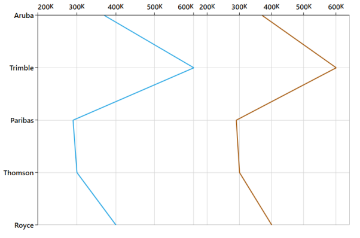

# Vertical Charts

SfChart provide support for Vertical Charts. You can use this to change the position of x-axis and y-axis to the CartesianSeries.

The following APIs are used to change axis positions.

Vertical Charts

<table>
<tr>
<th>
Property</th><th>
Definition</th></tr>
<tr>
<td>
IsTransposed</td><td>
Gets or sets the bool value that represents the position change of a CartesianSeries.</td></tr>
<tr>
<td>
OpposedPosition</td><td>
Gets or sets the bool value that represents the value to draw axis at the opposite position of chart.</td></tr>
</table>

The following code example illustrates the Vertical Chart feature.



<syncfusion:SfChart   Height="500" Width="650">

        <syncfusion:SfChart.Resources>

                <DataTemplate x:Key="suffix">

                    <TextBlock Text="K"  FontSize="14"/>

                </DataTemplate>

        </syncfusion:SfChart.Resources>

            <syncfusion:SfChart.ColumnDefinitions>

                <syncfusion:ChartColumnDefinition />

                <syncfusion:ChartColumnDefinition />

            </syncfusion:SfChart.ColumnDefinitions>

            <syncfusion:SfChart.PrimaryAxis>

                <syncfusion:CategoryAxis FontSize="14" />

            </syncfusion:SfChart.PrimaryAxis>

            <syncfusion:SfChart.SecondaryAxis>

                <syncfusion:NumericalAxis FontSize="14" PostfixLabelTemplate="{StaticResource suffix}" OpposedPosition="True"/>

            </syncfusion:SfChart.SecondaryAxis>

            <syncfusion:LineSeries IsTransposed="True" XBindingPath="CompanyName" 

                 YBindingPath="CompanyTurnOver" ItemsSource="{Binding }"/>

            <syncfusion:LineSeries IsTransposed="True" XBindingPath="CompanyName" YBindingPath="CompanyTurnOver" ItemsSource="{Binding }">

                <syncfusion:LineSeries.YAxis>

                    <syncfusion:NumericalAxis FontSize="14" PlotOffset="30" PostfixLabelTemplate="{StaticResource suffix}" OpposedPosition="True" syncfusion:SfChart.Column="1"/>

                </syncfusion:LineSeries.YAxis>

            </syncfusion:LineSeries>

        </syncfusion:SfChart>



The following screenshot illustrates Vertical Chart.

