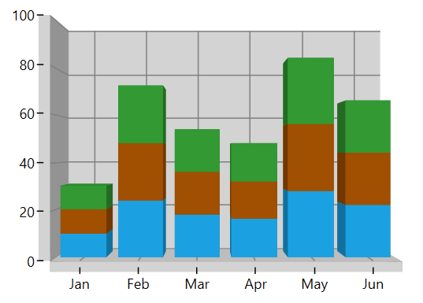
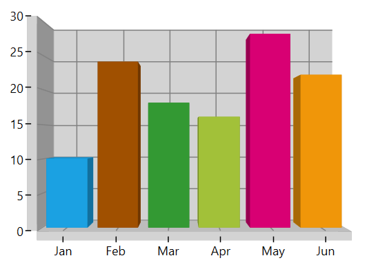
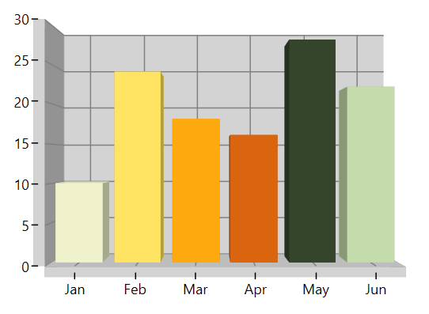
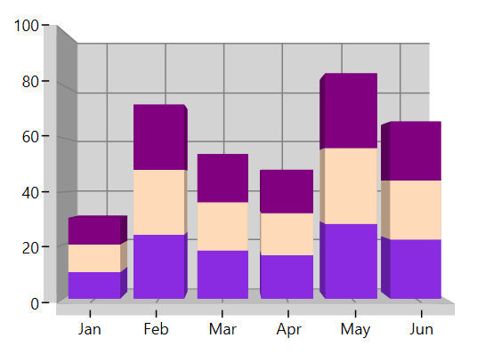
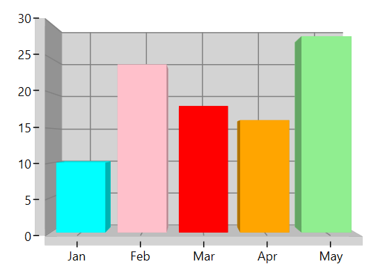

# Appearance in WPF SfChart3D

SfChart3D supports various customizing and styling options that allow you to enrich the application.

## Palettes

SfChart3D provides the options to apply the different kinds of themes or palettes to your chart. You can define the [`Palette`](https://help.syncfusion.com/cr/wpf/Syncfusion.UI.Xaml.Charts.ChartBase.html#Syncfusion_UI_Xaml_Charts_ChartBase_Palette) either for the entire chart or for an individual series.

We have some predefined palette such as,

* Metro
* AutumnBrights
* FloraHues
* Pineapple
* TomotoSpectrum
* RedChrome
* PurpleChrome
* BlueChrome
* GreenChrome
* Elite
* LightCandy
* SandyBeach

### Applying Palette to Series

Each palette applies a set of predefined brushes to the series in a predefined order. The following code example shows you how to set the Metro Palette for the chart series.





    <chart:SfChart3D Height="250" Width="350" Palette="Metro"  >





    chart.Palette = ChartColorPalette.Metro;





The following code example defined the palette as a [`BlueChrome`](https://help.syncfusion.com/cr/wpf/Syncfusion.UI.Xaml.Charts.ChartColorPalette.html).





    <chart:SfChart3D Height="250" Width="350" Palette="BlueChrome">





    chart.Palette = ChartColorPalette.BlueChrome;





### Applying Palette to Segment

Each palette applies a set of predefined brushes to the segment in a predefined order. The following code example shows you how to set the Metro Palette for the chart series.





    <syncfusion:ColumnSeries3D ItemsSource="{Binding Data}"
                           XBindingPath="XValue"
                           YBindingPath="YValue"
                           Palette="Metro"/>
						   

						   


    ColumnSeries3D columnSeries = new ColumnSeries3D()
    {
        ItemsSource = viewModel.Data,
        XBindingPath = "XValue",
        YBindingPath = "YValue",
        Palette = ChartColorPalette.Metro
    };

    chart.Series.Add(columnSeries);





The following code example defined the palette as an **AutumnBrights**.





    <syncfusion:ColumnSeries3D ItemsSource="{Binding Data}"
                           XBindingPath="XValue"
                           YBindingPath="YValue"
                           Palette="AutumnBrights"/>





    ColumnSeries3D columnSeries = new ColumnSeries3D()
    {
        ItemsSource = viewModel.Data,
        XBindingPath = "XValue",
        YBindingPath = "YValue",
        Palette = ChartColorPalette.AutumnBrights
    };

    chart.Series.Add(series);





N> Metro palette is the default palette for both Series and Segment.

## Custom Palette

SfChart3D provides an option that enables you to define your own color brushes with your preferred order for the Palette using the [`ColorModel`](https://help.syncfusion.com/cr/wpf/Syncfusion.UI.Xaml.Charts.ChartSeriesBase.html#Syncfusion_UI_Xaml_Charts_ChartSeriesBase_ColorModel) as shown in the following code example.





    <chart:DoughnutSeries3D  YBindingPath="Percentage" Palette="Custom"

    XBindingPath="Category" ItemsSource="{Binding Tax}" >   

    <chart:DoughnutSeries3D.ColorModel>

    <chart:ChartColorModel>

    <chart:ChartColorModel.CustomBrushes>

    <SolidColorBrush Color="Cyan"/>

    <SolidColorBrush Color="DarkCyan"/>                                                

    </chart:ChartColorModel.CustomBrushes>

    </chart:ChartColorModel>

    </chart:DoughnutSeries3D.ColorModel>

    </chart:DoughnutSeries3D>





    ChartColorModel colorModel = new ChartColorModel();

    colorModel.CustomBrushes.Add(new SolidColorBrush(Colors.Cyan));

    colorModel.CustomBrushes.Add(new SolidColorBrush(Colors.DarkCyan));

    DoughnutSeries3D series = new DoughnutSeries3D()
    {

        ItemsSource = new ViewModel().Tax,

        XBindingPath = "Category",

        YBindingPath = "Percentage",

        Palette = ChartColorPalette.Custom,

        ColorModel = colorModel

    };

    chart.Series.Add(series);





You can define the custom palette for the series as shown in the following code example:





    <chart:SfChart3D Height="250" Width="350" Palette="Custom">

    <chart:SfChart3D.ColorModel>

    <chart:ChartColorModel>

    <chart:ChartColorModel.CustomBrushes>

    <SolidColorBrush Color="BlueViolet"/>

    <SolidColorBrush Color="PeachPuff"/>

    <SolidColorBrush Color="Purple"/>

    </chart:ChartColorModel.CustomBrushes>

    </chart:ChartColorModel>

    </chart:SfChart3D.ColorModel>

    </chart:SfChart3D>





    chart.Palette = ChartColorPalette.Custom;

    ChartColorModel colorModel = new ChartColorModel();

    colorModel.CustomBrushes.Add(new SolidColorBrush(Colors.BlueViolet));

    colorModel.CustomBrushes.Add(new SolidColorBrush(Colors.PeachPuff));

    colorModel.CustomBrushes.Add(new SolidColorBrush(Colors.Purple));

    chart.ColorModel = colorModel;





## SegmentColorPath

The color for the chart segments can be bound from its items source collection by using the [`SegmentColorPath`](https://help.syncfusion.com/cr/wpf/Syncfusion.UI.Xaml.Charts.ChartSeriesBase.html#Syncfusion_UI_Xaml_Charts_ChartSeriesBase_SegmentColorPathProperty) property of series. The following code shows how to bind the color to the series with the [`SegmentColorPath`](https://help.syncfusion.com/cr/wpf/Syncfusion.UI.Xaml.Charts.ChartSeriesBase.html#Syncfusion_UI_Xaml_Charts_ChartSeriesBase_SegmentColorPathProperty) property.





    <chart:ColumnSeries3D ItemsSource="{Binding Data}" XBindingPath="XValue" YBindingPath="YValue" SegmentColorPath="ColorPath">

    </chart:ColumnSeries3D>





    ColumnSeries3D series = new ColumnSeries3D()
 
    {
        
        ItemsSource = viewModel.Data,
        XBindingPath = "XValue",
        YBindingPath = "YValue",
        SegmentColorPath = "ColorPath"
            
    };

    Data = new ObservableCollection<Model>();
    Data.Add(new Model() { XValue = "Jan", YValue = 10, ColorPath = new SolidColorBrush(Colors.Cyan) });
    Data.Add(new Model() { XValue = "Feb", YValue = 24, ColorPath = new SolidColorBrush(Colors.Pink) });
    Data.Add(new Model() { XValue = "Mar", YValue = 18, ColorPath = new SolidColorBrush(Colors.Red) });
    Data.Add(new Model() { XValue = "Apr", YValue = 16, ColorPath = new SolidColorBrush(Colors.Orange) });
    Data.Add(new Model() { XValue = "May", YValue = 28, ColorPath = new SolidColorBrush(Colors.LightGreen) });





N> The SegmentColorPath property is not applicable to the Area and CircularSeries.

