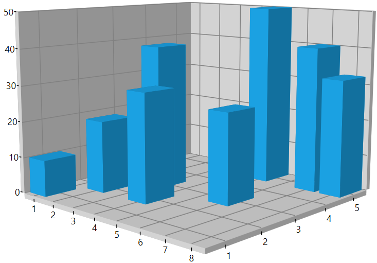
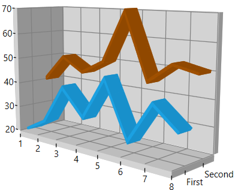

# Axis in WPF SfChart3D

[`ChartAxis`](https://help.syncfusion.com/cr/wpf/Syncfusion.UI.Xaml.Charts.ChartAxis.html#) is used to locate a data point inside the chart area. Charts typically have two axes that are used to measure and categorize data: a vertical (Y) axis and a horizontal (X) axis. 

* [`PrimaryAxis`](https://help.syncfusion.com/cr/wpf/Syncfusion.UI.Xaml.Charts.SfChart3D.html#Syncfusion_UI_Xaml_Charts_SfChart3D_PrimaryAxis) – Gets or sets the horizontal x axis for the chart.
* [`SecondaryAxis`](https://help.syncfusion.com/cr/wpf/Syncfusion.UI.Xaml.Charts.SfChart3D.html#Syncfusion_UI_Xaml_Charts_SfChart3D_SecondaryAxis) – Gets or sets the vertical y axis for the chart.

Additionally, SfChart3D have horizontal (z) Axis called Depth Axis.

* [`DepthAxis`](https://help.syncfusion.com/cr/wpf/Syncfusion.UI.Xaml.Charts.SfChart3D.html#Syncfusion_UI_Xaml_Charts_SfChart3D_DepthAxis) - Gets or sets the horizontal z axis for the chart.

## Types of Axis

ChartAxis supports the following types.

* Numerical Axis
* Category Axis
* DateTime Axis
* TimeSpan Axis
* Logarithmic Axis

### Numerical Axis

[`NumericalAxis3D`](https://help.syncfusion.com/cr/wpf/Syncfusion.UI.Xaml.Charts.NumericalAxis3D.html#) is used to plot numerical values to the chart and can be defined for both PrimaryAxis and SecondaryAxis.





    <chart:SfChart3D>
            <!--PrimaryAxis-->
            <chart:SfChart3D.PrimaryAxis>
                <chart:NumericalAxis3D/>
            </chart:SfChart3D.PrimaryAxis>

            <!--SecondaryAxis-->
            <chart:SfChart3D.SecondaryAxis>
                <chart:NumericalAxis3D />
            </chart:SfChart3D.SecondaryAxis>
    </chart:SfChart3D>





        SfChart3D Chart3D = new SfChart3D()
            {
                PrimaryAxis = new NumericalAxis3D(),

                SecondaryAxis = new NumericalAxis3D()               
            };





### Category Axis

[`CategoryAxis3D`](https://help.syncfusion.com/cr/wpf/Syncfusion.UI.Xaml.Charts.CategoryAxis3D.html#) is an indexed based axis that plots values based on the index of the data point collection. The points are equally spaced here.





    <chart:SfChart3D>
            <!--PrimaryAxis-->
            <chart:SfChart3D.PrimaryAxis>
                <chart:CategoryAxis3D/>
            </chart:SfChart3D.PrimaryAxis>
    </chart:SfChart3D>





        SfChart3D Chart3D = new SfChart3D()
            {
                PrimaryAxis = new CategoryAxis3D()               
            };





### DateTime Axis

[`DateTimeAxis3D`](https://help.syncfusion.com/cr/wpf/Syncfusion.UI.Xaml.Charts.DateTimeAxis3D.html#) is used to plot DateTime values and  it is widely used to make financial charts in places like the Stock Market, where index plotting is done every day.





    <chart:SfChart3D>
            <!--PrimaryAxis-->
            <chart:SfChart3D.PrimaryAxis>
                <chart:DateTimeAxis3D/>
            </chart:SfChart3D.PrimaryAxis>
    </chart:SfChart3D>





        SfChart3D Chart3D = new SfChart3D()
            {
                PrimaryAxis = new DateTimeAxis3D()               
            };





### Logarithmic Axis

[`LogarithmicAxis3D`](https://help.syncfusion.com/cr/wpf/Syncfusion.UI.Xaml.Charts.LogarithmicAxis3D.html#) is used to plot the logarithmic scale for the chart. The Logarithmic values will be plotted based on the logarithmic base value as 10.





    <chart:SfChart3D>
            <!--SecondaryAxis-->
            <chart:SfChart3D.SecondaryAxis>
                <chart:LogarithmicAxis3D />
            </chart:SfChart3D.SecondaryAxis>
    </chart:SfChart3D>





       SfChart3D Chart3D = new SfChart3D()
            {
                SecondaryAxis = new LogarithmicAxis3D()               
            };





### TimeSpan Axis

[`TimeSpanAxis3D`](https://help.syncfusion.com/cr/wpf/Syncfusion.UI.Xaml.Charts.TimeSpanAxis3D.html#) is used to plot the time span values in the PrimaryAxis. TimeSpanAxis has the advantage of plotting data with milliseconds difference. The limitation of TimeSpanAxis is that it can only accept timespan values (hh:mm:ss) and date time values are not accepted.





    <chart:SfChart3D>
            <!--PrimaryAxis-->
            <chart:SfChart3D.PrimaryAxis>
                <chart:TimeSpanAxis3D/>
            </chart:SfChart3D.PrimaryAxis>
    </chart:SfChart3D>





        SfChart3D Chart3D = new SfChart3D()
            {
                PrimaryAxis = new TimeSpanAxis3D()               
            };





## Depth Axis

[`DepthAxis`](https://help.syncfusion.com/cr/wpf/Syncfusion.UI.Xaml.Charts.SfChart3D.html#Syncfusion_UI_Xaml_Charts_SfChart3D_DepthAxis) helps us to plot chart data based on X, Y and Z Co – ordinates. This feature is supported in [`Line`](https://help.syncfusion.com/cr/wpf/Syncfusion.UI.Xaml.Charts.LineSeries3D.html), [`Column`](https://help.syncfusion.com/cr/wpf/Syncfusion.UI.Xaml.Charts.ColumnSeries3D.html), [`Bar`](https://help.syncfusion.com/cr/wpf/Syncfusion.UI.Xaml.Charts.BarSeries3D.html), [`StackingColumnSeries`](https://help.syncfusion.com/cr/wpf/Syncfusion.UI.Xaml.Charts.StackingColumnSeries3D.html), [`StackingBarSeries`](https://help.syncfusion.com/cr/wpf/Syncfusion.UI.Xaml.Charts.StackingBarSeries3D.html) and [`Scatter`](https://help.syncfusion.com/cr/wpf/Syncfusion.UI.Xaml.Charts.ScatterSeries3D.html) series. 

The depth axis is implemented by defining the required axis type to the [`DepthAxis`](https://help.syncfusion.com/cr/wpf/Syncfusion.UI.Xaml.Charts.SfChart3D.html#Syncfusion_UI_Xaml_Charts_SfChart3D_DepthAxis) property of the [`SfChart3D`](https://help.syncfusion.com/cr/wpf/Syncfusion.UI.Xaml.Charts.SfChart3D.html) and by mapping the  Z data points to the series using the [`ZBindingPath`](https://help.syncfusion.com/cr/wpf/Syncfusion.UI.Xaml.Charts.XyzDataSeries3D.html#Syncfusion_UI_Xaml_Charts_XyzDataSeries3D_ZBindingPath) of the series. When [`DepthAxis`](https://help.syncfusion.com/cr/wpf/Syncfusion.UI.Xaml.Charts.SfChart3D.html#Syncfusion_UI_Xaml_Charts_SfChart3D_DepthAxis) is not defined, by default it is created based on the [`ZBindingPath`](https://help.syncfusion.com/cr/wpf/Syncfusion.UI.Xaml.Charts.XyzDataSeries3D.html#Syncfusion_UI_Xaml_Charts_XyzDataSeries3D_ZBindingPath) data type.

The following code example illustrates how to create Depth Axis.

 



        <chart:SfChart3D Margin="120,20,120,30" x:Name="chart" Rotation="43" Tilt="10"
                         EnableRotation="True" PerspectiveAngle="100">
                . . .
            <chart:SfChart3D.DepthAxis>
                <chart:NumericalAxis3D Interval="1"/>
            </chart:SfChart3D.DepthAxis>
            <chart:ColumnSeries3D XBindingPath="XValue"                                
                                  YBindingPath="YValue"
                                  ZBindingPath="ZValue"
                                  ItemsSource="{Binding Data}"/>
        </chart:SfChart3D>



 

            SfChart3D chart = new SfChart3D();
            chart.Rotation = 43;
            chart.Tilt = 10;
            chart.Margin = new Thickness(120, 20, 120, 30);
            chart.PerspectiveAngle = 100;
            chart.EnableRotation = true;

            NumericalAxis3D depthAxis = new NumericalAxis3D();
            depthAxis.Interval = 1;
            chart.DepthAxis = depthAxis;

            ColumnSeries3D series1 = new ColumnSeries3D();
            series1.ItemsSource = (new ViewModel()).Data;
            series1.XBindingPath = "XValue";
            series1.YBindingPath = "YValue";
            series1.ZBindingPath = "ZValue";
            chart.Series.Add(series1);
            this.Content = chart;





## 3D Manhattan Chart

In this type of chart, multiple series can be plotted in [`DepthAxis`](https://help.syncfusion.com/cr/wpf/Syncfusion.UI.Xaml.Charts.SfChart3D.html#Syncfusion_UI_Xaml_Charts_SfChart3D_DepthAxis). To enable Manhattan chart add the required number of series and define the [`DepthAxis`](https://help.syncfusion.com/cr/wpf/Syncfusion.UI.Xaml.Charts.SfChart3D.html#Syncfusion_UI_Xaml_Charts_SfChart3D_DepthAxis). The Manhattan axis is of type category with the axis labels mapped to the [`Label`](https://help.syncfusion.com/cr/wpf/Syncfusion.UI.Xaml.Charts.ChartSeriesBase.html#Syncfusion_UI_Xaml_Charts_ChartSeriesBase_Label) property of the series. If the [`Label`](https://help.syncfusion.com/cr/wpf/Syncfusion.UI.Xaml.Charts.ChartSeriesBase.html#Syncfusion_UI_Xaml_Charts_ChartSeriesBase_Label) property of the series is not defined, the labels are displayed as Series1, Series2 and so on.





<chart:SfChart3D x:Name="chart" Rotation="43" >
          . . . 
            <chart:SfChart3D.DepthAxis>
                <chart:NumericalAxis3D Interval="1"/>
            </chart:SfChart3D.DepthAxis>

            <chart:LineSeries3D XBindingPath="XValue"                                
                                YBindingPath="YValue"                         
                                ItemsSource="{Binding Data1}" 
                                Label="First"/>

            <chart:LineSeries3D XBindingPath="XValue"                                
                                YBindingPath="YValue"                         
                                ItemsSource="{Binding Data2}" 
                                Label="Second"/>
        </chart:SfChart3D>





SfChart3D chart = new SfChart3D() { Header = "Chart", Height = 300, Width = 500  };

            chart.Rotation = 43;
            . . . 

            NumericalAxis3D depthAxis = new NumericalAxis3D();
            depthAxis.Interval = 1;
            chart.DepthAxis = depthAxis;

            LineSeries3D series1 = new LineSeries3D();
            series1.ItemsSource = (new ViewModel()).Data1;
            series1.XBindingPath = "XValue";
            series1.YBindingPath = "YValue";
            series1.Label = "First";

            LineSeries3D series2 = new LineSeries3D();
            series2.ItemsSource = (new ViewModel()).Data2;
            series2.XBindingPath = "XValue";
            series2.YBindingPath = "YValue";
            series2.Label = "Second";

            chart.Series.Add(series1);
            chart.Series.Add(series2);
            this.Content = chart;





The sample with Manhattan chart can be downloaded from the [link](https://github.com/SyncfusionExamples/3D-Chart-with-DepthAxis-Z-Axis-).
