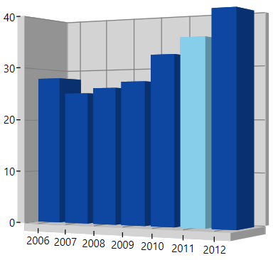

# Interactive Features in WPF 3D Charts (SfChart3D)

3D charts provide interactive features such as dynamic rotation, segment selection, and dynamic segment explode for circular series.

## Dynamic rotation

3D charts allow us to view the best possible view of data dynamically using a mouse or touch device. To enable dynamic rotation, set the [`EnableRotation`](https://help.syncfusion.com/cr/wpf/Syncfusion.UI.Xaml.Charts.SfChart3D.html#Syncfusion_UI_Xaml_Charts_SfChart3D_EnableRotation) property to true.

The following code example illustrates how to enable the dynamic rotation:





<Syncfusion:SfChart3D EnableRotation="True" x:Name="Chart" Height="500" Width="600"/>




 
## Segment Selection

To enable segment selection in a 3D chart, set the SegmentSelectionBrush property in chart series.

The following code example illustrates how to set the selection brush for individual series. For data refer to the Series category in 3D charts.





   <chart:SfChart3D EnableRotation="True"  PerspectiveAngle="50"   Rotation="29" Depth="100" Palette="BlueChrome" Width="300" Height="280">            
            <chart:ColumnSeries3D SegmentSelectionBrush="SkyBlue" ItemsSource="{Binding DataPoints}"  
            XBindingPath="Year" YBindingPath="India">               
            </chart:ColumnSeries3D>
 </chart:SfChart3D>
	




        SfChart3D chart3D = new SfChart3D()
            {
                EnableSeriesSelection=true,
                EnableRotation=true,
                PerspectiveAngle=50,
                SeriesSelectedIndex=0,
                Rotation=29,
                Depth=100,
                Palette=ChartColorPalette.BlueChrome,
                Width=300,
                Height=280
            };

            ColumnSeries3D series = new ColumnSeries3D()
            {
                ItemsSource = new StockViewModel().DataPoints,
                XBindingPath = "Year",
                YBindingPath = "India",
                SegmentSelectionBrush = new SolidColorBrush(Colors.SkyBlue),
                SegmentSpacing = 0.5
            };
            
            chart3D.Series.Add(series);





The following screenshot illustrates the result of the above code example.

## Series Selection

Series selection support is used to highlight the series programmatically or by user interaction. Also you can get a series SelectedIndex, PreviousSelectedIndex value in SelectionChanged event arguments. 

The following code example can be used to set series selection in a SfChart3D.





            <chart:SfChart3D EnableRotation="True"  PerspectiveAngle="50" 
                                EnableSeriesSelection="True" SeriesSelectedIndex="0"
                                 Rotation="29" Depth="100" Palette="BlueChrome" Width="300" Height="280">
          
            <chart:ColumnSeries3D SeriesSelectionBrush="LightGreen" SegmentSpacing="0.5" ItemsSource="{Binding Demands}"  XBindingPath="Category" YBindingPath="Value">
            </chart:ColumnSeries3D>

            <chart:ColumnSeries3D SegmentSpacing="0.5" SeriesSelectionBrush="SkyBlue" 
            ItemsSource="{Binding Demands}"  XBindingPath="Category" YBindingPath="Value">
            </chart:ColumnSeries3D>

     </chart:SfChart3D>





        SfChart3D chart3D = new SfChart3D()
            {
                EnableSeriesSelection=true,
                EnableRotation=true,
                PerspectiveAngle=50,
                SeriesSelectedIndex=0,
                Rotation=29,
                Depth=100,
                Palette=ChartColorPalette.BlueChrome,
                Width=300,
                Height=280
            };

        ColumnSeries3D series = new ColumnSeries3D()
            {
                ItemsSource = new StockViewModel().Demands,
                XBindingPath = "Category",
                YBindingPath = "Value",
                SeriesSelectionBrush = new SolidColorBrush(Colors.LightGreen),
                SegmentSpacing = 0.5
            };

        ColumnSeries3D series1 = new ColumnSeries3D()
            {
                ItemsSource = new StockViewModel().Demands,
                XBindingPath = "Category",
                YBindingPath = "Value",
                SeriesSelectionBrush = new SolidColorBrush(Colors.SkyBlue),
                SegmentSpacing = 0.5
            };

        chart3D.Series.Add(series);
        chart3D.Series.Add(series1);





The following screenshot is an example of a SfChart3D with series selection.

