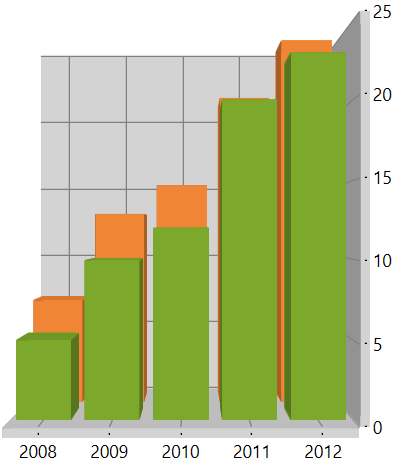

# WPF SfChart3D Overview

3D charts are used to view two-dimensional data in a three-dimensional view, and can be rotated in all 3 dimensions to get the best possible view of the data.

  

## Key features

* SfChart3D supports different type of [`Series`](https://help.syncfusion.com/cr/wpf/Syncfusion.UI.Xaml.Charts.SfChart3D.html#Syncfusion_UI_Xaml_Charts_SfChart3D_Series) which can be used for different data visualizations.Each type of chart represents a unique style of representing data with more user friendly and greater UI visualization.

* Supports several axes types which can be used with the charts. There are axes specialized for Numerical,          Category, DateTime, TimeSpan, Logarithmic scenarios.

* SfChart3D supports DepthAxis (Z Axis) helps us to plot chart data based on X, Y and Z Co – ordinates.

* Supports multiple axes that can be stacked and spanned for multiple panes.

* Allows you to map the data from the specified path, by achieving, Data binding concept.

* Animations allows to animate the chart series on loading, and whenever the ItemsSource changes.

* Dynamic rotation allows to view the best possible view of data dynamically using a mouse or touch device.

* Selection support allows to select Segment and series programmatically or user interaction.

