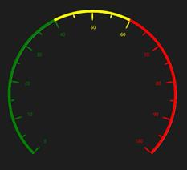
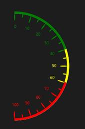
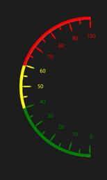
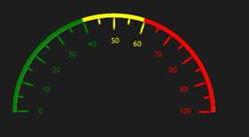
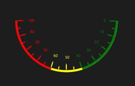
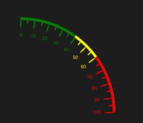
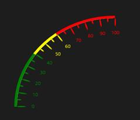
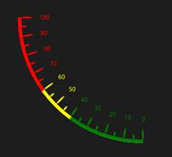

# Gauge Type

SfCircularGauge type is determined by positioning the control towards particular direction.
GaugeType is an enum property that provides the option to select type of the SfCircularGauge type, which contains following options.

* Default,
* East,
* West,
* North,
* South,
* NorthEast,
* NorthWest,
* SouthEast,
* SouthWest 




    <syncfusion:SfCircularGauge GaugeType="East"/>





    SfCircularGauge circularGauge = new SfCircularGauge();
    circularGauge.GaugeType = CircularGaugeTypes.East;
    this.Grid.Children.Add(circularGauge);
    



<table>
<tr>
<td>
{{''| markdownify }}
</td></tr>
</table>

<table>
<tr>
<td>
{{''| markdownify }}
</td><td>
{{''| markdownify }}
</td></tr>
</table>

<table>
<tr>
<td>
{{''| markdownify }}
</td><td>
{{''| markdownify }}
</td></tr>
</table>

<table>
<tr>
<td>
{{''| markdownify }}
</td><td>
{{''| markdownify }}
</td></tr>
</table>

<table>
<tr>
<td>
{{''| markdownify }}
</td><td>
{{''| markdownify }}
</td></tr>
</table>
