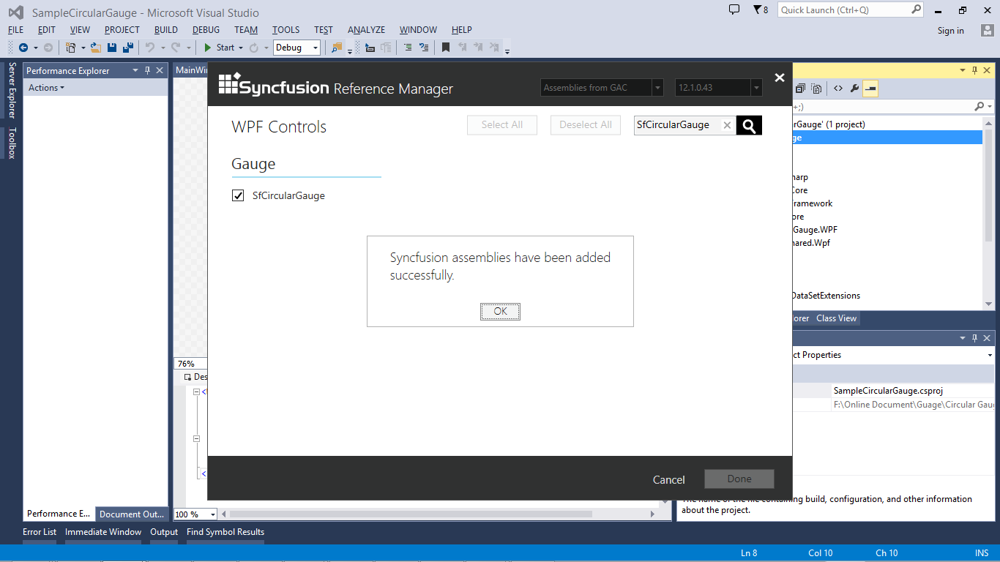
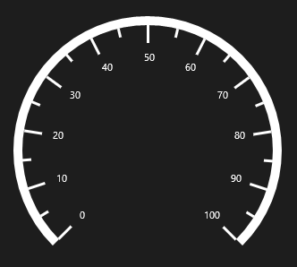

# Getting Started

## Create Circular Gauge Programmatically

The following code example explains how to add a Circular Gauge:




<Window x:Class="SampleCircularGauge.MainWindow"

xmlns="http://schemas.microsoft.com/winfx/2006/xaml/presentation"

xmlns:x="http://schemas.microsoft.com/winfx/2006/xaml"

xmlns:syncfusion="http://schemas.syncfusion.com/wpf"

Title="MainWindow" Height="350" Width="525">

<Grid Name="Grid" Background="Black">

<syncfusion:SfCircularGauge x:Name="gauge"  >

<syncfusion:SfCircularGauge x:Name="gauge" GaugeHeaderPosition="300,600" >

<syncfusion:SfCircularGauge.GaugeHeader>

<TextBlock Text="Temperature (K)" 

Height="40" Width="150" 

FontSize="20" Foreground="White"/>

</syncfusion:SfCircularGauge.GaugeHeader>

<syncfusion:SfCircularGauge.MainScale>

<syncfusion:CircularScale StartAngle="135" 

SweepAngle="270" 

StartValue="0"

EndValue="100"

Interval="10">

<syncfusion:CircularScale.Ranges>

<syncfusion:CircularRange StartValue="0" 

EndValue="60" Stroke="#666666" />

<syncfusion:CircularRange StartValue="60" 

EndValue="100" Stroke="#C1252C" />

</syncfusion:CircularScale.Ranges>

<syncfusion:CircularScale.Pointers>

<syncfusion:CircularPointer PointerType="NeedlePointer" Value="170"/>

</syncfusion:CircularScale.Pointers>

</syncfusion:CircularScale>

</syncfusion:SfCircularGauge.MainScale>

</syncfusion:SfCircularGauge>    </Grid>

</Window>




SfCircularGauge circularGauge = new SfCircularGauge();

circularGauge.GaugeHeaderPosition = new Point(300,600);

CircularScale _mainscale = new CircularScale();

_mainscale.StartAngle = 135;

_mainscale.SweepAngle = 270;

_mainscale.StartValue = 0;

_mainscale.EndValue = 100;

_mainscale.Interval = 10;

_mainscale.Ranges.Add(new CircularRange() { StartValue = 0, EndValue = 60, Stroke = new SolidColorBrush() });

_mainscale.Ranges.Add(new CircularRange() { StartValue = 0, EndValue = 60, Stroke = new SolidColorBrush() });

_mainscale.Pointers.Add(new CircularPointer() { PointerType = PointerType.NeedlePointer, Value = 170 });

circularGauge.MainScale = _mainscale;

TextBlock _textBlock = new TextBlock() { Text = "Temperature (K)", Height = 20, Width = 150, FontSize = 20, Foreground = new SolidColorBrush(Colors.White) };

circularGauge.GaugeHeader = _textBlock;

this.Grid.Children.Add(circularGauge);



### Screenshot:

## Create a CircularGauge with the Syncfusion Reference Manager

Syncfusion Reference Manager is used to add Syncfusion Tools.

To add SfCircularGauge Control, follow the steps below:

1. Create a simple WPF application by using Visual Studio.

   

2. Right-Click on the Project and select Syncfusion Reference Manager.

   

3. The Syncfusion Reference Manager Wizard is opened as follows.

   

4. Search SfCircularGauge by using Search Box and select SfCircularGauge Control.  Click done to add selected SfCircularGauge Control.

   

5. The SfCircularGauge assemblies are automatically added to the Project after Clicking OK

   

   

6. Create a namespace reference to the SfCircularGauge control by using Syncfusion’s global namespace reference schemas.syncfusion.com or the SfCircularGauge control’s namespace reference by using Syncfusion.UI.Xaml.Gauges available in the Syncfusion.SfCircularGauge.WPF assembly.

      xmlns:syncfusion ="http://schemas.syncfusion.com/wpf" 

7. Add the following code example to create a simple SfCircularGauge control.

   ~~~html
   
		<Window x:Class="SampleCircularGauge.MainWindow"

		xmlns="http://schemas.microsoft.com/winfx/2006/xaml/presentation"

		xmlns:x="http://schemas.microsoft.com/winfx/2006/xaml"

		xmlns:syncfusion="http://schemas.syncfusion.com/wpf"

		Title="MainWindow" Height="350" Width="525">

		<Grid Name="Grid" Background="Black">

		<syncfusion:SfCircularGauge></syncfusion:SfCircularGauge>

		</Grid>

		</Window>

   ~~~

   ~~~csharp

		using System.Windows;

		using Syncfusion.UI.Xaml.Gauges;

		namespace CircularGauge

		{

		public partial class MainWindow : Window

		{

		public MainWindow()

		{

		InitializeComponent();

		SfCircularGauge circulargauge = new SfCircularGauge();

		this.Grid.Children.Add(circulargauge); 

		}

		}

		}

   ~~~		

8. The SfCircularGauge control is created as follows.

   

N>  1. The Syncfusion Reference Manager is available in versions 11.3.0.30 and later. It supports referencing assemblies from version 10.4.0.71 version to the current version. 2. The Syncfusion Reference Manager is used only in Visual Studio 2010, 2012, and 2013.

