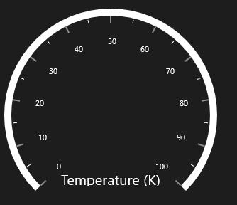
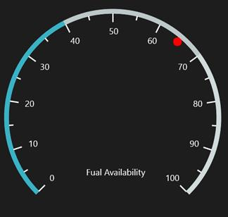
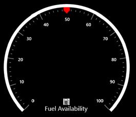

# Header 

Header support allows you to show text, an image, or any UI content inside the Gauge control. A circular gauge can be made self-descriptive about the data it is measuring through the use of a header. For example, the header could display Speed (in km/h), RPM, etc.

**Adding Header in Circular Gauge**

To add a header in the gauge, the following properties are required:

* GaugeHeader
* GaugeHeaderPosition
* Header Alignment

## Gauge Header

The **GaugeHeader** is an object that can be used to set a unique header for the Circular Gauge. You can add text as well as images as headers in a circular gauge only one header can be added in a circular gauge.

## GaugeHeaderPosition

This property places the header in a circular gauge. The value for **GaugeHeaderPosition** should be specified in offset value. By default, it is placed at (0, 0).

## HeaderAlignment

Gauge header can be positioned by using **HeaderAlignment** property, the default value of this property is Left.

It includes the following options.

* Left
* Right
* Top
* Bottom
* Center
* TopLeft
* TopRight
* BottomLeft
* BottomRight
* Custom




     <syncfusion:SfCircularGauge GaugeHeaderPosition="0.45,0.8" HeaderAlignment="Custom">
            <syncfusion:SfCircularGauge.GaugeHeader>
                <TextBlock Text="Temperature (K)" 
                              Height="20" Width="150" 
                              FontSize="20" Foreground="White"/>
            </syncfusion:SfCircularGauge.GaugeHeader>
        </syncfusion:SfCircularGauge>





            SfCircularGauge circularGauge = new SfCircularGauge();
            circularGauge.GaugeHeaderPosition = new Point(0.45, 0.8);
            circularGauge.HeaderAlignment = HeaderAlignment.Custom;
            TextBlock _textBlock = new TextBlock()
            {
                Text = "Temperature (K)",
                Height = 20,
                Width = 150,
                FontSize = 20,
                Foreground = new SolidColorBrush(Colors.White)
            };
            circularGauge.GaugeHeader = _textBlock;
            this.Grid.Children.Add(circularGauge);




**Gauge Header as Text**




     <syncfusion:SfCircularGauge  GaugeHeader="Fual Availability"  
                             GaugeHeaderPosition="0.42,0.65" FontSize="20"  HeaderAlignment="Custom" >
        </syncfusion:SfCircularGauge>
        




            SfCircularGauge circularGauge = new SfCircularGauge();
            circularGauge.GaugeHeader = "Fual Availability";
            circularGauge.GaugeHeaderPosition = new Point(0.45, 0.8);
            circularGauge.HeaderAlignment = HeaderAlignment.Custom;
            circularGauge.FontSize = 20;
            this.Grid.Children.Add(circularGauge);




**Gauge Header as UI Element** 




     <syncfusion:SfCircularGauge GaugeHeaderPosition="300,600">
     <syncfusion:SfCircularGauge.GaugeHeader>
                <Grid>
                    <Grid.RowDefinitions>
                        <RowDefinition/>
                        <RowDefinition/>
                    </Grid.RowDefinitions>
                    <TextBlock Grid.Row="1"  Text="Fual Availability" 
                               Foreground="White" FontSize="20" />
                    <Image Grid.Row="0" Height="20" Width="20"  
                           Source="Assets/FuelIcon.jpg"/>
                 </Grid>
    </syncfusion:SfCircularGauge.GaugeHeader>
     </syncfusion:SfCircularGauge>





            SfCircularGauge circularGauge = new SfCircularGauge();
            circularGauge.GaugeHeaderPosition = new Point(300, 600);
            Grid grid1 = new Grid();
            RowDefinition rowDef1;
            rowDef1 = new RowDefinition();
            RowDefinition rowDef2;
            rowDef2 = new RowDefinition();
            grid1.RowDefinitions.Add(rowDef1);
            grid1.RowDefinitions.Add(rowDef2);
            BitmapImage _mapimage = new BitmapImage(new Uri("Assets/FuelIcon.jpg"));
            TextBlock _textBlock = new TextBlock()
            {
                Text = "Fuel Availability",
                Foreground = new SolidColorBrush(Colors.White),
                FontSize = 20
            };
            Grid.SetRow(_textBlock, 1);
            Image image = new Image() { Height = 20, Width = 20 };
            image.Source = _mapimage;
            Grid.SetRow(image, 0);
            circularGauge.GaugeHeader = grid1;
            this.Grid.Children.Add(circularGauge);




