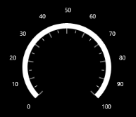

# Label Settings

## Labels

Scale labels associate a numeric value with major scale tick marks. The label stroke can be changed by using the LabelStroke property. The size of the Labels can be changed by using the LabelAutoSizeChange property.

#### Code Example:



             <syncfusion:SfCircularGauge x:Name="gauge">

                <syncfusion:SfCircularGauge.MainScale>

                    <syncfusion:CircularScale LabelStroke="Red"  LabelAutoSizeChange="True" >                              

                    </syncfusion:CircularScale>

                </syncfusion:SfCircularGauge.MainScale>

      </syncfusion:SfCircularGauge>





            SfCircularGauge circularGauge = new SfCircularGauge();

            CircularScale _mainscale = new CircularScale();

            _mainscale.LabelStroke = new SolidColorBrush(Colors.Red);

            _mainscale.LabelAutoSizeChange = true;

            circularGauge.MainScale = _mainscale;

            this.Grid.Children.Add(circularGauge);
			


## Smart Labels

Smart labels allow you to change the numeric scale type of the labels displayed in a gauge scale. They also help you to customize labels by adding prefixes or suffixes to the scale labels.

### Enable/Disable Smart Labels

The EnableSmartLabels property is a Boolean property that enables or disables the smart label feature of the CircularGauge.

## NumericScaleType

The NumericScaleType property allows you to set the type of label. The following types can be applied to labels:

* Auto
* Thousands
* Millions
* Billions
* Trillions
* Quadrillions
* Quintillions



 <syncfusion:SfCircularGauge >

    <syncfusion:SfCircularGauge.MainScale>

        <syncfusion:CircularScale EnableSmartLabels="False"  NumericScaleType="Thousands" Interval="20" 

                                  MinorTicksPerInterval="5" TickLength="20" 

                                  StartAngle="180" SweepAngle="180" StartValue="0"

                                   EndValue="100"/>

    </syncfusion:SfCircularGauge.MainScale>

 </syncfusion:SfCircularGauge>
 




            SfCircularGauge circularGauge = new SfCircularGauge();

            CircularScale _mainscale = new CircularScale();

            _mainscale.EnableSmartLabels = false;

            _mainscale.Interval = 20;

            _mainscale.MinorTicksPerInterval = 5;

            _mainscale.TickLength = 20;

            _mainscale.StartAngle = 180;

            _mainscale.SweepAngle = 180;

            _mainscale.StartValue = 0;

            _mainscale.EndValue = 100;

            circularGauge.MainScale = _mainscale;

            this.Grid.Children.Add(circularGauge);
			


#### Screenshot:

#### _Enable  SmartLabels-‘False’_

## Number of Fraction Digits

The NoOfFractionalDigits property is used to set the number of fractional digits to be displayed in the scale labels.



 <syncfusion:SfCircularGauge >

    <syncfusion:SfCircularGauge.MainScale>

        <syncfusion:CircularScale EnableSmartLabels="True" 

                                  Interval="20"  NoOfFractionalDigit="1"

                                  MinorTicksPerInterval="5" TickLength="20" 

                                  StartAngle="180" SweepAngle="180" StartValue="0"

                                  EndValue="200"/>

    </syncfusion:SfCircularGauge.MainScale>

 </syncfusion:SfCircularGauge>
 




            SfCircularGauge circularGauge = new SfCircularGauge();

            CircularScale _mainscale = new CircularScale();

            _mainscale.EnableSmartLabels = true;

            _mainscale.Interval = 2000;

           _mainscale.NoOfFractionalDigit = 1;

            _mainscale.MinorTicksPerInterval = 5;

            _mainscale.TickLength = 20;

            _mainscale.StartAngle = 180;

            _mainscale.SweepAngle = 180;

            _mainscale.StartValue = 0;

            _mainscale.EndValue = 100;

            circularGauge.MainScale = _mainscale;

            this.Grid.Children.Add(circularGauge);
			


#### Screenshot:

## Label Postfix

This property allows you to set the postfix values to the scale labels. The label postfixes are visible even if the EnableSmartLabels property is set to false. 



 <syncfusion:SfCircularGauge >

    <syncfusion:SfCircularGauge.MainScale>

        <syncfusion:CircularScale LabelPostfix="%"

                                  Interval="10"  MinorTicksPerInterval="5" 

                                  TickLength="20" StartAngle="180" 

                                  SweepAngle="180" 

                                  StartValue="0" EndValue="100"/>

    </syncfusion:SfCircularGauge.MainScale>

 </syncfusion:SfCircularGauge>
 




            SfCircularGauge circularGauge = new SfCircularGauge();

            CircularScale _mainscale = new CircularScale();

            _mainscale.LabelPostfix = "%";

            _mainscale.Interval = 10;

            _mainscale.MinorTicksPerInterval = 5;

            _mainscale.TickLength = 20;

            _mainscale.StartAngle = 180;

            _mainscale.SweepAngle = 0;

            _mainscale.EndValue = 100;

            circularGauge.MainScale = _mainscale;

            this.Grid.Children.Add(circularGauge);
			


#### Screenshot:

## Label Prefix

This property allows you to set the prefix values for the scale labels. The label prefixes are visible even if the EnableSmartLabels property is set to false.



 <syncfusion:SfCircularGauge >

    <syncfusion:SfCircularGauge.MainScale>

        <syncfusion:CircularScale LabelPrefix="$"

                                  Interval="10"  MinorTicksPerInterval="5" 

                                  TickLength="20" StartAngle="180" 

                                  SweepAngle="180" 

                                  StartValue="0" EndValue="100"/>

    </syncfusion:SfCircularGauge.MainScale>

 </syncfusion:SfCircularGauge>
 




            SfCircularGauge circularGauge = new SfCircularGauge();

            CircularScale _mainscale = new CircularScale();

            _mainscale.LabelPrefix= "$";

            _mainscale.Interval = 10;

            _mainscale.MinorTicksPerInterval = 5;

            _mainscale.TickLength = 20;

            _mainscale.StartAngle = 180;

            _mainscale.SweepAngle = 0;

            _mainscale.EndValue = 100;

            circularGauge.MainScale = _mainscale;

            this.Grid.Children.Add(circularGauge);



#### Screenshot:

## LabelPosition

The Labels in the scale can be placed inside the scale or outside the scale by selecting one of the options available in the LabelPosition property. These options are:

1. Inside (Default)
2. Outside

#### Code Example



            <syncfusion:SfCircularGauge x:Name="gauge">

                <syncfusion:SfCircularGauge.MainScale>

                    <syncfusion:CircularScale LabelPosition="Outside">

                    </syncfusion:CircularScale>

                </syncfusion:SfCircularGauge.MainScale>

            </syncfusion:SfCircularGauge>





            SfCircularGauge circularGauge = new SfCircularGauge();

            CircularScale _mainscale = new CircularScale();

            _mainscale.LabelPosition = LabelPosition.Outside;

            circularGauge.MainScale = _mainscale;

            this.Grid.Children.Add(circularGauge);
			


#### Screenshot:

