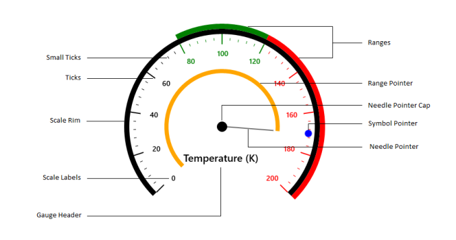

# CircularGauge

## Introduction

Circular Gauge enables you to see a single numerical value mapped against a range of colors that have a particular business meaning or business logic. As the value changes over time, the gauge pointer changes position within this range.

### Use Cases

1. Circular gauges are used as the speedometer, tachometer, fuel, and temperature gauges in a graphical car dashboard.
2. Used in analog clocks.
3. Used in industries to visualize and monitor pressure and temperature.
4. Used to visualize internet connection speed.
5. Used to visualize the server load.
6. Used to visualize memory usage.

## Key features

A Circular Gauge is composed of a MainScale that is an integrated UI part. You can see a scale that is added to the Circular Gauge when you click and drag the circular gauge from toolbox to the Visual Studio designer. MainScale is a composite UI element with the following subparts:

1. Scale
2. Ranges
3. Pointers
4. GaugeHeader

The Circular Gauge control is a highly customizable with a variety of simple APIs to modify the basic look and feel of the control without having to edit a template. You can position the ranges, ticks, labels and range pointers as needed. You can bind the value of the property that you are measuring to the pointer. The pointer moves to the exact location on the scale that depicts the current value of the bound data. 

### Scale

The Circular Gauge scale contains labels, tick marks and a rim to specify the basic look and feel. It defines the start angle, sweep direction and sweep angle, overall minimum and maximum values and the frequency of labels and tick marks.

### Ranges

A range is a visual element that depicts the start and end values of inner divisions within the scale’s range. Each scale is capable of displaying one or more ranges, and each range can depict different zones or regions of same metrics, such as high, low, and average temperatures.  

### Pointers

A pointer is an element that points out a value of the bound property on a scale. A circular scale can have one or more pointers that is used to measure different values. Each pointer has a value property that visually informs you the current value. 

### GaugeHeader

The GaugeHeader is an object that is used to set a unique header for the Circular Gauge. You can add text as well as images as the header in a circular gauge.

## Circular gauge elements

