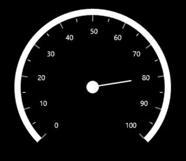
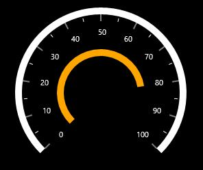
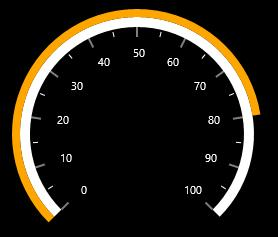

# Pointers

You can add multiple pointers to the gauge to point at multiple values on the same scale. This can be useful for showing a low and a high value at the same time. The value of the pointer is set using the Value property. There are three types of pointers. You can choose a pointer using the **PointerType** property. Movement of the pointer can be animated by enabling the **EnableAnimation** property.

## Needle Pointer

A needle pointer contains two parts, the needle and the pointer cap that can be placed on a gauge to mark values. The needle length is controlled by the NeedleLengthFactor property. The NeedleLengthFactor property’s minimum and maximum bounds are 0 and 1. The needle’s UI is customized by the NeedlePointerStroke and NeedlePointerStrokeThickness properties. The user can modify the pointer cap’s size by changing the PointerCapDiameter property. Needle Pointer may be visible or collapsed by using the NeedlePointerVisibility property.




    <syncfusion:SfCircularGauge x:Name="gauge">
            <syncfusion:SfCircularGauge.Scales>
                <syncfusion:CircularScale>
                    <syncfusion:CircularScale.Pointers>
                        <syncfusion:CircularPointer Value="80"
                                        PointerType="NeedlePointer" 
                                        EnableAnimation="True"
                                        NeedleLengthFactor="0.5"
                                        NeedlePointerStroke="White" 
                                        NeedlePointerStrokeThickness="2" 
                                        PointerCapStroke="White" 
                                        PointerCapDiameter="20"  
                                        NeedlePointerVisibility="Visible"   />
                    </syncfusion:CircularScale.Pointers>
                </syncfusion:CircularScale>
            </syncfusion:SfCircularGauge.Scales>
        </syncfusion:SfCircularGauge>





            SfCircularGauge circularGauge = new SfCircularGauge();
            CircularScale _mainscale = new CircularScale();
            _mainscale.Pointers.Add(new CircularPointer()
            {
                Value = 80,
                PointerType = PointerType.NeedlePointer,
                EnableAnimation = true,
                NeedleLengthFactor = 0.5,
                NeedlePointerStroke = new SolidColorBrush(Colors.White),
                NeedlePointerStrokeThickness = 2,
                PointerCapStroke = new SolidColorBrush(Colors.White),
                PointerCapDiameter = 20,
                NeedlePointerVisibility = Visibility.Visible
            });
            circularGauge.Scales.Add(_mainscale);
            this.Grid.Children.Add(circularGauge);




### NeedlePointerType:

NeedlePointer appearance can be customized by using the NeedlePointerType property the default value of this property is Rectangle.

It is **enum** includes the following option.

* Rectangle
* Triangle 
* Tapered
* Arrow




    <syncfusion:SfCircularGauge x:Name="gauge">
            <syncfusion:SfCircularGauge.Scales>
                <syncfusion:CircularScale Radius="200">
                    <syncfusion:CircularScale.Pointers>
                        <syncfusion:CircularPointer Value="80"
                                        PointerType="NeedlePointer" 
                                        NeedlePointerType="Arrow"/>
                    </syncfusion:CircularScale.Pointers>
                </syncfusion:CircularScale>
            </syncfusion:SfCircularGauge.Scales>
        </syncfusion:SfCircularGauge>





           SfCircularGauge circularGauge = new SfCircularGauge();
            CircularScale _mainscale = new CircularScale();
            _mainscale.Radius = 200;
            _mainscale.Pointers.Add(
                new CircularPointer()
            { 
                Value = 80, PointerType = PointerType.NeedlePointer, 
                NeedlePointerType = NeedlePointerType.Arrow
            });
            circularGauge.Scales.Add(_mainscale);
            this.Grid.Children.Add(circularGauge);
            



## Range Pointer

A range pointer is an accenting line or shaded background range that can be placed on a gauge to mark values. The range pointer’s UI is customized by the **RangePointerStroke** and **RangePointerStrokeThickness** properties. **RangePointerVisibility** property is used to set the visibility of the Range Pointer.




        <syncfusion:SfCircularGauge x:Name="gauge">
            <syncfusion:SfCircularGauge.Scales>
                <syncfusion:CircularScale>
                    <syncfusion:CircularScale.Pointers>
                        <syncfusion:CircularPointer Value="80"
                                           PointerType="RangePointer" 
                                           EnableAnimation="True"
                                           RangePointerStroke="Orange"
                                           RangePointerStrokeThickness="10"
                                           RangePointerVisibility="Visible"
                                           />
                    </syncfusion:CircularScale.Pointers>
                </syncfusion:CircularScale>
            </syncfusion:SfCircularGauge.Scales>
        </syncfusion:SfCircularGauge>





            SfCircularGauge circularGauge = new SfCircularGauge();
            CircularScale _mainscale = new CircularScale();
            _mainscale.Pointers.Add(new CircularPointer()
            {
                Value = 80,
                PointerType = PointerType.RangePointer,
                EnableAnimation = true,
                RangePointerStroke = new SolidColorBrush(Colors.Orange),
                RangePointerStrokeThickness = 10,
                RangePointerVisibility = Visibility.Visible
            });
            circularGauge.Scales.Add(_mainscale);
            this.Grid.Children.Add(circularGauge);
			



### RangePointerPosition

The RangePointer in the scale can be placed inside the scale or outside the scale by selecting one of the options available in the RangePointerPosition property. These options are:

1. Inside (Default)
2. Outside
3. Cross
4. Custom




     <syncfusion:SfCircularGauge x:Name="gauge">
            <syncfusion:SfCircularGauge.Scales>
                <syncfusion:CircularScale RangePointerPosition="Outside">
                </syncfusion:CircularScale>
            </syncfusion:SfCircularGauge.Scales>
        </syncfusion:SfCircularGauge>





        SfCircularGauge circularGauge = new SfCircularGauge();
        CircularScale _mainscale = new CircularScale();
        _mainscale.RangePointerPosition = RangePointerPosition.Outside;
        circularGauge.Scales.Add(_mainscale);
        this.Grid.Children.Add(circularGauge);
        



## Symbol Pointer 

In a symbol pointer, the value is pointed out by a symbol on the scale. You can modify the symbol pointer’s size by changing the **SymbolPointerDiameter** property. Its stroke is changed by using the **SymbolPointerStroke** property. The visibility of the Symbol Pointer can be set by using the **SymbolPointerVisibility** Property.




     <syncfusion:SfCircularGauge x:Name="gauge">
            <syncfusion:SfCircularGauge.Scales>
                <syncfusion:CircularScale>
                    <syncfusion:CircularScale.Pointers>
                        <syncfusion:CircularPointer Value="80"
                                        PointerType="SymbolPointer" 
                                         EnableAnimation="True"        
                                        SymbolPointerStroke="Orange"
                                        SymbolPointerVisibility="Visible"
                                        />
                    </syncfusion:CircularScale.Pointers>
                </syncfusion:CircularScale>
            </syncfusion:SfCircularGauge.Scales>
        </syncfusion:SfCircularGauge>





          SfCircularGauge circularGauge = new SfCircularGauge();
            CircularScale _mainscale = new CircularScale();
            _mainscale.Pointers.Add(new CircularPointer()
            {
                Value = 80,
                PointerType = PointerType.SymbolPointer,
                EnableAnimation = true,
                RangePointerStroke = new SolidColorBrush(Colors.Orange),
                SymbolPointerVisibility = Visibility.Visible
            });
            circularGauge.Scales.Add(_mainscale);
            this.Grid.Children.Add(circularGauge);




### Symbol pointer Customization

One advantage to the symbol pointer is its customizability.You can change the height, width, and appearance of the symbol pointer.

Symbol is an **enum** property that provides symbol options for the symbol pointer, which contains several shapes like rectangle, ellipse, and triangle. The SymbolPointerHeight property is used to set the height of the symbol pointer. The value should be given as a double value. The SymbolPointerWidth property is used to set the width of the symbol pointer.




    <syncfusion:SfCircularGauge x:Name="gauge">
            <syncfusion:SfCircularGauge.Scales>
                <syncfusion:CircularScale>
                    <syncfusion:CircularScale.Pointers>
                        <syncfusion:CircularPointer PointerType="SymbolPointer" 
                                   Symbol="Pentagon" 
                                   SymbolPointerStroke="Red" 
                                   SymbolPointerHeight ="20" 
                                   SymbolPointerWidth ="20"
                                   Value="50"/>
                    </syncfusion:CircularScale.Pointers>
                </syncfusion:CircularScale>
            </syncfusion:SfCircularGauge.Scales>
        </syncfusion:SfCircularGauge>





            SfCircularGauge circularGauge = new SfCircularGauge();
            CircularScale _mainscale = new CircularScale();
            _mainscale.Pointers.Add(new CircularPointer()
            {
                PointerType = PointerType.SymbolPointer,
                Symbol = Symbol.Pentagon,
                SymbolPointerStroke = new SolidColorBrush(Colors.Red),
                SymbolPointerHeight = 20,
                SymbolPointerWidth = 20,
                Value = 50
            });
            circularGauge.Scales.Add(_mainscale);
            this.Grid.Children.Add(circularGauge);




### Customizing the SymbolPointerTemplate

The default appearance of the **SymbolPointer** can be customized by using the SymbolPointerTemplate property. The SymbolPointerTemplate property is applicable only when Symbol type is set as Custom.

The SymbolPointerTemplate is a DataTemplate type, used to customize or override the default template of the SymbolPointer.



      <syncfusion:SfCircularGauge x:Name="gauge">
            <syncfusion:SfCircularGauge.Scales >
                <syncfusion:CircularScale>
    <syncfusion:CircularScale.Pointers>
    <syncfusion:CircularPointer   Value="65" PointerType="SymbolPointer" 
                                  Symbol="Diamond"   >
         <syncfusion:CircularPointer.SymbolPointerTemplate>
               <DataTemplate>
                    <Polygon Fill="Red"  Points=" 0,7.5 5,5 5,0 15,0 15,5 10,5 10,10 15,10                      
                                        15,15 5,15 5,10  ">
                         
                     </Polygon>
                </DataTemplate>
         </syncfusion:CircularPointer.SymbolPointerTemplate>
      </syncfusion:CircularPointer>
</syncfusion:CircularScale.Pointers>
              
 </syncfusion:CircularScale>
            </syncfusion:SfCircularGauge.Scales >
        </syncfusion:SfCircularGauge>



