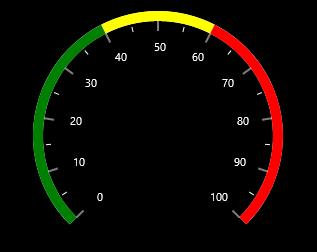
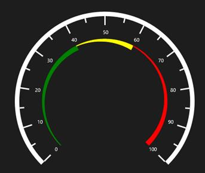
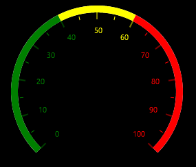
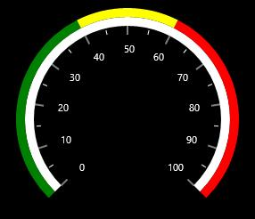

# Ranges

A range is a visual element which begins and ends at specified values within a scale. 

## Ranges Customization

Ranges start and end values are set by the **StartValue** and **EndValue** properties of the range. A range’s UI is customized by the Stroke and **StrokeThickness** properties.




        <syncfusion:SfCircularGauge x:Name="gauge">
            <syncfusion:SfCircularGauge.Scales>
                <syncfusion:CircularScale >
                    <syncfusion:CircularScale.Ranges>
                        <syncfusion:CircularRange StartValue="0" EndValue="40" Stroke="Green" StrokeThickness ="10"/>
                        <syncfusion:CircularRange StartValue="40" EndValue="60" Stroke="Yellow" StrokeThickness ="10"/>
                        <syncfusion:CircularRange StartValue="60" EndValue="100" Stroke="Red" StrokeThickness ="10"/>
                    </syncfusion:CircularScale.Ranges>
                </syncfusion:CircularScale>
            </syncfusion:SfCircularGauge.Scales>
        </syncfusion:SfCircularGauge>





    
            SfCircularGauge circularGauge = new SfCircularGauge();
            CircularScale _mainscale = new CircularScale();
            _mainscale.Ranges.Add(new CircularRange()
            {
                StartValue = 0,
                EndValue = 40,
                Stroke = new SolidColorBrush(Colors.Green),
                StrokeThickness = 10
            });
            _mainscale.Ranges.Add(new CircularRange()
            {
                StartValue = 40,
                EndValue = 60,
                Stroke = new SolidColorBrush(Colors.Yellow),
                StrokeThickness = 10
            });
            _mainscale.Ranges.Add(new CircularRange()
            {
                StartValue = 60,
                EndValue = 100,
                Stroke = new SolidColorBrush(Colors.Red),
                StrokeThickness = 10
            });
            circularGauge.Scales.Add(_mainscale);
            this.Grid.Children.Add(circularGauge);




## Range’s Width

The appearance of Circular range is customized by setting the **StartWidth** and **EndWidth** properties.




       <syncfusion:SfCircularGauge x:Name="gauge">
            <syncfusion:SfCircularGauge.Scales>
                <syncfusion:CircularScale  RangePosition="Inside" Radius="200">
                    <syncfusion:CircularScale.Ranges>
                        <syncfusion:CircularRange StartValue="0" EndValue="40" Stroke="Green" StrokeThickness ="10" StartWidth="1" EndWidth="10"/>
                        <syncfusion:CircularRange StartValue="40" EndValue="60" Stroke="Yellow" StrokeThickness ="10" StartWidth="1" EndWidth="10"/>
                        <syncfusion:CircularRange StartValue="60" EndValue="100" Stroke="Red" StrokeThickness ="10" StartWidth="1" EndWidth="10"/>
                    </syncfusion:CircularScale.Ranges>
                </syncfusion:CircularScale>
            </syncfusion:SfCircularGauge.Scales>
        </syncfusion:SfCircularGauge>
        




            SfCircularGauge circularGauge = new SfCircularGauge();
            CircularScale _mainscale = new CircularScale();
            _mainscale.Radius = 200;
            _mainscale.RangePosition = RangePosition.Inside;
            _mainscale.Ranges.Add(new CircularRange()
            { 
                StartValue = 0, 
                EndValue = 40, 
                Stroke = new SolidColorBrush(Colors.Green), 
                StrokeThickness = 10,
                StartWidth = 1,
                EndWidth = 10

            });
            _mainscale.Ranges.Add(new CircularRange()
            { 
                StartValue = 40,
                EndValue = 60,
                Stroke = new SolidColorBrush(Colors.Yellow), 
                StrokeThickness = 10,
                StartWidth = 1,
                EndWidth = 10
            });
            _mainscale.Ranges.Add(new CircularRange() 
            { 
                StartValue = 60,
                EndValue = 100,
                Stroke = new SolidColorBrush(Colors.Red), 
                StrokeThickness = 10,
                StartWidth = 1,
                EndWidth = 10
            });
            circularGauge.Scales.Add(_mainscale);
            this.Grid.Children.Add(circularGauge);




## Binding Range Stroke

You can bind the range’s stroke to the tick lines and labels within its range by setting the **BindRangeStrokeToLabels** and **BindRangeStrokeToTicks** properties to true.




     <syncfusion:SfCircularGauge x:Name="gauge">
            <syncfusion:SfCircularGauge.Scales>
                <syncfusion:CircularScale  BindRangeStrokeToLabels="True"
                                               BindRangeStrokeToTicks="True">
                </syncfusion:CircularScale>
            </syncfusion:SfCircularGauge.Scales>
        </syncfusion:SfCircularGauge>
        




      SfCircularGauge circularGauge = new SfCircularGauge();
        CircularScale _mainscale = new CircularScale();
        _mainscale.BindRangeStrokeToLabels = true;
        _mainscale.BindRangeStrokeToTicks = true;
        circularGauge.Scales.Add(_mainscale);
        this.Grid.Children.Add(circularGauge);




## RangePosition

The range can be placed inside the scale, outside the scale, or on the scale by selecting one of the options available in the RangePosition property. 

These options are:

1. Inside
2. Outside
3. SetAsGaugeRim (Default)
4. Custom




     <syncfusion:SfCircularGauge x:Name="gauge">
            <syncfusion:SfCircularGauge.Scales>
                <syncfusion:CircularScale RangePosition="Outside">
                </syncfusion:CircularScale>
            </syncfusion:SfCircularGauge.Scales>
        </syncfusion:SfCircularGauge>





           SfCircularGauge circularGauge = new SfCircularGauge();
            CircularScale _mainscale = new CircularScale();
            _mainscale.RangePosition = RangePosition.Outside;
            circularGauge.Scales.Add(_mainscale);
            this.Grid.Children.Add(circularGauge);




