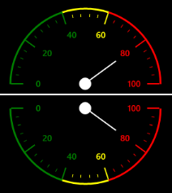

# Rim Settings

## Circular Rim

Scale determines the structure of the Circular Gauge by using the circular rim. By setting the StartAngle, SweepDirection and SweepAngle properties, you can shape the circular gauge into a full circular gauge, half circular gauge, or quarter circular gauge.

The StartValue and EndValue properties determine the overall range of the circular rim. The rim’s stroke and stroke thickness can be set by using the RimStroke and RimStrokeThickness properties.

### Code Example




<syncfusion:SfCircularGauge x:Name="gauge">

<syncfusion:SfCircularGauge.MainScale>

<syncfusion:CircularScale 

StartAngle="180" 

SweepAngle="180"

SweepDirection="Clockwise"

StartValue="0" 

EndValue="100"

RimStroke="Black" 

RimStrokeThickness="3"

>

</syncfusion:CircularScale>

</syncfusion:SfCircularGauge.MainScale>

</syncfusion:SfCircularGauge>





SfCircularGauge circularGauge = new SfCircularGauge();

CircularScale _mainscale = new CircularScale();

_mainscale.StartAngle = 180;

_mainscale.SweepAngle = 180;

_mainscale.SweepDirection = SweepDirection.Clockwise;

_mainscale.StartValue=0;

_mainscale.EndValue = 100;

_mainscale.RimStroke = new SolidColorBrush(Colors.Black);

_mainscale.RimStrokeThickness = 3;

circularGauge.MainScale = _mainscale;

this.Grid.Children.Add(circularGauge);




### Screenshot

<table>
<tr>
<td>
{{ '' | markdownify }}

</td><td>
{{ '' | markdownify }}

</td></tr>
<tr>
<td>
{{ '_Full Circular Gauge_' | markdownify }}</td><td>
{{ '_Semi Circular Gauge (Top and Bottom)_' | markdownify }}</td></tr>
<tr>
<td>
{{ '' | markdownify }}

</td><td>
{{ '' | markdownify }}

</td></tr>
<tr>
<td>
{{ '_Semi Circular Gauge (Left and Right)_' | markdownify }}</td><td>
{{ '_Quarter Circular Gauge (Starting at right angles)_' | markdownify }}</td></tr>
<tr>
<td>
{{ '' | markdownify }}

</td><td>
</td></tr>
<tr>
<td>
{{ '_Quarter Circular Gauge (Starting at 45 degree)_' | markdownify }}</td><td>
</td></tr>
</table>

