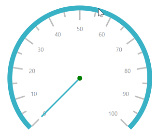
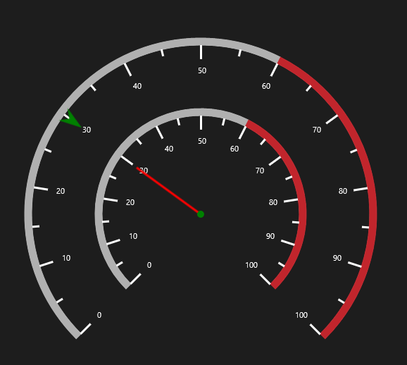

# Scales

The Scales contains a Collection of CircularScale which integrates labels, tick marks, and a rim to customize the basic look and feel of the **SfCircularGauge**.

## Scale

CircularScale contains three sub elements such as Rim, Ticks, and Labels. It defines the Radius, start angle, sweep direction and sweep angle, overall minimum and maximum values, and frequency of labels and tick marks. It can have multiple ranges. A range is a visual element which begins and ends at specified values within a scale. It can have one or more pointers to point out the values in the scale. It also has a **GaugeHeader** that can be used to set a unique header for the circular gauge.




          <syncfusion:SfCircularGauge x:Name="gauge">
            <syncfusion:SfCircularGauge.Scales>
                <syncfusion:CircularScale StartAngle="135"  Radius="200"
                                   SweepAngle="270" 
                                   StartValue="0"
                                   EndValue="100"
                                   Interval="10">

                    <syncfusion:CircularScale.Ranges>
                        <syncfusion:CircularRange StartValue="0" 
                                             EndValue="60" Stroke="#666666" />
                        <syncfusion:CircularRange StartValue="60" 
                                             EndValue="100" Stroke="#C1252C" />
                    </syncfusion:CircularScale.Ranges>

                    <syncfusion:CircularScale.Pointers>
                        <syncfusion:CircularPointer PointerType="NeedlePointer" Value="170"/>
                    </syncfusion:CircularScale.Pointers>
                </syncfusion:CircularScale>
            </syncfusion:SfCircularGauge.Scales>
        </syncfusion:SfCircularGauge>





            SfCircularGauge circularGauge = new SfCircularGauge();
            CircularScale _mainscale = new CircularScale();
            _mainscale.Radius = 200;
            _mainscale.StartAngle = 135;
            _mainscale.SweepAngle = 270;
            _mainscale.StartValue = 0;
            _mainscale.EndValue = 100;
            _mainscale.Interval = 10;
            _mainscale.Ranges.Add(new CircularRange()
            {
                StartValue = 0,
                EndValue = 60,
                Stroke = new SolidColorBrush(Color.FromArgb(0xFF, 0x66, 0x66, 0x66))
            });
            _mainscale.Ranges.Add(new CircularRange()
            {
                StartValue = 60,
                EndValue = 100,
                Stroke = new SolidColorBrush(Color.FromArgb(0xFF, 0xC1, 0x25, 0x2C))
            });
            _mainscale.Pointers.Add(new CircularPointer()
            {
                PointerType = PointerType.NeedlePointer,
                Value = 170
            });
            circularGauge.Scales.Add(_mainscale);
            this.Grid.Children.Add(circularGauge);




## Multiple Scale

It helps to be able to add multiple scales to the same circular gauge, and also it helps to customize all the scales in a Scales collection.

**Adding Multiple Scales by Using Width and Height of Circular Scale**




    <syncfusion:SfCircularGauge SpacingMargin="0.7">
            <syncfusion:SfCircularGauge.Scales>
                <syncfusion:CircularScale Height="500" Width="500">
                    <syncfusion:CircularScale.Ranges>
                        <syncfusion:CircularRange  StartValue="0" 
                                                   EndValue="60" 
                                                   Stroke="#B0B0B0" 
                                                   StrokeThickness="5" />
                        <syncfusion:CircularRange  StartValue="60" 
                                                   EndValue="100"    
                                                   Stroke="#C1252C" StrokeThickness="5"/>
                    </syncfusion:CircularScale.Ranges>
                    <syncfusion:CircularScale.Pointers>
                        <syncfusion:CircularPointer Value="30" 
                                                    PointerType="SymbolPointer"
                                                    Symbol="InvertedArrow"  
                                                    SymbolPointerWidth="30" 
                                                    SymbolPointerHeight="20" 
                                                    SymbolPointerStroke="Green"/>
                    </syncfusion:CircularScale.Pointers>
                </syncfusion:CircularScale>
                <syncfusion:CircularScale Height="300" Width="300">
                    <syncfusion:CircularScale.Ranges>
                        <syncfusion:CircularRange  StartValue="0" 
                                                   EndValue="60" 
                                                   Stroke="#B0B0B0" 
                                                   StrokeThickness="5" />
                        <syncfusion:CircularRange  StartValue="60" 
                                                   EndValue="100"    
                                                   Stroke="#C1252C" StrokeThickness="5"/>
                    </syncfusion:CircularScale.Ranges>
                    <syncfusion:CircularScale.Pointers>
                        <syncfusion:CircularPointer Value="30" 
                                                    PointerType="NeedlePointer"/>
                    </syncfusion:CircularScale.Pointers>
                </syncfusion:CircularScale>
            </syncfusion:SfCircularGauge.Scales>
        </syncfusion:SfCircularGauge>





       SfCircularGauge circularGauge = new SfCircularGauge();
            CircularScale _mainscale = new CircularScale();
            CircularScale scale1 = new CircularScale();
            CircularScale scale2 = new CircularScale();
            scale1.Height = 500;
            scale1.Width = 500;
            scale1.Ranges.Add(new CircularRange()
            {
                StartValue = 0,
                EndValue = 60,
                Stroke = new SolidColorBrush(Color.FromArgb(0xB0, 0xB0, 0xB0, 0xB0)),
                StrokeThickness = 5
            });
            scale1.Ranges.Add(new CircularRange()
            {
                StartValue = 60,
                EndValue = 100,
                Stroke = new SolidColorBrush(Color.FromArgb(0xFF, 0xC1, 0x25, 0x2C)),
                StrokeThickness = 5
            });
            scale1.Pointers.Add(new CircularPointer()
            {
                Value = 30,
                PointerType = PointerType.SymbolPointer,
                Symbol = Syncfusion.UI.Xaml.Gauges.Symbol.InvertedArrow,
                SymbolPointerWidth = 30,
                SymbolPointerHeight = 20,
                SymbolPointerStroke = new SolidColorBrush(Colors.Green)
            });
            scale2.Height = 300;
            scale2.Width = 300;
            scale2.Ranges.Add(new CircularRange()
            {
                StartValue = 0,
                EndValue = 60,
                Stroke = new SolidColorBrush((Color.FromArgb(0xB0, 0xB0, 0xB0, 0xB0))),
                StrokeThickness = 5
            });
            scale2.Ranges.Add(new CircularRange()
            {
                StartValue = 60,
                EndValue = 100,
                Stroke = new SolidColorBrush(Color.FromArgb(0xFF, 0xC1, 0x25, 0x2C)),
                StrokeThickness = 5
            });
            scale2.Pointers.Add(new CircularPointer()
            {
                Value = 30,
                PointerType = PointerType.NeedlePointer
            });
            circularGauge.Scales.Add(scale1);
            circularGauge.Scales.Add(scale2);
            this.Grid.Children.Add(circularGauge); 




**Adding Multiple Scales by using Radius of Circular Scale**




        <syncfusion:SfCircularGauge SpacingMargin="0.7">
            <syncfusion:SfCircularGauge.Scales>
                <syncfusion:CircularScale Radius="300">
                    <syncfusion:CircularScale.Ranges>
                        <syncfusion:CircularRange  StartValue="0" 
                                                   EndValue="60" 
                                                   Stroke="#B0B0B0" 
                                                   StrokeThickness="5" />
                        <syncfusion:CircularRange  StartValue="60" 
                                                   EndValue="100"    
                                                   Stroke="#C1252C" StrokeThickness="5"/>
                    </syncfusion:CircularScale.Ranges>
                    <syncfusion:CircularScale.Pointers>
                        <syncfusion:CircularPointer Value="30" 
                                                    PointerType="SymbolPointer"
                                                    Symbol="InvertedArrow"  
                                                    SymbolPointerWidth="30" 
                                                    SymbolPointerHeight="20" 
                                                    SymbolPointerStroke="Green"/>
                    </syncfusion:CircularScale.Pointers>
                </syncfusion:CircularScale>
                <syncfusion:CircularScale Radius="200">
                    <syncfusion:CircularScale.Ranges>
                        <syncfusion:CircularRange  StartValue="0" 
                                                   EndValue="60" 
                                                   Stroke="#B0B0B0" 
                                                   StrokeThickness="5" />
                        <syncfusion:CircularRange  StartValue="60" 
                                                   EndValue="100"    
                                                   Stroke="#C1252C" StrokeThickness="5"/>
                    </syncfusion:CircularScale.Ranges>
                    <syncfusion:CircularScale.Pointers>
                        <syncfusion:CircularPointer Value="30" 
                                                    PointerType="NeedlePointer"/>
                    </syncfusion:CircularScale.Pointers>
                </syncfusion:CircularScale>
            </syncfusion:SfCircularGauge.Scales>
        </syncfusion:SfCircularGauge>
        




            SfCircularGauge circularGauge = new SfCircularGauge();
            CircularScale _mainscale = new CircularScale();
            CircularScale scale1 = new CircularScale();
            CircularScale scale2 = new CircularScale();
            scale1.Radius = 300;
            scale1.Ranges.Add(new CircularRange()
            {
                StartValue = 0,
                EndValue = 60,
                Stroke = new SolidColorBrush(Color.FromArgb(0xB0, 0xB0, 0xB0, 0xB0)),
                StrokeThickness = 5
            });
            scale1.Ranges.Add(new CircularRange()
            {
                StartValue = 60,
                EndValue = 100,
                Stroke = new SolidColorBrush(Color.FromArgb(0xFF, 0xC1, 0x25, 0x2C)),
                StrokeThickness = 5
            });
            scale1.Pointers.Add(new CircularPointer()
            {
                Value = 30,
                PointerType = PointerType.SymbolPointer,
                Symbol = Syncfusion.UI.Xaml.Gauges.Symbol.InvertedArrow,
                SymbolPointerWidth = 30,
                SymbolPointerHeight = 20,
                SymbolPointerStroke = new SolidColorBrush(Colors.Green)
            });
            scale2.Radius = 200;
            scale2.Ranges.Add(new CircularRange()
            {
                StartValue = 0,
                EndValue = 60,
                Stroke = new SolidColorBrush((Color.FromArgb(0xB0, 0xB0, 0xB0, 0xB0))),
                StrokeThickness = 5
            });
            scale2.Ranges.Add(new CircularRange()
            {
                StartValue = 60,
                EndValue = 100,
                Stroke = new SolidColorBrush(Color.FromArgb(0xFF, 0xC1, 0x25, 0x2C)),
                StrokeThickness = 5
            });
            scale2.Pointers.Add(new CircularPointer()
            {
                Value = 30,
                PointerType = PointerType.NeedlePointer
            });
            circularGauge.Scales.Add(scale1);
            circularGauge.Scales.Add(scale2);
            this.Grid.Children.Add(circularGauge);




