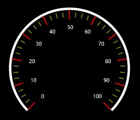
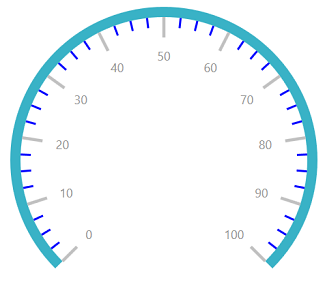

# Ticks

Ticks help you identify the gauge’s data value by marking the gauge scale in regular increments.

## Tick Stroke Customization

The Interval property is used to calculate the tick count for a scale. Like ticks, small ticks are calculated using the MinorTicksPerInterval property.

A tick’s length, stroke, and stroke thickness are set by the TickLength, TickStroke, and TickStrokeThickness UI properties. Like ticks, small ticks use similar UI properties to set the SmallTickLength, SmallTickStroke, and SmallTickStrokeThickness.




       <syncfusion:SfCircularGauge x:Name="gauge">
            <syncfusion:SfCircularGauge.Scales>
                <syncfusion:CircularSca     MinorTicksPerInterval="3"
                                            TickLength="20"
                                            TickStroke="Red"  
                                            TickStrokeThickness="2" 
                                            SmallTickLength="10"
                                            SmallTickStroke="Green"
                                            SmallTickStrokeThickness="1" 
                                            >
                </syncfusion:CircularScale>
            </syncfusion:SfCircularGauge.Scales>
        </syncfusion:SfCircularGauge>
        




             SfCircularGauge circularGauge = new SfCircularGauge();
            CircularScale _mainscale = new CircularScale();
            _mainscale.MinorTicksPerInterval = 3;
            _mainscale.TickLength = 20;
            _mainscale.TickStroke = new SolidColorBrush(Colors.Red);
            _mainscale.TickStrokeThickness = 2;
            _mainscale.SmallTickLength = 10;
            _mainscale.SmallTickStroke = new SolidColorBrush(Colors.Green);
            _mainscale.SmallTickStrokeThickness = 1;
            circularGauge.Scales.Add(_mainscale);
            this.Grid.Children.Add(circularGauge);




## TickOffset

The Major and Minor ticks can be positioned far away from the rim by using the **MajorTickOffset** and **MinorTickOffset** property. The default value of this Offset property value is 0.




        <syncfusion:SfCircularGauge x:Name="gauge">
            <syncfusion:SfCircularGauge.Scales>
                <syncfusion:CircularSca    MajorTickOffset="10"
                                            MinorTickOffset="10"
                                            >
                </syncfusion:CircularScale>
            </syncfusion:SfCircularGauge.Scales>
        </syncfusion:SfCircularGauge>





            SfCircularGauge circularGauge = new SfCircularGauge();
            CircularScale _mainscale = new CircularScale();
            _mainscale.MajorTickOffset = 10;
            _mainscale.MinorTickOffset = 10;
            circularGauge.Scales.Add(_mainscale);
            this.Grid.Children.Add(circularGauge);




## TickShape

TickShape is an enum property that provides the option to select shape of the Circular mark ticks, which contains several shapes like rectangle, ellipse, and triangle.

## TickPosition

The ticks in the scale can be placed inside the scale, outside the scale, or across the scale by selecting one of the options available in the TickPosition property. These options are:

1 Inside (Default)
2 Outside
3 Cross
4 Custom




    <syncfusion:SfCircularGauge x:Name="gauge">
            <syncfusion:SfCircularGauge.Scales>
                <syncfusion:CircularScale TickPosition="Cross" TickShape="Rectangle">
                </syncfusion:CircularScale>
            </syncfusion:SfCircularGauge.Scales>
        </syncfusion:SfCircularGauge>





            SfCircularGauge circularGauge = new SfCircularGauge();
            CircularScale _mainscale = new CircularScale();
            _mainscale.TickPosition = TickPosition.Cross;
            _mainscale.TickShape = TickShape.Rectangle;
            circularGauge.Scales.Add(_mainscale);
            this.Grid.Children.Add(circularGauge);




