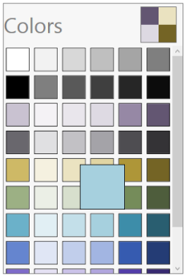

# SelectedColor

Selected color property of the SfColorPalette returns the currently selected color.

## Binding

The following code example shows how to bind `SelectedColor` property in XAML.





<Grid>  
<Grid.Resources>
<local:ColorToSolidColorBrushValueConverter  x:Key="ColorToSolidColorBrush_ValueConverter"/>
</Grid.Resources>
<StackPanel HorizontalAlignment="Center" VerticalAlignment="Center" >
<TextBlock  Margin="5" FontSize="16" FontWeight="Bold" Text="SelectedColor"/>
<Rectangle HorizontalAlignment="Left"  Margin="5" Height="50" Width="50" Fill="{Binding        ElementName=SfColorPalette ,Path= SelectedColor, Converter={StaticResource ColorToSolidColorBrush_ValueConverter}}"/>
<sf:SfColorPalette x:Name="SfColorPalette" Margin="5"/>
</StackPanel>
</Grid>





public class ColorToSolidColorBrushValueConverter : IValueConverter
{
    public object Convert(object value, Type targetType, object parameter, System.Globalization.CultureInfo culture)
    {
        if (null == value) 
            return null;  
        Color color = (Color)value;
            return new SolidColorBrush(color);          
    }
    public object ConvertBack(object value, Type targetType, object parameter, System.Globalization.CultureInfo culture)
    {
        return true;
    }
}





