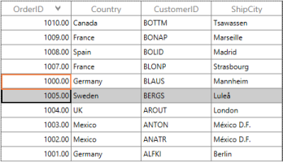
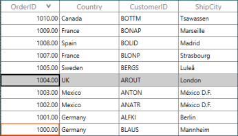
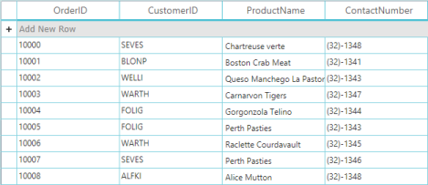
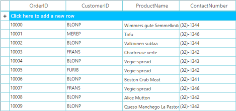

# Data Manipulation

This section explains you about management of data. The operations like insert, delete and modifying data are explained here. SfDataGrid not only displays recordsin tabular view but has an interactive support to manage data also. 

### Overview

DataGrid control handles data updating with the help of INotifyPropertyChanged interface. By default, DataGrid does not update the sorting order, filtering, grouping and summaries.

* SfDataGrid.LiveDataUpdateMode: This property helps you to define the behavior of DataGrid during data updating.

SfDataGrid.LiveDataUpdateMode: This enum type (LiveDataUpdationMode) property contains the following three modes:

_LiveDataUpdationMode property table_

<table>
<tr>
<td>
LiveDataUpdationMode</td><td>
Description</td></tr>
<tr>
<td>
Default</td><td>
This updates only the corresponding cell value when the property is changed.</td></tr>
<tr>
<td>
AllowSummaryUpdate</td><td>
This updates the corresponding cell value and summaries when the property is changed.</td></tr>
<tr>
<td>
AllowDataShaping</td><td>
This updates corresponding cell value and summary. Also it reshapes the data based on sorting, filtering, grouping, summaries when the property is changed.</td></tr>
</table>

The following code example illustrates how to set the LiveDataUpdateMode for DataGrid control.

When you need an instant update that happened on DataSource to view, SfDataGrid provides a property LiveDataUpdateMode. You can use AllowDataShaping in LiveDataUpdateMode that updates instantly while editing. Add this code example and execute the sample.

1. Execute the Sample.
2. Sort any column.
3. Now edit the value to be sorted.
4. It gets arranged according to its sort direction.
5. The same way, you can achieve it for Editing with Grouping and Editing with Filtering.



[XAML]

<syncfusion:SfDataGrid x:Name="sfdatagrid"

                       AllowEditing="True"

                       AutoGenerateColumns="True"

                       ColumnSizer="Star"

                       ItemsSource="{Binding OrderInfoCollection}"                       

                       LiveDataUpdateMode="AllowDataShaping" />



Following screenshot illustrates the difference between AllowDataShaping and Default. When LiveDataUpdateMode is in Default, the value that you edited does not get sorted immediately. The highlighted one is edited cell. 

_LiveDataUpdateMode set to Default_

When you set LiveDataUpdateMode as AllowDataShapping, it gets updated and arranged in order immediately. 

_LiveDataUpdateMode set as AllowDataShapping_

### AddNewRow

This topic provides the description for AddNewRow feature in the DataGrid control that enables you to add new data rows in the DataGrid using the UI.

#### Overview 

AddNewRow enables adding rows to enter new records in the DataGrid control. The new row is displayed, above, or below the rows in the DataGrid control. You can specify the AddNewRow position by using DataGrid’sSfDataGrid.AddNewRowPosition property.When using AddNewRow, DataModel has one ParameterlessConstructor (DefaultContructor).

#### Adding AddNewRow to the DataGrid control

The following code example illustrates how to add AddNewRow to an application:



[XAML]

   <syncfusion:SfDataGrid x:Name="datagrid"

                          AutoGenerateColumns="True"  

                          AddNewRowPosition="Top"                                 

                          ItemsSource="{Binding Stocks}"/>



#### User Interface

_Adding AddNewRow to the DataGrid control_

The following table describes the property that participates in AddNewRow.

_AddNewRow property table_

<table>
<tr>
<td>
Property</td><td>
Description</td></tr>
<tr>
<td>
AddNewRowPosition</td><td>
This is the Enum property that helps to get or set the AddNewRow position in DataGrid. AddNewRowPositionenum property contains following values: 1. Top – Place the AddNewRow at the top of all data rows. 2. Bottom – Place the AddNewRow at the bottom of all the data rows.  3. None – This hides the AddNewRow in the DataGrid control.</td>
</table>

</td></tr>
</table>

> _Note: By default AddNewRowPosition is set as “None”._
The following table describes you the event that participates in AddNewRow.

_AddNewRow Event Table_

<table>
<tr>
<td>
Event</td><td>
Parameters</td><td>
Description</td></tr>
<tr>
<td>
AddNewRowIntiating</td><td>
NewObject</td><td>
This event is triggered when you start editing in AddNewRow.NewObject – This contains the newly created object that helps to set the default value when you start editing in AddNewRow.>  </td></tr>
</table>
> _Note: NewObject is the read-only property._

#### Behavior

1. New data is added when AddNewRow is no longer in focus and the data is valid.
2. You can cancel the new row by pressing ESC twice.
3. By default, new data is added in last. When LiveUpdateMode is set as AllowDataShapping, new data is added based on the sorted data position

#### Limitations

1. AddNewRow only exists for master grid in the Master-Details view.

The following code example illustrates how to use AddNewRowInitiating event.



[XAML]

AddNewRowInitiating="SfDataGrid_AddNewRowInitiating"





[C#]

sfdatagrid.AddNewRowInitiating += sfdatagrid_AddNewRowInitiating;

…

void sfdatagrid_AddNewRowInitiating(object sender, Syncfusion.UI.Xaml.Grid.AddNewRowInitiatingEventArgs args)

{

       // Initialze with default value.     

}


### Deleting

This section explains you how to delete the records, properties and an event that participates in deleting process. 

####  Overview

SfDataGrid has built-in support for deleting records. You can delete a selected row by pressing the Delete key when SfDataGrid.AllowDeleting is set to ‘True’. When multiple records are to be removed from the Grid, you can select multiple records from the SfDataGrid and press Delete.



[XAML]

<syncfusion:SfDataGrid AllowDeleting="True"        

                       AutoGenerateColumns="True"

                       ItemsSource="{Binding OrdersListDetails}"/>



Deleting rows triggers the following events in SfDataGrid before and after records are removed:

* SfDataGrid.RecordDeleting: Occurs before the records are removed from the collection. This event is cancelled.
* SfDataGrid.RecordDeleted: Occurs after the records are removed from the collection.

#### RecordDeleting Event

This event occurs after you press Delete but before the records are removed from the collection. The RecordDeleting event handler receives two arguments namely sender that handles SfDataGrid and RecordDeletingEventArgs as objects.

The RecordDeletingEventArgs has the following properties:

* Cancel: When the Cancel property is set to ‘true’, the event is cancelled and the records are not removed. 
* OriginalSender: Gets the original sender from where the event is raised.
* Items: Gets or sets the items to be removed from the source collection.

#### RecordDeleted Event:

This event occurs after the selected rows are removed from the SfDataGrid. The RecordDeleted event handler receives two arguments namely sender that handles the SfDataGrid and RecordDeletedEventArgs as objects.

The RecordDeletedEventArgs has the following properties:

* Items: Gets the records that are removed from the source collection.
* SelectedIndex: Gets or sets the selected index for the DataGrid control.

The following code example illustrates how to use this event. 



[C#]

sfdatagrid.RecordDeleting += sfdatagrid_RecordDeleting;

…

void sfdatagrid_RecordDeleting(object sender, RecordDeletingEventArgs args)

{

    args.Cancel = true;

}



You can delete record using Remove() or RemoveAt (int index) in underlying collection. The following code example illustrates that.



[C#]

private void Delete_Click(object sender, RoutedEventArgs e)

{

    (sfdatagrid.DataContext as OrderInfoRepositiory).OrderInfoCollection.Remove(sfdatagrid.CurrentItem as OrderInfo);

        // OR

    (sfdatagrid.DataContext as OrderInfoRepositiory).OrderInfoCollection.RemoveAt(2);

}



Current item is currently selected record (that has selection border). When you want to use first method, you can select record and delete operation. 

### How To

#### How to change the AddNewRow watermark text

DataGrid control enables you to change the AddNewRowwatermarktext by changing the Localization settings. By changing the AddNewRowText value in the Resource settings, you can change the AddNewRowwatermarktext.

In your WPF application, when you have resource file already (.resx) then you can add AddNewRowText and its value as your requirement and give a comment value. When you do not have it, then create new folder with name of Resources.

1. Now Add > Add New Item. 
2. Expand General node. 
3. You can see that Resource file is available. 
4. Enter__Syncfusion.SfGrid.WPF in name text box.
5. Choose Add.
6. Resource file is added to your project in Resources folder.
7. Add AddNewRowText in resource file.

The following screenshot illustrates this:

_Changing AddNewRow watermark text_

The following screenshot displays the output.

_DataGrid with changed AddNewRow watermark text_

> _Note: The resource file is hosted in Resources folder and sholud have name with Syncfusion.SfGrid.WPF.resx. Otherwise your changes are not taken into consideration._

#### How to customize the AddNewRow watermark text wrapper

Customize the appearance of the AddNewRowwatermarktext by editing the AddNewRowControl style. The following code example illustrates how to apply a custom background and foreground for the AddNewRowwatermark wrapper:



[XAML]



You can add above code example to App.Xaml or in Windows.Resources. The following screenshot illustrate the output.

_DataGrid with customized AddNewRow watermark text wrapper_

#### How to validate AddNewRow

SfDataGrid control provides extensive support to use validation with AddNewRow. To validate the data in AddNewRow, you can use the Attributevalidation, Data validation using INotifyDataErrorInfo, or Custom validation using the RowValidating event. The following code example illustrates custom row validation with AddNewRow:



[C#]

void OnRowValidating(object sender, RowValidatingEventArgs args)

{

if (dataGrid.IsAddNewIndex(args.RowIndex))

{

var data = args.RowData as OrderInfo;

if (data.Freight > 500)

{

args.IsValid = false;

args.ErrorMessages.Add("Freight", "Freight should not exceed 500.");

}

}

}


The following screenshot illustrate the output.

_Custom row validation with AddNewRow_

> _Note: DataGrid adds the new data to the data source only when the data is valid._

#### How to handle AddNewRow for complex properties 

When you start editing in AddNewRow, the DataGrid control creates an instance for a data object. When the data object contains complex properties, they do not initiate with the data object. Therefore, you need to initiate the complex property externally; otherwise the edited value is not committed in the cell. This requirement is achieved by using the AddNewRowInitiating event. The following code example illustrates this:



[XAML]

<syncfusion:SfDataGrid x:Name="dataGrid"

AddNewRowInitiating="OnAddNewRowInitiating"

AddNewRowPosition="Top"

AllowEditing="True"

ItemsSource="{Binding Path=OrdersDetails}">

<syncfusion:SfDataGrid.Columns>

<syncfusion:GridTextColumn MappingName="OrderID" />

<syncfusion:GridTextColumn MappingName="CustomerID" />

<syncfusion:GridTextColumn MappingName="ShippingDate" />

<syncfusion:GridTextColumn MappingName="EmployeeDetails.EmployeeID" />

<syncfusion:GridTextColumn MappingName="ShipCity" />

<syncfusion:GridTextColumn MappingName="ShipCountry" />

<syncfusion:GridTextColumn MappingName="Freight" />

<syncfusion:GridTextColumn MappingName="IsClosed" />

</syncfusion:SfDataGrid.Columns>

</syncfusion:SfDataGrid>





[C#]

private void OnAddNewRowInitiating(object sender, AddNewRowInitiatingEventArgs args)

{

      var data = args.NewObject as OrderInfo;

data.EmployeeDetails = new Employees();

}


#### How to Initialize the AddNewRow with Default Values

This topic explains you how to initialize the default values. You can achieve this requirement using AddNewRowInitiating event. 



[C#]

private void SfDataGrid_AddNewRowInitiating(object sender, Syncfusion.UI.Xaml.Grid.AddNewRowInitiatingEventArgs args)

{

    var data = args.NewObject as OrderInfo;

    data.OrderID = 10012;

    data.CustomerID = "JACK";

    data.IsClosed = true;

    data.OrderDate = System.DateTime.Now;

    data.Freight = 12.0;

    data.Discount = 10.0;    

    data.ContactNumber = "043742";

    data.DeliveryDelay = TimeSpan.Zero;    

    data.ProductName = "Mobile";

    data.Quantity = 2;

    data.UnitPrice = 2;

}


When you click AddNewRow button, row is loaded with this data.

#### Handle selection after items are removed from the grid

This article shows how to select a specified row after deleting. By default, when you delete a record from the Grid, the selection maintains the same position it is in. However, this behavior is overridden by handling the RecordDeleted Event. The following code example illustrates this:



[C#]

sfDataGrid.RecordDeleted += OnRecordDeleted;

…

private void OnRecordDeleted(object sender, RecordDeletedEventArgs args)

{

     args.SelectedIndex = -1;

}


The previous code example resets the selection after every deletion.

#### Remove specific records from the SfDataGrid control when you select multiple records and press the Delete key

This section explains you how to remove specific records from SfDataGrid when you select multiple records from the Grid and press Delete.

The RecordDeletingEventArgs argument in the RecordDeleting event holds the Items property that stores the list of records to be deleted from the source collection. By using the Items property, it is easy to revise the items that are removed from the source. The following code example illustrates this: 



[C#]

sfDataGrid.RecordDeleting += OnRecordDeleting;

…

private void OnRecordDeleting(object sender, RecordDeletingEventArgs args)

{

    if(args.Items.Count>1)

         args.Items.RemoveRange(1, args.Items.Count-1);

}


In the above code example, items are removed from the source. In this case, items are removed from the list of selected items.