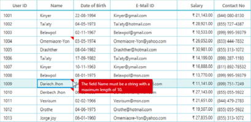

# Data Validation

This section explains you to validate data on errors through different approaches like through events, DataAnnotations, IDataErrorInfo (INotifyDataErrorInfo).

### Overview

SfDataGrid provides a convenient way to validate data and indicate the errors along with its information. GridValidationMode is the dependency property that switches between the modes of validations. The validation modes are as follows:

* None: Disables the validations by Data Annotations and also by underlying Data implementations such as IDataErrorInfo or INotifyDataErrorInfo. By default, GridValidationMode is set to ‘None’.
* InView: Enables the validations and displays the error information in the corresponding cell. Also, you can shift the focus to other cells to view the error information.
* InEdit: Enables the validations and displays the error information in the corresponding cell. You cannot shift the focus to other row.

> _Note: GridColumn.GridValidationMode takes higher priority that its behavior overrides SfDataGrid behavior._

. The following are different approaches to validate errors on data.

* Validation through IDataErrorInfo and INotifyDataErrorInfo (4.5 Framework)
* Validation through Data Annotations
* Validation through Events
### Validation through IDataErrorInfo, INotifyDataErrorInfo

SfDataGrid provide supports Validation by implementing IDataErrorInfo and INotifyDataErrorInfo  interface in DataModel class. You can enable the Validation mode in two different ways using GridValidationMode to InView or InEdit mode.

The following code example illustrates how the Email field is validated for proper format by using Regex. An error message is displayed in the cell when the validation fails.



public class UserInfo : IDataErrorInfo

 {

   public string EMail

    {

            get { return email; }

            set { email = value; OnPropertyChanged("EMail"); }

     }

   public string this[string columnName]

   {

     get

     {

        if (columnName == "EMail")

        {

            return !emailRegex.IsMatch(this.EMail) ? "E-  Mail Id is in InValid format!" : null;

        }

        return null;

      }

  }

}




public class UserInfo : INotifyDataErrorInfo

{

public System.Collections.IEnumerable GetErrors(string propertyName)

{

      if (propertyName == "EMail")

      {

          if (!emailRegex.IsMatch(this.EMail))

          {

               List<string> errorList = new List<string>();

               errorList.Add("E-Mail Id is in InValid format!");

               return errorList;

          }

      }

      return null;

}

}


_DataGrid with Email field validation_

> _Note: GridTemplateColumn and GridUnboundColumn do not support the GridValidationMode in ‘InEdit’ mode._

### Validation through Data Annotations

Once the UI interactive validations are successful, the Data layer validates the corresponding values for the members that specify validation rules. You can use two different modes in Validation like ‘InView’ or ‘InEdit’. System.ComponentModel.DataAnnotations assembly is added to the reference to use DataAnnotations.

> _Note: GridTemplateColumn and GridUnboundColumn do not support the GridValidationMode in ‘InEdit’ mode._

#### Some of the commonly used ValidationAttributes are as follows:

* StringLengthAttribute: Specifies the maximum and minimum number of characters that are allowed for an entity member.
* RequiredAttribute: Specifies that a value is provided for a property.
* RangeAttribute: Designates the minimum and maximum constraints for the associated member.
* RegularExpressionAttribute: Designates a regular expression used for validation of the associated member.
* CustomValidationAttribute: Designates a customized method to execute and to validate the entity member.

The following code example illustrates how the String Length attribute is applied to the Name field, by setting the maximum value for the length of the Name to 10.



[StringLength(10)]

public string Name

{

    get { return name; }

    set { name = value; OnPropertyChanged("Name"); }

}



The following screenshot displays the output.

_DataGrid with Validation through Data Annotations_

### Validation through Events

SfDataGrid offers Validation through events when a cell moves into Edit mode and its focus is lost. Validation is done through the following events:

* Cell Validation
* Row Validation

#### Cell Validation

In CellValidation, two events are raised when focus goes away from the cell in the DataGrid. The following events are associated with CellValidation in the DataGrid control:

* SfDataGrid.CurrentCellValidating: Occurs when save changed value of a cell by shifting the focus away from the cell and by clicking another cell in the same row as the edited cell or by navigating away from the cell.
* SfDataGrid.CurrentCellValidated: Occurs after CurrentCellValidating event. This event is not raised when IsValid property of the CurrentCellValidating event is set to ‘false’.

#### CurrentCellValidating Event

The event handler of the CurrentCellValidating Event receives two arguments namely sender that handles SfDataGrid and CurrentCellValidatingEventArgs as objects. CurrentCellValidatingEventArgs object contains the following properties:

* IsValid: When this property is set to ‘false’, the changed value is not saved to the underlying source, and the CurrentCellValidated event is not raised.
* NewValue: Gets the new value from the edited cell in the DataGrid.
* OldValue: Gets the old value from the edited cell in the DataGrid.
* Column: Gets the Grid Column of the DataGrid.
* ErrorMessage: Gets or sets the error message to notify about the error. By default, this error message is displayed as an Error ToolTip.
* RowData: Gets the edited row data.

When IsValid property is set to ‘false’, the editor of the current cell does not shift to focus. When you navigate away from the cell (within the same row), the navigation is handled, and it remains focused in the current cell.

#### CurrentCellValidated Event

This event is raised when the current cell is validated with the new value and the IsValid property of the CurrentCellValidating event is set to ‘true’. The event handler receives two arguments namely sender that handles SfDataGrid and CurrentCellValidatedEventArgs as objects. CurrentCellValidatedEventArgs object contains the following properties:

* NewValue: Gets the new value from the edited cell in the DataGrid.
* OldValue: Gets the old value from the edited cell in the DataGrid.
* Column: Gets the Grid Column of the DataGrid.
* ErrorMessage: Gets the error message to notify about the error.
* RowData: Gets the edited row data.

The following code example illustrates a simple condition to handle Cell Validation. In this example, the Discount field does not exceed 40 percent, but when it does, an error message is displayed and the focus is not allowed to move anywhere.



private void sfGrid_CurrentCellValidating(object sender, Syncfusion.UI.Xaml.Grid.CurrentCellValidatingEventArgs args)

{

    if (args.Column.MappingName == "Discount" && Convert.ToDouble(args.NewValue) > 40)

    {

         args.ErrorMessage = "Discount should not be more than 40%";

         args.IsValid = false;

    }

}


The following screenshot displays the output.

_DataGrid with Cell Validation_

#### Row Validation

In SfDataGridRowValidation, two events are raised when you edit a cell in a row, and then you can move the focus from the edited row. The following events are associated with Row Validation in the DataGrid control:

* SfDataGrid.RowValidating: Occurs when you save the changed value of a cell by shifting the focus away from the cell and by clicking another cell in a different row or by navigating away from the cell (navigation within the row is allowed).
* SfDataGrid.RowValidated: Occurs after the RowValidating event. This event is not raised when IsValid property of the RowValidating event is set to ‘false’.

#### RowValidating Event

The event handler receives two arguments namely sender that handles SfDataGrid and RowValidatingEventArgs as objects. RowValidatingEventArgs object contains the following properties:

* IsValid: When this property is set to ‘false’, the changed value is not saved to the underlying source, and the RowValidated event is not raised.
* ErrorMessages: It is a dictionary of strings that holds the Column Name as its key and the error message as its value. This error message notifies you about the error. By default, this error message is displayed as an ErrorToolTip.
* RowData: Gets the edited row data
* RowIndex: Gets the row index.

When the IsValid property is set to ‘false’, the editor of the current cell does not shift to focus. When you navigate away from the cell (outside the current row) that is in edit mode, the navigation is handled within the current row alone.

#### RowValidated Event

This event is raised when the row is validated with the updated source, and the Row Validating event’s IsValid is set to ‘true’. The event handler receives two arguments namely sender that handles SfDataGrid and RowValidatedEventArgs as objects.

RowValidatedEventArgs object contains the following properties.

* ErrorMessages: Gets the error message to notify you about the error. 
* RowData: Gets the edited row data
* RowIndiex: Gets the row index.

The following code example illustrates a simple condition to handle Row Validation. In this example, the sum of Expense and Freight is a minimum of 3000, where this is eligible for the discounted price.



private void sfGrid_RowValidating(object sender, Syncfusion.UI.Xaml.Grid.RowValidatingEventArgs args)

{

     var data = args.RowData as OrderInfo;

     if ((data.Expense + data.Freight) < 3000)

     {

          args.ErrorMessages.Add("Expense", "Sum of Expense and Freight should have atleast 3000, which is eligible for Discount!");

          args.IsValid = false;

     }

}


The following screenshot illustrates the output.

_DataGrid with Row Validation_

### How To

#### How to change the Validation error template?

You can customize the Validation tooltip or its icon by writing style or edit the GridCellTemplate in blend.

The following steps take you though Cutomization on Validation error template.

1. Open your project that contains SfDataGrid control in Blend for Visual Studio 2013.
2. You can find your SfDataGrid in “Objects and TimeLine” panel.
3. You can right-click on that.
4. Select “Edit Additional Templates”.
5. Select “Edit CellStyle”.
6. In code view you can get style for GridCell. There you can find “PART_InValidCellBorder”.
7. You can change that path to customize your error Icon.
8. Add the following code example within your resources for customizing Error Tooltip template.



<ControlTemplate x:Key="ValidationToolTipTemplate">

    <Grid x:Name="Root"

          Margin="5,0"

          Opacity="0"

          RenderTransformOrigin="0,0">

        <Grid.RenderTransform>

            <TranslateTransform x:Name="xform" X="-25" />

        </Grid.RenderTransform>

        <VisualStateManager.VisualStateGroups>

            <VisualStateGroup Name="OpenStates">

                <VisualStateGroup.Transitions>

                    <VisualTransition GeneratedDuration="0" />

                    <VisualTransition GeneratedDuration="0:0:0.2" To="Open">

                        <Storyboard>

                            <DoubleAnimation Duration="0:0:0.2"

                                             Storyboard.TargetName="xform"

                                             Storyboard.TargetProperty="X"

                                             To="0">

                                <DoubleAnimation.EasingFunction>

                                    <BackEase Amplitude=".3" EasingMode="EaseOut" />

                                </DoubleAnimation.EasingFunction>

                            </DoubleAnimation>

                            <DoubleAnimation Duration="0:0:0.2"

                                             Storyboard.TargetName="Root"

                                             Storyboard.TargetProperty="Opacity"

                                             To="1" />

                        </Storyboard>

                    </VisualTransition>

                </VisualStateGroup.Transitions>

                <VisualState x:Name="Closed">

                    <Storyboard>

                        <DoubleAnimation Duration="0"

                                         Storyboard.TargetName="Root"

                                         Storyboard.TargetProperty="Opacity"

                                         To="0" />

                    </Storyboard>

                </VisualState>

                <VisualState x:Name="Open">

                    <Storyboard>

                        <DoubleAnimation Duration="0"

                                         Storyboard.TargetName="xform"

                                         Storyboard.TargetProperty="X"

                                         To="0" />

                        <DoubleAnimation Duration="0"

                                         Storyboard.TargetName="Root"

                                         Storyboard.TargetProperty="Opacity"

                                         To="1" />

                    </Storyboard>

                </VisualState>

            </VisualStateGroup>

        </VisualStateManager.VisualStateGroups>

        <Border Margin="4,4,-4,-4"

                Background="#052A2E31"

                CornerRadius="5" />

        <Border Margin="3,3,-3,-3"

                Background="#152A2E31"

                CornerRadius="4" />

        <Border Margin="2,2,-2,-2"

                Background="#252A2E31"

                CornerRadius="3" />

        <Border Margin="1,1,-1,-1"

                Background="#352A2E31"

                CornerRadius="2" />

        <Border Background="#FFDC000C" CornerRadius="2" />

        <Border CornerRadius="2">

            <TextBlock MaxWidth="250"

                       Margin="8,4,8,4"

                       Foreground="White"

                       Text="{TemplateBinding Tag}"

                       TextWrapping="Wrap"

                       UseLayoutRounding="false" />

        </Border>

    </Grid>

</ControlTemplate>



You can change above ControlTemplate codes to change the tooltip style. You can find your GridCell style here.





By changing that highlighted path, you can make your own icon. 

The following screenshot displays the output.

_DataGrid with Changed Validation error template_