# Features

This section explains the key features of SfDataGrid in detail.

## _Features Table_

<table>
<tr>
<td>
Feature</td><td>
Description</td></tr>
<tr>
<td>
DataBinding</td><td>
Supports to bind with different types of data sources.</td></tr>
<tr>
<td>
Master-Detail View</td><td>
Interactive support to display relations using hierarchies.</td></tr>
<tr>
<td>
Editing</td><td>
Interactive support to edit different cell types.</td></tr>
<tr>
<td>
DataValdiataion</td><td>
Interactive support to validate data on errors.</td></tr>
<tr>
<td>
Selection and Key Navigation Support</td><td>
Interactive support to select the row by mouse and touch.</td></tr>
<tr>
<td>
Grouping</td><td>
Interactive support to group the columns.</td></tr>
<tr>
<td>
Summaries</td><td>
Extensive support to show concise information about the individual data columns or group of rows.</td></tr>
<tr>
<td>
Filtering</td><td>
Supports to filter the data.</td></tr>
<tr>
<td>
Sorting</td><td>
Interactive support to sort the columns in Ascending or Descending order.</td></tr>
<tr>
<td>
Paging</td><td>
Supports to perform Paging on the data.</td></tr>
<tr>
<td>
Column Resizing Support</td><td>
Interactive support to resize the columns at Execute time.</td></tr>
<tr>
<td>
Column Freezing</td><td>
Supports to freeze the columns in horizontal scrolling.</td></tr>
<tr>
<td>
Unbound Column Support</td><td>
Extensive support for unbound columns.</td></tr>
<tr>
<td>
Columns Drag and Drop Support</td><td>
Interactive support to reorder the columns by dragging.</td></tr>
<tr>
<td>
Stacked Headers</td><td>
Extensive support to show multiple headers called stacked headers.</td></tr>
<tr>
<td>
Printing</td><td>
Interactive support to print the displayed data.</td></tr>
<tr>
<td>
Exporting</td><td>
Interactive support to export the DataGrid to excel and PDF</td></tr>
<tr>
<td>
Styles and Templates</td><td>
Extensive support to customize every control inside the DataGrid.</td></tr>
<tr>
<td>
DataBinding</td><td>
Supports to bind with the different types of data sources.</td></tr>
<tr>
<td>
Master-Detail View</td><td>
Interactive support to display related data using hierarchies.</td></tr>
<tr>
<td>
Editing</td><td>
Interactive support to edit different cell types.</td></tr>
<tr>
<td>
DataValdiataion</td><td>
Interactive support to validate data on errors.</td></tr>
<tr>
<td>
Selection and Key Navigation Support</td><td>
Interactive support to select the row by mouse and touch.</td></tr>
</table>

## Data Binding

This section explains DataBinding in SfDataGrid, different properties and event available to bind data to SfDataGrid.

### Overview

DataBinding is the master feature of the DataGrid. The DataGrid is bound to an external data source to display the data. DataGrid supports the data sources such as List, Observable Collection, and so on.

The following is the list of properties that supports to Data Binding in various ways.

SfDataGrid.ItemsSource: This Dependency property helps to bind the DataGrid with the collection of objects

SfDataGrid.IsDynamicItemsSource: This Dependency property helps to check whether the bounded items source is dynamic or not. Set this property when you load empty collection of dynamic type.

SfDataGrid.SourceType: This Dependency property decides the type of source collection that is bounded to ItemsSource. This helps to define the SourceType in the following use cases,

1. When you use Inheritance to make collection using derived class and set SourceType as type of Base Class, the Base class property is displayed in the Grid. When you have a collection with two types of object model which is derived form same base class and you can bind the collection to Grid by setting SourceType to to base class type.
2. When you use dynamic collection and set type as particular user defined class, then the properties are displayed in the Grid.

> _Note: It is always not neccessary to set SourceType and IsDynamicItemsSource properties._

The following event is associated with Data Binding.

#### ItemsSourceChanged Event

This event rises when the data source for the Grid is changed by using the ItemsSource property. This event receives two arguments namely sender that handles SfDataGrid and GridItemsSourceChangedEventArgs as objects.

The GridItemsSourceChangedEventArgs object contains the following properties:

* OldItemsSource: Gets the value of old data source.
* NewItemsSource: Gets the value of new data source.

You can use this event when you want to handle operations after ItemsSource bound to Grid. You can access SfDataGrid.View property from this event. You can know more about View in the following section.

### View 

DataGrid has the View property of type ICollectionViewAdv interfacethat implements ICollectionView interface. View is responsible for maintain and manipulation data and other advanced operations like Sorting, Grouping, Filtering and etc. When you bind Collection to ItemsSource property of SfDataGrid, then View will be created and maintains the operations on Data such as Grouping, Filtering, Sorting, Insert, Delete, and Modification. Following are some important properties that can be used for various purposes.

> _Note: DataGrid creates different types of views derived from ICollectionViewAdv interface based on ItemsSource._

#### _Property Table_

<table>
<tr>
<td>
Property</td><td>
Type</td><td>
Description</td></tr>
<tr>
<td>
Records</td><td>
IRecordsList</td><td>
Maintains the Records that are displayed in View when DataGrid is not Grouped.</td></tr>
<tr>
<td>
TopLevelGroup</td><td>
TopLevelGroup</td><td>
Maintains the Group information when DataGrid is Grouped.</td></tr>
<tr>
<td>
TopLevelGroup.DisplayElements</td><td>
GroupDisplayElements</td><td>
Maintains the Records and Group information that are displayed in View when DataGrid is Grouped.</td></tr>
<tr>
<td>
Filter</td><td>
Predicate&lt;object&gt;</td><td>
Get or sets the method that determines the data is suitable to be displayed in View. </td></tr>
<tr>
<td>
FilterPredicates</td><td>
ObservableCollection&lt;IFilterDefinition&gt;</td><td>
Maintains the FilterPredicates that are created while filtering using Filtering UI. </td></tr>
<tr>
<td>
Groups</td><td>
ReadOnlyObservableCollection&lt;object&gt;</td><td>
Maintains the top-level group information. It returns null value when there are no groups. </td></tr>
<tr>
<td>
GroupDescriptions</td><td>
ObservableCollection&lt;GroupDescription&gt;</td><td>
Maintains the GroupDescription collection information. It describes how the items in the collection are grouped in the view.</td></tr>
<tr>
<td>
SortDescriptions</td><td>
SortDescriptionCollection</td><td>
Maintains the SortDescription collection information. It describes how the items in the collection are sort in the view.</td></tr>
<tr>
<td>
SourceCollection</td><td>
IEnumerable</td><td>
Maintains the underlying source collection.</td></tr>
<tr>
<td>
TableSummaryRows</td><td>
ObservableCollection&lt;ISummaryRow&gt;</td><td>
Maintains the TableSummaryRows collection information. To know more about TableSummaries click here</td></tr>
<tr>
<td>
SummaryRows</td><td>
ObservableCollection&lt;ISummaryRow&gt;</td><td>
Maintains the SummaryRows collection information. To know more about summaries ClickHere</td></tr>
<tr>
<td>
CaptionSummaryRows</td><td>
ISummaryRow</td><td>
Maintains the CaptionSummaryRow information.To know more about CaptionSummaries ClickHere</td></tr>
</table>

The following events are associated with View.

#### RecordPropertyChanged

This event is rised when the DataModel property value is changed, if the DataModel implements the INotifyPropertyChanged interface. The event receives with two arguments namely sender that handles the DataModel and PropertyChangedEventArgs as object.

PropertyChangedEventArgs has below property,

PropertName – It denotes the PropertyName of the changed value.

#### CollectionChanged

This event is raised whenever that is some change in Records / DisplayElements collection. The event receives two arguments namely sender that handles View object and NotifyCollectionChangedEventArgs as object.

NotifyCollectionChangedEventArgs has below properties,

Action - It conatains the current action. (i.e) Add, Remove, Move, Replace, Reset.

NewItems-It conatins the list of new items involved in the change.

OldItems-It contains the list of old items affected by the Action.

NewStartingIndex-It contains the index at which the change occurred.

OldStartingIndex-It contains the index at which the Action occurred.

#### SourceCollectionChanged

This event is raised when you make changes in SourceCollection for example add or remove the collection. The event receives two arguments namely sender that handles GridQueryableCollectionViewWrapper object and NotifyCollectionChangedEventArgs as object.

NotifyCollectionChangedEventArgs has below properties,

Action - It conatains the current action. (i.e) Add, Remove, Move, Replace, Reset.

NewItems-It conatins the list of new items involved in the change.

OldItems-It contains the list of old items affected by the Action.

NewStartingIndex-It contains the index at which the change occurred.

OldStartingIndex-It contains the index at which the Action occurred.

The following is the methods that are associated with View which can be used to defer refresh the view.

#### _Method Table_

<table>
<tr>
<td>
Method Name</td><td>
Description</td></tr>
<tr>
<td>
DeferRefresh</td><td>
Enter the defer cycle so that you can perform all data operations in view and update once. </td></tr>
<tr>
<td>
BeginInit & EndInit</td><td>
When BeginInit method is called it suspends all the updates until EndInit method is called. You can perform all the updation with in these methods and update the view at once.</td></tr>
</table>

> _Note: View has properties that already defined in SfDataGrid. It recommended setting those properties via SfDataGrid._

### Complex property Binding

DataGrid control supports to bind Complexproperties to its columns. You can bind complex properties with any level. You can bind more complex binding paths by using DisplayBinding (binding the Data Model in Non-Edit mode) and ValueBinding (binding the Data model in edit mode) properties present in GridColumn. When you set UseBindingValue property in GridColumn to ‘true’ then Sorting, Grouping and Filtering make use of Binding defined in GridColumn instead of reflection in manipulate data. You can set this property when you bind more complex property paths.

For example, OrderInfo class contains the property Customers of “Customer” class type. The Customer object contains two values: CustomerID and Country. You can define the GridColumns for these Complex properties in the “Property.PropertyName” format. 

The following code example illustrates how to create Complex property. For data collection use OrderInfoRepositiory.cs, file.



[CS]

public class OrderInfo

{

    int orderID;

    string customerId;

    string country;

    string customerName;

    string shippingCity;

    Customer customer= new Customer();

    public int OrderID

    {

        get { return orderID; }

        set { orderID = value; }

    }

    public string CustomerID

    {

        get { return customerId; }

        set { customerId = value; }

    }

    public string CustomerName

    {

        get { return customerName; }

        set { customerName = value; }

    }

    public string Country

    {

        get { return country; }

        set { country = value; }

    }

    public string ShipCity

    {

        get { return shippingCity; }

        set { shippingCity = value; }

    }

    public Customer Customers

    {

        get { return customer; }

        set { customer = value; }

    }

    public OrderInfo(int orderId, string customerName, string country, string

    customerId, string shipCity)

    {

        this.OrderID = orderId;

        this.CustomerName = customerName;

        this.Country = country;          

        this.CustomerID = customerId;

        this.Customers.CustomerID = customerId;

        this.Customers.Country = country;

        this.ShipCity = shipCity;

    }

}





[XAML]

<syncfusion:SfDataGrid AutoGenerateColumns="False"

                       ColumnSizer="SizeToHeader"

                       ItemsSource="{Binding OrderInfoCollection}">

    <syncfusion:SfDataGrid.Columns>

        <syncfusion:GridTextColumn MappingName="OrderID" />

        <syncfusion:GridTextColumn MappingName="Customers.CustomerID" />

        <syncfusion:GridTextColumn MappingName="Country" />

        <syncfusion:GridTextColumn MappingName="ShipCity" />

    </syncfusion:SfDataGrid.Columns>

</syncfusion:SfDataGrid>



Execute the above code to render the following output.

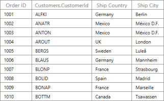

_DataGrid with Complex Property Binding_

> _Note: DataGrid control allows you to set Grouping, Sorting, Filtering and Summaries for Complex property-bound columns. Complex property binding in SfDataGrid does not support LiveDataUpdationMode._

### Dynamic Object Binding

DataGrid control provides extensive support to bind the dynamic object data to DataGrid. For more information about dynamic objects, you can refer below msdn links,

* [http://msdn.microsoft.com/en-us/library/vstudio/dd264741.aspx](http://msdn.microsoft.com/en-us/library/vstudio/dd264741.aspx)
* [http://msdn.microsoft.com/en-us/library/dd264736.aspx](http://msdn.microsoft.com/en-us/library/dd264736.aspx)

>  _Note: Dynamic is not supported in Silverlight hence it is not supported by SfDataGrid also._

The following code example illustrates the dynamic object data creation.



[C#]

public class TestData : List<dynamic>

{

    public TestData()

    {

        string[] gender = new string[] { "Male", "Female" };

        string[] employeeName = new string[]

        {

            "Sean Jacobson",

            "Phyllis Allen",

            "Marvin Allen",

            "Michael Allen",

            "Cecil Allison",

            "Oscar Alpuerto",

            "Sandra Altamirano",

            "Selena Alvarad",

            "Emilio Alvaro",

            "Maxwell Amland",

            "Mae Anderson",

            "Ramona Antrim",

            "Sabria Appelbaum",

            "Hannah Arakawa",

            "Kyley Arbelaez",

        };

        Random r = new Random();

        for (int i = 1; i <= 15; i++)

        {

            dynamic newObj = new ExpandoObject();

            newObj.EmployeeName = employeeName[r.Next(0, 15)];

            newObj.EmployeeId = i + 1000;

            newObj.EmployeeSalary = i * 1000;

            newObj.Gender = gender[r.Next(0, 2)];

            newObj.Value = (double)i;

            Add(newObj);

        }

    }

} 



The following code example illustrates binding dynamic object data to DataGrid.



[XAML]

<Window.DataContext>

    <local:TestData />

</Window.DataContext>

<syncfusion:SfDataGrid x:Name="grid"

                       AutoGenerateColumns="True"

                       ItemsSource="{Binding}" />



The following screenshot displays the output.

 _DataGrid with Dynamic Object Binding_

> _Note: Dynamic Object binding in SfDataGrid does not support LiveDataUpdationMode._

> 

### How To

#### Binding data from WCF service – How to bind and Save the data back to Database

This section explains you how to bind data from WCF Service step-by-step. To create a WCFDataService, you can add a Web project, create an Entity Data Model, and then create the service from the model.

#### To create the Web Project

1. In Visual Studio, select New Project.
2. Add New Project wizard opens.
3. Expand Visual C3 node, select Web node.
4. Now select “ASP.Net Web Application”.
5. Enter name in Name text box then click OK to create project.

 _Add New Project Wizard_

##### To Create the Entity Data Model

1.To create Entity Data Model, you can add “ADO.Net Entity Data Model” to your web project.    
2.Right-click on your Web application.    
3.Select Add option.  
4.Now Select New Item.   
5.Add New Item wizard appears.    
6.Now Select “ADO.Net Entity Data Model” from the template.   
7.In the Name text box, provide “Northwind”.   
8.Now click Add button.   

  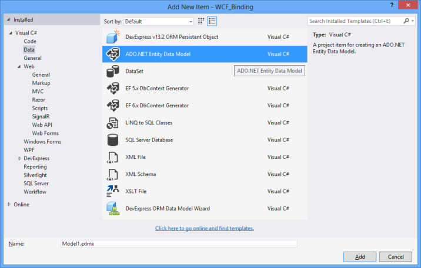  

  _Add New Item Wizard_  

9.When you click Add button, Entity Data Model Wizard opens.   
10.Select Generate from database.  
11.Then select Next button.  
 
   
 _Entity Data Model Wizard_  

12.Choose Your Data Connection page appears.     
13.You can select Northwind sample Database available in the drop-down list.   

    (OR)  

14.Select the NewConnection button to configure a new data connection. For more information, you can refer: [How to: Create Connections to SQL Server Databases](http://msdn.microsoft.com/en-us/library/s4yys16a.aspx).   
15.Select Next button to select tables for use.  
 
   
 _Choose Your Data Connection Page_  

16.Choose Your Database Objects and settings page appears.   
17.Expand Table node.  
18.You can select multiple tables using check boxes.  
19.Now Check Order Details to select that.  

 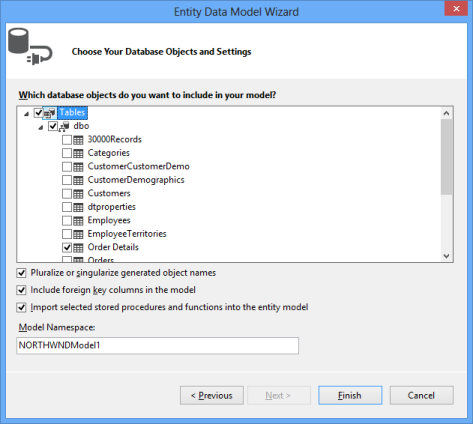  
 _Choose Your Database Objects and settings Page_  

20.Now select Finish. The entity model diagram is displayed, and a “Northwind.edmx” file is added to your web project.  

##### To create the data service

1. Then you need to create web service for your application to use WCF service. 
2. Right-click on your web project, Select Add option.
3. Now select Add New Item.
4. In Add New Item Wizard, select Web node.
5. Select WCF Data Service 5.6.
6. In Name text box enter NorthwinbdService and then select Add button.

_Add New Item Wizard_

7.In the Code Editor, locate the first TODO: make changes as shown in the following code example.



[C#]

public class NorthwindSercvice : DataService<NORTHWNDEntities>

{

    // This method is called only once to initialize service-wide policies.

    public static void InitializeService(DataServiceConfiguration config)

    {

        // TODO: set rules to indicate which entity sets and service operations are visible, updatable, etc.

        // Examples:

        config.SetEntitySetAccessRule("*", EntitySetRights.AllRead);

        // config.SetServiceOperationAccessRule("MyServiceOperation", ServiceOperationRights.All);

        // config.DataServiceBehavior.MaxProtocolVersion = DataServiceProtocolVersion.V3;

    }

}


“NORTHWNDEntities” is from your Entity Data Model. 

8.This step is important to add service reference to your WPF application. On the menu bar, select Debug, Start Without Debugging to Execute the service. A browser window opens and the XML schema for the service is displayed.

##### To Create the Client Application

To create the ClientApplication, you can add a second project, add a service reference to the project, configure a data source, and create a user interface to display the data from the service.

1.You can create Client Application in your WPF application that is used as Startup project.   
2.Create new WPF application within same name space with Northwindditor as its name.   
3.Add Service Reference to your application.  
4.Right-click on your WPF application reference, select Add Service Reference.   
5.Select Discover button.   
6.List of services made in services panel are acquired.  
7.Select Go to add reference to application.  

   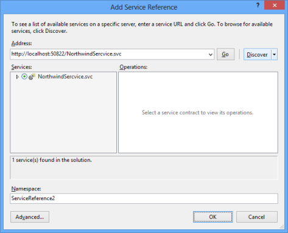  

   _Add Service Reference Wizard_  

8.Enable Data Binding to your service.   
9.On the menu bar, select View, Other Windows, and Data Sources.  
10.In the Data Sources window, select Add New Data Source button.  
11.On Choose a Data Source Type page of the Data Source Configuration Wizard, select Object, and then click the Next button.  
12.On Select the Data Objects page, expand the Northwindditor node, and then expand the Northwindditor.ServiceReference1 node.  
13.Select Order_Detail check box, and then click the Finish button.  
14.Create user interface with your SfDataGrid and set data context.   
15.Add require assemblies to your WPF application.  
16.Set as Startup project.   



[XAML]

<Window x:Class="NorthwindEditor.MainWindow"

        xmlns="http://schemas.microsoft.com/winfx/2006/xaml/presentation"

        xmlns:x="http://schemas.microsoft.com/winfx/2006/xaml"

        xmlns:local="clr-namespace:NorthwindEditor"

        xmlns:syncfusion="http://schemas.syncfusion.com/wpf"

        Title="MainWindow"

        Width="525"

        Height="350">

    <syncfusion:SfDataGrid x:Name="sfdatagrid" AllowEditing="True" />

</Window>



17.Set data context. 
18.In Solution Explorer, open the shortcut menu for the “NorthwindSercvice.svc” file and select View in Browser. Internet Explorer opens and the XML schema for the service is displayed.  
19.Copy the URL from the Internet Explorer address bar.  
20.Use this as http://localhost:50822/NorthwindService.svc/ your service URI.  
21.On the menu bar, select Debug, Start Debugging to execute the application. The customer information is displayed.  



[C#]

this.sfdatagrid.Loaded += sfdatagrid_Loaded;

this.sfdatagrid.AutoGenerateColumns = true;

void sfdatagrid_Loaded(object sender, RoutedEventArgs e)

{

    NORTHWNDEntities northwindEntities = new NORTHWNDEntities(new Uri("http://localhost:50822/NorthwindSercvice.svc/"));

    this.sfdatagrid.ItemsSource = northwindEntities.Order_Details;

}


22.The following screenshot displays the output.  

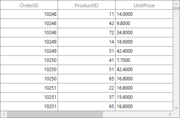

_DataGrid with Customer Deatails_

##### Save Back to Database

You can save the data back to DataBase. You can validate using RowValidating event and then do changes in DataBase. You can add the following code example in RowValidating event. 



[C#]

sfdatagrid.RowValidated += sfdatagrid_RowValidated;

void sfdatagrid_RowValidated(object sender, Syncfusion.UI.Xaml.Grid.RowValidatedEventArgs args)

{

    Order_Details newRecord = args.RowData as Order_Details;

    // Create the DataServiceContext using the service URI.

    NORTHWNDEntities context = new NORTHWNDEntities(new Uri("http://localhost:50822/NorthwindSercvice.svc/"));

    // Get a order to modify using the order ID. 

    Order_Details order = (from order in context.Order_Details

                            where order.OrderID == newRecord.OrderID

                            select order).First();

    // Change some property values.

    order.UnitPrice = newRecord.UnitPrice;

    order.Quantity = newRecord.Quantity;

    try

    {

        // Mark the customer as updated.

        context.UpdateObject(order);                                

        // Send the update to the data service.

        context.SaveChanges();

    }

    catch (DataServiceRequestException ex)

    {

        throw new ApplicationException(

            "An error occurred when saving changes.", ex);

    }

}


After adding, when you edit the value, it gets updated in DataBase.

#### Binding data from ADO.NET -  – How to bind and save the data back to Database

This section explains you how to bind data from ADO.Net data service to SfDataGrid. To use ADO.Net, you need a proper data base connection in SQL or in access or the DataBase that is supported by WPF application as your requirement.

##### To Create a WPF Application

1. In Visual Studio Select New Project from menu File > Add menu items
2. In Add New Project wizard, select WPF Application.
3. In Name text box enter name.
4. Select Add option to create project.
5. Add required assemblies to use SfDataGrid.

##### To Create Database with ADO.Net Provider.

1. On Tools Menu, Select Connect to Database option.
2. Add Connection wizard opens.

_Add Connection Wizard_

3. Make connection as per your availability. 
4. Change option to select your data source.

_Change Data Source page_

5. Refresh to select your Server name.

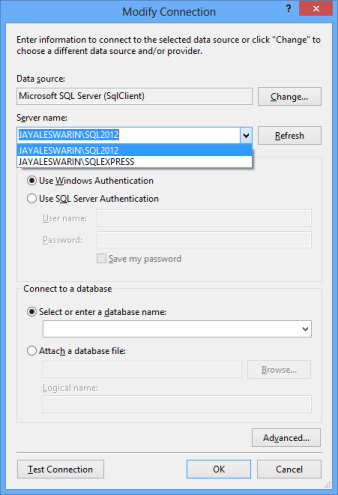

_Modify Connection Page_

6. Select your Database name

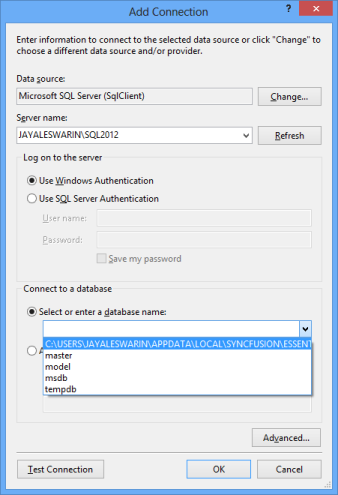

_Add Connection Wizard_

7. Now select Test Connection to check whether connection is successful or not.
8. When Test Connection is successful, you can create itemssource.
9. The Database is added to your server explorer. 

_Server Explorer_

10. Right-click on Database file, select properties. Copy the connection string.

##### To bind data to Grid

1. In MainWindow.cs file add System.Data.SqlClient. 
2. Here your SQL Client provider interacts with Database.
3. To open a connection, you can assign a task for provider.
4. It has SqlDataAdapter to populate data set and updates with DataSource.
5. The following code example illustrates the binded itemssource for a Grid. You can mention the connection string from Database file properties.



[XAML]

<Window x:Class="ADONetAccess.MainWindow"

        xmlns="http://schemas.microsoft.com/winfx/2006/xaml/presentation"

        xmlns:x="http://schemas.microsoft.com/winfx/2006/xaml"

        xmlns:local="clr-namespace:ADONetAccess"

        xmlns:syncfusion="http://schemas.syncfusion.com/wpf"

        Title="MainWindow"

        Width="525"

        Height="350">

    <syncfusion:SfDataGrid x:Name="sfdatagrid"

                           AllowEditing="True"

                           AutoGenerateColumns="True" />

</Window>




[C#]

public partial class MainWindow : Window

{

    DataSet ds = new DataSet();                

    SqlConnection connectionString = new SqlConnection("Data Source=JAYALESWARIN\\SQL2012;Initial Catalog=..\\APPDATA\\LOCAL\\SYNCFUSION\\ESSENTIALSTUDIO\\12.1.0.43\\COMMON\\DATA\\NORTHWND.MDF;Integrated Security=True");       

    SqlDataAdapter adapter= null;

    public MainWindow()

    {

        InitializeComponent();

        BindData();

        sfdatagrid.RowValidated += sfdatagrid_RowValidated;

    }

    private void BindData()

    {

        connectionString.Open();

        adapter = new SqlDataAdapter("Select * from Shippers ", connectionString);

        adapter.Fill(ds, "Shippers");

        sfdatagrid.ItemsSource = ds.Tables["Shippers"];

    }

}



The following screenshot displays the output.

_Data Grid with Binded Data from ADO.NET_

##### Save Back to Database

You can save the data back to Database. You can validate using RowValidating event and then do changes in Database. You can add the following code example in RowValidating event. 



[C#]

sfdatagrid.RowValidated += sfdatagrid_RowValidated;

void sfdatagrid_RowValidated(object sender, Syncfusion.UI.Xaml.Grid.RowValidatedEventArgs args)

{

    adapter.UpdateCommand = new SqlCommand("UPDATE Shippers SET CompanyName = @CompanyName " + "," + "Phone = @Phone " +

    "WHERE ShipperID = @ShipperID", connectionString);

    adapter.UpdateCommand.Parameters.Add("@CompanyName", SqlDbType.NVarChar, 40, "CompanyName");

    adapter.UpdateCommand.Parameters.Add("@Phone", SqlDbType.NVarChar, 24, "Phone");

    SqlParameter parameter = adapter.UpdateCommand.Parameters.Add("@ShipperID", SqlDbType.Int, 4);

    parameter.SourceColumn = "ShipperID";

    parameter.SourceVersion = DataRowVersion.Original;

    DataTable shippersTable = new DataTable();

    shippersTable.Clear();

    adapter.Fill(shippersTable);

    DataRow shippersRow = shippersTable.Rows[args.RowIndex - 1];

    shippersRow["CompanyName"] = (args.RowData as DataRowView).Row.ItemArray[1];

    shippersRow["Phone"] = (args.RowData as DataRowView).Row.ItemArray[2];

    adapter.Update(shippersTable);         

}



After adding, when you edit the value, it gets updated in Database.

#### Entity framework – How to bind and save the data back to Database

This section explains you how to bind data and save back to Database using Entityframework step-by-step. To use Entityframework, you can create a WPF application and require an ADO.Net Entity Data Model.

##### To Create a WPF Application

1. In Visual Studio Select New Project from menu File > Add menu items
2. In Add New Project wizard, select WPF Application.
3. In name text box enter name.
4. Choose Add option to create project.

##### To create Entity Data Model

1. Right-click on your application and select Add option.
2. Now select New Item. Add New Item Wizard opens.
3. From Data node, select “ADO.Net Entity Data Model”. 
4. In the name text box enter EntityBindingFramework and then select Add.

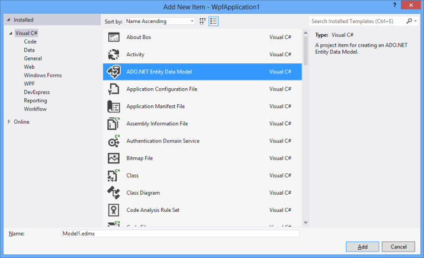

_Add New Item Wizard_

5. Configure Database wizard appears. 
6. Select Generate from database.
7. Select Next button.

_Entity Data Model Wizard_

8. Choose Your Data Connection page appears. 
9. You can select Northwind sample Database available in the drop-down list. 

(OR)

10. Select the NewConnection button to configure a new data connection. For more information, you can refer: [How to: Create Connections to SQL Server Databases](http://msdn.microsoft.com/en-us/library/s4yys16a.aspx). 
11. Select Next button to select tables for use.

_Choose Your Data Connection Page_

12. Click New Connection.

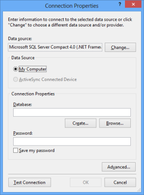

_Connection Properties Wizard_

13. Click Change button to create your database. You can get list of available services.

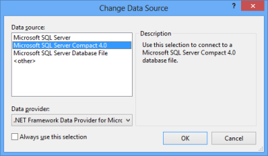

_Change Data Source Wizard_

1. You can use Browse to select your Database. 
2. Click on Test Connection to make the connection successful.

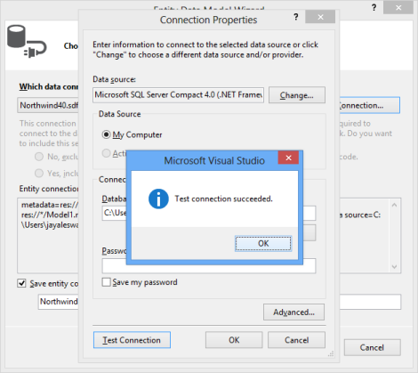

_Connection Properties Page_

3. Then click Next in the Wizard. Dialogue box that contains add Database file to your current project appears. Click Yes
4. Choose Your Database Objects and settings page appears. 
5. Expand Table node.
6. You can select multiple tables using check boxes.
7. Now Check Order Details to select that.

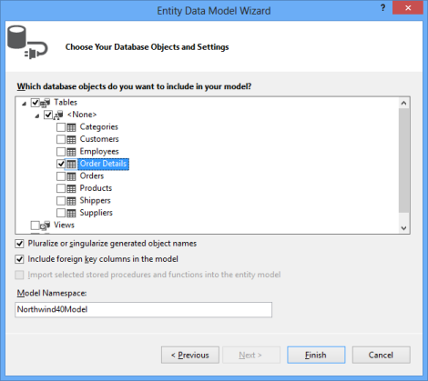

_Entity Data Model Wizard_

Here, Database connection using EntityFramework is completed. EntityBindingFramework.edmx file is added to your application, with your Entity diagram of Order_detail. 

##### To Create View Model



[C#]

public class ViewModel

{

    public ViewModel()

    {

        Northwind40Entities northWind = new Northwind40Entities();

        OrderDetails = (List<Order_Detail>)(from data in northWind.Order_Details

                        select data).ToList();

    }

    private List<Order_Detail> orderdetails;

    public List<Order_Detail> OrderDetails

    {

        get { return orderdetails; }

        set { orderdetails = value; }

    }

}



##### Binding ItemsSource to Grid

Add required assemblies to your WPF application to use SfDataGrid.



[XAML]

<Window x:Class="EntityBinding.MainWindow"

        xmlns="http://schemas.microsoft.com/winfx/2006/xaml/presentation"

        xmlns:x="http://schemas.microsoft.com/winfx/2006/xaml"

        xmlns:local="clr-namespace:EntityBinding"

        xmlns:syncfusion="http://schemas.syncfusion.com/wpf"

        Title="MainWindow"

        Width="525"

        Height="350">

    <Window.DataContext>

        <local:ViewModel />

    </Window.DataContext>

    <syncfusion:SfDataGrid x:Name="sfdatagrid"

                           AllowEditing="True"

                           AutoGenerateColumns="True"

                           ItemsSource="{Binding OrderDetails}" />

</Window>



   Now you can execute the code example to render the following output.

   

_Data Grid with Entity Framework_

##### Save Back to Database

You can save the data back to Database. You can validate using RowValidating event and then do changes in Database. You can add the following code example in RowValidating event. 



[C#]

sfdatagrid.RowValidated +=sfdatagrid_RowValidated;

void sfdatagrid_RowValidated(object sender, Syncfusion.UI.Xaml.Grid.RowValidatedEventArgs args)

{

    // TO Update Data

    Order_Detail newRecord = args.RowData as Order_Detail;

    Northwind40Entities northWind = new Northwind40Entities();

    Order_Detail order = northWind.Order_Details.First(i => i.Order_ID == newRecord.Order_ID);

    order.Order_ID = newRecord.Order_ID;

    order.Product_ID = newRecord.Product_ID;

    order.Quantity = newRecord.Quantity;

    order.Unit_Price = newRecord.Unit_Price;

    order.Discount = newRecord.Discount;

    northWind.Entry(order).State = System.Data.EntityState.Modified;

    northWind.SaveChanges();            

}


After adding, when you edit the value, it gets updated in Database.

#### Linq to SQL – How to bind and Save the data back to Database

This section explains you how to bind data using Linq to SQL step by step. To use Linq to SQL, you can create a WPF application with Linq to SQL Classes

##### To Create a WPF Application

1. In Visual Studio Select New Project from menu File > Add menu items
2. In Add New Project wizard, select WPF Application.
3. In Name text box enter name.
4. Select Add option to create project.

 

5.Right-click on your WPF application. 
6.Select Add option.    
7.Select Add New ItTo create Linq to SQL Classes  em, the Add New Item wizard opens.  
8.Select “LINQ to SQL Classes”   
9.Enter Northwind in Name text box.  
10.Then Select Add button.  

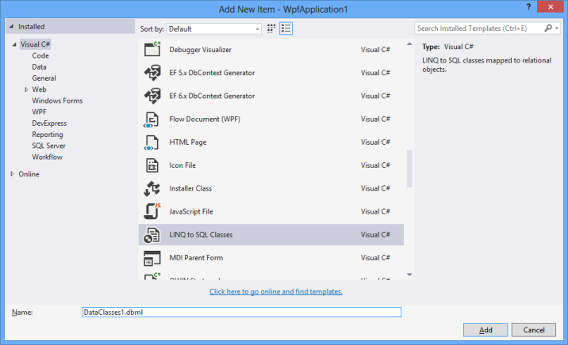

_Add New Item Wizard_

1. After adding this class to your project, create Northwind.dbml file that opens in a design view. 
2. Now you can drag the items.
3. Click Server Explorer.

_Design View_

* You can add new Database connection by clicking add icon button in Server explorer.  

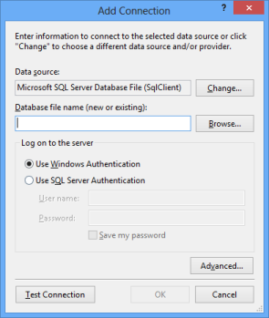

_Add Connection Wizard_

* You can change your DataSource.

_Change Data Source Page_

* Select your DataSource and Provider. You can refresh the AddConnection wizard to select your server name. 

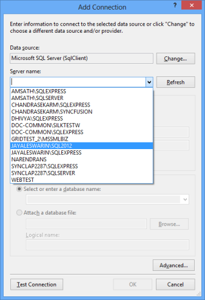

_Add Connection Wizard_

* Select your Database name.

_Add Connection Wizard_

* Check whether the connection is successfull or not.

_Add Connection Wizard with Test connection succeeded pop up_

* When connection is successful, you can add table to use. 
* Then you can drag table to work space .dbml from server explorer. Drag Shippers table to design view.

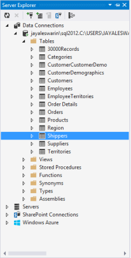

_Server Explorer_

* After you drop the table to Northwind.dbml you can get a Entity model diagram of that table.

##### To Create a View Model



[C#]

public class ViewModel

{

    public ViewModel()

    {

        NorthwindDataContext northWind = new NorthwindDataContext();

        shippers = (from data in northWind.Shippers

                    select data).ToList();

    }

    private List<Shipper> shippers;

    public List<Shipper> Shippers

    {

        get { return shippers; }

        set { shippers = value; }

    }

}


NorthwindDataContext is from Northwind.Designer.cs file (it is from the file that is added with Linq to SQL). Shippers are selected table from Database. 

##### Binding ItemsSource

1. You can design your user interface with SfDataGrid.
2. Add required assemblies to your application. 



[XAML]

<Window x:Class="LinqToSql.MainWindow"

        xmlns="http://schemas.microsoft.com/winfx/2006/xaml/presentation"

        xmlns:x="http://schemas.microsoft.com/winfx/2006/xaml"

        xmlns:local="clr-namespace:LinqToSql"

        xmlns:syncfusion="http://schemas.syncfusion.com/wpf"

        Title="MainWindow"

        Width="525"

        Height="350">

    <Window.DataContext>

        <local:ViewModel />

    </Window.DataContext>

    <syncfusion:SfDataGrid x:Name="sfdatagrid"

                           AllowEditing="True"

                           AutoGenerateColumns="True"

                           ItemsSource="{Binding Shippers}" />

</Window>



3.The following screenshot displays the output.

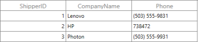

_Data Grid with Data from Linq to SQL_

##### Save Back to Database

You can save the data back to Database. You can validate using RowValidating event and then do changes in Database. You can add the following code example in RowValidating event. 



[C#]

sfdatagrid.RowValidated += sfdatagrid_RowValidated;

void sfdatagrid_RowValidated(object sender, Syncfusion.UI.Xaml.Grid.RowValidatedEventArgs args)

{           

    NorthwindDataContext northWind = new NorthwindDataContext();

    Shipper newRecord = args.RowData as Shipper;

    Shipper shipper = (from data in northWind.Shippers

                            where data.ShipperID == newRecord.ShipperID

                            select data).First() as Shipper;

    shipper.CompanyName = newRecord.CompanyName;

    shipper.Phone = newRecord.Phone;

    northWind.SubmitChanges();                       

}



After adding, when you edit the value, it gets updated in Database.

## Master-Details View

This section explains the SfDataGridMaster-DetailsView support, creation of Master-Details View by using the DataTableRelation and Collection property and Events associated with the Master-Details View

### Overview 

The DataGrid displays hierarchical data in the form of nested tables. In a Hierarchical view, each record in the parent table has an associated set of records in the child table. Every record in the parent table contains an Expander button in DataGrid that can be expanded or collapsed to show or hide the underlying records in the child table. The number of tables nested with relations by using a DataGrid control is unlimited.

#### Defining Master-DetailsView

DataGrid provides the following properties to define the Master-Details relation:

* DetailsViewDefinition: It manages the entire Master-Details relations for a DataGrid, and this property is an ObservableCollection of ViewDefinition objects.
* AutoGenerateRelations: The DataGrid automatically detects the data relations in a data set to display. By default, a relation is created for each data relation in the data set. Hence, the data relations defined in a data set are sufficient for the DataGrid.

The event that participates to create Master-DetailsView is the AutoGeneratingRelations that rises when AutoGenerateRelations is set to true. AutoGeneratingRelations event handler receives two arguments, namely sender that is the SfDataGrid and AutoGeneratingRelationsArgs that are handled as objects. 

AutoGeneratingRelationsArgs object contains following list of properties.

* GridViewDefinition: This property customizes column behaviors such as filtering, sorting, editing, validation, resizing, and deleting. 
* Cancel:  You can cancel the creation of the ViewDefinition to create Master-DetailsView by setting this property to true.

You can use this event to stop creating relation for a parent row. The following code example illustrates how to cancel the creation.



[C#]

sfdatagrid.AutoGeneratingRelations += sfdatagrid_AutoGeneratingRelations;

void sfdatagrid_AutoGeneratingRelations(object sender, Syncfusion.UI.Xaml.Grid.AutoGeneratingRelationsArgs e)

{    

    e.Cancel = true;

}


GridViewDefinition element displays the DataGrid control as nested row elementthatderives from the ViewDefinition. It has the following properties:

* RelationalColumn: Gets or sets the property name that is assigned to the ItemsSource for the details view.
* DataGrid:GridViewDefinition has DataGrid property. You can set the properties for the Master-DetailsGrid by using this DataGrid.

In addition, GridViewDefinition supports the following list of properties in the DataGrid:

* DataGrid.HideEmptyGridViewDefinition: Hides the expander from the data row when ItemsSource of Details View is empty.
* DataGrid.SelectedDetailsViewGrid: Gets the selected Details View DataGrid.
* DataGrid.DetailsViewPadding: Gets or sets the padding data row and the Details View DataGrid.

The following code example illustrates how to define the GridViewDefinition.



[XAML]

<syncfusion:SfDataGrid x:Name="dataGrid"

                       HideEmptyGridViewDefinition="True"

                       ItemsSource="{Binding Path=OrdersDetails}"

                       NavigationMode="Cell"

                       ShowGroupDropArea="True">

    <syncfusion:SfDataGrid.DetailsViewDefinition>

        <syncfusion:GridViewDefinition RelationalColumn="OrderDetails">

            <syncfusion:GridViewDefinition.DataGrid>

                <syncfusion:SfDataGrid x:Name="FirstDetailsViewGrid">

                    <syncfusion:SfDataGrid.Columns>

                        <syncfusion:GridTextColumn HeaderText="Order ID" MappingName="OrderID" />

                        <syncfusion:GridTextColumn HeaderText="Customer ID" MappingName="CustomerID" />

                        <syncfusion:GridTextColumn HeaderText="Product ID"

                                                   MappingName="ProductID"

                                                   TextAlignment="Right" />

                        <syncfusion:GridTextColumn HeaderText="Unit Price"

                                                   MappingName="UnitPrice"

                                                   TextAlignment="Right" />

                        <syncfusion:GridTextColumn MappingName="Quantity" TextAlignment="Right" />

                        <syncfusion:GridNumericColumn MappingName="Discount" TextAlignment="Right" />

                        <syncfusion:GridTextColumn HeaderText="Order Date"

                                                   MappingName="OrderDate"

                                                   TextAlignment="Right" />

                    </syncfusion:SfDataGrid.Columns>

                </syncfusion:SfDataGrid>

            </syncfusion:GridViewDefinition.DataGrid>

        </syncfusion:GridViewDefinition>

    </syncfusion:SfDataGrid.DetailsViewDefinition>

</syncfusion:SfDataGrid>


_Data Grid with Master Details View_

> _Note: In GridViewDefinition, when you make changes in one child DataGrid, changes are applied to all the child DataGrids at that level. For example, when you resize the first column in the child DataGrid, the same column width is applied to all child DataGrids at that level. This scenario is applicable for features like filetring, sorting, validation and ReOrdering columns. You can use stacked headers also in the Master-Detail View._

The following topics explain different methods available to expand or collapse and events to handle during expanding or collapsing. You can use these methods and events to perform your internal operation like stores details view items source or record.

#### Expand or Collapse Master-Details View

The following lists of methods expand or collapse records.

* ExpandAllDetailsView(): Expands all the records in the DataGrid with the Details View.
* CollapseAllDetailsView(): Collapses all the records in the DataGrid with Details View.
* ExpandDetailsViewAt(int recodIndex): Expands the Details View at the specified record index.
* CollapseDetailsViewAt(int recordIndex): Collapses the Details View at the specified record index.

##### DataGrid provides the following events to expand or collapse the Master–Details View:

* DetailsViewExpanding: Occurs before expanding the Details View by using the Expander button.
* DetailsViewExpanded: Occurs after expanding the Details View by using the Expander button.
* DetailsViewCollapsing: Occurs before collapsing the Details View by using the Expander button.
* DetailsViewCollapsed: Occurs after collapsing the Details View by using the Expander button.

The SfDataGrid also provides the following events when the DetailsViewDataGrid gets loaded and unloaded.

* DetailsViewLoading:  Fired when the DetailsViewDataGrid is loading in the view. When the record is expanded and ExpandAllDetailsView method is called, this event is fired for each DetailsViewDataGrid that is loading in view. After calling the ExpandAllDetailsView method, some DetailsViewDataGrids may not be currently in view. For these DetailsViewDataGrids, this event is fired when it brings into view.
* DetailsViewUnloading: Fired when the DetailsViewDataGrid is unloading from view. The DetailsViewDataGrid is unloaded when the grid is scrolled out of view and also when the particular DetailsViewDataGrid is collapsed.

#### DetailsViewExpanding Event

The DetailsViewExpandingEvent handler receives two arguments, namely sender that is SfDataGrid and GridDetailsViewExpandingEventArgs that are handled as objects. The GridDetailsViewExpandingEventArgs object contains the following properties:

* Cancel: When this property is set to true, the event is cancelled and the Details View is not expanded.
* Record: Gets the row data.
* DetailsViewItemsSource: It is a dictionary of strings and IEnumerable objects that hold the Relational Column, its key, and the ItemsSource as its value.

When you do not want a particular parent row expanded, then you can wire this event and do it by checking the value from the record property and Cancel it.



[C#]

void sfdatagrid_DetailsViewExpanding(object sender, GridDetailsViewExpandingEventArgs e)

{

    if((e.Record as OrderInfo).OrderID == 1002)

    e.Cancel = true;

}


#### DetailsViewExpanded Event

The DetailsViewExpanded event handler receives two arguments namely sender that is SfDataGrid and GridDetailsViewExpandedEventArgs thatare handled as objects. The GridDetailsViewExpandedEventArgs object contains the following properties:

* Record: Gets the row data.
* DetailsViewItemsSource: It is a dictionary of strings and IEnumerable objects that hold the Relational Column, its key, and the ItemsSource as its value. 

#### DetailsViewCollapsing Event

The DetailsViewCollapsing event handler receives two arguments namely sender that is SfDataGrid and GridDetailsViewCollapsingEventArgs that are handled as objects. The GridDetailsViewCollapsingEventArgs object contains the following properties:

* Cancel: When this property is set to true, the event is cancelled and the Details View are not expanded.
* Record: Gets the row data.

When you want to avoid collapsing of the parent row, then you can wire this event and check value from record property and Cancel it.



[C#]

void sfdatagrid_DetailsViewCollapsing(object sender, 

GridDetailsViewCollapsingEventArgs e)

{

    if ((e.Record as OrderInfo).OrderID == 1002)

    e.Cancel = true;

}


#### DetailsViewCollapsed Event

The DetailsViewCollapsed event handler receives two arguments namely sender that isSfDataGrid and GridDetailsViewCollapsedEventArgs that are handled as objects. The GridDetailsViewCollapsedEventArgs object contains the following properties:

* Record: Gets the row data.

You can wire those events from XAML or Code-Behind. For example.



[XAML]

<syncfusion:SfDataGrid x:Name="sfdatagrid"

                       AllowEditing="True"

                       AutoGenerateColumns="True"

                       ColumnSizer="Star"

                       DetailsViewExpanding="sfdatagrid_DetailsViewExpanding"

                       ItemsSource="{Binding OrderInfoCollection}">





[C#]

sfdatagrid.DetailsViewExpanding += sfdatagrid_DetailsViewExpanding;



#### DetailsViewLoading Event

The DetailsViewLoading Event handler receives two arguments, namely sender that is SfDataGrid and DetailsViewLoadingAndUnloadingEventArgs. The DetailsViewLoadingAndUnloadingEventArgs object contains the following property:

* DetailsViewDataGrid: The DetailsViewDataGrid is loaded in the view. 
* By accessingthe DetailsViewDataGrid, you can set the Custom Renderers, Custom SelectionController, ResizingController, GridColumnDragDropController, and GridColumnSizer to the DetailsViewDataGrid.



[C#]

this.grid.DetailsViewLoading += grid_DetailsViewLoading;

void grid_DetailsViewLoading(object sender, DetailsViewLoadingAndUnloadingEventArgs e)

{

  // Assigns Custom Selection Controller for the DetailsViewDataGrid.

  e.DetailsViewDataGrid.SelectionController = new  CustomSelectionController(e.DetailsViewDataGrid);

}


It is not preferable to change the value of the public properties like AllowFiltering, AllowSorting, SelectionUnit, AllowDeleting, etc., from this event argument. You can set the value for these properties in the RootDataGrid itself (defined in the GridViewDefinition) as follows.



[XAML]

    <syncfusion:SfDataGrid x:Name="sfdatagrid"

                           AutoGenerateColumns="True"

                           ColumnSizer="Star"

                           ItemsSource="{Binding OrderInfoCollection}">

        <syncfusion:SfDataGrid.DetailsViewDefinition>

            <syncfusion:GridViewDefinition RelationalColumn="ProductDetails">

                <syncfusion:GridViewDefinition.DataGrid>

                    <syncfusion:SfDataGrid x:Name="DetailsView"

                                           AllowDeleting="True"

                                           AllowEditing="True"

                                           AllowFiltering="True"

                                           AllowGrouping="True"

                                           AllowSorting="True"

                                           AutoGenerateColumns="False">

                        <syncfusion:SfDataGrid.Columns>

                            <syncfusion:GridTextColumn MappingName="OrderID" />

                            <syncfusion:GridTextColumn MappingName="ProductName" />

                        </syncfusion:SfDataGrid.Columns>

                    </syncfusion:SfDataGrid>

                </syncfusion:GridViewDefinition.DataGrid>

            </syncfusion:GridViewDefinition>

        </syncfusion:SfDataGrid.DetailsViewDefinition>

    </syncfusion:SfDataGrid>

</Window>



#### DetailsViewUnloading Event

The DetailsViewUnloading Event handler receives two arguments, namely sender that is SfDataGrid and the DetailsViewLoadingAndUnloadingEventArgs.The DetailsViewLoadingAndUnloadingEventArgs object contains the following property:

* DetailsViewDataGrid : The DetailsViewDataGrid is unloaded from view.



[C#]

this.grid.DetailsViewUnloading += grid_DetailsViewUnloading; 

void grid_DetailsViewUnloading(object sender, DetailsViewLoadingAndUnloadingEventArgs e)

{ 

}


#### Limitations

There are some limitations in the Master-DetailsView. Those are:

* It does not have the AddNewRow support.                            
* It does not support Details view Serialization.                 
* It does not have support to bind SelectedItem, CurrentItem.                    
* GroupDropArea is not available for details view grid.                  

_Note: You can use GroupColumnDescriptions to group the column in Master-Details View._' | markdownify }}
### Master-Detail View from DataTable relations

This topic explains step by step procedure to create the Master-Details View by using the DataTable relation. The following example explains you how the Relation is created between the two Datatables as in the SQL relation. 

1. Create New Project in the VisualStudio.
2. Add required assemblies as mentioned in the Getting Started.
3. Now create Data Source.
4. Data Source is created in a hierarchical model. You can create two DataTables. One as parent table, another that acts as a child table.
5. Both tables have common property to make a relation. 
6. Your model should be like as follows.

#### DataTable 1:



[C#]

public class DTModel1

{        

    public DataTable CreateModel()

    {

        var orderInfo = new DataTable();

        orderInfo.Columns.Add("OrderID", typeof(int));

        orderInfo.Columns.Add("CustomerID", typeof(string));

        orderInfo.Columns.Add("CustomerName", typeof(string));

        orderInfo.Columns.Add("Country", typeof(string));

        orderInfo.Columns.Add("ShipCity", typeof(string));                 

        return orderInfo;

    }

} 



#### DataTable 2:



[C#]

public class DTModel2

{        

    public DataTable CreateDTChild()

    {

        var productInfo = new DataTable();

        productInfo.Columns.Add("OrderID", typeof(int));

        productInfo.Columns.Add("ProductName", typeof(string));

        return productInfo;

    }       

} 


> _Note: Both tables have OrderID as common property to make relation._

Now, populate data for DataTables.



[C#]

public class DTRepositiory

{        

public static int value=0;        

public DataTable GetOrdersDetail()

{

    var orders = (new DTModel1()).CreateModel();

    for (int i = 0; i < 10;i++ )

    {

        var row = GetOrderForDT(i, orders);

        orders.Rows.Add(row);

    }                           

    return orders;

}

public DataRow GetOrderForDT(int i, DataTable order)

{

    var row = order.NewRow();

    row[0] = 1000+i;

    row[1] = cutomerID[i];

    row[2] = cutomerName[i];

    row[3] = country[i];

    row[4] = shipcity[i];                        

    return row;         

}

public DataTable GetProductDetail()

{

    var products = (new DTModel2()).CreateDTChild();

    for (int i = 0; i < 10; i++)

    {

        for (int j = 0; j < (i%2==0? 2:3); j++)

        {

            var row = GetProductsForDT(1000 + i, products);

            products.Rows.Add(row);

        }

    }           

    return products;

}

public DataRow GetProductsForDT(int i, DataTable product)

{           

    var row = product.NewRow();             

    row[0]=i;

    row[1] = productsName[value >= 20 ? value= 0:value++];

    return row;    

}

public DataTable GetItemsSource(DataTable t1, DataTable t2)

{

    DataSet ds = new DataSet();

    ds.Tables.Add(t1);

    ds.Tables.Add(t2);

    ds.Relations.Add(new DataRelation("Orders_Products",   

    ds.Tables[0].Columns["OrderID"], ds.Tables[1].Columns["OrderID"]));

    return ds.Tables[0];

}

public string[] cutomerID = new string[]

{

    "Maria Anders",

    "Ana Trujilo",

    "Antonio Moreno",

    "Thomas Hardy",

    "Christina Berglund",

    "Hanna Moos",

    "Frédérique Citeaux",

    "Martin Sommer",

    "Laurence Lebihan",

    "Elizabeth Lincoln"

};

public string[] cutomerName= new string[]

{

    "ALFKI",

    "ANATR",

    "ANTON",

    "AROUT",

    "BERGS",

    "BLAUS",

    "BLONP",

    "BOLID",

    "BONAP",

    "BOTTM"			

};

public string[] country= new string[]

{

    "Germany",

    "Mexico",

    "Mexico",

    "UK",

    "Sweden",

    "Germany",

    "France",

    "Spain",

    "France",

    "Canada"			

};

public string[] shipcity= new string[]

{

    "Berlin",

    "México D.F.",

    "México D.F.",

    "London",

    "Luleå",

    "Mannheim",

    "Strasbourg",

    "Madrid",

    "Marseille",

    "Tsawassen"			

};

public string[] productsName = new string[]

{

    "Laptop",

    "Mobile",

    "Watch",

    "FootWear",

    "Bike",

    "Car",

    "Tablet",

    "Mouse",

    "CPU",

    "KeyBoard",

    "Bags",

    "Books",

    "Fridge",

    "TV",

    "DeskTop",

    "TelePhone",

    "DataCard",

    "PenDrive", 

    "Camera",

    "MP3"

};

}


7. The highlighted lines in the above code example make the Master-Details View.  Now, set ItemsSource byusing the following code example. 



[C#]

public class DTViewModel : INotifyPropertyChanged

{

    public DTRepositiory respository = new DTRepositiory();

    private DataTable orderDetails;

    private DataTable productDetails;

    private DataTable itemsSource;

    public DTViewModel()

    {

        orderDetails = this.respository.GetOrdersDetail();

        productDetails = this.respository.GetProductDetail();

        itemsSource = this.respository.GetItemsSource(orderDetails, productDetails);

    }

    public DataTable OrderDetails

    {

        get { return orderDetails; }

        set

        {

            orderDetails = value;

            RaisePropertyChanged("OrderInfoCollection");

        }

    }

    public DataTable ProductDetails

    {

        get { return productDetails; }

        set

        {

            productDetails = value;

            RaisePropertyChanged("ProductDetails");

        }

    }

    public DataTable ItemsSource

    {

        get { return itemsSource; }

        set

        {

            itemsSource = value;

            RaisePropertyChanged("ItemsSource");

        }

    }

    public event PropertyChangedEventHandler PropertyChanged;

    public void RaisePropertyChanged(string propName)

    {

        if (this.PropertyChanged != null)

            this.PropertyChanged(this, new PropertyChangedEventArgs(propName));

    }

}



8. Bind ItemsSource to the Grid.



[XAML]

<Window x:Class="SimpleApplication.MainWindow"

        xmlns="http://schemas.microsoft.com/winfx/2006/xaml/presentation"

        xmlns:x="http://schemas.microsoft.com/winfx/2006/xaml"

        xmlns:local="clr-namespace:SimpleApplication"

        xmlns:syncfusion="http://schemas.syncfusion.com/wpf"

        Title="MainWindow"

        Width="525"

        Height="350">

    <Window.DataContext>

        <local:DTViewModel />

    </Window.DataContext>

    <syncfusion:SfDataGrid x:Name="sfdatagrid"

                           AutoGenerateColumns="True"

                           AutoGenerateRelations="True"

                           ColumnSizer="Star"

                           ItemsSource="{Binding ItemsSource}" />

</Window>



9. You can enable the AutogGenerateRelations. Internally, the SfDataGrid searches the relation from data set and makes the Nested Grid. To disable it, you can specify the relation names in the RelationalColumn. The following code example illustrates about the AutogGenerateRelations.



[XAML]

<Window x:Class="SimpleApplication.MainWindow"

        xmlns="http://schemas.microsoft.com/winfx/2006/xaml/presentation"

        xmlns:x="http://schemas.microsoft.com/winfx/2006/xaml"

        xmlns:local="clr-namespace:SimpleApplication"

        xmlns:syncfusion="http://schemas.syncfusion.com/wpf"

        Title="MainWindow"

        Width="525"

        Height="350">

    <Window.DataContext>

        <local:DTViewModel />

    </Window.DataContext>

    <syncfusion:SfDataGrid x:Name="sfdatagrid"

                           AutoGenerateColumns="True"

                           AutoGenerateRelations="False"

                           ColumnSizer="Star"

                           ItemsSource="{Binding ItemsSource}">

        <syncfusion:SfDataGrid.DetailsViewDefinition>

            <syncfusion:GridViewDefinition RelationalColumn="Orders_Products" />

        </syncfusion:SfDataGrid.DetailsViewDefinition>

    </syncfusion:SfDataGrid>

</Window>



10. The following screenshot renders the output.

_Data Grid with Master-Detail View from DataTable relations_

### Master-Detail View from Collection property

Master–Details DataGrid displays a hierarchical data in a tree format. This topic explains the simple procedure to create the Master-Details View DataGrid. 

1. Create a NewWPF Project in Visual Studio.
2. Add required assemblies as mentioned in the Getting Started.
3. Now, create simple Data Source. 
4. Create a business model with the Collection property. This value is displayed in a seperate Grid under the parent record in the Grid. 

In the following code example, OrderInfo business class directly bounds to the SfDataGrid and it has ProductDetails property of type List<ProductInfo>. ProductDetails are displayed in the Grid like other property. You can display the ProductDetails property collection in a separate Grid under the OrderInfo record in the Grid using the NestedGrid. 

Add the following code example in a newly created class file and save it as OrderInfo.cs



[C#]

public class OrderInfo

{

    int orderID;

    string customerId;

    string country;

    string customerName;

    string shippingCity;

    List<ProductInfo> productDetails;

    public int OrderID

    {

        get { return orderID; }

        set { orderID = value; }

    }

    public string CustomerID

    {

        get { return customerId; }

        set { customerId = value; }

    }

    public string CustomerName

    {

        get { return customerName; }

        set { customerName = value; }

    }

    public string Country

    {

        get { return country; }

        set { country = value; }

    }

    public string ShipCity

    {

        get { return shippingCity; }

        set { shippingCity = value; }

    }

    public List<ProductInfo> ProductDetails

    {

        get { return productDetails; }

        set { productDetails = value; }

    }

    public OrderInfo(int orderId, string customerName, string country, string

    customerId, string shipCity, List<ProductInfo> productdetails)

    {

        this.OrderID = orderId;

        this.CustomerName = customerName;

        this.Country = country;

        this.CustomerID = customerId;

        this.ShipCity = shipCity;

        this.ProductDetails = productdetails;

    }

}



The ProductDetails property is a List of ProductInfo type. Here you can find the class information of the ProductInfo class. You can add the following code example in a newly created class file and save it as ProductInfo.cs file.



[C#]    
public class ProductInfo
{    
int orderId;    
string productName;    
public int OrderID   
 {       
 get { return orderId; }        
 set { orderId = value; }   
 }   
public string ProductName    
 {        
 get { return productName; }        
 set { productName = value; }    
 }
}

> _Note: Both parent collection and child collection have key property OrderID.

5. Now, load the data for a prepared collection.  Add the following code example in a newly created class file and save it as OrderInfoRepositiory.cs file_._



[C#]

public class OrderInfoRepositiory

{

    ObservableCollection<OrderInfo> orderCollection;        

    public ObservableCollection<OrderInfo> OrderInfoCollection

    {

        get { return orderCollection; }

        set { orderCollection = value; }

    }

    public OrderInfoRepositiory()

    {

        orderCollection = new ObservableCollection<OrderInfo>();

        this.GenerateProducts();

        OrderInfoCollection = GenerateOrders();            

    }

    public ObservableCollection<OrderInfo> GenerateOrders()

    {

        ObservableCollection<OrderInfo> orders = new ObservableCollection<OrderInfo>();

        orders.Add(new OrderInfo(1001, "Maria Anders", "Germany", "ALFKI", "Berlin", getorder(1001)));

        orders.Add(new OrderInfo(1002, "Ana Trujilo", "Mexico", "ANATR", "México D.F.", getorder(1002)));

        orders.Add(new OrderInfo(1003, "Antonio Moreno", "Mexico", "ANTON", "México D.F.", getorder(1003)));

        orders.Add(new OrderInfo(1004, "Thomas Hardy", "UK", "AROUT", "London", getorder(1004)));

        orders.Add(new OrderInfo(1005, "Christina Berglund", "Sweden", "BERGS", "Luleå", getorder(1005)));

        orders.Add(new OrderInfo(1006, "Hanna Moos", "Germany", "BLAUS", "Mannheim", getorder(1006)));

        orders.Add(new OrderInfo(1007, "Frédérique Citeaux", "France", "BLONP", "Strasbourg", getorder(1007)));

        orders.Add(new OrderInfo(1008, "Martin Sommer", "Spain", "BOLID", "Madrid", getorder(1008)));

        orders.Add(new OrderInfo(1009, "Laurence Lebihan", "France", "BONAP", "Marseille", getorder(1009)));

        orders.Add(new OrderInfo(1010, "Elizabeth Lincoln", "Canada", "BOTTM", "Tsawassen", getorder(1010)));

        return orders;

    }

    List<ProductInfo> prod = new List<ProductInfo>();

    public void GenerateProducts()

    {

            prod.Add(new ProductInfo() { OrderID = 1001, ProductName = "Laptop" });

            prod.Add(new ProductInfo() { OrderID = 1001, ProductName = "Mobile" });

            prod.Add(new ProductInfo() { OrderID = 1001, ProductName = "HeadSet" });

            prod.Add(new ProductInfo() { OrderID = 1002, ProductName = "FootWear" });

            prod.Add(new ProductInfo() { OrderID = 1002, ProductName = "Bags" });

            prod.Add(new ProductInfo() { OrderID = 1002, ProductName = "DataCard" });

            prod.Add(new ProductInfo() { OrderID = 1003, ProductName = "TV" });

            prod.Add(new ProductInfo() { OrderID = 1003, ProductName = "Fridge" });

            prod.Add(new ProductInfo() { OrderID = 1004, ProductName = "Watch" });

            prod.Add(new ProductInfo() { OrderID = 1004, ProductName = "Bike" });

            prod.Add(new ProductInfo() { OrderID = 1005, ProductName = "Car" });

            prod.Add(new ProductInfo() { OrderID = 1005, ProductName = "CPU" });

            prod.Add(new ProductInfo() { OrderID = 1005, ProductName = "KeyBoard" });

            prod.Add(new ProductInfo() { OrderID = 1006, ProductName = "Books" });

            prod.Add(new ProductInfo() { OrderID = 1006, ProductName = "PenDrive" });

            prod.Add(new ProductInfo() { OrderID = 1007, ProductName = "Camera" });

            prod.Add(new ProductInfo() { OrderID = 1008, ProductName = "MP3" });

            prod.Add(new ProductInfo() { OrderID = 1008, ProductName = "DeskTop" });

            prod.Add(new ProductInfo() { OrderID = 1008, ProductName = "MemoryCard" });

    }

    public List<ProductInfo> getorder(int i)

    {

        List<ProductInfo> product = new List<ProductInfo>();

        foreach (var or in prod)

            if (or.OrderID == i)

                product.Add(or);

        return product;

    }

}


1. Now, open XAML page in your application. Add names space for the SfDataGrid and create simple application with the SfDataGrid.
2. SfDataGrid.DetailsViewDefinition inthe SfDataGrid creates the Master-Detail DataGrid and RelationalColumn property in GridViewDefinition creates ItemsSource to associate the ChildGrid from the Parent Grid Data. 
3. Create Details-ViewGrid as in the following code example. There are some limitations for the Details-View Grid that is refered by using Master-Details View Section.



[XAML]

<Window x:Class="SimpleApplication.MainWindow"

        xmlns="http://schemas.microsoft.com/winfx/2006/xaml/presentation"

        xmlns:x="http://schemas.microsoft.com/winfx/2006/xaml"

        xmlns:local="clr-namespace:SimpleApplication"

        xmlns:syncfusion="http://schemas.syncfusion.com/wpf"

        Title="MainWindow"

        Width="525"

        Height="350">

    <Window.DataContext>

        <local:OrderInfoRepositiory />

    </Window.DataContext>

    <syncfusion:SfDataGrid AutoGenerateColumns="True"

                           ColumnSizer="Star"

                           ItemsSource="{Binding OrderInfoCollection}">

        <syncfusion:SfDataGrid.DetailsViewDefinition>

           <syncfusion:GridViewDefinition RelationalColumn="ProductDetails" />

        </syncfusion:SfDataGrid.DetailsViewDefinition>

    </syncfusion:SfDataGrid>

</Window>


4. Execute the application; Grid is loaded with Master Details Grid. Click the first record’s expander to render the following output.

_Data Grid with Master-Detail View from Collection property_

### How To

#### Populate through Events

By handling the DetailsViewExpanding event, you can populate the NestedGrid with a new ItemsSource or you can modify the existing ItemsSource. To achieve this, you have to set the ItemsSource by using the DetailsViewItemsSource property. The following code example illustrates this.



[C#]

private void DataGrid_DetailsViewExpanding(object sender, GridDetailsViewExpandingEventArgs e)

{

    e.DetailsViewItemsSource.Clear();

    var orderInfo = e.Record as OrderInfo;

    var itemSource = this.OrdersDetails.Where(customer => customer.OrderID == 

    orderInfo.OrderID);

    e.DetailsViewItemsSource.Add("Details", itemSource);

}




[XAML]

<syncfusion:SfDataGrid x:Name="dataGrid"

                       ItemsSource="{Binding Path=OrdersDetails}"

                       NavigationMode="Cell"

                       ShowGroupDropArea="True">

    <syncfusion:SfDataGrid.DetailsViewDefinition>

        <syncfusion:GridViewDefinition RelationalColumn="Details" />

    </syncfusion:SfDataGrid.DetailsViewDefinition>

</syncfusion:SfDataGrid>

#### Refresh UI when adding the Child Grid records to the Grid

When you set the HideEmptyGridViewDefinition to False and add the items to the DetailsView during Execution time, it does not show the DetailsViewExpander until the Grid is refreshed. You can refresh the particular row alone instead of refreshing the entire Grid by using the UpdateDataRow (int rowIndex) method. To access this method, you can include the Syncfusion.UI.Xaml.Grid.Helpers namespace.

UpdateDataRow method has recordindex or record as a parameter to update that particular row.You can include the Syncfusion.UI.Xaml.Grid namespace to access the ResolveToRowIndex(object item) method. The method ResolveToRowIndex resolves index to refresh the Grid.

The following code example shows you how to add the item to the DetailsView in a Button Click.



[C#]

private void AddItem(object sender, RoutedEventArgs e)

 {

    var Item = DataContext as ViewModel;

    var source = Item.OrdersDetails.Where(data => data.OrderID == 10004).Single();

    var additem1 = new List<OrderDetails>();

    additem1.Add(new OrderDetails(12, 50, 20, 12,8.0, "XYZ", new DateTime(2013, 12, 12)));

    source.OrderDetails=additem1;

    this.dataGrid.UpdateDataRow(dataGrid.ResolveToRowIndex(source));            

  }


#### Customize columns Master-Detail view

You can cusomtize columns and other settings for the Master-Details view Grid for a particular level by using the GridViewDefinition.DataGrid property. In the following code example, Columns are customized for the Master-Details view.



[XAML]

<syncfusion:SfDataGrid x:Name="sfdatagrid"

                       AutoGenerateColumns="True"

                       ColumnSizer="Star"

                       ItemsSource="{Binding OrderInfoCollection}">

    <syncfusion:SfDataGrid.DetailsViewDefinition>

        <syncfusion:GridViewDefinition RelationalColumn="ProductDetails">

            <syncfusion:GridViewDefinition.DataGrid>

                <syncfusion:SfDataGrid x:Name="DetailsView" AutoGenerateColumns="False">

                    <syncfusion:SfDataGrid.Columns>

                        <syncfusion:GridTextColumn MappingName="OrderID" />

                        <syncfusion:GridTextColumn MappingName="ProductName" />

                    </syncfusion:SfDataGrid.Columns>

                </syncfusion:SfDataGrid>

            </syncfusion:GridViewDefinition.DataGrid>

        </syncfusion:GridViewDefinition>

    </syncfusion:SfDataGrid.DetailsViewDefinition>

</syncfusion:SfDataGrid>



The following code example explains how to customize column in code behind.



[XAML]

<syncfusion:SfDataGrid x:Name="sfdatagrid"

                       AutoGenerateColumns="True"

                       ColumnSizer="Star"

                       ItemsSource="{Binding OrderInfoCollection}">

    <syncfusion:SfDataGrid.DetailsViewDefinition>

        <syncfusion:GridViewDefinition RelationalColumn="ProductDetails">

            <syncfusion:GridViewDefinition.DataGrid>

                <syncfusion:SfDataGrid x:Name="DetailsView" AutoGenerateColumns="False" />

            </syncfusion:GridViewDefinition.DataGrid>

        </syncfusion:GridViewDefinition>

    </syncfusion:SfDataGrid.DetailsViewDefinition>

</syncfusion:SfDataGrid>





[C#]

this.DetailsView.Columns.Add(new GridTextColumn() { MappingName = "OrderID" });

this.DetailsView.Columns.Add(new GridTextColumn() { MappingName = "ProductName" });



The following screenshot renders the output of the above code examples. Both gives you the same result.

_Customizing columns Master-Detail view_

You can customize the columns by using the AutoGeneratingRelations event (when you are auto generating the relations) also where you can get GridViewDefintion from the AutoGeneratingRelationsArgs. You can wire that event and customize columns within that event. The following code example explains you how to customize the columns.



[C#]

sfdatagrid.AutoGeneratingRelations += sfdatagrid_AutoGeneratingRelations;

void sfdatagrid_AutoGeneratingRelations(object sender, Syncfusion.UI.Xaml.Grid.AutoGeneratingRelationsArgs e)

{    

    e.GridViewDefinition.DataGrid.Columns.Add(new GridTextColumn() { MappingName = "OrderID" });                                  

}



The following screenshot displays the output.

_Customized columns Master-Detail view_

#### Handle events for Master-Detail View

You can handle events for the actions in the Master-DetailView like in the Parent Grid.You can wire the events by using the GridViewDefinition.DataGrid from XAML or code behind. 



[XAML]

<syncfusion:SfDataGrid.DetailsViewDefinition>

    <syncfusion:GridViewDefinition RelationalColumn="OrderDetails">

        <syncfusion:GridViewDefinition.DataGrid>

            <syncfusion:SfDataGrid x:Name="FirstDetailsViewGrid"                                    

                                   CurrentCellActivating="FirstDetailsViewGrid_CurrentCellActivating"                                   

                                   CurrentCellBeginEdit="FirstDetailsViewGrid_CurrentCellBeginEdit" />

        </syncfusion:GridViewDefinition.DataGrid>

    </syncfusion:GridViewDefinition>

</syncfusion:SfDataGrid.DetailsViewDefinition>




[C#]

this.FirstDetailsViewGrid.CurrentCellBeginEdit += DetailsView_CurrentCellBeginEdit;

this.FirstDetailsViewGrid.CurrentCellActivating += DetailsView_CurrentCellActivating;


When Autogenerating columns, you can wire event by using the AutoGeneratingRelations event. In AutoGeneratingRelations event, you can access the GridViewDefinition from argument. 



[C#]

void dataGrid_AutoGeneratingRelations(object sender, Syncfusion.UI.Xaml.Grid.AutoGeneratingRelationsArgs e)

{

    e.GridViewDefinition.DataGrid.CurrentCellBeginEdit += DataGrid_CurrentCellBeginEdit;

    e.GridViewDefinition.DataGrid.CurrentCellActivating += DataGrid_CurrentCellActivating;

}

void DataGrid_CurrentCellActivating(object sender, Syncfusion.UI.Xaml.Grid.CurrentCellActivatingEventArgs args)

{

}

void DataGrid_CurrentCellBeginEdit(object sender, Syncfusion.UI.Xaml.Grid.CurrentCellBeginEditEventArgs args)

{

}


#### Set properties for Master-Detail View

Master-Details View Grid has the GridViewDefintion property that has the DataGrid property. You can set properties for the Master-Details view by using the GridViewDefinition.DataGrid property. The following code example explains you how to set properties in Master-Details View by using the XAML.



[XAML]

<Window x:Class="SimpleApplication.MainWindow"

        xmlns="http://schemas.microsoft.com/winfx/2006/xaml/presentation"

        xmlns:x="http://schemas.microsoft.com/winfx/2006/xaml"

        xmlns:local="clr-namespace:SimpleApplication"

        xmlns:syncfusion="http://schemas.syncfusion.com/wpf"

        Title="MainWindow"

        Width="525"

        Height="350">

    <Window.DataContext>

        <local:OrderInfoRepositiory />

    </Window.DataContext>

    <syncfusion:SfDataGrid x:Name="sfdatagrid"

                           AutoGenerateColumns="True"

                           ColumnSizer="Star"

                           ItemsSource="{Binding OrderInfoCollection}">

        <syncfusion:SfDataGrid.DetailsViewDefinition>

            <syncfusion:GridViewDefinition RelationalColumn="ProductDetails">

                <syncfusion:GridViewDefinition.DataGrid>

                    <syncfusion:SfDataGrid x:Name="DetailsView"

                                           AllowDeleting="True"

                                           AllowEditing="True"

                                           AllowFiltering="True"

                                           AllowGrouping="True"

                                           AllowSorting="True"

                                           AutoGenerateColumns="False">

                        <syncfusion:SfDataGrid.Columns>

                            <syncfusion:GridTextColumn MappingName="OrderID" />

                            <syncfusion:GridTextColumn MappingName="ProductName" />

                        </syncfusion:SfDataGrid.Columns>

                    </syncfusion:SfDataGrid>

                </syncfusion:GridViewDefinition.DataGrid>

            </syncfusion:GridViewDefinition>

        </syncfusion:SfDataGrid.DetailsViewDefinition>

    </syncfusion:SfDataGrid>

</Window>


The following code example explains how to set the properties for Master-Details View in code behind.



[C#]

this.DetailsView.AllowDeleting = true;

this.DetailsView.AllowSorting = true;

this.DetailsView.AllowEditing = true;

this.DetailsView.AllowFiltering = true;



You can set the properties for the Master-Details View in the AutoGeneratingRelations event also where you get GridViewDefintion from the AutoGeneratingRelationsArgs. You can wire that event and customize columns within that event. 



[C#]

sfdatagrid.AutoGeneratingRelations += sfdatagrid_AutoGeneratingRelations;

void sfdatagrid_AutoGeneratingRelations(object sender, Syncfusion.UI.Xaml.Grid.AutoGeneratingRelationsArgs e)

{

    e.GridViewDefinition.DataGrid.AllowDeleting = true;

    e.GridViewDefinition.DataGrid.AllowEditing = true;

    e.GridViewDefinition.DataGrid.AllowSorting = true;

    e.GridViewDefinition.DataGrid.AllowFiltering = true;            

}


_Master-Details View with set properties_

#### Get SelectedItem in DetailsViewGrid

The SfDataGrid has the SelectedDetailsViewGrid property that returns the Selected Details-View Grid when you use GridViewDefinition. You can access the SelectedItem or SelectedItems via the SelectedDetailsViewGrid.SelectedItem property. You can’t access the SelectedItem property via the GridViewDefinition.DataGrid property. 



[C#]

var data = sfdatagrid.SelectedDetailsViewGrid.SelectedItem;



The following code is to get the selectedItem from the DetailsGrid of Master-DetailsGrid.



[C#]

var data = sfdatagrid.SelectedDetailsViewGrid.SelectedDetailsViewGrid.SelectedItem;


#### Override selection controller in the DetailsViewDataGrid

Like the SfDataGrid, you can override selection controller in the DetailsViewDataGrid also. But, you cannot directly assign custom selection controller to the DataGrid defined in the GridViewDefintion like other properties like AllowEditing, AllowSorting, AllowFiltering, etc. Instead, you can assign custom selection controller to the DetailsViewDataGrid by using the DetailsViewLoading event. The following code illustrates how to assign custom selection controller to the DetailsViewDataGrid.



[C#]

  public class CustomSelectionController : GridSelectionController

    {

        public CustomSelectionController(SfDataGrid dataGrid):base(dataGrid)

        {

        }

    }





[C#]

this.grid.DetailsViewLoading += grid_DetailsViewLoading;

void grid_DetailsViewLoading(object sender, DetailsViewLoadingAndUnloadingEventArgs e)

{

  // Assigns Custom Selection Controller for the DetailsViewDataGrid.

  e.DetailsViewDataGrid.SelectionController = new  CustomSelectionController(e.DetailsViewDataGrid);

}

## Columns

This section explains you how to add Columns, ways to create Column, different types of Column, and Column’s features like Column Sizer, Hiding, Freezing, Resizing Columns, and Drag and Drop support.

### Add Columns

The DataGrid control allows you to add Columns in two ways:

* Automatically generate the Columns based on the underlying collection.
* Manually define the columns in XAML or C#.

### Automatically Generate Columns

The following is a list of properties associated with generating columns.

SfDataGrid.AutoGenerateColumns: This dependency property decides Columns generation for a Grid based on AutoGenerateColumnsMode property. 

SfDataGrid.AutoGenerateColumnsMode: It decides a way to create columns when AutoGenerateColumns is set to’ true’. This enum type has the following four options. 

* Reset: Creates columns for all fields in a Data Source and retains the columns defined explicitly in application level.
* RetainOld: Creates columns for all fields in a Data Source when the Grid does not have any explicit definition for columns. When columns are defined explicitly, then new columns are not created.
* ResetAll: When changing ItemsSource, the columns for previous data are cleared and it creates new columns. Else when you define columns explicitly it does not take defined columns, it takes from underlying collection.
* None: Stores the columns that are defined in DataGrid.Columns.

The DataGrid control by default creates columns for every public property automatically based on the underlying collection that bounds to the DataGrid using ItemsSource property. In this case, AutoGenerateColumns property value is set to ‘true’ and AutoGenerateColumnsMode property value is AutoGenerateColumnsMode.Reset.

> _Note: When you change items source for SfDataGrid during run time, then the columns are generated on the basis of option set for AutoGenerateColumns Mode._

The following is the event that is associated with AutoGeneratingColumns.

### AutoGeneratingColumn Event

This event rises when the AutoGenerateColumns property values is set to ‘true’. This event receives two arguments namely sender that handles SfDataGrid and AutoGeneratingColumnArgs as objects.

The AutoGeneratingColumnArgs object contains the following property:

* Column: This property returns created column when AutoGenerateColumns is set to ‘true’. By using this property, you can manipulate columns.
* Cancel: This property cancels the columns to be created. 

You can use this event where you want to manipulate columns (apply filtering, sorting, grouping, editing, header text) when AutoGenerateColumns is set to ‘true’.

### DataAnnotation with AutoGenerateColumns

SfDataGrid supports DataAnnotations for customizing columns, when AutoGenerateColumns set to ‘true’. When [DisplayAttribute](http://msdn.microsoft.com/en-us/library/system.componentmodel.dataannotations.displayattribute(v=vs.110).aspx), [DataTypeAttribute](http://msdn.microsoft.com/en-us/library/system.componentmodel.dataannotations.datatypeattribute(v=vs.110).aspx), [EditableAttribute](http://msdn.microsoft.com/en-us/library/system.componentmodel.dataannotations.editableattribute.aspx) and [BindableAttribute](http://msdn.microsoft.com/en-us/library/system.componentmodel.bindableattribute.aspx) are specified in model class, columns are generated based on the mentioned attributes that supports DataAnnotation of SfDataGrid.

> _Note: When AutoGenerateColumns property value is set to ‘false’, you can ignore mentioned DataAnnotaions attributes._  

The following example illustrates this scenario. For data collection use OrderInfoRepositiory.cs, file.



[XAML]

<syncfusion:SfDataGrid x:Name="sfdatagrid"

                       AutoGenerateColumns="True"

                       ColumnSizer="Star"

                       ItemsSource="{Binding OrderInfoCollection,

                       Source={StaticResource data}}" />



In the following code example Display keyword mentions different attributes to customize columns.



[C#]

public class OrderInfo

{

    int orderID;

    string customerId;

    string country;

    string customerName;

    string shippingCity;

    [Display(AutoGenerateField= false,Description="This filed is not created")]

    [DataType(DataType.Currency)]

    public int OrderID

    {

        get { return orderID; }

        set { orderID = value; }

    }

    [Display(Order = -1, Description ="This field is hidden")]        

    public string CustomerID

    {

        get { return customerId; }

        set { customerId = value; }

    }

    [Bindable(false)]                        

    public string CustomerName

    {

        get { return customerName; }

        set { customerName = value; }

    }

    [Display(AutoGenerateFilter = true)]   

    [Editable(true)]

    public string Country

    {

        get { return country; }

        set { country = value; }

    }

    [Display(Order = -2)]

    public string ShipCity

    {

        get { return shippingCity; }

        set { shippingCity = value; }

    }

    public OrderInfo(int orderId, string customerName, string country, string

    customerId, string shipCity)

    {

        this.OrderID = orderId;

        this.CustomerName = customerName;

        this.Country = country;

        this.CustomerID = customerId;

        this.ShipCity = shipCity;

    }

}



The following screenshot renders you the output.

_DataGrid with Filter in Country column_

You can see that in Country column it has Filtering enabled in its header.Since AutoGenerateFilter is set to ‘true’, ShipCity have order -2 that displays before CustomerID. When AutoGenerateField is set to ‘false’, OrderID column is not displayed.

### Manually Generate Columns

As mentioned in the second case, the DataGrid control enables you to define columns you want to display in the Grid. You can define the columns by adding a column to the SfDataGrid.Columns collection. The case where you want only the columns manually defined in view, you can set AutoGenerateColumns property value to ‘false’. There are different GridColumns available in SfDataGrid. You can select any column as follows – GridTextColumn, GridNumericColumn, GridCurrencyColumn, GridPercentColumn, GridMaskColumn, GridTimeSpanColumn, etc.  Each column has its own property to show its uniqueness in view and edit mode.

The following code example defines manually to create columns using XAML.



[XAML]

<syncfusion:SfDataGrid x:Name="sfdatagrid"

                       AutoGenerateColumns="False"

                       ColumnSizer="Auto"

                       ItemsSource="{Binding OrderInfoCollection}">

    <syncfusion:SfDataGrid.Columns>

        <syncfusion:GridTextColumn HeaderText="Order ID" MappingName="OrderID" />

        <syncfusion:GridTextColumn HeaderText="Customer ID" MappingName="CustomerID" />

        <syncfusion:GridTextColumn HeaderText="Name of Customer" MappingName="CustomerName" />

        <syncfusion:GridTextColumn HeaderText="Ship Country" MappingName="ShipCountry" />

        <syncfusion:GridTextColumn HeaderText="Ship City" MappingName="ShipCity" />

    </syncfusion:SfDataGrid.Columns>

</syncfusion:SfDataGrid>


The following code example defines manually create columns through C#.



[C#]

void sfdatagrid_Loaded(object sender, RoutedEventArgs e)

{

    sfdatagrid.Columns.Add(new GridTextColumn() { MappingName = "OrderID" });

    sfdatagrid.Columns.Add(new GridTextColumn() { MappingName= "CustomerID"});

    sfdatagrid.Columns.Add(new GridTextColumn() { MappingName = "CustomerName" });

    sfdatagrid.Columns.Add(new GridTextColumn() { MappingName = "Country" });

    sfdatagrid.Columns.Add(new GridTextColumn() { MappingName = "ShipCity" });

}


> _Note: The case where you want to display column in both ways: you can use SfDataGrid.AutoGenerateColumnsMode. to define columns collection and remaining from items Source._

### Column Properties

GridColumn is the base column type of all the columns in the DataGrid. The most important GridColumn properties are listed in the following table:

#### _GridColumn property table_

<table>
<tr>
<td>
Property</td><td>
Type</td><td>
Description</td><td>
Default Value</td></tr>
<tr>
<td>
GridColumn.ActualWidth</td><td>
Double</td><td>
Gets the actual width of the Grid column.</td><td>
Double.NaN</td></tr>
<tr>
<td>
GridColumn.AllowBlankFilters</td><td>
Boolean</td><td>
Gets or sets whether blank filters are allowed in Excel-like filter drop-down list or not.</td><td>
True</td></tr>
<tr>
<td>
GridColumn.AllowDragging</td><td>
Boolean</td><td>
Get or sets whether the columns are allowed to drag in the DataGrid or not.</td><td>
False</td></tr>
<tr>
<td>
GridColumn.AllowEditing</td><td>
Boolean</td><td>
Gets or sets whether the column is editable or not.</td><td>
True</td></tr>
<tr>
<td>
GridColumn.AllowFiltering</td><td>
Boolean</td><td>
Gets or sets whether particular column can be filtered or not.</td><td>
False</td></tr>
<tr>
<td>
GridColumn.AllowFocus</td><td>
Boolean</td><td>
Gets or sets whether focus is allowed to a particular column or not.</td><td>
True</td></tr>
<tr>
<td>
GridColumn.AllowGrouping</td><td>
Boolean</td><td>
Gets or sets whether columns are allowed to group in the DataGrid or not.</td><td>
True</td></tr>
<tr>
<td>
GridColumn.AllowResizing</td><td>
Boolean</td><td>
Gets or sets whether the columns are allowed to be resized or not.</td><td>
False</td></tr>
<tr>
<td>
GridColumn.AllowSorting</td><td>
Boolean</td><td>
Gets or sets  whether sorting is allowed in a Grid Column or not.</td><td>
True</td></tr>
<tr>
<td>
GridColumn.CellStyle</td><td>
Style</td><td>
Customizes the style for cells in the Grid Column.</td><td>
Null</td></tr>
<tr>
<td>
GridColumn.ColumnSizer</td><td>
Enum</td><td>
Specifies the auto column width calculation options for GridColumn</td><td>
None</td></tr>
<tr>
<td>
GridColumn.DisplayBinding</td><td>
Binding</td><td>
Denotes the binding to DateModel in non-edit mode which gives flexibility to format display. </td><td>
Null</td></tr>
<tr>
<td>
GridColumn.FilterPopupStyle</td><td>
Style</td><td>
The property that customizes the style for Filter Pop-up. </td><td>
Null</td></tr>
<tr>
<td>
GridColumn.FilterPopupTemplate</td><td>
DataTemplate</td><td>
The property that  gets or sets and customizes the structure of the Filter Pop-up.</td><td>
Null</td></tr>
<tr>
<td>
GridColumn.HeaderStyle</td><td>
Style</td><td>
The property that  gets or sets and customizes the style for the header cell.</td><td>
Null</td></tr>
<tr>
<td>
GridColumn.HeaderTemplate</td><td>
DataTemplate</td><td>
The property that gets or sets and customizes the structure of the Header cell.</td><td>
Null</td></tr>
<tr>
<td>
GridColumn.HeaderText</td><td>
String</td><td>
The string value that is bounded to the Header text is displayed in Column header.</td><td>
Null</td></tr>
<tr>
<td>
GridColumn.HeaderToolTipTemplate</td><td>
DataTemplate</td><td>
The property that customizes the structure of tooltip for header cell.</td><td>
Null</td></tr>
<tr>
<td>
GridColumn.HorizontalHeaderContentAlignment</td><td>
HorizontalAlignment</td><td>
Sets horizontal alignment for the column header text.</td><td>
HorizontalAlignment.Left</td></tr>
<tr>
<td>
GridColumn.ImmediateUpdateColumnFilter</td><td>
Boolean</td><td>
Specfies whether the filters are applied immediately when the checkbox is toggled in the filter pop-up list.</td><td>
False</td></tr>
<tr>
<td>
GridColumn.IsHidden</td><td>
Boolean</td><td>
The property that allows the column to be hiden.</td><td>
False</td></tr>
<tr>
<td>
GridColumn.MappingName</td><td>
String</td><td>
Property name from DataModel that need to bound to the GridColumn</td><td>
Null</td></tr>
<tr>
<td>
GridColumn.MaximumWidth</td><td>
Double</td><td>
Specifies the maximum width of the Grid Column.</td><td>
Double.NaN</td></tr>
<tr>
<td>
GridColumn.MinimumWidth</td><td>
Double</td><td>
Specifies the minimum width of the Grid Column.</td><td>
Double.NaN</td></tr>
<tr>
<td>
GridColumn.Padding</td><td>
Thickness</td><td>
Specifies the padding thickness for the column’s cell.</td><td>
(5,1,5,1)</td></tr>
<tr>
<td>
GridColumn.ToolTipTemplate</td><td>
DataTemplate</td><td>
The property that customizes the tooltip.</td><td>
Null</td></tr>
<tr>
<td>
GridColumn.UseBindingValue</td><td>
Boolean</td><td>
When set to true then Sorting, Grouping, Filtering and etc will use ValueBinding to access underlying DataModel property value instead of reflection.</td><td>
False</td></tr>
<tr>
<td>
GridColumn.GridValidationMode</td><td>
GridValidationMode</td><td>
Specifies the validation mode for GridColumn.</td><td>
None</td></tr>
<tr>
<td>
GridColumn.ValueBinding</td><td>
Binding</td><td>
Specifies the binding for GridColumns when the gridcell is in edit mode. </td><td>
Null</td></tr>
<tr>
<td>
GridColumn.Width</td><td>
Double</td><td>
Gets or sets the width for Grid Column.</td><td>
Double.NaN</td></tr>
</table>

> _Note: GridTextColumnBase is the abstract class that is derived from GridColumn. GridTextColumn, GridMaskColumn and GridTimeSpanColumn are derived from GridTextColumnBase. GridEditorColumn is another abstract column that is derived from GridColumn. GridNumericColumn, GridCurrencyColumn, GridDateTimeColumn and GridPercentColumn are derived from GridEditorColumn._

The following provides the list of properties that supports the columns having GridTextColumnBase as Base Class.

#### _GridTextColumnBase property table_

<table>
<tr>
<td>
Property</td><td>
Type</td><td>
Description</td><td>
Default Value</td></tr>
<tr>
<td>
GridTextColumnBase.TextTrimming</td><td>
TextTrimming</td><td>
The property trims the value in each cell of the column that has more length than column width in view.</td><td>
TextTrimming.None</td></tr>
<tr>
<td>
GridTextColumnBase.TextWrapping</td><td>
TextWrapping</td><td>
The property trims the value in each cell of the column that has more length than column width in edit.</td><td>
TextWrapping. NoWrap </td></tr>
<tr>
<td>
GridTextColumnBase.TextDecorations</td><td>
TextDecorations</td><td>
The property that customizes the text.</td><td>
new TextDecorationCollection()</td></tr>
</table>
### CellTemplate

CellTemplate support is used to customize columns in display mode that present cells with DataTemplate. You can load standard controls or customized control in display mode to all columns like template column. In edit mode GridColumn loads it default editor.

#### Properties

##### _CellTemplate Properties_

<table>
<tr>
<td>
Property</td><td>
Description</td><td>
Type</td><td>
Default Value</td></tr>
<tr>
<td>
CellTemplate</td><td>
The dependency property that gets or sets the data template of cell in display mode.</td><td>
DataTemplate</td><td>
Null</td></tr>
<tr>
<td>
CellTemplateSelector</td><td>
The dependency property that gets or sets the DataTemplateSelector and apply the defined template to cell in display.</td><td>
DataTemplateSelector</td><td>
Null</td></tr>
<tr>
<td>
SetCellBoundValue</td><td>
The DataContext for DataTemplate is set based on this property that sets the Record as DataContext. When setting this to true, it sets DataContextHelper as DataContext. DataContextHelper has Value and Record properties where the Value is set based on MappingName of the column.</td><td>
bool</td><td>
False</td></tr>
</table>

The following code example illustrates that how to set CellTemplate in Numeric Column.



[XAML]

<syncfusion:GridNumericColumn HeaderText="Quantity"

                              MappingName="UnitPrice"

                              NumberDecimalDigits="0">

    <syncfusion:GridNumericColumn.CellTemplate>

        <DataTemplate>

            <Grid>

                <ProgressBar x:Name="progressBar" Background="Transparent"  

                             Visibility="Visible" Minimum="0" Maximum="200"   

                             BorderThickness="0" Value="{Binding Path= UnitPrice}" />

                <TextBlock  Text="{Binding Path= UnitPrice}" HorizontalAlignment="Right"

                            VerticalAlignment="Center" TextAlignment="Center"/>

            </Grid>

        </DataTemplate>

    </syncfusion:GridNumericColumn.CellTemplate>

</syncfusion:GridNumericColumn>


The above XAML code renders the following output.

### _Cell Template_

When you use CellTemplate for all columns, you can define DataTemplate at once and can bind to different columns with the underlying data to the DataTemplate regardless of MappingName. The property that allows to reuse the DataTemplate to any number of columns with DataTemplate key is SetCellBoundValue. When you enable SetCellBoundValue, it sets the DataContextHelper as DataContext to CellTemplate. DataContextHelper contains the following properties,

* Value – denotes the value from data based on MappingName property.
* Record – denotes the underlying data.

Now you can make use of Value property that provides value based on MappingName property and you can use the same template for any number of Columns that binds the value based on MappingName. 

The following code example illustrates on how to use the above property.



[XAML]

<!-- Need to add this code snippet in Resources

     Define the DataTemplate with Key.-->

<DataTemplate x:Key="DefaultTemplate">

    <TextBlock Text="{Binding Path=Value}" Margin="5" FontWeight="Bold" FontStyle="Italic"/>            

</DataTemplate>

<!-- Define Grid Columns,

     Use the key to column’s CellTemplate property via binding in a                   

     StaticResource and enable SetCellBoundValue. -->

<syncfusion:GridTextColumn MappingName="Quantity" 

                           TextAlignment="Center"                                             

                           SetCellBoundValue="True"

                           CellTemplate="{StaticResource DefaultTemplate}"/>

<syncfusion:GridDateTimeColumn HeaderText="Order Date"              

                               MappingName="OrderDate"    

                               SetCellBoundValue="True"  

                               CellTemplate="{StaticResource DefaultTemplate}"/>

<syncfusion:GridTimeSpanColumn HeaderText="Delivery Time" 

                               MappingName="DeliveryDelay" 

                               SetCellBoundValue="True" 

                               CellTemplate="{StaticResource DefaultTemplate}" />



The above XAML code renders the following output.

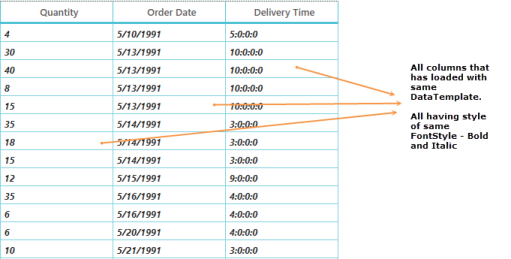

 _MappingName property_

CellTemplateSelector provides a way to select DataTemplate based on the data object and the data-bound element. The following code example explains you on how to use TemplateSelector.

Create required templates with static keys. 



[XAML]

<!-- Need to add this code snippet in Resources-->

<DataTemplate x:Key="DefaultTemplate">

    <TextBlock Text="{Binding Path=Value}" Foreground="Red" TextAlignment="Center" Background="Transparent" />

</DataTemplate>

<DataTemplate x:Key="AlternateTemplate">

    <TextBlock Text="{Binding Path=Value}" Foreground="Green" TextAlignment="Center" Background="Transparent"/>

</DataTemplate>        


Define the templates based on values to be applied in TemplateSelector. The following code example illustrate that how the different Data Templates applied to grid cells.



[C#]

public class TemplateSelector : DataTemplateSelector

{

    private DataTemplate _defaultTemplate;

    /// 

    /// Gets or sets DefaultTemplate

    /// 

    public DataTemplate DefaultTemplate

    {

        get { return _defaultTemplate; }

        set { _defaultTemplate = value; }

    }

    private DataTemplate _alternateTemplate;

    /// 

    /// Gets or Sets AlternateTemplate

    /// 

    public DataTemplate AlternateTemplate

    {

        get { return _alternateTemplate; }

        set { _alternateTemplate = value; }

    }

    private string _propertyToEvaluate;

    /// 

    /// Gets or sets property to evaluate

    /// 

    public string PropertyToEvaluate

    {

        get { return _propertyToEvaluate; }

        set { _propertyToEvaluate = value; }

    }

    public override DataTemplate SelectTemplate(object item, System.Windows.DependencyObject container)

    {

        //The item that comes from CellTemplate is DataContextHelper. When set SetCellBoundValue to true, it sets DataContextHelper as DataContext to DataTemplate. Refer property section of CellTemplate

        OrderInfo dataUnit = (item as DataContextHelper).Record as OrderInfo;

        if (dataUnit == null) return this.DefaultTemplate;

        //use reflection to retrieve property

        Type type = dataUnit.GetType();

        PropertyInfo property = type.GetProperty(this.PropertyToEvaluate);

        //let’s see what template we need to select according to the specified property value

        if (Convert.ToInt16(property.GetValue(dataUnit, null)) < 25)

            return this.AlternateTemplate;

        else

            return this.DefaultTemplate;

    }

}



DataContextHelper is the helper class that contains Record and value property to get row data and the value that bound to respective column. The following code example explains you on how to apply CellTemplateSelector.



[XAML]

<!--In your column you have to defined like this -->

<syncfusion:GridCurrencyColumn CurrencyDecimalDigits="0"

                               HeaderText="UnitPrice"

                               SetCellBoundValue="True"

                               MappingName="Quantity">       

    <syncfusion:GridCurrencyColumn.CellTemplateSelector>

        <local:TemplateSelector DefaultTemplate="{StaticResource DefaultTemplate}"

                                AlternateTemplate="{StaticResource AlternateTemplate}"

                                PropertyToEvaluate="Quantity"/>                                

    </syncfusion:GridCurrencyColumn.CellTemplateSelector>

</syncfusion:GridCurrencyColumn>



The above code renders the following output.

 _CellTemplateSelector_

##### Limitation

1. When you load Editor directly to CellTemplate (Textbox – MS, DoubleTextBox, PercentTextBox, and CurrencyTextBox - Syncfusion) in Template Column without Edit Template the grid cell cannot change to edit mode. You can just edit a value with loaded editor. 
2. GridImageColumn, GridCheckBoxColumn and GridHyperLinkColumn does not contain CellTemplate support. You can check [here](http://help.syncfusion.com/ug/wpf/default.htm) for more reference.

### Column types

Each column has its own functionalities as the columns name implies. You can use any column based on your requirements. The following statements describes you the purpose column.

#### _List of Columns table_

<table>
<tr>
<td>
GridTextColumn</td><td>
When you have string type in underlying collection you can use this column.</td></tr>
<tr>
<td>
GridNumericColumn</td><td>
When you have double type in underlying collection you can use this column.</td></tr>
<tr>
<td>
GridCurrencyColumn</td><td>
When you want your data to be in currency manner, you can use this column.</td></tr>
<tr>
<td>
GridPercentColumn</td><td>
When you want your data to be in percent manner, you can use this column.</td></tr>
<tr>
<td>
GridMaskColumn</td><td>
When you want your data to be masked, you can use this column.</td></tr>
<tr>
<td>
GridTimeSpanColumn</td><td>
When you have TimeSpan type in underlying collection you can use this column.</td></tr>
<tr>
<td>
GridDateTimeColumn</td><td>
When you have DateTime type in underlying collection you can use this column.</td></tr>
<tr>
<td>
GridComboBoxColumn</td><td>
When you need a Combobox in each row, you can use this column.</td></tr>
<tr>
<td>
GridCheckBoxColumn</td><td>
When you need a Check Box in each row, you can use this column.</td></tr>
<tr>
<td>
GridImageColumn</td><td>
When you want to show image in each row, you can use this column.</td></tr>
<tr>
<td>
GridHyperlinkColumn</td><td>
When you want hyperlink button in each row to navigate, you can use this column.</td></tr>
<tr>
<td>
GridTemplateColumn</td><td>
When you want to customize your column, you can use this column.</td></tr>
<tr>
<td>
GridUnboundColumn</td><td>
When you need an additional column that is not from underlying source, you can use this column.</td></tr>
<tr>
<td>
GridMultiColumnDropdownList</td><td>
When you want load multi columns within a drop down you can use this column.</td></tr>
</table>

#### GridTextColumn

GridTextColumn is derived from GridTextColumnBase that is derived from GridColumn and hence it inherits all the properties of GridColumn.  GridTextColumn displays and allows editing of text data.  Each of the cells in GridTextColumn displays text according to the Mapping Name it is binded. 

The following provides the list of all properties that supports GridTextColumn:

* TextAlignment: The property that gets and sets and specifies TextAlignment used to align the text in the column cells. 

The following code example creates GridTextColumn.



[XAML]

<syncfusion:GridTextColumn MappingName="OrderID" TextAlignment="Right" />




[C#]

sfdatagrid.Columns.Add(new GridTextColumn() { MappingName = "OrderID" });


##### Data Formatting in GridTextColumn

To format the value displayed in the GridColumn, you can use StringFormat Property in the DisplayBinding when you want the value to be formatted in View Mode and you can use ValueBinding to set the Edit mode binding.

The following code example shows you how to declare a GridTextColumn in XAML.



[XAML]

<syncfusion:SfDataGrid.Columns>

    <syncfusion:GridTextColumn MappingName="OrderID" TextAlignment="Right" />

    <syncfusion:GridTextColumn DisplayBinding="{Binding Path=UnitPrice,

                                                        StringFormat='{}{0:C}'}"

                               MappingName="UnitPrice"

                               TextAlignment="Right"

                               ValueBinding="{Binding Path=UnitPrice}" />

    <syncfusion:GridTextColumn MappingName="Discount" />

    <syncfusion:GridTextColumn MappingName="Quantity" TextAlignment="Right" />

</syncfusion:SfDataGrid.Columns>



The above XAML code has resulted in the following Output. 

_DataGrid with GridTextColumn_

You can use different [StringFormats](http://msdn.microsoft.com/en-us/library/fbxft59x(v=vs.90).aspx) to customize your value in binding.



[XAML]

StringFormat='{} {0:dddd}'}"  <!--  To Format Date  -->

StringFormat='{}{0:C}'}"      <!--  To Format as Currency  -->

StringFormat='{}{0:P}'}"      <!--  To Format as Percent  -->



#### GridNumericColumn

GridNumericColumn is derived from GridEditorColumn that is derived from GridTextColumn, inheriting its properties and has few additional properties. GridNumericColumn loads DoubleTextBox for editing. In addition to the GridColumn’s properties, GridNumericColumn supports the following list of properties:

#####  _GridNumericColumn property table_

<table>
<tr>
<td>
Property</td><td>
Type</td><td>
Description</td><td>
Default Value</td></tr>
<tr>
<td>
AllowScrollingOnCircle</td><td>
Boolean</td><td>
Specifies whether to change value on MouseWheel or UP ARROW or DOWN ARROW key or not.</td><td>
True</td></tr>
<tr>
<td>
AllowNullValue</td><td>
Boolean</td><td>
Specifies whether the editor accepts NULL value or not.</td><td>
False</td></tr>
<tr>
<td>
MinValue</td><td>
Decimal</td><td>
MinValue is the Dependency Property that restricts the input below the bounded MinValue. </td><td>
Decimal.MinValue</td></tr>
<tr>
<td>
MaxValue</td><td>
Decimal</td><td>
MaxValue is the Dependency Property that restricts the input above the bounded MaxValue.</td><td>
Deciaml.MaxValue</td></tr>
<tr>
<td>
MaxValidation</td><td>
MaxValidation</td><td>
MaxValidation is the Dependency Property that specifies when to perform validation during Key press or focus lost on editor. It is mandatory to have MaxValue when you want to perform MaxValidation on editor. </td><td>
MaxValidation.OnKeyPress</td></tr>
<tr>
<td>
MinValidation</td><td>
MinValidation</td><td>
MinValidation specifies when to perform validation during Key press or focus lost on editor. It is mandatory to have MinValue when you want to perform MinValidation on editor.</td><td>
MinValidation.OnKeyPress</td></tr>
<tr>
<td>
NumerDeciamlDigits</td><td>
Integer</td><td>
NumerDeciamlDigits is the dependency property that specifies the number of decimal places to use numeric value in editor. (Specifies that the number of fractional digits is there).</td><td>
NumberFormatInfo.CurrentInfo.NumberDecimalDigits</td></tr>
<tr>
<td>
NumberDecimalSeparator</td><td>
string</td><td>
NumberDecimalSeparator is the dependency property that separates integral from fractional digits.</td><td>
NumberFormatInfo.CurrentInfo.NumberDecimalSeparator</td></tr>
<tr>
<td>
NumberGroupSeparator</td><td>
string</td><td>
NumberGroupSeparator is the dependency property that specifies the string that separates groups of digits to the left of the decimal in numeric values.</td><td>
NumberFormatInfo.CurrentInfo.NumberGroupSeparator</td></tr>
<tr>
<td>
NumberGroupSizes</td><td>
Int32Collection</td><td>
NumberGroupSizes is the Dependency Property that specifies the Int32Collection or single digit number. Specifies the number of digits in each group to the left of the decimal in numeric values.</td><td>
new Int32Collection {0}</td></tr>
<tr>
<td>
NumberNegativePattern</td><td>
integer</td><td>
NumberNegativePattern is the dependency property that defines the format of negative numeric values. </td><td>
NumberFormatInfo.CurrentInfo.NumberNegativePattern</td></tr>
</table>

The following code example illustrates how to use GridNumericColumn.



[XAML]

<syncfusion:GridNumericColumn AllowScrollingOnCircle="False"

                              HeaderText="Quantity"

                              MappingName="Quantity"

                              NumberDecimalDigits="2"

                              NumberDecimalSeparator="."                       

                              NumberGroupSeparator="," />





[C#]

sfdatagrid.Columns.Add(new GridNumericColumn() { 

                   MappingName = "Quantity", 

                   HeaderText = "Quantity", 

                   AllowScrollingOnCircle = False, 

                   NumberGroupSeparator = ",", 

                   NumberDecimalSeparator = ".", 

                   NumberDecimalDigits = 2 }); 



The following screenshot illustrates the output.

_DataGrid with GridNumericColumn_

#### GridCurrencyColumn

GridCurrencyColumn is derived from GridEditorColumn that is derived from GridTextColumn, inheriting its properties and has few additional properties. GridCurrencyColumn loads CurrencyTextBox for editing. In addition to the GridColumn’s properties, GridCurrencyColumn supports the following list of properties:

##### _GridCurrencyColumn property table_

<table>
<tr>
<td>
Property</td><td>
Type</td><td>
Description</td><td>
Default Value</td></tr>
<tr>
<td>
AllowScrollingOnCircle</td><td>
Boolean</td><td>
Specifies whether to change value on MouseWheel or UP ARROW or DOWN ARROW key.</td><td>
True</td></tr>
<tr>
<td>
AllowNullValue</td><td>
Boolean</td><td>
Specifies whether the editor accepts NULL value.</td><td>
False</td></tr>
<tr>
<td>
CurrencyDecimalDigits</td><td>
Integer</td><td>
CurrencyDecimalDigits is the dependency property that specifies the number of decimal places to use currency value in editor. (Specifies that the number of fractional digits is there).</td><td>
NumberFormatInfo.CurrentInfo.CurrencyDecimalDigits</td></tr>
<tr>
<td>
CurrencyGroupSeparator</td><td>
String</td><td>
CurrencyGroupSeparator is the dependency property that specifies the string and separates groups of digits to the left of the decimal in currency values.</td><td>
NumberFormatInfo.CurrentInfo.CurrencyGroupSeparator</td></tr>
<tr>
<td>
CurrencySymbol</td><td>
String</td><td>
The string that is used as currency symbol.</td><td>
NumberFormatInfo.CurrentInfo.CurrencySymbol</td></tr>
<tr>
<td>
CurrencyDecimalSeparator</td><td>
String</td><td>
CurrencyDecimalSeparator is the dependency property that separates integral from fractional digits.</td><td>
NumberFormatInfo.CurrentInfo.CurrencyDecimalSeparator</td></tr>
<tr>
<td>
CurrencyGroupSizes</td><td>
Int32Collection</td><td>
CurrencyGroupSizes is the Dependency property that specifies the Int32Collection or single digit number. Specifies the number of digits in each group to the left of the decimal in currency values.</td><td>
new Int32Collection {0}</td></tr>
<tr>
<td>
CurrencyPositivePattern</td><td>
Integer</td><td>
CurrencyPositivePattern is the dependency property that defines the format of positive currency values.</td><td>
NumberFormatInfo.CurrentInfo.CurrencyPositivePattern</td></tr>
<tr>
<td>
CurrencyNegativePattern</td><td>
Integer</td><td>
CurrencyNegativePattern is the dependency property that defines the format of negative currency values.</td><td>
NumberFormatInfo.CurrentInfo.CurrencyNegativePattern</td></tr>
<tr>
<td>
MinValue</td><td>
Decimal</td><td>
MinValue is the Dependency property that restricts the input below the bounded MinValue.</td><td>
Decimal.MinValue</td></tr>
<tr>
<td>
MaxValue</td><td>
Decimal</td><td>
MaxValue is the Dependency property that restricts the input above the bounded MaxValue. </td><td>
Decimal.MaxValue</td></tr>
<tr>
<td>
MaxValidation</td><td>
MaxValidation</td><td>
MaxValidation is the Dependency property that specifies when to perform validation during Key press or focus lost on editor. It is mandatory to have MaxValue when you want to perform MaxValidation on editor. </td><td>
MaxValidation.OnKeyPress</td></tr>
<tr>
<td>
MinValidation</td><td>
MinValidation</td><td>
MinValidation specifies when to perform validation during Key press or focus lost on editor. It is mandatory to have MinValue when you want to perform MinValidation on editor. </td><td>
MinValidation.OnKeyPress</td></tr>
</table>

The following code example illustrates how to use GridCurrencyColumn.



[XAML]

<syncfusion:GridCurrencyColumn AllowScrollingOnCircle="False"

                               CurrencyDecimalDigits="2"

                               CurrencyPositivePattern="2"

                               CurrencySymbol="$"

                               HeaderText="UnitPrice"

                               MappingName="UnitPrice" />




[C#]

sfdatagrid.Columns.Add(new GridCurrencyColumn(){

                   MappingName= "UnitPrice", 

                   CurrencyDecimalDigits=2, 

                   CurrencyPositivePattern=2, 

                   CurrencySymbol="$", 

                   HeaderText="UnitPrice"});



The following screenshot illustrates the output.

_DataGrid with GridCurrencyColumn_

#### GridPercentColumn

GridPercentColumn is derived from GridEditorColumn that is derived from GridTextColumn, inheriting its properties and has few additional properties. GridPercentColumn loads PercentTextBox for editing. In addition to the GridColumn’s properties, GridPercentColumn supports the following list of properties:

##### _GridPercentColumn property table_

<table>
<tr>
<td>
Property</td><td>
Type</td><td>
Description</td><td>
Default Value</td></tr>
<tr>
<td>
AllowScrollingOnCircle</td><td>
Boolean</td><td>
Specifies whether to change value on MouseWheel or UP ARROW or DOWN ARROW key.</td><td>
True</td></tr>
<tr>
<td>
AllowNullValue</td><td>
Boolean</td><td>
Specifies whether the editor accepts NULL value or not.</td><td>
False</td></tr>
<tr>
<td>
MinValue</td><td>
Decimal</td><td>
MinValue is the Dependency property that restricts the input below the bounded MinValue.</td><td>
Decimal.MinValue</td></tr>
<tr>
<td>
MaxValue</td><td>
Decimal</td><td>
MaxValue is the Dependency property  that restricts the input above the bounded MaxValue.</td><td>
Decimal.MaxValue</td></tr>
<tr>
<td>
MaxValidation</td><td>
MaxValidation</td><td>
MaxValidation is the Dependency Property that specifies when to perform validation during Key press or focus lost on editor. It is mandatory to have MaxValue when you want to perform MaxValidation on editor.</td><td>
MaxValidation.OnKeyPress</td></tr>
<tr>
<td>
MinValidation</td><td>
MinValidation</td><td>
MinValidation specifies when to perform validation during Key press or focus lost on editor. It is mandatory to have MinValue when you want to perform MinValidation on editor.</td><td>
MinValidation.OnKeyPress.</td></tr>
<tr>
<td>
PercentDecimalDigits</td><td>
Integer</td><td>
PercentDecimalDigits is the dependency property that specifies the number of decimal places to use percent value in editor. (Specifies that the number of fractional digits is there).</td><td>
NumberFormatInfo.CurrentInfo.PercentDecimalDigits</td></tr>
<tr>
<td>
PercentDecimalSeparator</td><td>
String</td><td>
PercentDecimalSeparator is the dependency property that separates integral from fractional digits.</td><td>
NumberFormatInfo.CurrentInfo.PercentDecimalSeparator</td></tr>
<tr>
<td>
PercentGroupSeparator</td><td>
String</td><td>
PercentGroupSeparator is the dependency property that specifies the string and separates groups of digits to the left of the decimal in percent values.</td><td>
NumberFormatInfo.CurrentInfo.PercentGroupSeparator</td></tr>
<tr>
<td>
PercentGroupSizes</td><td>
Int32Collection</td><td>
PercentGroupSizes is the Dependency Property that specifies the Int32Collection or single digit number. Specifies the number of digits in each group to the left of the decimal in currency values.</td><td>
new Int32Collection{0}</td></tr>
<tr>
<td>
PercentNegativePattern</td><td>
Integer</td><td>
PercentNegativePattern is the dependency property that defines the format of negative percent values.</td><td>
NumberFormatInfo.CurrentInfo.PercentNegativePattern</td></tr>
<tr>
<td>
PercentPositivePattern</td><td>
Integer</td><td>
PercentPositivePattern is the dependency property that defines the format of positive percent values.</td><td>
NumberFormatInfo.CurrentInfo.PercentPositivePattern</td></tr>
<tr>
<td>
PercentSymbol</td><td>
String</td><td>
The string that is used as percent symbol.</td><td>
NumberFormatInfo.CurrentInfo.PercentSymbol</td></tr>
<tr>
<td>
PercentEditMode</td><td>
PercentEditMode</td><td>
Indicates the way of editing in percent editor. Possible values are PercentMode, DoubleMode.</td><td>
PercentEditMode.DoubleMode</td></tr>
</table>

The following code example illustrates how to use GridPercentColumn.



[XAML]

<syncfusion:GridPercentColumn HeaderText="Discount"

                              MappingName="Discount"

                              PercentDecimalDigits="2"

                              PercentGroupSeparator=","

                              PercentPositivePattern="1"

                              PercentSymbol="%" />




[C#]

sfdatagrid.Columns.Add(new GridPercentColumn(){

                   HeaderText="Discount",   

                   MappingName="Discount",

                   PercentDecimalDigits=2 ,

                   PercentGroupSeparator=",", 

                   PercentPositivePattern=1, 

                   PercentSymbol="%" });


The following screenshot illustrates the output.

_DataGrid with GridPercentColumn_

#### GridMaskColumn

GridMaskColumn is derived from GridTextColumnBase that is derived from GridColumn, inheriting its properties and has some additional properties. GridMaskColumn uses MaskTextBox for editing. GridMaskColumn supports the following list of properties:

#####  _GridMaskColumn property table_

<table>
<tr>
<td>
Property</td><td>
Type</td><td>
Description</td><td>
Default Value</td></tr>
<tr>
<td>
SelectTextOnFocus</td><td>
Boolean</td><td>
Specifies whether the value in the editor is selected or not when the editor receives focus.</td><td>
False</td></tr>
<tr>
<td>
IsNumeric</td><td>
Boolean</td><td>
Specifies whether the value is Numeric or not.</td><td>
False</td></tr>
<tr>
<td>
Mask</td><td>
String</td><td>
Mask is the dependency property that specifies input logic without writing any custom validation logic.</td><td>
String.Empty</td></tr>
<tr>
<td>
MaskFormat</td><td>
MaskFormat</td><td>
Specifies the display format when mask value is used. It determines whether the literals and prompt characters are included in the formatted string. To know more about MaskFormat {{ '[Click Here](http://help.syncfusion.com/wpf/tools)' | markdownify }}</td><td>
MaskFormat.ExcludePromptAndLiterals</td></tr>
<tr>
<td>
DateSeparator</td><td>
String</td><td>
DateSeparator is the dependency property that separates Month, Date and Year when DateTime type value is bounded to editor.</td><td>
String.Empty</td></tr>
<tr>
<td>
DecimalSeparator</td><td>
String</td><td>
DecimalSeparator is the dependency property that separates integral from fractional digits.</td><td>
String.Empty</td></tr>
<tr>
<td>
PromptChar</td><td>
String</td><td>
PromptChar is the dependency property that represents absence of user input. </td><td>
‘_’</td></tr>
<tr>
<td>
TimeSeparator</td><td>
String</td><td>
TimeSeparator is the dependency property that separates hours, minutes and seconds.</td><td>
String.Empty</td></tr>
</table>

> _Note: Mask definition is mandatory to use Date separator, Time Separator, Prompt Char and Decimal Separator._

The following code example illustrates how to use GridMaskColumn.



[XAML]

<syncfusion:GridMaskColumn HeaderText="Contact Number"

                           IsNumeric="True"

                           MappingName="ContactNumber"

                           Mask="(99)-9999"

                           MaskFormat="IncludePrompt" />





[C#]

sfdatagrid.Columns.Add(new GridMaskColumn(){

                   HeaderText="Contact Number",

                   IsNumeric=true,

                   MappingName="ContactNumber", 

                   Mask="(99)-9999",MaskFormat= MaskFormat.IncludePrompt});



The following screenshot illustrates the output.

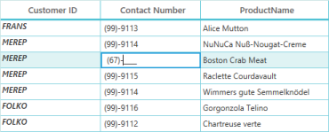

_DataGrid with GridMaskColumn_

#### GridTimeSpanColumn

GridTimeSpanColumn is derived from GridTextColumnBase that is derived from GridColumn, inheriting its properties and has some additional properties. GridTimeSpanColumn uses TimeSpanEdit for editing. GridTimeSpanColumn supports the following list of properties:

##### _GridTimeSpanColumn property table_

<table>
<tr>
<td>
Property</td><td>
Type</td><td>
Description</td><td>
Default Value</td></tr>
<tr>
<td>
AllowNull</td><td>
Boolean</td><td>
Specifies whether an editor can accept Null Value or not.</td><td>
False</td></tr>
<tr>
<td>
AllowScrollingOnCircle</td><td>
Boolean</td><td>
Specifies whether to change value on MouseWheel or UP ARROW or DOWN ARROW key or not.</td><td>
True</td></tr>
<tr>
<td>
NullText</td><td>
String</td><td>
NullText is the dependency property that specifies the editor value when the user input is null.</td><td>
String.Empty</td></tr>
<tr>
<td>
ShowArrowButtons</td><td>
Boolean</td><td>
Specifies whether arrow buttons are visible or not.</td><td>
True</td></tr>
<tr>
<td>
MaxValue</td><td>
TimeSpan</td><td>
MaxValue is the Dependency property that restricts the input above the bounded MaxValue.</td><td>
System.TimeSpan.MaxValue</td></tr>
<tr>
<td>
MinValue</td><td>
TimeSpan</td><td>
MinValue is the Dependency property that restricts the input below the bounded MinValue.</td><td>
System.TimeSpan.MinValue</td></tr>
</table>

The following code example illustrates how to use GridTimeSpanColumn.



[XAML]

<syncfusion:GridTimeSpanColumn AllowNull="True"

                               AllowScrollingOnCircle="True"

                               HeaderText="Delivery Time"

                               MappingName="DeliveryDelay" />




[C#]

sfdatagrid.Columns.Add(new GridTimeSpanColumn() { 

                   AllowNull = true, 

                   AllowScrollingOnCircle = true, 

                   HeaderText = "Delivery Time", 

                   MappingName = "DeliveryDelay" });


The following screenshot illustrates the output.

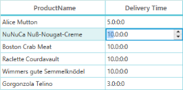

_DataGrid with GridTimeSpanColumn_

#### GridDateTimeColumn

GridDateTimeColumn derives from GridTextColumnBase that derives from GridColumn inheriting its properties and includes other properties as follows. GridDateTimeColumn uses DateTimeEdit for editing. GridDateTimeColumn supports the following list of properties:

##### _GridDateTimeColumn property table_

<table>
<tr>
<td>
Property</td><td>
Type</td><td>
Description</td><td>
Default Value</td></tr>
<tr>
<td>
AllowScrollingOnCircle</td><td>
Boolean</td><td>
Specifies whether to change value on MouseWheel or UP ARROW or DOWN ARROW key.</td><td>
True</td></tr>
<tr>
<td>
AllowNullValue</td><td>
Boolean</td><td>
Specifies whether the editor accepts NULL value or not.</td><td>
False</td></tr>
<tr>
<td>
EnableClassicStyle</td><td>
Boolean</td><td>
Specifies whether to enable classic style for the DateTime dropdown or not.</td><td>
False</td></tr>
<tr>
<td>
DisableDateSelection</td><td>
Boolean</td><td>
Specifies whether to disable date selection in the DateTime dropdown or not.</td><td>
False</td></tr>
<tr>
<td>
ShowRepeatButton</td><td>
Boolean</td><td>
Specifies whether to show repeat button in the editor or not.</td><td>
False</td></tr>
<tr>
<td>
Pattern</td><td>
DateTimePattern</td><td>
Specifies the pattern to display bounded value. Like ShortDate or LongDate</td><td>
DateTimePattern.ShortDate</td></tr>
<tr>
<td>
DateTimeFormat</td><td>
DateTimeFormatInfo</td><td>
Defines the format to display the date in editor</td><td>
DateTimeFormatInfo.CurrentInfo</td></tr>
<tr>
<td>
NullValue</td><td>
DateTime?</td><td>
NullValue is the dependency property that specifies the value in editor when User Input is Null </td><td>
null</td></tr>
<tr>
<td>
NullText</td><td>
String</td><td>
NullText is the dependency property that specifies the string in editor when User Input is Null</td><td>
String.Empty</td></tr>
<tr>
<td>
MinDateTime</td><td>
DateTime</td><td>
MinDateTime is the Dependency property that restricts the input below the bounded MinDateTime.</td><td>
System.DateTime.MinValue</td></tr>
<tr>
<td>
MaxDateTime</td><td>
DateTime</td><td>
MaxDateTime is the Dependency property that restricts the input above the bounded MaxDateTime.</td><td>
System.DateTime.MaxValue</td></tr>
<tr>
<td>
CustomPattern</td><td>
String</td><td>
CustomPattern is the dependency property that specifies the customized pattern to display DateTime like other Pattern. </td><td>
String.Empty</td></tr>
<tr>
<td>
CanEdit</td><td>
Boolean</td><td>
Specifies whether editor is edited or not.</td><td>
False</td></tr>
<tr>
<td>
EnableBackspaceKey</td><td>
Boolean</td><td>
Specifies whether Backspace Key is enabled or not.</td><td>
False</td></tr>
<tr>
<td>
EnableDeleteKey</td><td>
Boolean</td><td>
Specifies whether Delete Key is enabled or not.</td><td>
False</td></tr>
</table>

> _Note: NullValue is displayed when AllowNullValue is set to ‘true’. NullValue takes higher priority than NullText._

The following code example illustrates how to use GridDateTimeColumn.



[XAML]

<syncfusion:GridDateTimeColumn AllowScrollingOnCircle="True"

                               DisableDateSelection="False"

                               HeaderText="Order Date"

                               MappingName="OrderDate"

                               Pattern="ShortDate"

                               ShowRepeatButton="True" />




[C#]

sfdatagrid.Columns.Add(new GridDateTimeColumn() { 

                   AllowScrollingOnCircle = true, 

                   DisableDateSelection = false, 

                   HeaderText = "Order Date", 

                   MappingName = "OrderDate",

                   Pattern = DateTimePattern.ShortDate, 

                   ShowRepeatButton = true });


The following screenshot illustrates the output.

_DataGrid with GridDateTimeColumn_

#### GridComboBoxColumnn

GridComboBoxColumn is derived from GridColumn, and hence it inherits all the properties of GridColumn. GridComboBoxColumn provides combobox for editing cell values and it displays a set of predefined values that is set to ItemSource in dropdown list.

##### To use GridComboBoxColumn, you can refer the following:

 _GridComboBoxColumn property table_

<table>
<tr>
<td>
Property</td><td>
Type</td><td>
Description</td><td>
Default Value</td></tr>
<tr>
<td>
SelectedValuePath</td><td>
String</td><td>
Gets or sets the path that is used to get SelectedValue and SelectedItem.</td><td>
Null</td></tr>
<tr>
<td>
ItemSource</td><td>
IEnumerable</td><td>
Gets or sets the collection used to generate content for the dropdown list in the Column.</td><td>
Null</td></tr>
<tr>
<td>
DisplayMemberPath</td><td>
String</td><td>
Gets or sets a path to a value on the source object to serve as the visual representation of the object.</td><td>
String.Empty</td></tr>
<tr>
<td>
StaysOpenOnEdit</td><td>
Boolean</td><td>
Specifies whether a combobox  is opened and displays a drop-down control that remains open when you click the text box.</td><td>
False</td></tr>
<tr>
<td>
IsEditable</td><td>
Boolean</td><td>
Specifies a value whether editing of the text in text box of the combobox is enabled or not.</td><td>
False</td></tr>
<tr>
<td>
ItemTemplate</td><td>
DataTemplate</td><td>
ItemTemplate is the dependency property that specifies the DataTemplate displays each item or not.</td><td>
Null</td></tr>
</table>

##### The following code example displays how to use GridComboBoxColumn.



 [XAML]

<syncfusion:SfDataGrid.Columns>

    <syncfusion:GridTextColumn MappingName="OrderID" TextAlignment="Right" />

    <syncfusion:GridComboBoxColumn ItemsSource="{Binding Path=ComboItems, Source={StaticResource viewmodel}}" MappingName="ProductName" />

    <syncfusion:GridTextColumn MappingName="UnitPrice" />

    <syncfusion:GridTextColumn MappingName="Discount" />

    <syncfusion:GridTextColumn MappingName="Quantity" TextAlignment="Right" />

</syncfusion:SfDataGrid.Columns>





[C#]

sfdatagrid.Columns.Add(new GridComboBoxColumn() { 

                   ItemsSource = viewmodel.ComboItems,

                   MappingName = "ProductName" });



The above XAML Code has resulted in the following output:

_DataGrid with GridComboBoxColumn_

The following code example shows how to use ItemTemplate in GridComboBoxcolumn.



[XAML]

<syncfusion:GridComboBoxColumn ItemsSource="{Binding Path=ComboBoxItemsSource, Source={StaticResource viewmodel}}" MappingName="ProductName">

    <syncfusion:GridComboBoxColumn.ItemTemplate>

        <DataTemplate>

            <Grid>

                <TextBlock Text="{Binding}" />

            </Grid>

        </DataTemplate>

    </syncfusion:GridComboBoxColumn.ItemTemplate>

</syncfusion:GridComboBoxColumn>



The above XAML code has resulted in the following output:

_GridComboBoxColumn with Item Template_

The event associated with this column is CurrentCellDropDownSelectionChanged Event

This event occurs whenever a selected item is changed in Drop Down column such as GridComboBoxColumn. The event handler receives two arguments namely sender that handles SfDataGrid and CurrentCellDropDownSelectionChangedEventArgs as objects.

##### The CurrentCellDropDownSelectionChangedEventArgs object contains the following properties:

* RowColumnIndex: Gets the value of the current RowColumnIndex.
* SelectedIndex: Gets the selected index from the Drop Down control.
* SelectedItem: Gets the selected item from the Drop Down control.
#### GridCheckBoxColumn

GridCheckBoxColumn is derived from GridColumn, and hence it inherits all the properties of GridColumn too.  GridCheckBoxColumn does not load Display element and Edit element individually. It just loads Checkbox in that column to make value changes in it. You can change the underlying data source that toggles the values shown in checkbox.

##### The following provides the list of all properties that supports GridCheckBoxColumn:

 _GridCheckBoxColumn property table_

<table>
<tr>
<td>
Property</td><td>
Type</td><td>
Description</td><td>
Default Value</td></tr>
<tr>
<td>
IsThreeState</td><td>
Boolean</td><td>
Specifies whether the Checkbox supports two or three states.(Checked, Unchecked and Intermediate)</td><td>
False</td></tr>
<tr>
<td>
HorizontalAlignment</td><td>
HorizontalAlignments</td><td>
Determines the HorizontalAlignment of the Checkbox in regard with the GridCell.</td><td>
HorizontalAlignment.Center</td></tr>
<tr>
<td>
VerticalAlignment</td><td>
VerticalAlignment</td><td>
Determines the VerticalAlignment of the Checkbox in regard with the GridCell.</td><td>
VerticalAlignment.Center</td></tr>
</table>

The following code example shows how to use GridCheckBoxColumn.



[XAML]

<syncfusion:SfDataGrid.Columns>

    <syncfusion:GridTextColumn MappingName="OrderID" TextAlignment="Right" />

    <syncfusion:GridTextColumn MappingName="UnitPrice" TextAlignment="Right" />

    <syncfusion:GridTextColumn MappingName="Discount" TextAlignment="Right" />

    <syncfusion:GridCheckBoxColumn MappingName="IsClosed" />

    <syncfusion:GridTextColumn MappingName="Quantity" TextAlignment="Right" />

</syncfusion:SfDataGrid.Columns>





[C#]

sfdatagrid.Columns.Add(new GridCheckBoxColumn() { MappingName = "IsClosed" });


The above XAML Code has resulted in following Output:

_DataGrid with GridCheckBoxColumn_

> _Note: Due to its behavior (Directly loading CheckBox), it does not fire events of CurrentCellValidating and CurrentCellValidated. You can use CurrentCellValueChanged Event._

 

#### GridImageColumn

GridImageColumn is derived from GridColumn, and hence it inherits all the properties of GridColumn too. GridImageColumn displays read-only images for the columns.

##### The following provides the list of all properties that supports GridImageColumn:

###### _GridImageColumn property table_

<table>
<tr>
<td>
Property</td><td>
Type</td><td>
Description</td><td>
Default Value</td></tr>
<tr>
<td>
Stretch</td><td>
Stretch</td><td>
Determines a value that describes how an image is stretched to fill in the GridCell.</td><td>
Stretch.Uniform</td></tr>
<tr>
<td>
StretchDirection</td><td>
StretchDirection</td><td>
Defines a value that indicates how the image is scaled.</td><td>
StretchDirection.Both</td></tr>
<tr>
<td>
ImageWidth</td><td>
Double</td><td>
Defines the Width for the Image.</td><td>
Double.PositiveInfinity</td></tr>
<tr>
<td>
ImageHeight</td><td>
Double</td><td>
Defines the Height for the Image.</td><td>
Double.PositiveInfinity</td></tr>
</table>

The following code example shows how to use GridImageColumn.



[XAML]

<syncfusion:SfDataGrid.Columns>

    <syncfusion:GridTextColumn MappingName="ProductID" />

    <syncfusion:GridTextColumn HeaderText="Brand" MappingName="ProductModel" />

    <syncfusion:GridImageColumn HeaderText="Image"

                                MappingName="ProductType"

                                Stretch="Uniform" />

    <syncfusion:GridTextColumn HeaderText="Brand" MappingName="Product" />

</syncfusion:SfDataGrid.Columns>



The above XAML Code has resulted in the following output:

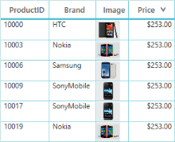

_DataGrid with GridImageColumn_

#### GridHyperlinkColumn

GridHyperlinkColumn is derived from GridColumn, inheriting its properties and its content represented by using the Hyperlink Button. The bound value is represented as a Hyperlink and automatically displayed as a link.

##### The following provides the list of all properties that supports GridHyperlinkColumn:

 _GridHyperlinkColumn property table_

<table>
<tr>
<td>
Property</td><td>
Type</td><td>
Description</td><td>
Default Value</td></tr>
<tr>
<td>
HorizontalAlignment</td><td>
HorizontalAlignment</td><td>
Determines the horizontal alignment for Hyperlink button in regard with the GridCell</td><td>
HorizontalAlignment.Stretch</td></tr>
<tr>
<td>
VerticalAlignment</td><td>
VerticalAlignment</td><td>
Determines the vertical alignment for Hyperlink button in regard with the GridCell.</td><td>
VerticalAlignment.Stretch</td></tr>
</table>

The following code example illustrates how to use GridHyperlinkColumn.



[XAML]

<syncfusion:GridHyperlinkColumn DisplayBinding="{Binding Path=ProductName}"

                                HeaderText="Official Product Link"

                                MappingName="ProductName"

                                ValueBinding="{Binding Path=ProductURI}" />





[C#]

sfdatagrid.Columns.Add(new GridHyperlinkColumn() { 

                   HeaderText = "Official Product Link", 

                   MappingName = "ProductName" });



The following screenshot illustrates the output.

_DataGrid with GridHyperlinkColumn_

GridHyperlinkcolumn also hosts the CurrentCellRequestNavigate event to facilitate the navigation for the Hyperlink Column. The event rose whenever you try to navigate the Hyperlink. The event handler receives two arguments namely sender that handles SfDataGrid and CurrentCellRequestNavigateEventArgs as objects.

##### The CurrentCellRequestNavigateEventArgs object contains the following properties:

* RowColumnIndex: Gets the value for CurrentRowColumnIndex.
* NavigateText: Gets the bounded value from ValueMember or Mapping Name for the Hyperlink Button in the GridColumn.
* Handled: Specifies whether the navigation is controlled by the handler or column.
* RowData: Gets the data context by the click on Hyperlink button that is currently selected record.

> _Note: The value that is bounded to the DisplayBinding property displays the value. The value that is bounded to the ValueBinding property is the NavigateText. When ValueBinding value that bounds to the MappingName is not specified, it becomes the NavigateText._

#### GridTemplateColumn

DataGrid supports vast number of celltypes.When you require to extend the functionality of GridColumns with your own editor; it is achieved by creating CellTemplate and EditTemplate of GridTemplateColumn.

##### The following provides the list of all properties that supports GridTemplateColumn.

 _GridTemplateColumn property table_

<table>
<tr>
<td>
Property</td><td>
Type</td><td>
Description</td><td>
Default Value</td></tr>
<tr>
<td>
EditTemplate</td><td>
DataTemplate</td><td>
Specifies the data template of cell in edit mode.</td><td>
Null</td></tr>
<tr>
<td>
CellTemplate</td><td>
DataTemplate</td><td>
Specifies the data template of cell in view mode.</td><td>
Null</td></tr>
<tr>
<td>
CellTemplateSelector</td><td>
DataTemplateSelector</td><td>
Gets DataTemplateSelector and apply the template to cell in view.</td><td>
Null</td></tr>
<tr>
<td>
EditTemplateSelector</td><td>
DataTemplateSelector</td><td>
Gets DataTemplateSelector and apply the template to the cell in edit mode.</td><td>
Null</td></tr>
</table>

> _Note: By default, Silverlight does not support TemplateSelectors hence DataGrid too._

The following code example shows templating for GridTemplateColumn. Underlying record will be the DataContext for the CellTemplate and EditTemplate.



[XAML]

<syncfusion:GridTemplateColumn MappingName="CustomerID">

    <syncfusion:GridTemplateColumn.CellTemplate>

        <DataTemplate>

            <TextBlock FontStyle="Italic"

                       FontWeight="SemiBold"

                       Padding="2,0"

                       Text="{Binding CustomerID}" />

        </DataTemplate>

    </syncfusion:GridTemplateColumn.CellTemplate>

    <syncfusion:GridTemplateColumn.EditTemplate>

        <DataTemplate>

            <Grid HorizontalAlignment="Stretch" VerticalAlignment="Stretch">

                <TextBox FontStyle="Italic"

                         FontWeight="SemiBold"

                         Padding="2,0"

                         Text="{Binding CustomerID,

                                        Mode=TwoWay}" />

            </Grid>

        </DataTemplate>

    </syncfusion:GridTemplateColumn.EditTemplate>

</syncfusion:GridTemplateColumn>



The above XAML code has resulted in the following output.

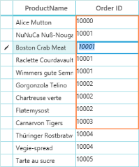

_DataGrid with GridTemplateColumn_

CellTemplateSelector and EditTemplateSelector provide a way to select DataTemplate based on the data object and the data-bound element. The following code example displays how to use TemplateSelector.



[XAML]

<DataTemplate x:Key="cellTemplate">

    <CheckBox HorizontalAlignment="Center" IsChecked="{Binding Path=EmployeeStatus, Mode=TwoWay}" />

</DataTemplate>

<!-- CELL TEMPLATE -->

<DataTemplate x:Key="maleCellTemplate">

    <TextBlock Foreground="DeepSkyBlue" Text="{Binding EmployeeGender}" />

</DataTemplate>

<DataTemplate x:Key="femaleCellTemplate">

    <TextBlock Foreground="DeepPink" Text="{Binding EmployeeGender}" />

</DataTemplate>

<!-- EDIT TEMPLATE -->

<DataTemplate x:Key="maleEditTemplate">

    <TextBox Foreground="DeepSkyBlue" Text="{Binding EmployeeGender}" />

</DataTemplate>

<DataTemplate x:Key="femaleEditTemplate">

    <TextBox Foreground="DeepPink" Text="{Binding EmployeeGender}" />

</DataTemplate>





[C#]

// TEMPLATE SELECTOR

public class CellTemplateSelector : DataTemplateSelector

{

public override DataTemplate SelectTemplate (object item, 

DependencyObject container)

{

var dataItem = item as BusinessObjects;

if (dataItem.EmployeeGender == "Male")

return Application.Current.Resources["maleCellTemplate"] as DataTemplate;

else

return Application.Current.Resources["femaleCellTemplate"] as DataTemplate;

}

}

public class EditTemplateSelector : DataTemplateSelector

{

public override DataTemplate SelectTemplate (object item,

DependencyObject container)

{

var dataItem = item as BusinessObjects;

if (dataItem.EmployeeGender == "Male")

return Application.Current.Resources["maleEditTemplate"] as DataTemplate;

else

return Application.Current.Resources["femaleEditTemplate"] as DataTemplate;

}

}




[XAML]

// APPLYING CELLTEMPLATESELECTOR AND EDITTEMPLATESELECTOR

<syncfusion:SfDataGrid x:Name="datagrid"

                       AutoGenerateColumns="False"

                       ColumnSizer="Star"

                       ItemsSource="{Binding GDCSource}">

    <syncfusion:SfDataGrid.Columns>

        <syncfusion:GridTextColumn MappingName="EmployeeName" />

        <syncfusion:GridTextColumn MappingName="EmployeeDesignation" />

        <syncfusion:GridTextColumn MappingName="EmployeeAge" />

        <syncfusion:GridTemplateColumn CellTemplateSelector="{StaticResource cellTemplateSelector}"

                                       EditTemplateSelector="{StaticResource editTemplateSelector}"

                                       MappingName="EmployeeGender" />

        <syncfusion:GridTemplateColumn CellTemplate="{StaticResource cellTemplate}" MappingName="EmployeeStatus" />

        <syncfusion:GridTextColumn MappingName="EmployeeArea" />

    </syncfusion:SfDataGrid.Columns>

</syncfusion:SfDataGrid>



The following screenshot shows the output for the above code.

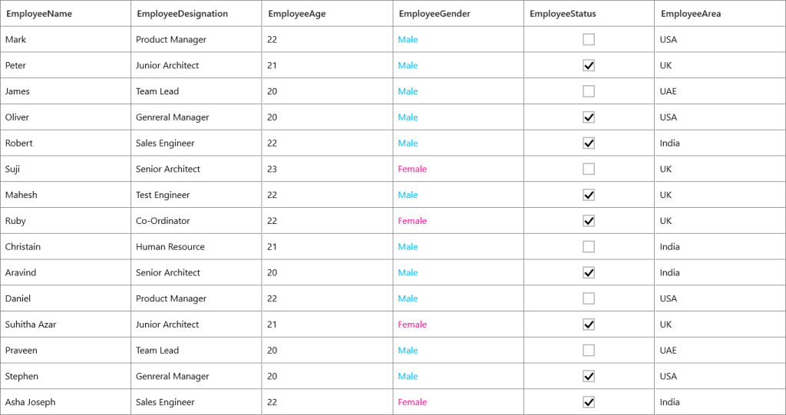

_DataGrid with TemplateSelector_

GridTemplateColumn provides the list of [attached property](http://msdn.microsoft.com/en-IN/library/ms749011(v=vs.110).aspx)  to handle key navigation, mouse interaction, focusing for loaded controls within DataTemplate. You can get below attached properties in Syncfusion.UI.Xaml.Grid namespace.

* FocusManagerHelper.WantsKeyInput
* VisualContainer.WantsMouseInput
* FocusManagerHelper.FocusedElement

##### WantsKeyInput

The attached property allows the controls loaded in CellTemplate to handle key navigation within it or by Grid.

The following code example explains you about WantsKeyInput.



[XAML]

<syncfusion:GridTemplateColumn HeaderText="ProductName"

                               MappingName="ProductName"                               syncfusion:FocusManagerHelper.WantsKeyInput="True">

    <syncfusion:GridTemplateColumn.CellTemplate>

        <DataTemplate>

            <Grid>

                <TextBox x:Name="text" Text="{Binding ProductName}" />

            </Grid>

        </DataTemplate>

    </syncfusion:GridTemplateColumn.CellTemplate>

</syncfusion:GridTemplateColumn>



> _Note: Enter and Tab keys are always handled by Grid only. When you set it to’ false’, you cannot navigate using keys within a loaded control._

##### WantsMouseInput

The attached property allows the controls loaded in CellTemplate to handle mouse interaction within it or by Grid.

The following code example explains you about WantsMouseInput.



[XAML]

<syncfusion:GridTemplateColumn HeaderText="ProductName" MappingName="ProductName">

    <syncfusion:GridTemplateColumn.CellTemplate>

        <DataTemplate>

            <Grid>

                <ComboBox ItemsSource="{Binding ComboItems, Source={StaticResource viewmodel}}" syncfusion:VisualContainer.WantsMouseInput="True" />

            </Grid>

        </DataTemplate>

    </syncfusion:GridTemplateColumn.CellTemplate>

</syncfusion:GridTemplateColumn>


##### FocusedElement

The attached property FocusedElement gives the Focus to particular element inside DataTemplate. 

The following code example shows, how to set the FocusedElement inside DataTemplate



[XAML]

<syncfusion:GridTemplateColumn HeaderText="Order ID" MappingName="OrderID">

    <syncfusion:GridTemplateColumn.CellTemplate>

        <DataTemplate>

            <TextBlock Text="{Binding OrderID}" />

        </DataTemplate>

    </syncfusion:GridTemplateColumn.CellTemplate>

    <syncfusion:GridTemplateColumn.EditTemplate>

        <DataTemplate>

            <Grid>

                <TextBox x:Name="textBox"

                         FontStyle="Italic"

                         FontWeight="SemiBold"

                         Padding="2,0"

                         Text="{Binding OrderID,

                                        Mode=TwoWay}"

                         syncfusion:FocusManagerHelper.FocusedElement="True" />

            </Grid>

        </DataTemplate>

    </syncfusion:GridTemplateColumn.EditTemplate>

</syncfusion:GridTemplateColumn>



> _Note: Other than the above attached properties supported, you can set focused element by using FocuseManager.FocusedElement attached property which comes in WPF frameowkr itself. This can be used only for EditTemplate and can’t be used inside CellTemplate._

The following XAML code example displays you how to set focus directly to editor.



[XAML]

<syncfusion:SfDataGrid.Columns>

    <syncfusion:GridTemplateColumn HeaderText="Customer ID" MappingName="CustomerID">

        <syncfusion:GridTemplateColumn.CellTemplate>

            <DataTemplate>

                <TextBlock Text="{Binding CustomerID}" />

            </DataTemplate>

        </syncfusion:GridTemplateColumn.CellTemplate>

        <syncfusion:GridTemplateColumn.EditTemplate>

            <DataTemplate>

                <Grid FocusManager.FocusedElement="{Binding ElementName=textBox}">

                    <TextBox x:Name="textBox"

                             FontStyle="Italic"

                             FontWeight="SemiBold"

                             Padding="2,0"

                             Text="{Binding CustomerID,

                                            Mode=TwoWay}" />

                </Grid>

            </DataTemplate>

        </syncfusion:GridTemplateColumn.EditTemplate>

    </syncfusion:GridTemplateColumn>

</syncfusion:SfDataGrid.Columns>



##### Creating template columns based on MappingName

When you use template column, you can define template for each column and set binding to the underlying data in template regardless of MappingName. In some use cases, you may need to bind template columns based on MappingName and also use same data template for all template columns.This is achieved by changing the Renderer for Template columns as as displayed in the following code example.

The following code example explains you how to remove from Renderer collectionin MainWindow.cs



[C#]

sfdatagrid.CellRenderers.Remove("Template");

sfdatagrid.CellRenderers.Add("Template", new GridCellDataTemplateRenderer());



By default Template column uses GridCellTemplateRenderer that sets Record as DataContext to CellTemplate and EditTemplate. GridCellDataTemplateRenderer is derived from GridCellTemplateRenderer that sets the DataContextHelper as DataContext to CellTemplate and EditTemplate. 

DataContextHelper has the following properties,

* Value – denotes the value from data based on MappingName property
* Record – denotes the underlying data.

Now you can make use of Value property that provides value based on MappingName property. You can use the same template for any number of Columns which will bind the value based on MappingName.

Then your XAML code is as follows. 



[XAML]

<syncfusion:GridTemplateColumn HeaderText="Order ID" MappingName="OrderID">

    <syncfusion:GridTemplateColumn.CellTemplate>

        <DataTemplate>

            <TextBlock Text="{Binding Value}" />

        </DataTemplate>

    </syncfusion:GridTemplateColumn.CellTemplate>

</syncfusion:GridTemplateColumn>


#### Unbound Columns

SfDataGrid supports the addition of extra columns to the Data Source columns. These additional columns are called as unbound columns, as they do not belong to the Data Source. These unbound fields are used when you want to add additional or custom information to each record.

An unbound column is sorted, grouped, and filtered like other GridColumns. The value of an unbound column updates automatically, when a concerned property on the data item changes. It includes two important properties as follows; Format and Expression that are set. Unbound column also includes another property CaseSensitivity that specifies whether the given expression is case sensitive or not.

* Expression property denotes any valid Arithmatic or logical expression with columns for the UnBoundColumn to compute.
* Format property denotes an expression with a formatting string holding valid columns from the Data Source.

The supported arithmetic operations are as follows: You can use arithmetic operators within two column names such as Expression= “Quantity + UnitPrice.”

_List of Arithmetic operators_

<table>
<tr>
<td>
Operations</td><td>
Operators</td></tr>
<tr>
<td>
Add</td><td>
+</td></tr>
<tr>
<td>
Subtract</td><td>
-</td></tr>
<tr>
<td>
Multiply</td><td>
*</td></tr>
<tr>
<td>
Divide</td><td>
/</td></tr>
<tr>
<td>
Power</td><td>
^</td></tr>
<tr>
<td>
Mod</td><td>
%</td></tr>
<tr>
<td>
Greater Than</td><td>
></td></tr>
<tr>
<td>
Lesser Than</td><td>
<</td></tr>
<tr>
<td>
Equal</td><td>
=</td></tr>
<tr>
<td>
GreaterThanOrEqual</td><td>
>=</td></tr>
</table>

The supported logical operations are as follows. You have to use logical operation like Expression = “Quantity > UnitPrice” + (char) 135 + “Quantity! = UnitPice” from code behind.

_List of Logical operators_

<table>
<tr>
<td>
Operations</td><td>
Operators</td></tr>
<tr>
<td>
AND</td><td>
(char)135</td></tr>
<tr>
<td>
OR</td><td>
(char)136</td></tr>
<tr>
<td>
NOT</td><td>
(char)137</td></tr>
</table>

> _Note: It is mandatory to specify the GridColumn.MappingName to the UnBoundColumn, but it should not match with any existing fields in the data source._

The following code example shows how to use unboundcolumns in the DataGrid control.



[XAML]

<syncfusion:SfDataGrid AllowEditing="True"

                       ColumnSizer="Auto"

                       ItemsSource="{Binding SalesInfo}">

    <syncfusion:SfDataGrid.Columns>

        <syncfusion:GridTextColumn MappingName="Product" />

        <syncfusion:GridTextColumn MappingName="Quantity" TextAlignment="Right" />

        <syncfusion:GridTextColumn DisplayBinding="{Binding Path=Amount,

                                                            StringFormat='{}{0:C}'}"

                                   MappingName="Amount"

                                   TextAlignment="Right" />

        <!--  UnBoundColumn with Expressions  -->

        <syncfusion:GridUnBoundColumn AllowEditing="False"

                                      Expression="Quantity*Amount"

                                      HeaderText="Grand Total"

                                      MappingName="GrandTotal"

                                      TextAlignment="Right" />

        <!--  UnBoundColumn with Format  -->

        <syncfusion:GridUnBoundColumn Width="180"

                                      AllowEditing="False"

                                      Format="'{Amount} for {Product}'"

                                      MappingName="Amount for Product" />

    </syncfusion:SfDataGrid.Columns>

</syncfusion:SfDataGrid>



The following screenshot shows the output.

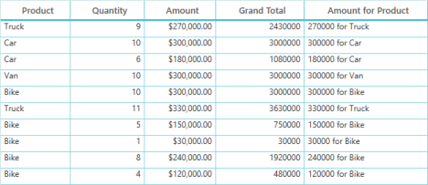

 _DataGrid with Unbound columns_

##### Events

An unboundcolumn provides the QueryUnboundColumnValue event that is raised when the UnboundColumn is initialized and updated. The event includes two arguments, namely sender that handles SfDataGrid and GridUnBoundColumnEventArgs as Objects.

GridUnBoundColumnEventArgs object contains the following properties:

* Column: Gets the GridColumn for the UnBoundColumn.
* Record: Gets the current record where the values are computed for the unbound cell.
* UnBoundAction: Gets the action for the event, i.e., whether the event is Querying the data or Committing the data.
* Value: Gets or sets the value for the UnBoundColumn.

GridUnBoundColumn provides a special property that bounds a value when given Expression columns names are not equal case. The following code example illustrates that.



[XAML]

<syncfusion:GridUnBoundColumn AllowEditing="True"

                              AllowFiltering="True"

                              AllowGrouping="True"

                              AllowSorting="True"

                              CaseSensitive="False"

                              Format="'{ProductName}-{quantity}'"

                              MappingName="Total" />



The following screenshot displays you the output.

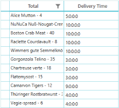

_DataGrid with GridUnBoundColumn_

In above case, when you set CaseSenstive property value to ‘true’, then you can not get quantity column value after that hyphen. 

> _Note: UnBound Column’s Expression does not work with DataTable, since DataTable itself provides support for Expression._

#### GridMultiColumnDropDownList

GridMultiColumnDropDownList is derived from GridColumn, inheriting its properties and has few additional properties. GridMultiColumnDropDownList loads SfMultiColumnDropDownControl for editing. In addition to the GridColumn’s properties, GridMultiColumnDropDownList supports the following list of properties:

_GridMultiColumnDropDownList property table_

<table>
<tr>
<td>
Property Name</td><td>
Type</td><td>
Description</td><td>
Default Value</td></tr>
<tr>
<td>
DisplayMember</td><td>
String</td><td>
Determines the field in the data bound source, whose value is displayed in the Editor.</td><td>
String.Empty</td></tr>
<tr>
<td>
ValueMember</td><td>
String</td><td>
Determines the field in the data bound source that computes the SelectedValue.</td><td>
String.Empty</td></tr>
<tr>
<td>
ShowResizeThumb</td><td>
Visibility</td><td>
Specifies whether resizing thumb is visible or not.</td><td>
Visibility.Visible</td></tr>
<tr>
<td>
PopUpHeight</td><td>
Double</td><td>
Defines the height of the Pop-up.</td><td>
0.0d</td></tr>
<tr>
<td>
PopUpWidth</td><td>
Double</td><td>
Defines the width of the Pop-up.</td><td>
0.0d</td></tr>
<tr>
<td>
ItemsSource</td><td>
Object</td><td>
Determines the data source (IEnumerable) used to generate the content for the SfDataGrid present inside the DropDownPopup. The Data Source is of any type ranging from ObservableCollection&lt;T&gt; to DynamicObjects.</td><td>
Null</td></tr>
<tr>
<td>
AllowAutoComplete</td><td>
Boolean</td><td>
This propertyis Boolean properties that represent the behavior of the Editor, and specifies whether to enable or disable suggestion text for auto completion of text. </td><td>
True</td></tr>
<tr>
<td>
AllowNullInput</td><td>
Boolean</td><td>
Specifies whether the editor accepts null value or not.</td><td>
False</td></tr>
<tr>
<td>
AutoGenerateColumns</td><td>
Boolean</td><td>
Specifies a value whether the columns are auto generated by the DataGrid in the Dropdowngrid, or generated based on the AutoGenerateColumnsMode.</td><td>
true</td></tr>
<tr>
<td>
AutoGenerateColumnsMode</td><td>
AutoGenerateColumnsMode</td><td>
Specifies whether columns are created automatically for all the fields in the underlying Data Source</td><td>
Reset</td></tr>
<tr>
<td>
Columns</td><td>
Columns</td><td>
This is a collection of GridColumns that helps to generate columns based on the given GridColumns (For information about GridColumns, see {{ '[Columns](http://help.syncfusion.com/ug/wpf/sfdatagrid/default.htm)' | markdownify }}).</td><td>
new Columns()</td></tr>
<tr>
<td>
GridColumnSizer</td><td>
GridLengthUnitType</td><td>
Specifies the columnsizer mode for a dropdowngrid in GridMultiColumnDropDownList column.</td><td>
GridLengthUnitType.None</td></tr>
<tr>
<td>
IsAutoPopupSize</td><td>
Bool</td><td>
Specifies a value that agrees whether the size of the Pop-up is based on the actual size of the Grid.</td><td>
False</td></tr>
</table>

The following code example illustrates how to use GridMultiColumnDropDownList.



[XAML]

<syncfusion:GridMultiColumnDropDownList AutoGenerateColumns="False"

                                        DisplayMember="CustomerID"

                                        GridColumnSizer="Auto"

                                        IsAutoPopupSize="False"

                                        ItemsSource="{Binding OrderList}"

                                        MappingName="CustomerID "

                                        ValueMember="CustomerID ">

    <syncfusion:GridMultiColumnDropDownList.Columns>

        <syncfusion:Columns>

            <syncfusion:GridTextColumn MappingName=" CustomerID " />

            <syncfusion:GridTextColumn MappingName="OrderID" />

        </syncfusion:Columns>

    </syncfusion:GridMultiColumnDropDownList.Columns>

</syncfusion:GridMultiColumnDropDownList>



The above XAML code has resulted in the following output.

_DataGrid with GridMultiColumnDropDownList_

The event associated with this column is CurrentCellDropDownSelectionChanged Event

This event occurs whenever a selected item is changed in DropDown column such as GridMultiColumnDrpDownList. The event handler receives two arguments namely sender that handles SfDataGrid and CurrentCellDropDownSelectionChangedEventArgs as objects.

> _Note: To set null value in view, the underlying type needs to be Nullable. Only then it accepts Null value._

The CurrentCellDropDownSelectionChangedEventArgs object contains the following properties:

##### Column Sizing

ColumnSizer property allows you to specify the column width based on the data present in the cell. You can set the ColumnsSizer property like SfDataGrid.ColumnSizer. This section explains you different options to set width of each Column and how to customize the GridColumnSizer. Following are the lists of options available to set width of the Columns.

* RowColumnIndex: Gets the value of the current RowColumnIndex.
* SelectedIndex: Gets the selected index from the DropDown control.
* SelectedItem: Gets the selected item from the DropDown control.

> _Note: To set null value in view, the underlying type needs to be Nullable. Only then it accepts Null value._

* Auto
* AutoWithLastColumnFill
* SizeToCells
* SizeToHeader
* Star
* None

##### GridLengthUnitType.Auto

In Auto type, column’s width of the DataGrid control is adjusted with respect to the cell and header content, i.e., each column's header length and cell content length are considered.

##### GridLengthUnitType.AutoWithLastColumnFill

In AutoWithLastColumnFill type, the column width of the DataGrid control is adjusted with respect to cell and header content. The last column's width fills the unoccupied space in the parent framework element.

##### GridLengthUnitType.SizeToCells

In SizeToCells type, the column width in the DataGrid control is adjusted with respect to cell content.

##### GridLengthUnitType.SizeToHeader

In SizeToHeader type, column’s width of the DataGrid control is adjusted with respect to header content.

##### GridLengthUnitType.Star

In Star type, the control content occupies total space in the parent, and column’s width is divided equally based on the total space. It’s not required to specify the width for every Grid Column. 

##### GridLengthUnitType.None

No Column sizing is applied when the SfDataGrid.ColumnSizer is set to ‘None’. Columns are arranged in the default Column width.

##### Properties

SfDataGrid.ColumnSizer: This property applies the Column sizing for all the columns in the DataGrid control. By default the SfDataGrid.ColumnSizer is set to GridControlLengthUnitType_._None.

The DataGrid control also allows you to set the column sizing for a particular column. Grid Column contains following properties for Column sizing:

* GridColumn.ColumnSizer: You can set the ColumnSizer for particular columns by using this property. When you declare the ColumnSizer property in DataGrid control as well as in Column, Grid resizes the column based on the ColumnSizer value in the column.
* GridColumn.MinimumWidth: Sets the Minimum Width of the column.
* GridColumn.MaximumWidth: Sets the Maximum Width of the column.
* GridColumn.Width: Sets the Width of the column.

> _Note: DataGrid control applies column sizing based on Width, MinimumWidth and MaximumWidth properties._

* The Grid resizes the column based on the GridColumn.ColumnSizer property instead of the SfDataGrid.ColumnSizer property when you set the GridColumn.ColumnSizer property explicitly. 
* For example, when you set SfDataGrid.ColumnSizer property to ‘Auto’, and for a particular column you have set GridColumn.ColumnSizer property to ‘Star’, DataGrid applies ‘Star’ column sizing for that particular column and ‘Auto’ column sizing for all other columns.
* When you set both the GridColumn.ColumnSizer and GridColumn.Width properties, the Grid resizes the column based on the GridColumn.Width value.
* When you set both the GridColumn.MaximumWidth and GridColumn.Width properties, the Grid resizes the column in the following ways:
* When the GridColumn.Width value is lesser than GridColumn.MaximumWidth, DataGrid resizes the column to the GridColumn.Width value.
* Else, DataGrid resizes the column to GridColumn.MaximumWidth value.
* When you set GridColumn.MinimumWidth, GridColumn.MaximumWidth and GridColumn.Width properties, Grid resizes the column in the following ways:
* When the GridColumn.Width value is lesser than the GridColumn.MaximumWidth and greater than GridColumn.MinimumWidth, DataGrid resizes the column to the GridColumn.Width value.
* Else, DataGrid resizes the column with the maximum GridColumn.MinimumWidth and GridColumn.MaximumWidth values.

> '_Note: When you resize the columns and the Columns sizer is in ‘Star’ or ‘AutoWithLastFill’ mode, it remains its behavior._

The following code example illustrates you how to set the ColumnSizing option for DataGrid control.



[XAML]

<syncfusion:SfDataGrid x:Name="datagrid"

                        ColumnSizer="Star"

                        ItemsSource="{Binding OrdersDetails}" />




[C#]

sfdatagrid.ColumnSizer = GridLengthUnitType.Star;



The following screenshot illustrates the output.

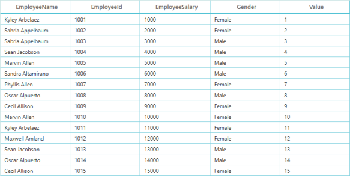

_DataGrid with Column Sizing_

#### Customize column sizer using GridColumnSizer

GridColumnSizer is the public class that handles the operations to set grid column's width based on column sizer and column width. Following are the list of properties and methods to be considered when you calculate column width.

_GridColumnSizer methods table_

<table>
<tr>
<td>
Method </td><td>
Description</td></tr>
<tr>
<td>
internal protected virtual double CalculateAutoFitWidth(GridColumn column, bool isAuto = false)</td><td>
Called to calculate column width based on “Auto” column sizer</td></tr>
<tr>
<td>
protected virtual double CalculateCellWidth(GridColumn column, bool setWidth = true)</td><td>
Called to calculate column width based on “SizeToCells” column sizer</td></tr>
<tr>
<td>
protected virtual double CalculateHeaderWidth(GridColumn column, bool setWidth = true)</td><td>
Called to calculate column width based on “SizeToHeader” column sizer</td></tr>
<tr>
<td>
protected virtual double GetAutoWidth(GridColumn column)</td><td>
Method used to get column width when column sizer is SizeToCells or Auto</td></tr>
<tr>
<td>
protected virtual ContentControl GetContentControl(GridColumn column, object record)</td><td>
Called to get content control to measure the template  when column sizer is SizeToCells</td></tr>
<tr>
<td>
protected virtual string GetDisplayText(GridColumn column, object record)</td><td>
Called to get display value for calculating column width based on cell value</td></tr>
<tr>
<td>
protected virtual TextBlock GetTextBlock(GridColumn column, object record)</td><td>
Called to get TextBlock to measure the text when column sizer is SizeToCells or Auto</td></tr>
<tr>
<td>
protected virtual Size MeasureTemplate(object record, GridColumn column)</td><td>
Called to measure template when column sizer is SizeToCells or Auto</td></tr>
<tr>
<td>
protected virtual Size MeasureText(Size rectangle, string displayText, GridColumn column, object record)</td><td>
Called to measure text when column sizer is SizeToCells or Auto</td></tr>
<tr>
<td>
protected virtual void OnColumnPropertyChanged(GridColumn column, string property)</td><td>
Invoked to refresh the column widths when ColumnSizer,Width, AllowSorting and other column properties changed for GridColumn</td></tr>
<tr>
<td>
public void Refresh()</td><td>
Refreshes column widths when column sizer and grid size changed</td></tr>
<tr>
<td>
protected virtual void Refresh(double AvailableWidth)</td><td>
Refreshes column widths when column sizer and grid size changed</td></tr>
<tr>
<td>
public void ResetAutoCalculation(GridColumn column)</td><td>
Reset Auto width calculation for the particular column</td></tr>
<tr>
<td>
public void ResetAutoCalculationforAllColumns()</td><td>
Reset Auto width calculation for all the columns</td></tr>
<tr>
<td>
protected internal void Resume()</td><td>
Used to resume the column width refresh when column propertychanged is called</td></tr>
<tr>
<td>
public virtual double SetColumnWidth(GridColumn column, double Width)</td><td>
Called to set the column width based on MinimumWidth and MaximumWidth</td></tr>
<tr>
<td>
protected virtual double SetNoneWidth(GridColumn column, double width)</td><td>
Called to set column width based on None column sizer</td></tr>
<tr>
<td>
private void SetSizerWidth(double viewPortWidth)</td><td>
Called to set column width based on Star column sizer</td></tr>
<tr>
<td>
protected internal void Suspend()</td><td>
Used to suspend the column width refresh when column propertychanged is called </td></tr>
<tr>
<td>
public boolean GetAutoRowHeight(int RowIndex, GridRowSizingOptions options, out double rowHeight)</td><td>
Used to cacluate the row height based on the content that located in the grid cells of the row.</td></tr>
</table>

<table>
<tr>
<td>
> {{ '_Note: The above methods are useful when you create custom GridColumnSizer for SfDataGrid._' | markdownify }}</td></tr>
<tr>
<td>
</td></tr>
</table>
_GridColumnSizer Properties table_

<table>
<tr>
<td>
Property</td><td>
Type</td><td>
Description</td><td>
Default Value</td></tr>
<tr>
<td>
ContentControl</td><td>
ContentControl</td><td>
Gets or sets the ContentControl to calculate cell width for template column</td><td>
null</td></tr>
<tr>
<td>
DataGrid</td><td>
SfDataGrid</td><td>
Gets the SfDataGrid instance</td><td>
null</td></tr>
<tr>
<td>
FilterIconWidth</td><td>
Double</td><td>
Gets or sets the FilterIconWidth to calculate the header width when column sizer is SizeToHeader or Auto</td><td>
28</td></tr>
<tr>
<td>
FontFamily</td><td>
FontFamily</td><td>
Gets or sets the FontFamily to calculate the width of the column based on cell value</td><td>
new FontFamily("Segoe UI")</td></tr>
<tr>
<td>
FontSize</td><td>
Double</td><td>
Gets or sets the FontSize to compute the width of the column based on cell value</td><td>
12</td></tr>
<tr>
<td>
Margin</td><td>
Thickness</td><td>
Gets or sets the Margin to compute the width of column based on cell value </td><td>
new Thickness(5, 1, 5, 1)</td></tr>
<tr>
<td>
SortIconWidth</td><td>
Double</td><td>
Gets or sets the SortIconWidth to calculate the header width when column sizer is SizeToHeader or Auto</td><td>
25</td></tr>
<tr>
<td>
TextBlock</td><td>
TextBlock</td><td>
Gets or sets the TextBlock to calculate cell width for the column</td><td>
null</td></tr>
</table>

##### Overriding and handling GridColumnSizer

The following code example illustrates to override methods and how to handle operations in GridColumnSizer. The extended class GridColumnSizerExt is new GridColumnSizer and you can assign it to existing GridColumnSizer.



[C#]

// Assign custom GridColumnSizer to datagrid GridColumnSizer

dataGrid.GridColumnSizer = new GridColumnSizerExt(dataGrid);

…

    /// 

    /// GridColumnSizerExt class is the custom GridColumnSizer

    /// 

public class dColumnSizerExt : GridColumnSizer

{

   public GridColumnSizerExt(SfDataGrid grid)

                : base(grid)

   {

   }

        /// 

        /// Calculate Width for Column When Column Sizer is SizeToCells

        /// 

        /// <param name="column">GridColumn</param>

        /// <returns>column width</returns>     

     protected override double CalculateCellWidth(GridColumn column, bool setWidth = true)

          {

                return base.CalculateCellWidth(column, setWidth);

          }

           /// 

           /// Calculate Width for column when ColumnSizer is SizeToHeader

           /// HeaderCell width is calculated based on headertext, sorticon and   filter icon

           /// 

           /// <param name="column">GridColumn</param>

           /// <returns>column width</returns>      

          protected override double CalculateHeaderWidth(GridColumn column, bool setWidth = true)

          {

                return base.CalculateHeaderWidth(column, setWidth);

          }

}


### Hiding Columns

The DataGrid control provides support to hide a particular Column in XAML or C# by setting the GridColumn.IsHidden property to ‘true’.

The following code example shows how to hide the Columns in XAML.



[XAML]

<syncfusion:SfDataGrid AutoGenerateColumns="False"

                       ColumnSizer="Auto"

                       ItemsSource="{Binding OrderInfoCollection}">

    <syncfusion:SfDataGrid.Columns>

        <syncfusion:GridTextColumn HeaderText="Order ID"

                                   IsHidden="True"

                                   MappingName="OrderID" />

        <syncfusion:GridTextColumn HeaderText="Customer ID" MappingName="CustomerID" />

        <syncfusion:GridTextColumn HeaderText="Name of Customer" MappingName="CustomerName" />

        <syncfusion:GridTextColumn HeaderText="Ship Country" MappingName="ShipCountry" />

        <syncfusion:GridTextColumn HeaderText="Ship City" MappingName="ShipCity" />

    </syncfusion:SfDataGrid.Columns>

</syncfusion:SfDataGrid>




[C#]

((GridTextColumn)sfdatagrid.Columns["OrderID"]).IsHidden = true;


> _Note: Hidden columns are not considered when applying column sizing._

### Resizing Columns

This section explains you how to resize the Columns and how to handle event that arises when resizing columns.

#### Overview

DataGrid allows you to resize the Column at Execute time. By default, resizing the columns is disabled in Grid.

The following is the list of properties that participate in resizing columns.

* AllowResizingColumns
* AllowResizingHiddenColumns

To enable resizing you can set SfDataGrid.AllowResizingColumns property value to _‘_True’. DataGrid also allows you to enable or disable the resizing functionality for a particular column by using the GridColumn.AllowResizing property.

When resizing functionality enabled, Grid shows a resizing cursor during hovering at the edge of the column header as shown in the following screenshot:

_DataGrid with resizing cursor for resizing columns_

Hidden columns are resized by enabling SfDataGrid.AllowResizingHiddenColumns property.

The following screenshot displays how Hidden columns are displayed when AllowResizingHiddenColumns property is enabled.

_DataGrid with AllowResizingHiddenColumns property enabled_

_DataGrid with with resizing cursor for hidden columns_

The event that participates in resizing is ResSizingColumns. Resize event support resizing action 

#### SfDataGrid.ResizingColumns

This event occurs when the column in the DataGrid is about to resize or is being resized by you.

The ResizingColumns event handler receives two arguments sender that handles SfDataGridtype and ResizingColumnsEventArgs as objects.

The ResizingColumnsEventArgs object has the following properties:

* ColumnIndex: Gets or sets the column index of the reizing or resized column.
* Width : Gets or setsthe width of the reizing or resized column 
* Cancel: When this property is set to ‘true’, the event is cancelled and the column is not resized.

The following code example illustrates how to cancel the ResizingColumn. 



[XAML]

<syncfusion:SfDataGrid x:Name="sfdatagrid"

                       AllowEditing="{Binding ElementName=AllowEdit,

                                      Path=IsChecked}"

                       AllowResizingColumns="True"

                       AllowResizingHiddenColumns="True"

                       ItemsSource="{Binding OrderList}"

                       LiveDataUpdateMode="AllowDataShaping"                      

                       ShowRowHeader="True">



You need to wire ResizingColumns event for SfDataGrid. You can refer the following method. From event args, you can cancel it. Now the columns are not resized. The indication of resizing is shown, but it is not resized.



[C#]

sfdatagrid.AllowResizingColumns = true;

sfdatagrid.AllowResizingHiddenColumns = true;

sfdatagrid.ResizingColumns += sfdatagrid_ResizingColumns;

void sfdatagrid_ResizingColumns(object sender, ResizingColumnsEventArgs e)

{

    e.Cancel = true;

}


> _Note: Resizing is restricted based on GridColumn.MinimumWidth and GridColumn.MaximumWidth.You can resize the columns to the Header and Cell text by double-clicking the header gridlines._

### Reordering Columns

This section explains you about Reordering of Columns and how to handle event that participates in Reordering Columns.

#### Overview

The DataGrid control provides the drag-and-drop functionality to rearrange the Columns at Execute time. You can drag a particular column and drop the column where you need it. By default, the drag-and-drop functionality is disabled in the DataGrid control. 

By using the SfDataGrid.AllowDraggingColumns property you can enable or disable the drag-and-drop functionality in the Grid. The DataGrid control also allows you to enable or disable the drag-and-drop functionality for a particular column by using the GridColumn.AllowDragging property.

You can drag the column using the mouse. DataGrid also provides extensive support for dragging columns in touch devices. When you press and hold the hand on column header, a pop-up window is displayed over the column header. You can then rearrange the Columns.

The following screenshot illustrates how to drag the column.

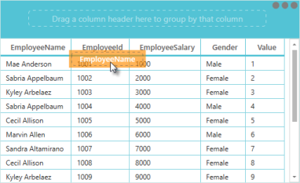

_Dragging column in DataGrid_

The event that participates in ReOredering is QueryColumnDragging. It arises when you start dragging a column. QueryColumnDragging event handler receives two arguments sender that handles SfDataGrid and QueryColumnDraggingEventArgs as objects. 

The QueryColumnDraggingEventArgs object has following properties.

* Cancel: you can stop dragging the Columns by setting ‘true’ to cancel.
* PopupPosition: You can get position of point where you drag or drop.
* From: you can get the index of column that you start dragging.
* To: you can get the index of column where you move.
* Reason: This property returns QueryColumnDraggingReason value.

QueryColumnDraggingReason has following enum values.

* DragStarting
* DragStarted
* Dragging
* Dropping
* Dropped

When you want to disable dragging for a particular column you can use this event and cancel the dragging of column.

#### Drag and Drop Customization

By default, Column drag-and-drop operations are handled by GridColumnDragDropController class. You can achieve drag-and-drop customization by overriding the methods in GridColumnDragDropController class.

##### Virtual methods in GridColumnDragDropController class:

_Virtual methods in GridColumnDragDropController class table_

<table>
<tr>
<td>
Method</td><td>
Prototype</td><td>
Description</td></tr>
<tr>
<td>
CanShowPopup</td><td>
CanShowPopup(GridColumn column)</td><td>
Returns whether the column shows pop-up for its header or not.</td></tr>
<tr>
<td>
OnColumnHiddenChanged</td><td>
OnColumnHiddenChanged(GridColumn column)</td><td>
Occurs when GridColumn’s Hidden property value is changed. </td></tr>
<tr>
<td>
OnPopupContentDropped</td><td>
OnPopupContentDropped(Point point)</td><td>
Occurs when the dragged popup is dropped.</td></tr>
<tr>
<td>
OnPopupContentPositionChanged</td><td>
OnPopupContentPositionChanged(double HorizontalDelta, double VerticalDelta, Point mousePoint, Point mousePointOverGrid)</td><td>
Occurs when popup position changes while dragging.</td></tr>
<tr>
<td>
PointToGridRegion</td><td>
PointToGridRegion(Point point)</td><td>
Called to find the GridRegion at a given point.</td></tr>
<tr>
<td>
CreatePopupContent </td><td>
CreatePopupContent(GridColumn column)</td><td>
Called when pop-up content is created.</td></tr>
<tr>
<td>
PopupContentDroppedOnGroupDropArea</td><td>
PopupContentDroppedOnGroupDropArea(GridColumn column)</td><td>
Called when a draggable pop-up is dropped on a GroupDropArea part</td></tr>
<tr>
<td>
PopupContentDroppedOnHeaderRow</td><td>
PopupContentDroppedOnHeaderRow(int oldIndex, int newColumnIndex)</td><td>
Called when a draggable pop-up is dropped on HeaderRow part</td></tr>
<tr>
<td>
PopupContentDroppedOnGrid</td><td>
PopupContentDroppedOnGrid(Point point)</td><td>
Called when a draggable pop-up is dropped on Grid part</td></tr>
</table>

We have added the Textbox inside the column when it is dragging and also we have added text as DraggingColumn in textbox. The below code sample illustarte this the different override methods available in GridColumnDragDropController.



[C#]

this.dataGrid.GridColumnDragDropController = new CustomDragDrop(dataGrid);

public class CustomDragDrop : GridColumnDragDropController 

{

    public CustomDragDrop(SfDataGrid sfdatagrid):base(sfdatagrid)

    {

    }

    protected override System.Windows.UIElement CreatePopupContent(GridColumn column)

    {

        //You can use your own UIElement here.

                 return base.CreatePopupContent(column);

    }

    protected override void PopupContentDroppedOnGroupDropArea(GridColumn column)

    {          

        base.PopupContentDroppedOnGroupDropArea(column);                       

    }

    protected override void OnPopupContentDropped(System.Windows.Point point, System.Windows.Point pointOverGrid)

    {

        base.OnPopupContentDropped(point, pointOverGrid);

    }

    protected override void OnPopupContentPositionChanged(double HorizontalDelta, double VerticalDelta, System.Windows.Point mousePoint, System.Windows.Point mousePointOverGrid)

    {

        base.OnPopupContentPositionChanged(HorizontalDelta, VerticalDelta, mousePoint, mousePointOverGrid);        

    }

}



How to remove column when dragging and leaving outside the Grid?

You can achieve this using QueryColumnDragging. You need to hook this event from SfDataGrid.

The following code example explains you how to remove column when it’s dropped out side of the Grid.



[C#]

this.dataGrid.QueryColumnDragging += dataGrid_QueryColumnDragging;

void dataGrid_QueryColumnDragging(object sender, Syncfusion.UI.Xaml.Grid.QueryColumnDraggingEventArgs e)

{

    if (e.Reason == QueryColumnDraggingReason.Dropping)

    {              

        var rect = GetControlRect(this.dataGrid);

        if (!rect.Contains(e.PopupPosition))

        {

            var column = dataGrid.Columns[e.From];                  

            dataGrid.Columns.Remove(column);

        }

    }

}

public Rect GetControlRect(FrameworkElement control)

{

    Point locationfromWindow = control.TranslatePoint(new Point(0, 0), control);

    Point locationfromScreen = control.PointToScreen(locationfromWindow);

    return new Rect((locationfromScreen.X - locationfromWindow.X),

                        (locationfromScreen.Y - locationfromWindow.Y),

                        control.ActualWidth, control.ActualHeight);

}



### Frozen Columns

The DataGrid control provides extensive support to freeze the columns in horizontal scrolling. To freeze the column, you have to set the number of columns by using the SfDataGrid.FrozenColumnCount property. 

The following code example illustrates freezing two columns.



[XAML]

<syncfusion:SfDataGrid x:Name="syncgrid"

                       FrozenColumnCount="2"

                       ItemsSource="{Binding OrderInfoCollection}" />





[C#]

this.dataGrid.FrozenColumnCount = 2;



The following screenshot illustrates the output.

_DataGrid with two Frozen columns_

> _Note: In the above screenshot, the OrderID and CustomerID columns are frozen. When you group the columns, indent column (while group you can see that another column is created with grouped expander) is also frozen._

#### Limitation

FrozenColumnCount should be lesser than number of Colums that can be displayed in View.

##### For example:

Your defined columns count is Eight. You can set Frozen Column count as Four.

When your window displays only 4 columns, then you cannot scroll it to view other 4 columns. So you have to set FrozenColumnCount lesser than a number of columns in view.

### Stacked Headers 

DataGrid allows you to have additional unbound header rows, known as Stacked Header Rows that span across Grid Columns. You can group two or more columns under each of the Stacked Header.

#### Overview

Stacked Header Row for the given DataGrid is loaded under Stacked Header Rows Collection.  This collection has definitions for Stacked Header Row that contains StackedColumns controlling the behavior and appearance of the Stacked Header.  A Stacked Header Row is viewed as a set of Stacked Columns where each StackedColumn contains a number of Child Columns. When the Child Columns in the Stacked Header is dragged and dropped to another area of columns, the Child Column isolates itself with its own Stacked Header in the dropped position.

> _Note: Stacked Header does not participate in grouping, filtering, sorting and dragging. However, the Child Columns are allowed to group, sort or apply filter._

StackedColumn provides the following properties for implementing StackedHeaders.

* ChildColumns: Gets or sets string of Grid Columns separated by comma (,) to be grouped under the header. Commas are used as a separator for specifying list of Child Columns.
* HeaderText: Gets or sets a string for Stacked Header Text.

The following code example illustrates how to create StackedHeaders.



[XAML]

<syncfusion:SfDataGrid.StackedHeaderRows>

    <syncfusion:StackedHeaderRow>

        <syncfusion:StackedHeaderRow.StackedColumns>

            <syncfusion:StackedColumn ChildColumns="OrderID,CustomerID,EmployeeID,ShipCity,ShipCountry, Freight,OrderedDate,ShipPostalCode" HeaderText="Order Shipment Details" />

        </syncfusion:StackedHeaderRow.StackedColumns>

    </syncfusion:StackedHeaderRow>

    <syncfusion:StackedHeaderRow>

        <syncfusion:StackedHeaderRow.StackedColumns>

            <syncfusion:StackedColumn ChildColumns="OrderID,CustomerID,Freight,EmployeeID" HeaderText="Order Details" />

            <syncfusion:StackedColumn ChildColumns="ShipCity,ShipCountry,ShipPostalCode" HeaderText="Ship Details" />

        </syncfusion:StackedHeaderRow.StackedColumns>

    </syncfusion:StackedHeaderRow>

</syncfusion:SfDataGrid.StackedHeaderRows>



The following screenshot displays the output for the above XAML code.

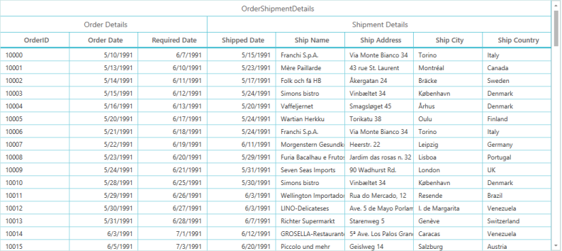

_DataGrid with Stacked Headers_

### How To

#### How to wrap text in Column header

When you have header text that has more length then you need to set it in a multiline. You can achieve this by using HeaderTemplate in Grid Column.

The following code example illustrates this.



[XAML]

<syncfusion:GridTextColumn DisplayBinding="{Binding Path=OrderID}">

    <syncfusion:GridTextColumn.HeaderTemplate>

        <DataTemplate>

            <TextBlock Text="OrderID of product has been purchased" TextWrapping="Wrap" />

        </DataTemplate>

    </syncfusion:GridTextColumn.HeaderTemplate>

</syncfusion:GridTextColumn>


The following screenshot illustrates the output.

_DataGrid with wrapped Header text_

> _Note: You need to set HeaderRowHeight in SfDataGrid to differentiate TextWrap in columnHeader._

> _SfDataGrid.HeaderRowHeight = “100”;_

#### How to skip AutoGenerate column for particular property

When you set AutoGenerateColumns to ‘true’, columns are generated based on [attributes](http://msdn.microsoft.com/en-us/library/system.componentmodel.dataannotations(v=vs.110).aspx) specified in the Model. You can achieve this in following ways.

##### Using DisplayAttribute



[C#]

[Display(AutoGenerateField= false,Description="This filed is not created")]

public int OrderID

{

    get { return orderID; }

    set { orderID = value; }

}


AutoGenerateField disabled in Display attribute does not create the column.

##### Using BindableAttribute



[C#]

[Bindable(false)]

public string CustomerName

{

    get { return customerName; }

    set { customerName = value; }

}


The property for which you have disabled Bindable, that property is added to columns collection.

##### Using AutoGeneratingColumns Event.



[C#]

void sfdatagrid_AutoGeneratingColumn(object sender, Syncfusion.UI.Xaml.Grid.AutoGeneratingColumnArgs e)

{

    if (e.Column.MappingName == "Country")                

        e.Cancel = true;          

}


#### How to override existing Cell types?

In SfDataGrid each column has associated renderers that are added in DataGrid.CellRenderers collection. You can remove and add it back by your customized renderer. The following code example explains you how to override existing renderer. Render is respnisble for all key navigation and other interaction to associated column.



[C#]

public class GrdiCellTextBoxRendererExt: GridCellTextBoxRenderer

{

    protected override bool ShouldGridTryToHandleKeyDown(KeyEventArgs e)

    {

        // TODO ACTION

    }

}


You can derive the required renderer and you can customize using override methods available in it.



[C#]

public MainWindow()

{

    InitializeComponent();                        

    sfdatagrid.CellRenderers.Remove("TextBox");

    sfdatagrid.CellRenderers.Add("TextBox", new GrdiCellTextBoxRendererExt());            

}


The key argument that is used to remove is renderer name.You can add it back by using the name of renderer name with your Customized renderer (GrdiCellTextBoxRendererExt) name. You can do this for different Cell types. Available renderers for Columns in SfDataGrid are as folllows.

_List of renderers for columns in DataGrid_

<table>
<tr>
<td>
Column</td><td>
Renderer Name</td><td>
Renderer</td></tr>
<tr>
<td>
GridTextColumn</td><td>
TextBox </td><td>
GridCellTextBoxRenderer</td></tr>
<tr>
<td>
GridCheckBoxColumn</td><td>
CheckBox </td><td>
GridCellCheckBoxRenderer</td></tr>
<tr>
<td>
GridTemplateColumn</td><td>
Template </td><td>
GridCellTemplateRenderer</td></tr>
<tr>
<td>
GridImageColumn</td><td>
Image </td><td>
GridCellImageRenderer</td></tr>
<tr>
<td>
GridUnBoundColumn</td><td>
UnBoundColumn       </td><td>
GridCellUnBoundColumnRenderer</td></tr>
<tr>
<td>
GridComboBoxColumn</td><td>
ComboBox </td><td>
GridCellComboBoxRenderer</td></tr>
<tr>
<td>
GridNumericColumn</td><td>
Numeric </td><td>
GridCellNumericRenderer</td></tr>
<tr>
<td>
GridDateTimeColumn</td><td>
DateTime </td><td>
GridCellDateTimeRenderer</td></tr>
<tr>
<td>
GridHyperlinkColumn</td><td>
Hyperlink </td><td>
GridCellHyperLinkRenderer</td></tr>
</table>

#### How to enable Tooltips for Cell and Headers?

SfDataGrid provides support to apply Tooltip for Cell and Headers. You can achieve this by using the properties ToolTipTemplate for Cells and HeaderToolTipTemplate for HeaderCells in GridColumn. The following code example illustrates this.



[XAML]

<syncfusion:GridTextColumn DisplayBinding="{Binding Path=CustomerID}" MappingName="CustomerID">

    <syncfusion:GridTextColumn.ToolTipTemplate>

        <DataTemplate>

            <TextBlock Text="{Binding CustomerID}" />

        </DataTemplate>

    </syncfusion:GridTextColumn.ToolTipTemplate>

    <syncfusion:GridTextColumn.HeaderToolTipTemplate>

        <DataTemplate>

            <TextBlock Text="Hedaer for CutomerID" />

        </DataTemplate>

    </syncfusion:GridTextColumn.HeaderToolTipTemplate>

</syncfusion:GridTextColumn>



The following screenshot displays the output of Tooltip applied in Header cell.

_DataGrid with Tooltip applied in Header cell_

The following screenshot displays the output of Tooltip applied in Cells.

_DataGrid with Tooltip applied in cells_

#### How to disable drag and drop between Frozen columns and Non-Frozen columns

You can wire QueryColumnDragging event for DataGrid. Its aruguments have reason property that helps you to perform any actions while draging and dropping. It has From and To property that shows you where the dragging column is present.   

DataGrid has FrozenColumnCount property that gives you number of frozen column that you have set. 

ResolveToStartColumnIndex () is the method that returns the index of first column, since the start column index is not always first column index. When you group or set ShowRowHeader for SfDataGrid or define Master-Details View, column index gets varied. So, the method is used to calculate frozen column index at that time. 



[C#]

this.datagrid.QueryColumnDragging += datagrid_QueryColumnDragging;

void datagrid_QueryColumnDragging(object sender, Syncfusion.UI.Xaml.Grid.QueryColumnDraggingEventArgs e)

{

    if (e.Reason == QueryColumnDraggingReason.Dropping)

    {

        var frozencolindex = datagrid.FrozenColumnCount + this.datagrid.ResolveToStartColumnIndex();

        if (e.From < frozencolindex && e.To > frozencolindex - 1)

            e.Cancel = true;

        if (e.From > frozencolindex && e.To < frozencolindex || (e.From == frozencolindex && e.To < frozencolindex))

            e.Cancel = true;

    }

}


#### How to bind Column properties from ViewModel

1.Create New Project in Visual Studio.   
2.Create ItemsSouce as mentioned in GettingStarted and populate items.      
3.In your View model, you can have property that you want bind to column.             



[C#]

private bool allowFiltering = true;

public bool AllowFiltering 

{ 

    get { return allowFiltering;}

    set { allowFiltering = value; }

}


4.You can bind collection to ItemsSource property in SfDataGrid. The following code example illustrates how to add it to resource and how to bind it to ItemsSOurce.                    
5.The hightlighted lines creates key for binding collection to DataGrid.       



[XAML]

<Window x:Class="SimpleApplication.MainWindow"

        xmlns="http://schemas.microsoft.com/winfx/2006/xaml/presentation"

        xmlns:x="http://schemas.microsoft.com/winfx/2006/xaml"

        xmlns:local="clr-namespace:SimpleApplication"

        xmlns:syncfusion="http://schemas.syncfusion.com/wpf"

        Title="MainWindow"

        Width="525"

        Height="350">

    <Window.DataContext>

        <local:OrderInfoRepositiory />

    </Window.DataContext>

    <Window.Resources>

        <local:OrderInfoRepositiory x:Key="data" />

    </Window.Resources>

    <Grid>

        <syncfusion:SfDataGrid x:Name="sfdatagrid"

                               AutoGenerateColumns="False"

                               ColumnSizer="Star"

                               ItemsSource="{Binding OrderInfoCollection,

                                                     Source={StaticResource data}}">

            <syncfusion:SfDataGrid.Columns>

                <syncfusion:GridTextColumn AllowFiltering="{Binding RelativeSource={RelativeSource Mode=FindAncestor, AncestorType={x:Type local:MainWindow}}, Path=DataContext.AllowFiltering}" MappingName="OrderID" />

                <syncfusion:GridTextColumn MappingName="CustomerID" />

                <syncfusion:GridTextColumn AllowFiltering="{Binding AllowFiltering, Source={StaticResource data}}" MappingName="CustomerName" />

                <syncfusion:GridTextColumn MappingName="ShipCity" />

                <syncfusion:GridTextColumn MappingName="Country" />

            </syncfusion:SfDataGrid.Columns>

        </syncfusion:SfDataGrid>

    </Grid>

</Window>


To use RelativeSource way to bind, you can set DataContext. OrderID column AllowFiltering property value is binded using relative source. CustomerName column gets AllowFiltering value from StaticResource.

#### How to bind ComboBoxColumn ItemsSource from ViewModel
 
1. Create New Project in VisualStudio.                             
2. Create ItemsSource as explained in GettingStarted.                              
3. Now create ItemsSource for ComboBoxColumn in viewmodel.                                    
4. You can have list of strings as items source to ComboBoxColumn.                                  
5. First highlighted box indicates your ComboBoxColumn ItemsSource declaration. Second highlighted box populates items for list.                     



[C#]

public class ViewModel

{

    ObservableCollection<OrderInfo> orderCollection;

    private List<string> comboItems = new List<string>();

    public List<string> ComboItems

    {

        get { return comboItems; }

        set { comboItems = value; }

    }

    public ObservableCollection<OrderInfo> OrderInfoCollection

    {

        get { return orderCollection; }

        set { orderCollection = value; }

    }

    public ViewModel()

    {

        orderCollection = new ObservableCollection<OrderInfo>();

        this.GenerateOrders();

        foreach(OrderInfo o in orderCollection)

        {

            ComboItems.Add(o.CustomerName);

        }

    }

    private void GenerateOrders()

    {

        orderCollection.Add(new OrderInfo(1001, "Maria Anders", "Germany", "ALFKI", "Berlin"));

        orderCollection.Add(new OrderInfo(1002, "Ana Trujilo", "Mexico", "ANATR", "México D.F."));

        orderCollection.Add(new OrderInfo(1003, "Antonio Moreno", "Mexico", "ANTON", "México D.F."));

        orderCollection.Add(new OrderInfo(1004, "Thomas Hardy", "UK", "AROUT", "London"));

        orderCollection.Add(new OrderInfo(1005, "Christina Berglund", "Sweden", "BERGS", "Luleå"));

        orderCollection.Add(new OrderInfo(1006, "Hanna Moos", "Germany", "BLAUS", "Mannheim"));

        orderCollection.Add(new OrderInfo(1007, "Frédérique Citeaux", "France", "BLONP", "Strasbourg"));

        orderCollection.Add(new OrderInfo(1008, "Martin Sommer", "Spain", "BOLID", "Madrid"));

        orderCollection.Add(new OrderInfo(1009, "Laurence Lebihan", "France", "BONAP", "Marseille"));

        orderCollection.Add(new OrderInfo(1010, "Elizabeth Lincoln", "Canada", "BOTTM", "Tsawassen"));

    }

}



The following code example shows you how to Bind ComboItems to ComboBoxColumn. 



[XAML]

<Window x:Class="SimpleApplication.MainWindow"

        xmlns="http://schemas.microsoft.com/winfx/2006/xaml/presentation"

        xmlns:x="http://schemas.microsoft.com/winfx/2006/xaml"

        xmlns:local="clr-namespace:SimpleApplication"

        xmlns:syncfusion="http://schemas.syncfusion.com/wpf"

        Title="MainWindow"

        Width="525"

        Height="350">

    <Window.Resources>

        <local:ViewModel x:Key="data" />

    </Window.Resources>

    <syncfusion:SfDataGrid x:Name="sfdatagrid"

                           AllowEditing="True"

                           AutoGenerateColumns="False"

                           ColumnSizer="Star"

                           ItemsSource="{Binding OrderInfoCollection,

                                                 Source={StaticResource data}}">

        <syncfusion:SfDataGrid.Columns>

            <syncfusion:GridTextColumn MappingName="OrderID" />

            <syncfusion:GridComboBoxColumn ItemsSource="{Binding Path=ComboItems, Source={StaticResource data}}" MappingName="CustomerName" />

        </syncfusion:SfDataGrid.Columns>

    </syncfusion:SfDataGrid>

</Window>


The following screenshot displays the output.

 

_Binded ComboItems to ComboBoxColumn_

#### How to style Hyperlink Column

SfDataGrid has Hyperlink Column that directly loads Hyperlink control as its UIElement. You can directly set style for Hyperlink control with its TargetType as Hyperlink. Then the style is applied to GridHyperlinkColumn. The following code example illustrates how to set style HyperlinkColumn.



[XAML]

<Window x:Class="SimpleApplication.MainWindow"

        xmlns="http://schemas.microsoft.com/winfx/2006/xaml/presentation"

        xmlns:x="http://schemas.microsoft.com/winfx/2006/xaml"

        xmlns:local="clr-namespace:SimpleApplication"

        xmlns:syncfusion="http://schemas.syncfusion.com/wpf"

        Title="MainWindow"

        Width="525"

        Height="350">

    <Window.DataContext>

        <local:ViewModel />

    </Window.DataContext>

    <syncfusion:SfDataGrid x:Name="sfdatagrid"

                           AllowDeleting="True"

                           AllowFiltering="True"

                           AllowResizingColumns="True"

                           AutoGenerateColumns="False"

                           ItemsSource="{Binding OrderInfoCollection}"                           ItemsSourceChanged="SfDataGrid_ItemsSourceChanged_1">

        <syncfusion:SfDataGrid.Resources>

            

        </syncfusion:SfDataGrid.Resources>

        <syncfusion:SfDataGrid.Columns>

            <syncfusion:GridTextColumn MappingName="CustomerName" />

            <syncfusion:GridHyperlinkColumn MappingName="ShipCity" />

        </syncfusion:SfDataGrid.Columns>

    </syncfusion:SfDataGrid>

</Window>


The following screenshot displays the output.

_Customized Hyperlink Column_

#### How to load Button inside DataTemplate and bind command from ViewModel

SfDataGrid provides support to GridTemplateColumn that loads any control within it using DataTemplate property. You can add button control inside DataTemplate of GridTemplateColumn. The following code example illustrates how to load Button inside DataTemplate and bind command from ViewModel. 



[C#]

public class BaseCommand : ICommand

{

    #region Fields

    readonly Action<object> _execute;

    readonly Predicate<object> _canExecute;

    #endregion // Fields

    #region Constructors

    /// 

    /// Creates a new command that always execute.

    /// 

    /// <param name="execute">The execution logic.</param>

    public BaseCommand(Action<object> execute)

        : this(execute, null)

    {

    }

    /// 

    /// Creates a new command.

    /// 

    /// <param name="execute">The execution logic.</param>

    /// <param name="canExecute">The execution status logic.</param>

    public BaseCommand(Action<object> execute, Predicate<object> canExecute)

    {

        if (execute == null)

            throw new ArgumentNullException("execute");

        _execute = execute;

        _canExecute = canExecute;

    }

    #endregion // Constructors

    #region ICommand Members

    public bool CanExecute(object parameter)

    {

        return _canExecute == null ? true : _canExecute(parameter);

    }

    public event EventHandler CanExecuteChanged

    {

        add { CommandManager.RequerySuggested += value; }

        remove { CommandManager.RequerySuggested -= value; }

    }

    public void Execute(object parameter)

    {

        _execute(parameter);

    }

    #endregion // ICommand Members

}


In ViewModel, you can write command for Button.



[C#]

public class ViewModel

{

    static BaseCommand deleteRecord;

    public static BaseCommand DeleteRecord

    {

        get

        {

            if (deleteRecord == null)

                deleteRecord = new BaseCommand(OnDeleteRecordClicked, OnCanDelete);

            return deleteRecord;

        }

    }

    private static bool OnCanDelete(object obj)

    {

        return true;

    }

    private static void OnDeleteRecordClicked(object obj)

    {        

        //TODO ACTION.

    }

}


Bind command to button inside the DataTemplate.



[XAML]

<Window x:Class="SimpleApplication.MainWindow"

        xmlns="http://schemas.microsoft.com/winfx/2006/xaml/presentation"

        xmlns:x="http://schemas.microsoft.com/winfx/2006/xaml"

        xmlns:local="clr-namespace:SimpleApplication"

        xmlns:syncfusion="http://schemas.syncfusion.com/wpf"

        Title="MainWindow"

        Width="525"

        Height="350">

    <Window.DataContext>

        <local:ViewModel />

    </Window.DataContext>

    <Window.Resources>

        <local:ViewModel x:Key="data" />

    </Window.Resources>

    <syncfusion:SfDataGrid x:Name="sfdatagrid"

                           AllowDeleting="True"

                           AllowFiltering="True"

                           AllowResizingColumns="True"

                           AutoGenerateColumns="False"

                           ItemsSource="{Binding OrderInfoCollection}"

                           ItemsSourceChanged="SfDataGrid_ItemsSourceChanged_1">

        <syncfusion:SfDataGrid.Columns>

            <syncfusion:GridTextColumn MappingName="CustomerName" />

            <syncfusion:GridTemplateColumn MappingName="Delete">

                <syncfusion:GridTemplateColumn.CellTemplate>

                    <DataTemplate>

                        <Button Command="{Binding DeleteRecord,

                                                  Source={StaticResource data}}"

                                CommandParameter="{Binding}"

                                Content="Delete" />

                    </DataTemplate>

                </syncfusion:GridTemplateColumn.CellTemplate>

            </syncfusion:GridTemplateColumn>

        </syncfusion:SfDataGrid.Columns>

    </syncfusion:SfDataGrid>

</Window>


The following screenshot displays the output of the above code.

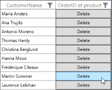

_Loaded Button inside DataTemplate and binded command from ViewModel_

#### Difference between Displaybinding , ValueBinding and MappingName properties

##### DisplayBinding

Denotes the binding to DataModel while loading (In Non-Edit mode).

##### ValueBinding

Denotes the binding to DataModel for Edit element.

##### MappingName

MappingName property denotes the property that present in underlying DataModel that needs to bound to the Column. When seting MappingName, then DisplayBinding and ValueBinding will be created to the underlying DataModel based on MappingName. 

By default, data manipulation operations like Sorting, Grouping, Filtering and etc will be based MappingName and the values will be reflected using reflection from DataModel. Setting UseBindingValue property to true, will enable the advanced features like sorting, grouping, filtering and etc will reflects the values based in ValueBinding which enables you to bind more complex binding paths. 

> _Note: Set UseBindingValue only when you are binding more complex property paths or when standard reflection can’t reflect the data from Data model._

#### Build a DataGrid with Multiple Data Sources

DataGrid does not support binding to more than one Data Source out of the box. By utilizing unbound columns in the DataGrid, you can incorporate items from multiple Data Sources in the same DataGrid.  This is achieved by handling the QueryUnboundColumnValue event.

Consider a real use case scenario, where you have two Data Sources. One Data Source contains a list of employees working in a sales department, and the other contains a list of products sold on that day. Both Data Sources contain a unique property that is common, EmployeeID in this case. Now, both Data Sources are used to construct the Grid. As explained earlier, a QueryUnboundColumnValue event is raised when the UnboundColumn is initialized.

The following code example shows the process of building a DataGrid with multiple Data Sources in action.



[XAML]

<syncfusion:SfDataGrid x:Name="syncgrid"

ItemsSource="{Binding OrderInfoCollection}">

<syncfusion:SfDataGrid.Columns>

    <syncfusion:GridTextColumn MappingName="OrderID" />

    <syncfusion:GridUnBoundColumn MappingName="EmployeeName"/>

    <syncfusion:GridTextColumn MappingName="ShipCountry"/>

    <syncfusion:GridTextColumn MappingName="ShipCity"/>

</syncfusion:SfDataGrid.Columns>

</syncfusion:SfDataGrid>


Now, you can handle the QueryUnboundColumnValue event to construct its value based on the other Data Source as shown in the following code example.



[C#]

EmployeeDetails employeeDetails = new EmployeeDetails();

this.syncgrid.QueryUnboundColumnValue += syncgrid_QueryUnboundColumnValue;

void syncgrid_QueryUnboundColumnValue(object sender, GridUnboundColumnEventsArgs e)

{

    var record = e.Record as ProductInfo;

    var value = employeeDetails.FirstOrDefault

    (p => record != null && p.EmployeeId == record.EmployeeId);

    // Set the value for the column from another data source here.

    if (e.Column.MappingName == "EmployeeName")

    e.Value = value.EmployeeName;

}


The source results in the following output.

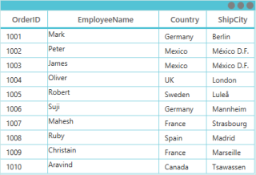

_Builded DataGrid with Multiple Data Sources_

#### How to bind png image to Image Column

SfDataGrid has GridImageColumn. You can directly bind BitmapImages, since GridImageColumn loads Image as its UIElement. However, when you have path or only the name of the image then you cannot bind that image directly to the GridImageColumn. In such cases, you can use converter in ValueBinding. The following code example illustrates how to bind png image to Image Column. 



[C#]

class StringToImageConverter : IValueConverter

{

    public object Convert(object value, Type targetType, object parameter, System.Globalization.CultureInfo culture)

    {

        string imagename = value as string;

        return new BitmapImage(new Uri(string.Format(@"..\..\Images\{0}", imagename),UriKind.Relative));

    }

    public object ConvertBack(object value, Type targetType, object parameter, System.Globalization.CultureInfo culture)

    {

        throw new NotImplementedException();

    }

}


You can bind converter to GridImageColumn.



[XAML]

<syncfusion:GridImageColumn HeaderText="Movie"

                            MappingName="ImageLink"

                            ValueBinding="{Binding Path=ImageLink,

                                                    Converter={StaticResource stringToImageConverter}}" />



#### Define Hyperlink Column that redirects to an URI whose values are not bound to a Column

When URI or URL is very long, and you can find it hard to bind the URL to the GridHyperlinkColumn, or you may want to hide the RequestURI from the View. In both cases, you can implement any of the following two approaches to define the GridHyperlinkColumn. 

##### Method 1

DisplayBinding and ValueBinding in GridColumns of SfDataGrid are used in this case. You can set the DisplayBinding to the value you want to display in view, and bind the ValueBinding to the URI where you want the control to navigate.

The following code example illustrates this.



[XAML]

<syncfusion:GridHyperlinkColumn DisplayBinding="{Binding Path=ProductName}"

                                HeaderText="Official Product Link"

                                MappingName="ProductName"

                                ValueBinding="{Binding Path=ProductURI}" />



The following screenshot displays the output.

_Hyperlink Column redirected to an URI whose values are not bound to a Column using DisplayBinding and ValueBinding_

##### Method 2

Hyperlink Column provides the CellRequestNavigate event that is raised whenever you try to navigate using the Hyperlink control in GridHyperlinkColumn. This event is used to set the sender’s (Hyperlink Button) NavigateURI dynamically at Execute time.

The following code example illustrates how to handle the CellRequestNavigate event and URI dynamically.



[C#]

void sfDataGrid_CurrentCellRequestNavigate(object sender, CurrentCellRequestNavigateEventArgs args)

{

    var hyperlinkControl=(sender as Hyperlink);

    var URI = string.Format("http://www." + args.NavigateText + ".com");

    hyperlinkControl.NavigateUri = new Uri(URI);

    args.Handled = true;

}


The following screenshot illustrates the output.

_Hyperlink Column redirected to an URI whose values are not bound to a Column using CellRequestNavigate event_

#### How to create custom column?

##### CustomColumn support

SfDataGrid allows you to create your own column other than SfDataGrid predefined [column collection](http://help.syncfusion.com/ug/wpf/default.htm). You can decide column’s key board interaction, the events you want to hook and validation from renderer creation. This section explains you on how to create custom column. Custom column can be created by overriding predefined renderers with [renderer replacement](http://help.syncfusion.com/ug/wpf/default.htm) or can be adding new custom renderer to renderer collection. There are two steps to create custom column.

* Creating custom Renderer for column
* Creating custom column

###### Creating custom Renderer for column

You can create custom renderer by deriving from GridVirtualizingCellRenderer<D, E>. It contains generic parameters Where ‘D’ denotes the type display control and ‘E’ denotes the type of edit control. You can load your custom control as display or edit control or you can also load standard controls (TextBlock, Text Box, Combo Box…) and you can customize it in your way. You can also override the existing renderers and you can create customized one. There are some list of existing [renderers](http://help.syncfusion.com/ug/wpf/default.htm) available in SfDataGrid.

The following code example illustrates on how to create custom renderer to load DatePicker as Edit element and TextBlock as display element. 



[C#]

/// 

/// CustomRenderer Creation

/// 

/// <param name="TextBlock">Display Control</param>

/// <param name="DatePicker">Edit Control</param>

class DatePickerRenderer : GridVirtualizingCellRenderer<TextBlock,DatePicker>

{

// TextBlock has been set as Display control.

// DatePicker has been set as Edit control.

}



The following table lists the virtual methods and properties available in GridVirtualizingCellRenderer that helps you to create your custom renderer. 

_List of properties_

<table>
<tr>
<td>
Property</td><td>
Type</td><td>
Description</td><td>
Default Value</td></tr>
<tr>
<td>
IsEditable</td><td>
Bool</td><td>
The property that specify, the column can be editable. If you set false the column cannot edit.E.g.: Hyperlink, Image and Checkbox columns are not editable.  </td><td>
True</td></tr>
<tr>
<td>
CurrentCellIndex</td><td>
RowColumnIndex</td><td>
The property that returns row and column index of current cell</td><td>
Null</td></tr>
<tr>
<td>
CurrentCellElement</td><td>
FrameworkElement</td><td>
Returns the GridCell which hold the Edit/Display element of the CurrentCell. </td><td>
Null</td></tr>
<tr>
<td>
CurrentCellRendererElement</td><td>
FrameworkElement</td><td>
Return the Display/Edit element of the CurrentCell Renderer. </td><td>
Null</td></tr>
<tr>
<td>
IsInEditing</td><td>
bool</td><td>
The property that gets or sets whether the current cell is edit mode or not. If you set false when you edit, Edit element will not unload.</td><td>
False</td></tr>
<tr>
<td>
HasCurrentCellState</td><td>
bool</td><td>
Gets that cell state for the current cell has been set.</td><td>
False</td></tr>
<tr>
<td>
SupportsRenderOptimization</td><td>
bool</td><td>
The property that gets or sets that display and edit can be different controls. </td><td>
True</td></tr>
</table>
_Methods to override_

<table>
<tr>
<td>
Method</td><td>
Description</td></tr>
<tr>
<td>
protected virtual D OnCreateDisplayUIElement()</td><td>
Create the Element of type D specified with the GridVirtualizingCellRenderer. Which creates the default display element for renderer and returns.</td></tr>
<tr>
<td>
protected virtual E OnCreateEditUIElement()</td><td>
Creates a new Edit UIElement of type E specified with the GridVirtualizingCellRenderer type parameter. Which creates the default edit element for renderer and returns</td></tr>
<tr>
<td>
public abstract void OnInitializeDisplayElement(RowColumnIndex rowColumnIndex, D uiElement, GridColumn column, object dataContext);</td><td>
Creates binding between GridColumn properties, Display element properties and also initialize default settings for Display element. You can do, your own binding settings with skipping base.OnInitializeDisplayElement being called.</td></tr>
<tr>
<td>
public abstract void OnInitializeEditElement(RowColumnIndex rowColumnIndex, E uiElement, GridColumn column, object dataContext);</td><td>
Creates binding between GridColumn properties, Edit element properties and also initialize default settings for Edit element. You can do, your own binding settings with skipping base. OnInitializeEditElement being called.</td></tr>
<tr>
<td>
public abstract void OnUpdateDisplayBinding(RowColumnIndex cellRowcolumnIndex, D uiElement, GridColumn column, object dataContext);</td><td>
Updates the binding for display element when scrolling and Data Management operations like grouping, Sorting, Filtering. This method will internally call OnInitializeDisplayElement.</td></tr>
<tr>
<td>
public abstract void OnUpdateEditBinding(RowColumnIndex cellRowcolumnIndex, E element, GridColumn column, object dataContext);</td><td>
Updates only DataContext for Edit element. Which calls OnInitializeEditElement. For SupportRenderOptimization was set to false.</td></tr>
<tr>
<td>
protected virtual void OnEditElementLoaded(object sender, RoutedEventArgs e)</td><td>
When edit element was ready for interaction OnEditElementLoaded method will be called. You can set focus for edit element (sender) and can give selection behavior for the text in edit element. </td></tr>
<tr>
<td>
protected virtual void OnEnteredEditMode(FrameworkElement currentRendererElement)</td><td>
When you start edit mode. You can update the current cell state of editing with IsInEditing is update to true. If you set false, then the RowHeaderState changes, Cell or Row Validation, Setting Edit item will not happen.</td></tr>
<tr>
<td>
protected virtual void OnEditingComplete(FrameworkElement currentRendererElement)</td><td>
When you complete editing with the cell (When do, enter/Tab/Right/Left/Home/Page Up/page Down/Up/Down key navigation) you will get an edit control with edited value.</td></tr>
<tr>
<td>
protected virtual bool ShouldGridTryToHandleKeyDown(KeyEventArgs e)</td><td>
Key Interaction on column will be done in this method. You can decide that the selected cell can allow to navigate with the pressed key. If it return false, pressed key must be handled by GridCell else it leaves to handle by SfDataGrid.</td></tr>
<tr>
<td>
public virtual object GetControlValue()</td><td>
Returns the display or edit control value for validation purpose.</td></tr>
<tr>
<td>
public virtual void SetControlValue(object value)</td><td>
The method that set value to display or edit controls.</td></tr>
<tr>
<td>
public virtual void UpdateSource(FrameworkElement cellElement)</td><td>
Method that updates the source by BindingExpression </td></tr>
<tr>
<td>
public virtual bool CanUpdateBinding(GridColumn column)</td><td>
Decides Whether to refresh the bindings of Element whenever the DataContext gets changed. By default it return false. If you need to use different binding in one column then return as false</td></tr>
<tr>
<td>
public virtual bool CanValidate()</td><td>
Decides whether to do cell validation for GridCell. By default it returns true. (where you want the cell should always focused if it has invalid data) </td></tr>
</table>

You can define the default behavior by the properties with constructor of derived class.



[C#]

//Renderer Creation.

class DatePickerRenderer : GridVirtualizingCellRenderer<TextBlock,DatePicker>

{

    //Constructor of class

    public DatePickerRenderer()

    {

    }

}



The following code example illustrates you on how to create display and edit element in custom renderer.



[C#]

class DatePickerRenderer : GridVirtualizingCellRenderer<TextBlock,DatePicker>

{

    /// 

    /// Create new display element.

    /// 

    /// <returns></returns>

    protected override TextBlock OnCreateDisplayUIElement()

    {

        return new TextBlock();

    }

    /// 

    /// Create new edit element.

    /// 

    /// <returns></returns>

    protected override DatePicker OnCreateEditUIElement()

    {

        return new DatePicker();

    }    

}



The following code example explains you how to initialize properties binding for display element and update bindings.



[C#]

class DatePickerRenderer : GridVirtualizingCellRenderer<TextBlock,DatePicker>

{

    /// 

    /// Initialize display element with binding.

    /// 

    /// <param name="rowColumnIndex"></param>

    /// <param name="uiElement"></param>

    /// <param name="column"></param>

    /// <param name="dataContext"></param>

    public override void OnInitializeDisplayElement(RowColumnIndex rowColumnIndex, TextBlock uiElement, GridColumn column,

        object dataContext)

    {

        base.OnInitializeDisplayElement(rowColumnIndex, uiElement, column, dataContext);

        SetDisplayBinding(uiElement, column, dataContext);

    }

    /// 

    /// Update display elements binding while scrolling.

    /// 

    /// <param name="cellRowcolumnIndex"></param>

    /// <param name="uiElement"></param>

    /// <param name="column"></param>

    /// <param name="dataContext"></param>

    public override void OnUpdateDisplayBinding(RowColumnIndex cellRowcolumnIndex, TextBlock uiElement, GridColumn column, object dataContext)

    {

        base.OnUpdateDisplayBinding(cellRowcolumnIndex, uiElement, column, dataContext);

        SetDisplayBinding(uiElement, column, dataContext);

    }

    /// 

    /// custom binding for display element.

    /// 

    /// <param name="element"></param>

    /// <param name="column"></param>

    /// <param name="dataContext"></param>

    private static void SetDisplayBinding(TextBlock element, GridColumn column, object dataContext)

    {

        var customColumn = (DatePickerColumn)column;                 

        var binding = new Binding

        {

            Path = new PropertyPath(customColumn.DateMapping),

            Mode = BindingMode.TwoWay,

            UpdateSourceTrigger = UpdateSourceTrigger.PropertyChanged,

            Converter = column.DisplayBinding.Converter, //Bind Custom converter for display.

        };

        element.SetBinding(TextBlock.TextProperty, binding);          

    }

}


The following code example explains you on how to initialize properties binding for edit element and update bindings.



[C#]

class DatePickerRenderer : GridVirtualizingCellRenderer<TextBlock,DatePicker>

{

    /// 

    /// Initialize edit element with binding

    /// 

    /// <param name="cellRowcolumnIndex"></param>

    /// <param name="element"></param>

    /// <param name="column"></param>

    /// <param name="dataContext"></param>

    public override void OnInitializeEditElement(RowColumnIndex cellRowcolumnIndex, DatePicker element, GridColumn column,

        object dataContext)

    {

        base.OnInitializeEditElement(cellRowcolumnIndex, element, column, dataContext);

        SetEditBinding(element, column, dataContext);

    }

    /// 

    /// Update binding for edit element while scrolling.

    /// 

    /// <param name="cellRowcolumnIndex"></param>

    /// <param name="element"></param>

    /// <param name="column"></param>

    /// <param name="dataContext"></param>

    public override void OnUpdateEditBinding(RowColumnIndex cellRowcolumnIndex, DatePicker element, GridColumn column, object dataContext)

    {

        base.OnUpdateEditBinding(cellRowcolumnIndex, element, column, dataContext);

        SetEditBinding(element, column, dataContext);

    }

    /// 

    /// Custom binding for edit element.

    /// 

    /// <param name="element"></param>

    /// <param name="column"></param>

    /// <param name="dataContext"></param>

    private static void SetEditBinding(DatePicker element, GridColumn column, object dataContext)

    {

        var customColumn = (DatePickerColumn)column;

        var binding = new Binding

        {

            Source = dataContext,

            Path = new PropertyPath(customColumn.DateMapping),

            Mode = BindingMode.TwoWay,

            UpdateSourceTrigger = UpdateSourceTrigger.PropertyChanged,

        };

        element.SetBinding(DatePicker.TextProperty, binding);

    }

}



The following code example illustrates that how can you make use of OnEditElementLoaded method.



[C#]

class DatePickerRenderer : GridVirtualizingCellRenderer<TextBlock,DatePicker>

{

    /// 

    /// When edit element ready for interaction this method will be called.

    /// 

    /// <param name="sender"></param>

    /// <param name="e"></param>

    protected override void OnEditElementLoaded(object sender, RoutedEventArgs e)

    {

        var datePicker = (sender as DatePicker);

        datePicker.Focus();

        DatePickerTextBox datePickerTextBox = (DatePickerTextBox)GridUtil.FindDescendantChildByType(datePicker, typeof(DatePickerTextBox));

        // GridUtil is the helper class that has functions with Visual Tree

        if ((this.DataGrid.EditorSelectionBehavior == EditorSelectionBehavior.SelectAll || this.DataGrid.IsAddNewIndex(this.CurrentCellIndex.RowIndex)) && PreviewInputText == null)

        {

            datePickerTextBox.SelectAll();               

        }

        else

        {

            datePickerTextBox.Select(datePickerTextBox.SelectedText.Length, 0);

        }

        PreviewInputText = null;

    }

}


The following code example illustrates you on how the key board interaction can be customized with your custom renderer.



[C#]

class DatePickerRenderer : GridVirtualizingCellRenderer<TextBlock,DatePicker>

{

    /// 

    /// Let Renderer decide whether the parent grid should be allowed to handle keys and prevent

    /// the key event from being handled by the visual UIElement for this renderer. If this method

    /// returns true the parent grid will handle arrow keys and set the Handled flag in the event

    /// data. Keys that the grid does not handle will be ignored and be routed to the UIElement

    /// for this renderer.

    /// 

    /// <param name="e">A <see cref="KeyEventArgs" /> object.</param>

    /// <returns>

    /// True if the parent grid should be allowed to handle keys; false otherwise.

    /// </returns>

    protected override bool ShouldGridTryToHandleKeyDown(System.Windows.Input.KeyEventArgs e)

    {

        if (!HasCurrentCellState || !IsInEditing)

            return true;

        DatePickerTextBox datePickerTextBox = (DatePickerTextBox)GridUtil.FindDescendantChildByType(CurrentCellRendererElement as DatePicker, typeof(DatePickerTextBox));

        switch (e.Key)

        {

            case Key.End:

            case Key.Home:

            case Key.Enter:

            case Key.Escape:

                return !((DatePicker)CurrentCellRendererElement).IsDropDownOpen;

            case Key.Down:

            case Key.Up:

            case Key.Left:

            case Key.Right:

                return !((DatePicker)CurrentCellRendererElement).IsDropDownOpen;                               

        }

        return base.ShouldGridTryToHandleKeyDown(e);

    }

}


The following code examples illustrates the custom renderer with converter.



[C#]

//Custom Converter Here

class ConvertToDateTimeClass

{

    public string ConvertToDateTime(object value)

    {

        DateTime date = Convert.ToDateTime(value);

        return date.Day+"/"+date.Month+"/"+date.Year;

    }

}

class CustomConverter : IValueConverter

{

    public object Convert(object value, Type targetType, object parameter, System.Globalization.CultureInfo culture)

    {

        if(string.IsNullOrEmpty(value.ToString()))

            return null;

        return new ConvertToDateTimeClass().ConvertToDateTime(value);

    }

    public object ConvertBack(object value, Type targetType, object parameter, System.Globalization.CultureInfo culture)

    {

        return new ConvertToDateTimeClass().ConvertToDateTime(value);

    }

}

//Renderer Creation.

class DatePickerRenderer : GridVirtualizingCellRenderer<TextBlock,DatePicker>

{

    public DatePickerRenderer()

    {

    }

    /// 

    /// Create new display element.

    /// 

    /// <returns></returns>

    protected override TextBlock OnCreateDisplayUIElement()

    {

        return new TextBlock();

    }

    /// 

    /// Create new edit element.

    /// 

    /// <returns></returns>

    protected override DatePicker OnCreateEditUIElement()

    {

        return new DatePicker();

    }

    #region Display/Edit Value Overrides

    /// 

    /// Gets the control value.

    /// 

    /// <returns></returns>

    public override object GetControlValue()

    {

        if (!HasCurrentCellState)

            return base.GetControlValue();

        return CurrentCellRendererElement.GetValue(IsInEditing ? DatePicker.TextProperty : TextBlock.TextProperty);

    }

    /// 

    /// Sets the control value.

    /// 

    /// <param name="value">The value.</param>

    public override void SetControlValue(object value)

    {

        if (!HasCurrentCellState)

            return;

        if (IsInEditing)

            ((TextBox)CurrentCellRendererElement).Text = value.ToString();

        else

            throw new Exception("Value cannot be Set for Unloaded Editor");

    }

    #endregion

    /// 

    /// Initialize display element with binding.

    /// 

    /// <param name="rowColumnIndex"></param>

    /// <param name="uiElement"></param>

    /// <param name="column"></param>

    /// <param name="dataContext"></param>

    public override void OnInitializeDisplayElement(RowColumnIndex rowColumnIndex, TextBlock uiElement, GridColumn column,

        object dataContext)

    {

        base.OnInitializeDisplayElement(rowColumnIndex, uiElement, column, dataContext);

        SetDisplayBinding(uiElement, column, dataContext);

    }

    /// 

    /// Update display elements binding while scrolling.

    /// 

    /// <param name="cellRowcolumnIndex"></param>

    /// <param name="uiElement"></param>

    /// <param name="column"></param>

    /// <param name="dataContext"></param>

    public override void OnUpdateDisplayBinding(RowColumnIndex cellRowcolumnIndex, TextBlock uiElement, GridColumn column, object dataContext)

    {

        base.OnUpdateDisplayBinding(cellRowcolumnIndex, uiElement, column, dataContext);

        SetDisplayBinding(uiElement, column, dataContext);

    }

    /// 

    /// custom binding for display element.

    /// 

    /// <param name="element"></param>

    /// <param name="column"></param>

    /// <param name="dataContext"></param>

    private static void SetDisplayBinding(TextBlock element, GridColumn column, object dataContext)

    {

        var customColumn = (DatePickerColumn)column;                 

        var binding = new Binding

        {

            Path = new PropertyPath(customColumn.DateMapping),

            Mode = BindingMode.TwoWay,

            UpdateSourceTrigger = UpdateSourceTrigger.PropertyChanged,

            Converter = column.DisplayBinding.Converter, //Bind Custom converter for display.

        };

        element.SetBinding(TextBlock.TextProperty, binding);          

    }

    #region Edit Element

    /// 

    /// Initialize edit element with binding

    /// 

    /// <param name="cellRowcolumnIndex"></param>

    /// <param name="element"></param>

    /// <param name="column"></param>

    /// <param name="dataContext"></param>

    public override void OnInitializeEditElement(RowColumnIndex cellRowcolumnIndex, DatePicker element, GridColumn column,

        object dataContext)

    {

        base.OnInitializeEditElement(cellRowcolumnIndex, element, column, dataContext);

        SetEditBinding(element, column, dataContext);

    }

    /// 

    /// Update binding for edit element while scrolling.

    /// 

    /// <param name="cellRowcolumnIndex"></param>

    /// <param name="element"></param>

    /// <param name="column"></param>

    /// <param name="dataContext"></param>

    public override void OnUpdateEditBinding(RowColumnIndex cellRowcolumnIndex, DatePicker element, GridColumn column, object dataContext)

    {

        base.OnUpdateEditBinding(cellRowcolumnIndex, element, column, dataContext);

        SetEditBinding(element, column, dataContext);

    }

    /// 

    /// Custom binding for edit element.

    /// 

    /// <param name="element"></param>

    /// <param name="column"></param>

    /// <param name="dataContext"></param>

    private static void SetEditBinding(DatePicker element, GridColumn column, object dataContext)

    {

        var customColumn = (DatePickerColumn)column;

        var binding = new Binding

        {

            Source = dataContext,

            Path = new PropertyPath(customColumn.DateMapping),

            Mode = BindingMode.TwoWay,

            UpdateSourceTrigger = UpdateSourceTrigger.PropertyChanged,

        };

        element.SetBinding(DatePicker.TextProperty, binding);

    }

    /// 

    /// Let Renderer decide whether the parent grid should be allowed to handle keys and prevent

    /// the key event from being handled by the visual UIElement for this renderer. If this method

    /// returns true the parent grid will handle arrow keys and set the Handled flag in the event

    /// data. Keys that the grid does not handle will be ignored and be routed to the UIElement

    /// for this renderer.

    /// 

    /// <param name="e">A <see cref="KeyEventArgs" /> object.</param>

    /// <returns>

    /// True if the parent grid should be allowed to handle keys; false otherwise.

    /// </returns>

    protected override bool ShouldGridTryToHandleKeyDown(System.Windows.Input.KeyEventArgs e)

    {

        if (!HasCurrentCellState || !IsInEditing)

            return true;

        DatePickerTextBox datePickerTextBox = (DatePickerTextBox)GridUtil.FindDescendantChildByType(CurrentCellRendererElement as DatePicker, typeof(DatePickerTextBox));

        switch (e.Key)

        {

            case Key.End:

            case Key.Home:

            case Key.Enter:

            case Key.Escape:

                return !((DatePicker)CurrentCellRendererElement).IsDropDownOpen;

            case Key.Down:

            case Key.Up:

            case Key.Left:

            case Key.Right:

                return !((DatePicker)CurrentCellRendererElement).IsDropDownOpen;                               

        }

        return base.ShouldGridTryToHandleKeyDown(e);

    }

    /// 

    /// When edit element ready for interaction this method will be called.

    /// 

    /// <param name="sender"></param>

    /// <param name="e"></param>

    protected override void OnEditElementLoaded(object sender, RoutedEventArgs e)

    {

        var datePicker = (sender as DatePicker);

        datePicker.Focus();

        DatePickerTextBox datePickerTextBox = (DatePickerTextBox)GridUtil.FindDescendantChildByType(datePicker, typeof(DatePickerTextBox));

        if ((this.DataGrid.EditorSelectionBehavior == EditorSelectionBehavior.SelectAll || this.DataGrid.IsAddNewIndex(this.CurrentCellIndex.RowIndex)) && PreviewInputText == null)

        {

            datePickerTextBox.SelectAll();               

        }

        else

        {

            datePickerTextBox.Select(datePickerTextBox.SelectedText.Length, 0);

        }

        PreviewInputText = null;

    }

    #endregion

}



Add your custom renderer to DataGrid renderer collection as in the following code example.



[C#]

//Add renderer to CellRenderer Collection.

_dataGrid.CellRenderers.Add("DatePickerRenderer", new DatePickerRenderer());


#####  Column Creation

Create a class that derives from GridColumn. Set cell type for a custom column in derived class constructor. 

The following code example explains you on how to create Custom Column.



[C#]

//Column Creation

public class DatePickerColumn : GridColumn

{       

    public static readonly DependencyProperty DateMappingProperty = DependencyProperty.Register("DateMapping",

typeof(string), typeof(DatePickerColumn));

    public DatePickerColumn()

    {

        SetCellType("DatePickerRenderer");

    }

    public string DateMapping

    {

        get { return (string)GetValue(DateMappingProperty); }

        set { SetValue(DateMappingProperty, value); }

    }

    protected override Freezable CreateInstanceCore()

    {

        return new DatePickerColumn();

    }

}



Finally, add your custom column to SfDataGrid with the following code example in XAML.



[XAML]

//Converter for custom column display binding.

<Grid.Resources>

    <local:CustomConverter x:Key="converter"/>

</Grid.Resources>

<Syncfusion:SfDataGrid.Columns>    

    <demo:DatePickerColumn MappingName="DateOfMonth"    

                           DateMapping="DateOfMonth"   

                           HeaderText="DatePickerColumn"  

                           DisplayBinding="{Binding  DateOfMonth,Converter={StaticResource converter}}"

                           AllowEditing="True"/>

</Syncfusion:SfDataGrid.Columns>



The following screenshot displays the output.

_Custom Column in Display Mode_

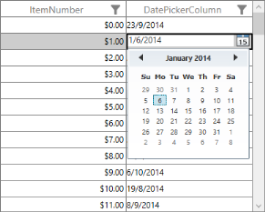

_Custom Column in Edit mode_

#### How to change FilterIconWidth and SortIconWidth when you calculate column width based on SizeToHeader column sizer

By default, column width is calculated based on the fixed FontSize, FilterIconWidth,and SortIconWidth. When you change FilterIconWidth and Sort icon width, it does not consider the changed width when you calculate column width. Therefore, the column width is not fit based on SizeToHeader column sizer. You can use the following code example to calculate the column width based on the new FilterIconWidth and SortIconWidth values.



[C#]

dataGrid.GridColumnSizer.FilterIconWidth = 20;

dataGrid.GridColumnSizer.SortIconWidth = 20;


#### How to customize star width calculation 

When column sizer is Star, the control content occupies total space in the parent, and column’s width is divided equally based on the total space by default. When you want to customize the star width calculation as in grid panel, you can use custom GridColumnSizer.

Consider, the grid has four columns and you can set the width as 1*,2*,3*,1* respectively.

The following code example illustrates how to customize star width calculation.



[XAML] 

<syncfusion:SfDataGrid Name="dataGrid" AllowSorting="True"

                                       AutoGenerateColumns="False"

                                       ColumnSizer="Star"

                                       ItemsSource="{Binding OrderList}"

                                       LiveDataUpdateMode="AllowDataShaping">

                    <syncfusion:SfDataGrid.Columns>

                        <syncfusion:GridTextColumn HeaderText="Order ID" MappingName="OrderID" />

                        <syncfusion:GridTextColumn HeaderText="Customer ID" MappingName="CustomerID" />

                        <syncfusion:GridTextColumn HeaderText="Contact Number" MappingName="ContactNumber" />

                        <syncfusion:GridNumericColumn HeaderText="Quantity"

                                                      MappingName="UnitPrice"

                                                      NumberDecimalDigits="0" />

                    </syncfusion:SfDataGrid.Columns>

</syncfusion:SfDataGrid>





[C#] 

// Assign custom GridColumnSizer to datagrid GridColumnSizer

dataGrid.GridColumnSizer = new ColumnSizerExt(dataGrid);

public class ColumnSizerExt : GridColumnSizer

        {

            public ColumnSizerExt(SfDataGrid grid)

                : base(grid)

            {

            }

  protected override void SetStarWidth(double remainingColumnWidth, IEnumerable<GridColumn> remainingColumns)

            {

                var starValues=new Dictionary<string,int>();

                starValues.Add("OrderID",1);

                starValues.Add("CustomerID",2);

                starValues.Add("ContactNumber",3);

                starValues.Add("UnitPrice",1);

                var removedColumn = new List<GridColumn>();

                var columns = remainingColumns.ToList();

                var totalRemainingStarValue = remainingColumnWidth;

                double removedWidth = 0;

                bool isremoved;

                while (columns.Count > 0)

                {

                    isremoved = false;

                    removedWidth = 0;

                    var columnsCount = 0;

                    columns.ForEach((col)=>

                    {

                        columnsCount += starValues[col.MappingName];

                    });

                    double starWidth = Math.Floor((totalRemainingStarValue / columnsCount));                   

                    var column = columns.First();

                        starWidth *= starValues[column.MappingName];

                    double computedWidth = SetColumnWidth(column, starWidth);

                    if (starWidth != computedWidth && starWidth > 0)

                    {

                        isremoved = true;

                        columns.Remove(column);

                        foreach (var remColumn in removedColumn)

                        {

                            if (!columns.Contains(remColumn))

                            {

                                removedWidth += remColumn.ActualWidth;

                                columns.Add(remColumn);

                            }

                        }

                        removedColumn.Clear();

                        totalRemainingStarValue += removedWidth;

                    }

                    totalRemainingStarValue = totalRemainingStarValue - computedWidth;

                    if (!isremoved)

                    {

                        columns.Remove(column);

                        if (!removedColumn.Contains(column))

                            removedColumn.Add(column);

                    }

                }

            }

}



The following screenshot illustrates the output image after applying star column sizer. The column widths are calculated based on 1*, 2*, 3* and 1*.

_DataGrid with customized star column sizer_

#### How to apply column sizer after resizing the columns?

When you resize the particular column, the width is set for that column. After resizing the column, when you apply column sizer, column width is not set based on column sizer. It maintains the previous width only. You can overcome this scenario by resetting the width of the columns before changing the ColumnSizer as in the following code example.



[C#] 

     foreach (var column in dataGrid.Columns)

     {

        if(!double.IsNaN(column.Width))

             column.Width = double.NaN;

     }

     dataGrid.ColumnSizer = GridLengthUnitType.SizeToCells;

#### How to customize column width calculation for particular column?

By default, column width is calculated based on the fixed FontSize, FontFamily and Margin. When any column is customized with different FontSize and FontFamily, it is not considered when you calculate column width. Therefore, the column width is not fit based on the header and cell value even though column sizer is Auto. You can overcome this scenario by overriding GetTextBlock method in GridColumnSizer as illustrated in the following code example.



[C#] 

// Assign custom GridColumnSizer to datagrid GridColumnSizer

grid.GridColumnSizer = new CustomColumnSizer(grid);

public class CustomColumnSizer : GridColumnSizer

{

        public CustomColumnSizer(SfDataGrid sfdataGrid)

            : base(sfdataGrid)

        {

        }

        protected override TextBlock GetTextBlock(GridColumn column, object record)

        {

            if (TextBlock == null)

                TextBlock = new TextBlock();

            if (column.MappingName == "Name")

            {

                TextBlock.FontFamily = new System.Windows.Media.FontFamily("TimesNewRoman");

                TextBlock.Margin = new Thickness(50, 1, 0, 0);

                TextBlock.FontSize = 20;

            }

            else

            {

                TextBlock.FontFamily = FontFamily;

                TextBlock.Margin = Margin;

                TextBlock.FontSize = FontSize;

            }

            return TextBlock;

        }

}


#### How to change column width based on the cell value at run time?

When grid column sizer is SizeToCells, the column width is adjusted with respect to cell content.

But after editing the cell value, column width is not adjusted based on new cell value instead it maintains the previous width only. You can overcome this by refreshing grid column width using the following code example.



[C#] 

this.dataGrid.Loaded += dataGrid_Loaded;

void dataGrid_Loaded(object sender, RoutedEventArgs e)

{

    dataGrid.View.RecordPropertyChanged += View_RecordPropertyChanged;

}

void View_RecordPropertyChanged(object sender, System.ComponentModel.PropertyChangedEventArgs e)

{

     var column = dataGrid.Columns.FirstOrDefault(c => c.MappingName == e.PropertyName);

     dataGrid.GridColumnSizer.ResetAutoCalculation(column);

     dataGrid.GridColumnSizer.Refresh();

}


## Sorting

This section explains you about Sorting on DataGrid data. Different properties and events that participate in Sorting are discussed in this section.

### Overview

DataGrid control allows you to sort the table data against one or more columns. The number of columns by which the data sorted is unlimited. When sorting is applied, the Grid rearranges the data to match with the current sort criteria ascending or descending order.

DataGrid provides following properties for Sorting.

_Sorting property table_

<table>
<tr>
<td>
Property</td><td>
Type</td><td>
Description</td><td>
Default Value</td></tr>
<tr>
<td>
SfDataGrid.AllowSorting</td><td>
Boolean</td><td>
Enables or disables a value to AllowSorting property indicating whether the DataGrid is resorted by clicking on a column header.</td><td>
True</td></tr>
<tr>
<td>
SfDataGrid.SortColumnDescriptions</td><td>
ObservableCollection&lt;SortColumnDescription&gt;</td><td>
Columns that are added to this collection are allowed to be sorted. </td><td>
</td></tr>
<tr>
<td>
SfDataGrid.AllowTristateSorting</td><td>
Boolean</td><td>
Enables or disables tristate sorting for a Grid. (Ascending, descending and initial data order.)</td><td>
False</td></tr>
<tr>
<td>
SfDataGrid.ShowSortNumbers</td><td>
Boolean</td><td>
You can get the order of sorting in columns header during multi sorting.</td><td>
False </td></tr>
<tr>
<td>
GridColumn.AllowSorting</td><td>
Boolean</td><td>
Enables or disables a value to AllowSorting property indicating whether the GridColumn is resorted by clicking on a column header.</td><td>
True</td></tr>
</table>

> _Note: When SfDataGrid.AllowSorting property is set to’ true’, GridColumn.AllowSorting property gets more priorities to sort the columns._

### Apply Sorting

There is a couple of ways to apply sorting to the DataGrid.

* You can click the column header by which the column is sorted. Once the sorting is applied, the Grid shows a sort icon in the respective column headers indicating the direction of sorting.
* You can also perform sorting using the code. This requires you to define a number of SortColumnDescription objects to be added to SfDataGrid.SortColumnDescriptions collection. SortColumnDescription object holds following two properties:
* ColumnName: Name of the sorted column
* SortDirection: an object of type ListSortDirection defines the soring direction

The following code example illustrates this.



[XAML]

<syncfusion:SfDataGrid x:Name="datagrid"

                       AllowSorting="True"

                       ColumnSizer="Auto"

                       ItemsSource="{Binding OrderInfoCollection}">

    <syncfusion:SfDataGrid.SortColumnDescriptions>

        <syncfusion:SortColumnDescription ColumnName="OrderID" SortDirection="Descending" />

    </syncfusion:SfDataGrid.SortColumnDescriptions>

</syncfusion:SfDataGrid>




[C#]

sfdatagrid.AllowSorting = true;

sfdatagrid.SortColumnDescriptions.Add(new SortColumnDescription() { ColumnName = "OrderID", SortDirection = System.ComponentModel.ListSortDirection.Descending }); 


The following screenshot displays the output.

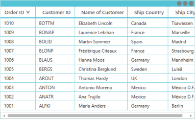

_Sorted DataGrid_

### Events

The DataGrid provides you the following Events for the sorting functionality:

* SfDataGrid.SortColumnChanging: This Event is raised while sorting the column in code or at Execute time that helps to cancel the sorting action. When you sort the column, DataGrid scrolls based on Selected Item. By setting SortColumnChangingEventArgs.CancelScroll property to ‘true’, you can prevent the scrolling while sorting.
* SfDataGrid.SortColumnChanged: This Event is raised after the column is sorted.

The following code example explains you how to hook those events.



[XAML]

<syncfusion:SfDataGrid x:Name="sfdatagrid"

                       AllowSorting="True"

                       AutoGenerateColumns="True"

                       ColumnSizer="Star"

                       ItemsSource="{Binding OrderInfoCollection,

                                                Source={StaticResource data}}"

                       SortColumnsChanged="sfdatagrid_SortColumnsChanged"

                       SortColumnsChanging="sfdatagrid_SortColumnsChanging" />





[C#]

sfdatagrid.SortColumnsChanging += sfdatagrid_SortColumnsChanging;

sfdatagrid.SortColumnsChanged += sfdatagrid_SortColumnsChanged;

void sfdatagrid_SortColumnsChanged(object sender, GridSortColumnsChangedEventArgs e)

{            

}

void sfdatagrid_SortColumnsChanging(object sender, GridSortColumnsChangingEventArgs e)

{

}



###  Tristate Sorting

By default DataGrid allows you to sort the column in ascending and descending order only. SfDataGrid.AllowTristateSorting allows you to sort the column in the following three orders:

* Ascending order
* Descending order
* Initial data order

The following code example illustrates that. 



[XAML]

<syncfusion:SfDataGrid x:Name="sfdatagrid"

                       AllowSorting="True"

                       AllowTriStateSorting="True"

                       AutoGenerateColumns="True"

                       ColumnSizer="Star"

                       ItemsSource="{Binding OrderInfoCollection,

                                                Source={StaticResource data}}" />



### Multi Column Sorting

DataGrid control allows you to sort the multiple columns. To apply sorting for multiple columns, you can click the desired column headers by pressing the CTRL key.

The following screenshot illustrates the MultiColumnSorting in DataGrid.

_DataGrid with Multi Column Sorting_

In the above screenshot, “OrderID” column is sorted first in the descending order. After you sort the “_Name of Customer_”, the sorting of column in any direction happens against OrderID column and previous sorting is maintained.amu.

> _Note: When you add columns to SortColumnDescription, SortColumnChanging event is not raised._

#### Sort Numbers

SfDataGrid.ShowSortNumbers__property enables the visibility of sorting order of the column at the top right corner of Column HeaderCell.

The following code example illustrates that.



[XAML]

<syncfusion:SfDataGrid x:Name="sfdatagrid"

                       AllowSorting="True"

                       AutoGenerateColumns="True"

                       ColumnSizer="Star"

                       ItemsSource="{Binding OrderInfoCollection,

                                                Source={StaticResource data}}"

                       ShowSortNumbers="True" />



The following screenshot illustrates the SortNumbers in DataGrid.

_DataGrid with Sorted Numbers_

 In the above screenshot DataGrid shows the sort order numbers in column header. OrderId column is sorted first in ascending order. Then you can apply multi sort to Name of Customer and ShipCountry column. Now the DataGrid shows sort numbers in column header, based on column sorting order.

### Custom Sorting

Custom Sorting feature enables you to implement custom sorting criteria. For each column, you can apply different sorting criteria.  To perform the custom sorting you have to add SortComparer object to SfDataGrid.SortComparersCollection.

#### A SortComparer object__has the following properties:

* PropertyName: Gets or sets the column Mapping Name that applies custom sorting.
* Comparer: Gets or sets the custom comparer. CustomComparer implements the IComparer and ISortDirection interfaces.

In the below example, the column is sorted based on string.Length by using custom comparer. The following code example illustrates how to perform the custom sorting for Customer Name column according to the string length of the names.



[XAML]

<Window x:Class="SimpleApplication.MainWindow"

        xmlns="http://schemas.microsoft.com/winfx/2006/xaml/presentation"

        xmlns:x="http://schemas.microsoft.com/winfx/2006/xaml"

        xmlns:Linq="clr-namespace:Syncfusion.Data;assembly=Syncfusion.Data.WPF"

        xmlns:local="clr-namespace:SimpleApplication"

        xmlns:syncfusion="http://schemas.syncfusion.com/wpf"

        Title="MainWindow"

        Width="525"

        Height="200">

    <Window.Resources>

        <local:OrderInfoRepositiory x:Key="data" />

        <local:CustomerInfo x:Key="Comparer" />

    </Window.Resources>

    <syncfusion:SfDataGrid x:Name="sfdatagrid"

                           AllowSorting="True"

                           AllowTriStateSorting="True"

                           AutoGenerateColumns="True"

                           ColumnSizer="Star"

                           ItemsSource="{Binding OrderInfoCollection,

                                                 Source={StaticResource data}}"

                           ShowGroupDropArea="True"

                           ShowSortNumbers="True">

        <syncfusion:SfDataGrid.SortComparers>

            <Linq:SortComparer Comparer="{StaticResource Comparer}" PropertyName="CustomerName" />

        </syncfusion:SfDataGrid.SortComparers>

    </syncfusion:SfDataGrid>

</Window>



The following code example illustrates the Custom Comparer.



[C#]  

public class CustomerInfo : IComparer<Object>, ISortDirection

{
     public int Compare(object x, object y)
     {
          int namX;
          int namY;

        //For Customers Type data

        if (x.GetType() == typeof(Customers))
        {

        //Calculating the length of CustomerName if the object type is Customers
            namX = ((Customers)x).CustomerName.Length;
            namY = ((Customers)y). CustomerName.Length;

        }

        //For Group type Data                                   
        else if (x.GetType() == typeof(Group))
        {

        //Calculating the group key length
            namX = ((Group)x).Key.ToString().Length;
            namY = ((Group)y).Key.ToString().Length;
        }
        else
        {
            namX = x.ToString().Length;
            namY = y.ToString().Length;
        }

        // Objects are compared and return the SortDirection
        if (namX.CompareTo(namY) > 0)
            return SortDirection == ListSortDirection.Ascending ? 1 : -1;
        else if (namX.CompareTo(namY) == -1)
            return SortDirection == ListSortDirection.Ascending ? -1 : 1;
        else
            return 0; 

     }

     //Get or Set the SortDirection value
     private ListSortDirection _SortDirectioon;
     public ListSortDirection SortDirection
     {
     get  {   return _SortDirectioon;  }
     set  {  _SortDirection = value;    }
     }

}


The following screenshot displays the output.

_DataGrid with Custom Sorting_

In the preceding screenshot, Name of Customer column is sorted based on string.Length value.

### Sort groups based on summary

When you group data by any column, the records are grouped by identical values of the particular column. By default, each grouped record sorted by column’s key value as shown in the following screenshot.

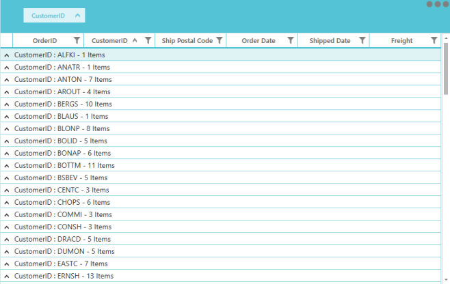

_Sorting groups based on summary_

Now you can sort the grouped records based on key values of the column. You can sort the records based on Caption Summary value that is achieved by using SummaryGroupComparer property in DataGrid.

Following are the steps to create comparer to sort the record based on Caption Summary value of the group,

* Create the Comparer class by implementing two interfaces IComparer<Group> to compare the summary values of two groups and ISortDirection that has the SortDirection property.
* In compare method, get the summary values of two groups by GetSummaryValue method and return the compared result based on SortDirection property (member of ISortDirection interface).

The following code example illustrates how to create a GroupComparer class that sorts the grouped records based on Count Aggregate.



[C#]

public class SummaryGroupComparer : IComparer<Group>, ISortDirection

{

    public ListSortDirection SortDirection { get; set; }

    public int Compare(Group x, Group y)

    {

        int cmp = 0;

        var xgroupSummarry = Convert.ToInt32((x as Group).GetSummaryValue(x.SummaryDetails.SummaryRow.SummaryColumns[0].MappingName, "Count"));

        var ygroupSummarry = Convert.ToInt32((y as Group).GetSummaryValue(x.SummaryDetails.SummaryRow.SummaryColumns[0].MappingName, "Count"));

        cmp = ((IComparable)xgroupSummarry).CompareTo(ygroupSummarry);

        if (this.SortDirection == ListSortDirection.Descending)

            cmp = -cmp;

        return cmp;

    }

}


Group Comparer class is assigned to _S_ummaryGroupComparer property of DataGrid. This is attained by defining the class as a Resource.



[XAML]

<Window.Resources>

    <local:SummaryGroupComparer x:Key="groupComparer" />

</Window.Resources>

<Grid>

    <syncfusion:SfDataGrid x:Name="syncgrid"

                           AutoGenerateColumns="True"

                           ColumnSizer="Star"

                           ItemsSource="{Binding EmployeeDetails}"

                           ShowColumnWhenGrouped="True"

                           ShowGroupDropArea="True"

                           SummaryGroupComparer="{StaticResource groupComparer}">

        <syncfusion:SfDataGrid.CaptionSummaryRow>

            <syncfusion:GridSummaryRow Title="Items Count: {IdCount}" ShowSummaryInRow="True">

                <syncfusion:GridSummaryRow.SummaryColumns>

                    <syncfusion:GridSummaryColumn Name="IdCount"

                                                  Format="'{Count}'"

                                                  MappingName="CustomerID"

                                                  SummaryType="CountAggregate" />

                </syncfusion:GridSummaryRow.SummaryColumns>

            </syncfusion:GridSummaryRow>

        </syncfusion:SfDataGrid.CaptionSummaryRow>

    </syncfusion:SfDataGrid>

</Grid>


Now the group rows are automatically sorted by their summary values. You can sort group rows by summary values by clicking the grouped column header.

_Sorted groups based on summary_

The above screenshot shows the output for sort by summary value example.

## Grouping

This section explains you how to group the columns in DataGrid. Different properties, events and methods available for Grouping are discussed in this section.

### Overview

A Group represents a collection of records that belong to a particular category. The DataGrid control allows you to group the data by one or more columns. When Grouping is applied, the data is organized into a hierarchical structure based on matching field values. 

The records having identical values in the grouped column are combined to form a Group. Each Group is identified by its GroupCaptionRow that is expanded to get the underlying records into view. The GroupCaptionRow carries the information about a particular Group like the Group name, number of items (records) in the Group, etc. It also contains expander that allows you to expand or collapse the Groups individually.

### Properties

The following are the properties used while Grouping.

_Grouping property table_

<table>
<tr>
<td>
Property</td><td>
Type</td><td>
Description</td><td>
Default Value</td></tr>
<tr>
<td>
SfDataGrid.AllowGrouping</td><td>
Boolean</td><td>
Gets or sets a value indicating whether the DataGrid data is grouped by dragging and dropping the column header into GroupDropArea.</td><td>
True</td></tr>
<tr>
<td>
SfDataGrid.AllowFrozenGroupHeaders</td><td>
Boolean</td><td>
Enable or disable the GroupCaptions whether it is freezed while scrolling the DataGrid vertically.</td><td>
False</td></tr>
<tr>
<td>
SfDataGrid.GroupColumnDescriptions</td><td>
ObservableCollection&lt;GroupColumnDescription&gt;</td><td>
Gets the collection of grouped column in DataGrid </td><td>
</td></tr>
<tr>
<td>
SfDataGrid. ShowColumnWhenGrouped</td><td>
Boolean</td><td>
Enables or disables columns shown in header after grouping. </td><td>
True</td></tr>
<tr>
<td>
SfDataGrid.AutoExpandGroups</td><td>
Boolean</td><td>
Specifies the value indicating whether to expand the groups automatically, when column is grouped.</td><td>
False</td></tr>
<tr>
<td>
SfDataGrid.ShowGroupDropArea</td><td>
Boolean</td><td>
Specifies a value that indicates whether GroupDropArea is visible in DataGrid.</td><td>
False</td></tr>
<tr>
<td>
SfDataGrid.IsGroupDropAreaExpanded</td><td>
Boolean</td><td>
Determines a value that indicates whether GroupDropArea is expanded while Grid loads.{{ '' | markdownify }}

{{ '_Note: This property gets effective when SfDataGrid.ShowGroupDropArea property is set to ‘true’._' | markdownify }}</td><td>
False</td></tr>
<tr>
<td>
GridColumn.AllowGrouping</td><td>
Boolean</td><td>
Defines a value that indicates whether the DataGrid is grouped by a column when you drag the column header to GroupDropArea.</td><td>
True</td></tr>
</table>

> _Note: GridColumn.AllowGrouping takes higher priority than DataGrid.AllowGrouping.  When you set AllowGrouping to ‘true’ in DataGrid and AllowGrouping to ‘false’ for particular column then that column is not grouped._

The following screenshot illustrates Group or Ungroup the Column in different ways. DataGrid allows you to group the column in following ways:

* Drag and Drop the column header to GroupDropArea

_DataGrid Grouping by dragging and dropping column header to GroupDropArea_

* By adding the GroupColumnDescription object to SfDataGrid,GroupColumnDescriptions__collections in code contains the following properties:
* ColumnName: Corresponding column name for Grouping.
* Converter: Get the IValueConverter as input that helps to apply the custom grouping.

DataGrid control allows you to add more than one entry in SfDataGrid.GroupColumnDescriptions collection. More than one entry creates the Nested groups and Hierarchical structure.

The following code example illustrates how to perform grouping in XAML.



[XAML]

<Window x:Class="SimpleApplication.MainWindow"

        xmlns="http://schemas.microsoft.com/winfx/2006/xaml/presentation"

        xmlns:x="http://schemas.microsoft.com/winfx/2006/xaml"

        xmlns:Linq="clr-namespace:Syncfusion.Data;assembly=Syncfusion.Data.WPF"

        xmlns:local="clr-namespace:SimpleApplication"

        xmlns:syncfusion="http://schemas.syncfusion.com/wpf"

        Title="MainWindow"

        Width="525"

        Height="200">

    <Window.Resources>

        <local:OrderInfoRepositiory x:Key="data" />

    </Window.Resources>

    <syncfusion:SfDataGrid x:Name="sfdatagrid"

                           AllowGrouping="True"

                           AutoExpandGroups="True"

                           AutoGenerateColumns="True"

                           ColumnSizer="Star"

                           ItemsSource="{Binding OrderInfoCollection,

                                                 Source={StaticResource data}}"

                           ShowGroupDropArea="True">

<syncfusion:SfDataGrid.GroupColumnDescriptions>

<syncfusion:GroupColumnDescription ColumnName="OrderID" />

</syncfusion:SfDataGrid.GroupColumnDescriptions>

    </syncfusion:SfDataGrid>

</Window>




[C#]

sfdatagrid.AllowGrouping = true;

sfdatagrid.ShowGroupDropArea = true;

sfdatagrid.GroupColumnDescriptions.Add(new GroupColumnDescription() { ColumnName = "OrderID" });



The following screenshot displays the output.

_DataGrid with Grouped columns_

### Ungroup the Column

You can ungroup the grouped column in following ways:

* Drag and Drop the corresponding GroupDropAreaItem to column header.

_Ungrouping the column by dragging and dropping the corresponding GroupDropAreaItem to column header._

* Click the close button in GroupDropAreaItem.

_Ungrouping the column by clicking the close button in GroupDropAreaItem_

* Remove the corresponding GroupColumnDescription entry from SfDataGrid.GroupColoumnDescriptions Collection.


[C#]

sfdatagrid.GroupColumnDescriptions.Remove(sfdatagrid.GroupColumnDescriptions.ElementAt(0));

// OR

sfdatagrid.GroupColumnDescriptions.RemoveAt(0);

// OR

var groups = sfdatagrid.GroupColumnDescriptions;

for (int i = groups.Count-1; i >= 0 ; i--)

{

    sfdatagrid.GroupColumnDescriptions.RemoveAt(i);

}



* You can sort grouped columns by using sort indicator in GroupDropAreaItem when you set ShowColumnWhenGrouped to ‘false’.

_Sorted Grouped Columns using sorting indicator in GroupDropAreaItem_

You can freeze the Grouped header. DataGrid provide an interactive support to Freeze the group caption header while scrolling the Grid vertically. Set SfDataGrid_._AllowFrozenGroupHeaders property to ‘true’ in SfDataGrid. The following code example illustrates how to freeze the group caption header. 



[XAML]

<Window x:Class="SimpleApplication.MainWindow"

        xmlns="http://schemas.microsoft.com/winfx/2006/xaml/presentation"

        xmlns:x="http://schemas.microsoft.com/winfx/2006/xaml"

        xmlns:Linq="clr-namespace:Syncfusion.Data;assembly=Syncfusion.Data.WPF"

        xmlns:local="clr-namespace:SimpleApplication"

        xmlns:syncfusion="http://schemas.syncfusion.com/wpf"

        Title="MainWindow"

        Width="525"

        Height="200">

    <Window.Resources>

        <local:OrderInfoRepositiory x:Key="data" />

    </Window.Resources>

    <syncfusion:SfDataGrid x:Name="sfdatagrid"

                           AllowFrozenGroupHeaders="True"

                           AllowGrouping="True"

                           AutoExpandGroups="True"

                           AutoGenerateColumns="False"

                           ColumnSizer="Star"

                           ItemsSource="{Binding OrderInfoCollection,

                                                 Source={StaticResource data}}"

                           ShowColumnWhenGrouped="True"

                           ShowGroupDropArea="True">

        <syncfusion:SfDataGrid.Columns>

            <syncfusion:GridTextColumn MappingName="OrderID" />

            <syncfusion:GridTextColumn AllowGrouping="False" MappingName="CustomerID" />

            <syncfusion:GridTextColumn MappingName="CustomerName" />

            <syncfusion:GridTextColumn MappingName="ShipCity" />

            <syncfusion:GridTextColumn MappingName="Country" />

        </syncfusion:SfDataGrid.Columns>

        <syncfusion:SfDataGrid.GroupColumnDescriptions>

            <syncfusion:GroupColumnDescription ColumnName="OrderID" />

        </syncfusion:SfDataGrid.GroupColumnDescriptions>

    </syncfusion:SfDataGrid>

</Window>


The following screenshot displays the output.

_Freezed group caption header_

The following statements describe you the methods that participate in Expand and Collapse of groups. DataGrid control enables you to expand or collapse the Group by clicking the expander or Group Caption Row. The following methods help to Expand or Collapse the groups in code behind:

* SfDataGrid.ExpandAllGroup(): This method enables you to expand all the groups.
* SfDataGrid.CollapseAllGroup():This method enables you to collapse all the groups.
* SfDataGrid.ExpandGroupsAtLevel(int level): This method expands Group at particular level.
* SfDataGrid.CollapseGroupsAtLevel(int level): This method collapses Group at particular level.
* SfDataGrid.CollapseAllGroup():This method collapses the group at particular level.
* SfDataGrid.ExpandGroup(Group group): This method expands the particular group.
* SfDataGrid.CollapseGroup(Group group): This method collapses the particular group.

The following code example explains you how to call the methods. You can call the methods when the Grid is loading or after the Grid is loaded. 



[C#]

void sfdatagrid_Loaded(object sender, RoutedEventArgs e)

{

    // To Expand or Collapse all groups.

    sfdatagrid.ExpandAllGroup();

    sfdatagrid.CollapseAllGroup();

    // To Expand or Collapse group at level.

    sfdatagrid.ExpandGroupsAtLevel(1);

    sfdatagrid.CollapseGroupsAtLevel(1);

    // To Expand or Collapse particular group.

    var group = (sfdatagrid.View.Groups[0] as Group); 

    sfdatagrid.ExpandGroup(group);

    sfdatagrid.CollapseGroup(group);

}


The following statements describe you the events that participate in Grouping. DataGrid control provides the following events when you expand or collapse the group or when you try to expand particular group these events are called.

* SfDataGrid.GroupExpanding: This event is raised when the group starts to expand that allows you to cancel the expanding action.
* SfDataGrid.GroupExpnaded: This event is raised when the group is expanded.
* SfDataGrid.GroupCollapsing: This event is raised when the group starts to collapse that allows you to cancel the collapsing action.
* SfDataGrid.GroupCollapsed: This event is raised when the group is collapsed. 

You can use this event to cancel Expand or Collapse action by setting cancel to ‘true’. 



[XAML]

<syncfusion:SfDataGrid x:Name="sfdatagrid"

                       AllowGrouping="True"

                       AutoGenerateColumns="True"

                       ColumnSizer="Star"

                       GroupExpanding="sfdatagrid_GroupExpanding"

                       ItemsSource="{Binding OrderInfoCollection}"

                       ShowGroupDropArea="True" />




[C#]

// To Hook Event

sfdatagrid.GroupExpanding +=sfdatagrid_GroupExpanding; 

// To Expand particular group at Execute time.

var group = (sfdatagrid.View.Groups[0] as Group); 

sfdatagrid.ExpandGroup(group);

// To cancel expand

private void sfdatagrid_GroupExpanding(object sender, GroupChangingEventArgs e)

{

    e.Cancel = true;

}



> _Note: These events do not hit when you use ExpandAllGroup (), CollapseAllGroup (), ExpandGroupsAtLevel () and CollapseGropsAtLevel () methods._

### Custom Grouping

CustomGrouping feature enables you to implement CustomGrouping criteria. For each column, you can apply different Grouping criteria.

To achieve the CustomGrouping, you can write the converter that implements IValueConverter, with your CustomGrouping logic. Assign that converter to GroupColumnDescription.Converter__property.

The following code example illustrates the converter used for CustomGrouping.



[C#]

// DataGrid groups the column against return value of this converter.

public class GroupDataTimeConverter : IValueConverter

{

    public object Convert(object value, System.Type targetType, object parameter, CultureInfo culture)

    {

        var saleinfo = value as SalesByDate;

        var dt = DateTime.Now;

        var days = (int)Math.Floor((dt - saleinfo.Date).TotalDays);

        var dayofweek = (int)dt.DayOfWeek;

        var diff = days - dayofweek;

        if (days <= dayofweek)

        {

            if (days == 0)

                return "TODAY";

            if (days == 1)

                return "YESTERDAY";

            return saleinfo.Date.DayOfWeek.ToString().ToUpper();

        }

        if (diff > 0 && diff <= 7)

            return "LAST WEEK";

        if (diff > 7 && diff <= 14)

            return "TWO WEEKS AGO";

        if (diff > 14 && diff <= 21)

            return "THREE WEEKS AGO";

        if (dt.Year == saleinfo.Date.Year && dt.Month == saleinfo.Date.Month)

            return "EARLIER THIS MONTH";

        if (DateTime.Now.AddMonths(-1).Month == saleinfo.Date.Month)

            return "LAST MONTH";

        return "OLDER";

    }

    public object ConvertBack(object value, System.Type targetType, object parameter, CultureInfo culture)

    {

        throw new System.NotImplementedException();

    }

}



The following code example defines how to set the custom converter for group description.



[XAML]      

<Window.Resources>

<local:GroupDateTimeConverter x:Key="customGroupConverter">

</Window.Resources>

<syncfusion:SfDataGrid x:Name="sfGrid"

                       Margin="10,0,30,30"

                       AllowFrozenGroupHeaders="True"

                       AutoGenerateColumns="False"

                       ColumnSizer="Star"

                       GroupCaptionTextFormat=" {ColumnName}: {Key}"

                       ItemsSource="{Binding DailySalesDetails}"

                       NavigationMode="Row"

                       ShowColumnWhenGrouped="False">

    <syncfusion:SfDataGrid.GroupColumnDescriptions>

        <syncfusion:GroupColumnDescription ColumnName="Date" Converter="{StaticResource customGroupDateTimeConverter}" />

    </syncfusion:SfDataGrid.GroupColumnDescriptions>

</syncfusion:SfDataGrid>


The following screenshot displays the output.

_DataGrid with Custom Grouping_

### How To

#### How to customize GroupDropArea Text

You can customize GroupDropArea text by using GroupDropAreaText property. You can add this property to SfDataGrid and provide value in GroupDropArea. The following code example illustrates how to customize GroupDropArea Text.



[XAML]

<Window x:Class="SimpleApplication.MainWindow"

        xmlns="http://schemas.microsoft.com/winfx/2006/xaml/presentation"

        xmlns:x="http://schemas.microsoft.com/winfx/2006/xaml"

        xmlns:Linq="clr-namespace:Syncfusion.Data;assembly=Syncfusion.Data.WPF"

        xmlns:local="clr-namespace:SimpleApplication"

        xmlns:syncfusion="http://schemas.syncfusion.com/wpf"

        Title="MainWindow"

        Width="525"

        Height="200">

    <Window.DataContext>

        <local:OrderInfoRepositiory />

    </Window.DataContext>

    <syncfusion:SfDataGrid x:Name="sfdatagrid"

                           AllowGrouping="True"

                           AutoGenerateColumns="True"

                           ColumnSizer="Star"

                           GroupDropAreaText="Group Columns Here"

                           IsGroupDropAreaExpanded="True"

                           ItemsSource="{Binding OrderInfoCollection}"

                           ShowGroupDropArea="True" />

</Window>



The following screenshot displays Group Columns as GroupDropAreaText in GroupDropArea.

_Group Columns as GroupDropArea Text in GroupDropArea_

## Summaries

This section explains you how to show concise information about Grouped Data from DataGrid data in rows or columns. 

### Overview

SfDataGrid control allows you to display summaries for each Group or Table. You can derive additional information from your data like Sum, Average, Maximum, Minimum and Count using summaries. DataGrid control supports three types of summaries.

* Table Summary
* Group Summary
* Caption Summary

These summary values are computed for Groups using GridSummaryRow and GridSummaryColumn that implements ISummaryRow and ISummaryColumn interface.

### GridSummaryRow

All the summaries are represented by GridSummaryRow that contains the following important properties.

_GridSummaryRow property table_

<table>
<tr>
<td>
Property</td><td>
Type</td><td>
Description</td><td>
Default Value</td></tr>
<tr>
<td>
GridSummaryRow.ShowSummaryInRow</td><td>
Boolean</td><td>
Indicates whether the summary value is displayed in specific column or row.</td><td>
True</td></tr>
<tr>
<td>
GridSummaryRow.Title</td><td>
String</td><td>
Displays summary with title (with Statement) while ShowSummaryInRow is set to ‘true’.</td><td>
Null</td></tr>
<tr>
<td>
GridSummaryRow.SummaryColumns</td><td>
Collection</td><td>
Gets or sets a value that stores the collection of GridSummaryColumns to calculate the summaries.</td><td>
</td></tr>
<tr>
<td>
GridSummaryRow.Name</td><td>
String</td><td>
Gets or sets a value that indicates the name of GridSummaryRow.</td><td>
Null</td></tr>
</table>

DataGrid control enables you to display more than one summary (i.e. GroupSummary and TableSummary) by defining more than one GridSummaryRows. Group summaries are stored in SfDataGrid.GroupSummaryRows collection and Table summaries are stored in SfDataGrid.TableSummaryRows collection.

### GridSummaryColumn

GridSummaryColumn is the object of GridSummaryRow.SummaryColumns collection that contains the following important properties:

* MappingName: The corresponding column name that is used for the summary calculation.
* SummaryType: It is the SummaryType (enum) property that helps to define the aggregate type for the summary calculation. DataGrid control provides the following predefined aggregates. 
* CountAggregate.
* Int32Aggregate. 
* DoubleAggregate.
* Custom (used with custom summaries).
* Format: String property that formats the summary value and displays it.Format property contains two parts that is separated by colon (:) symbol. 
* First part denotes the aggregate function name and second part denotes display format of the summary value.

For example when you declare the format as “{Sum:c}”, the keyword “Sum” denotes the aggregate function name. Every aggregate type has some built-in aggregate function. The aggregate function names in built-in aggregate types as follows:

1. CountAggregate: Count
2. Int32Aggregate: Count,Max,Min,Average and Sum
3. DoubleAggregate: Count, Max, Min, Average and Sum
4. You can use these function names only when you define the Format property.

Second part denotes the format. The key word “c” denotes the string format that defines how the summary value is displayed. 

To know more about the string format values, you can refer the following MSDN link: [http://msdn.microsoft.com/en-us/library/dwhawy9k.aspx](http://msdn.microsoft.com/en-us/library/dwhawy9k.aspx).

* Name: Defines name of the GridSummaryColumn that helps to denote the GridSummaryColumn in GridSummaryRow with Title.
* CustomAggregate: Defines the customaggregate class object when the summary type is set as Custom that calculates the custom summaries.

### Examples

Show column wise summary values

DataGrid provides exclusive support to show column wise summary values. To show the summary values in column wise you can set GridSummaryRow.ShowSummaryInRow property as ‘false’.

The following code example illustrates this.



[XAML]

<syncfusion:SfDataGrid AllowFrozenGroupHeaders="True"

                       AutoExpandGroups="True"

                       AutoGenerateColumns="False"

                       ColumnSizer="Star"

                       GroupCaptionTextFormat="Sales details in {ColumnName} : {Key}"

                       ItemsSource="{Binding YearlySalesDetails}"

                       NavigationMode="Row"

                       ShowColumnWhenGrouped="False">

    <syncfusion:SfDataGrid.GroupColumnDescriptions>

        <syncfusion:GroupColumnDescription ColumnName="Year" />

    </syncfusion:SfDataGrid.GroupColumnDescriptions>

    <syncfusion:SfDataGrid.Columns>

        <syncfusion:GridTextColumn MappingName="Name" />

        <syncfusion:GridTextColumn DisplayBinding="{Binding Path=QS1,

                                                        StringFormat='{}{0:C}'}"

                                   HeaderText="Sales in Quarter1"

                                   MappingName="QS1"

                                   TextAlignment="Right" />

        <syncfusion:GridTextColumn DisplayBinding="{Binding Path=QS2,

                                                        StringFormat='{}{0:C}'}"

                                   HeaderText="Sales in Quarter2"

                                   MappingName="QS2"

                                   TextAlignment="Right" />

        <syncfusion:GridTextColumn DisplayBinding="{Binding Path=QS3,

                                                        StringFormat='{}{0:C}'}"

                                   HeaderText="Sales in Quarter3"

                                   MappingName="QS3"

                                   TextAlignment="Right" />

        <syncfusion:GridTextColumn DisplayBinding="{Binding Path=QS4,

                                                        StringFormat='{}{0:C}'}"

                                   HeaderText="Sales in Quarter4"

                                   MappingName="QS4"

                                   TextAlignment="Right" />

        <syncfusion:GridTextColumn DisplayBinding="{Binding Path=Total,

                                                        StringFormat='{}{0:C}'}"

                                   HeaderText="Total Sales in Year"

                                   MappingName="Total"

                                   TextAlignment="Right" />

        <syncfusion:GridTextColumn MappingName="Year" />

    </syncfusion:SfDataGrid.Columns>

    <syncfusion:SfDataGrid.TableSummaryRows>

        <syncfusion:GridSummaryRow ShowSummaryInRow="False">

            <syncfusion:GridSummaryRow.SummaryColumns>

                <syncfusion:GridSummaryColumn Name="TQS1"

                                              Format="'{Sum:c}'"

                                              MappingName="QS1"

                                              SummaryType="DoubleAggregate" />

                <syncfusion:GridSummaryColumn Name="TQS4"

                                              Format="'{Sum:c}'"

                                              MappingName="QS4"

                                              SummaryType="DoubleAggregate" />

            </syncfusion:GridSummaryRow.SummaryColumns>

        </syncfusion:GridSummaryRow>

    </syncfusion:SfDataGrid.TableSummaryRows>

</syncfusion:SfDataGrid>



The following screenshot displays the output of the above code.

_Column wise Summary values_

In the above screenshot, summary values are showed at the bottom of corresponding column that are mapped to the GridSummaryColumn.

> _Note: Summary values are displayed based on the GridSummaryColumn.Format value, when the summaries are displayed in column wise._

### Show the summaries in row

When you declare the summaries as default,DataGrid shows the values in the row. The following code example illustrates how to declare the summaries for DataGrid.



[XAML]

<syncfusion:SfDataGrid AllowFrozenGroupHeaders="True"

                       AutoExpandGroups="True"

                       AutoGenerateColumns="False"

                       ColumnSizer="Star"

                       GroupCaptionTextFormat="Sales details in {ColumnName} : {Key}"

                       ItemsSource="{Binding YearlySalesDetails}"

                       NavigationMode="Row"

                       ShowColumnWhenGrouped="False">

    <syncfusion:SfDataGrid.GroupColumnDescriptions>

        <syncfusion:GroupColumnDescription ColumnName="Year" />

    </syncfusion:SfDataGrid.GroupColumnDescriptions>

    <syncfusion:SfDataGrid.Columns>

        <syncfusion:GridTextColumn MappingName="Name" />

        <syncfusion:GridTextColumn DisplayBinding="{Binding Path=QS1,

                                                            StringFormat='{}{0:C}'}"

                                   HeaderText="Sales in Quarter1"

                                   MappingName="QS1"

                                   TextAlignment="Right" />

        <syncfusion:GridTextColumn DisplayBinding="{Binding Path=QS2,

                                                            StringFormat='{}{0:C}'}"

                                   HeaderText="Sales in Quarter2"

                                   MappingName="QS2"

                                   TextAlignment="Right" />

        <syncfusion:GridTextColumn DisplayBinding="{Binding Path=QS3,

                                                            StringFormat='{}{0:C}'}"

                                   HeaderText="Sales in Quarter3"

                                   MappingName="QS3"

                                   TextAlignment="Right" />

        <syncfusion:GridTextColumn DisplayBinding="{Binding Path=QS4,

                                                            StringFormat='{}{0:C}'}"

                                   HeaderText="Sales in Quarter4"

                                   MappingName="QS4"

                                   TextAlignment="Right" />

        <syncfusion:GridTextColumn DisplayBinding="{Binding Path=Total,

                                                            StringFormat='{}{0:C}'}"

                                   HeaderText="Total Sales in Year"

                                   MappingName="Total"

                                   TextAlignment="Right" />

        <syncfusion:GridTextColumn MappingName="Year" />

    </syncfusion:SfDataGrid.Columns>

    <syncfusion:SfDataGrid.TableSummaryRows>

        <syncfusion:GridSummaryRow Title="Total Sales : {TotalSales}" ShowSummaryInRow="True">

            <syncfusion:GridSummaryRow.SummaryColumns>

                <syncfusion:GridSummaryColumn Name="TotalSales"

                                              Format="'{Sum:c}'"

                                              MappingName="Total"

                                              SummaryType="DoubleAggregate" />

            </syncfusion:GridSummaryRow.SummaryColumns>

        </syncfusion:GridSummaryRow>

    </syncfusion:SfDataGrid.TableSummaryRows>

</syncfusion:SfDataGrid>



The following screenshot displays the output of the above code.

_Row wise Summary values_

In the above screenshot, summary values are showed in row because GridSummaryRow.ShowSummaryInRow is set as ‘true’. In GridSummaryRow.Title property, you are denoting the GridSummaryColumns by the name of the corresponding GridSummaryColumn.

When the summary values are showed in row, summary values are displayed in the format that is defined in GridSummaryRow.Title.

> _Note: Default value of GridSummaryRow.ShowSummaryInRow is true._

### Group Summaries

This section explains you about GroupSummaries and how to display it. The Group Summary is associated with every group in DataGrid control. DataGrid control provides support to add multiple group summaries, i.e., you can have more than one summary row for every group. The following code example illustrates how to set the group summary for DataGrid control.



[XAML]

<syncfusion:SfDataGrid.GroupSummaryRows>

    <syncfusion:GridSummaryRow Title="Total Sales in Year for {ProductCount} Products : {YearSales}" ShowSummaryInRow="True">

        <syncfusion:GridSummaryRow.SummaryColumns>

            <syncfusion:GridSummaryColumn Name="YearSales"

                                          Format="'{Sum:c}'"

                                          MappingName="Total"

                                          SummaryType="DoubleAggregate" />

            <syncfusion:GridSummaryColumn Name="ProductCount"

                                          Format="'{Count:d}'"

                                          MappingName="Name"

                                          SummaryType="CountAggregate" />

        </syncfusion:GridSummaryRow.SummaryColumns>

    </syncfusion:GridSummaryRow>

</syncfusion:SfDataGrid.GroupSummaryRows>



The following screenshot displays the output of the above code.

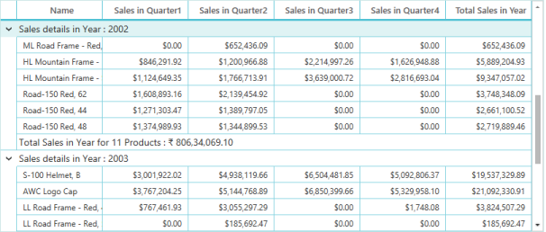

_DataGrid with Group Summary_

To show the Group Summaries in column basis you can set the GridSummaryRow.ShowSummaryInRow property to ‘false’. The following code example illustrates this.



[XAML]

<syncfusion:SfDataGrid.GroupSummaryRows>

    <syncfusion:GridSummaryRow ShowSummaryInRow="False">

        <syncfusion:GridSummaryRow.SummaryColumns>

            <syncfusion:GridSummaryColumn Name="SQS1"

                                          Format="'{Sum:c}'"

                                          MappingName="QS1"

                                          SummaryType="DoubleAggregate" />

            <syncfusion:GridSummaryColumn Name="SQS4"

                                          Format="'{Sum:c}'"

                                          MappingName="QS4"

                                          SummaryType="DoubleAggregate" />

        </syncfusion:GridSummaryRow.SummaryColumns>

    </syncfusion:GridSummaryRow>

</syncfusion:SfDataGrid.GroupSummaryRows>


The following screenshot displays the output of the above code.

_DataGrid with Group Summaries in column basis_

### Table Summaries

This section explains you about TableSummary and how to display it. The TableSummary is associated with the entire Grid table. DataGrid also provides the support to show the multiple table summary rows.



[XAML]

<syncfusion:SfDataGrid.TableSummaryRows>

    <syncfusion:GridSummaryRow Title="Total Sales : {tableSummary}" ShowSummaryInRow="True">

        <syncfusion:GridSummaryRow.SummaryColumns>

            <syncfusion:GridSummaryColumn Name="tableSummary"

                                          Format="'{Sum:c}'"

                                          MappingName="Total"

                                          SummaryType="DoubleAggregate" />

        </syncfusion:GridSummaryRow.SummaryColumns>

    </syncfusion:GridSummaryRow>

</syncfusion:SfDataGrid.TableSummaryRows>


The following screenshot displays the TableSummary at the bottom of the Grid.

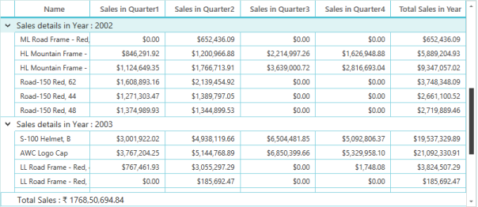

_Table Summary at the bottom of the Grid_

TableSummary has another dependency property Position that displays Table Summary values at Top or Bottom position. The following code example illustrates that.



[XAML]

<syncfusion:SfDataGrid.TableSummaryRows>

    <syncfusion:GridTableSummaryRow Position="Top" ShowSummaryInRow="False">

        <syncfusion:GridTableSummaryRow.SummaryColumns>

            <syncfusion:GridSummaryColumn Name="TQS1"

                                          Format="'{Sum:c}'"

                                          MappingName="QS1"

                                          SummaryType="DoubleAggregate" />

            <syncfusion:GridSummaryColumn Name="TQS2"

                                          Format="'{Sum:c}'"

                                          MappingName="QS2"

                                          SummaryType="DoubleAggregate" />

            <syncfusion:GridSummaryColumn Name="TQS3"

                                          Format="'{Sum:c}'"

                                          MappingName="QS3"

                                          SummaryType="DoubleAggregate" />

            <syncfusion:GridSummaryColumn Name="TQS4"

                                          Format="'{Sum:c}'"

                                          MappingName="QS4"

                                          SummaryType="DoubleAggregate" />

        </syncfusion:GridTableSummaryRow.SummaryColumns>

    </syncfusion:GridTableSummaryRow>

    <syncfusion:GridSummaryRow Title="Total Sales : {TotalSales}" ShowSummaryInRow="True">

        <syncfusion:GridSummaryRow.SummaryColumns>

            <syncfusion:GridSummaryColumn Name="TotalSales"

                                          Format="'{Sum:c}'"

                                          MappingName="Total"

                                          SummaryType="DoubleAggregate" />

        </syncfusion:GridSummaryRow.SummaryColumns>

    </syncfusion:GridSummaryRow>

</syncfusion:SfDataGrid.TableSummaryRows>



The following screenshot displays the output of the above code.

_Table Summary at the top of the Grid_

### Caption Summaries

DataGrid provides built-in support for caption summaries, where the summary values are displayed in the group caption summary cells. You can have only one caption summary row for Group. SfDataGrid.CaptionSummaryRow__property customizes the caption summary.



[XAML]

<syncfusion:SfDataGrid.CaptionSummaryRow>

    <syncfusion:GridSummaryRow Title="Total Items : {CaptionSummary}" ShowSummaryInRow="False">

        <syncfusion:GridSummaryRow.SummaryColumns>

            <syncfusion:GridSummaryColumn Name="CaptionSummary"

                                          Format="Count-({Count:c})"

                                          MappingName="Name"

                                          SummaryType="CountAggregate" />

        </syncfusion:GridSummaryRow.SummaryColumns>

    </syncfusion:GridSummaryRow>

</syncfusion:SfDataGrid.CaptionSummaryRow>



The following screenshot displays the caption summary.

_DataGrid with Caption Summary_

### Custom Summaries

CustomSummaries feature enables you to implement your own aggregate functions. You can achieve CustomSummaries by implementing the ISummaryAggregate interface to define the custom logic, and associating this custom logic to the GridSummaryColumn.CustomAggregate property. The ISummaryAggregate interface helps to build user-defined logic for summary calculation.

 The following steps illustrate the functions of the ISummaryAggregate interface:

1. Initially you can define a custom property to get and set the summary value.
2. Then you can implement the CalculateAggregateFunc interface method and inside a function, you can write your own logic of calculating the summary value. It returns a System.Action<T1, T2, T3> delegate for the aggregate, where T1 represents the source list of items where the summary is calculated, T2 specifies the property (summary column) and T3 is the Property Descriptor of the custom aggregate class itself. The CalculateAggregateFunc calculates the summary value using these parameters, and assigns the final summary value to the Custom property defined in the first step.

#### Example

This example uses the Stock Portfolio collection that has a column ‘Change’ that shows the rate of change of market value of the stocks.

For example, you can display the Standard Deviation of the values of the ‘Change’ column, industry-wise using a group summary as the Grid is already grouped by the Industry.

Since the built-in summaries do not support this type of calculation, you can create customsummaries and set custom code to calculate the standard deviation values.

The following code example illustrates how to set the Customaggregate to calculate custom summary.



[C#]

public class CustomAggregate : ISummaryAggregate

    {

        public CustomAggregate()

        {

        }

        public double StdDev { get; set; }

        Action<IEnumerable, string, PropertyDescriptor> ISummaryAggregate.CalculateAggregateFunc()

        {

            return (items, property, pd) =>

            {

                var enumerableItems = items as IEnumerable<OrderInfo>;

                if (pd.Name == "StdDev")

                {

                    this.StdDev = enumerableItems.StdDev<OrderInfo>(q => q.OrderID);

                }

            };

            // TODO: Implement this method

        }

    }

public static class LinqExtensions

{

public static double StdDev<T>(this IEnumerable<T> values, Func<T, double?> selector)

{

double ret = 0;

var count = values.Count();

if (count > 0)

{

// Compute the Average

double? avg = values.Average(selector);

// Perform the Sum of (value-avg)^2

double sum = values.Select(selector).Sum(d =>

{

if (d.HasValue)

{

return Math.Pow(d.Value - avg.Value, 2);

}

return 0.0;

});

// Put it all together

ret = Math.Sqrt((sum) / (count - 1));

}

return ret;

}

}




[XAML]

<syncfusion:SfDataGrid.GroupSummaryRows>

    <syncfusion:GridSummaryRow Title="Total Sum - {groupSummary}" ShowSummaryInRow="True">

        <syncfusion:GridSummaryRow.SummaryColumns>

            <syncfusion:GridSummaryColumn Name="groupSummary"

                                          CustomAggregate="{StaticResource customAggregate}"

                                          Format="'{StdDev:d}'"

                                          MappingName="Change"

                                          SummaryType="Custom" />

        </syncfusion:GridSummaryRow.SummaryColumns>

    </syncfusion:GridSummaryRow>

</syncfusion:SfDataGrid.GroupSummaryRows>


> _Note: When you use Title for GridSummaryRow; you need to concentrate on name of GridSummaryColumn. The name that you used in GridSummaryColumn and Title should match._

### How To

#### How to format Caption summary row using GroupCaptionText?

The DataGrid enables you to customize the GroupCaption text format. By default, GroupCaption text is displayed in “{ColumnName}: {Key} - {ItemsCount} Items”__format.

* ColumnName: Displays the grouped column name.
* Key: Displays the group key value.
* ItemsCount: Displays the number of items in group.

The following code example displays only group key and items count in Caption summary row.



[XAML]

<syncfusion:SfDataGrid x:Name="datagrid"

                       AllowGrouping="True"

                       ColumnSizer="Star"

                       GroupCaptionTextFormat=" {Key} - {ItemsCount} Items"

                       ItemsSource="{Binding OrdersDetails}"

                       ShowGroupDropArea="True">

    <syncfusion:SfDataGrid.GroupColumnDescriptions>

        <syncfusion:GroupColumnDescription ColumnName="Country"/>

    </syncfusion:SfDataGrid.GroupColumnDescriptions>

</syncfusion:SfDataGrid>


The following screenshot displays the output of the above code.

_Group key and items count in Caption summary row_

## Filtering

This section explains you about Filtering and how to filter records programmatically or using UI. Different approaches to filter records in both the methods, properties, methods and events that participate in filtering are discussed in this section.

### Overview

The SfDataGrid control allows you to filter data based on your own criteria. Filtering helps to view certain subset of the ItemsSource collection that meets a given Filtering criteria. Filtering is done in two ways:

* Advanced Filtering
* Programmatic Filtering
#### Advanced Filtering 

This section explains you how to apply Filtering on records using UI. UI Filtering is one way of Filtering the data in a Grid. This allows you to easily filter data from multiple columns with enriched UI interactions that resembles the filter drop-down lists in Excel. 

Grid supports the following two types of UI filtering. 

1. Checkbox Filter
2. Advanced Filter

### GridFilterPopupControl structure

The following highlighted one is CheckBoxFiltering.

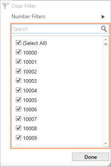

### _CheckBox Filtering_

The following screenshot displays you the control structure of TextFilters in Excel-Like filtering. When you set cangenerateuniqueitems to ‘true’, you can get Filter value combobox instead of TextBox.

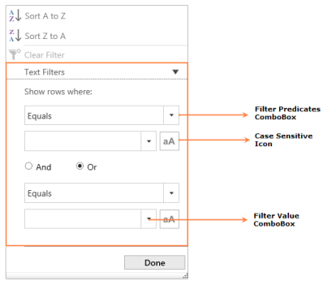

_Control structure of Text Filters_

### Enable UI Filtering 

To access UI Filtering, you can enable it. UI Filtering is enabled or disabled by setting the AllowFiltering property that applies in both SfDataGrid and GridColumn. 



[XAML] 

<syncfusion:SfDataGrid x:Name="syncgrid"

                       AllowFiltering="{Binding IsChecked,

                                            ElementName=ckbAllowFilters}"

                       AutoGenerateColumns="False"

                       ColumnSizer="Star"

                       ItemsSource="{Binding EmployeeDetails}"

                       LiveDataUpdateMode="AllowDataShaping"

                       NavigationMode="Row">

    <syncfusion:SfDataGrid.Columns>

        <syncfusion:GridTextColumn AllowBlankFilters="{Binding ElementName=ckbAllowBlankFiltersOrderID,

                                                            Mode=TwoWay,

                                                            Path=IsChecked}"

                                   AllowFiltering="{Binding ElementName=ckbAllowFilterOrderID,

                                                        Mode=TwoWay,

                                                        Path=IsChecked}"

                                   ImmediateUpdateColumnFilter="{Binding IsChecked,

                                                                        Mode=TwoWay,

                                                                        ElementName=ckbImmediateUpdateColumnFilterOrderID}"

                                   MappingName="OrderID"

                                   TextAlignment="Right" />

        <syncfusion:GridTextColumn MappingName="CustomerID" />

        <syncfusion:GridTextColumn AllowBlankFilters="{Binding ElementName=ckbAllowBlankFiltersShipPostalCode,

                                                            Mode=TwoWay,

                                                            Path=IsChecked}"

                                   AllowFiltering="{Binding ElementName=ckbAllowFilterShipPostalCode,

                                                        Mode=TwoWay,

                                                        Path=IsChecked}"

                                   HeaderText="Ship PostalCode"

                                   ImmediateUpdateColumnFilter="{Binding IsChecked,

                                                                        Mode=TwoWay,

                                                                        ElementName=ckbImmediateUpdateColumnFilterShipPostalCode}"

                                   MappingName="ShipPostalCode" />

        <syncfusion:GridTextColumn DisplayBinding="{Binding Path=OrderDate,

                                                        StringFormat=d}"

                                   HeaderText="Order Date"

                                   MappingName="OrderDate"

                                   TextAlignment="Right" />

        <syncfusion:GridTextColumn AllowBlankFilters="{Binding ElementName=ckbAllowBlankFiltersShippedDate,

                                                            Mode=TwoWay,

                                                            Path=IsChecked}"

                                   AllowFiltering="{Binding ElementName=ckbAllowFilterShippedDate,

                                                        Mode=TwoWay,

                                                        Path=IsChecked}"

                                   DisplayBinding="{Binding Path=ShippedDate,

                                                        StringFormat=d}"

                                   HeaderText="Shipped Date"

                                   ImmediateUpdateColumnFilter="{Binding IsChecked,

                                                                        Mode=TwoWay,

                                                                        ElementName=ckbImmediateUpdateColumnFilterShippedDate}"

                                   MappingName="ShippedDate"

                                   TextAlignment="Right" />

        <syncfusion:GridTextColumn DisplayBinding="{Binding Path=Freight,

                                                        StringFormat='{}{0:c}'}"

                                   MappingName="Freight"

                                   TextAlignment="Right" />

    </syncfusion:SfDataGrid.Columns>

</syncfusion:SfDataGrid>



The following image displays a funnel icon in the header of the Grid. On clicking the filter icon, an Excel-like filter drop-down list opens and you can filter the data.

_DataGrid with enabled UI Filtering_

You can achieve it using code behind also. By simply setting AllowFiltering to’ true’.



[C#]

syncgrid.AllowFiltering = true;


> _Note: A column’s AllowFiltering is given more priority than the SfDataGrid control._

### Filter Mode

In UI Based Filtering, it has different modes to filter records. This section explains you different modes in GridFilterControl. FilterMode property allows you to specify the filter options for GridFilterControl. The filter modes are

* CheckboxFilter -- Only CheckboxFilter is loaded in the filter popup.
* AdvancedFilter – Only Advanced Filter is loaded in the filter popup.
* Both - Both AdvancedFilter and CheckboxFilter are loaded while opening the filter pop-up. You can switch between AdvancedFilter and Checkboxfilter.

By default, FilterMode is set to Both.By setting the FilterMode property as CheckboxFilter in GridFilterControl style; you can disable the Advancedfiltering option. 

The following code example shows how to disable the advanced filtering option.



[XAML] 



By setting the FilterMode property as AdvancedFilter in the GridFilterControl style, you can disable the Checkboxfiltering option.

This filter allows you to filter the data by selecting one or more items using checkbox as shown in the following screenshot.(CheckBoxFilter).

_DataGrid with Filter mode_

It allows you to filter the data based on some conditions as shown in the following screenshot. (AdvancedFilter).

_DataGrid with Advanced filter_

Advanced filter type is automatically detected based on underlying date type .There are three types of Advanced filtering.

1. Text Filters
2. Number Filters
3. Date Filters

### Text Filters

When the string value is bounded to the GridColumn or the items source is dynamic, then TextFilters are loaded in AdvancedFilterControl. Also when the column is unbound or mask column, TextFilters are loaded. 

The following filter types are available for Text Filters.

1. Equals - Checks the records that are equal to the filter value.
2. NotEquals - Checks the records that are not equal to the filter value.
3. BeginsWith - Checks the records that begin with the filter value.
4. EndsWith - Checks the records that end with the filter value.
5. Contains - Checks the records that contain the filter value.
6. Empty - Checks for records with empty values.
7. NotEmpty - Checks for records that are not empty.
8. Null - Checks the records for null values.
9. NotNull - Checks the records with no null values.

> _Note: When CanGenerateUniqueItems is set to ‘True’, the FilterValue combobox is not editable. Therefore, BeginsWith, EndsWith and Contains are unavailable. These options are available only when CanGenerateUniqueItems is set to ‘False’. So, when you use DataTable as items Source, AdVanceFiltering does not support CaseSensitive._

When integer, double, short, decimal, byte or long, Nullable and unsigned types are bound to the GridColumn then Number Filters are loaded in the AdvancedFilterControl.

The following filter types are available for Number Filters.

1. Equals
2. NotEquals
3. Less Than
4. Less Than or Equal
5. Greater Than 
6. Greater Than or Equal
7. Null
8. NotNull

### Date Filters

When the date value is bounded to the GridColumn, Date Filters are loaded in the AdvancedFilterControl.

The following filter types are available for Date Filters.

1. Equals
2. NotEquals
3. Before
4. Before Or Equal
5. After
6. After Or Equal
7. Null
8. NotNull

By setting the FilterBehavior as StringTyped, you can load the Text Filters to the particular column. When you set the FilterBehavior to StronglyTyped, then filter type is automatically detected based on underlying data type.

> _Note: Null and NotNull options are available only when AllowBlankFilter is set to ‘True’_

### Blank Filters

AllowBlankFilters propertyallows you to enable or disable the visibility of null values in the filter element list. Blank text is shown for the null values when it is enabled and the null values are not taken into consideration when it is disabled.



[XAML] 

<syncfusion:GridTextColumn AllowBlankFilters="True"

                           AllowFiltering="True"

                           HeaderText="Ship PostalCode"

                           MappingName="ShipPostalCode" />


By default, AllowBlankFilter is set to ‘True’, so the null values are included in the filter list elements as blanks.

_DataGrid with Blank Filter_

### Immediate Filtering

ImmediateUpdateColumnFilter enables or disables the immediate update of the column filters. When selecting or clearing the check box in the filter element list view using CheckboxFilter, the filter is updated immediately. In AdavncedFilter type, the column filters are updated when Filter type combo box or filter value or radio button state is changed. In this case, the OK and Cancel buttons are unavailable and the Select All option is not reflected in the filter updates.



[XAML] 

<syncfusion:GridTextColumn AllowBlankFilters="True"

                           AllowFiltering="True"

                           HeaderText="Ship PostalCode"

                           ImmediateUpdateColumnFilter="True"

                           MappingName="ShipPostalCode" />



_DataGrid with Immediate Filtering_

### Events

This topic describes you the events that participates in filtering. The SfDataGrid control provides the following events while filtering: 

* FilterChanging: This eventoccurswhile applying Filters to a particular column. The event argument of this event handler GridFilterEventArgs has the following properties associated with the FilterChanging event:
* FilterPredicate: Provides information about the Filter predicates.
* Column: Provides information about the column.
* Handled: You can use this argument to stop the filtering.

You can use this event to change the FilterPredicates, FilterType, and FilterBehaviour while applying Filter.

* FilterChanged: This event is raised after the Filter is applied. The event argument of this event handler, GridFilterEventArgs has the following properties associated with the FilterChanged event:
* FilterPredicate: Provides information about the Filter predicates.
* Column: Provides information about the column.
* Handled: Provides information about how the filtering is handled.
* FilterItemsPopulating: This event is raised while the filter list item is populated and the ItemSource of the GridFilterControl is set. Its argument, FilterItemsPopulatingArgs has the following properties associated with the FilterItemsPopulating event:
* ItemSource: Allows you to manually specify filter values.
* Column: Provides information about the column.
* FilterControl: You can access the control and change its properties.
* Handled: You can skip the population of list items for the GridFilterControl by using handled property. The FilterItemsPopulated event is not invoked when Handled property is set to ‘true’.

You can change the AdvancedFilterType for particular column based on underlying data source. For example, when you use GridTextColumn for numeric values, you can filter it based on NumberFilter. You can achieve it by FilterItemsPopulating event. You can use SetColumnDataType to set type of source you need to filter. It’s for validation purpose. When you use FilterControl to change its properties like – AdvancedFilterType, ColumnDataType, you need to specify the property value AscendingSortString for sorting purpose.

* FilterItemsPopulated: This event is raised after the filter list items are populated. The event argument of this event handler, FilterItemsPopulatedArgs has the following properties associated with the FilterItemsPopulated event:
* ItemSource: Allows you to manually specify Filter values.
* Column: Gives information about the column.
* FilterControl: Can access the control and change its properties.

The following code example illustrates to hook event. 



[C#]

syncgrid.FilterChanging += syncgrid_FilterChanging;

syncgrid.FilterItemsPopulating += syncgrid_FilterItemsPopulating;

…

void syncgrid_FilterChanging(object sender, GridFilterEventArgs e)

{

    e.FilterPredicates.Add(new Syncfusion.Data.FilterPredicate() { FilterBehavior = Syncfusion.Data.FilterBehavior.StronglyTyped, FilterType = Syncfusion.Data.FilterType.Equals, PredicateType = Syncfusion.Data.PredicateType.Or, FilterValue = 10001 });

}

void syncgrid_FilterItemsPopulating(object sender, GridFilterItemsPopulatingEventArgs e)

{

    if(e.Column.MappingName == "OrderID")

    e.FilterControl.AdvancedFilterType = AdvancedFilterType.TextFilter;

    e.FilterControl.SetColumnDataType(typeof(string));

    e.FilterControl.AscendingSortString = GridResourceWrapper.SortNumberAscending;

}



###  GridFilter Popup Customization

The Grid UI Filter is derived from a content control and has its own structure. This structure is customized using the following APIs provided in the SfDataGrid and GridColumn controls. 

* SfDataGrid.FilterPopupStyle: Determines the style for the filter pop-up.
* SfDataGrid.FilterPopupTemplate: Determines the template for the filter pop-up.

These APIs discussed above, changes the appearance for the entire column filters in the SfDataGrid control. When you need to change the appearance of the GridFilterControl for a particular column, the following column-level properties are used. 

* GridColumn.FilterPopupStyle: Determines the style for the filter pop-up of the corresponding column.
* GridColumn.FilterPopupTemplate: Determines the template for the filter pop-up of the corresponding column.

The GridFilterControl has its own properties for its core functionality as follows

_GridFilterControl property table_

<table>
<tr>
<td>
Property</td><td>
Type</td><td>
Description</td></tr>
<tr>
<td>
AscendingSortString</td><td>
string</td><td>
Gets the string for the ascending Sort button’s content.</td></tr>
<tr>
<td>
DescendingSortString</td><td>
string </td><td>
Gets the string for the descending Sort button’s content.</td></tr>
<tr>
<td>
SortOptionVisibility</td><td>
Visibility</td><td>
Shows or hides the sorting options in the GridFilterControl.</td></tr>
<tr>
<td>
AllowBlankFilters</td><td>
Boolean</td><td>
Enables or disables the null values that are displayed as blanks in filters.</td></tr>
<tr>
<td>
ImmediateUpdateColumnFilter </td><td>
Boolean</td><td>
Enables or disables the filter to perform immediate update based on the selection of the check box in the GridFilterControl.</td></tr>
<tr>
<td>
CheckboxFilterStyle</td><td>
Style</td><td>
Gets or sets the style for the CheckboxFilterControl</td></tr>
<tr>
<td>
AdvancedFilterStyle</td><td>
Style</td><td>
Gets or sets the style for the AdvancedFilterControl.</td></tr>
<tr>
<td>
IsOpen</td><td>
Boolean</td><td>
Gets or sets the IsOpen state of the GridFilterControl.</td></tr>
<tr>
<td>
FilterMode</td><td>
FilterMode</td><td>
Gets or sets the FilterMode of the GridFilterControl</td></tr>
<tr>
<td>
FilteredFrom</td><td>
FilteredFrom</td><td>
Decides whether the filtering is done using CheckboxFilter or AdvancedFilter</td></tr>
</table>

The Filter pop-up is customized with the properties provided in the SfDataGrid control and in the GridColumn as explained in previous sections. 

It is customized using the properties provided in the GridFilterControl. The following code example illustrates this. You can write style for GridFilterControl and bind it to FilterPopupStyle property.



[XAML]

<syncfusion:GridTextColumn AllowBlankFilters="{Binding ElementName=ckbAllowBlankFiltersOrderID,

                                                       Mode=TwoWay,

                                                       Path=IsChecked}"

                           AllowFiltering="{Binding ElementName=ckbAllowFilterOrderID,

                                                    Mode=TwoWay,

                                                    Path=IsChecked}"

                           FilterPopupStyle="{StaticResource style}"

                           ImmediateUpdateColumnFilter="{Binding IsChecked,

                                                                 Mode=TwoWay,                                                                 ElementName=ckbImmediateUpdateColumnFilterOrderID}"

                           MappingName="OrderID"

                           TextAlignment="Right" />



This code collapses the sorting options in the GridFilterControl as shown in the following screenshot.

_Sorting options collapsed in GridFilterControl_

GridFilterControl has DBNullString static property that displays some value instead of null; you can assign that value to DBNullString.

### CanGenerateUniqueItems

Using CanGenerateUniqueItems property, you can customize the AdvancedFilterControl.

When this property is set to ‘True’, then all the unique items in the column are loaded in the AdvancedFilterComboBox that allows you to select the value easily from the combo box and filter it. 

When the property is set to ‘False’, then a textbox is loaded instead of AdvancedFilterComboBox that allows you to manually enter text for filtering. Setting the property to ‘False’, shows a considerable increase in GridFilterControl’s loading performance.

The following code example shows how to set the CanGenerateUniqueItems property.



[XAML]



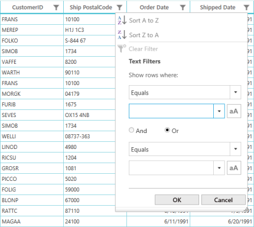

_DataGrid with CanGenerateUniqueItems property_

> _Note: You can bind written style to FilterPopupStyle where you need to apply style. It’s in SfDataGrid and also in each column._

### Programmatic Filtering

This section explains you how to perform filtering on data programmatically. Programmatic Filtering allows you to set a predicate that performs the filtering functionality. The SfDataGrid control allows you to filter programmatically in two ways:

* Through Column Filter
* Through View Predicate

#### Column Filtering

Column-level Filtering is achieved by adding filter predicates to the Grid Column. FilterPredicates is the property used to add the predicates to the column. The collection change of FilterPredicates applies the filter to the SfDataGrid control.

FilterPredicate has the following properties.

_FilterPredicate Property table_

<table>
<tr>
<td>
Property</td><td>
Type</td><td>
Descriptions</td></tr>
<tr>
<td>
FilterBehavior</td><td>
FilterBehavior</td><td>
Determines the filter behavior of the predicate.</td></tr>
<tr>
<td>
FilterType</td><td>
FilterType</td><td>
Determines the type of filter to be applied for the predicate.</td></tr>
<tr>
<td>
FilterValue</td><td>
Object</td><td>
Determines the filter value to be applied for the predicate.</td></tr>
<tr>
<td>
IsCaseSensitive</td><td>
Boolean</td><td>
Determines whether the predicate to be applied with the filter value is case sensitive or not.</td></tr>
<tr>
<td>
PredicateType</td><td>
PredicateType</td><td>
Determines the relations of multiple predicates and whether they are applied with OR / AND or not</td></tr>
</table>

#### Filter Behavior

* StringTyped: Records are filtered without considering the type and it takes all the types as string.
* StronglyTyped: Records are filtered according to the underlying type.

#### Filter Type

* Contains: Checks the records that contain the filter value.
* EndsWith: Checks the records that end with the filter value.
* Equals: Checks the records that are equal to the filter value.
* GreaterThan: Checks the records that are greater than the filter value.
* GreaterThanOrEqual: Checks the records that are greater than or equal to the filter value.
* LessThan: Checks the records that are lesser than the filter value. 
* LessThanOrEqual: Checks the records that are lesser than or equal to the filter value.
* NotEquals: Checks the records that are not equal to the filter value.
* StartsWith: Checks the records that start with the filter value.
* Between: Checks the records that have values between the filter values.

#### Predicate Type

* AND: Applies AND operator between the predicates.
* OR: Applies OR operator between the predicates. 

##### Examples

The following code example illustrates how the EmployeeId column is filtered for an employee with an employee ID as ‘4’. 



[C#]

// A custom filter method is assigned when you click the filter button.

void FilterBtn_Click(object sender, RoutedEventArgs e)

{ 

this.datagrid.Columns["EmployeeID"].FilterPredicates.Add(new FilterPredicate() {FilterType = FilterType.Equals, FilterValue = 1001,

PredicateType = PredicateType.Or });

}


The following screenshot displays the output when the filter is applied:

_Filtered EmployeeId column_

As an example of multi-column filtering, the following code example illustrates how to filter the data for employees whose titles are equal to Tool Designer or Marketing Manager and whose gender is male. 



[C#]

//A custom filter method is assigned when the filter button is clicked.

void FilterBtn_Click(object sender, RoutedEventArgs e)

{ 

      this.datagrid.Columns["Gender"].FilterPredicates.Add(new FilterPredicate() { FilterType = FilterType.Equals, FilterValue = "Male", PredicateType = PredicateType.And });

            this.datagrid.Columns["Title"].FilterPredicates.Add(new FilterPredicate() { FilterType = FilterType.Equals, FilterValue = "Tool Designer", PredicateType = PredicateType.Or });

            this.datagrid.Columns["Title"].FilterPredicates.Add(new FilterPredicate() { FilterType = FilterType.Equals, FilterValue = "Marketing Manager", PredicateType = PredicateType.Or });

}



The following screenshot displays the list of male employees with title as Marketing Manager or Tools designer. 

_DataGrid with filtered details of Employees_

#### Clear Filtering

The SfDataGrid control allows you to clear the Filter by clearing the filter predicates. This is achieved by invoking any one of the following methods:

* SfDataGrid.ClearFilters: Clears filters for all the columns.
* SfDataGrid.ClearFilter(String columnName): Clears the filter for that particular column that has the columnName as MappingName.
* SfDataGrid.ClearFilter(GridColumn column): Clears the filter for that particular column alone.

Filter predicates are cleared for a particular column by invoking the following method:

* GridColumn.ClearFilter: Clears the filter for the corresponding column.

#### View Filtering

SfDataGrid provides support to achieve view filtering by setting the SfDataGrid.View.Filter property. FilterRecords method filters the data that contains the filterText value. Assign FilterRecords method to SfDataGrid.View.Filter predicate to filter CustomerName column.



[C#]

public bool FilterRecords(object o)

{

    string filterText = this.filterBox.Text.ToString();

    var item = o as OrderInfo;

    if (item != null)

    {

        if (this.filterBox.Text.ToString() != string.Empty)

        {

            if (filterText.Contains(","))

            {

                 var ids = filterText.Split(',');

                 foreach (var idd in ids)

                 {

                     if (item.CustomerName.Contains(idd))

                         return true;

                 }

            }

            else

      {

     if (item.CustomerName.Contains(filterText))

                      return true;

            }

         }

     }

    return false;

}



The following code example demonstrates view-level filtering.



[C#]

// A custom filter method is assigned when the filter button is clicked.

void FilterBtn_Click(object sender, RoutedEventArgs e)

{

     this.datagrid.View.Filter = FilterRecords;

     this.datagrid.View.RefreshFilter();

}


The following screenshot displays the filtered records that contain the word “son”.

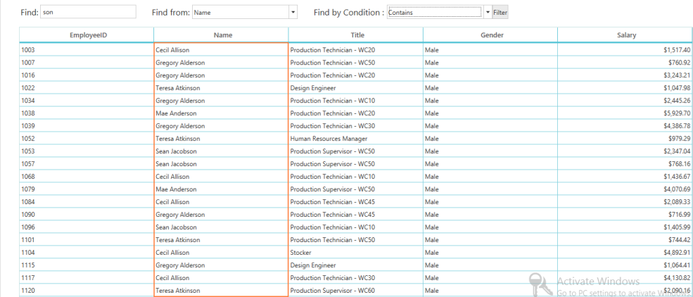

_DataGrid with filtered records that contain the word “son”_

> _Note: View.Filter is not applied when itemssource is DataTable._

### How To

#### How to change look and feel of FilterIcon when Filter is applied

You can edit the FilterToggleButton style in blend. You can see Filtered and UnFiltered VisualStates in it. You can change PathFillColor for FilterToggleButton. 

1. Create new project in Blend for VisualStudio 2013.
2. Add assemblies to project.
3. In assets category you can see SfDataGrid.
4. Drag that control and drop it to DesignView.
5. Then right-click on SfDataGrid that you dropped in Design view.
6. Select “Edit Additional Templates”.
7. Then select Edit HeaderStyle.
8. Now copy of GridHeaderCellControlstyle is created.
9. In Objects and Timeline panel, you can see the Template is created for GridHeaderCellControl.
10. Now expand to PART_FilterToggleButton.
11. Right-click on that select Edit a copy.
12. In code View, you can get a FilterToggleButton style.

You can add the following code example within Filtered Layer.



[XAML]

<ColorAnimation Duration="0:0:0:1"

                Storyboard.TargetName="PathFillColor"

                Storyboard.TargetProperty="Color"

                To="Red" />



Add the following code example within UnFiltered Layer.



[XAML]

<ColorAnimation Duration="0:0:0:1"

                Storyboard.TargetName="PathFillColor"

                Storyboard.TargetProperty="Color"

                To="Gray" />



Now bind this PathFillColor to PART_FilterToggleButtonIndicator.



[XAML]

<Path.Fill>

    <SolidColorBrush x:Name="PathFillColor" Color="Gray" />

</Path.Fill>



When you apply above style to FilterToggleButton, FilterIcon changes from Default to Gray and to Red when filtering is applied. When you clear it, it changes from Red to Gray and to default style.

#### How to improve filter Popup opening time

You can improve the filter pop-up opening time by setting CanGenerateUniqueItems property value to ‘False’. A textbox is loaded instead of AdvancedFilterComboBox that allows you to manually enter text for filtering. This increases GridFilterControl’s loading performance.



[XAML]



#### Disable Advanced filter options in GridFilterControl?

By setting the FilterMode property as CheckboxFilter in GridFilterControl style, you can disable the advanced filtering option. This loads the CheckboxFilter only in GridFilterControl.



[XAML] 



#### Apply filtering for particular column in code behind?

You can apply filtering for a particular column by setting filter predicates for a particular column. The EmployeeId column needs to be filtered for the employee whose employee ID is 4. This is illustrated in the following code example.



[C#]

// A custom filter method is assigned when you click the filter button.

void FilterBtn_Click(object sender, RoutedEventArgs e)

{ 

this.datagrid.Columns["EmployeeID"].FilterPredicates.Add(new FilterPredicate() {FilterType = FilterType.Equals, FilterValue = 1001,

PredicateType = PredicateType.Or });

}



#### How to Load the Text Filters for the column having Number or Date value as underlying type

When you use the Text Filters for the column that has number or date value as underlying type, you can set FilterBehavior property of the Grid Column as StringTyped. This loads the Text Filters instead of Number or Date Filters.



[XAML]

<syncfusion:GridNumericColumn FilterBehavior="StringTyped" MappingName="CustomerID" />



You can achieve this by using FilterItemsPopulating (in Event topic you can find about this event) event also. The following code example illustrates how to use this event.



[C#]

syncgrid.FilterItemsPopulating += syncgrid_FilterItemsPopulating;

…

void syncgrid_FilterItemsPopulating(object sender, GridFilterItemsPopulatingEventArgs e)

{

    if(e.Column.MappingName == "OrderID")

    e.FilterControl.AdvancedFilterType = AdvancedFilterType.TextFilter;

    e.FilterControl.SetColumnDataType(typeof(string));

    e.FilterControl.AscendingSortString = GridResourceWrapper.SortNumberAscending;

}


#### How to get the Filtered records list

You can get Filtered records from the view of SfDataGrid using FilterChanged event. SfDataGrid has view property that returns the collection. When filter is applied, the filtered records are available in this view. You need to wire this event. The following code example illustrates you how to get the filtered records.



[C#]

// To Hook Event

syncgrid.FilterChanged += syncgrid_FilterChanged;

…

void syncgrid_FilterChanged(object sender, GridFilterEventArgs e)

{

    //Orders Is Model Class For that You Need Record List

    ObservableCollection<Orders> order = new ObservableCollection<Orders>();

    var recordEntry = (sender as SfDataGrid).View.Records;

    foreach(RecordEntry record in recordEntry)

    {

         // You can Get Filtered Record List In Order Collection.

        order.Add(record.Data as Orders); 

    }            

}


## Editing

This section explains you about editing on data, events and properties that participates in editing. DataGrid is intended for both displaying and modifying the data from the data source. 

### Overview

When you set AllowEditing to ‘True’, you can edit the current cell in the DataGrid. In Edit Mode, you can commit the changes by pressing the Enter or Tab key, or by just clicking outside the current cell.  You can also revert back to its original value by pressing the ESC key.



[XAML]

<syncfusion:SfDataGrid x:Name="grid"

                       AllowEditing="True"

                       AutoGenerateColumns="False"

                       ColumnSizer="Star"

                       ItemsSource="{Binding OrdersListDetails}"

                       NavigationMode="Cell" />





[C#]

sfdatagrid.AllowEditing = true;


_DataGrid with AllowEditing set to ‘True’_

> _Note: It is mandatory to set the NavigationMode to Cell to enable current cell navigation and editing in the DataGrid control._

You are also allowed to control the behavior when the current cell is allowed to enter into Edit Mode by using the EditTriggers property. EditTriggers include the following two modes:

* OnTap - When EditTriggers is set as OnTap, the GridCell enters into Edit Mode when you single tap the application.
* OnDoubleTap - When EditTriggers is set as OnDoubleTap, the GridCell enters into Edit Mode when you double tap the application.

> _Note: You can switch between Edit Mode and View Mode by pressing the F2 key._

The DataGrid control also provides the following properties in Grid Columns to support editing.

_Editing property table_

<table>
<tr>
<td>
Property</td><td>
Type</td><td>
Description</td><td>
Default Value</td></tr>
<tr>
<td>
SfDataGrid.AllowEditing</td><td>
Boolean</td><td>
This property specifies whether the appication is editable or not.</td><td>
False</td></tr>
<tr>
<td>
SfDataGrid.AllowFocus</td><td>
Boolean</td><td>
Gets or sets a value indicating whether the Grid Cell is focusable or not.</td><td>
True</td></tr>
</table>

When SfDataGrid.AllowFocus is set to ‘false’, neither the current cell nor the selection is allowed for the GridColumn. The cells are not editable in the specified GridColumn, even when SfDataGrid.AllowEditing is set to ‘true’. In following code example AllowFocus is set to ‘false’ for OrderID column.



[XAML]

<Window x:Class="SimpleApplication.MainWindow"

        xmlns="http://schemas.microsoft.com/winfx/2006/xaml/presentation"

        xmlns:x="http://schemas.microsoft.com/winfx/2006/xaml"

        xmlns:local="clr-namespace:SimpleApplication"

        xmlns:syncfusion="http://schemas.syncfusion.com/wpf"

        Title="MainWindow"

        Width="525"

        Height="350">

    <Window.DataContext>

        <local:OrderInfoRepositiory />

    </Window.DataContext>

    <syncfusion:SfDataGrid x:Name="sfdatagrid"

                           AllowEditing="True"

                           AllowFiltering="True"

                           AutoGenerateColumns="True"

                           AutoGenerateColumnsMode="Reset"

                           ColumnSizer="Star"

                           ItemsSource="{Binding OrderInfoCollection}">

        <syncfusion:SfDataGrid.Columns>

            <syncfusion:GridTextColumn AllowFocus="False" MappingName="OrderID" />

        </syncfusion:SfDataGrid.Columns>

    </syncfusion:SfDataGrid>

</Window>


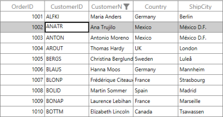

_DataGrid with AllowFocus property set to ‘false’_

When you select OrderID column’s cell, it is not selected or edited. Since AllowFocus is set to ‘false’.

### EditorSelectionBehavior

EditorSelectionBehavior is dependency property that is used to set selection for EditElement. It decides whether to select all content from UIElement or to move cursor to last position. Available values are

* SelectAll (Default)
* MoveLast.

The following code example illustrates the selection behavior while editing. 



[XAML]

<syncfusion:SfDataGrid x:Name="sfdatagrid"

                       AllowEditing="True"

                       AutoGenerateColumns="True"

                       ColumnSizer="Star"

                       EditorSelectionBehavior="MoveLast"

                       ItemsSource="{Binding OrderInfoCollection}"                                        

                       LiveDataUpdateMode="AllowDataShaping" />



The following screenshot illustrates the output.

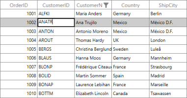

_DataGrid with Selection behavior while editing_

### Methods

Methods available under Editing are dependent on the current cell. DataGrid offers following public Methods in regard with Editing.

* SfDataGrid.SelectionController.BeginEdit: Causes the DataGrid to enter editing mode for the current cell, unless the DataGrid is already in editing mode.
* SfDataGrid.SelectionController.EndEdit: Causes the DataGrid to exit editing mode.

### Events

The edit events exist to support editing process. The following table provides the List of Events in regard to DataGrid for Editing. They occur when the current cell in the DataGrid is about to be edited or is being edited by you.

#### CurrentCellActivating Event

This event occurs when the current cell is activated in the DataGrid. The CurrentCellActivating event handler receives two arguments, namely sender that handles SfDataGrid and CurrentCellActivatingEventArgs as objects. The CurrentCellActivatingEventArgs object contains the following properties:

* Cancel: When this property is set to ‘true’, the event is cancelled and the current cell is not activated.
* CurrentRowColumnIndex: Gets the value of CurrentRowColumnIndex.
* PreviousRowColumnIndex: Gets the value of PreviousRowColumnIndex.
* ActivationTrigger: Gets the value of the current cell that is activated.

#### CurrentCellActivated Event

This event occurs when the current cell is activated. The event handler receives two arguments, namely sender that handles SfDataGrid and CurrentCellActivatedEventArgs as objects. The CurrentCellActivatedEventArgs object contains the following properties:

* CurrentRowColumnIndex: Gets the value of the CurrentRowColumnIndex.
* PreviousRowColumnIndex: Gets the value of the PreviousRowColumnIndex.
* ActivationTrigger: Gets the value of the current cell that is activated.

#### CurrentCellBeginEdit Event

This Event occurs when the current cell enters into Edit Mode. The Event Handler receives the two arguments namely sender that handles SfDataGrid and CurrentCellBeginEditEventArgs as objects. The CurrentCellBeginEditEventArgs object contains the following properties:

* Cancel: When set to ‘true’, the event is cancelled and the current cell does not enter into edit mode. 
* RowColumnIndex: Gets the current row column index of the DataGrid.
* Column: Gets the Grid Column of the DataGrid.

#### CurrentCellEndEdit Event

This event occurs when the current cell exits the Edit Mode. The event handler receives two arguments, namely sender that handles SfDataGrid and CurrentCellEndEditEventArgs as objects. A CurrentCellEndEditEventArgs object contains the following properties:

RowColumnIndex: Gets the value for the current row column index.

#### CurrentCellValueChanged Event

This event occurs whenever a value changes in GridColumns that supports editing such as GridTextColumn, GridNumericColumn, GridCurrencyColumn, GridPercentColumn, GridCheckBoxColumn, GridDateTimeColumn, GridTimeSpanColumn, GridMaskColumn, and so on. The event handler receives two arguments namely sender that handles SfDataGrid and CurrentCellValueChangedEventArgs as objects.

### The CurrentCellValueChangedEventArgs object contains the following property:

RowColumnIndex: Gets the value of the current RowColumnIndex.

#### CurrentCellDropDownSelectionChanged Event

This event occurs whenever a selected item is changed in DropDownColumns such as GridMultiColumnDropDownList and GridComboBoxColumn. The event handler receives two arguments namely sender that handles SfDataGrid and CurrentCellDropDownSelectionChangedEventArgs as objects.

The CurrentCellDropDownSelectionChangedEventArgs object contains the following properties:

* RowColumnIndex: Gets the value of the current RowColumnIndex.
* SelectedIndex: Gets the selected index from the DropDown control.
* SelectedItem: Gets the selected item from the DropDown control.

The following code example illustrates about this event.



[C#]

sfdatagrid.CurrentCellBeginEdit += sfdatagrid_CurrentCellBeginEdit;

…

void sfdatagrid_CurrentCellBeginEdit(object sender, CurrentCellBeginEditEventArgs args)

{

    args.Cancel = true;

}




[XAML]

<syncfusion:SfDataGrid x:Name="sfdatagrid"

                       AllowEditing="True"

                       AutoGenerateColumns="True"

                       AutoGenerateColumnsMode="Reset"

                       ColumnSizer="Star"

                       CurrentCellBeginEdit="sfdatagrid_CurrentCellBeginEdit"

                       ItemsSource="{Binding OrderInfoCollection}">

    <syncfusion:SfDataGrid.Columns>

        <syncfusion:GridTextColumn AllowFocus="False" MappingName="OrderID" />

    </syncfusion:SfDataGrid.Columns>

</syncfusion:SfDataGrid>


Other than core properties, methods and events participate in editing.SfDataGrid has some properties and supports an interface to describe update time, update mode, and row level updating.

* GridColumn.ValueBinding.
* GridColumn.UpdateTrigger
* SfDataGrid.LiveDataUpdateMode
* IEditableObject.

The data that you edit in loaded EditElement is the bound value from the ValueBinding property. The following code example illustrates how to use it.



[XAML]

<syncfusion:SfDataGrid x:Name="sfdatagrid"

                       AllowEditing="True"

                       AutoGenerateColumns="True"

                       AutoGenerateColumnsMode="Reset"

                       ColumnSizer="Star"

                       CurrentCellBeginEdit="sfdatagrid_CurrentCellBeginEdit"

                       ItemsSource="{Binding OrderInfoCollection}">

    <syncfusion:SfDataGrid.Columns>

        <syncfusion:GridTextColumn DisplayBinding="{Binding OrderID}" ValueBinding="{Binding CustomerID}" />

    </syncfusion:SfDataGrid.Columns>

</syncfusion:SfDataGrid>



The following screenshot illustrates the output. The OrderID is View Mode and CustomerID value is in EditMode.

_OrderID in View Mode and CustomerID value in Edit Mode_

You can update the edited values, like Default, PropertyChanged, LostFocus and Explicit. For more information about UpdateSourceTrigger you can [ClickHere](http://msdn.microsoft.com/en-us/library/system.windows.data.updatesourcetrigger(v=vs.110).aspx). In the following code example, whenever the value of CustomerID is changed instantly the underlying collection also changes. Since UpdateTrigger is given as PropertyChanged.



[XAML]

<syncfusion:SfDataGrid x:Name="sfdatagrid"

                       AllowEditing="True"

                       AutoGenerateColumns="True"

                       AutoGenerateColumnsMode="Reset"

                       ColumnSizer="Star"

                       CurrentCellBeginEdit="sfdatagrid_CurrentCellBeginEdit"

                       ItemsSource="{Binding OrderInfoCollection}">

    <syncfusion:SfDataGrid.Columns>

        <syncfusion:GridTextColumn ValueBinding="{Binding OrderID}" />

        <syncfusion:GridTextColumn MappingName="CustomerID" UpdateTrigger="PropertyChanged" />

    </syncfusion:SfDataGrid.Columns>

</syncfusion:SfDataGrid>



When you need an instant update that happened on DataSource to view, SfDataGrid provides a property LiveDataUpdateMode. AllowDataShaping is the one of enum value of LiveDataUpdateMode that is used to shape the data after editing. Add this code example and execute it.

1. Execute the code.
2. Sort any column.
3. Now edit the value to be sorted.

It gets arranged according to its sort direction.

The same way, you can achieve it for Editing with Grouping and Editing with Filtering.



[XAML]

<syncfusion:SfDataGrid x:Name="sfdatagrid"

                       AllowEditing="True"

                       AutoGenerateColumns="True"

                       ColumnSizer="Star"

                       ItemsSource="{Binding OrderInfoCollection}"                        

                       LiveDataUpdateMode="AllowDataShaping" />



### IEditableObject support

SfDataGrid supports to revert changes when you press Esc key at row level by implementing IEditableObject interface. The BeginEdit method stores the actual values before start edit. When you press Esc key, CancelEdit is called and it stores the old values to the corresponding filed. EndEdit method is called to commit the values.

For more information about IEditableObject you can [ClickHere](http://msdn.microsoft.com/en-us/library/system.componentmodel.ieditableobject(v=vs.110).aspx). The following code example illustrates how to override methods from IEditableObject interface. 



[C#]

public class NotificationObject : INotifyPropertyChanged

{

    public void RaisePropertyChanged(string propName)

    {

        if (this.PropertyChanged != null)

            this.PropertyChanged(this, new PropertyChangedEventArgs(propName));

    }

    public event PropertyChangedEventHandler PropertyChanged;

}

public class Employee : NotificationObject, IEditableObject

{    

    private string _Name;   

    private int _ContactID;    

    private int _EmployeeID;

    protected Dictionary<string, object> BackUp()

    {

        var dict = new Dictionary<string, object>();

        var itemProperties = this.GetType().GetTypeInfo().DeclaredProperties;

        foreach (var pDescriptor in itemProperties)

        {

            if (pDescriptor.CanWrite)

                dict.Add(pDescriptor.Name, pDescriptor.GetValue(this));

        }

        return dict;

    }

    public string Name

    {

        get { return this._Name; }

        set

        {

            this._Name = value;

            this.RaisePropertyChanged("Name");

        }

    }    

    public int ContactID

    {

        get { return this._ContactID; }

        set

        {

            this._ContactID = value;

            this.RaisePropertyChanged("ContactID");

        }

    }

    private int _EmployeeID;

    public int EmployeeID

    {

        get { return this._EmployeeID; }

        set

        {

            this._EmployeeID = value;

            this.RaisePropertyChanged("EmployeeID");

        }

    }

    private Dictionary<string, object> storedValues;

    public void BeginEdit()

    {

        this.storedValues = this.BackUp();

    }

    public void CancelEdit()

    {

        if (this.storedValues == null)

            return;

        foreach (var item in this.storedValues)

        {

            var itemProperties = this.GetType().GetTypeInfo().DeclaredProperties;

            var pDesc = itemProperties.FirstOrDefault(p => p.Name == item.Key);

            if (pDesc != null)

                pDesc.SetValue(this, item.Value);

        }

    }

    public void EndEdit()

    {

        if (this.storedValues != null)

        {

            this.storedValues.Clear();

            this.storedValues = null;

        }

    }

}


### How To

#### How to Programmatically Edit the Cell?

SfDataGrid allows you to edit the cell programmatically by calling BeginEdit() method. Initially you can set CurrentCell’s row and column index where you can make use of public structure of RowColumnIndex. 

Pass that created rowColumnIndex to MoveCurrentCell(RowColumnIndex rowColumnIndex) method. The method moves current cell to passed rowColumnIndex. You can call BeginEdit () method now to edit the cell in CurrentCellManager. 

The following code example illustrates that.



[C#]

sfdatagrid.Loaded += sfdatagrid_Loaded;

…

void sfdatagrid_Loaded(object sender, RoutedEventArgs e)

{

    RowColumnIndex rowColumnIndex = new RowColumnIndex();

    rowColumnIndex.ColumnIndex = 2;

    rowColumnIndex.RowIndex = 2;

    sfdatagrid.MoveCurrentCell(rowColumnIndex);

    sfdatagrid.SelectionController.CurrentCellManager.BeginEdit();

}



The same way, you can call EndEdit () method to stop edting a cell.



[C#]

void sfdatagrid_Loaded(object sender, RoutedEventArgs e)

{

    RowColumnIndex rowColumnIndex = new RowColumnIndex();

    rowColumnIndex.ColumnIndex = 2;

    rowColumnIndex.RowIndex = 2;

    sfdatagrid.MoveCurrentCell(rowColumnIndex);

    sfdatagrid.SelectionController.CurrentCellManager.EndEdit();

}



Both methods need current cell to starts or ends editing on cell.   

#### Cancel Editing in Cells

In some cases, you may not want a particular cell to enter into Edit mode. To achieve this, you have to cancel the CurrentCellBeginEdit event to cancel cell editing.  

Consider a example where you do not want the cell (2, 2) to enter into Edit mode. After handling the event, check for the RowColumnIndex and then cancel the event. This is illustrated in the following code example.



[XAML]

<syncfusion:SfDataGrid x:Name="syncgrid" AutoGenerateColumns="True"

AllowEditing="True" CurrentCellBeginEdit="syncgrid_CurrentCellBeginEdit"

ItemsSource="{Binding ProductDetails}"/>





[C#]

void syncgrid_CurrentCellBeginEdit(object sender, CurrentCellBeginEditEventArgs args)

{

//Cancels the editing for the RowColumnIndex (2,2).

if (args.RowColumnIndex == new RowColumnIndex(2,2))

args.Cancel = true;

}



##### Update Changes made in a DataGrid Column to other Columns

The changes made in a cell can also be reflected in other Grid cells. This special-case scenario is handled by using the EndEdit event. In the EndEdit event, the RowColumnIndex of the edited cell is used to compute values for other items in the GridColumns.

In this scenario, consider the properties for discount and price from the data source. Whenever you change the value of the discount in the GridColumn, the price for the item also changes. The following code example shows how to get the record from the CurrentCellIndex and compute the Price property.


[XAML]

<syncfusion:SfDataGrid x:Name="syncgrid"

                       AllowEditing="True"

                       AutoGenerateColumns="True"

                       CurrentCellEndEdit="syncgrid_CurrentCellEndEdit"

                       ItemsSource="{Binding ProductDetails}" />





[C#]

void syncgrid_CurrentCellEndEdit(object sender, CurrentCellEndEditEventArgs args)

{

var rowIndex = this.syncgrid.ResolveToRecordIndex(args.RowColumnIndex.RowIndex);

var record = (this.syncgrid.View.Records[rowIndex]).Data as ProductInfo;

//Check to see if you are editing the discount column.

if (args.RowColumnIndex.ColumnIndex == 4)

{

//Computes the price from the discount property.

if (record != null)

record.Price = record.Price - record.Discount;

}

}



#### How to change FontSize for Edit element?

This topic explains you how to change the FontSize for EditElement. TextBlock is loaded in non-edit mode and TextBox is loaded in edit mode as content to the GridCell.

You can achieve this by applying style directly to TextBox. By defining corresponding TextBoxstyle inside the SfDataGrid.Resources, you can show the same font while cell is in edit mode. The following code example illustrates this,



[XAML]

<syncfusion:SfDataGrid.Resources>

    

</syncfusion:SfDataGrid.Resources>


You can see that in edit mode the font size is changed compared to display mode UIElement.

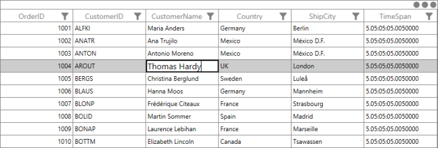

_Font size of Editing element changed_

## Data Validation

This section explains you to validate data on errors through different approaches like through events, DataAnnotations, IDataErrorInfo (INotifyDataErrorInfo).

### Overview

SfDataGrid provides a convenient way to validate data and indicate the errors along with its information. GridValidationMode is the dependency property that switches between the modes of validations. The validation modes are as follows:

* None: Disables the validations by Data Annotations and also by underlying Data implementations such as IDataErrorInfo or INotifyDataErrorInfo. By default, GridValidationMode is set to ‘None’.
* InView: Enables the validations and displays the error information in the corresponding cell. Also, you can shift the focus to other cells to view the error information.
* InEdit: Enables the validations and displays the error information in the corresponding cell. You cannot shift the focus to other row.

> _Note: GridColumn.GridValidationMode takes higher priority that its behavior overrides SfDataGrid behavior._

. The following are different approaches to validate errors on data.

* Validation through IDataErrorInfo and INotifyDataErrorInfo (4.5 Framework)
* Validation through Data Annotations
* Validation through Events
### Validation through IDataErrorInfo, INotifyDataErrorInfo

SfDataGrid provide supports Validation by implementing IDataErrorInfo and INotifyDataErrorInfo  interface in DataModel class. You can enable the Validation mode in two different ways using GridValidationMode to InView or InEdit mode.

The following code example illustrates how the Email field is validated for proper format by using Regex. An error message is displayed in the cell when the validation fails.



[C#]

public class UserInfo : IDataErrorInfo

 {

   public string EMail

    {

            get { return email; }

            set { email = value; OnPropertyChanged("EMail"); }

     }

   public string this[string columnName]

   {

     get

     {

        if (columnName == "EMail")

        {

            return !emailRegex.IsMatch(this.EMail) ? "E-  Mail Id is in InValid format!" : null;

        }

        return null;

      }

  }

}




[C#]

public class UserInfo : INotifyDataErrorInfo

{

public System.Collections.IEnumerable GetErrors(string propertyName)

{

      if (propertyName == "EMail")

      {

          if (!emailRegex.IsMatch(this.EMail))

          {

               List<string> errorList = new List<string>();

               errorList.Add("E-Mail Id is in InValid format!");

               return errorList;

          }

      }

      return null;

}

}


_DataGrid with Email field validation_

> _Note: GridTemplateColumn and GridUnboundColumn do not support the GridValidationMode in ‘InEdit’ mode._

### Validation through Data Annotations

Once the UI interactive validations are successful, the Data layer validates the corresponding values for the members that specify validation rules. You can use two different modes in Validation like ‘InView’ or ‘InEdit’. System.ComponentModel.DataAnnotations assembly is added to the reference to use DataAnnotations.

> _Note: GridTemplateColumn and GridUnboundColumn do not support the GridValidationMode in ‘InEdit’ mode._

#### Some of the commonly used ValidationAttributes are as follows:

* StringLengthAttribute: Specifies the maximum and minimum number of characters that are allowed for an entity member.
* RequiredAttribute: Specifies that a value is provided for a property.
* RangeAttribute: Designates the minimum and maximum constraints for the associated member.
* RegularExpressionAttribute: Designates a regular expression used for validation of the associated member.
* CustomValidationAttribute: Designates a customized method to execute and to validate the entity member.

The following code example illustrates how the String Length attribute is applied to the Name field, by setting the maximum value for the length of the Name to 10.



[C#]

[StringLength(10)]

public string Name

{

    get { return name; }

    set { name = value; OnPropertyChanged("Name"); }

}



The following screenshot displays the output.

_DataGrid with Validation through Data Annotations_

### Validation through Events

SfDataGrid offers Validation through events when a cell moves into Edit mode and its focus is lost. Validation is done through the following events:

* Cell Validation
* Row Validation

#### Cell Validation

In CellValidation, two events are raised when focus goes away from the cell in the DataGrid. The following events are associated with CellValidation in the DataGrid control:

* SfDataGrid.CurrentCellValidating: Occurs when save changed value of a cell by shifting the focus away from the cell and by clicking another cell in the same row as the edited cell or by navigating away from the cell.
* SfDataGrid.CurrentCellValidated: Occurs after CurrentCellValidating event. This event is not raised when IsValid property of the CurrentCellValidating event is set to ‘false’.

#### CurrentCellValidating Event

The event handler of the CurrentCellValidating Event receives two arguments namely sender that handles SfDataGrid and CurrentCellValidatingEventArgs as objects. CurrentCellValidatingEventArgs object contains the following properties:

* IsValid: When this property is set to ‘false’, the changed value is not saved to the underlying source, and the CurrentCellValidated event is not raised.
* NewValue: Gets the new value from the edited cell in the DataGrid.
* OldValue: Gets the old value from the edited cell in the DataGrid.
* Column: Gets the Grid Column of the DataGrid.
* ErrorMessage: Gets or sets the error message to notify about the error. By default, this error message is displayed as an Error ToolTip.
* RowData: Gets the edited row data.

When IsValid property is set to ‘false’, the editor of the current cell does not shift to focus. When you navigate away from the cell (within the same row), the navigation is handled, and it remains focused in the current cell.

#### CurrentCellValidated Event

This event is raised when the current cell is validated with the new value and the IsValid property of the CurrentCellValidating event is set to ‘true’. The event handler receives two arguments namely sender that handles SfDataGrid and CurrentCellValidatedEventArgs as objects. CurrentCellValidatedEventArgs object contains the following properties:

* NewValue: Gets the new value from the edited cell in the DataGrid.
* OldValue: Gets the old value from the edited cell in the DataGrid.
* Column: Gets the Grid Column of the DataGrid.
* ErrorMessage: Gets the error message to notify about the error.
* RowData: Gets the edited row data.

The following code example illustrates a simple condition to handle Cell Validation. In this example, the Discount field does not exceed 40 percent, but when it does, an error message is displayed and the focus is not allowed to move anywhere.



[C#]

private void sfGrid_CurrentCellValidating(object sender, Syncfusion.UI.Xaml.Grid.CurrentCellValidatingEventArgs args)

{

    if (args.Column.MappingName == "Discount" && Convert.ToDouble(args.NewValue) > 40)

    {

         args.ErrorMessage = "Discount should not be more than 40%";

         args.IsValid = false;

    }

}


The following screenshot displays the output.

_DataGrid with Cell Validation_

#### Row Validation

In SfDataGridRowValidation, two events are raised when you edit a cell in a row, and then you can move the focus from the edited row. The following events are associated with Row Validation in the DataGrid control:

* SfDataGrid.RowValidating: Occurs when you save the changed value of a cell by shifting the focus away from the cell and by clicking another cell in a different row or by navigating away from the cell (navigation within the row is allowed).
* SfDataGrid.RowValidated: Occurs after the RowValidating event. This event is not raised when IsValid property of the RowValidating event is set to ‘false’.

#### RowValidating Event

The event handler receives two arguments namely sender that handles SfDataGrid and RowValidatingEventArgs as objects. RowValidatingEventArgs object contains the following properties:

* IsValid: When this property is set to ‘false’, the changed value is not saved to the underlying source, and the RowValidated event is not raised.
* ErrorMessages: It is a dictionary of strings that holds the Column Name as its key and the error message as its value. This error message notifies you about the error. By default, this error message is displayed as an ErrorToolTip.
* RowData: Gets the edited row data
* RowIndex: Gets the row index.

When the IsValid property is set to ‘false’, the editor of the current cell does not shift to focus. When you navigate away from the cell (outside the current row) that is in edit mode, the navigation is handled within the current row alone.

#### RowValidated Event

This event is raised when the row is validated with the updated source, and the Row Validating event’s IsValid is set to ‘true’. The event handler receives two arguments namely sender that handles SfDataGrid and RowValidatedEventArgs as objects.

RowValidatedEventArgs object contains the following properties.

* ErrorMessages: Gets the error message to notify you about the error. 
* RowData: Gets the edited row data
* RowIndiex: Gets the row index.

The following code example illustrates a simple condition to handle Row Validation. In this example, the sum of Expense and Freight is a minimum of 3000, where this is eligible for the discounted price.



[C#]

private void sfGrid_RowValidating(object sender, Syncfusion.UI.Xaml.Grid.RowValidatingEventArgs args)

{

     var data = args.RowData as OrderInfo;

     if ((data.Expense + data.Freight) < 3000)

     {

          args.ErrorMessages.Add("Expense", "Sum of Expense and Freight should have atleast 3000, which is eligible for Discount!");

          args.IsValid = false;

     }

}


The following screenshot illustrates the output.

_DataGrid with Row Validation_

### How To

#### How to change the Validation error template?

You can customize the Validation tooltip or its icon by writing style or edit the GridCellTemplate in blend.

The following steps take you though Cutomization on Validation error template.

1. Open your project that contains SfDataGrid control in Blend for Visual Studio 2013.
2. You can find your SfDataGrid in “Objects and TimeLine” panel.
3. You can right-click on that.
4. Select “Edit Additional Templates”.
5. Select “Edit CellStyle”.
6. In code view you can get style for GridCell. There you can find “PART_InValidCellBorder”.
7. You can change that path to customize your error Icon.
8. Add the following code example within your resources for customizing Error Tooltip template.



[XAML]

<ControlTemplate x:Key="ValidationToolTipTemplate">

    <Grid x:Name="Root"

          Margin="5,0"

          Opacity="0"

          RenderTransformOrigin="0,0">

        <Grid.RenderTransform>

            <TranslateTransform x:Name="xform" X="-25" />

        </Grid.RenderTransform>

        <VisualStateManager.VisualStateGroups>

            <VisualStateGroup Name="OpenStates">

                <VisualStateGroup.Transitions>

                    <VisualTransition GeneratedDuration="0" />

                    <VisualTransition GeneratedDuration="0:0:0.2" To="Open">

                        <Storyboard>

                            <DoubleAnimation Duration="0:0:0.2"

                                             Storyboard.TargetName="xform"

                                             Storyboard.TargetProperty="X"

                                             To="0">

                                <DoubleAnimation.EasingFunction>

                                    <BackEase Amplitude=".3" EasingMode="EaseOut" />

                                </DoubleAnimation.EasingFunction>

                            </DoubleAnimation>

                            <DoubleAnimation Duration="0:0:0.2"

                                             Storyboard.TargetName="Root"

                                             Storyboard.TargetProperty="Opacity"

                                             To="1" />

                        </Storyboard>

                    </VisualTransition>

                </VisualStateGroup.Transitions>

                <VisualState x:Name="Closed">

                    <Storyboard>

                        <DoubleAnimation Duration="0"

                                         Storyboard.TargetName="Root"

                                         Storyboard.TargetProperty="Opacity"

                                         To="0" />

                    </Storyboard>

                </VisualState>

                <VisualState x:Name="Open">

                    <Storyboard>

                        <DoubleAnimation Duration="0"

                                         Storyboard.TargetName="xform"

                                         Storyboard.TargetProperty="X"

                                         To="0" />

                        <DoubleAnimation Duration="0"

                                         Storyboard.TargetName="Root"

                                         Storyboard.TargetProperty="Opacity"

                                         To="1" />

                    </Storyboard>

                </VisualState>

            </VisualStateGroup>

        </VisualStateManager.VisualStateGroups>

        <Border Margin="4,4,-4,-4"

                Background="#052A2E31"

                CornerRadius="5" />

        <Border Margin="3,3,-3,-3"

                Background="#152A2E31"

                CornerRadius="4" />

        <Border Margin="2,2,-2,-2"

                Background="#252A2E31"

                CornerRadius="3" />

        <Border Margin="1,1,-1,-1"

                Background="#352A2E31"

                CornerRadius="2" />

        <Border Background="#FFDC000C" CornerRadius="2" />

        <Border CornerRadius="2">

            <TextBlock MaxWidth="250"

                       Margin="8,4,8,4"

                       Foreground="White"

                       Text="{TemplateBinding Tag}"

                       TextWrapping="Wrap"

                       UseLayoutRounding="false" />

        </Border>

    </Grid>

</ControlTemplate>



You can change above ControlTemplate codes to change the tooltip style. You can find your GridCell style here.



[XAML]



By changing that highlighted path, you can make your own icon. 

The following screenshot displays the output.

_DataGrid with Changed Validation error template_

## Data Manipulation

This section explains you about management of data. The operations like insert, delete and modifying data are explained here. SfDataGrid not only displays recordsin tabular view but has an interactive support to manage data also. 

### Overview

DataGrid control handles data updating with the help of INotifyPropertyChanged interface. By default, DataGrid does not update the sorting order, filtering, grouping and summaries.

* SfDataGrid.LiveDataUpdateMode: This property helps you to define the behavior of DataGrid during data updating.

SfDataGrid.LiveDataUpdateMode: This enum type (LiveDataUpdationMode) property contains the following three modes:

_LiveDataUpdationMode property table_

<table>
<tr>
<td>
LiveDataUpdationMode</td><td>
Description</td></tr>
<tr>
<td>
Default</td><td>
This updates only the corresponding cell value when the property is changed.</td></tr>
<tr>
<td>
AllowSummaryUpdate</td><td>
This updates the corresponding cell value and summaries when the property is changed.</td></tr>
<tr>
<td>
AllowDataShaping</td><td>
This updates corresponding cell value and summary. Also it reshapes the data based on sorting, filtering, grouping, summaries when the property is changed.</td></tr>
</table>

The following code example illustrates how to set the LiveDataUpdateMode for DataGrid control.

When you need an instant update that happened on DataSource to view, SfDataGrid provides a property LiveDataUpdateMode. You can use AllowDataShaping in LiveDataUpdateMode that updates instantly while editing. Add this code example and execute the sample.

1. Execute the Sample.
2. Sort any column.
3. Now edit the value to be sorted.
4. It gets arranged according to its sort direction.
5. The same way, you can achieve it for Editing with Grouping and Editing with Filtering.



[XAML]

<syncfusion:SfDataGrid x:Name="sfdatagrid"

                       AllowEditing="True"

                       AutoGenerateColumns="True"

                       ColumnSizer="Star"

                       ItemsSource="{Binding OrderInfoCollection}"                       

                       LiveDataUpdateMode="AllowDataShaping" />



Following screenshot illustrates the difference between AllowDataShaping and Default. When LiveDataUpdateMode is in Default, the value that you edited does not get sorted immediately. The highlighted one is edited cell. 

_LiveDataUpdateMode set to Default_

When you set LiveDataUpdateMode as AllowDataShapping, it gets updated and arranged in order immediately. 

_LiveDataUpdateMode set as AllowDataShapping_

### AddNewRow

This topic provides the description for AddNewRow feature in the DataGrid control that enables you to add new data rows in the DataGrid using the UI.

#### Overview 

AddNewRow enables adding rows to enter new records in the DataGrid control. The new row is displayed, above, or below the rows in the DataGrid control. You can specify the AddNewRow position by using DataGrid’sSfDataGrid.AddNewRowPosition property.When using AddNewRow, DataModel has one ParameterlessConstructor (DefaultContructor).

#### Adding AddNewRow to the DataGrid control

The following code example illustrates how to add AddNewRow to an application:



[XAML]

   <syncfusion:SfDataGrid x:Name="datagrid"

                          AutoGenerateColumns="True"  

                          AddNewRowPosition="Top"                                 

                          ItemsSource="{Binding Stocks}"/>



#### User Interface

_Adding AddNewRow to the DataGrid control_

The following table describes the property that participates in AddNewRow.

_AddNewRow property table_

<table>
<tr>
<td>
Property</td><td>
Description</td></tr>
<tr>
<td>
AddNewRowPosition</td><td>
This is the Enum property that helps to get or set the AddNewRow position in DataGrid. AddNewRowPositionenum property contains following values: 1. Top – Place the AddNewRow at the top of all data rows. 2. Bottom – Place the AddNewRow at the bottom of all the data rows.  3. None – This hides the AddNewRow in the DataGrid control.</td>
</table>

</td></tr>
</table>

> _Note: By default AddNewRowPosition is set as “None”._
The following table describes you the event that participates in AddNewRow.

_AddNewRow Event Table_

<table>
<tr>
<td>
Event</td><td>
Parameters</td><td>
Description</td></tr>
<tr>
<td>
AddNewRowIntiating</td><td>
NewObject</td><td>
This event is triggered when you start editing in AddNewRow.NewObject – This contains the newly created object that helps to set the default value when you start editing in AddNewRow.>  </td></tr>
</table>
> _Note: NewObject is the read-only property._

#### Behavior

1. New data is added when AddNewRow is no longer in focus and the data is valid.
2. You can cancel the new row by pressing ESC twice.
3. By default, new data is added in last. When LiveUpdateMode is set as AllowDataShapping, new data is added based on the sorted data position

#### Limitations

1. AddNewRow only exists for master grid in the Master-Details view.

The following code example illustrates how to use AddNewRowInitiating event.



[XAML]

AddNewRowInitiating="SfDataGrid_AddNewRowInitiating"





[C#]

sfdatagrid.AddNewRowInitiating += sfdatagrid_AddNewRowInitiating;

…

void sfdatagrid_AddNewRowInitiating(object sender, Syncfusion.UI.Xaml.Grid.AddNewRowInitiatingEventArgs args)

{

       // Initialze with default value.     

}


### Deleting

This section explains you how to delete the records, properties and an event that participates in deleting process. 

####  Overview

SfDataGrid has built-in support for deleting records. You can delete a selected row by pressing the Delete key when SfDataGrid.AllowDeleting is set to ‘True’. When multiple records are to be removed from the Grid, you can select multiple records from the SfDataGrid and press Delete.



[XAML]

<syncfusion:SfDataGrid AllowDeleting="True"        

                       AutoGenerateColumns="True"

                       ItemsSource="{Binding OrdersListDetails}"/>



Deleting rows triggers the following events in SfDataGrid before and after records are removed:

* SfDataGrid.RecordDeleting: Occurs before the records are removed from the collection. This event is cancelled.
* SfDataGrid.RecordDeleted: Occurs after the records are removed from the collection.

#### RecordDeleting Event

This event occurs after you press Delete but before the records are removed from the collection. The RecordDeleting event handler receives two arguments namely sender that handles SfDataGrid and RecordDeletingEventArgs as objects.

The RecordDeletingEventArgs has the following properties:

* Cancel: When the Cancel property is set to ‘true’, the event is cancelled and the records are not removed. 
* OriginalSender: Gets the original sender from where the event is raised.
* Items: Gets or sets the items to be removed from the source collection.

#### RecordDeleted Event:

This event occurs after the selected rows are removed from the SfDataGrid. The RecordDeleted event handler receives two arguments namely sender that handles the SfDataGrid and RecordDeletedEventArgs as objects.

The RecordDeletedEventArgs has the following properties:

* Items: Gets the records that are removed from the source collection.
* SelectedIndex: Gets or sets the selected index for the DataGrid control.

The following code example illustrates how to use this event. 



[C#]

sfdatagrid.RecordDeleting += sfdatagrid_RecordDeleting;

…

void sfdatagrid_RecordDeleting(object sender, RecordDeletingEventArgs args)

{

    args.Cancel = true;

}



You can delete record using Remove() or RemoveAt (int index) in underlying collection. The following code example illustrates that.



[C#]

private void Delete_Click(object sender, RoutedEventArgs e)

{

    (sfdatagrid.DataContext as OrderInfoRepositiory).OrderInfoCollection.Remove(sfdatagrid.CurrentItem as OrderInfo);

        // OR

    (sfdatagrid.DataContext as OrderInfoRepositiory).OrderInfoCollection.RemoveAt(2);

}



Current item is currently selected record (that has selection border). When you want to use first method, you can select record and delete operation. 

### How To

#### How to change the AddNewRow watermark text

DataGrid control enables you to change the AddNewRowwatermarktext by changing the Localization settings. By changing the AddNewRowText value in the Resource settings, you can change the AddNewRowwatermarktext.

In your WPF application, when you have resource file already (.resx) then you can add AddNewRowText and its value as your requirement and give a comment value. When you do not have it, then create new folder with name of Resources.

1. Now Add > Add New Item. 
2. Expand General node. 
3. You can see that Resource file is available. 
4. Enter__Syncfusion.SfGrid.WPF in name text box.
5. Choose Add.
6. Resource file is added to your project in Resources folder.
7. Add AddNewRowText in resource file.

The following screenshot illustrates this:

_Changing AddNewRow watermark text_

The following screenshot displays the output.

_DataGrid with changed AddNewRow watermark text_

> _Note: The resource file is hosted in Resources folder and sholud have name with Syncfusion.SfGrid.WPF.resx. Otherwise your changes are not taken into consideration._

#### How to customize the AddNewRow watermark text wrapper

Customize the appearance of the AddNewRowwatermarktext by editing the AddNewRowControl style. The following code example illustrates how to apply a custom background and foreground for the AddNewRowwatermark wrapper:



[XAML]



You can add above code example to App.Xaml or in Windows.Resources. The following screenshot illustrate the output.

_DataGrid with customized AddNewRow watermark text wrapper_

#### How to validate AddNewRow

SfDataGrid control provides extensive support to use validation with AddNewRow. To validate the data in AddNewRow, you can use the Attributevalidation, Data validation using INotifyDataErrorInfo, or Custom validation using the RowValidating event. The following code example illustrates custom row validation with AddNewRow:



[C#]

void OnRowValidating(object sender, RowValidatingEventArgs args)

{

if (dataGrid.IsAddNewIndex(args.RowIndex))

{

var data = args.RowData as OrderInfo;

if (data.Freight > 500)

{

args.IsValid = false;

args.ErrorMessages.Add("Freight", "Freight should not exceed 500.");

}

}

}


The following screenshot illustrate the output.

_Custom row validation with AddNewRow_

> _Note: DataGrid adds the new data to the data source only when the data is valid._

#### How to handle AddNewRow for complex properties 

When you start editing in AddNewRow, the DataGrid control creates an instance for a data object. When the data object contains complex properties, they do not initiate with the data object. Therefore, you need to initiate the complex property externally; otherwise the edited value is not committed in the cell. This requirement is achieved by using the AddNewRowInitiating event. The following code example illustrates this:



[XAML]

<syncfusion:SfDataGrid x:Name="dataGrid"

AddNewRowInitiating="OnAddNewRowInitiating"

AddNewRowPosition="Top"

AllowEditing="True"

ItemsSource="{Binding Path=OrdersDetails}">

<syncfusion:SfDataGrid.Columns>

<syncfusion:GridTextColumn MappingName="OrderID" />

<syncfusion:GridTextColumn MappingName="CustomerID" />

<syncfusion:GridTextColumn MappingName="ShippingDate" />

<syncfusion:GridTextColumn MappingName="EmployeeDetails.EmployeeID" />

<syncfusion:GridTextColumn MappingName="ShipCity" />

<syncfusion:GridTextColumn MappingName="ShipCountry" />

<syncfusion:GridTextColumn MappingName="Freight" />

<syncfusion:GridTextColumn MappingName="IsClosed" />

</syncfusion:SfDataGrid.Columns>

</syncfusion:SfDataGrid>





[C#]

private void OnAddNewRowInitiating(object sender, AddNewRowInitiatingEventArgs args)

{

      var data = args.NewObject as OrderInfo;

data.EmployeeDetails = new Employees();

}


#### How to Initialize the AddNewRow with Default Values

This topic explains you how to initialize the default values. You can achieve this requirement using AddNewRowInitiating event. 



[C#]

private void SfDataGrid_AddNewRowInitiating(object sender, Syncfusion.UI.Xaml.Grid.AddNewRowInitiatingEventArgs args)

{

    var data = args.NewObject as OrderInfo;

    data.OrderID = 10012;

    data.CustomerID = "JACK";

    data.IsClosed = true;

    data.OrderDate = System.DateTime.Now;

    data.Freight = 12.0;

    data.Discount = 10.0;    

    data.ContactNumber = "043742";

    data.DeliveryDelay = TimeSpan.Zero;    

    data.ProductName = "Mobile";

    data.Quantity = 2;

    data.UnitPrice = 2;

}


When you click AddNewRow button, row is loaded with this data.

#### Handle selection after items are removed from the grid

This article shows how to select a specified row after deleting. By default, when you delete a record from the Grid, the selection maintains the same position it is in. However, this behavior is overridden by handling the RecordDeleted Event. The following code example illustrates this:



[C#]

sfDataGrid.RecordDeleted += OnRecordDeleted;

…

private void OnRecordDeleted(object sender, RecordDeletedEventArgs args)

{

     args.SelectedIndex = -1;

}


The previous code example resets the selection after every deletion.

#### Remove specific records from the SfDataGrid control when you select multiple records and press the Delete key

This section explains you how to remove specific records from SfDataGrid when you select multiple records from the Grid and press Delete.

The RecordDeletingEventArgs argument in the RecordDeleting event holds the Items property that stores the list of records to be deleted from the source collection. By using the Items property, it is easy to revise the items that are removed from the source. The following code example illustrates this: 



[C#]

sfDataGrid.RecordDeleting += OnRecordDeleting;

…

private void OnRecordDeleting(object sender, RecordDeletingEventArgs args)

{

    if(args.Items.Count>1)

         args.Items.RemoveRange(1, args.Items.Count-1);

}


In the above code example, items are removed from the source. In this case, items are removed from the list of selected items.

## Selection

This Section explains you about selection behavior, properties, and events that participate in Selection and how to customize the selection controller. SfDataGrid supports two type of Selection behavior.

* Row Selection
* Cell Selection

### Row Selection

The DataGrid control provides an interactive support to select a specific row or group of rows programmatically or by Mouse and Keyboard interactions. To enable this Selection in DataGrid, you can set SfDataGrid.SelectionUnit property to Row. 

### Cell Selection

The DataGrid control provides interactive support to select a specific cell or group of cells programmatically or by Mouse and Keyboard interactions. To enable this Selection in DataGrid, you can set SfDataGrid.SelectionUnit property to Cell or Any and the SfDataGrid.NavigationMode should be Cell. In Any, you can select all cells in particular row by clicking on RowHeader.

> _Note: HeaderRows and TableSummaryRows do not have support for selection._

### Properties

SfDataGrid control provides the following properties for Selection.

_Selection properties table_

<table>
<tr>
<td>
Property Name</td><td>
Type</td><td>
Description</td></tr>
<tr>
<td>
SelectionUnit</td><td>
GridSelectionUnit</td><td>
Gets or sets a value indicating the type of selection in DataGrid control. Different types are Cell, Row and Any.</td></tr>
<tr>
<td>
SelectionController</td><td>
IGridSelectionController</td><td>
Gets or sets the selection controller to handle the selection operations. It is initialized based on SelectionUnit value.</td></tr>
<tr>
<td>
SelectionMode</td><td>
GridSelectionMode</td><td>
Gets or sets the selection behavior in DataGrid control. Different modes are Single, Multiple, Extended and None.</td></tr>
<tr>
<td>
NavigationMode</td><td>
NaviagtionMode</td><td>
Gets or sets the navigation behavior between rows or cells in DataGrid control. </td></tr>
<tr>
<td>
AutoScroller.IsEnabled</td><td>
Boolean</td><td>
Gets or sets the value indicating whether the AutoScroller is enabled or not. </td></tr>
<tr>
<td>
AllowSelectionOnPointerPressed</td><td>
Boolean</td><td>
Allows selection during PointerPressed event. By default, selection occurs during PointerReleased event.</td></tr>
<tr>
<td>
SelectedItem</td><td>
object</td><td>
Gets or sets the record of selected row.  When you have multiple selections in DataGrid control, then SfDataGrid.SelectedItem returns the record of initially selected row. This is maintained only in Row selection.</td></tr>
<tr>
<td>
CurrentItem</td><td>
object</td><td>
Gets or sets the record of current row. When you have multiple selections in DataGrid control, then SfDataGrid.CurrentItem returns the record of current row.</td></tr>
<tr>
<td>
SelectedItems</td><td>
ObservableCollection&lt;object&gt;</td><td>
Gets the collection of selected records. DataGrid control also allows you to manipulate this collection. This is maintained only in Row selection.</td></tr>
<tr>
<td>
CurrentCellInfo</td><td>
GridCellInfo</td><td>
Gets the GridCellInfo of a current cell. GridCellInfo contains the record of current row and column of the current cell. This is maintained only in Cell selection.</td></tr>
<tr>
<td>
CurrentColumn</td><td>
GridColumn</td><td>
Gets the GridColumn of a current cell.</td></tr>
<tr>
<td>
RowSelectionBrush</td><td>
Brush</td><td>
Gets or sets the brush value for selection background in Data Row.</td></tr>
<tr>
<td>
GroupRowSelectionBrush</td><td>
Brush</td><td>
Gets or sets the brush value for selection background in Group caption Row.</td></tr>
<tr>
<td>
CurrentCellBorderBrush</td><td>
Brush</td><td>
Gets or sets the Border color of the current cell when NavigationMode is in Cell.</td></tr>
<tr>
<td>
CurrentCellBorderThickness</td><td>
Thickness</td><td>
Gets or sets the Border width of Current cell when NavigationMode is in Cell</td></tr>
</table>

> _Note: In WPF, MouseDown event is triggered after releasing the finger from touch. Hence AllowSelectionOnPointerPressed API only works for mouse in WPF._

### Methods

DataGrid control supports the following public methods for selection:

* SelectAll – Selects all the rows or cells in the Grid. This method does not make any changes when the selection mode is set to Single or None_._

The following code example illustrates how to call SelectAll () method.



[C#]

private void SelectAll_Click(object sender, RoutedEventArgs e)

{

    sfdatagrid.SelectionMode = GridSelectionMode.Multiple;

    sfdatagrid.SelectAll();

}


When you click on button that contains above code example, all the rows or cells are selected as displayed in the following screenshot.

_DataGrid with SelectAll () method_

* ClearSelections – Clears all selection in Grid.

The following code example illustrates how to use ClearSelections(bool exceptCurrentRow). When exceptCurrentRow is set to true, the current row is not cleared; otherwise, all the selections are cleared.



[C#]

private void ClearSelection_Click(object sender, RoutedEventArgs e)

{

    sfdatagrid.ClearSelections(true);

}



* MoveCurrentCell – Moves the current cell to corresponding row column index. This method works only when NavigationMode is set to Cell.

The following code example explains you how to use MoveCurrentCell (RowColumnIndexrowColumnIndex). To use RowColumnIndex structure, add Syncfusion.UI.Xaml.ScrollAxis reference.



[C#]

private void MoveCurrentCell_Click(object sender, RoutedEventArgs e)

{

    RowColumnIndex rowColumnIndex = new RowColumnIndex();

    rowColumnIndex.ColumnIndex =2;

    rowColumnIndex.RowIndex = 2;

    sfdatagrid.MoveCurrentCell(rowColumnIndex);

}



The current cell is moved to third column (‘0’ based index), second row in screenshot.

_DataGrid with MoveCurrentCell method_

* ScrollInView – You can scroll the view to a particular record using ScrollInView (RowColumnIndex rowColumnIndex) method where you can view the record that is not in view also.



[C#]

sfdatagrid.ScrollInView(new RowColumnIndex() { RowIndex = sfdatagrid.ResolveToRowIndex(7), ColumnIndex = 1 });



* SelectRows – You can select a range of rows programmatically by using SelectRows method. This method effects only in Row selection and the SelectionMode should be Multiple or Extended.

The following code example illustrates how to use SelectRows(int startRowIndex, int endRowIndex).



[C#]

private void SelectRows_Click(object sender, RoutedEventArgs e)

{

    int rowIndex = this.sfdatagrid.SelectionController.CurrentCellManager.CurrentRowColumnIndex.RowIndex;

    this.sfdatagrid.SelectRows(rowIndex, rowIndex + 4);

}



* SelectCell – You can select a specific cell programmatically by using SelectCell method. This method effects only in Cell selection.

The following code example shows how to use SelectCell(object rowData, GridColumn column) mehtod.



[C#]

private void SelectCell_Click(object sender, RoutedEventArgs e)

{

    OrderInfoViewModel viewModel = this.sfdatagrid.DataContext as OrderInfoViewModel;

    this.sfdatagrid.SelectCell(viewModel.OrdersListDetails[3], this.sfdatagrid.Columns["CustomerID"]);

}



* SelectCells– You can select a range of cells programmatically by using SelectCells method. This method effects only in Cell selection and the SelectionMode should be Multiple or Extended.

The following code example shows how to use SelectCells(object startRowData, GridColumn startColumn, object endRowData, GridColumn endColumn) method.



[C#]

private void SelectCells_Click(object sender, RoutedEventArgs e)

{

    OrderInfoViewModel viewModel = this.sfdatagrid.DataContext as OrderInfoViewModel;

    object startRowData = viewModel.OrdersListDetails[3];

    object endRowData = viewModel.OrdersListDetails[6];

    GridColumn startColumn = this.sfdatagrid.Columns["CustomerID"];

    GridColumn endColumn = this.sfdatagrid.Columns["ShipCountry"];

    this.sfdatagrid.SelectCells(startRowData, startColumn, endRowData, endColumn);

}


* UnSelectCell – You can remove the selection from a specific cell programmatically by using UnSelectCell method. This method effects only in Cell selection.

The following code example shows how to use UnSelectCell(object rowData, GridColumn column) mehtod.



[C#]

private void UnSelectCell_Click(object sender, RoutedEventArgs e)

{

    OrderInfoViewModel viewModel = this.sfdatagrid.DataContext as OrderInfoViewModel;

    this.sfdatagrid.UnSelectCell(viewModel.OrdersListDetails[3], this.sfdatagrid.Columns["CustomerID"]);

}



* UnSelectCells – You can remove the selection from a range of cells programmatically by using UnSelectCells method. This method effects only in Cell selection and the SelectionMode should be Multiple or Extended.

The following code example shows how to use UnSelectCells(object startRowData, GridColumn startColumn, object endRowData, GridColumn endColumn) method.



[C#]

private void UnSelectCells_Click(object sender, RoutedEventArgs e)

{

    OrderInfoViewModel viewModel = this.sfdatagrid.DataContext as OrderInfoViewModel;

    object startRowData = viewModel.OrdersListDetails[3];

    object endRowData = viewModel.OrdersListDetails[6];

    GridColumn startColumn = this.sfdatagrid.Columns["CustomerID"];

    GridColumn endColumn = this.sfdatagrid.Columns["ShipCountry"];

    this.sfdatagrid.UnSelectCells(startRowData, startColumn, endRowData, endColumn);

}



* GetSelectedCells – Returns the collection of GridCellInfo that contains information about the selected cell. This mehtod effects only in Cell selection.

The following code example shows how to use GetSelectedCells() method.



[C#]

List<GridCellInfo> selectedCells = this.sfdatagrid.GetSelectedCells();


### Events

DataGrid control provides the following two events during selection operation:

* SfDataGrid.SelectionChanging:__Triggers while selecting a row or cell. This event helps to cancel the selection operation.
* SfDataGrid.SelectionChanged:__Triggers after row selection.

The following code example illustrates SelectionChanging event purpose.



[C#]

void sfdatagrid_SelectionChanging(object sender, GridSelectionChangingEventArgs e)

{

    e.Cancel = true;

}


These two events are triggered with GridSelectionChangingEventArgs and GridSelectionChangedEventArgs that contain the following properties.

* AddedItems- Gets the collection of GridRowInfo or GridCellInfo that is added for selection. 
* RemovedItems- Gets the collection of GridRowInfo or GridCellInfo that is removed from selection. 

> _Note: GridRowInfo is used in Row selection and GridCellInfo is used in Cell selection._

### Row Selection

DataGrid control provides an interactive support for selecting rows in different mode with smooth and ease manner. 

In Row selection, the SfDataGrid.SelectionController.SelectedRows property is maintained that holds the collection of GridRowInfo. GridRowInfo has the following properties.

* RowData – Returns the record when the selected row is DataRow otherwise returns null.
* RowIndex – Returns the row index of the selected row.
* IsDataRow – Returns the value indicating whether the selected row is DataRow.
* IsAddNewRow – Returns the value indicating whether the selected row is AddNewRow.

#### SelectionMode

Row Selection has different modes to do selection as follows.

* Single:__In Single mode, the DataGrid control enables you to select a single__row only. You cannot select more than one row using Shift or Ctrl key.
* Multiple: In Multiple mode, the DataGrid enables you to select more than one row. Selection is not cleared when selecting more than one records. When you click on a selected row, selection is cleared but the current cell selection is maintained when NavigationMode is cell. You can also select more than one row by dragging the mouse, but the selection is not cleared in previously selected rows. 
* Extended: In Extended mode, the DataGrid enables you to select multiple rows. Selection is cleared when selecting more than one cell without pressing Shift or Ctrl in DataGrid control. In this mode, you can also select multiple rows in a smooth way by dragging the mouse.
* None: The DataGrid control disables selection, when the selection type is set to None.

By default, the selection mode is set to Single mode. You can assign the selection mode for DataGrid control using SfDataGrid.SelectionMode property.

The following code example illustrates how to set a selection mode for DataGrid control.	



[XAML]

<syncfusion:SfDataGrid x:Name="sfdatagrid"

                       ItemsSource="{Binding ItemsSource}"

                       SelectionUnit="Row"

                         SelectionMode="Extended" />




[C#]

sfdatagrid.SelectionMode = Syncfusion.UI.Xaml.Grid.GridSelectionMode.Extended;


### Navigation Mode

Another vital operation in selection with editing is NavigationMode. DataGrid control provides the following two types of NavigationModes.

* Row: This mode does not show the current cell selection and disables cell editing.
* Cell: This mode shows the current cell and enables you to edit the cell.

> _Note: Cell based key navigation is disabled in Row navigation mode._

#### Example:

The following code example shows a DataGrid in row navigation mode.



[XAML]

<syncfusion:SfDataGrid x:Name="datagrid"

                       ItemsSource="{Binding ItemsSource}"

                       NavigationMode="Row"

                         SelectionUnit="Row"

                         SelectionMode="Extended" />



The following screenshot shows a DataGrid in Row Navigation Mode.

_DataGrid in Row Navigation Mode_

The following screenshot shows a DataGrid in Cell Navigation Mode.

_DataGrid in Cell Navigation Mode_

### Cell Selection

DataGrid control provides an interactive support for selecting cells in different mode with smooth and ease manner. 

In Cell Selection, the SfDataGrid.SelectionController.SelectedCells property is maintained that holds the collection of GridSelectedCellsInfo. GridSelectedCellsInfo has the following properties.

* RowData – Returns the record when the selected cell is DataRow otherwise returns null.
* ColumnCollection – Returns the collection of GridColumn that have been selected in DataRow.
* RowIndex – Returns the row index when the selected cell is SummaryRow or AddNewRow otherwise returns -1.
* IsDataRow – Returns the value indicating if the selected cell is DataRow.
* IsAddNewRow – Returns the value indicating if the selected cell is AddNewRow.

#### SelectionMode

Cell Selection has different modes to select the cells in DataGrid control.

* Single:__In Single mode, the DataGrid control enables you to select a single__Cell only. You cannot select more than one Cell using Shift or Ctrl key.
* Multiple: In Multiple modes, the DataGrid enables you to select more than one Cell. When you click on a selected Cell, the selection is cleared. But the current cell selection is maintained on same cell. You can also select more than one cell by dragging the mouse, but the selection is not cleared in this mode of selection. 
* Extended: In Extended mode, the DataGrid enables you to select multiple Cells. The previously selected cells are cleared when selecting any cell without pressing__SHIFT__or CTRL keys. In this mode, you can also select multiple cells by dragging the mouse over the GridCells.
* None: The DataGrid control disables selection, when the selection type is set to None.

By default, the selection mode is set to Single mode. You can assign the selection mode for DataGrid control using SfDataGrid.SelectionMode property.

#### Navigation Mode

In Cell selection, NavigationMode should always be Cell instead of Row. Selection is not maintained as expected when NavigationMode is set as Row.

##### Example:

The following code example shows a DataGrid in Cell selection.



[XAML]

<syncfusion:SfDataGrid x:Name="syncgrid"

                       ItemsSource="{Binding OrdersListDetails}"

                       SelectionUnit="Cell"

                       NavigationMode="Cell"

                       SelectionMode="Extended">



The following screenshot shows a DataGrid inCell Selection.

_DataGrid in Cell selection_

### Customizing Selection operations

Selection related operations are handled in Selection Controllers of SfDataGrid and it is possible to override and customize the Selection Controller to achieve some custom behaviors. The selection controller class hierarchy is shown as follows.

_Selectiom Operations_

The GridSelectionController and GridCellSelectionController have been derived from GridBaseSelectionController that contains abstract methods and properties. You can customize the selection behaviors in two different controllers; GridSelectionConroller and GridCellSelectionController.

* GridSelectionController – GridSelectionController is responsible for Row selection. The selection related operations are handled by this controller when SfDataGrid.SelectionUnit is set as Row.
* GridCellSelectionController – GridCellSelectionController is responsible for Cell selection. The selection related operations are handled by this controller when SfDataGrid.SelectionUnit is set as Cell or Any.

#### Properties

GridBaseSelectionController contains the following properties to handle the selection.

_GridBaseSelectionController properties table_

<table>
<tr>
<td>
Property Name</td><td>
Description</td></tr>
<tr>
<td>
CurrentCellManager</td><td>
Gets or sets the current cell manager of DataGrid.> {{ '' | markdownify }}

{{ '_Note: You can edit and navigate the current cell using CurrentCellManager._' | markdownify }}</td></tr>
<tr>
<td>
SelectedRows</td><td>
Gets the collection of GridRowInfo that is selected row information in DataGrid control. SelecteRows are maintained only in Row selection.</td></tr>
<tr>
<td>
SelectedCells</td><td>
Gets the collection of GridSelectedCellsInfo that is selected cells information in DataGrid control. SelecteCells are maintained only in Row selection</td></tr>
<tr>
<td>
IsSuspended</td><td>
Gets or sets the value indicating the selection process is suspended or not. It is suspended for selection property changes doing in internal codes.</td></tr>
<tr>
<td>
RowHoverBackgroundBrush</td><td>
Gets or sets the brush value for Row hover highlighting.</td></tr>
<tr>
<td>
RowSelectionBrush</td><td>
Gets or sets the brush value for Row Selection.</td></tr>
<tr>
<td>
GroupRowSelectionBrush</td><td>
Gets or sets the brush value for Selection brush in group caption and group summary rows.</td></tr>
</table>

#### Methods

GridBasSelectionController contains some important methods to handle selection as follows.

_GridBasSelectionController methods table_

<table>
<tr>
<td>
Method Name</td><td>
Description</td></tr>
<tr>
<td>
CreateCurrentCellManager</td><td>
Creates the new instance for CurrentCellManager property.</td></tr>
<tr>
<td>
ProcessOnAddNewRow</td><td>
Updates the selection when new row is committed or changed the position of the AddNewRow.</td></tr>
<tr>
<td>
ProcessOnSortChanged</td><td>
Updates the selection based on SelectedRows or SelectedCells when sorting is applied to any column.</td></tr>
<tr>
<td>
ProcessOnFilterPopupOpened</td><td>
Updates the selection when AddNewRow is in EditMode.</td></tr>
<tr>
<td>
ProcessOnFilterApplied</td><td>
Updates the selection based on SelectedRows or SelectedCells when filtering is applied on any column.</td></tr>
<tr>
<td>
ProcessOnPageChanged</td><td>
Updates the selection when move on to next page.</td></tr>
<tr>
<td>
ProcessOnGroupChanged</td><td>
Updates the selection based on SelectedRows or SelectedCells when grouping is applied for any column.</td></tr>
<tr>
<td>
ClearDetailsViewGridSelections</td><td>
Clears all the selection in specified nested grid.</td></tr>
<tr>
<td>
AutoScrollerValudChanged</td><td>
Invoked when AutoScroller scrolls the rows or columns.</td></tr>
<tr>
<td>
CheckIsLastRow</td><td>
Returns the value indicating whether the current row is last row for all parent and child grids.</td></tr>
</table>
_GridSelectionController methods table_

<table>
<tr>
<td>
Method Name</td><td>
Description</td></tr>
<tr>
<td>
HandlePointerOperation</td><td>
Handles all pointer operations (Pressed, Release, Moved, Tapped and Double-Tapped) that are performed in grid cell. </td></tr>
<tr>
<td>
HandleKeyDown</td><td>
Handles all key operations on SfDataGrid.</td></tr>
<tr>
<td>
HandleGridOperations</td><td>
Handles all DataGrid operations (Sorting, Filtering, Grouping, Paging, AddNewRow and Pasting operations) that are performed in a DataGrid control.</td></tr>
<tr>
<td>
HandleSelectionPropertyChanged</td><td>
Handles when Selection property values (SelectedIndex, SelectedItem and SelectionMode) are changed.</td></tr>
<tr>
<td>
HandleCollectionsChanged</td><td>
Handles when the collection change operations (SelectedItems, Columns and DataSource) are performed.</td></tr>
<tr>
<td>
HandleGroupExpandAndCollapse</td><td>
Handles when group expands or collapses.</td></tr>
<tr>
<td>
HandleDetailsViewPointerOperations</td><td>
Handles pointer operations on DetailsView Grid.</td></tr>
<tr>
<td>
HandleDetailsViewKeyOperations</td><td>
Handles key operations on DetailsView Grid. </td></tr>
<tr>
<td>
ClearSelections</td><td>
Clears all the selection and removes the current cell. The current row selection is not removed when exceptCurrentRow is set true.</td></tr>
</table>

#### Customizing Row Selection

Many of the supplementary properties and methods involved in selection operation of GridSelectionController implement the GridBaseSelectionController. You can customize the Row selection behavior by overriding some methods in GridSelectionController. 

##### Methods

The following list provides some important methods that is defined in GridSelectionController.

_GridSelectionController methods table_

<table>
<tr>
<td>
Method Name</td><td>
Description</td></tr>
<tr>
<td>
ProcessPointerPressed</td><td>
Invoked when unhandled MouseDown event occurs in GridCell. This method is implemented to handle the selection in DataGrid control for this event.</td></tr>
<tr>
<td>
ProcessPointerReleased</td><td>
Invoked when unhandled MouseUp event occurs in GridCell. This method is implemented to handle the selection in DataGrid control for this event.</td></tr>
<tr>
<td>
ProcessPointerMoved</td><td>
Invoked when unhandled MouseMove event occurs in GridCell. This method is implemented to handle the selection in DataGrid control for this event.</td></tr>
<tr>
<td>
ProcessKeyDown</td><td>
Invoked when unhandled KeyDown event occurs in GridCell. This method is implemented to handle selection and editing in DataGrid control for this event.</td></tr>
<tr>
<td>
ProcessOnTapped</td><td>
Invoked when single click on a GridCell. It moves the CurrentCell to an edit mode when EditTriger is set to OnTap.</td></tr>
<tr>
<td>
ProcessOnDoubleTapped</td><td>
Invoked when double click on a GridCell. It moves the CurrentCell to an edit mode when EditTriger is set to OnDoubleTap.</td></tr>
<tr>
<td>
AddSelection</td><td>
Adds the selection to specified rows.</td></tr>
<tr>
<td>
RemoveSelection</td><td>
Removes the selection from specified rows.</td></tr>
<tr>
<td>
RefreshSelectedRows</td><td>
Updates the selection in DataGrid control based on SelectedRows collection.</td></tr>
<tr>
<td>
RefreshSelectedItems</td><td>
Updates the selection in DataGrid control based on SfDataGrid.SelectedItems collection.</td></tr>
<tr>
<td>
ProcessCurrentItemChanged</td><td>
Updates the current cell selection in DataGrid control based on value changed in CurrentItem. This method moves the current cell to specified current item.</td></tr>
<tr>
<td>
ProcessSelectedItemChanged</td><td>
Updates the selection in DataGrid control based on value changed in SelectedItem.</td></tr>
<tr>
<td>
ProcessSelectedItemsChanged</td><td>
Updates the selection in DataGrid control based on manipulation done in SelectedItems collection.</td></tr>
<tr>
<td>
RemoveRows</td><td>
Removes the selected records from DataGrid control. </td></tr>
</table>

The following code example illustrates to override methods and how to handle operations. The extended class GridSelectionControllerExt is your new SelectionController. Therefore, you need to assign newly created one to existing SelectionController that overrides existing SelectionController.

##### Example:

The following code example shows how to select a row based on values in specfic column. This can be achieved by   overriding ProcessPointerReleased method in GridSelectionContrller.



[C#]

sfdatagrid.SelectionController = new GridSelectionControllerExt(sfdatagrid);

…

public class GridSelectionControllerExt : GridSelectionController

{

    public GridSelectionControllerExt(SfDataGrid dataGrid)

        : base(dataGrid)

    { }

    protected override void ProcessPointerReleased(MouseButtonEventArgs args, Syncfusion.UI.Xaml.ScrollAxis.RowColumnIndex rowColumnIndex)

    {

        if (this.DataGrid.SelectionMode == GridSelectionMode.Multiple)

        {

            var previouCurrentRowColumnIndex = this.CurrentCellManager.CurrentRowColumnIndex;

            if (!this.CurrentCellManager.HandlePointerOperation(args, rowColumnIndex))

                return;

            var record = this.DataGrid.GetRecordAtRowIndex(rowColumnIndex.RowIndex);

            if (record == null)

                return;

            var propertyDescriptor = this.DataGrid.View.GetPropertyAccessProvider();

            var cellValue = propertyDescriptor.GetValue(record, "ShipCountry");

            var records = this.DataGrid.View.Records.Where(item => (item.Data as Orders).ShipCountry.Equals(cellValue));

            records.ForEach(item =>

                {

                    int rowIndex = this.DataGrid.ResolveToRowIndex(((Syncfusion.Data.RecordEntry)item).Data);

                    this.ProcessSelection(rowIndex, previouCurrentRowColumnIndex, SelectionReason.PointerReleased);

                });

        }

        else

            base.ProcessPointerReleased(args, rowColumnIndex);

    }

}

#### Customizing Cell Selection

You can customize the Cell selection by overriding GridCellSelectionController that is implemented from GridBaseSelectionController. You can change the behavior of Cell selection by overriding some virtual methods in GridCellSelectionController.

##### Methods

The following list provides some important public methods that are defined in GridCellSelectionController.

_GridCellSelectionController methods table_

<table>
<tr>
<td>
Method Name</td><td>
Description</td></tr>
<tr>
<td>
ProcessPointerPressed</td><td>
Invoked when unhandled MouseDown event occurs in GridCell. This method is implemented to handle the selection in DataGrid control for this event.</td></tr>
<tr>
<td>
ProcessPointerReleased</td><td>
Invoked when unhandled MouseUp event occurs in GridCell. This method is implemented to handle the selection in DataGrid control for this event.</td></tr>
<tr>
<td>
ProcessPointerMoved</td><td>
Invoked when unhandled MouseMove event occurs in GridCell. This method is implemented to handle the selection in DataGrid control for this event.</td></tr>
<tr>
<td>
ProcessKeyDown</td><td>
Invoked when unhandled KeyDown event occurs in GridCell. This method is implemented to handle selection and editing in DataGrid control for this event.</td></tr>
<tr>
<td>
ProcessOnTapped</td><td>
Invoked when single click on a GridCell. It moves the CurrentCell to an edit mode when EditTriger is set to OnTap.</td></tr>
<tr>
<td>
ProcessOnDoubleTapped</td><td>
Invoked when double click on a GridCell. It moves the CurrentCell to an edit mode when EditTriger is set to OnDoubleTap.</td></tr>
<tr>
<td>
AddSelection</td><td>
Adds the selection to specified cells</td></tr>
<tr>
<td>
RemoveSelection</td><td>
Removes the selection from specified cells.</td></tr>
<tr>
<td>
ProcessCurrentItemChanged</td><td>
Updates the current cell selection in DataGrid control based on value changed in CurrentItem. This method moves the current cell to specified current item.</td></tr>
</table>

##### Example:

The following code example shows how to override the GridCellSelectionController. Here the new class GridCellSelectionControllerExt is created and assigned to SfDataGrid.SelectionController. This code shows how to change the RowSelectionBrush when pressing down arrow key. It should be changed when the Freight value of the record is greater than 100.



[C#]

sfdatagrid.SelectionController = new GridCellSelectionControllerExt(sfdatagrid);

…

public class GridCellSelectionControllerExt : GridCellSelectionController

{

    public GridCellSelectionControllerExt(SfDataGrid dataGrid)

        : base(dataGrid)

    {

    }

    protected override void ProcessKeyDown(KeyEventArgs args)

    {

        if (args.Key == Key.Down || (args.Key == Key.Enter && !SelectionHelper.CheckControlKeyPressed()))

        {

            if(this.DataGrid.SelectedDetailsViewGrid != null && this.DataGrid.IsInDetailsViewIndex(this.CurrentCellManager.CurrentRowColumnIndex.RowIndex))

            {

                this.DataGrid.SelectedDetailsViewGrid.SelectionController.HandleKeyDown(args);

                return;

            }

            var previousRowColumnIndex = this.CurrentCellManager.CurrentRowColumnIndex;

            int nextRowIndex = this.GetNextRowIndex(this.CurrentCellManager.CurrentRowColumnIndex.RowIndex);

            int lastRowIndex = this.DataGrid.ResolveToRowIndex(this.DataGrid.View.Records.Count - 1);

            if (nextRowIndex >= lastRowIndex && nextRowIndex == this.CurrentCellManager.CurrentRowColumnIndex.RowIndex)

                return;

            if (SelectionHelper.CheckShiftKeyPressed() && this.DataGrid.SelectionMode == GridSelectionMode.Extended && this.CurrentCellManager.CurrentRowColumnIndex.RowIndex == nextRowIndex)

                nextRowIndex = this.GetNextRowIndex(nextRowIndex);

            if (this.DataGrid.DetailsViewDefinition.Count > 0)

            {

                var record = this.DataGrid.GetRecordAtRowIndex(nextRowIndex);

                while (this.DataGrid.IsInDetailsViewIndex(nextRowIndex))

                {

                    nextRowIndex = this.GetNextRowIndex(nextRowIndex);

                    if (record == null)

                        return;

                }

            }

            RowColumnIndex rowColIndex = new RowColumnIndex(nextRowIndex, this.CurrentCellManager.CurrentRowColumnIndex.ColumnIndex);

            if (!this.CurrentCellManager.HandleKeyNavigation(args, rowColIndex))

                return;

            if (SelectionHelper.CheckShiftKeyPressed())

                this.ProcessShiftSelection(rowColIndex, previousRowColumnIndex, args.Key);

            else

                this.ProcessSelection(rowColIndex, SelectionReason.KeyPressed);

            this.ScrollInViewFromBottom(this.CurrentCellManager.CurrentRowColumnIndex.RowIndex);

            args.Handled = true;

        }

        else if (args.Key == Key.Up)

        {

            if (this.DataGrid.SelectedDetailsViewGrid != null && this.DataGrid.IsInDetailsViewIndex(this.CurrentCellManager.CurrentRowColumnIndex.RowIndex))

            {

                this.DataGrid.SelectedDetailsViewGrid.SelectionController.HandleKeyDown(args);

                return;

            }

            var previousRowColumnIndex = this.CurrentCellManager.CurrentRowColumnIndex;

            int prevRowIndex = this.GetPreviousRowIndex(this.CurrentCellManager.CurrentRowColumnIndex.RowIndex);

            int actuallIndex = prevRowIndex;

            if (actuallIndex <= this.DataGrid.ResolveStartIndexBasedOnPosition() && actuallIndex == this.CurrentCellManager.CurrentRowColumnIndex.RowIndex)

                return;

            if (SelectionHelper.CheckShiftKeyPressed() && this.DataGrid.SelectionMode == GridSelectionMode.Extended && this.CurrentCellManager.CurrentRowColumnIndex.RowIndex == actuallIndex)

                actuallIndex = this.GetPreviousRowIndex(actuallIndex);

            if (this.DataGrid.DetailsViewDefinition.Count > 0)

            {

                while (this.DataGrid.IsInDetailsViewIndex(actuallIndex))

                {

                    actuallIndex = this.GetPreviousRowIndex(actuallIndex);

                    if (actuallIndex == this.DataGrid.ResolveStartIndexBasedOnPosition())

                        return;

                }

            }

            RowColumnIndex rowColIndex = new RowColumnIndex(actuallIndex, this.CurrentCellManager.CurrentRowColumnIndex.ColumnIndex);

            if (!this.CurrentCellManager.HandleKeyNavigation(args, rowColIndex))

                return;

            if (SelectionHelper.CheckShiftKeyPressed())

                this.ProcessShiftSelection(rowColIndex, previousRowColumnIndex, args.Key);

            else

                this.ProcessSelection(rowColIndex, SelectionReason.KeyPressed);

            this.ScrollInViewFromTop(this.CurrentCellManager.CurrentRowColumnIndex.RowIndex);

            args.Handled = true;

        }

        else

            base.ProcessKeyDown(args);

    }

}



> _Note: To use GetRecordAtRowIndex method, you can refer Syncfusion.UI.Xaml.Grid.Helper._

### Current Cell and Navigations

GridCurrentCellManager provides support to edit and navigate current cell navigation operations in DataGrid. You can access the GridCurrentCellManager using SfDataGrid.SelectionController.CurrentCellManager property.

#### Properties:

_Property Table_

<table>
<tr>
<td>
Property Name</td><td>
Description</td></tr>
<tr>
<td>
CurrentRowColumnIndex</td><td>
Gets or sets the current cell row and column index.</td></tr>
<tr>
<td>
CurrentCell</td><td>
Gets or sets the current cell column base.</td></tr>
<tr>
<td>
HasCurrentCell</td><td>
Checks the value of current cell. Returns True when the current cell column base value is not null.</td></tr>
</table>

#### Methods:

_Methods Table_

<table>
<tr>
<td>
Method Name</td><td>
Description</td></tr>
<tr>
<td>
BeginEdit</td><td>
Starts an edit operation in current cell. </td></tr>
<tr>
<td>
EndEdit</td><td>
Ends an edit operation in current cell.</td></tr>
</table>

#### Events:

_Eevents Table_

<table>
<tr>
<td>
Event Name</td><td>
Description</td></tr>
<tr>
<td>
CurrentCellActivatingEvent</td><td>
Triggered when the CurrentCell is moving from one cell to another.</td></tr>
<tr>
<td>
CurrentCellActivatedEvent</td><td>
Triggered when the CurrentCell is moved from one cell to another.</td></tr>
<tr>
<td>
CurrentCellBeginEditEvent</td><td>
Triggered when the CurrentCell goes to edit mode.</td></tr>
<tr>
<td>
CurrentCellEndEidtEvent</td><td>
Triggered when the CurrentCell goes to normal mode from edit mode.</td></tr>
</table>

The following code example tells you how to access CurrentCell related information.



[C#]

var currencell= sfdatagrid.SelectionController.CurrentCellManager.CurrentCell;



The following list provides you navigation on Grid cell in DataGrid. It needs a NavigationMode as Cell and SelectionMode as Single, Multiple and Extend to perform navigation. 

This list provides you navigation behavior with Single selection mode. In all cases selection is also changed.

_Navigation Table_

<table>
<tr>
<td>
Events</td><td>
Description</td></tr>
<tr>
<td>
Up/Down, Shift+Up/Down</td><td>
Currentcell or currentrow moves upward or downward.</td></tr>
<tr>
<td>
CTRL+Up/Down</td><td>
CurrentCell or Row moves to First or last row.</td></tr>
<tr>
<td>
Right/Left</td><td>
CurrentCell moves to next cell within same row. </td></tr>
<tr>
<td>
CTRL+Right/Left</td><td>
CurrentCell moves to right end or left end of the last cell of same row. </td></tr>
<tr>
<td>
PageUp/PageDown</td><td>
CurrentCell or row moves to first and last visible row.</td></tr>
<tr>
<td>
Home/End</td><td>
Current cell moves to last or first cell of same row.</td></tr>
<tr>
<td>
CTRL+Home/End</td><td>
CurrentCell moves to first cell of first row or last cell of last row.</td></tr>
<tr>
<td>
Tab</td><td>
Currentcell moves to next cell.</td></tr>
<tr>
<td>
Shift+Tab</td><td>
CurrentCell moves to previous cell.</td></tr>
<tr>
<td>
Enter</td><td>
CurrentCell moves downward (next row).</td></tr>
<tr>
<td>
CTRL+Enter</td><td>
EndEdit and remains in same cell.</td></tr>
<tr>
<td>
Space</td><td>
Only in Multiple selection mode to select or unselect specific row or cell.</td></tr>
</table>

> _Note: The listed key navigation behaves same as multiple selection. But current cell moves selection, does not move in single selection. In extended mode, all selection modes are like single mode other than Shift+UP/Down selects multiple records and move towards its direction._

You can stop the navigation by cancelling CurrenCellActivating event. The following code example describes that.



[C#]

void sfdatagrid_CurrentCellActivating(object sender, CurrentCellActivatingEventArgs args)

{

    args.Cancel = true;

}

### Clipboard Operations

This section explains to you the Clipboard operations support in SfDataGrid and also explains how you can customize the Clipboard operations by overriding GridCutCopyPaste class. 

#### Overview

SfDataGrid supports the clipboard operations such as cut, copy and paste data within the SfDataGrid control and between other applications such as Notepad.

#### Copy and Paste Option

In SfDataGrid, by setting the properties GridCopyOption and GridPasteOption,you can define the behavior of cut, copy, and paste. The default value of GridCopyOption is CopyData and GridPasteOption is PasteData.

#### GridCopyOption

* None: Disables Copy in SfDataGrid.
* CopyData: Copy the selected records from the SfDataGrid.
* CutData: Cut the selected records from the SfDataGrid.
* IncludeHeaders: Copy the selected records from the SfDataGrid, including corresponding headers when setting it along with CopyData or CutData.
* IncludeFormat: Copy the selected records from the SfDataGrid along with its format.

#### GridPasteOption

* None: Disables Paste in SfDataGrid.
* PasteData: Enables the Paste operation from clipboard to SfDataGrid. When an incompatible value is pasted into a cell, the pasting operation is skipped for that particular cell.
* ExcludeFirstLine: Paste the data from the clipboard onto SfDataGrid without the first line of the clipboard.

The following code example shows how to define the cut, copy and paste behaviors.



[C#]

//Copy or Cut the record with Header and Format

this.sfdatagrid.GridCopyOption = GridCopyOption.CutData | GridCopyOption.CopyData | GridCopyOption.IncludeHeaders | GridCopyOption.IncludeFormat;

//Paste the data with ExcludeFirstLine

this.sfdatagrid.GridPasteOption = GridPasteOption.PasteData | GridPasteOption.ExcludeFirstLine;



#### Events

The SfDataGrid control provides the following events when performing clipboard operations.

##### GridCopyContent

This event is triggered when you copy or cut data in SfDataGrid. The GridCopyContentEventArgs object contains the Handled property, and when it is set as True, it indicates that the event is handled and you can change the behavior of the copy or cut based on your requirement.

##### GridPasteContent

This event is triggered when pasting data in SfDataGrid. The GridCopyContentEventArgs object contains the Handled property, when it is set to True, it indicates that the event is handled and you can change the behavior of the paste based on your requirement.

##### CopyGridCellContent

This event is triggered when the copy operation is being performed for each cell. A GridCopyPasteCellEventArgs object contains the Handled property, and when it is set to True, it indicates that the event is handled and that particular cell is not copied in the clipboard. A GridCopyPasteCellEventArgs object contains the following arguments.

* Column: It contains the corresponding column of particular cell.
* RowData: It contains the respective row data of particular cell.
* ClipBoardValue: It contains the respective copied CellValue of particular cell.

##### PasteGridCellContent

This event is triggered when the paste operation is performing for each cell. A GridCopyPasteCellEventArgs object contains the Handled property, when it is set to True, it indicates that the event is handled and that particular cell is not pasted in the SfDataGrid. A GridCopyPasteCellEventArgs object contains the following argument.

* Column: It contains the corresponding column of particular cell.
* RowData: It contains the respective row data of particular cell.
* ClipBoardValue: It contains the respective copied data for particular cell.

#### Methods

In SfDataGrid.GridCopyPaste contains the following methods for performing clipboard operations from coding.

_Methods_

<table>
<tr>
<td>
Method  Name</td><td>
Property Type</td><td>
Description</td></tr>
<tr>
<td>
Cut</td><td>
Cut()</td><td>
This method copies the selected records and sets the default value or null or empty. It is called when Ctrl+x is pressed.</td></tr>
<tr>
<td>
Copy</td><td>
Copy()</td><td>
This method copies the selected records. It is called when Ctrl+c is pressed.</td></tr>
<tr>
<td>
Paste</td><td>
Paste()</td><td>
This method pastes the selected records. It is called when Ctrl+v is pressed.</td></tr>
<tr>
<td>
CopyRowsToClipboard</td><td>
CopyRowsToClipboard(int startRecordIndex, int endRecordIndex)</td><td>
This method copies the data from the start record index to end record index.</td></tr>
</table>

The following code example shows how to call the above methods for processing the clipboard operations.



[C#]

this.datagrid.GridCopyPaste.Cut();

this.datagrid.GridCopyPaste.Copy();

this.datagrid.GridCopyPaste.Paste();



#### Overriding GridCutCopyPaste 

You can customize the cut, copy and paste operations in SfDataGrid by overriding the GridCutCopyPaste class that is implemented from the IGridCopyPaste interface. The following methods are properties present in the GridCutCopyPaste class where you can override and customize the copy paste operations. Refer the How To section to see the examples for overriding GridCutCopyPaste class.

The following code example shows how to assign the overriding class to SfDataGrid.GridCopyPaste.



[C#]

this.sfdatagrid.GridCopyPaste = new CustomCopyPaste(sfdatagrid);



_Copy_

<table>
<tr>
<td>
Method  Name</td><td>
Parameters</td><td>
Description</td></tr>
<tr>
<td>
CopyTextToClipBoard</td><td>
CopyTextToClipBoard(ObservableCollection&lt;object&gt; records, bool cut)     </td><td>
Sorts the SelectedRecords in the order it is present in SfDataGrid and invokes the CopyRows method. When you are processing the cut operation, it invokes the ClearCellsByCut method also.</td></tr>
<tr>
<td>
CopyRows</td><td>
CopyRows(ObservableCollection&lt;object&gt; CopiedRecords, ref StringBuilder text)</td><td>
Invokes CopyRow method by passing each record in CopiedRecords</td></tr>
<tr>
<td>
CopyRow</td><td>
CopyRow(object record, ref StringBuilder text)</td><td>
Invokes the CopyCell method by passing the copied record and each column in SfDataGrid.Columns</td></tr>
<tr>
<td>
CopyTextToClipBoard</td><td>
CopyTextToClipBoard(GridSelectedCellsCollection selectedCells, bool cut)</td><td>
Invokes the CopyCells method and when you processing the cut operation, it invokes the ClearCellsByCut method. </td></tr>
<tr>
<td>
CopyCells</td><td>
CopyCells(GridSelectedCellsCollection selectedCells, StringBuilder text)</td><td>
​Sorts the selected cells in the order it is present in SfDataGrid and invokes the CopyCellRow by passing SelectedCellInfo.</td></tr>
<tr>
<td>
CopyCellRow</td><td>
CopyCellRow(GridSelectedCellsInfo cellRow, ref StringBuilder text)</td><td>
Invokes the CopyCell by passing copied record and Column.</td></tr>
<tr>
<td>
CopyCell</td><td>
CopyCell(object record, GridColumn column, ref StringBuilder text)</td><td>
In this method, based on row data and column it gets the corresponding cell value.</td></tr>
</table>

_Cut_

<table>
<tr>
<td>
Method  Name</td><td>
Property Type</td><td>
Description</td></tr>
<tr>
<td>
ClearCellsByCut</td><td>
ClearCellsByCut(ObservableCollection&lt;object&gt; selectedCells)</td><td>
Separates the record and columns and invokes CutRowCell method.</td></tr>
<tr>
<td>
CutRowCell</td><td>
CutRowCell(object rowData, GridColumn column)</td><td>
Property in rowdata corresponding to column resets it to back to its default value. </td></tr>
</table>

_Paste_

<table>
<tr>
<td>
Method  Name</td><td>
Property Type</td><td>
Description</td></tr>
<tr>
<td>
PasteTextToRow</td><td>
PasteTextToRow()</td><td>
Separates the clipboard content into number of rows and invokes PasteToRows method by passing copied clipboard text rows.</td></tr>
<tr>
<td>
PasteToRows</td><td>
PasteToRows(object copiedRecords)</td><td>
Gets the selected records and invokes the PasteToRow method by passing clipboard text row and selected record</td></tr>
<tr>
<td>
PasteToRow</td><td>
PasteToRow(object copiedRecord, object selectedRecords)</td><td>
Separates the clipboard text rows and invokes the PasteToCell method by passing selected record, column and clipboard text.</td></tr>
<tr>
<td>
PasteTextToCell</td><td>
PasteTextToCell()</td><td>
Separates the clipboard content into number of clipboard text rows and invokes PasteToCells methods by passing copied records.</td></tr>
<tr>
<td>
PasteToCells</td><td>
PasteToCells(object copiedRecords )</td><td>
Gets the selected records and invokes the PasteToRow method by passing the clipboard text record and selected record</td></tr>
<tr>
<td>
PasteToCell</td><td>
PasteToCell(object copyValue, GridColumn column, object rowData)</td><td>
Checks the column type and gets the provider and invokes CommitValue method by passing rowdata, column, provider, copied value.​</td></tr>
<tr>
<td>
CommitValue</td><td>
CommitValue(object rowData, GridColumn column, IPropertyAccessProvider provider, object changedValue)</td><td>
Gets the type of paste column from GetPropertyType method, checks that copy text to paste column type by using the CanConvertToType method and set the clipboard text value to selected cell.</td></tr>
<tr>
<td>
GetPropertyType</td><td>
GetPropertyType(GridColumn column, object rowData)</td><td>
Gets the type of paste column from GetPropertyType method, check that copy text to paste column type by using the CanConvertToType method and sets the clipboard value to selected cell.</td></tr>
<tr>
<td>
CanConvertToType</td><td>
CanConvertToType(object value, ref Type type)</td><td>
Check copied text is compatible for pasting or not.</td></tr>
</table>

The following layout shows the method flow in GridCutCopyPaste andwhere you can override it.

_Copy Operation_

_Cut Operation_

_Paste Operation_

#### How to

##### How to copy one cell and paste into many cells

By default, you can copy one cell and paste it into another cell when Cell Selection is enabled in SfDataGrid. The following code example shows how to copy one cell and paste it into all the selected cells by overriding PasteToCell method in GridCutCopyPaste class. Here the new class CustomCopyPaste has been created and assigned to SfDataGrid.GridCopyPaste. 



[XAML]

<syncfusion:SfDataGrid x:Name="sfdatagrid"

                       ItemsSource="{Binding Products}"

                       SelectionUnit="Cell"

                       SelectionMode="Extended"

                       AutoGenerateColumns="True"/>




[C#]

this.sfdatagrid.GridCopyPaste = new CustomCopyPaste(sfdatagrid);

…….

public class CustomCopyPaste  : GridCutCopyPaste

{

    public CustomCopyPaste(SfDataGrid sfgrid)

        : base(sfgrid)

        {

        }

    protected override void PasteToCell(object record, GridColumn column, object rowData)

    {

        var test = Clipboard.GetText();

        string[] clipboardtext = Regex.Split(test, @"\r\n");

        clipboardtext = Regex.Split(clipboardtext[0], @"\t");

        //Get the ClipbordText and check if the clipboard text is more than one cell

        //means call the base.

        if (clipboardtext.Count() > 1)

        {

            base.PasteToCell(record, column, rowData);

            return;

        }

        //Get the selected cells for paste the copied cell 

        var selectedcells = this.dataGrid.GetSelectedCells();

        int selectedcellscount = selectedcells.Count;

        for (int i = 0; i < selectedcellscount; i++)

        {

            record = selectedcells[i].RowData;

            column = selectedcells[i].Column;

            //Call PasteToCell method with paticular record of selectedcells,

            // Column of selected records and rowdata

            base.PasteToCell(record, column, rowData);

        }

    }

}


##### How to copy one row and paste into many rows

By default you can able to copy one row and paste it into another row. The following code example shows how to copy one row and paste it into all selected rows by overriding the PasteToRow method in the GridCutCopyPaste class. A new class CustomCopyPaste has been created and assigned to SfDataGrid.GridCopyPaste here. 



[XAML]

<syncfusion:SfDataGrid x:Name="sfdatagrid"

                       ItemsSource="{Binding Products}"

                       SelectionUnit="Row"

                       SelectionMode="Extended"

                       AutoGenerateColumns="True"/>





[C#]

this.sfdatagrid.GridCopyPaste = new CustomCopyPaste(sfdatagrid);

…….

public class CustomCopyPaste  : GridCutCopyPaste

{

    public CustomCopyPaste(SfDataGrid sfgrid)

        : base(sfgrid)

        {

        }

    protected override void PasteToRow(object copiedRecord, object selectedRecords)

    {

        var text = Clipboard.GetText();

        string[] clipboardtext = Regex.Split(text, @"\r\n");

        //Get the ClipbordText and check if the clipboard text is more than one row

        //means call the base.

        if (clipboardtext.Count() > 1)

        {

            base.PasteToRow(copiedRecord, selectedRecords);

            return;

        }

        var selectedrecord = this.dataGrid.SelectedItems;

        for (int i = 0; i < selectedrecord.Count; i++)

        {

            //Get the Selected records for paste the copied row.

            selectedRecords = selectedrecord[i];

            // Call the PasteToRow methos with copyiedrecord and selectedreocord

            base.PasteToRow(copiedRecord, selectedRecords);

        }

    }

}

##### How to select the pasted records after pasting

By default after pasting also SfDataGrid maintains the previously selected records as it is. When you want to select the pasted records after the Paste operation, then you can achieve your requirement by overriding the PasteToRows and PasteToRow methods in GridCutCopyPaste class. Here the new class CustomCopyPaste has been created and assigned to SfDataGrid.GridCopyPaste. This code is applicable for SelectionUnit as Row.



[XAML]

<syncfusion:SfDataGrid x:Name="sfdatagrid"

                       ItemsSource="{Binding Products}"

                       SelectionUnit="Row"

                       SelectionMode="Extended"

                       AutoGenerateColumns="True"/>




[C#]

this.sfdatagrid.GridCopyPaste = new CustomCopyPaste(sfdatagrid);

…….

public class CustomCopyPaste  : GridCutCopyPaste

{

    public CustomCopyPaste(SfDataGrid sfgrid)

        : base(sfgrid)

        {

        }

public class CustomCopyPaste  : GridCutCopyPaste

{

    public CustomCopyPaste(SfDataGrid sfgrid)

        : base(sfgrid)

        {

        }

    //Creating the new list for add the selected records

    public List<object> selecteditem = new List<object>();

    protected override void PasteToRows(object clipboardrows)

    {

        base.PasteToRows(clipboardrows);

       //Using the SelectionController apply the selection for Pasted records

        this.dataGrid.SelectionController.HandleGridOperations(new GridOperationsHandlerArgs(GridOperation.Paste, selecteditem));

    }

    protected override void PasteToRow(object clipboardcontent, object selectedRecords)

    {

        //Added the selected record to list

        selecteditem.Add(selectedRecords);

        base.PasteToRow(clipboardcontent, selectedRecords);

    }

}

##### How to add the copied rows as new rows in SfDataGrid while pasting

By default while pasting, it changes the values of the already existing records based on clipboard content. The following code example shows how to add the copied records as new rows in SfDataGrid by overriding the PasteToRows method in GridCutCopyPaste class. Here the new class CustomCopyPaste has been created and assigned to SfDataGrid.GridCopyPaste. 



[XAML]

<syncfusion:SfDataGrid x:Name="sfdatagrid"

                       ItemsSource="{Binding Products}"

                       SelectionUnit="Row"

                       SelectionMode="Extended"

                       AutoGenerateColumns="True"/>




[C#]

this.sfdatagrid.GridCopyPaste = new CustomCopyPaste(sfdatagrid);

…….

public class CustomCopyPaste  : GridCutCopyPaste

{

    public CustomCopyPaste(SfDataGrid sfgrid)

        : base(sfgrid)

        {

        }

    protected override void PasteToRows(object clipboardrows)

    {

        var copiedRecord = (string[])clipboardrows;

        int copiedrecordscount = copiedRecord.Count();

        //Based on the clipboard count added the new record for paste

        if (copiedrecordscount > 0)

        {

            //Get the viewmodel for adding the record

            var rec = this.dataGrid.DataContext as ViewModel;

            for (int i = 0; i < copiedrecordscount; i++)

            {

                //Create the new instance for Model, for adding the new record

                Product entity = new Product();

                for (int j = 0; j < this.dataGrid.Columns.Count; j++)

                {

                    var record = copiedRecord[i];

                    string[] recc = Regex.Split(record, @"\t");

                    //Adding the new record by using PasteToCell method by passing the 

                    //created data, particular column, and clipboard value

                    this.PasteToCell(entity, this.dataGrid.Columns[j], recc[j]);

                }

                //Added the pasted record in collection

                rec.Products.Add(entity);

            }

        }

    }

}

### How To

#### What is difference between CurrentItem and SelectedItem

This following table differentiates GridCurrentItem and SelectedItem.

_Difference between CurrentItem and SelectedItem_

<table>
<tr>
<td>
SelectionMode</td><td>
CurrentItem</td><td>
SelectedItem</td></tr>
<tr>
<td>
Single</td><td>
The row focused is CurrentItem.</td><td>
The row that is selected is SelectedItem</td></tr>
<tr>
<td>
Multiple and Extended</td><td>
The row focused is CurrentItem and in navigation it travels from CurrentItem among the selected items.</td><td>
The row is selected initially among the selected items.</td></tr>
</table>

> _Note: In Single mode both the CurrentItem and SelectedItem properties have same item. Grid Selected Items are collections of your selected records._

#### How to copy records without using mouse pointer

SfDataGrid supports to copy records without using mouse, to select records and paste it to Excel, Notepad and Word. You can make use of Copy (), Cut () and Paste () methods that are available in GridCopyPaste class of SfDataGrid. The following code example explains you how to do it.



[C#]

void sfdatagrid_Loaded(object sender, RoutedEventArgs e)

{

    //The following code example sets you a current record. That is not selected by you.

    RowColumnIndex rowcolumnIndex = new RowColumnIndex();

    rowcolumnIndex.RowIndex = 2;

    rowcolumnIndex.ColumnIndex = 2;

    this.sfdatagrid.SelectionController.MoveCurrentCell(rowcolumnIndex);  

   //The following code copy the content for you without interaction to grid.

    sfdatagrid.GridCopyPaste.Copy();

}



Add above code example in one application. Now you can paste content in another application. The same method you can use for single filed and Multiple Records, 

#### How to scroll to SelectedIndex in SfDataGrid

SfDataGrid provides the method that scrolls to particular record is ScrollInView (RowColumnIndex rowColumnIndex) where you can view the record that is not in View port.

The following code example illustrates Pass row index as SelectedIndex and some appropriate value for ColumnIndex that is in view.



[C#]

sfdatagrid.ScrollInView(new RowColumnIndex() { RowIndex = sfdatagrid.SelectedIndex=7, ColumnIndex = 1 });


This scrolls the Grid to selected index of record.

#### How to change the Foreground of SelectedRow

This topic explains you how to change the Foreground of SelecetdRow. SfDataGrid has an Element named VirtualizingCellsControl. You can edit the style of this element and write style for Foreground. The following steps explain you how to change the Foreground of SelectedRow.

* Open your WPF application in Blend for Visual Studio 2013 that is used in SfDataGrid control.
* Right-click on SfDataGrid. When you don’t find this control in Objects and Timeline__panel, you can GoToAssets and click on SfDatarid, (type in search box that brings to view).
* You can find Edit Additional Templates.
* Click on that, it renders you Edit Row Style, Select it.
* Save it with some name.
* You can see the following code example in your Window.Resources.
* You can add highlighted part to your code.



[XAML]



The following screenshot illustrates the output. To differentiate you can use RowSelectionBrush to highlight the selected row.

_Changed Foreground of SelectedRow_

## Paging

This section explains you how to use Paging in SfDataGrid and you can see the types of Paging and available properties and methods in Paging.

### Overview:

The DataGrid control provides interactive support to manipulate the data using the SfDataPager control. It provides many features. Therefore, you can easily manage the DataPaging.To learn more about the SfDataPager control, you can [click here](http://help.syncfusion.com/ug/wpf/sfdatagrid/documents/datapagercontrol.htm).

There are two different modes in Data Paging as follows,

NormalPaging:__NormalPaging loads the entire data collection to the DataPager.

OnDemandPaging:__OnDemandPaging loads the data to current page dynamically in DataPager.

#### Normal Paging:

You can page the data in DataGrid using SfDataPager control. You can refer the following steps to enable Paging in DataGrid control.

* Create a new DataPager and bind the data collection to the Source property in SfDataPager.
* You can set the PageSize property. DataPager splits the data into separate pages depending on the PageSize value.
* Bind the PagedSource property of the DataPager to the ItemsSource property of DataGrid.

The following code example illustrates using DataPager with the SfDataGrid control.



[XAML]

<Window.DataContext>

<local:ViewModel/>

</Window.DataContext>

<Grid>

<Grid.RowDefinitions>

<RowDefinition Height=”*” />

<RowDefinition Height=”Auto” />

</Grid.RowDefinitions>

<sfgrid:SfDataGrid AutoGenerateColumns=”True” 

                   ColumnSizer=”Star”

                   ItemsSource=”{Binding ElementName=sfDataPager, Path=PagedSource}”/>

<datapager:SfDataPager x:Name=”sfDataPager” 

                         Grid.Row=”1” 

                         AccentBackground=”DodgerBlue” 

                         NumericButtonCount=”10” 

                         PageSize=”15”

                               Source=”{Binding OrdersDetails}” />

</Grid>



The following screenshot displays the output. 

_DataPager with the SfDataGrid control_

#### OnDemandPaging:

In normal Paging, data collection is entirely loaded initially to the DataPager. However, SfDataPager allows you to load the data for the current page item dynamically in OnDemandPaging. To enable OnDemandPaging, you can set UseOnDemandPaging to ‘true’ in SfDataPager control.

To load current page item dynamically you can hook OnDemandLoading event. In the OnDemandLoading event, use the LoadDynamicItems method to load the data for the corresponding page in DataPager.

The OnDemandLoading event is triggered when the pager moves to the corresponding page. The OnDemandLoading event contains the following event arguments:

* StartIndex: Corresponding page start index.
* PageSize: Number of items to be loaded for that page.

> _Note: In OnDemand paging, you cannot assign a value for the Source property in SfDataPager._

The following code example illustrates defining DataPager for OnDemandPaging:



[XAML]

<Window.DataContext>

<local:ViewModel/>

</Window.DataContext>

<Grid>

        <Grid.RowDefinitions>

            <RowDefinition Height="*" />

            <RowDefinition Height="Auto" />

        </Grid.RowDefinitions>

<syncfusion:SfDataGrid x:Name="dataGrid"

                         AllowResizingColumns="True"

                         ColumnSizer="Star"

                         ItemsSource="{Binding                       Path=PagedSource,ElementName=sfDataPager}">

<datapager:SfDataPager x:Name="sfDataPager"

                         AccentBackground="DodgerBlue"

                         NumericButtonCount="10"

                         PageCount="50"

                         PageSize="18"

                         UseOnDemandPaging="True" />

</Grid>



The following code example illustrates how to load data for the DataPager control dynamically.



[C#]

private void OnDemandPageLoading(object sender, OnDemandLoadingEventArgs  args)

{         sfDataPager.LoadDynamicItems(args.StartIndex,source.Skip(args.StartIndex).Take(args.PageSize));

}


The following screenshot displays the output.

_DataPager for OnDemand Paging_

When you use OnDemandPaging,PagedSource loads only the current page data. When you navigate to another page, OnDemandLoading event is fired and loads another set of data and it maintains the previous page data also. When you navigate to previous page again, OnDemandLoading event is not fired and load the previously maintained data to the corresponding page. When you don’t want to maintain the previous page data, you can call PagedCollectionView.ResetCache() in OnDemandLoading event. ResetCache method call resets the cache except current page.

The following code example illustrates how to use ResetCache method,



[C#]

private void OnDemandPageLoading(object sender, OnDemandLoadingEventArgs  args)

{         sfDataPager.LoadDynamicItems(args.StartIndex,source.Skip(args.StartIndex).Take(args.PageSize));

(sfDataPager.PagedSource as PagedCollectionView).ResetCache();

}


### How to

#### Export All Pages to Excel

DataGrid allows you to export to Excel when Paging is enabled. PagedSource exports only the first page by default. By setting ExcelExportOptions.ExportAllPages to true, you can export all pages to Excel.

ExportAllPages_:_ Specifies whether the method exports all pages for PagedSource. By default, it exports the first page only.To know more about ExportOptions, you can ClickHere.

The following code example illustrates how to use pageoptions in DataGrid.



[C#]

 //Setting the Exporting Options by craeting a instance for ExcelExportingOptions.

ExcelExportingOptions exportingOptions = new ExcelExportingOptions();

exportingOptions.ExportAllPages = true;            

//following code exports datagrid to excel and returns Excel Engine.

var excelEngine = dataGrid.ExportToExcel(dataGrid.View, exportingOptions);



#### Export Pages to Different sheets

Datagrid allows you to export PagedSource to different sheets or to single sheet by using ExportPageOptions with two different modes as follows,

ExportPageOptions.ExportToDifferentSheets_:_ You can export each page in different sheets.

ExportPageOptions.ExportToSingleSheet_:_ You can export all the pages in single sheet.

The following code example illustratse how to use ExportPageOptions in DataGrid.



[C#]

 //Setting the Exporting Options by craeting a instance for ExcelExportingOptions.

ExcelExportingOptions exportingOptions = new ExcelExportingOptions();

exportingOptions.ExportPageOptions = ExportPageOptions.ExportToDifferentSheets;

//following code exports datagrid to excel and returns Excel Engine.

var excelEngine = dataGrid.ExportToExcel(dataGrid.View, exportingOptions);


## Data Virtualization	

DataVirtualization is a term that achieves Virtualization for the actual data objects that are bound to the DataGrid. For small collection of basic data objects, the memory consumption is not significant; however for large collections, the memory consumption becomes very significant. For these reasons, it is desirable to use some sort of DataVirtualization mechanism to limit the amount of data object that is to be retrieved and instantiated in memory.

### Overview

DataVirtualization support enables you to work with huge data sources. DataGrid control creates records on demand by automatically enabling Data Virtualization when it is bounded to a data source of VirtualizingCollectionView.

### Enabling Virtualization in SfDataGrid

You can assign VirtualizingCollectionView object as ItemsSource for DataGrid to enable Virtualization.

### VirtualizingCollectionView

VirtualizingCollectionView is a type of ICollectionViewAdv that provides the functionality to create records that are needed. It creates the records for the rows that are in View.

The following code example illustrates how to create a VirtualizingCollectionView data source and assign it to DataGrid.



[C#]

// Create the VirtualizingCollectionView object with enumerable data source.

VirtualizingCollectionView GridItemsSource = new VirtualizingCollectionView(enumerableDataSource);



}
[XAML]

<Window.DataContext>

<local:ViewModel/>

</Window.DataContext>

<syncfusion:SfDataGrid x:Name="dataGrid" 

                         AutoGenerateColumns="True"

                         ItemsSource="{Binding GridItemSource}"/>



To use extensive support of DataGrid like Excel-Like Filtering, Dynamic Object Binding, Unbound Columns, DisplayBinding and ValueBinding in DataVirtualization, you can define a GridVirtualizingCollectionView type of data source.

The following code example illustrates how to assign a GridVirtualizingCollectionView as ItemsSource for DataGrid.



[C#]

//Create the GridVirtualizingCollectionView object with enumerable data source.

GridVirtualizingCollectionView GridItemsSource = new GridVirtualizingCollectionView(enumerableDataSource);




[XAML]

<syncfusion:SfDataGrid x:Name="dataGrid" 

                         AutoGenerateColumns="True"

                         ItemsSource="{Binding GridItemSource}"/>


### Custom Data Virtualization

Custom Data Virtualization is helpful for retrieving data from data sources on demand. DataGrid provides extensive support to achieve Custom Data Virtualization by inheriting the VirtualizingCollectionView class and overriding the virtual methods. To achieve Custom Data Virtualization, you can use a parameterless constructor of VirtualizingCollectionView.

#### Virtual Methods of VirtualizingCollectionView

VirtualizingCollectionView contains the following virtual methods to override operations in CustomVirtualizingCollectionView class.

_Virtual Methods Table_

<table>
<tr>
<td>
Virtual Method</td><td>
Prototype</td><td>
Description</td></tr>
<tr>
<td>
GetItemAt</td><td>
Object GetItemAt(int index)</td><td>
This method returns the data for the corresponding index.</td></tr>
<tr>
<td>
GetIndex</td><td>
Int GetIndex(object item)</td><td>
This method returns the index of the corresponding data.</td></tr>
<tr>
<td>
GetInternalSource</td><td>
IEnumerable GetInternalSource()</td><td>
This method returns the Collection of data in view.</td></tr>
<tr>
<td>
GetViewRecordCount</td><td>
Int GetViewRecordCount()</td><td>
This method returns the number of data in view.</td></tr>
<tr>
<td>
GetSourceListForFilteringItems</td><td>
IEnumerable GetSourceListForFilteringItems()</td><td>
This method returns the entire data source. > {{ '_Note: This is used while populating items for ExcelLikeFilter pop-up._' | markdownify }}> </td></tr>
<tr>
<td>
ProcessSort</td><td>
Void ProcessSort(SortDescriptionCollection sortDescriptions)</td><td>
This method is called when Sorting is applied.</td></tr>
<tr>
<td>
ApplyFilter</td><td>
Void ApplyFilter(Predicate&lt;object&gt; RowFilter)</td><td>
This method is called when filtering is applied.</td></tr>
<tr>
<td>
GetGroupedSource</td><td>
IEnumerable&lt;GroupResult&gt;  </td><td>
This method returns the Collection of group result after apply grouping.</td></tr>
</table>

> _Note: GetInternalSource and GetViewRecorCount return the value based on filtering._

The following code example illustrates the Custom Data Virtualization class.



[C#]

public class CustomVirtualizingClass : VirtualizingCollectionView

{

        IList<CountriesList> sourceCollection;

        public CustomVirtualizingClass()

            : base()

        {

            sourceCollection = new Countries();

        }

  /// 

  /// Returns the index of data.

  /// 
   

        protected override int GetIndexOf(object item)

        {

            return sourceCollection.IndexOf(item as CountriesList);

        }

  /// 

  /// Returns the data for corresponding index.

  /// 
   

        protected override object GetItemAt(int index)

        {

            return sourceCollection[index];

        }

  /// 

        /// Returns the total view record count.

  /// 
   

        public override int GetViewRecordCount()

        {

            return sourceCollection.Count;

        }

  /// 

        /// Returns the source collection.

  /// 
   

        public override IEnumerable GetInternalSource()

        {

            return sourceCollection;

        }

}



> _Note: You can override the GetItemAt, GetIndexOf and GetViewRecordCount virtual methods when you create the custom virtualization class._

You can override the virtual methods in the VirtualizingCollectionView when you perform Sorting, Filtering and Grouping operations by using the Custom Data Virtualization class.

The following code example illustrates the methods that are used to achieve Sorting, Grouping and Filtering in the Custom Data Virtualization class.



[C#]

   /// 

   /// Total SortDescription Collection is the parameter for this method.       

   /// You can sort your source based on the SortDescription collection.

   /// 
   

   protected override void ProcessSort(SortDescriptionCollection sortDescription)

   {

       this.sourceCollection = this.sourceCollection.OrderBy(item => item.Country).ToList();

   }

   /// 

   /// This method returns the collection of Syncfusion.Data.Extensions.GroupResult. 

   /// Hence you have to use Syncfusion.Data.Extensions.QueryableExtenstion.GroupByMany method to   

   /// get the collection of GroupResult.

   /// 
   

   protected override IEnumerable<GroupResult> GetGroupedSource(string[] groupBy)

   {

       IQueryable queryable = this.sourceCollection.OfQueryable().AsQueryable();

       var result = queryable.GroupByMany(this.SourceType, (property) => this.GetExpressionFunc(property), groupBy).ToList();

       return result;

   }

   /// 

   /// The following method is called when filtering is applied to the column.

   /// The corresponding filter is passed as the parameter for this method.

   /// By applying the Filter predicate, you can filter your source.

   /// 

   protected override void ApplyFilter(Predicate<object> Filter)

   {

       foreach (var item in sourceCollection)

       {

           if (Filter(item))

           {

             // The filtered data is stored in filteredSource. After filtering is applied, the GetItemAt method is called.

             // You need to pass the Data from filteredSource to display the filtered data.

               this.filteredSource.Add(item);

           }

       }

   }



#### Limitations of Data Virtualization

DataVirtualization in DataGrid has certain limitations. They are as follows:

* Data reordering does not take place when a property is changed.
* Data Virtualization does not support Paging.
### Incremental Loading

Incremental Loading allows you to load a subset of data to DataGrid sequentially. It provides support for fast and fluid scrolling and loading a huge set of data. 

#### Enabling Incremental Loading in SfDataGrid

You can enable IncrementalLoading in DataGrid by creating a data source with ISupportIncrementalLoading interface and assigning it to the ItemsSource property of DataGrid. ISupportIncrementalLoading interface has the following two members:

#### LoadMoreItemsAsync Method

This method helps to load data incrementaly to the DataGrid. This method is called to fetch the initial set of data when the DataGrid loads. When you scroll the DataGrid and reach the last record of loaded data, DataGrid requests this method to load the next subset of data.

> _Note: LoadMoreItemsAsync() method is called when HasMoreItems property is set to ‘true’._

#### HasMoreItems

This is a boolean property that specifies whether the LoadMoreItemsAsync method is called or not. HasMoreItems is set to ‘false’ when the data source has no more data to load.

Also, you can use the DataFetchSize property of DataGrid to get or set the amount of data to fetch for virtualizing or prefetch operations. The default value of DataFetchSize property is five.

The IncrementalList<T> class implements the ISupportIncrementalLoading interface internally. You can use this class as your data source to perform Incremental Loading with DataGrid.

The following code example illustrates adding the IncrementaList<T> class as ItemsSource to DataGrid.



[C#]

class IncrementalLoadingViewModel 

{

   public IncrementalLoadingViewModel()

   {

       // Create the IncrementalList<T> object with Func to load the items on-demand.

       itemSource = new IncrementalList<Employee>(LoadMoreItems) { MaxItemCount = 1000 };

       this.timer.Interval = new TimeSpan(1);

       this.timer.Tick += timer_Tick;

   }

   private IncrementalList <Employee> itemSource;

   public IncrementalList<Employee> GridItemSource

   {

       get { return itemSource; }

       set

       {

           itemSource = value;

           RaisePropertyChanged("GridItemSource");

       }

   }

   /// 

   /// This method is called when the DataGrid is loaded and scrolled. 

   /// This method has the number of required data as parameter.

   /// 
   

   void LoadMoreItems(uint count, int baseIndex)

   {

       // Get the data from the repository.

       var data = this.respository.GetEmployeesDetails_ObservableCollection((int)count);

      // Load the data to Incremental List through “LoadItems” method.

      this.GridItemSource.LoadItems(data);

   }

}




[XAML]

<Window.DataContext>

<local:ViewModel/>

</Window.DataContext>

<syncfusion:SfDataGrid x:Name="dataGrid" 

                         AutoGenerateColumns="True"

                         ItemsSource="{Binding GridItemSource}"/>



#### Limitations of Incremental Loading

* Sorting, Filtering and Grouping are applied only for loaded data.
* Summaries are calculated based on loaded data.
### Styles and Templates 

WPF Styling and Templating refer to a suite of features (styles and templates) that allow developers and designers to create visually compelling effects and consistent appearance for their products.

#### Overview

This section elaborates the information about changing the visual appearance of the DataGrid and its elements. In addition, you can edit the structure of DataGrid and its elements using Blend and visual studio that helps you to customize their appearance. This section includes the following topics:

* Visual Elements
* Blend Style Editing
* Visual Style Editing
* Styling Cells
* Styling Rows
* Style Selectors
* Header Template
* Template Selectors
* Conditional Formatting for Cells
* Alternating Row Style

#### Visual Elements

The following screenshot displays the elements present in the DataGrid.

_Elements of DataGrid Control_

A DataGrid comprises of the following elements:

* GridCell - Displays the data in cell corresponding to the column.
* GridHeaderCellControl - Displays the column name, Sort indication and Filter                                                                                                funnel.
* GridStackedHeaderCellControl - Displays the Stacked header informations.
* GridCaptionSummaryCell - Displays the group caption and caption summary value.
* GridTableSummaryCell - Displays the table summary values.
* GridGroupSummaryCell - Displays the group summary values.
* HeaderRowControl - Container for GridHeaderCellControl and GridStackedHeaderCellControl collection.
* VirtualizingCellsControl - Container for GridCell control Collection
* TableSummaryRowControl - Container for Collection of GridTableSummaryCell.
* CaptionSummaryRowControl - Represents the Group Row header. Container for GridCaptionSummarycell.  
* GroupSummaryRowContro l - Container for collection of GridGroupSummaryCell.
* GroupDropArea - Shows grouped columns in the DataGrid   control.
* GroupDropAreaItem - Represents the grouped columns in GroupDropArea.
### Blend Style Editing

DataGrid allows you to edit the styles of DataGrid and its elements in Expression blend, as your requirement.

#### Edit DataGrid Style in Expression Blend

The section explains you how to edit a SfDataGrid style in ExpressionBlend. To Edit the control style in ExpressionBlend follow the steps,

* Open your application in Expression Blend.
* In Object and Timeline Pane select SfDataGrid control.

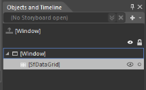

_Object and Timeline Pane_

* From the menu bar select Object > EditStyle.

_Selecting EditStyle from Object in Menu Bar_

You can see two options in submenu,

* Edit a Copy –Edits a copy of the default style. When you select this option, a new dialog window is opened as follows.

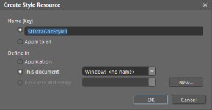

_Create Style Resources dialog box_

The Create Style Resources dialog prompts you to enter the name or change the name for your style, also you can select the location where your style is defined.

* Create Empty- Creates an empty style for the SfDataGrid. When you select this option, the same Create style Resources dialog is opened. You can enter the name or change the name of style and select the location where your style is defined.

_Creating empty style for SfDataGrid_

Click OK, Expression Blend generates the style of the SfDatagrid control in the Resource section. The properties available for the style are loaded in the ‘Properties’ pane and you can modify its default values. You can also edit the generated XAML in the XAML view or in VisualStudio.

#### Edit DataGrid Elements in Expression Blend

You can also edit the Datagrid elements in ExpressionBlend. To edit the SfDatagrid elements in ExpressionBlend follow the steps,

* Open your application in Expression Blend.
* In Object and Timeline Pane select SfDataGrid control.

_Object and Timeline Pane_

* From menu bar select the Object > Edit Additional Templates.

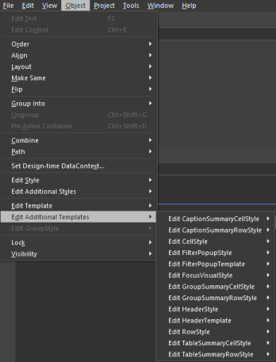

_Selecting Edit Additional Styles from Object in Menu Bar_

You can select the available DataGrid element templates that you can modify the style. For example when you select EditCellStyle, you have following two options.

* Edit a Copy _–_Edits a Copy of the default style. When you select this option, a new dialog window is opened.

_Create Style Resources dialog box_

The Create Style Resources dialog prompts you to enter the name or change the name for your style. Also you can select the location where your style is defined.

* Create Empty_-_ creates an empty style for the SfDataGrid. When you select this same option, the same Create Style Resources dialog is opened. You can enter the name or change the name of style and select the location where your style is defined.

_Creating empty style for SfDataGrid_

Click OK, Expression Blend generates the style of the GridCell in the Resource section. The properties available for the styles are loaded in the Properties pane and you can modify their default values. You can also edit the generated XAML in the XAML view or in VisualStudio.

You can also edit the style of the following Datagrid elements in Expression Blend.

* CaptionSummaryCellStyle.
* CaptionSummaryRowStyel.
* FilterPopupStyle.
* FilterPopupTemplate.
* GroupSummaryCellStyle.
* GroupSummaryRowStyle.
* HeaderStyle
* HeaderTemplate
* RowStyle
* TableSummaryCellStyle
* TableSummaryRowStyle.
### Visual Style Editing

DataGrid allows you to edit the styles of DataGrid and its elements in Visual studio as your requirement.

> _Note: Visual Style Editing option is availble in Visual Studio 2012 and higher versions only._

#### Edit DataGrid in Visual Studio Design View.

This section explains you how to edit a SfDataGrid style in VisualStudioDesingView. To Edit the control style in Visual studio follow the steps.

* Open your application in Visual Studio.
* Open Designview>>Right-click on the designview. Menu options are displayed.
* Click EditTemplates, you can see the following two options. 

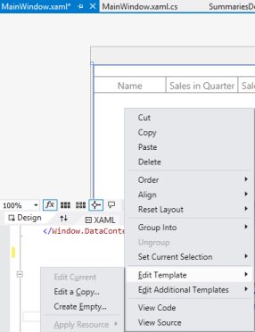

_Designview in Visual Studio_

* Edit a Copy –Edits a copy of the default style. When you select this option, a new dialog window is opened.

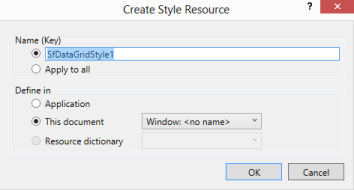

_Create style Resources dialog box_

The Create style Resources dialog prompts you to enter the name or change the name of style. Also you can select the location where your style is defined.

* Create Empty- creates an empty style for the SfDataGrid. When you select this option, the same Create style Resources dialog is opened. You can enter name or change the name of style and select the location where your style is defined.

_Creating empty style for SfDataGrid_

Click OK, Visual Studio generates the style of DataGrid in the Resource section.The style of the DataGrid control is loaded in the XAML.  You can also edit the generated XAML in the XAML view.

#### Edit DataGrid Elements in VisualStudio Desing View

This section explains you how to edit a SfDataGrid elements style in VisualStudioDesingView. To Edit the DataGrid element style in Visual Studio follow the steps,

* Open your application in Visual Studio.
* Open Designview>>Right-click on the designview. Menu options are displayed.
* Click EditAdditionalTemplates>>EditCellStyle, you can have the following two menu options.

_Selecting EditCellStyle from EditAdditionalTemplates in Designview_

* Edit a Copy –Edits a copy of the default style. When you select this option, a new dialog window is opened.

_Create style Resources dialog box_

The Create style Resources dialog prompts you to enter the name or change the name of style.Also you can select the location where your style is defined.

* Create Empty- creates an empty style for the GridCell. When you select this option, the same Create style Resources dialog is opened. You can enter the name or change the name of style and select the location where your style is defined.

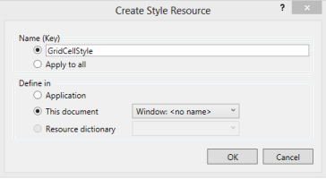

_Creating empty style for SfDataGrid_

Click OK, Visual Studio generates the style of GridCell in the Resource section.The style of the GridCell is loaded in the XAML  You can also edit the generated XAML in the XAML view.

You can also edit the style of the following DataGrid elements in Visual Studio.

* CaptionSummaryCellStyle.
* CaptionSummaryRowStyel.
* FilterPopupStyle.
* FilterPopupTemplate.
* GroupSummaryCellStyle.
* GroupSummaryRowStyle.
* HeaderStyle
* HeaderTemplate
* RowStyle
* TableSummaryCellStyle
* TableSummaryRowStyle.

### Styling Cells

DataGrid control offers the following properties to apply custom styling for cells.

_Styling cells property table_

<table>
<tr>
<td>
Property</td><td>
Description</td><td>
Target Element Type</td><td>
DataContext</td></tr>
<tr>
<td>
SfDataGrid.CellStyle,GridColumn.CellStyle</td><td>
Applies styles to GridCell</td><td>
GridCell</td><td>
Business object</td></tr>
<tr>
<td>
SfDataGrid.CaptionSummaryCellStyle</td><td>
Applies styles to Group Caption Summary Cell</td><td>
GridCaptionSummaryCell</td><td>
Group</td></tr>
<tr>
<td>
SfDataGrid.GroupSummaryCellStyle</td><td>
Applies styles to Group Summary Cell</td><td>
GridGroupSummaryCell</td><td>
SummaryRecordEntry</td></tr>
<tr>
<td>
SfDataGrid.TableSummaryCellStyle</td><td>
Applies styles to Table Summary Cell</td><td>
GridTableSummaryCell</td><td>
SummaryRecordEntry</td></tr>
<tr>
<td>
SfDataGrid.HeaderStyle,GridColumn.HeaderStyle</td><td>
Applies styles to Column Header</td><td>
GridHeaderCellControl</td><td>
Null</td></tr>
</table>

#### SfDataGrid.CellStyle

DataGrid displays all the column values in cells. GridCell is base type for all the cells in the Grid.  These cells are styled by creating appropriate style for the cells and setting that to SfDataGrid.CellStyle property.

The following code example illustrates applying styles for cells.



[XAML]

<!--  Grid Cell Style  -->

<Window.Resources>

</Window.Resources>

<syncfusion:SfDataGrid  x:Name="datagrid" 

                        ItemsSource="{Binding ItemsSource}"

                        CellStyle="{StaticResource customCellStyle}" />



> _Note: DataGrid control also allows you to apply the style for the cells in the particular column by using GridColumn.CellStyle property._

#### SfDataGrid.CaptionSummaryCellStyle

Group caption row displays the data i.e. Group caption text and caption summary values in GridCaptionSummaryCell. You can apply custom style for GridCaptionSummaryCell using this property.

The following code example illustrates this.



[XAML]

<Window.Resources>

</Window.Resources>

<syncfusion:SfDataGrid   x:Name="datagrid" 

                           AllowSorting="True"           

                           CaptionSummaryCellStyle="{StaticResource captionSummaryCellStyle}" 

                           ItemsSource="{Binding OrdersDetails}" />



#### SfDataGrid.GroupSummaryCellStyle

GroupSummary row displays all the summary values in GroupSummaryCells. You can apply the style for GroupSummaryCell using this property. The following code example illustrates this.



[XAML]

<Window.Resources>

</Window.Resources>

<syncfusion:SfDataGrid x:Name="datagrid" 

                         AllowSorting="True"

                         GroupSummaryCellStyle="{StaticResource groupSummaryCellStyle}"

                         ItemsSource="{Binding OrdersDetails}" />



#### SfDataGrid.TableSummaryCellStyle

All the table summary values are displayed in GridTableSummaryCell. DataGrid enables you to apply style for GridTableSummaryCell using this property. The following code example illustrates this.



[XAML]

<Window.Resources>

</Window.Resources>

<syncfusion:SfDataGrid x:Name="datagrid" AllowSorting="True"

TableSummaryCellStyle="{StaticResource tableSummaryCellStyle}"

ItemsSource="{Binding OrdersDetails}" />



#### SfDataGrid.HeaderStyle

DataGrid displays the column header in GridHeaderCellControl that displays the column header text and shows the sorting icon when you sort the column. By using this property, you can apply style for GridHeaderCellControl. The following code example illustrates this.



[XAML]

<Window.Resources>

</Window.Resources>

<syncfusion:SfDataGrid x:Name="datagrid" 

                         AllowSorting="True"

                         HeaderStyle="{StaticResource headerCellStyle}"

                         ItemsSource="{Binding OrdersDetails}">


### Styling Rows

The DataGrid control offers the following properties for Styling the different type of rows in Grid

_Styling Rows property table_

<table>
<tr>
<td>
Property</td><td>
Description</td><td>
Target Element</td><td>
Data Context</td></tr>
<tr>
<td>
SfDataGrid.RowStyle</td><td>
Applies styles to Rows.</td><td>
VirtualizingCellsControl</td><td>
Business object</td></tr>
<tr>
<td>
SfDataGrid.AlternatingRowStyle</td><td>
Applies styles for AlternateRow</td><td>
VirtualizingCellsControl</td><td>
Business object</td></tr>
<tr>
<td>
SfDataGrid.CaptionSummaryRowStyle</td><td>
Applies styles to Caption Summary Rows.</td><td>
CaptionSummaryRowControl</td><td>
Group </td></tr>
<tr>
<td>
SfDataGrid.GroupSummaryRowStyle</td><td>
Applies styles to Group Summary Rows.</td><td>
GroupSummaryRowControl</td><td>
SummaryRecordEntry</td></tr>
<tr>
<td>
SfDataGrid.TableSummaryRowStyle</td><td>
Applies styles to Table Summary Rows.</td><td>
TableSummaryRowControl</td><td>
SummaryRecordEntry</td></tr>
</table>

#### SfDataGrid.RowStyle

All the rows in the DataGrid are of VirtualizingCellsControl type that contains the RowData as data context. SfDataGrid.RowStyle property helps to apply styles for the row.

The following code example illustrates how to set the row style for DataGrid.



[XAML]

<Window.Resources>       

<Window.Resources>

<syncfusion:SfDataGrid x:Name="datagrid" 

                         RowStyle="{StaticResource rowStyle}"

                         ItemsSource="{Binding OrdersDetails}" />



#### SfDataGrid.AlternatingRowStyle

The property helps you to apply style for alternate row in SfDataGrid. It is the type of VirtualizingCellsControl that contains the RowData as data context. SfDataGrid.AlternatingRowStyle property helps to apply styles for the alternate row.

The following code example illustrates how to set the alternate row style for DataGrid.



[XAML]

<Window.Resources>       

<Window.Resources>

<syncfusion:SfDataGrid x:Name="datagrid" 

                         AlternatingRowStyle="{StaticResource AlternaterowStyle }"

                         ItemsSource="{Binding OrdersDetails}" />



#### SfDataGrid.CaptionSummaryRowStyle

This property helps to apply styling for Group caption row (refer the visual elements figure). Group caption row is a type of CaptionSummaryRowControl that inherits from VirtualizingCellsControl containing the Group data as DataContext. 

The following code example illustrates applying styles for Group caption row.



[XAML]

<Window.Resources>

<Window.Resources>

<syncfusion:SfDataGrid x:Name="datagrid" 

                         AllowSorting="True"

                         CaptionSummaryRowStyle="{StaticResource captionSummaryRowStyle}"

                         ItemsSource="{Binding OrdersDetails}">



#### SfDataGrid.GroupSummaryRowStyle

Group summary is displayed at the bottom of all groups when you add GridSummaryRow object to SfDataGrid.GroupSummaryRows collection. You can apply style to them by editing the GroupSummaryRowControl style.

The following code example illustrates styling of Group Summary rows.



[XAML]

<Window.Resources>

<Window.Resources>

<syncfusion:SfDataGrid x:Name="datagrid" 

                         AllowSorting="True"

                         GroupSummaryRowStyle="{StaticResource groupSummaryRowStyle}"

                         ItemsSource="{Binding OrdersDetails}">



#### SfDataGrid.TableSummaryRowStyle

DataGrid displays all the Table summary values in TableSummaryRow. By default, table summary row is present at the bottom of DataGrid. TableSummaryRow is of a type TableSummaryRowControl. You can apply styling for TableSummaryRowControl by creating custom style and setting that style to SfDataGrid.TableSummaryRowStyle property.

The following code example displays the styling of TableSummaryRow.



[XAML]

<Window.Resources>

<Window.Resources>

<syncfusion:SfDataGrid x:Name="datagrid" 

                         AllowSorting="True"

                         TableSummaryRowStyle="{StaticResource tableSummaryRowStyle}"

                         ItemsSource="{Binding OrdersDetails}">



### Style Selectors

DataGrid provides extensive support for StyleSelectors that helps to apply custom style for cells and rows. To know more about the StyleSelectors you can check the following MSDN link: [http://msdn.microsoft.com/en-us/library/system.windows.controls.styleselector.aspx](http://msdn.microsoft.com/en-us/library/system.windows.controls.styleselector.aspx).

> _Note: By default, Silverlight does not support StyleSelectors hence DataGrid too._

#### Cell Style Selectors

DataGrid control offers following StyleSelector properties to set the style for cells.

_Cell StyleSelector property table_

<table>
<tr>
<td rowspan = "2">
Property</td><td rowspan = "2">
Description</td><td colspan = "2">
Parameters</td></tr>
<tr>
<td>
Item</td><td>
Container</td></tr>
<tr>
<td>
SfDataGrid.CellStyleSelector</td><td>
Gets or sets a value that applies the style for GridCell based on a custom condition</td><td>
Corresponding row data.</td><td>
GridCell</td></tr>
<tr>
<td>
SfDataGrid.CaptionSummaryCellStyleSelector</td><td>
Gets or sets a value that applies the style for GridCaptionSummaryCell based on a custom condition</td><td>
Corresponding row data.</td><td>
GridCaptionSummaryCell</td></tr>
<tr>
<td>
SfDataGrid.GroupSummaryCellStyleSelector</td><td>
Gets or sets a value that applies the style for GridGroupSummaryCell based on a custom condition</td><td>
Corresponding row data.</td><td>
GridGroupSummaryCell</td></tr>
<tr>
<td>
SfDataGrid.TableSummaryCellStyleSelector</td><td>
Gets or sets a value that applies the style for GridTableSummaryCell based on a custom condition</td><td>
Corresponding row data.</td><td>
GridTableSummaryCell</td></tr>
</table>

#### Row Style Selectors

DataGrid also offers following StyleSelector properties for applying styles to rows. 

_Row StyleSelector property table_

<table>
<tr>
<td rowspan = "2">
Property</td><td rowspan = "2">
Description</td><td colspan = "2">
Parameters</td></tr>
<tr>
<td>
Item</td><td>
Container</td></tr>
<tr>
<td>
SfDataGrid.RowStyleSelector</td><td>
Gets or sets a value that applies the style for VirtualizingCellsControl based on a custom condition</td><td>
DataRowBase</td><td>
VirtualizingCellsControl</td></tr>
<tr>
<td>
SfDataGrid.AlternatingRowStyleSelector</td><td>
Gets or sets a value that applies the style for VirtualizingCellsControl based on a custom condition</td><td>
DataRowBase</td><td>
VirtualizingCellsControl</td></tr>
<tr>
<td>
SfDataGrid.CaptionSummaryRowStyleSelector</td><td>
Gets or sets a value that applies the style for CaptionSummaryRowControl based on a custom condition</td><td>
DataRowBase</td><td>
CaptionSummaryRowControl</td></tr>
<tr>
<td>
SfDataGrid.GroupSummaryRowStyleSelector</td><td>
Gets or sets a value that applies the style for GroupSummaryRowControl based on a custom condition</td><td>
DataRowBase</td><td>
GroupSummaryRowControl</td></tr>
<tr>
<td>
SfDataGrid.TableSummaryRowStyleSelector</td><td>
Gets or sets a value that applies the style for TableSummaryRowControl based on a custom condition</td><td>
DataRowBase</td><td>
TableSummaryRowControl</td></tr>
</table>

#### Example

In the following example, you can set the different row background for DataGrid by using SfDataGrid.RowStyleSelector property.



[XAML]

//Custom Style 

<Application.Resources>

      

      

</Application.Resources>




[C#]

// Custom Style Selector.

public class CustomRowStyleSelector : StyleSelector

{

public override Style SelectStyle(object item, DependencyObject container)

{

var row = item as DataRowBase;

// Applying alternating background for rows.

              if (row.RowIndex % 2 != 0)

                return App.Current.Resources["rowStyle1"] as Style;

              else

  return App.Current.Resources["rowStyle2"] as Style;

return base.SelectStyle (item, container);

}

}





[XAML]

</Window.Resources>

<local:CustomRowStyleSelector x:Key="rowStyleSelector" />

</Window.Resources>

<syncfusion:SfDataGrid x:Name="datagrid" 

                         AllowSorting="True"

                         RowStyleSelector="{StaticResource rowStyleSelector}"

                         ItemsSource="{Binding OrdersDetails}"/>



The following screenshot displays the output.

_Customized rows with background_

### Header Template

#### GridColumn.HeaderTemplate

DataGrid provides the extensive support to apply template for column header. By using the following property, you can template the particular column header.

_Property Table_

<table>
<tr>
<td>
Property Name</td><td>
Description</td><td>
Data Context</td></tr>
<tr>
<td>
GridColumn.HeaderTemplate</td><td>
Gets or sets a value that applies template for corresponding column header.</td><td>
Null</td></tr>
</table>

The following code example illustrates how to use HeaderTemplate in DataGrid Column.



[XAML]

<Window.Resources>

<DataTemplate x:Key="headerTemplate">

<Grid>

<Grid.ColumnDefinitions>

                  <ColumnDefinition Width="Auto" />

                  <ColumnDefinition Width="*" />

</Grid.ColumnDefinitions>

<TextBlock Grid.Column="0" VerticalAlignment="Center"

                  Foreground="White" Text="{Binding}" />

                  <Image Source="/Assets/Icon.jpg" Grid.Column="1" />

</Grid>

</DataTemplate>

</Window.Resources>

<syncfusion:SfDataGrid x:Name="datagrid" 

                         AutoGenerateColumns="False"

                         ColumnSizer="Star" 

                         ItemsSource="{Binding GDCSource}">

<syncfusion:SfDataGrid.Columns>

<syncfusion:GridTextColumn MappingName="EmployeeName"

HeaderTemplate="{StaticResource headerTemplate}" />

<syncfusion:GridTextColumn MappingName="EmployeeDesignation" />

<syncfusion:GridTextColumn MappingName="EmployeeAge"  />

<syncfusion:GridTextColumn MappingName="EmployeeGender" />

<syncfusion:GridTextColumn MappingName="EmployeeArea" />

<syncfusion:GridTextColumn MappingName="EmployeeSalary" />

</syncfusion:SfDataGrid.Columns>

</syncfusion:SfDataGrid>



> _Note: DataGrid control also provides the support to apply DataTemplateSelector for a particular column using GridTemplateColumn.CelltemplateSelector property. For more information about this, you can refer_ ColumnType _topic._

### Template Selectors

DataGrid provides extensive support for DataTemplateSelectors that helps to apply custom style for cells and rows, based on a custom condition. To know more about the DataTemplateSelectors, you can check the following MSDN link:

[http://msdn.microsoft.com/en-us/library/system.windows.controls.datatemplateselector.aspx](http://msdn.microsoft.com/en-us/library/system.windows.controls.datatemplateselector.aspx).

> _Note: By default, Silverlight does not support TemplateSelectors hence DataGrid too._

DataGrid offers the following DataTemplateSelector property to apply custom templates for cells based on a custom condition.

_DataTemplateSelector property table_

<table>
<tr>
<td rowspan = "2">
Property</td><td rowspan = "2">
Description</td><td colspan = "2">
Parameters</td></tr>
<tr>
<td>
Item</td><td>
Container</td></tr>
<tr>
<td>
SfDataGrid.CellTemplateSelector</td><td>
Gets or sets DataTemplateSelectors value that applies custom template for the cells based on a custom condition.It applies for all TemplateColumn.</td><td>
Corresponding row data</td><td>
GridCell</td></tr>
<tr>
<td>
GridColumn.CellTemplateSelector</td><td>
Gets or sets DataTemplateSelectors value that applies custom template for the cells based on a custom condition.It applies for particular column.</td><td>
Corresponding row data</td><td>
GridCell</td></tr>
</table>

#### SfDataGrid.CellTemplateSelector

By using this property, you can apply custom templates for cells based on a custom condition. It applies for all template column defined in DataGrid. The following code example illustrates applying template selector for DataGrid Template column.



[C#]

class GridCellTemplateSelector : DataTemplateSelector 

{

  public override DataTemplate SelectTemplate(object item, DependencyObject container)

    {

      var data = item as SalesByYear;

      if (data.QS2 ==0)

       return Application.Current.Resources["CellTemplate1"] as DataTemplate;

      else

       return Application.Current.Resources["CellTemplate2"] as DataTemplate;               

    }

}




[XAML]

<Application.Resources>

    <DataTemplate x:Key="CellTemplate1">

       <TextBlock Foreground="Blue" Text="{Binding Name}" />

    </DataTemplate>

    <DataTemplate x:Key="CellTemplate2">

        <TextBlock Foreground="Red" Text="{Binding Name}" />

    </DataTemplate>

</Application.Resources>

</Window.Resources>

<local:GridCellTemplateSelector x:Key="templateselector"/> 

</Window.Resources>

<syncfusion:SfDataGrid x:Name="datagrid" 

                         ItemsSource="{Binding ItemsSource}">

                         CellTemplateSelector="{StaticResource templateselector}"

</syncfusion:SfDataGrid>    


The following screenshot displays the output.

_Template selector for DataGrid Template column_

#### GridColumn.CellTemplateSelector

By using this property, you can apply custom templates for cells based on a custom condition. The following code example illustrates applying template selector for DataGrid Template column.



[C#]

class GridCellTemplateSelector : DataTemplateSelector

{

public override DataTemplate SelectTemplate(object item, DependencyObject container)

{

var record = item as GridDataControlStylingDemo.ModelData;

if (record != null && record.Gender == "Male")

return Application.Current.Resources["maleCellTemplate"] as DataTemplate;

else if (record != null && record.Gender == "Female")

return Application.Current.Resources["femaleCellTemplate"] as DataTemplate;

else

return base.SelectTemplate(item, container);

}

}




[XAML]

<Application.Resources>

<DataTemplate x:Key="maleCellTemplate">

<Image Source="/Assets/male.jpg" />

</DataTemplate>

<DataTemplate x:Key="femaleCellTemplate">

<Image Source="/Assets/female.jpg" />

</DataTemplate>

</Application.Resources>

<syncfusion:SfDataGrid x:Name="datagrid" 

                         ItemsSource="{Binding ItemsSource}">

            <syncfusion:SfDataGrid.Columns>

              <syncfusion:GridTextColumn MappingName="EmployeeId" />

              <syncfusion:GridTextColumn MappingName="EmployeeName" />

              <syncfusion:GridTextColumn MappingName="EmployeeDesignation" />

              <syncfusion:GridTemplateColumn  

                   CellTemplateSelector="{StaticResource cellSelector}"   

                   MappingName="EmployeeGender" />

              </syncfusion:SfDataGrid.Columns>

</syncfusion:SfDataGrid>  



The following screenshot displays the output.

_Template selector for Grid Template column_

### Conditional Formatting for Cells

DataGrid allows you to format the styles of cells and rows based on certain conditions. This is achieved by defining styling and template properties of DataGrid. To know more about styling and template properties you can refer the following topics:

* Styling Cells
* Styling Row
* Style Selectors
* Template Selectors

#### Applying Conditional Formatting to Cells

##### Example

In this example you can see how to apply styles, based on conditions for cells in “Change” column using CellTemplate. When the change value is less than zero, then Red color foreground is applied to that cell, else Green color Foreground is applied.

Following steps illustrate how to apply conditional formatting to the Cells in Grid:

1. Create a converter and specify the criteria to apply conditional formatting to the cells.



[C#]

//Color Converters

public class ForegroundColorConverter : IValueConverter

{

public object Convert(object value, Type targetType, object parameter, string language)

{

var data = value as double?;

if (data != null && data > 0)

return new SolidColorBrush(Colors.Green);

else

return new SolidColorBrush(Colors.Red);

}

public object ConvertBack(object value, Type targetType, object parameter, string language)

{

throw new NotImplementedException();

}

}


2. Create a CellTemplate for “Change” column and apply the above Foreground converter to the TextBlock inside the Template.



[XAML]

</Window.Resources>

<local:ForegroundColorConverter x:Key="changeForegroundConverter"/> 

</Window.Resources>

<syncfusion:SfDataGrid x:Name="datagrid" 

                         AutoGenerateColumns="False" 

                         ItemsSource="{Binding Stocks}">

<syncfusion:SfDataGrid.Columns>

<syncfusion:GridTextColumn MappingName="Symbol" />

<syncfusion:GridTemplateColumn MappingName="Account" />

<syncfusion:GridTextColumn MappingName="LastTrade" />

<syncfusion:GridTemplateColumn MappingName="Change">

<syncfusion:GridTemplateColumn.CellTemplate>

<DataTemplate>

<TextBlock x:Name="changeValue" HorizontalAlignment="Center" FontSize="24" FontWeight="Light" Foreground="{Binding Change, Converter={StaticResource changeForegroundConverter}}"                                                                          Text="{Binding Change}" />

</DataTemplate>

</syncfusion:GridTemplateColumn.CellTemplate>

</syncfusion:GridTemplateColumn>

<syncfusion:GridTextColumn MappingName="PreviousClose" />

<syncfusion:GridTextColumn MappingName="Open" />

</syncfusion:SfDataGrid.Columns>

</syncfusion:SfDataGrid>



The following screenshot displays the output.

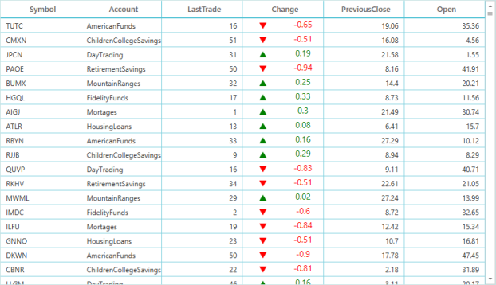

_Conditional formatting to the Cells in Grid_

#### Applying Conditional Formatting for Rows

##### Example

In this example, you can see how to apply style, based on conditions for rows using SfDataGrid.RowStyleSelector. When the “Change” column value is less than zero, then Red color foreground is applied to that Row, else Green color foreground is applied.

Following steps illustrate how to apply conditional formatting to the Rows in Grid:

1. Create a StyleSelector and specify the criteria to apply conditional formatting to the rows.



[C#]

public class CustomRowStyleSelector : StyleSelector

{

public override Style SelectStyle(object item, DependencyObject container)

{

var row = item as DataRowBase;

var data = row.RowData as StockData;

if (data != null)

{

if(data.Change<0)

return App.Current.Resources["redRowStyle"] as Style;

else

return App.Current.Resources["greenRowStyle"] as Style;

}

return base.SelectStyle (item, container);

}

}



2. Assign that custom StyleSelector object to SfDataGrid.RowStyleSelector property. The following code example illustrates this.



[XAML]

</Window.Resources>

<local:CustomRowStyleSelector x:Key="rowStyleSelector "/> 

</Window.Resources>

<syncfusion:SfDataGrid x:Name="datagrid" 

                         AutoGenerateColumns="True"

                         ColumnSizer="Star" 

                         RowStyleSelector="{StaticResource rowStyleSelector}"

                ItemsSource="{Binding Stocks}" />


The following screenshot displays the output.

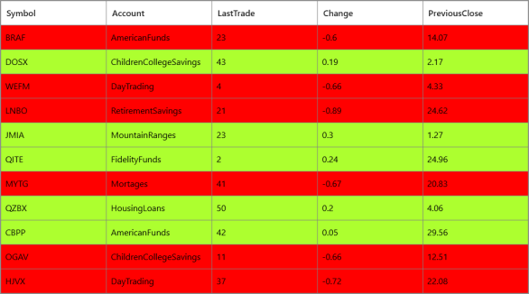

_Conditional formatting to the Rows in Grid_

> _Note: StyleSelectors & TemplateSelectors are not supported by Silverlight_

### Alternating Row Style

You can set the Alternative RowStyle in DataGrid by using SfDataGrid.AlternatingRowStyle__property. 

DataGrid allows you to set AlternativeRowCount.By default, AlternatingRowStyle is applied for every alternative second row.To change the alternative row count, you can change it by using AlternationCount property.

The following code example illustrates how to use AlternatingRowStyle in DataGrid.



[XAML]

<Window.Resources>

</Window.Resources>

<syncfusion:SfDataGrid Name="grid"

                           AlternationCount="3"

                           AlternatingRowStyle="{StaticResource alternateRowstyle}"  



The following screenshot displays the output.

_AlternatingRowStyle in DataGrid_

## Row Height Customization

This section explains you how to customize the height of the row OnDemand based on all columns data or certain columns data.

### QueryRowHeight

QueryRowHeight is the event that returns row heights in demand. This is raised for the row that comes to view.  Refer to the following code example for the QueryRowHeight event.  



[C#]

//Hooks event for the SfDataGrid.

syncgrid.QueryRowHeight += syncgrid_QueryRowHeight;

/// 

/// The event sets the height of the row OnDemand.

/// 

/// <param name="sender">Gets the object that raising this event</param>    

/// <param name="e">QueryRowHeightEventArgs</param>   

void syncgrid_QueryRowHeight(object sender, QueryRowHeightEventArgs e)

{

}  


This event receives two arguments namely the sender that handles the SfDataGrid and the QueryRowHeightEventArgs. The QueryRowHeightEventArgs has the following properties.

* RowIndex: The property RowIndex helps you identify the particular row’s index.
* Height: This property sets and returns the row height in demand. Default line size of the row         

height is 24d.

* Handled: This property decides whether the specified height can be set to row or not. Default value is false. When this event is not handled, the decided height is not set to the row. 

The following is the code example of the QueryRowHeight event.



[XAML]

<syncfusion:SfDataGrid x:Name="syncgrid"

                       AutoGenerateColumns="False"

                       ColumnSizer="Star"

                       NavigationMode="Cell"

                       AllowEditing="True"

                       ShowRowHeader="True"

                       AutoExpandGroups="True"

                       AllowResizingColumns="True"

                       ShowGroupDropArea="True"

                       ItemsSource="{Binding CustomerDetails}">

<syncfusion:SfDataGrid.Columns>

    <syncfusion:GridTextColumn HeaderText="Customer ID" MappingName="CustomerID"/>

    <syncfusion:GridTextColumn HeaderText="Employee Name" MappingName="CompanyName" />

</syncfusion:SfDataGrid.Columns>

</syncfusion:SfDataGrid>





[C#]

// Hooks event for the SfDataGrid.

syncgrid.QueryRowHeight += syncgrid_QueryRowHeight;

void syncgrid_QueryRowHeight(object sender, QueryRowHeightEventArgs e)

{

    if(e.RowIndex == 1) //Sets Height to the first row.

    {

        e.Height = 40;

        e.Handled = true;

    }

}  


The following screenshot displays the output.

_Query Row Height event_

### AutoRowHeight

By default, the RowHeight is not adjusted based on the text located in the GridCell. When large text in collection is loaded to the SfDataGrid and columns have defined TextWrapping with wrap, it looks like the content is wrapped and clipped with the default row height. 

SfDataGrid enables fitting the height of the row based on its content on-demand based for all columns or certain columns of SfDataGrid by calling GetAutoRowHeight method in QueryRowHeight event.  This improves the readability of the content and occurs on-demand basics and does not affect the loading performance of the Grid.

#### GetAutoRowHeight

The GetAutoRowHeight method returns true or false by which the row height can be calculated. It returns false for index that does not belong to the recorded rows. This method is specifically implemented in the [GridColumnSizer](http://help.syncfusion.com/ug/wpf/default.htm)class. 

It calculates height by the column that has large data. The following are the parameters for calculation of height.

1. RowIndex: The index of the row for which the height is to be resized based on record.
2. GridRowSizingOptions: This option allows you to customize the row height calculation based on the following properties:  
1. ExcludeColumns.
2. CanIncludeHiddenColumns.

ExcludeColumns: This is a type of string collection. Apart from the ExcludeColumns from the ItemsSource, all other columns added in the list of string collection are not taken for calculation. The ExcludeColumns helps you reduce the count of loop run for height calculation. By default GetAutoRowHeight method calculates row height based on all columns data. You can calculate height for a row, based on the column you choose.

CanIncludeHiddenColumns: This is the Boolean parameter and the default value is false. If you enable this property it allows the hidden column to calculate the resizing of rows. 

3. rowHeight: You can get the calculated height from the out rowHeight parameter. The returned height is based on the large data in columns for the queried row.  

You can get the calculated height of rows through the out parameter (rowHeight) of GetAutoRowHeight method and then assign it to the Height property of QueryRowHeightEventArgs in the QueryRowHeight event.

The following code example explains how to use the GetAutoRowHeight method in the QueryRowHeight event.



[XAML]

<syncfusion:SfDataGrid x:Name="syncgrid"

                       AutoGenerateColumns="False"                       

                       NavigationMode="Cell"

                       AllowEditing="True"

                       ShowRowHeader="True"

                       AutoExpandGroups="True"

                       AllowResizingColumns="True"

                       ShowGroupDropArea="True"

                       ItemsSource="{Binding CustomerDetails}">

<syncfusion:SfDataGrid.Columns>

    <syncfusion:GridTextColumn HeaderText="Customer ID" MappingName="CustomerID" TextWrapping="Wrap" />

    <syncfusion:GridTextColumn HeaderText="Employee Name" MappingName="CompanyName" TextWrapping="Wrap"/>

    <syncfusion:GridTextColumn HeaderText="Contact Name" MappingName="ContactName" TextWrapping="Wrap" />

    <syncfusion:GridTextColumn HeaderText="Nationality ID" MappingName="ContactTitle" TextWrapping="Wrap"/>

</syncfusion:SfDataGrid.Columns>

</syncfusion:SfDataGrid>            


As a result of TextWrapping, the text is wrapped but the height is not increased as illustrated in the following screenshot.

_Text wrap_

By adding the following code example, you can improve the readability of the content.



[C#]

public partial class MainWindow 

{

// The option that decides Calculation of all the columns or certain columns, with or without Hidden columns.

GridRowSizingOptions gridRowResizingOptions = new GridRowSizingOptions();

// Gets the calculated height from GetAutoRowHeight method.    

double Height = double.NaN;    

    public MainWindow()

    {

        InitializeComponent();

        // Hooks event for the SfDataGrid.

        syncgrid.QueryRowHeight += syncgrid_QueryRowHeight;

    }

    void syncgrid_QueryRowHeight(object sender, QueryRowHeightEventArgs e)

    {

        if (this.syncgrid.GridColumnSizer.GetAutoRowHeight(e.RowIndex, gridRowResizingOptions, out Height))

        {

          // This code is run when the row index passes for record alone.

                e.Height = Height;

                e.Handled = true;            

        }

    }       

}


Now, you can see that the height of the row is resized based on the large text content in the following output.

_Output_

The height of the row is calculated based on all the column values. With the GridRowSizingOptions, you can restrict the calculation to only a few columns that have large data instead of doing it for all the columns. You can also improve the performance of row height calculation with the GridRowSizingOptions.

The following code example explains how to use the GridRowSizingOptions. 



[XAML]

<syncfusion:SfDataGrid x:Name="syncgrid"

                       AutoGenerateColumns="False"                       

                       NavigationMode="Cell"

                       AllowEditing="True"

                       ShowRowHeader="True"

                       AutoExpandGroups="True"

                       AllowResizingColumns="True"

                       ShowGroupDropArea="True"

                       ItemsSource="{Binding CustomerDetails}">

<syncfusion:SfDataGrid.Columns>

    <syncfusion:GridTextColumn HeaderText="Customer ID" MappingName="CustomerID" TextWrapping="Wrap" />

    <syncfusion:GridTextColumn HeaderText="Employee Name" MappingName="CompanyName" IsHidden="True" TextWrapping="Wrap"/>

    <syncfusion:GridTextColumn HeaderText="Contact Name" MappingName="ContactName" TextWrapping="Wrap" />

    <syncfusion:GridTextColumn HeaderText="Nationality ID" MappingName="ContactTitle" TextWrapping="Wrap"/>

</syncfusion:SfDataGrid.Columns>

</syncfusion:SfDataGrid>            



The columns that need not be included in the calculation of height can be added to the ExcludeColumns list of the GridRowSizingOptions. 



[C#]

public partial class MainWindow 

{

// The options that decide Calculation by all columns or certain columns, with or without Hidden columns.

GridRowSizingOptions gridRowResizingOptions = new GridRowSizingOptions();

//To get the calculated height from the GetAutoRowHeight method.    

double Height = double.NaN;  

// The list contains the column names that will excluded from the height calculation in the GetAutoRowHeight method.

List<string> excludeColumns = new List<string>();         

    public MainWindow()

    {

        InitializeComponent();

// Hooks event for the SfDataGrid.

        syncgrid.QueryRowHeight += syncgrid_QueryRowHeight;

        excludeColumns.Add("CustomerID");

        excludeColumns.Add("ContactName");

        excludeColumns.Add("ContactTitle");

// The above columns are excluded from calculation.

        gridRowResizingOptions.ExcludeColumns = excludeColumns;

// Hidden columns are also included in the height calculation.

        gridRowResizingOptions.CanIncludeHiddenColumns = true;

    }

    void syncgrid_QueryRowHeight(object sender, QueryRowHeightEventArgs e)

    {

        if (this.syncgrid.GridColumnSizer.GetAutoRowHeight(e.RowIndex, gridRowResizingOptions, out Height))

        {

          // This code is run when the row index is passed for record alone.

                e.Height = Height;

                e.Handled = true;            

        }

    }       

}



In the above code example, CustomerID, ContactName and ContactTitle are excluded from the calculation and only the CompanyName is taken into account. When the CompanyName column is hidden and when you want the hidden column also to participate in the Height calculation, you can set the CanIncludeHiddenColumns to true. The following display depicts the output of above codes. In the following image, the row is resized even though the column is hidden. 

_Hidden column with Height calculation_

### How to Customize the Height of the Header Row

The SfDataGrid provides support to customize the height of the Header row also. You can achieve this by the following ways:

1. By using HeaderRowHeight Property

The SfDataGrid control provides direct property to set height for the header row. You have to enable the HeaderRowHeight property in the SfDataGrid definition. 



[XAML]

<syncfusion:SfDataGrid x:Name="syncgrid"

                       AutoGenerateColumns="False"                       

                       NavigationMode="Cell"

                       AllowEditing="True"

                       ShowRowHeader="True"

                       HeaderRowHeight="40"

                       AllowResizingColumns="True"                      

                       ItemsSource="{Binding CustomerDetails}"/>


2. By using QueryRowHeight Event

By using QueryRowHeight event, you can match the RowIndex from QueryRowHeightEventArgs with GetHeaderIndex () helper method that returns index of the Header. You can refer to the following link to get more [resolver](http://help.syncfusion.com/ug/wpf/default.htm) methods of the SfDataGrid.

> _Note: Need to add Syncfusion.UI.Xaml.Grid.Helper namespace to use GetHeaderIndex () method._

The following code example explains how to customize the header rowHeight.



[XAML]

<syncfusion:SfDataGrid x:Name="syncgrid"

                       AutoGenerateColumns="False"                       

                       NavigationMode="Cell"

                       AllowEditing="True"

                       ShowRowHeader="True"

                       AllowResizingColumns="True"                      

                       ItemsSource="{Binding CustomerDetails}"/>





[C#]

// Hooks event for the SfDataGrid.

syncgrid.QueryRowHeight += syncgrid_QueryRowHeight;

void syncgrid_QueryRowHeight(object sender, QueryRowHeightEventArgs e)

{

// GetHeaderIndex returns the index of the header row.

    if (syncgrid.GetHeaderIndex() == e.RowIndex)

    {

        e.Height = 40;

        e.Handled = true;

    }

}


The following screenshot displays the output.

_Increased Header Row Height_

### How the row height can auto grow with the text length 

When you utilize the special feature AutoRowHeight support of the SfDataGrid control, the row height can grow automatically with the text length you type. You need to raise the QueryRowHeight event and invalidate the row when you complete the editing.

If you want the row to be resized with text that you have typed after editing, you can call InValidateRowHeight (int RowIndex) method in the [CurrentCellEndEdit](http://help.syncfusion.com/ug/wpf/documents/editing.htm) event of the SfDataGrid and it resets the row height internally. 

Then call the InvalidateMeasureInfo method in VisualContainer to refresh the view. The QueryRowHeight event is called again for that row alone and it resizes the row based on the edited content.  This measures the row again and arrange it for you.

When you pass the row index to the InValidateRowHeight method, that specific row Index is added to the Dictionary as a reference to calculate the height of that row again when the InvalidateMeasureInfo is called. Then it raises the QueryRowHeight event for row index that you have invalidated.

> _Note: Need to add this Syncfusion.UI.Xaml.Grid.Helpers namespace to use the InvalidateMeasuerInfo method._



[C#]

// The options that decides the Calculation by all columns or certain columns, with or without the Hidden columns.

GridRowSizingOptions gridRowResizingOptions = new GridRowSizingOptions();

// Gets the calculated height from the GetAutoRowHeight method.    

double Height = double.NaN;  

// Hooks event for the SfDataGrid.

syncgrid.CurrentCellEndEdit += syncgrid_CurrentCellEndEdit;

void syncgrid_CurrentCellEndEdit(object sender, CurrentCellEndEditEventArgs args)

{

    syncgrid.InvalidateRowHeight(args.RowColumnIndex.RowIndex);

    syncgrid.GetVisualContainer().InvalidateMeasureInfo();     

}

void syncgrid_QueryRowHeight(object sender, QueryRowHeightEventArgs e)

{

    if (this.syncgrid.GridColumnSizer.GetAutoRowHeight(e.RowIndex, gridRowResizingOptions, out Height))

    {

          // This code is run when the row index passes for record alone.

         e.Height = Height;

         e.Handled = true;            

    }

}       



Run the above code example. Edit with large text and complete editing. Press Tab or Enter key to end the edit mode. The following screenshot displays the output.

_AutoRowHeight_

> _Note: If the InvalidateMeasuerInfo method is not called, grid does not refresh automatically. You need to explicitly refresh the grid though this method._

### How to customize the Height of the TableSummaryRow control

The SfDataGrid control provides support to customize the height of the Table summary row. By utilizing the QueryRowHeight event, you can check whether the RowIndex is a table summary index from the QueryRowHeightEventArgs by using helper method IsTableSummaryIndex in GridIndexResolver class. You can refer to the following link to get more [resolver](http://help.syncfusion.com/ug/wpf/default.htm) methods of the SfDataGrid.

> _Note: Need to use the namespace Syncfusion.UI.Xaml.Grid.Helper._  

The following code example explains you how to customize the Height of TableSummaryRow control in the QueryRowHeight event. 



[C#]

// Hooks event for the SfDataGrid.

syncgrid.QueryRowHeight += syncgrid_QueryRowHeight;

void syncgrid_QueryRowHeight(object sender, QueryRowHeightEventArgs e)

{

// IsTableSummaryIndex returns true or false for a RowIndex. If it is true, the assigned height is applied to the header.

   if(syncgrid.IsTableSummaryIndex(e.RowIndex))

   {

     e.Height = 40;

     e.Handled = true;

   }

}


The following screenshot displays the output of customized TableSummaryRow control Height.

_Customized TableSummaryRow_

#### Limitations

1. Details View is not supported with QueryRowHeight event. If you have Details View with the QueryRowHeight event, the event does not raise any record row. If you have TableSummary with Details View, then you can resize the TableSummary alone.
2. As of now there is no support for Printing.
3. The column width expands based on the content when you try to fit that column, but it does not wrap the text in view. If you refresh the Grid also, the row is not resized.
### Appearance

### Freeze Panes

This section explains you how to set Freeze panes in SfDataGrid. SfDataGrid provides support to Freeze rows and columns at the top and also at the bottom similar to Excel Freeze panes. To enable Freeze panes in SfDataGrid you have to use the following properties.

_Properties Table_

<table>
<tr>
<td>
Property Name</td><td>
Description</td></tr>
<tr>
<td>
FrozenRowsCount</td><td>
Gets or Sets the count of frozen rows in top of the DataGrid.</td></tr>
<tr>
<td>
FooterRowsCount</td><td>
Gets or Sets the count of frozen rows in footer of the DataGrid.</td></tr>
<tr>
<td>
FrozenColumnCount</td><td>
Gets or Sets the count of frozen columns in left side of the DataGrid.</td></tr>
<tr>
<td>
FooterColumnCount</td><td>
Gets or Sets the count of frozen columns in right side of the DataGrid</td></tr>
</table>

#### __Limitations:

1. FreezePanes is not supported in DetailsViewGrid.
2. FrozenRows is disabled when AllowFrozenGroupHeaders is set to True.
3. Count should be less than the view port size.

The following code example illustrates how to use FreezePanes support in SfDataGrid.



[XAML]

<syncfusion:SfDataGrid AllowGrouping="True"

                       ShowGroupDropArea="True"

                       FrozenColumnCount="1"

                       FooterColumnCount="2"

                       FrozenRowsCount="2"

                       FooterRowsCount="1"

                       AllowFrozenGroupHeaders="False"

                       ShowRowHeader="True">



The following screenshot displays the SfDataGrid with Freeze Panes support.

_DataGrid with Freeze panes_

> _Note:_ 

* _While grouping, the FrozenColumnCount denotes only the actual DataColumns instead of any indent columns. So that the Indent columns automatically froze when initializing the FrozenColumnCount._
* _Header and TableSummary rows that are frozen by default works regardless of the FrozenRowsCount and FooterRowsCount properties._
* _The count should be less than the number of rows or columns in view._
## Performance

This Section explains you the high Performance of WPF application using SfDataGrid control when you load large amount of data. 

* Data Virtualization
* Summary Calculation Optimization
* Batch Update
* Filter Popup Performance
### Data Virtualization

When you have large amount of data in SfDataGrid, it may have a slow performance.For small collection of basic data objects, the memory consumption is not significant; however for large collections, the memory consumption is very significant. To overcome this, you can use the concept of Data Virtualization_._ You can use GridVirtualizingCollectionView to load any number records within few milliseconds in SfDataGrid. 

Refer the DataVirtualization sections for more information.

### Summary Calculation Optimization

Summary Calculation Optimization is a technique that improves the performance of summary calculation in Grid. This technique considers only the data for recalculation instead of all data objects. You can see the performance in summary calculation, when you use large amount of data. In small amount of data objects, you can not see any changes in performance.

Optimization is achieved under the following scenarios:

* Adding a record.
* Removing record.
* Property change in a record.

#### Adding Record:

When you add a record, instead of recalculating the summary for entire rows, Optimization logic considers only the added item value and the current summary value.

#### Removing a Record:

When you remove a record, instead of recalculating the summary for entire rows, Optimization logic considers only the removed item value and the current summary value.

#### Property Change in a record:

The value corresponds to the summary from the changed value record. The changed value is aggregated with the current summary value.

To enable Property Change Optimization, Data Model implements the INotifyPropertyChanging and INotifyPropertyChanged interface.

The following code example illustrates how to implement the INotifyPropertyChanging and INotifyPropertyChanged interface:



[C#]

public class EmployeeData : INotifyPropertyChanged, INotifyPropertyChanging

{

    private int _EmployeeID;

    public int EmployeeID

    {

        get { return this._EmployeeID; }

        set

        {

            this.RaisePropertyChanging("EmployeeID");

            this._EmployeeID = value;

            this.RaisePropertyChanged("EmployeeID");

        }

    }

   public void RaisePropertyChanged(string propName)

    {

        if (this.PropertyChanged != null)

     this.PropertyChanged(this, new PropertyChangedEventArgs(propName));

    }

    public event PropertyChangedEventHandler PropertyChanged;

    public void RaisePropertyChanging(string propName)

    {

     if (this.PropertyChanging != null)

      this.PropertyChanging(this, new PropertyChangingEventArgs(propName));

    }

    public event PropertyChangingEventHandler PropertyChanging;

}



To disable Optimization, you can set EnableSummaryOptimization property in CollectionViewAdv to ‘false’ as shown in the following code example:



[C#]

  (dataGrid.View as CollectionViewAdv).EnableSummaryOptimization = false;



### Batch Update

BatchUpdate allows you to obtain high performance when you are updating more data to View at a time with AllowDataShaping. The public methods such as DataGrid.View.BeginInit () and DataGrid. View.EndInit () are used in batch update. The following code example displays how to use these methods.



[C#]

this.datagrid.View.BeginInit();

UpdateRows(noOfUpdates);

this.datagrid.View.EndInit();

private void UpdateRows(int count)

{

    // Update record properties

}


#### BeginInit() & EndInit()

When using AllowDataShaping in the real time data update, the sequential data updation can decrease the performance of Datagrid when more updates come to the Grid. Performing sequential Sorting, Grouping, adding and removing the records slows down the performance. 

To prevent this, you can wrap all the data updation within BeginInit () and EndInit () methods. BeginInit () method suspends all updates until EndInit () is called. After EndInit () is called, shaping occurs according to the updated items.

### Filter Popup Performance

When you have large amount of data, the filter pop-up opening time becomes slow. It loads all unique items in AdvanceFilterComboBox and it takes time to load the items. To overcome this, you can avoid loading the unique items in AdvancedFilterCombobox.

You can improve the filter pop-up opening time by setting CanGenerateUniqueItems property value to ‘False’.A textbox is loaded instead of AdvancedFilterComboBox that allows you to manually enter text for filtering. This increases GridFilterControl’s loading performance.

> _Note: You can achieve this, only when you are using AdvanedFilter withoutn CheckBox filter._



[XAML]

<Window.Resources>

 

</Window.Resources>



The following screenshot displays the AdvancedFiltering with CanGenerateUniqueItems when setto‘True’.

_AdvancedFiltering with CanGenerateUniqueItems set to ‘True’._

The following screenshot displays the AdvancedFiltering with CanGenerateUniqueItems when setto‘False’.

_AdvancedFiltering with CanGenerateUniqueItems set to ‘False’_

The above screenshot does not load the AdvancedFiltering combo box item, so it automatically increases the GridFilterControl performance.

## Interactive Features

This section explains you how to use context menu, Column Chooser window and Rowheader in SfDatagrid. You can also see the different types of available API, methods and events for contextmenu, Column Chooser window and for row header.

### Context Menu

#### Overview

ContextMenu in SfDataGrid is entirely customizable menu for the extensible functionalities of Grid. ContextMenu is enabled for various parts of the Grid with the appropriate APIs. SfDataGrid has a set of APIs that allows access to context menu in various parts of Grid. The APIs are as follows:

* HeaderContextMenu: Gets or sets the context menu for the Header.
* GroupDropAreaContextMenu: Gets or sets the context menu for Group Drop Area.
* GroupDropItemContextMenu: Gets or sets the context menu for Group Drop Area Item.
* RecordContextMenu: Gets or sets the context menu for Records.
* GroupSummaryContextMenu: Gets or sets the context menu for Group Summary.
* TotalSummaryContextMenu: Gets or sets the context menu for Table Summary.
* GroupCaptionContextMenu: Gets or sets the context menu for Group Captions.

All Context Menu APIs are of the type of Context menu, and are easily customized similar to the default context menu.

#### Data Context for Context Menu

The ContextMenu in SfDataGrid is applied to different DataContext according to the type of the context menu. The DataContext are as follows:

* GridColumnContextMenuInfo: DataContext for HeaderContextMenu and GroupDropItemContextMenu
* Column: Contains information about the column.
* DataGrid: Contains the instance of DataGrid.
* GridRecordContextMenuInfo: DataContext for RecordContextMenu, GroupSummaryContextMenu, TableSummaryContextMenu and CaptionSummaryContextMenu.
* Record: Contains the corresponding record of the context menu.
* DataGrid: Contains the instance of DataGrid.
* GridGroupDropAreaContextMenuInfo: DataContext for GroupDropAreaContextMenu
* DataGrid: Contains the instance of DataGrid.

#### Events for Context Menu

The GridContextMenuOpening event in SfDataGrid is raised when the context menu is opened. The GridContextMenuOpening event handler has two parameters namely sender that handles SfDataGrid and the other GridContextMenuEventArgs. The properties for these EventArgs are as follows:

* ContextMenu: Gets or sets the corresponding context menu.
* ContextMenuInfo: Gets the context menu info (DataContext) for the corresponding context menu.
* RowColumnIndex: Gets the RowColumnIndex for the context menu that is opened. Row column is updated only for Record context menu; and for the remaining it is left empty.
* ContextMenuType: Gets the type of context menu (Header, Record, GroupDropArea, and other types).
* Handled: Gets or sets a value that indicates whether the GridContextMenuOpening event is handled.

The following code example illustrates context menu usage with GroupCaptionContextMenu to expand or collapse the group by using command bindings.



[XAML]

<syncfusion:SfDataGrid.GroupCaptionContextMenu>

<ContextMenu>

<MenuItem Command="{Binding Source={x:Static Member=local:ContextMenuCommands.Expand}}" CommandParameter="{Binding}" Header="Expand" />

<MenuItem Command="{Binding Source={x:Static Member=local:ContextMenuCommands.Collapse}}" CommandParameter="{Binding}" Header="Collapse" />

</ContextMenu>

</syncfusion:SfDataGrid.GroupCaptionContextMenu>




[C#]

public static class ContextMenuCommands

{

        #region Expand

        static BaseCommand expand;

        public static BaseCommand Expand

        {

            get

            {

                if (expand == null)

                    expand = new BaseCommand(OnExpandClicked, CanExpandClicked);

                return expand;

            }

        }

        private static void OnExpandClicked(object obj)

        {

            if (obj is GridRecordContextMenuInfo)

            {

                var grid = (obj as GridRecordContextMenuInfo).DataGrid;

                var group = (obj as GridRecordContextMenuInfo).Record as Group;

                grid.ExpandGroup(group);

            }

        }

        private static bool CanExpandClicked(object obj)

        {

            if (obj is GridRecordContextMenuInfo)

            {

                var grid = (obj as GridRecordContextMenuInfo).DataGrid;

                var group = (obj as GridRecordContextMenuInfo).Record as Group;

                return !group.IsExpanded;

            }

            return false;

        }

        #endregion

        #region Collapse

        static BaseCommand collapse;

        public static BaseCommand Collapse

        {

            get

            {

                if (collapse == null)

                    collapse = new BaseCommand(OnCollapseClicked, CanCollapseClicked);

                return collapse;

            }

        }

        private static void OnCollapseClicked(object obj)

        {

            if (obj is GridRecordContextMenuInfo)

            {

                var grid = (obj as GridRecordContextMenuInfo).DataGrid;

                var group = (obj as GridRecordContextMenuInfo).Record as Group;

                grid.CollapseGroup(group);

            }

        }

        private static bool CanCollapseClicked(object obj)

        {

            if (obj is GridRecordContextMenuInfo)

            {

                var grid = (obj as GridRecordContextMenuInfo).DataGrid;

                var group = (obj as GridRecordContextMenuInfo).Record as Group;

                return group.IsExpanded;

            }

            return false;

        }

        #endregion

}


_Context menu usage with GroupCaptionContextMenu_

#### Limitations:

You can not open your custom context menu when you are in edit mode. When you right-click on any record cell, customRecordContextMenu is displayed.                               

When you enter into edit mode and right-click on the cell, the default Microsoft context menu is displayed. This is the default behavior of SfDataGrid.

### Column Chooser 

ColumnChooser allows you to add or remove columns dynamically from the current Grid view using drag-and-drop operations. You can enable a Column Chooser in an application by creating an instance for ColumnChooser and GridColumnChooserController class, and then assign the GridColumnChooserController’s instance to GridColumnDragDropController. 

The following code example illustrates how to add a default ColumnChooser in an application.


[C#]

ColumnChooser chooserWindow;

void MainWindow_Loaded(object sender, RoutedEventArgs e)

 {

    chooserWindow = new ColumnChooser(this.datagrid);

    chooserWindow.Resources.MergedDictionaries.Clear();

    chooserWindow.ClearValue(ColumnChooser.StyleProperty);

    chooserWindow.Resources.MergedDictionaries.Add(this.datagrid.Resources.MergedDictionaries[0]);

    this.datagrid.GridColumnDragDropController = new GridColumnChooserController(this.datagrid, chooserWindow);

     chooserWindow.Show();

     chooserWindow.Owner = this;

 }


The following screenshot illustrates aDefault Column Chooser window.

_Default Column Chooser window_

> _Note: The default Column Chooser displays the empty window when there is no hidden column initially._

#### Customizing Column Chooser

Customization of ColumnChooser is achieved in the following two ways such as:

* UI Customization
* Drag and Drop Customization

#### UI Customization:

Instead of using default ColumnChooser window, you can also select any other panel as column chooser’s window. You can achieve using IColumnChooser interface.

Default ColumnChooser is implemented with this interface for drag-and-drop operation.

#### Methods in IColumnChooser:

_IColumnChooser method table_

<table>
<tr>
<td>
Method</td><td>
Prototype</td><td>
Description</td></tr>
<tr>
<td>
AddChild</td><td>
AddChild(GridColumn column)</td><td>
Adds a child in the Column Chooser window</td></tr>
<tr>
<td>
RemoveChild</td><td>
RemoveChild(GridColumn column)</td><td>
Removes a child from the Column Chooser window.</td></tr>
<tr>
<td>
GetControlRect</td><td>
GetControlRect()</td><td>
Returns the Rect structure of the Column Chooser window.</td></tr>
</table>

The following code example illustrates how to add and remove a child from Custom Column Chooser panel.



[C#]

  #region IColumnChooser methods

  public class CustomChooser : IColumnChooser

    {

        public CustomChooser(SfDataGrid dataGrid, Panel chooserPanel)

        {

            this.DataGrid = dataGrid;

            this.chooserPanel = chooserPanel as StackPanel;

        }

        StackPanel chooserPanel;

        List<GridColumn> intialChildren = new List<GridColumn>();

   /// 

        /// Adds the field to the column chooser whenever the column is hidden.

        /// 

        /// <param name="column"></param>

        /// <remarks>

        /// chooserPanel is a Panel present in the MainPage of the App

        /// CustomColumnChooserItem is a control that adds or removes the chooserPanel

        /// </remarks>

        public void AddChild(GridColumn column)

        {

            if (chooserPanel == null)

            {

                intialChildren.Add(column);

                return;

            }

            if (this.chooserPanel.Children.Cast <CustomColumnChooserItem>().All(item => (item as 		          	 		    CustomColumnChooserItem).Column.MappingName != column.MappingName) && this.DataGrid.View != null)

            {

               var chooserItem = new CustomColumnChooserItem(column,DataGrid) 

               { 

               Height = 40, 

               Background=Brushes.Blue,

               Foreground=Brushes.White, 

               Width = 200,

               Content=column.HeaderText,

               BorderBrush = new SolidColorBrush(Color.FromArgb(0xFF, 0xAD, 0xAD, 0xAD)),                

                 BorderThickness = new Thickness(0, 0, 0, 1) };

                 chooserItem.Controller = this.DataGrid.GridColumnDragDropController;

                 chooserItem.ColumnName = column.HeaderText;

                 this.chooserPanel.Children.Add(chooserItem);

            }

        }

        /// 

        /// Remove the Child for the column chooser whenever the column gets Unhide

        /// 

        /// <param name="column"></param>

        /// <remarks>

        /// chooserPanel is a Panel present in the MainPage of the App

        /// CustomColumnChooserItem is a control that adds or removes to the chooserPanel

        /// </remarks>

        public void RemoveChild(GridColumn column)

        {

           if (this.chooserPanel != null && this.chooserPanel.Children.Count > 0)

            {

              var element = this.chooserPanel.Children.Cast <CustomColumnChooserItem>().FirstOrDefault(item => (item as 													CustomColumnChooserItem).Column.MappingName == column.MappingName);

                if (element != null)

                    this.chooserPanel.Children.Remove(element);

            }

        }

        /// 

        /// Returns the Rect of the ColumnChooserControl

        /// 

        /// <returns></returns>

        /// <remarks></remarks>

        public Rect GetControlRect()

        {

        Point locationfromWindow =this.chooserPanel.TranslatePoint(new Point(0, 0),  Application.Current.MainWindow);

         Point locationfromScreen = this.chooserPanel.PointToScreen(locationfromWindow);

          return new Rect((locationfromScreen.X - locationfromWindow.X), (locationfromScreen.Y - locationfromWindow.Y), this.chooserPanel.ActualWidth, this.chooserPanel.ActualHeight);

        }

        #endregion


The following screenshot illustrates a Custom Column Chooser.

_Custom Column Chooser_

#### Drag and Drop Customization:

By default, column drag-and-drop operations are handled by GridColumnDragDropController class. You can achieve drag-and-drop customization by overriding the methods in GridColumnDragDropController class.

_GridColumnDragDropController virtual methods table_

<table>
<tr>
<td>
Method</td><td>
Prototype</td><td>
Description</td></tr>
<tr>
<td>
CanShowPopup</td><td>
CanShowPopup(GridColumn column)</td><td>
Returns whether the column shows pop-up for its header or not.</td></tr>
<tr>
<td>
OnColumnHiddenChanged</td><td>
OnColumnHiddenChanged(GridColumn column)</td><td>
Occurs when GridColumn’s Hidden property value changes. </td></tr>
<tr>
<td>
OnPopupContentDropped</td><td>
OnPopupContentDropped(Point point)</td><td>
Occurs when the dragged pop-up is dropped.</td></tr>
<tr>
<td>
OnPopupContentPositionChanged</td><td>
OnPopupContentPositionChanged(double HorizontalDelta, double VerticalDelta, Point mousePoint, Point mousePointOverGrid)</td><td>
Occurs when pop-up position changes while dragging.</td></tr>
<tr>
<td>
PointToGridRegion</td><td>
PointToGridRegion(Point point)</td><td>
Called to find the GridRegion at a given point.</td></tr>
<tr>
<td>
CreatePopupContent </td><td>
CreatePopupContent(GridColumn column)</td><td>
Called when pop-up content is created.</td></tr>
<tr>
<td>
PopupContentDroppedOnGroupDropArea</td><td>
PopupContentDroppedOnGroupDropArea(GridColumn column)</td><td>
Called when a draggable pop-up is dropped on a GroupDropArea part</td></tr>
<tr>
<td>
PopupContentDroppedOnHeaderRow</td><td>
PopupContentDroppedOnHeaderRow(int oldIndex, int newColumnIndex)</td><td>
Called when a draggable pop-up is dropped on HeaderRow part</td></tr>
<tr>
<td>
PopupContentDroppedOnGrid</td><td>
PopupContentDroppedOnGrid(Point point)</td><td>
Called when a draggable pop-up is dropped on Grid part</td></tr>
</table>

#### GridColumnChooserController:

GridColumnChooserController class plays a vital role in Column Chooser drag-and-drop operation. You can achieve drag-and-drop customization by overriding the GridColumnChooserController methods.

#### Properties and Methods in GridColumnChooserController:

_Property table_

<table>
<tr>
<td>
Property</td><td>
Type</td><td>
Description</td><td>
Default Value</td></tr>
<tr>
<td>
AllowHidingForLastColumn</td><td>
Boolean</td><td>
Returns whether to add last column in the view of Column Chooser or not</td><td>
True</td></tr>
</table>

_Method table_

<table>
<tr>
<td>
Method</td><td>
Prototype</td><td>
Description</td></tr>
<tr>
<td>
Show</td><td>
Show(int colIndex, MouseEventArgs e)</td><td>
Called to display the pop-up to enable drag operation.> {{ '_Note: This method shows pop-up in handling pointer events._' | markdownify }}> </td></tr>
</table>

### RowHeader 

RowHeader is a special Column used to indicate the row status like CurrentRow, Editing status, Errors in row and etc. You can enable or disable RowHeader using ShowRowHeader property in SfDataGrid. 

The following code example displays you how to enable RowHeader in DataGrid.



[XAML]

<Window.DataContext>

<local:ViewModel/>

</Window.DataContext>

<syncfusion:SfDataGrid x:Name="dataGrid"

                       ItemsSource="{Binding Path=OrdersDetails}"

                       ShowRowHeader="True"/>


The following screenshot displays a DataGrid with a RowHeader:

_DataGrid with a RowHeader_

#### RowHeader Width:

By default, the RowHeader width value is set to ’45’ (Data Type: double).you can customize the width by setting any desired width as a numeric value to RowHeaderWidth property in SfDataGrid.



[XAML]

<Window.DataContext>

<local:ViewModel/>

</Window.DataContext>

<syncfusion:SfDataGrid x:Name="dataGrid"

                       ItemsSource="{Binding Path=OrdersDetails}"

                       ShowRowHeader="True"

                       RowHeaderWidth="100"/>



#### RowHeader Indicators:

The following table lists the different RowHeader indicators.

_RowHeader indicators table_

<table>
<tr>
<td>
Row Indicator</td><td>
Description</td></tr>
<tr>
<td>
{{ '' | markdownify }}

</td><td>
Indicates the current row item.</td></tr>
<tr>
<td>
{{ '' | markdownify }}

</td><td>
Indicates the row is in edit mode.</td></tr>
<tr>
<td>
{{ '' | markdownify }}

</td><td>
Indicates adding a new row.</td></tr>
<tr>
<td>
{{ '' | markdownify }}

</td><td>
Indicates the row has errors. Error is shown when the Model is derived from IDataErrorInfo or INotifyDataErrorInfo.</td></tr>
<tr>
<td>
{{ '' | markdownify }}

</td><td>
Indicates that the current row has errors.</td></tr>
</table>

> _Note: Using IDataErrorInfo, you can retrieve the error string from Error Field, whereas using INotifyDataErrorInfo the error is retrieved when the HasError Field value is ‘true’._

#### Customizing Row Header:

RowHeader provides customization support, either by using Styles or by overriding Control Template. It is easily customized by editing the visual states in the default control template.

##### Editing Current Row Indicator

The following code example shows you how to edit current row indicator in row header.



[XAML]

<Window.Resources>         

            

    </Window.Resources>



The following image displays the output of the RowHeader with customized current row indicator.

_RowHeader with customized current row indicator_

### ToolTip

The ToolTip provides support to show the pop-up window that displays information when the mouse hovers over the cells in the DataGrid. The following properties in the GridColumn enable and customize the ToolTip support in the SfDataGrid.

_Properties in the GridColumn_

<table>
<tr>
<td>
Properties</td><td>
Type</td><td>
Description</td><td>
Default Value</td></tr>
<tr>
<td>
ShowToolTip</td><td>
Boolean</td><td>
Gets or sets whether the ToolTip should show when mouse is over the GridCell.</td><td>
False</td></tr>
<tr>
<td>
ShowHeaderToolTip</td><td>
Boolean</td><td>
Gets or sets whether the ToolTip should show when mouse is over the GridHeaderCellControl.</td><td>
False</td></tr>
<tr>
<td>
SetCellBoundToolTip</td><td>
Boolean</td><td>
The DataContext for the ToolTip is set based on this property. When it is false, then it sets Record as DataContext. Otherwise, it sets DataContextHelper as DataContext. DataContextHelper has Value and Record properties where the Value is set based on the MappingName of the column. </td><td>
False</td></tr>
<tr>
<td>
HeaderToolTipTemplate</td><td>
DataTemplate</td><td>
Gets or sets the data template used to display the content of ToolTip for the GridHeaderCellControl.</td><td>
Null</td></tr>
<tr>
<td>
ToolTipTemplate</td><td>
DataTemplate</td><td>
Gets or sets the data template used to display the content of the ToolTip for the GridCell.</td><td>
Null</td></tr>
<tr>
<td>
ToolTipTemplateSelector</td><td>
DataTemplateSelector</td><td>
Gets or sets the DataTemplateSelector and applies the defined template to the tool tip when mouse hovers on the GridCell.</td><td>
Null</td></tr>
</table>

#### Default ToolTip

You can enable the ToolTip for columns by setting the GridColumn.ShowToolTip property as given in the following code. 



[XAML]

<syncfusion:SfDataGrid AutoGenerateColumns="False"                

                       ItemsSource="{Binding OrderList}"

                       LiveDataUpdateMode="AllowDataShaping"

                       ShowRowHeader="True">

    <syncfusion:SfDataGrid.Columns>

        <syncfusion:GridTextColumn HeaderText="Customer ID"

                                   MappingName="CustomerID"

                                   ShowHeaderToolTip="True"

                                   ShowToolTip="True" />

        <syncfusion:GridTextColumn HeaderText="Contact Number"

                                   MappingName="ContactNumber"/>         

        <syncfusion:GridNumericColumn HeaderText="Quantity"

                                      MappingName="UnitPrice"/>

    </syncfusion:SfDataGrid.Columns>

</syncfusion:SfDataGrid> 


The following screenshot shows the default ToolTip of a cell with text in the Popup.

_Default ToolTip of a cell with text in the Popup_

Likewise, you can enable the default ToolTip for the Header by setting the GridColumn.ShowHeaderToolTip property. 

_Default ToolTip for the Header_

#### ToolTip customization

You can customize the ToolTip in the following ways:

* Style Customization.
* By using the GridColumn.ToolTipTemplate.
* By using the GridColumn.ToolTipTemplateSelector.

##### Style Customization

You can customize the default style of the ToolTip to be shown on the GridCell or the GridHeaderCell control by using the following code.



[XAML]

<!-- Style Customization For ToolTip Control.-->



The following screenshot shows the customized default ToolTip of the SfDataGrid.

_Customized default ToolTip_

##### By using the ToolTipTemplate

You can customize the default ToolTip by loading the Data Template as its content by setting the GridColumn.ToolTipTemplate. The DataContext for the ToolTipTemplate is set based on the GridColumn.SetCellBoundToolTip. When the SetCellBoundToolTip is false, the underlying record is the DataContext for the ToolTipTemplate. Otherwise, the DataContextHelper continues to be the DataContext for the ToolTipTemplate.



[XAML]
<!-- Need to add this code in Resources.     Defines the DataTemplate with Key – For GridCellControl-->
<DataTemplate x:Key="customToolTip">   
 <Image Width="100" Height="100" Source="{Binding CustomerID,Converter={StaticResource stringToImageConverter}}" />
 </DataTemplate>
 <!-- Need to add this code in Resources.     Defines the DataTemplate with Key - GridHeaderCellControl.-->
 <DataTemplate x:Key="headerCustomToolTip">  
 <Grid>        
 <Grid.ColumnDefinitions>            
 <ColumnDefinition Width="*" />            
 <ColumnDefinition Width="Auto" />       
 </Grid.ColumnDefinitions>        
 <Image Width="20"  Height="20"  Source="App.ico" />        
 <TextBlock Grid.Column="1" Text="{Binding MappingName}" />   
 </Grid>
 </DataTemplate>
 <!-- Defines Grid ColumnsUse the key to column’s ToolTipTemplate property via binding in a 
 StaticResource to show ToolTip on GridCell.     Use the key to column’s HeaderToolTipTemplate property via binding in a 
 StaticResource to show ToolTip on GridHeaderCell.-->
 <syncfusion:SfDataGrid AutoGenerateColumns="False"  ItemsSource="{Binding OrderList}" LiveDataUpdateMode="AllowDataShaping"    
 ShowRowHeader="True">    
 <syncfusion:SfDataGrid.Columns>        
 <syncfusion:GridTextColumn HeaderText="Customer ID"  MappingName="CustomerID"  ShowHeaderToolTip="True"  
 HeaderToolTipTemplate="{StaticResource headerCustomToolTip}" ToolTipTemplate="{StaticResource customToolTip }"             
 ShowToolTip="True" />        <syncfusion:GridTextColumn HeaderText="Contact Number"   MappingName="ContactNumber"/>         
 <syncfusion:GridNumericColumn HeaderText="Quantity"   MappingName="UnitPrice"/>    
 </syncfusion:SfDataGrid.Columns></syncfusion:SfDataGrid>

 

The following screenshot shows the customized ToolTip loaded with image control in the Popup.

_ToolTip loaded with image_

The following screenshot shows the customized ToolTip of the Header loaded in the Popup.

_ToolTip of Header with image_

##### By using the ToolTipTemplateSelector

You can customize the default ToolTip by loading different DataTemplates based on the DataContext by setting the GridColumn.ToolTipTemplateSelector. It provides a way to select the DataTemplate based on the data object and the data-bound element. The DataContext for the ToolTip via the ToolTipTemplateSelector is set based on the GridColumn.SetCellBoundToolTip. When the SetCellBoundToolTip is false, underlying record is the DataContext for the Tooltip. Otherwise, the DataContextHelper is the DataContext for the ToolTip.

The following XAML has two DataTemplates defined to set for the ToolTip.



[XAML]

<!-- Need to add this code snippet in Resources

     Defines the DataTemplate with Key – For GridCellControl

     ToolTipTemplateSelector is supported for GridCell alone.

-->

<DataTemplate x:Key="ToolTip1">

    <Grid>

        <Rectangle Fill="Transparent"/>

        <TextBlock Text="{Binding UnitPrice}" FontWeight="Bold"/>

    </Grid>

</DataTemplate>

<DataTemplate x:Key="ToolTip2">

    <Grid>

        <Rectangle Fill="Transparent"/>

        <TextBlock Text="{Binding UnitPrice}" FontStyle="Italic"/>

    </Grid>

</DataTemplate>


The following ToolTipTemplateSelector derived from the DataTemplateSelector returns the ToolTip based on the Record.



[C#]

public class ToolTipTemplateSelector : DataTemplateSelector

{

    private DataTemplate _defaultTemplate;

    /// 

    /// Gets or sets DefaultTemplate.

    /// 

    public DataTemplate DefaultTemplate

    {

        get { return _defaultTemplate; }

        set { _defaultTemplate = value; }

    }

    private DataTemplate _alternateTemplate;

    /// 

    /// Gets or Sets AlternateTemplate.

    /// 

    public DataTemplate AlternateTemplate

    {

        get { return _alternateTemplate; }

        set { _alternateTemplate = value; }

    }

    public override System.Windows.DataTemplate SelectTemplate(object item, System.Windows.DependencyObject container)

    {

        //The item that comes from ToolTipTemplate is DataContextHelper. When set SetCellBoundValue to true, it sets DataContextHelper as DataContext to DataTemplate. Refer property section of CellTemplate.

        OrderInfo dataUnit = item  as OrderInfo;

        if (dataUnit == null) return this.DefaultTemplate;

        //use reflection to retrieve property

        Type type = dataUnit.GetType();

        PropertyInfo property = type.GetProperty("UnitPrice");

        //To see what template needs to be select according to the specified property value.

        if (property.GetValue(dataUnit, null).ToString().Contains('9') 

            ||

            property.GetValue(dataUnit, null).ToString().Contains('4')

            ||

            property.GetValue(dataUnit, null).ToString().Contains('1')

            )

            return this.AlternateTemplate;

        else

            return this.DefaultTemplate;    

    }

}


The above template selector sets the GridColumn.ToolTipTemplateSelector.



[XAML]

<!-- Defines Grid Columns

     Use the key to column’s ToolTipTemplateSelector property’s Templates 

     via binding in a StaticResource to show ToolTip on GridCell.  

-->

<syncfusion:SfDataGrid AutoGenerateColumns="False"                

                       ItemsSource="{Binding OrderList}"

                       LiveDataUpdateMode="AllowDataShaping"

                       ShowRowHeader="True">

    <syncfusion:SfDataGrid.Columns>

        <syncfusion:GridTextColumn HeaderText="Customer ID"

                                   MappingName="CustomerID"/>

        <syncfusion:GridTextColumn HeaderText="Contact Number"

                                   MappingName="ContactNumber"/>         

        <syncfusion:GridNumericColumn HeaderText="Quantity"

                                      ShowToolTip="True"

                                      MappingName="UnitPrice">                             

           <syncfusion:GridNumericColumn.ToolTipTemplateSelector>

                      <local:ToolTipTemplateSelector  

                            AlternateTemplate="{StaticResource ToolTip2}"  

                            DefaultTemplate="{StaticResource ToolTip1}" />                             

           </syncfusion:GridNumericColumn.ToolTipTemplateSelector>

        </syncfusion:GridNumericColumn>

    </syncfusion:SfDataGrid.Columns>

</syncfusion:SfDataGrid>



The following screenshot shows the different ToolTips of the cells.

_Different ToolTip with ToolTipTemplateSelector_

#### How to use the same DataTemplate for all the columns and display the ToolTip based on Record and Cell value?

When you are defining the GridColumn.ToolTipTemplate, do not define the DataTemplate for each column separately when you want to display based on the CellValue or the GridColumn.MappingName, in other words. 

When the GridColumn.SetCellBoundToolTip property is set to true, that sets the DataContextHelper as a content to the ToolTip. The DataContextHelper has the Record and Value properties. By using the DataContextHelper.Record and DataContextHelper.Value, you can define the DataTemplateto display the content based on record/value and you can set this DataTemplate to all the columns in the SfDataGrid.  You have to set the GridColumn.SetCellBoundToolTip also to true for all the columns. 

In the following XAML code, the same DataTemplate is set to all the columns to display CellValue with the help of the GridColumn.SetCellBoundToolTip and GridColumn.ToolTipTemplate.



[XAML]

<!-- Need to add this code snippet in Resources

     Define the DataTemplate with Key.-->

<DataTemplate x:Key="genericToolTip">

    <Grid>

        <Rectangle Fill="Transparent"/>

        <TextBlock Text="{Binding Path=Value}"/>

    </Grid>

</DataTemplate>

<!-- Define Grid Columns,

     Use the key to column’s ToolTipTemplate property via binding in a                   

     StaticResource and enable SetCellBoundToolTip. -->

 <syncfusion:SfDataGrid AutoGenerateColumns="False"                

                       ItemsSource="{Binding OrderList}"

                       LiveDataUpdateMode="AllowDataShaping"

                       ShowRowHeader="True">

    <syncfusion:SfDataGrid.Columns>

        <syncfusion:GridTextColumn HeaderText="Customer ID"

                                   MappingName="CustomerID"                                                       

                                   SetCellBoundToolTip="True"                                                       

                                   ToolTipTemplate="{StaticResource genericToolTip}"

                                   ShowToolTip="True" />

        <syncfusion:GridTextColumn HeaderText="Contact Number"

                                   MappingName="ContactNumber"

                                   SetCellBoundToolTip="True"                                                       

                                   ToolTipTemplate="{StaticResource genericToolTip}"

                                   ShowToolTip="True" />         

        <syncfusion:GridNumericColumn HeaderText="Quantity"

                                      MappingName="UnitPrice"

                                      SetCellBoundToolTip="True"                                                       

                                      ToolTipTemplate="{StaticResource genericToolTip}"

                                      ShowToolTip="True" />

    </syncfusion:SfDataGrid.Columns>

</syncfusion:SfDataGrid>



_Same ToolTip style for all the columns_

In the image, when the mouse hovers on any cell, the tool tip style is the same for all the columns.

### How To

#### How to change the context menu item at Execute time

You can use the GridContextMenuOpening event to change the contextmenu at Execute time. This event argument carries necessary information to work with the contextmenu of Grid.

By default, the contextmenu of Grid does not have any instance, and it is initialized with the contextmenu as illustrated in the following code example.



[XAML]

<Window.DataContext>

<local:ViewModel/>

</Window.DataContext>

<syncfusion:SfDataGrid x:Name="datagrid" ColumnSizer="Star"

GridContextMenuOpening="datagrid_GridContextMenuOpening"

ItemsSource="{Binding GDCSource}">

<syncfusion:SfDataGrid.RecordContextMenu>

<ContextMenu />

</syncfusion:SfDataGrid.RecordContextMenu>

<syncfusion:SfDataGrid.Columns>

<syncfusion:GridTextColumn MappingName="EmployeeId" />

<syncfusion:GridTextColumn MappingName="EmployeeName" />

<syncfusion:GridTextColumn MappingName="EmployeeDesignation" />

<syncfusion:GridTextColumn MappingName="EmployeeArea" />

<syncfusion:GridTextColumn MappingName="EmployeeGender" />

</syncfusion:SfDataGrid.Columns>

</syncfusion:SfDataGrid>



In the following code example, the Headercontextmenu and Recordcontextmenu are initialized, and also the GridContextMenuOpening event is declared. 



[C#]

MenuItem menu1 = new MenuItem() { Header = "Item1" };

MenuItem menu2 = new MenuItem() { Header = "Item2" };

MenuItem menu3 = new MenuItem() { Header = "Item3" };

MenuItem menu4 = new MenuItem() { Header = "Item4" };

private void datagrid_GridContextMenuOpening(object sender, Syncfusion.UI.Xaml.Grid.GridContextMenuEventArgs e)

{

     e.ContextMenu.Items.Clear();

     if (e.ContextMenuType == ContextMenuType.Header || e.ContextMenuType == ContextMenuType.RecordCell)

     {

          if (e.RowColumnIndex.ColumnIndex % 2 == 0)

          {

              e.ContextMenu.Items.Add(menu1);

              e.ContextMenu.Items.Add(menu2);

          }

          else

          {

              e.ContextMenu.Items.Add(menu3);

              e.ContextMenu.Items.Add(menu4);

          }

     }

     else

          e.Handled = true;

}



The Menu Items are changed at Execute time according to the column position.

_Menu Items changed at Execute time according to column position_

_Menu Items changed at Execute time according to column position_

#### How to display row index in row header

You can also display row index in the row header instead of indicating the status of the row. To display the row index, you have to edit the control template of the GridRowHeaderCell, as shown in the following code example.



 [XAML]

<Window.Resources>

</Window.Resources>



The following screenshot displays a row index in row header.

_Row index in row header_

## Serialization and Deserialization

The DataGrid control supports Serialization and Deserialization. The entire Grid setting can be serialized and deserialized at execute time. This section explains on how to serialize and deserialize DataGrid and how to customize serialization and deserialization process by using SerializationController. By customizing SerializationController, you can serialize and deserialize derived DataGrid and also customize column. 

### Overview

The DataGrid control includes following methods for Serialization and Deserialization.

_Methods Table_

<table>
<tr>
<td>
Method</td><td>
Overload</td><td>
Description</td></tr>
<tr>
<td>
Serialize</td><td>
Serialize(Stream stream)</td><td>
Serialize the datagrid and exports the DataGrid properties to given XML file.</td></tr>
<tr>
<td>
Serialize</td><td>
Serialize(Stream stream, SerializationOptions options)</td><td>
Serialize the datagrid and exports the DataGrid properties to given XML file based on the SerializationOptions </td></tr>
<tr>
<td>
Deserialize</td><td>
Deserialize(Stream stream)</td><td>
Reconstructs the DataGrid with the objects that are stored in the given XML file.</td></tr>
<tr>
<td>
Deserialize</td><td>
Deserialize(Stream stream, DeserializationOptions options)</td><td>
Reconstructs the DataGrid with the objects that are stored in the given XML file based on the DeserializationOptions </td></tr>
</table>

When you invoke the Serialize method, it exports the current DataGrid control properties to an XML file and the Deserialize method reconstructs the DataGrid control with the objects that are stored in the XML file.

The following code example illustrates on how to use Serialization and Deserialization in the DataGrid control using SerializationOptions and DeserializationOptions. SerializationOptions and DeserializationOptions are a class used to specify the options for customizing serialization and deserialization respectively. You can achieve this by clicking Serialize button and when the XML file is saved, reconstruct the DataGrid control by clicking the Deserialize button.



[XAML]

<Window.DataContext>

<local:ViewModel/>

</Window.DataContext>

<syncfusion:SfDataGrid x:Name="sfGrid" 

                         AllowDraggingColumns="True"

                         ColumnSizer="Star" 

                         NavigationMode="Row"

                         ItemsSource="{Binding EmployeeDetails}"

                         ShowGroupDropArea="True">

    <syncfusion:SfDataGrid.Columns>

        <syncfusion:GridTextColumn MappingName="EmployeeID" />

        <syncfusion:GridTextColumn HeaderText="Employee Name" 

        MappingName="Name" />

        <syncfusion:GridTextColumn MappingName="Gender" />

        <syncfusion:GridTextColumn HeaderText="Designation"

        MappingName="Title" MinimumWidth="240" />

        <syncfusion:GridTextColumn HeaderText="Marital Status" 

        MappingName="MaritalStatus" />

    </syncfusion:SfDataGrid.Columns>

</syncfusion:SfDataGrid>

<StackPanel>

    <StackPanel>

        <TextBlock Margin="5" Text="Serialize the DataGrid" />

        <Button Width="150" x:Name="serializebtn" Margin="5"

        Click="OnSerializeDataGrid" Content="Serialize" />

    </StackPanel>

    <StackPanel>

        <TextBlock Margin="5" Text="Deserialize the DataGrid" />

        <Button Width="150" x:Name="deserializebtn" Margin="5"

        Click="OnDeserializeDataGrid" Content="Deserialize" />

    </StackPanel>

</StackPanel>




[C#]

Private void OnSerializeDataGrid(object sender, RoutedEventArgs args)

{

    var dataGrid = args.Source as SfDataGrid;

    if (dataGrid == null) return;

    try

    {

       using (var file = File.Create("DataGrid.xml"))

       {

           SerializationOptions options = new SerializationOptions();

           options.SerializeSorting = false;

           dataGrid.Serialize(file, options);

       }

    }

     catch (Exception)

     {                

     }

}

private async void OnDeserializeDataGrid(object sender, RoutedEventArgs args)

{

    var dataGrid = args.Source as SfDataGrid;

    if (dataGrid == null) return;

    try

    {

       using (var file = File.Open("DataGrid.xml", FileMode.Open))

       {

          DeserializationOptions options = new DeserializationOptions();

          options.DeserializeSorting = false;

          dataGrid.Deserialize(file, options);

       }

    }

    catch (Exception)

    {

    }

}



The following screenshot displays the output.

_DataGrid with Serialization and Deserialization_

### SerializationOptions and DeserializationOptions

To customize the serialization and deserialization process, you can use SerializationOptions and DeserializationOptions respectively. Following are the list of properties provided by these classes.

#### SerializationOptions

_Property Table_

<table>
<tr>
<td>
Property</td><td>
Type</td><td>
Description</td><td>
Default Value</td></tr>
<tr>
<td>
SerializeSorting</td><td>
Boolean</td><td>
Gets or sets the value that determines whether the method serialize datagrid’s SortColumnDescriptions</td><td>
True</td></tr>
<tr>
<td>
SerializeGrouping</td><td>
Boolean</td><td>
Gets or sets the value that determines whether the method serialize datagrid’s GroupColumnDescriptions</td><td>
True</td></tr>
<tr>
<td>
SerializeGroupSummaries</td><td>
Boolean</td><td>
Gets or sets the value that determines whether the method serialize GroupSummaryRows</td><td>
True</td></tr>
<tr>
<td>
SerializeCaptionSummary</td><td>
Boolean</td><td>
Gets or sets the value that determines whether the method serialize CaptionSummaryRow</td><td>
True</td></tr>
<tr>
<td>
SerializeTableSummaries</td><td>
Boolean</td><td>
Gets or sets the value that determines whether the method serialize TableSummaryRows</td><td>
True</td></tr>
<tr>
<td>
SerializeFiltering</td><td>
Boolean</td><td>
Gets or sets the value that determines whether the method serialize columns FilterPredicates</td><td>
True</td></tr>
<tr>
<td>
SerializeColumns</td><td>
Boolean</td><td>
Gets or sets the value that determines whether the method serialize grid Columns</td><td>
True</td></tr>
<tr>
<td>
SerializeStackedHeaders</td><td>
Boolean</td><td>
Gets or sets the value that determines whether the method serialize StackedHeaderRows</td><td>
True</td></tr>
</table>
DeserializationOptions

_Property Table_

<table>
<tr>
<td>
Property</td><td>
Type</td><td>
Description</td><td>
Default Value</td></tr>
<tr>
<td>
DeserializeSorting</td><td>
Boolean</td><td>
Gets or sets a value that determines whether the method deserialize datagrid’s SortColumnDescriptions</td><td>
True</td></tr>
<tr>
<td>
DeserializeGrouping</td><td>
Boolean</td><td>
Gets or sets a value that determines whether the method deserialize datagrid’s GroupColumnDescriptions</td><td>
True</td></tr>
<tr>
<td>
DeserializeGroupSummaries</td><td>
Boolean</td><td>
Gets or sets a value that determines whether the method deserialize GroupSummaryRows</td><td>
True</td></tr>
<tr>
<td>
DeserializeCaptionSummary</td><td>
Boolean</td><td>
Gets or sets a value that determines whether the method deserialize CaptionSummaryRow</td><td>
True</td></tr>
<tr>
<td>
DeserializeTableSummaries</td><td>
Boolean</td><td>
Gets or sets a value that determines whether the method deserialize TableSummaryRows</td><td>
True</td></tr>
<tr>
<td>
DeserializeFiltering</td><td>
Boolean</td><td>
Gets or sets a value that determines whether the method deserialize columns FilterPredicates</td><td>
True</td></tr>
<tr>
<td>
DeserializeColumns</td><td>
Boolean</td><td>
Gets or sets a value that determines whether the method deserialize grid Columns</td><td>
True</td></tr>
<tr>
<td>
DeserializeStackedHeaders</td><td>
Boolean</td><td>
Gets or sets a value that determines whether the method deserialize StackedHeaderRows</td><td>
True </td></tr>
</table>

#### Overriding SerializationController

SerializationController is a public class that handles serialization and deserialization operations in SfDataGrid. DataContractSerializer is used in SerializationController to perform serialization and deserialization.By overriding SerializationController, you can customize serialization and deserialization operations. SerializationController copies the SfDataGrid and its inner class properties to SerializableDataGrid (This class is serialized only using DataContractSerializer). Similarly SerializableDataGrid, GridColumn properties that are to be serialized is copied into SerializableGridColumn. Also GroupColumnDescriptions, SortColumnDescriptions, StackedHeaders and etc., is copied to its corresponding serializable classes.

SerializationController contains the following methods to perform serialization and deserialization operations.

_Methods table_

<table>
<tr>
<td>
Method </td><td>
Description</td></tr>
<tr>
<td>
public virtual void Serialize(Stream stream, SerializationOptions serializeOptions)</td><td>
Method used to serialize the SfDataGrid and exports its properties to given XML file.This method is useful while serializing derived data grid.</td></tr>
<tr>
<td>
protected virtual SerializableDataGrid StoreGridSettings(SerializationOptions serializeOptions)</td><td>
Called during serialization process to copy grid properties, sorting, filtering, grouping, etc.to SerializableDataGrid from SfDataGrid</td></tr>
<tr>
<td>
protected virtual void StoreGridProperties(SerializableDataGrid serializableDataGrid)</td><td>
Called during serialization process to copy grid properties to SerializableDataGrid.</td></tr>
<tr>
<td>
protected virtual SerializableDataGrid GetSerializableDataGrid()</td><td>
Called to get SfDataGrid instance while serializing grid. It is useful while serializing custom data grid. If you need to serialize the custom datagrid properties, you should add these properties to custom SerializableDataGrid class.</td></tr>
<tr>
<td>
protected virtual SerializableGridColumn GetSerializableGridColumn(GridColumn column)</td><td>
Called to get serializable grid column instance while serializing grid. It is useful while serializing custom column.</td></tr>
<tr>
<td>
protected virtual SerializableFilterSettings StoreFilterPredicates(SfDataGrid dataGrid)</td><td>
Called during serialization process to copy filter predicates to SerializableFilterSettings</td></tr>
<tr>
<td>
protected virtual void StoreGridColumnProperties(GridColumn column, SerializableGridColumn serializableColumn)</td><td>
Called during serialization process to copy grid column properties to SerializableGridColumn</td></tr>
<tr>
<td>
protected virtual SerializableColumns StoreGridColumns(SfDataGrid dataGrid)</td><td>
Called during serialization process to copy grid columns to SerializableColumns</td></tr>
<tr>
<td>
protected virtual SerializableStackedHeaderRow StoreGridStackedHeaderRow(StackedHeaderRow stackedHeaderRow)</td><td>
Called during serialization process to copy grid stacked header row to SerializableStackedHeaderRow.</td></tr>
<tr>
<td>
protected virtual SerializableGridSummaryRow StoreGridSummaryRow(GridSummaryRow gridSummaryRow)</td><td>
Called during serialization process to copy grid summary row from SfDataGrid to SerializableGridSummaryRow</td></tr>
<tr>
<td>
protected virtual SerializableGroupColumnDescriptions StoreGroupColumnDescriptions(SfDataGrid dataGrid)</td><td>
Called during serialization process to copy group column descriptions from SfDataGrid to SerializableGroupColumnDescriptions</td></tr>
<tr>
<td>
protected virtual SerializableSortColumnDescriptions StoreSortColumnDescriptions(SfDataGrid dataGrid)</td><td>
Called during serialization process to copy sort column descriptions to SerializableSortColumnDescriptions.</td></tr>
<tr>
<td>
public virtual void Deserialize(Stream stream, DeserializationOptions deserializeOptions)</td><td>
Method used to deserialize the SfDataGrid. It reconstructs the DataGrid with the objects that are stored in the given XML file.This method is useful while deserializing derived data grid.</td></tr>
<tr>
<td>
protected virtual void ReloadGrid(SerializableDataGrid dataGrid, DeserializationOptions deserializationOptions)</td><td>
Called during deserialization process to restore grid properties from SerializableDataGrid  and reload the grid</td></tr>
<tr>
<td>
protected virtual void UnWireSerializablePropertyEvents()</td><td>
Called during serialization process to unwire SortColumnDescriptions, GroupColumnDescriptions collection changed, etc. event</td></tr>
<tr>
<td>
protected virtual void RestoreGridSettings(SerializableDataGrid serializableDataGrid, SfDataGrid dataGrid, DeserializationOptions options)</td><td>
Called during deserialization process to restore grid properties, sorting, filtering, grouping, etc. from SerializableDataGrid</td></tr>
<tr>
<td>
protected virtual void RestoreGridProperties(SerializableDataGrid serializableDataGrid)</td><td>
Called during deserialization process to copy grid properties from SerializableDataGrid</td></tr>
<tr>
<td>
protected virtual void RestoreGridColumns(SerializableDataGrid serializableDataGrid)</td><td>
Called during deserialization process to copy grid columns from SerializableDataGrid</td></tr>
<tr>
<td>
protected virtual GridColumn GetGridColumn(SerializableGridColumn serializableColumn)</td><td>
Called to get GridColumn instance while deserializing grid. It is useful while deserializing custom column. The returned grid column is added to datagrid columns collection while deserializing.</td></tr>
<tr>
<td>
protected virtual void RestoreColumnProperties(SerializableGridColumn serializableColumn, GridColumn column)</td><td>
Called during deserialization process to copy grid column properties from SerializableGridColumn</td></tr>
<tr>
<td>
protected virtual void RestoreFilterPredicates(SerializableDataGrid serializableDataGrid)</td><td>
Called during deserialization process to copy filter predicates from SerializableDataGrid</td></tr>
<tr>
<td>
protected virtual StackedHeaderRow RestoreGridStackedHeaderRow(SerializableStackedHeaderRow serializableStackedHeaderRow)</td><td>
Called during deserialization process to restore grid stacked header row from SerializableStackedHeaderRow</td></tr>
<tr>
<td>
protected virtual GridSummaryRow RestoreGridSummaryRow(SerializableGridSummaryRow serializableGridSummaryRow)</td><td>
Called during deserialization process to restore grid summary row from SerializableGridSummaryRow</td></tr>
<tr>
<td>
protected virtual void RestoreGroupColumnDescriptions(SerializableDataGrid serializableDataGrid)</td><td>
Called during deserialization process to restore group column descriptions from SerializableDataGrid</td></tr>
<tr>
<td>
protected virtual void RestoreSortColumnDescriptions(SerializableDataGrid serializableDataGrid)</td><td>
Called during deserialization process to restore sort column descriptions from SerializableDataGrid</td></tr>
<tr>
<td>
protected virtual void WireSerializablePropertyEvents()</td><td>
Called during Deserialization process to wire SortColumnDescriptions, GroupColumnDescriptions collection changed, etc. event</td></tr>
<tr>
<td>
public virtual Type[] KnownTypes()</td><td>
Called during serialization and deserialization operations. It is useful while using custom columns. If you want to serialize the columns, its types should be returned as a list</td></tr>
<tr>
<td>
public virtual void Dispose()</td><td>
Method used to dispose SerializationController</td></tr>
</table>

_Property Table_

<table>
<tr>
<td>
Property</td><td>
Type</td><td>
Description</td><td>
Default Value</td></tr>
<tr>
<td>
Datagrid</td><td>
SfDataGrid</td><td>
Gets the SfDataGrid instance to copy properties from/to SerializableDataGrid</td><td>
Null</td></tr>
</table>

The following code example illustrates to override methods and how to handle operations in SerializationController. SerializationControllerExt class is derived from SerializationController and you can assign this to existing SerializationController. SerializationControllerExt overrides existing one.



[C#]

// Assign custom serialization controller to datagrid SerializationController

this.dataGrid.SerializationController = new SerializationControllerExt(this.dataGrid);

/// 

/// SerializationControllerExt class is the custom SerializationController

/// 

public class SerializationControllerExt : SerializationController

{ 

   public SerializationControllerExt(SfDataGrid grid)

            : base(grid)

   {

   }

        /// 

        /// Store grid settings - properties, columns,   sortdescriptions,groupdescriptions, stacked headers, filter predicates, summaries

        /// 

        /// <param name="serializeOptions">options for serializing grid</param>

        /// <returns>SerializableDataGrid</returns>

    protected override SerializableDataGrid StoreGridSettings(SerializationOptions         serializeOptions)

        {

            return base.StoreGridSettings(serializeOptions);

        }

        /// 

        /// Restore grid properties,columns,sortdescriptons,groupdescriptions,filter predicates,stacked headers,summaries

        /// 

        /// <param name="serializableDataGrid">serializableDataGrid instance</param>

        /// <param name="dataGrid">SfDataGrid</param>

        /// <param name="options">DeserializationOptions</param>

        protected override void RestoreGridSettings(SerializableDataGrid  serializableDataGrid, SfDataGrid dataGrid, DeserializationOptions options)

        {

            base.RestoreGridSettings(serializableDataGrid, dataGrid, options);

        }

    }


### How To

#### How to retain new columns when you deserialize SfDataGrid?

By default, the columns that exist in the grid when you apply serialization alone are displayed after deserializing the grid. When you want to preserve the columns that currently exist in the grid while applying deserialization, but not in the layout while serialization, customize SerializationController to achieve this. The following code example illustrates how to customize SerializationController.



[XAML]

<syncfusion:SfDataGrid Name="dataGrid"     Grid.Column="0"

                                           AllowDraggingColumns="True"

                                           AllowFiltering="True"

                                           AutoGenerateColumns="False"

                                           ColumnSizer="Star"

                                           ItemsSource="{Binding ProductInfo}"

                                           NavigationMode="Row"

                                           ShowGroupDropArea="True">

                        <syncfusion:SfDataGrid.Columns>

                            <syncfusion:GridTextColumn HeaderText="Product ID"   MappingName="ProductID" />

                            <syncfusion:GridTextColumn HeaderText="Product Name" MappingName="ProductName" />

                            <syncfusion:GridTextColumn HeaderText="Quantity Per Unit" MappingName="QuantityPerUnit" />

                            <syncfusion:GridTextColumn HeaderText="Price"

                                                       MappingName="UnitPrice"

                                                       TextAlignment="Right" />

                            <syncfusion:GridTextColumn HeaderText="Units In Stock" MappingName="UnitsInStock" />

                        </syncfusion:SfDataGrid.Columns>



After serialization, when new column is added to grid, it is not displayed during deserialization. 



[C#]

// To add new unbound column at run time

dataGrid.Columns.Add(new GridUnBoundColumn() { MappingName = "UnboundColumn", Expression = "2 * UnitPrice" });


The following screenshot illustrates the grid after deserialization.

_DataGrid after Serialization and Deserialization_

You can overcome the above scenario by customizing the SerilalizationController and refer to the following code example that illustrates how to preserve the new unbound column during deserialization.



[C#]

// Assigning custom serialization controller to datagrid SerializationController

dataGrid.SerializationController = new SerializationControllerExt(dataGrid);

    /// 

    /// SerializationControllerExt class is the custom SerializationController

    /// 

    public class SerializationControllerExt : SerializationController

    {

        public SerializationControllerExt(SfDataGrid dataGrid)

            : base(dataGrid)

        {

        }

        /// 

        /// Restore grid columns from serializableDataGrid

        /// 

        /// <param name="serializableDataGrid"></param>

        protected override void RestoreGridColumns(SerializableDataGrid serializableDataGrid)

        {

            foreach (var serializableColumn in serializableDataGrid.Columns)

            {

                var column = GetGridColumn(serializableColumn);

                RestoreColumnProperties(serializableColumn, column);

                if (!this.Datagrid.Columns.Any(x =>  x.MappingName.Equals(column.MappingName)))

                    this.Datagrid.Columns.Add(column);

            }

        }

    }


The following screenshot illustrates the output image after deserializing grid using custom serialization controller.

_DataGrid after Serialization and Deserialization using custom serialization controller_

#### How to serialize custom column in SfDataGrid

By default, the grid columns are serialized during serialization of DataGrid. But when custom column is added in grid, it is not serialized. Since DataContractSerializer is used the custom column type has to be identified to serialize and deserialize the custom column. To serialize the custom column, you can override SerializationController. Refer to the following code example.



[C#]

  public class DatePickerColumn : GridColumn

    {

        public static readonly DependencyProperty DateMappingNameProperty = DependencyProperty.Register("DateMappingName",

    typeof(string), typeof(DatePickerColumn));

        public DatePickerColumn()

        {

            SetCellType("DatePickerRenderer");

        }

        public string DateMappingName

        {

            get { return (string)GetValue(DateMappingNameProperty); }

            set { SetValue(DateMappingNameProperty, value); }

        }

        protected override Freezable CreateInstanceCore()

        {

            return new DatePickerColumn();

        }

    }



Consider, the grid contains the following columns. Here DatePickerColumn is custom column.	



[XAML]

<Syncfusion:SfDataGrid x:Name="_dataGrid"

                               AutoGenerateColumns="False"

                               ColumnSizer="Star"                              

                               ItemsSource="{Binding Path=DataItems}>

            <Syncfusion:SfDataGrid.Columns>

                <Syncfusion:GridTextColumn AllowEditing="True" MappingName="ItemNumber"/>

                <demo:DatePickerColumn AllowEditing="True"

                                       DateMappingName="Date"

                                       HeaderText="DatePickerColumn"

                                       MappingName="Date" />

            </Syncfusion:SfDataGrid.Columns>

</Syncfusion:SfDataGrid>


During grid serialization, when you want to copy DatePickerColumn properties, you can create the SerializableCustomGridColumn (derived from SerializableGridColumn) class containing the properties as follows.



[C#]

[DataContract(Name="SerializableCustomGridColumn")]

public class SerializableCustomGridColumn : SerializableGridColumn

{

    [DataMember]

    public string DateMappingName { get; set; }

}



The following code illustrates how to override SerializationController to serialize custom column.



[C#]

// Assigning custom serialization controller to datagrid SerializationController

dataGrid.SerializationController = new SerializationControllerExt(dataGrid);

   /// 

   /// SerializationControllerExt class is the custom SerializationController

   /// 

public class SerializationControllerExt : SerializationController

{

        public SerializationControllerExt(SfDataGrid dataGrid)

            : base(dataGrid)

        {

        }

       /// 

        /// Get grid column instance for deserialization

        /// 

        /// <param name="serializableColumn">serializableColumn</param>

        /// <returns>GridColumn</returns>

        protected override GridColumn GetGridColumn(SerializableGridColumn serializableColumn)

        {

            if (serializableColumn is SerializableCustomGridColumn)

                return new DatePickerColumn();

            return base.GetGridColumn(serializableColumn);

        }

        /// 

        /// Get serializable grid column instance

        /// 

        /// <param name="column">grid column</param>

        /// <returns>SerializableGridColumn</returns>

        protected override SerializableGridColumn GetSerializableGridColumn(GridColumn column)

        {

            if (column.MappingName == "Date")

            {

                return new SerializableCustomGridColumn();

            }

            return base.GetSerializableGridColumn(column);

        }

        /// 

        /// Store Grid Column Properties to serializable grid column

        /// 

        /// <param name="column">grid column</param>

        /// <param name="serializableColumn">serializableColumn</param>

        protected override void StoreGridColumnProperties(GridColumn column, SerializableGridColumn serializableColumn)

        {

            base.StoreGridColumnProperties(column, serializableColumn);

            if (column is DatePickerColumn)

                (serializableColumn as SerializableCustomGridColumn).DateMappingName = (column as DatePickerColumn).DateMappingName;

        }

        /// 

        /// Restore grid column properties from SerializableGridColumn

        /// 

        /// <param name="serializableColumn">serializableColumn</param>

        /// <param name="column">grid column</param>

        protected override void RestoreColumnProperties(SerializableGridColumn serializableColumn, GridColumn column)

        {

            base.RestoreColumnProperties(serializableColumn, column);

            if (column is DatePickerColumn)

                (column as DatePickerColumn).DateMappingName = (serializableColumn as SerializableCustomGridColumn).DateMappingName;

        }

        /// 

        /// Get known types of serializable columns for serialization and deserialization

        /// 

        /// <returns></returns>

        public override Type[] KnownTypes()

        {

            var types = base.KnownTypes();

            var list = types.Cast<Type>().ToList();

            list.Add(typeof(SerializableCustomGridColumn));

            return list.ToArray();

        }

}


## Printing

SfDataGrid control allows you to print the data displayed in the DataGrid. The Print Manager__of SfDataGrid is designed to support different orientations, sizes, margins, etc.  You can change print settings using the PrintSettings property of SfDataGrid. The following section covers all different API sets, print preview options and methods in printing feature.

### Overview

EssentialDataGrid for WPF provides in-built support for print and print preview.You can enable the printing features inSfDataGrid control. You can print SfDataGrid control in two ways – 

* Invoke the public method SfDataGrid.Print() to print the instance of the Grid with print preview (or)
* Using SfDataGrid.ShowPrintPreview()_,_ you can view the print preview window and print the Grid.

The following table lists the methods available in SfDataGrid for printing support feature.

_Methods table_

<table>
<tr>
<td>
Method</td><td>
Prototype</td><td>
Description</td></tr>
<tr>
<td>
SfDataGrid.ShowPrintPreview()</td><td>
ShowPrintPreview()</td><td>
Invoked to show the print preview window. You can use this to set the options before printing the data that is displayed in SfDataGrid.</td></tr>
<tr>
<td>
SfDataGrid.Print()</td><td>
Print()</td><td>
Invoked to print the data displayed in SfDataGrid with default settings (print preview window is not displayed).</td></tr>
</table>
The following table lists the SfDataGrid properties in SfDataGrid’s PrintSettings.

_Property Table_

<table>
<tr>
<td>
Property Name</td><td>
Type</td><td>
Description</td><td>
Default Value</td></tr>
<tr>
<td>
SfDataGrid.PrintSettings.AllowColumnWidthFitToPrintPage</td><td>
Boolean</td><td>
Gets or sets whether to allow the columns to fit in a printable page.\ or not.</td><td>
True</td></tr>
<tr>
<td>
SfDataGrid.PrintSettings.AllowRepeatHeaders</td><td>
Boolean</td><td>
Gets or sets whether the column header is displayed in the printable pages or not.</td><td>
True</td></tr>
<tr>
<td>
SfDataGrid.PrintSettings.PrintPageFooterHeight</td><td>
Double</td><td>
Gets or sets the height for the footer template in the printable page.</td><td>
0</td></tr>
<tr>
<td>
SfDataGrid.PrintSettings.PrintPagerFooterTemplate</td><td>
DataTemplate</td><td>
Gets or sets the footer template for printable page.</td><td>
Null</td></tr>
<tr>
<td>
SfDataGrid.PrintSettings.PrintPageHeaderHeight</td><td>
Double</td><td>
Gets or sets the height for the header template in the printable page.</td><td>
0</td></tr>
<tr>
<td>
SfDataGrid.PrintSettings.PrintPageHeaderTemplate</td><td>
DataTemplate</td><td>
Gets or sets the header template for printable page.</td><td>
Null</td></tr>
<tr>
<td>
SfDataGrid.PrintSettings.PrintPageMargin</td><td>
Thickness</td><td>
Gets or sets the page margin for the printable page.</td><td>
new Thickness(96)</td></tr>
<tr>
<td>
SfDataGrid.PrintSettings.PrintPageWidth</td><td>
Double</td><td>
Gets or sets the width for printable page.</td><td>
793.90d</td></tr>
<tr>
<td>
SfDataGrid.PrintSettings.PrintManagerBase.PrintPageHeight</td><td>
Double</td><td>
Gets or sets the height for the printable page.</td><td>
1122.52d</td></tr>
<tr>
<td>
SfDataGrid.PrintSettings.PrintManagerBase.PrintPageHeaderTemplate</td><td>
DataTemplate</td><td>
Gets or sets the header template for the printable page.</td><td>
Null</td></tr>
<tr>
<td>
SfDataGrid.PrintSettings.PrintManagerBase.PrintPageOrientation</td><td>
PrintOrientation</td><td>
Gets or sets the orientation for printing.</td><td>
PrintOrientation.Portrait</td></tr>
<tr>
<td>
SfDataGrid.PrintSettings.PrintManagerBase.PrintScaleOption</td><td>
PrintScaleOptions</td><td>
Gets or sets the print scale options for printing.</td><td>
PrintScaleOptions.NoScaling</td></tr>
<tr>
<td>
SfDataGrid.PrintSettings.PrintManagerBase.PrintRowHeight</td><td>
Double</td><td>
Gets or sets the print row height</td><td>
24</td></tr>
</table>

The following code example shows you how to use Printing feature in SfDataGrid with Print Preview.



[XAML]

<Window.DataContext>

<local:ViewModel/>

</Window.DataContext>

<syncfusion:SfDataGrid x:Name="syncgrid"

                       AutoGenerateColumns="True"

                       ItemsSource="{Binding EmployeeDetails}"

                       NavigationMode="Row">




[C#]

private void OnPrintGrid(object sender, RoutedEventArgs args)

{

     if (dataGrid == null) 

         return;

     dataGrid.ShowPrintPreview();

}

private void OnDirectPrintGrid(object sender, RoutedEventArgs args)

{

     if (dataGrid == null) 

         return;

     dataGrid.Print();

}



The following screenshot displays the SfDataGrid in print preview mode. 

_SfDataGrid in print preview mode_

### Custom Printing

The default SfDataGrid.ShowPrintPreview() provides you the multiple options in printing. It also provides the flexibility to write CustomPrintManager.  The descendant of Custom Print Manager is derived from GridPrintManager based on the required level of customization method that is overridden.  

The following table lists all the overridable methods of GridPrintManager.

_Method Table_

<table>
<tr>
<td>
Method</td><td>
Prototype</td><td>
Description</td></tr>
<tr>
<td>
GridPrintManager.InitializeProperties()</td><td>
InitializeProperties()</td><td>
Invoked to initialize all the print options for printing in SfDataGrid</td></tr>
<tr>
<td>
GridPrintManager.GetColumnNames()</td><td>
List&lt;string&gt; GetColumnNames()</td><td>
Invoked to get the list of columns that is printed.</td></tr>
<tr>
<td>
GridPrintManager.GetColumnWidth()</td><td>
double GetColumnWidth(string mappingName)</td><td>
Invoked to get the column width for corresponding Mapping Name</td></tr>
<tr>
<td>
GridPrintManager.GetColumnHeaderText()</td><td>
string GetColumnHeaderText(string mappingName)</td><td>
Invoked to get the columns’s Header Text.</td></tr>
<tr>
<td>
GridPrintManager.GetFormattedCellValue()</td><td>
string GetFormatedCellValue(object cellValue, string mappingName)</td><td>
Invoked to get the formatted cell value from the column.</td></tr>
<tr>
<td>
GridPrintManager.GetColumnPadding()</td><td>
Thickness GetColumnPadding(string mappingName)</td><td>
Invoked to get the column’s padding corresponding to the column’s Mapping Name.</td></tr>
<tr>
<td>
GridPrintManager.GetColumnTextAlignment()</td><td>
TextAlignment GetColumnTextAlignment(string mappingName)</td><td>
Invoked to get column’s text alignment corresponding to the column’s Mapping Name.</td></tr>
<tr>
<td>
GridPrintManager.GetColumnTextWrapping()</td><td>
TextWrapping GetColumnTextWrapping(string mappingName)</td><td>
Invoked to get the column’s text alignment corresponding to the column’s Mapping Name.</td></tr>
<tr>
<td>
GridPrintManager.GetColumnElement()</td><td>
object GetColumnElement(object record, string mappingName)</td><td>
Invoked to get the column’s element to set content for the Print Grid Cell.</td></tr>
<tr>
<td>
GridPrintManager.GetColumnHeaderElement()</td><td>
UIElement GetColumnHeaderElement(string mappingName)</td><td>
Invoked to get the Header column element to set content for the Print Header Cell</td></tr>
<tr>
<td>
GridPrintManager.GetGroupCaptionStringFormat()</td><td>
string GetGroupCaptionStringFormat()</td><td>
Invoked to get the Group Caption String Format</td></tr>
<tr>
<td>
GridPrintManager.GetPrintGridCell()</td><td>
PrintGridCell GetPrintGridCell(object record, string mappingName)</td><td>
Invoked to return new instance of PrintGridCell</td></tr>
</table>

The following code example shows you how a CustomPrintManager is developed using the overridable methods in Print Manager.



[C#]

    internal class CustomPrintManager : GridPrintManager

    {

        private SfDataGrid dataGrid;

        public CustomPrintManager(SfDataGrid grid)

            : base(grid)

        {

            dataGrid = grid;

            dataGrid.PrintSettings.PrintPageHeaderHeight = 25;

            dataGrid.PrintSettings.PrintPageFooterHeight = 25;

            dataGrid.PrintSettings.PrintPageFooterTemplate = App.Current.Resources["footerTemplate"] as DataTemplate;

            dataGrid.PrintSettings.PrintPageHeaderTemplate = App.Current.Resources["headerTemplate"] as DataTemplate;

        }

        /// 

        /// Invokes to Get the column width for the corresponding Mapping name.

        /// 

        /// <param name="mappingName"></param>

        /// <returns>double</returns>

        protected override double GetColumnWidth(string mappingName)

        {

            return (dataGrid.PrintSettings.PrintPageWidth -

                    (dataGrid.PrintSettings.PrintPageMargin.Left + dataGrid.PrintSettings.PrintPageMargin.Right + 20))/4;

        }

        /// 

        /// Invokes to Get the Column's List that need to be printed.

        /// 

        /// <returns></returns>

        /// <remarks>List<string></remarks>

        protected override System.Collections.Generic.List<string> GetColumnNames()

        {

            return this.dataGrid.Columns.Select(x => x.MappingName).ToList();

        }

        public override PrintGridCell GetPrintGridCell(object record, string mappingName)

        {

            var index = dataGrid.View.Records.IndexOfRecord(record);

            if (index%2 == 0)

                return new PrintGridCell() {Background = new SolidColorBrush(Colors.Bisque)};

            return base.GetPrintGridCell(record, mappingName);

        }

        /// 

        /// Invokes to get the Column's Padding corresponding to the column's Mapping name.

        /// 

        /// <param name="mappingName"></param>

        /// <returns>Thickness</returns>

        protected override Thickness GetColumnPadding(string mappingName)

        {

            var padding = dataGrid.Columns[mappingName].ReadLocalValue(GridColumn.PaddingProperty);

            return padding != DependencyProperty.UnsetValue

                          ? new Thickness(4)

                          : new Thickness(2, 2, 6, 6);

        }

        /// 

        /// Invokes to get the column's Header Text

        /// 

        /// <param name="mappingName"></param>

        /// <returns>string</returns>

        protected override string GetColumnHeaderText(string mappingName)

        {

            if (mappingName == "ContactNumber")

                return "Contact Number";

            return base.GetColumnHeaderText(mappingName);

        }

        /// 

        /// Invokes to get the Column Text alignment corresponding with the Mapping name.

        /// 

        /// <param name="mappingName"></param>

        /// <returns>TextAlignment</returns>

        protected override TextAlignment GetColumnTextAlignment(string mappingName)

        {

            if (mappingName == "Freight")

                return TextAlignment.Right;

            return base.GetColumnTextAlignment(mappingName);

        }

    }

}



When Custom Print Manager is created, you can assign it to PrintManagerBase to load the Custom Print Manager.



[C#]

var window = new PreviewWindow();

window.PrintPreviewArea.PrintManagerBase = new CustomPrintManager(dataGrid);

window.ShowDialog();



The following screenshot displays you how SfDataGrid is printed.  

_SfDataGrid in print mode_

### How to

#### How to set Header and Footer in Printable Page

DataGrid allows you to set the Header and Footer in Printable page. You can set the Header and Footer by using PrintPageHeaderTemplate and PrintPageFooterTemplate properties. 

The following code example illustrates how to set Header and Footer in PrintablePage.



[XAML]

<Window.Resources>

      <DataTemplate x:Key="headertemplate">

         <TextBlock Text="OrderDetails" Foreground="Blue" FontSize="25"/>

      </DataTemplate>

      <DataTemplate x:Key="footertemplate">

         <Image Width="200" Height="50" Source="../Images/syncfusion.jpg"/>

      </DataTemplate>

</Window.Resources>




[C#]

private void ShowPrintPreview(object sender, RoutedEventArgs e)

  {

     syncgrid.PrintSettings.PrintPageHeaderTemplate = App.Current.MainWindow.FindResource("headertemplate") as DataTemplate;

     syncgrid.PrintSettings.PrintPageFooterTemplate = App.Current.MainWindow.FindResource("footertemplate") as DataTemplate;

     syncgrid.PrintSettings.PrintPageHeaderHeight = 100;

     syncgrid.PrintSettings.PrintPageFooterHeight = 100;            

            syncgrid.ShowPrintPreview();

        }



The following screenshot displays the output for Header and Footer applied in Printable page,

_Header and Footer applied in Printable page_

## Exporting

This section explains you how to Export the SfDatagrid to Excel and PDF file.

### Overview

SfDataGrid control provides support to Export data to Excel and PDF. It also provides support for Grouping, Filtering, Sorting, Paging and Details View when Exporting.

### Export to Excel

SfDataGrid control provides support to Export data to Excel and returns an ExcelEngine that contains the exported workbook.

The following assemblies are added along with the default DLLs.

* Syncfusion.SfGridConverter.WPF
* Syncfusion.XlsIO.Base

You can Export SfDatagrid to Excel by using the following extension methods present in the Syncfusion.UI.Xaml.Grid.Converter namespace.

* ExportCollectionToExcel
* ExportToExcel

#### ExportToExcel

The ExportToExcel method has the following overloads.

_Method Table_

<table>
<tr>
<td>
Method</td><td>
Overload</td><td>
Description</td></tr>
<tr>
<td>
ExportToExcel</td><td>
ExportToExcel(ICollectionViewAdv,excelExportingOptions)</td><td>
Exports data to Excel and returns an ExcelEngine with ExcelExportingOptions{{ '_-_' ' | markdownify }}that is used to set the Exporting options.</td></tr>
<tr>
<td>
ExportToExcel</td><td>
ExportToExcel(ICollectionViewAdv, excelExportingOptions,worksheet)</td><td>
Export data to Excel with ExcelExportingOptions and Worksheet.</td></tr>
</table>

You can Export data to Excel by using the ExportToExcel method by passing ExcelExportingOptions as an argument. The following code example illustrates exporting data to Excel using the ExportToExcel Method.



[C#]

// Creating an instance for ExcelExportingOptions that is passed as a parameter to the ExportToExcel method.

ExcelExportingOptions exportingOptions = new ExcelExportingOptions();

exportingOptions.ExportingEventHandler = exportingHandler;

exportingOptions.CellsExportingEventHandler = cellsExportingHandler;

exportingOptions.ChildExportingEventHandler = ChildExportingHandler;

// Exports Datagrid to Excel and returns ExcelEngine.

ExcelEngine excelEngine = dataGrid.ExportToExcel(dataGrid.View, exportingOptions);

// Gets the exported workbook from the ExcelEngine.

IWorkbook workBook = excelEngine.Excel.Workbooks[0];

// Saving the workbook.

SaveFileDialog sfd = new SaveFileDialog

{

    FilterIndex = 2,

    Filter = "Excel 97 to 2003 Files(*.xls)|*.xls|Excel 2007 to 2010 Files(*.xlsx)|*.xlsx"

};

if (sfd.ShowDialog() == true)

{

    using (Stream stream = sfd.OpenFile())

    {

        if (sfd.FilterIndex == 1)

            workBook.Version = ExcelVersion.Excel97to2003;

        else

            workBook.Version = ExcelVersion.Excel2010;

        workBook.SaveAs(stream);                        

    }

}



ExcelExportingOptions has various properties and delegate handlers to customize the exporting behavior as compared to ExportCollectionToExcel.

The following screenshot displays the output for the DataGrid.

_DataGrid_

The following screenshot displays the exported excel sheet.

_Exported data in excel sheet_

The ExcelExportingOptions class has the following properties.

_Property Table_

<table>
<tr>
<td>
Property</td><td>
Type</td><td>
Description</td><td>
DefaultValue</td></tr>
<tr>
<td>
AllowOutlining</td><td>
Boolean</td><td>
Specifies whether the groups exports with expand or collapse options or not.Indent space is not maintained when AllowOutlining is set to ‘true’. Default value is ‘{{ '_true_' | markdownify }}’.When the Grid contains the Details View definition, the AllowOutlining is set to ‘true’ internally.</td><td>
 True</td></tr>
<tr>
<td>
Excel Version</td><td>
ExcelVersion</td><td>
Exports data to Excel in the specificed workbook version: ExcelVersion.Excel2007 ExcelVersion.Excel2010 ExcelVersion.Excel2013 ExcelVersion.Excel97to2003</td><td>
Excel2007</td></tr>
<tr>
<td>
ExportAllPages</td><td>
 Boolean</td><td>
A boolean variable that determines whether the method exports all the pages. By default, it exports the first page only.</td><td>
    False</td></tr>
<tr>
<td>
StartRowIndex</td><td>
  Integer</td><td>
Exports data to the specified row index in Excel.</td><td>
    1</td></tr>
<tr>
<td>
StartColumnIndex</td><td>
  Integer</td><td>
Exports data to the specified column index in Excel.</td><td>
    1</td></tr>
<tr>
<td>
ExcludeColumns</td><td>
List&lt;String&gt; </td><td>
Skips the exporting of list of columns whose MappingName is added to the ExcludeColumns list.</td><td>
 Empty</td></tr>
<tr>
<td>
ExportMode</td><td>
 ExportMode</td><td>
Specifies how the data is exported into excel. This is an Enum type.ExportMode.Text   - Exports the FormattedText to ExcelExportMode.Value - Exports the Format into Excel by setting Excel number format. It is the default value.</td><td>
  Value</td></tr>
<tr>
<td>
ExportPageOptions</td><td>
 ExportPageOptions.</td><td>
Specifies how the page collection is exported into excel. This is an Enum type.ExportPageOptions. ExportToSingleSheet        - Export all pages into Single sheet. This is the default value.ExportPageOptions. ExportToDifferentSheets - Export each page into different sheets (For this case, Grouping is considered).</td><td>
  ExportToSingleSheet</td></tr>
<tr>
<td>
ExportingEventHandler</td><td>
 GridExcelExportingEventhandler</td><td>
Delegate handler customizes the styles for Header, Table Summary, Group Summary and Caption Summary rows.</td><td>
   -</td></tr>
<tr>
<td>
CellsExportingEventHandler</td><td>
GridCellExcelExportingEventhandler</td><td>
Delegate handler handles or customizes the exporting of a particular cell in Excel.</td><td>
  -</td></tr>
<tr>
<td>
ChildExportingEventHandler</td><td>
GridChildExportingEventhandler</td><td>
Delegate handler customizes the exporting of Details View.</td><td>
  -</td></tr>
</table>

#### ExportCollectionToExcel

The ExportCollectionToExcel method has the following overloads.

_Method Table_

<table>
<tr>
<td>
Method</td><td>
Overload</td><td>
Description</td></tr>
<tr>
<td>
ExportCollectionToExcel</td><td>
ExportCollectionToExcel(this SfDataGrid grid, ICollectionViewAdv gridCollectionView)</td><td>
 Exports data to Excel and returns an ExcelEngine. The default Excel version is Excel2007.</td></tr>
<tr>
<td>
ExportCollectionToExcel</td><td>
ExportCollectionToExcel(this SfDataGrid grid, ICollectionViewAdv gridCollectionView, ExcelVersion excelVersion)</td><td>
Exports data to Excel in the specified workbook version: * ExcelVersion.Excel2007 * ExcelVersion.Excel2010 * ExcelVersion.Excel2013 * ExcelVersion.Excel97to2003 </td></tr>
<tr>
<td>
ExportCollectionToExcel</td><td>
ExportCollectionToExcel(this SfDataGrid grid, ICollectionViewAdv gridCollectionView, ExcelVersion excelVersion, GridExcelExportingEventhandler exportingHandler, GridCellExcelExportingEventHandler cellsExportingHandler, bool exportAllPages)</td><td>
Exports data to Excel, and provides options to customize Exporting using the following parameters: * GridExcelExportingEventhandler – A delegate type of GridExcelExportingEventhandler. * GridCellExcelExportingEventHandler – A delegate type of GridCellExcelExportingEventHandler. * ExportAllPages – A boolean variable that specifies whether all pages are exported or not. By default, it exports the first page only. </td></tr>
</table>

The following code example illustrates how to export data to Excel by using the ExportCollectionToExcel method. The ExportCollectionToExcel method returns the ExcelEngine that contains the exported workbook. You can save the workbook as a stream or file by using SaveFileDialog.



[C#]

ExcelEngine excelEngine = this.sfGrid.ExportCollectionToExcel(sfGrid.View);

// Gets the exported workbook from the ExcelEngine.

IWorkbook workBook = excelEngine.Excel.Workbooks[0];

// Saving the workbook.

SaveFileDialog sfd = new SaveFileDialog

{

    FilterIndex = 2,

    Filter = "Excel 97 to 2003 Files(*.xls)|*.xls|Excel 2007 to 2010 Files(*.xlsx)|*.xlsx"

};

if (sfd.ShowDialog() == true)

{

    using (Stream stream = sfd.OpenFile())

    {

        if (sfd.FilterIndex == 1)

            workBook.Version = ExcelVersion.Excel97to2003;

        else

            workBook.Version = ExcelVersion.Excel2010;

        workBook.SaveAs(stream);                        

    }

}


#### Delegate Event Handlers

ExportToExcel and ExportCollectionToExcel provide the following delegate handlers to customize the exporting behavior.

* GridExcelExportingEventHandler
* GridCellExcelExportingEventHandler
* GridChildExportingEventHandler

##### GridExcelExportingHandler

This delegate handler allows you to customize the styles for Headers, Table Summary, Group Summary and Caption Summary rows. It includes the GridExcelExportingEventArgs event data class that contains the following properties.

_Property Table_

<table>
<tr>
<td>
Property</td><td>
Type</td><td>
Description</td></tr>
<tr>
<td>
CellType(ReadOnly property)</td><td>
 ExportCellType</td><td>
Specifies the cell type by using ExportCellType Enum. You can use this property to check the cell type and apply different cell styles based on the cell type.Cell types are as follows: * ExportCellType.GroupCaptionCell * ExportCellType.GroupSummaryCell* ExportCellType.HeaderCell * ExportCellType.TableSummaryCell </td></tr>
<tr>
<td>
CellStyle</td><td>
 ExportCellStyle</td><td>
Customizes the Foreground, Background and Font of Header, Table Summary, Group Summary and Caption Summary rows. * CellStyle.ForeGroundBrush * CellStyle.BackGroundBrush * CellStyle.FontInfo </td></tr>
<tr>
<td>
WorkSheet</td><td>
 IWorksheet</td><td>
Sets the Worksheet properties such as sheet protection, gridlines, and so on.</td></tr>
<tr>
<td>
Level</td><td>
  Integer</td><td>
Specifies the level of the currently exporting Grid when exporting Nested DataGrid. It is 0 for ParentGrid, 1 for First Level Nested DataGrid, and so on.</td></tr>
<tr>
<td>
Handled</td><td>
  Boolean</td><td>
Skips exporting of Group Summary, Table Summary and Header. For Caption Summary, it skips exporting the data alone (an empty row is created in Excel).</td></tr>
</table>

The following code example illustrates how to apply cell styles based on the cell type using GridExcelExportingHandler.



[C#]

ExcelExportingOptions exportingOptions = new ExcelExportingOptions();

exportingOptions.ExportingEventHandler = exportingHandler;

// Exports Datagrid to Excel and returns ExcelEngine.

ExcelEngine excelEngine = dataGrid.ExportToExcel(dataGrid.View, exportingOptions);

public void exportingHandler(object sender, GridExcelExportingEventArgs e)

{

// Checks if the CellType is HeaderCell.

if (e.CellType == ExportCellType.HeaderCell)

{

// Applying Style to the HeaderCell.

if (e.Level == 0)

{

e.CellStyle.BackGroundBrush = new SolidColorBrush(Colors.DarkGray);

e.CellStyle.ForeGroundBrush = new SolidColorBrush(Colors.White);

}

else

e.CellStyle.BackGroundBrush = new SolidColorBrush(Colors.LightGray);                

e.CellStyle.FontInfo.Bold = true; 

}

else if (e.CellType == ExportCellType.GroupCaptionCell)

{

e.CellStyle.BackGroundBrush = new SolidColorBrush(Colors.LightSlateGray);

e.CellStyle.ForeGroundBrush = new SolidColorBrush(Colors.LightYellow);

}

else if (e.CellType == ExportCellType.GroupSummaryCell)      

e.CellStyle.BackGroundBrush = new SolidColorBrush(Colors.LightGray);       

else if (e.CellType == ExportCellType.TableSummaryCell)       

e.CellStyle.BackGroundBrush = new SolidColorBrush(Colors.LightGray);       

}


The following screenshot displays the output for DataGrid.

_Applying cell styles based on the cell type using GridExcelExportingHandler._

The following screenshot displays the Exported excel sheet.

_Exported excel sheet_

##### GridCellExcelExportingHandler

A delegate handler handles or customizes a cell in Excel. It occurs for every exported cell. It includes the GridCellExcelExportingEventArgs event data class that contains the following properties.

_Property Table_

<table>
<tr>
<td>
Property</td><td>
Type</td><td>
Description</td></tr>
<tr>
<td>
CellType(ReadOnly property)</td><td>
ExportCellType</td><td>
Specifies the cell type by using the ExportCellType enum. You can use this property to check the cell type and apply different cell styles based on the cell type.Cell types are as follows: * ExportCellType.GroupCaptionCell * ExportCellType.GroupSummaryCell * ExportCellType.HeaderCell* ExportCellType.RecordCell * ExportCellType.TableSummaryCell </td></tr>
<tr>
<td>
CellValue(ReadOnly property)</td><td>
 Object</td><td>
Contains the actual value that is exported to the Excel. You can use this value to apply formatting in Excel using Range property.</td></tr>
<tr>
<td>
ColumnName(ReadOnly property)</td><td>
 String</td><td>
Specifies the Column Name (MappingName) of the exporting cell. You can apply formatting for a particular column by checking the ColumnName.</td></tr>
<tr>
<td>
Handled</td><td>
 Boolean</td><td>
Determines whether the cell is exported to Excel or not.</td></tr>
<tr>
<td>
NodeEntry(ReadOnly property)</td><td>
 Object</td><td>
Contains the RecordEntry, GroupEntry, or SummaryEntry based on the type of row. You can access the underlying BusinessObject by using this property.</td></tr>
<tr>
<td>
Range</td><td>
 IRange</td><td>
Specifies the Excel range to be exported. It provides full access to the exporting cell in Excel.</td></tr>
<tr>
<td>
GridViewDefinition</td><td>
ViewDefinition</td><td>
For ParentGrid, it is null.You can access the properties of the Nested DataGrid by using this GridViewDefinition.</td></tr>
<tr>
<td>
Level</td><td>
 Integer</td><td>
Specifies the level of the currently exporting Grid when exporting Nested DataGrid. It is 0 for ParentGrid, 1 for First Level Nested DataGrid, and so on.</td></tr>
</table>

The following code example illustrates how to customize the font based on some criteria using GridCellExcelExportingHandler.



[C#]

ExcelExportingOptions exportingOptions = new ExcelExportingOptions();

exportingOptions.CellsExportingEventHandler = cellsExportingHandler;

// Exports Datagrid to Excel and returns ExcelEngine.

ExcelEngine excelEngine = dataGrid.ExportToExcel(dataGrid.View, exportingOptions);

public void cellsExportingHandler(object sender, GridCellExcelExportingEventArgs e)

{

// Sets the font style as Bold and Italic for the OrderID column of Parent Grid.

if (e.CellType == ExportCellType.RecordCell && e.ColumnName == "OrderID" && e.Level==0)

{

e.Range.CellStyle.Font.Bold = true;

e.Range.CellStyle.Font.Italic = true;

}

}


The following screenshot displays the output for DataGrid.

_Customized font using GridCellExcelExportingHandler_

The following screenshot displays the Exported excel sheet,

_Exported excel sheet_

##### GridChildExportingEventHandler

This handler allows you to skip the exporting of DetailsView Grid columns or the whole DetailsView Grid. It includes the GridChildExportingEventArgs event data class that contains the following properties.

_Property Table_

<table>
<tr>
<td>
Property</td><td>
Type</td><td>
Description</td></tr>
<tr>
<td>
Relational Column</td><td>
String</td><td>
It is the Relational column of the Nested DataGrid. As this is unique one, you can use this property to identify the Nested DataGrid.</td></tr>
<tr>
<td>
NodeEntry</td><td>
Object</td><td>
It is the RecordEntry of the parent Grid. You can use this property to identify the particular Nested DataGrid in combination with Relational Column.</td></tr>
<tr>
<td>
Level</td><td>
Integer</td><td>
Specifies the level of the currently exporting Nested DataGrid. It is 1 for First level Nested DataGrid, 2 for Second Level child it will be 2, and so on.</td></tr>
<tr>
<td>
Cancel</td><td>
Boolean</td><td>
Skips the exporting of Nested DataGrid to Excel.</td></tr>
<tr>
<td>
ExcludeColumns</td><td>
List&lt;string&gt; </td><td>
Specifies the list of column names (MappingName) to be excluded when exporting to Excel.</td></tr>
</table>

The following code example illustrates how to skip the exporting of Details View Grid using ChildExportingHandler.



[C#]

ExcelExportingOptions exportingOptions = new ExcelExportingOptions();

exportingOptions.ChildExportingEventHandler = ChildExportingHandler;

// Exports Datagrid to Excel and returns ExcelEngine.

ExcelEngine excelEngine = dataGrid.ExportToExcel(dataGrid.View, exportingOptions);

private static void ChildExportingHandler(object sender, GridChildExportingEventArgs e)

{

// Remove the OrderID column from the Details View Grid while Exporting.

if (e.Level > 1)

e.ExcludeColumns.Add("OrderID");

}



The following screenshot displays the output for DataGrid.

_Skipped exporting of Details View Grid using ChildExportingHandler_

The following screenshot displays the exported excel sheet,

_Exported excel sheet_

### Export to PDF

SfDataGrid control provides support to Export its content into a PDF file. You can export Grouping, Sorting, Filtering, Paging, Summaries and Details view into PDF. 

The following assemblies are added along with default DLL’s.

* Syncfusion.SfGridConverter.WPF
* Syncfusion.Pdf.Base

The following extension methods present in the Syncfusion.UI.Xaml.Grid.converter namespace is used to export the SfDataGrid into PDF_._

_Method Table_

<table>
<tr>
<td>
Method</td><td>
Prototype</td><td>
Description</td></tr>
<tr>
<td>
ExportToPdf</td><td>
ExportToPdf (this SfDataGrid sfgrid)</td><td>
This Method exports the DataGrid into PDF and returns the PdfDocument</td></tr>
<tr>
<td>
ExportToPdf</td><td>
ExportToPdf (this SfDataGrid sfgrid, PdfExportingOptions pdfExportingOptions)</td><td>
This Method exports the DataGrid into PDF based on settings in the PdfExportingOptions and returns the PdfDocument</td></tr>
<tr>
<td>
ExportToPdf</td><td>
ExportToPdf (ICollectionViewAdv gridCollectionView, PdfExportingOptions pdfExportingOptions)</td><td>
This Method exports the specified CollectionView into PDF based on settings in the PdfExportingOptions and returns the PdfDocument</td></tr>
<tr>
<td>
ExportToPdfGrid</td><td>
ExportToPdfGrid (ICollectionViewAdv gridCollectionView, PdfExportingOptions pdfExportingOptions)</td><td>
This Method exports the specified CollectionView into PDF based on settings in the PdfExportingOptions and returns the PdfGrid</td></tr>
</table>

You can customize how the SfDataGrid content is exported into PDF by using various properties and delegate handlers in the PdfExportingOptions.

PdfExportingOptions has the following properties and delegate handlers.

_Property Table_

<table>
<tr>
<td>
Property</td><td>
Type</td><td>
Description</td><td>
Default Value</td></tr>
<tr>
<td>
AutoColumnWidth</td><td>
 Boolean</td><td>
Determines whether the column widths are automatically calculated based on its content or not.</td><td>
 True</td></tr>
<tr>
<td>
AutoRowHeight</td><td>
 Boolean</td><td>
Determines whether the row heights are automatically calculated based on its content or not.</td><td>
 True</td></tr>
<tr>
<td>
ExcludeColumns</td><td>
 List&lt;string&gt;</td><td>
Skips the exporting of list of columns whose MappingName is added to this list.</td><td>
 Empty List</td></tr>
<tr>
<td>
ExportFormat</td><td>
 Boolean</td><td>
Determines whether the values are exported with format or not.</td><td>
 True</td></tr>
<tr>
<td>
ExportAllPages</td><td>
 Boolean</td><td>
Determines whether all the pages are exported or not. This property is applicable only for paged collection.When it is set to ‘false’, then only current page is exported.When it is set to ‘true’, then all pages are exported. For this case, grouping is not considered while exporting.</td><td>
 False</td></tr>
<tr>
<td>
ExportGroups</td><td>
 Boolean</td><td>
Determines whether groups are exported or not</td><td>
 True</td></tr>
<tr>
<td>
ExportGroupSummary</td><td>
 Boolean</td><td>
Determines whether the group summaries are exported or not</td><td>
 True</td></tr>
<tr>
<td>
ExportTableSummary</td><td>
 Boolean</td><td>
Determines whether the table summaries are exported or not</td><td>
 True</td></tr>
<tr>
<td>
ExportStackedHeaders</td><td>
 Boolean</td><td>
Determines whether the stacked headers are exported or not</td><td>
 False</td></tr>
<tr>
<td>
ExportDetailsView</td><td>
 Boolean</td><td>
Determines whether the Details view is exported or not. >{{ '_Note: When it is set to ‘true’, it exports the details view that are expanded._' | markdownify }} > {{ '_Limitation: While exporting Details view, FitAllColumnsInOnePage is set to ‘true’ internally as horizontal pagination is not supported for Nested Grid._' | markdownify }} </td><td>
 False</td></tr>
<tr>
<td>
ExportAllDetails</td><td>
 Boolean</td><td>
Determines whether Details view is exported or not when details view is not expanded.</td><td>
 False</td></tr>
<tr>
<td>
FitAllColumnsInOnePage</td><td>
 Boolean</td><td>
Determines whether all the columns are fit in a page or not</td><td>
 False</td></tr>
<tr>
<td>
RepeatHeaders</td><td>
 Boolean</td><td>
Determines whether the headers are repeated in each page or not</td><td>
 True</td></tr>
<tr>
<td>
ExportingEventHandler</td><td>
Delegate handler</td><td>
Customizes the styles for Header, Record, Table Summary, and Group Summary and Caption Summary rows.</td><td>
 Null</td></tr>
<tr>
<td>
CellsExportingEventHandler</td><td>
Delegate handler</td><td>
Handles or customizes the exporting of each cell.</td><td>
 Null</td></tr>
<tr>
<td>
ChildGridExportingEventHandler</td><td>
Delegate handler</td><td>
Handles or customizes the exporting of Details View.</td><td>
 Null</td></tr>
<tr>
<td>
PageHeaderFooterEventHandler</td><td>
Delegate handler</td><td>
Adds the header and footer of the PDF page.</td><td>
 Null</td></tr>
</table>

The following code example illustrates you how to export SfDataGrid into PDF by using the ExportToPdf method.



[C#]

var document = dataGrid.ExportToPdf();

SaveFileDialog sfd = new SaveFileDialog

{

    Filter = "PDF Files(*.Pdf)|*.Pdf"

};

if (sfd.ShowDialog() == true)

{

    using (Stream stream = sfd.OpenFile())

    {

        document.Save(stream);

    }

    //Message box confirmation to view the created PDF file.

    if (MessageBox.Show("Do you want to view the PDF file?", "PDF file has been created",

          MessageBoxButton.YesNo, MessageBoxImage.Information) ==        MessageBoxResult.Yes)

    {

        //Launching the PDF file using the default Application.

        System.Diagnostics.Process.Start(sfd.FileName);

    } 

}



The following screenshot displays the output for DataGrid.

_Exporting SfDataGrid into PDF using the ExportToPdf method._

The following screenshot displays the exported Pdf file.

_Exported Pdf file_

#### Delegate and Events

Export to Pdf provides the following delegate handler to customize the exporting behavior.

* GridPdfExportingEventhandler
* GridCellPdfExportingEventhandler
* ChildGridPdfExportingEventhandler
* PdfHeaderFooterEventHandler
##### GridPdfExportingEventhandler

This delegate handler allows you to customize the styles for Header, Records, Table Summary, Group Summary and Caption Summary rows. It is invoked for each row types. It includes the GridPdfExportingEventArgs class that contains the following properties.

_Property Table_

<table>
<tr>
<td>
Property</td><td>
Type</td><td>
Description</td></tr>
<tr>
<td>
CellType</td><td>
 ExportCellType</td><td>
You can use this property to check the cell type and apply different cell styles based on the cell type.Cell types are as follows:* ExportCellType.GroupCaptionCell* ExportCellType.GroupSummaryCell* ExportCellType.HeaderCell* ExportCellType.RecordCell* ExportCellType.StackedHeaderCell* ExportCellType.TableSummaryCell* ExportCellType.TopTableSummaryCell </td></tr>
<tr>
<td>
CellStyle</td><td>
PdfGridCellStyle</td><td>
You can use this property to customize the Style (Foreground, Background, Font, Border etc.,) </td></tr>
<tr>
<td>
PdfGrid</td><td>
 PdfGrid</td><td>
You can use this property to customize the PdfGrid’s properties such as Background, CellPadding, CellSpacing etc.</td></tr>
<tr>
<td>
Level</td><td>
 Integer</td><td>
Specifies the level of the currently exporting Grid when exporting Nested DataGrid. It is 0 for ParentGrid, 1 for First Level Nested DataGrid, and so on.</td></tr>
</table>

The following code example illustrates how to apply cell styles based on the cell type by using GridPdfExportingEventHandler_._



[C#]

var options = new PdfExportingOptions();

options.ExportingEventHandler = GridPDFExportingEventhandler;

var document = dataGrid.ExportToPDF(options);

static void GridPDFExportingEventhandler(object sender, GridPdfExportingEventArgs e)

{

    if (e.CellType == ExportCellType.HeaderCell)

    {

        e.CellStyle.BackgroundBrush = PdfBrushes.LightSteelBlue;

    }

    else if (e.CellType == ExportCellType.GroupCaptionCell)

    {

        e.CellStyle.BackgroundBrush = PdfBrushes. Purple;

    }

    else if (e.CellType == ExportCellType.GroupSummaryCell)

    {

        e.CellStyle.BackgroundBrush = PdfBrushes.Azure;

    }

   }



The following screenshot displays the output for DataGrid.

_Cell styles based on the cell type using GridPdfExportingEventHandler._

The following screenshot displays the exported Pdf file.

_Exported Pdf file_

##### GridCellPdfExporting Eventhandler

This delegate handler allows you to handle or customize each cell in Pdf. It is invoked while exporting each cell. It includes the GridCellPdfExportingEventArgs class that contains the following properties.

_Property Table_

<table>
<tr>
<td>
Property</td><td>
Type</td><td>
Description</td></tr>
<tr>
<td>
CellType</td><td>
 ExportCellType</td><td>
You can use this property to check the cell type and apply different cell styles based on the cell type.Cell types are as follows:* ExportCellType.GroupCaptionCell* ExportCellType.GroupSummaryCell* ExportCellType.HeaderCell* ExportCellType.RecordCell* ExportCellType.StackedHeaderCell* ExportCellType.TableSummaryCell* ExportCellType.TopTableSummaryCell </td></tr>
<tr>
<td>
CellValue</td><td>
 Object</td><td>
Contains the actual value that is exported to the PDF. You can also customize this value.</td></tr>
<tr>
<td>
ColumnName</td><td>
 String</td><td>
Specifies the Column Name (MappingName) of the exporting cell. You can customize the value for a particular column by checking the ColumnName.</td></tr>
<tr>
<td>
NodeEntry</td><td>
 Object</td><td>
Contains the RecordEntry or GroupEntry or SummaryEntry based on the type of row. You can access the underlying BusinessObject by using this property.</td></tr>
<tr>
<td>
PropertyAccessProvider</td><td>
IPropertyAccessProvider</td><td>
Contains the PropertyAccessProvider of the view. You can use this to get value of a cell using NodeEntry.</td></tr>
<tr>
<td>
GridViewDefinition</td><td>
 ViewDefinition</td><td>
It is the GridViewDefinition of the DataGrid. For ParentGrid, it is null.You can access the properties of the Nested DataGrid by using this GridViewDefinition.</td></tr>
<tr>
<td>
Level</td><td>
 Integer</td><td>
Specifies the level of the currently exporting Grid when exporting Nested DataGrid. It is 0 for ParentGrid, 1 for First Level Nested DataGrid, and so on.</td></tr>
<tr>
<td>
PdfGridCell</td><td>
 PdfGridCell</td><td>
Specifies the PDFGridCell to be exported. You can use this to customize the properties (Background, Foreground, Font, Alignment etc.,) of particular cell</td></tr>
<tr>
<td>
Handled</td><td>
 Boolean</td><td>
Determines whether the cell is exported to PDF or not.</td></tr>
</table>

The following code example illustrates how to customize the particular PDFGridCell based on some criteria by using GridCellPdfExportingEventhandler.



[C#]

var options = new PdfExportingOptions();

options.CellsExportingEventHandler = GridCellPDFExportingEventhandler;

var document = dataGrid.ExportToPDF(options);

var cellstyle = new PdfGridCellStyle();

cellstyle.StringFormat = new PdfStringFormat() { Alignment = PdfTextAlignment.Right };

var font = new Font("Segoe UI", 9f, System.Drawing.FontStyle.Regular);

cellstyle.Font = new PdfTrueTypeFont(font, true);

cellstyle.Borders.All = new PdfPen(PdfBrushes.DarkGray, 0.2f);

static void GridCellPDFExportingEventhandler(object sender, GridCellPdfExportingEventArgs e)

{

    if (e.CellType == ExportCellType.RecordCell && (e.ColumnName == "OrderID" || e.ColumnName == "EmployeeID"))

    {

        e.PDFGridCell.Style = cellstyle;

    }

}


The following screenshot displays the output for DataGrid.

_Customized PDFGridCell using GridCellPdfExportingEventhandler._

The following screenshot displays the exported PDF file.

_Exported PDF file_

##### ChildGridPdfExportingEventhandler

This handler allows you to skip or customize the exporting of DetailsViewGrid. It is invoked for each details view while exporting. It includes the ChildGridPdfExportingEventArgs that includes the following properties.

_Property Table_

<table>
<tr>
<td>
Property</td><td>
Type</td><td>
Description</td></tr>
<tr>
<td>
RelationalColumn</td><td>
String</td><td>
It is the Relational column of the Nested DataGrid. You can use this property to identify the Nested DataGrid.</td></tr>
<tr>
<td>
NodeEntry</td><td>
Object</td><td>
It is the RecordEntry of the parent Grid. You can use this property to identify the particular Nested DataGrid in combination with Relational Column.</td></tr>
<tr>
<td>
Level</td><td>
Integer</td><td>
Specifies the level of the currently exporting Nested DataGrid. It is 1 for First level Nested DataGrid, 2 for Second Level child it will be 2, and so on.</td></tr>
<tr>
<td>
PdfExportingOptions</td><td>
PdfExportingOptions</td><td>
You can use this to customize the exporting behavior options for details view separately.</td></tr>
<tr>
<td>
Cancel</td><td>
Boolean</td><td>
Skips the exporting of Nested DataGrid to PDF.</td></tr>
</table>

The following code example illustrates how to skip and customize the exporting of Details View Grid by using ChildGridExportingHandler.



[C#]

var options = new PdfExportingOptions();

options.ExportDetailsView= true;

options.ChildGridExportingEventHandler = ChildGridPDFExportingEventhandler;

var document = dataGrid.ExportToPDF(options);

static void ChildGridPDFExportingEventhandler(object sender, ChildGridPdfExportingEventArgs e)

{

    //Skips the exporting of details view from second level

    if (e.Level > 1)

        e.Cancel = true;

    else

    {

        //skips the exporting of OrderID column of details view.

        e.PdfExportingOptions.ExcludeColumns = new List<string>() { "OrderID" };

    }

}



The following screenshot displays the output for DataGrid.

_Skipped and Customized exporting of Details View Grid using ChildGridExportingHandler._

The following screenshot displays the exported PDF file.

_Exported PDF file_

##### PdfHeaderFooterEventhandler

This handler allows you to add the Header and Footer to each page of exported PDF file. It is invoked only once while exporting SfDataGrid into PdfDocument using ExportToPdf method and it is not invoked while using ExportToPdfGrid method. It includes the PdfHeaderFooterEventArgs that contains the following properties.

_Property Table_

<table>
<tr>
<td>
Property</td><td>
Type</td><td>
Description</td></tr>
<tr>
<td>
PdfPage</td><td>
PdfPage</td><td>
Stores the PDF page information (page width, height etc.). From this information, you can customize the Header and Footer template.</td></tr>
<tr>
<td>
PdfDocumentTemplate</td><td>
PdfDocumentTemplate</td><td>
Allows you to add the Header and Footer into the PdfDocument template.</td></tr>
</table>

The following code example illustrates how to add Header and Footer into the PDF document.



[C#]

var options = new PdfExportingOptions();

options.PageHeaderFooterEventHandler = PDFHeaderFooterEventHandler;

var document = dataGrid.ExportToPdf(options); 

static void PDFHeaderFooterEventHandler(object sender, PdfHeaderFooterEventArgs e)

{

    var width = e.PdfPage.GetClientSize().Width;

    PdfPageTemplateElement header = new PdfPageTemplateElement(width, 38);

    header.Graphics.DrawImage(PDFImage.FromFile(@"..\..\Resources\Header.jpg"), 0, 0, width / 3f, 34);

    e.PdfDocumentTemplate.Top = header;

    PdfPageTemplateElement footer = new PdfPageTemplateElement(width, 30);

    footer.Graphics.DrawImage(PdfImage.FromFile(@"..\..\Resources\Footer.jpg"), 0, 0);

    e.PdfDocumentTemplate.Bottom = footer;

}


The following screenshot displays you the exported PDF file.

_Exported PDF file_

#### How To

##### How to embedded fonts in PDF export

This feature provides support to embed your own fonts into exported Pdf file.You can create a new font from the font file and you can set that font into the Pdf by using the delegate handlers.

The following code example illustrates how to create font from the font file and set it into the PdfGridCell.



[C#]

static void GridPDFExportingEventhandler(object sender, GridPdfExportingEventArgs e)

{

    if(e.CellType == ExportCellType.RecordCell)

    {

        //creates a new font from the font file.

        var filePath = @"..\..\Resources\segoeui.ttf";

        var font = new PdfTrueTypeFont(filePath, 9f, PdfFontStyle.Regular);

        //assign that font to PDFGridCell

        e.CellStyle.Font = font;

    }

}


##### How to change PDF page orientation

You can change the page orientation of Pdf while exporting. The default page orientation is Portrait.

To change the page orientation, you can get the exported PdfGrid by using ExportToPdfGrid method and then draw that PdfGrid into a PdfDocument by changing the PageSettings.Orientation of PdfDocument.

The following code example illustrates how to change page orientation to Landscape.



[C#]

var options = new PdfExportingOptions();

var document = new PdfDocument();

document.PageSettings.Orientation = PdfPageOrientation.Landscape;

var page = document.Pages.Add();

var PDFGrid = dataGrid.ExportToPdfGrid(dataGrid.View, options);

var format = new PdfGridLayoutFormat()

{

    Layout = PdfLayoutType.Paginate,

    Break = PdfLayoutBreakType.FitPage

};

PDFGrid.Draw(page, new PointF(), format);

SaveFileDialog sfd = new SaveFileDialog

{

    Filter = "PDF Files(*.Pdf)|*.Pdf"

};

if (sfd.ShowDialog() == true)

{

    using (Stream stream = sfd.OpenFile())

    {

        document.Save(stream);

    }

}



The following screenshot displays the output for the above code,

_Changing Page orientation to Landscape_

## Localization

This section explains you how to integrate Localization in your application. You can also see the available properties for the Localization in DataGrid.

### Overview

Localization is the process of making your application in different language depending on your culture. The culture is defined as combination of language and location .For example En-US is the culture for English spoken in United States. 

DataGrid allows you to set custom resource using Resx file. You can define your string values in resource file for a specific culture and set the culture in your application.The given string value is set to the Grid.

The following steps illustrate how to implement the Localization support in your application.

* Create WPF application and add the SfDataGrid to it.
* Create folder names as ‘Resources’ in your application,
* Create Resx(resource) file and name it as Syncfusion.SfGrid.WPF<your culture info name>.resx. For example, Syncfusion.SfGrid.WPF.de.resx.
* Add default Resx (resource) file in the Resource folder named as Syncfusion.SfGrid.WPF.resx.

_Adding default resource file in resource folder_

* Enter the Name and Value in Resource file. 

_Entering Name and Value in Resource file_

### Set Culture Information in Application:

The CultureInformation is set in the Application before the InitializeComponent() method is called. Now, the Application is set to the German Culture info. The following code example explains the implementation of this,



[C#]

public partial class MainWindow :Window

 {

    public MainWindow()

    {

     System.Threading.Thread.CurrentThread.CurrentUICulture =new System.Globalization.CultureInfo("de");

            InitializeComponent();

    }

 }


The following screenshot displays the output.

_Culture Information in Application_

Properties:

_Property Table_

<table>
<tr>
<td>
Property</td><td>
Value</td><td>
Descriptions</td></tr>
<tr>
<td>
AddNewRowText</td><td>
Click here to add a new row</td><td>
Add new row watermark text.</td></tr>
<tr>
<td>
AdvancedFiltersButtonText</td><td>
Advanced Filters</td><td>
Text for Advanced Filters button</td></tr>
<tr>
<td>
After</td><td>
After</td><td>
Text for After</td></tr>
<tr>
<td>
AfterOrEqual</td><td>
After Or Equal</td><td>
Text for AfterOrEqual</td></tr>
<tr>
<td>
AND</td><td>
And</td><td>
Text for AND Operator</td></tr>
<tr>
<td>
Before</td><td>
Before</td><td>
Text for Before</td></tr>
<tr>
<td>
BeforeOrEqual</td><td>
Before Or Equal</td><td>
Text for BeforeOrEqual</td></tr>
<tr>
<td>
BeginsWith</td><td>
BeginsWith</td><td>
Text for BeginsWith</td></tr>
<tr>
<td>
Blanks</td><td>
(Blanks)</td><td>
Text for Blank filters</td></tr>
<tr>
<td>
Cancel</td><td>
Cancel</td><td>
Text for Cancel</td></tr>
<tr>
<td>
ClearFilter</td><td>
Clear Filter</td><td>
Text for Clear filters</td></tr>
<tr>
<td>
ColumnChooserTitle</td><td>
Column Chooser</td><td>
Column Chooser Window Title</td></tr>
<tr>
<td>
ColumnChooserWaterMark</td><td>
(No Fields Available)</td><td>
Empty Column Chooser Water Mark Text</td></tr>
<tr>
<td>
Contains</td><td>
Contains</td><td>
Text for Contains</td></tr>
<tr>
<td>
DateFilters</td><td>
Date Filters</td><td>
Text for DateFilters</td></tr>
<tr>
<td>
Done</td><td>
Done</td><td>
Text for Done button</td></tr>
<tr>
<td>
Empty</td><td>
Empty</td><td>
Text for Empty</td></tr>
<tr>
<td>
EndsWith</td><td>
EndsWith</td><td>
Text for EndsWith</td></tr>
<tr>
<td>
EnterValidFilterValue</td><td>
Enter Valid Filter Value</td><td>
Text for EnterValidFilterValue</td></tr>
<tr>
<td>
Equalss</td><td>
Equals</td><td>
Text for Equals</td></tr>
<tr>
<td>
GreaterThan</td><td>
Greater Than</td><td>
Text for GreaterThan</td></tr>
<tr>
<td>
GreaterThanorEqual</td><td>
Greater Than or Equal</td><td>
Text for GreaterThanorEqual</td></tr>
<tr>
<td>
GroupDropAreaText</td><td>
Drag a column header here to group by that column</td><td>
Text for GroupDropArea</td></tr>
<tr>
<td>
LessThan</td><td>
Less Than</td><td>
Text for Less Than</td></tr>
<tr>
<td>
LessThanorEqual</td><td>
Less Than or Equal</td><td>
Text for LessThanorEqual</td></tr>
<tr>
<td>
NoItems</td><td>
No Items</td><td>
No Items to Display</td></tr>
<tr>
<td>
NoMatches</td><td>
No Matches</td><td>
No Items match </td></tr>
<tr>
<td>
NotContains</td><td>
NotContains</td><td>
Text for NotContains</td></tr>
<tr>
<td>
NotEmpty</td><td>
NotEmpty</td><td>
Text for NotEmpty</td></tr>
<tr>
<td>
NotEquals</td><td>
NotEquals</td><td>
Text For NotEquals</td></tr>
<tr>
<td>
NotNull</td><td>
NotNull</td><td>
Text for NotNull</td></tr>
<tr>
<td>
Null</td><td>
Null</td><td>
Text for Null</td></tr>
<tr>
<td>
NumberFilters</td><td>
Number Filters</td><td>
Text for NumberFilters</td></tr>
<tr>
<td>
OK</td><td>
OK</td><td>
Text for OK</td></tr>
<tr>
<td>
OR</td><td>
Or</td><td>
Text for OR Operator</td></tr>
<tr>
<td>
Print</td><td>
Print</td><td>
Text for Print</td></tr>
<tr>
<td>
PrintPreview</td><td>
Print Preview</td><td>
Text for PrintPreview</td></tr>
<tr>
<td>
QuickPrint</td><td>
Quick Print</td><td>
Text for Quick Print</td></tr>
<tr>
<td>
RowErrorMessage</td><td>
Row Containing Error</td><td>
Error Indication by INotifyDataErrorInfo</td></tr>
<tr>
<td>
Search</td><td>
Search</td><td>
Search water mark</td></tr>
<tr>
<td>
SelectAll</td><td>
(Select All)</td><td>
Text for Select All</td></tr>
<tr>
<td>
ShowRowsWhere</td><td>
Show rows where:</td><td>
Text for show rows Textblock in AdvancedFilter</td></tr>
<tr>
<td>
SortDateAscending</td><td>
Sort Oldest to Newest</td><td>
Text for Sort Ascending</td></tr>
<tr>
<td>
SortDateDescending</td><td>
Sort Newest to Oldest</td><td>
Text for Sort Descending</td></tr>
<tr>
<td>
SortNumberAscending</td><td>
Sort Smallest to Largest</td><td>
Text for Sort Ascending</td></tr>
<tr>
<td>
SortNumberDescending</td><td>
Sort Largest to Smallest</td><td>
Text for Sort Descending</td></tr>
<tr>
<td>
SortStringAscending</td><td>
Sort A to Z</td><td>
Text for Sort Ascending</td></tr>
<tr>
<td>
SortStringDescending</td><td>
Sort Z to A</td><td>
Text for Sort Descending</td></tr>
<tr>
<td>
TextFilters</td><td>
Text Filters</td><td>
Text for TextFilters</td></tr>
</table>

### UI Automation

Microsoft UI Automation is the new accessibility framework for Microsoft Windows, available on all operating systems that support Windows Presentation Foundation (WPF). UI Automation provides accessibility to most UI elements and it provides the information about UI element to the end user. You can interact with the UI by using automated test scripts. To know more about UI Automation, refer the MSDN page [here](https://msdn.microsoft.com/en-us/library/ms747327(v=vs.110).aspx).

SfDataGrid supports the following types of UI Automation,

1. Coded UI
2. Quick Test Professional

### Coded UI Test

Automated tests that drive your application through its user interface (UI) are known as Coded UI Tests (CUITs). These tests include functional testing of the UI controls. SfDataGrid supports CUITs Coded UI automation that helps you create automated tests for inner elements and records the sequence of actions. While dragging the crosshair that is shown in CodedUITestBuilder, on UI elements, it shows the properties of the respective UI elements and you can also add assertion for each of the properties.

SfDataPager and SfMultiColumnDropDownControl support Coded UI Test automation.

Provided here are three levels of support in Coded UI Test automation.

_Coded UI Test_

<table>
<tr>
<th>
Levels</th><th>
Description</th></tr>
<tr>
<th>
Level – 1</th><th>
Record and Detect the UI Elements when you perform any actions in the Control.</th></tr>
<tr>
<th>
Level – 2</th><th>
Provide custom properties for UI elements when you drag the Crosshair to any UI element.</th></tr>
<tr>
<th>
Level – 3</th><th>
Coded UI Test Builder generates code from recorded session and custom class is implemented to access custom properties, so the generated code is simplified.</th></tr>
</table>

#### Requirements and Configuration

Coded UI provides support only in Visual Studio Ultimate and Visual Studio Premium. For more information about the platforms and configurations that are supported by coded UI tests, refer this [link](https://msdn.microsoft.com/en-us/library/dd380742.aspx).

To test SfDataGrid with CUITs, build the Extension Project and place it in the mentioned location. You can get the Extension Project of SfDataGrid from [this](http://www.syncfusion.com/downloads/support/directtrac/115592/Syncfusion.VisualStudion.Extension.WPF-57940060.zip) location.

1. Open the Extension Project and build it.
2. You can get the Syncfusion.VisualStudio.TestTools.UITest.SfGridExtension.dll from bin folder. 

The above assembly must be placed into the following directory based on your Visual Studio version.

For Visual Studio 2010: C:\Program Files (x86)\Common Files\Microsoft Shared\VSTT\10.0\UITestExtensionPackages

For Visual Studio 2012: C:\Program Files (x86)\Common Files\Microsoft Shared\VSTT\11.0\UITestExtensionPackages

For Visual Studio 2013: C:\Program Files (x86)\Common Files\Microsoft Shared\VSTT\12.0\UITestExtensionPackages

> _Note: Syncfusion.VisualStudio.TestTools.UITest.SfGridExtension.dll need to be installed in GAC location. Please refer the MSDN link for_ [GAC](https://msdn.microsoft.com/en-us/library/ex0ss12c(v=vs.80).aspx) _installation._

#### Getting Started

This topic shows you how to create a CodedUITest project and test the SfDataGrid application. 

1.Create a new WPF application or open an existing WPF application with SfDataGrid and enable Coded UI Test in SfDataGrid. To enable CUITs, you need to set AutomationPeerHelper.EnableCodedUI__as True and access the AutomationPeerHelper class from Syncfusion.UI.Xaml.Grid__namespace as shown in the following code example,



[C#]

using Syncfusion.UI.Xaml.Grid;

public MainWindow()

{

 InitializeComponent();

 AutomationPeerHelper.EnableCodedUI = true;

}


2.Build the application and launch the .exe file from the bin folder.          
3.Create a Coded UI Test Project as shown in the following screenshot.               

 

_Add New Project_

4.After you create a new Coded UI project, a CUIT file is added automatically and the Generate Code dialog box appears. In this, choose Record actions, edit UI map or add assertions.

 

 _Generate Code for Coded UI Test_

5.Now the Coded UI project Visual Studio gets minimized and CodedUITestBuilder appears in the bottom right corner of your window. You can record the actions by clicking Start Recording in CodedUITestBuilder.

  

  _CodedUITestBuilder_

6.You can also open the CodedUITestBuilder from existing Coded UI project by right clicking on the CodedUITestMethod1 in CUIT file and clicking the Generate Code For Coded UI Test as shown in the following screenshot. You can see the same CodedUITestBuilder in the bottom right corner of the window.

 

 _CodedUITestMethod_

7.Now you can drag the Crosshairs on to the UI elements of your WPF SfDataGrid application and it shows the available properties of the inner UI elements in SfDataGrid.
8.You can record the actions made on UI elements by clicking Record button on the CodedUITest builder. For example you can record the action of changing the cell value in SfDataGrid. Click the Pause button to finish the record.

 

 _CodedUITest_

9.Once the record is completed, click the GenerateCode icon in CodedUITestBuilder for generate a test method. Then close the CodedUITestBuilder and you can see the generated code for cell value changed action as follows.


[C#]

public void RecordedMethod1()

  {

     #region Variable Declarations

     WpfText uIMEREPText = this.UIWpfWindow.UISfDataGridCustom.UIGridCellCustom4.UIMEREPText;

     WpfEdit uIGridCellEdit = this.UIWpfWindow.UISfDataGridCustom.UIGridCellEdit;

     WpfSfGridCell uIGridCellCustom11 = this.UIWpfWindow.UISfDataGridCustom.UIGridCellCustom11;

     WpfSfGridCell uIGridCellCustom12 = this.UIWpfWindow.UISfDataGridCustom.UIGridCellCustom12;

      #endregion

 }



10.You can also create an assertion to check the modified cell value. Drag the crosshair to the modified cell, and the Assertion window appears. The properties for control (Cell) is now listed in the Assertion dialog box. You can add assertion by clicking the Generate Code button in CodedUITestBuilder.

_Assertion window_

11.After all tests and assertion are created, right-click on the Test method and click Run Tests to run the test as follows.

_Run Test_

#### Tables for Properties 

The following properties are for each of the UI elements in SfDataGrid.

_UI Elements:_

<table>
<tr>
<th>
UI Elements</th><th>
Properties</th></tr>
<tr>
<th>
DataGrid</th><th>
RowCountColumnCountSelectionModeSelectionUnitSelectedIndexSelectedItemCount</th></tr>
<tr>
<th>
GridCell</th><th>
CellValueFormattedValueRowIndexColumnIndexColumnName</th></tr>
<tr>
<th>
GridHeaderCellControl</th><th>
MappingNameIsFilterAppliedFilterIconVisibilitySortDirectionSortNumberVisibility</th></tr>
<tr>
<th>
GridRowHeaderCell</th><th>
RowErrorMessageRowIndexState</th></tr>
<tr>
<th>
GroupDropArea</th><th>
IsExpandedGroupDropAreaText</th></tr>
<tr>
<th>
DetailsViewDataGrid</th><th>
RowCountColumnCountSelectionModeSelectionUnitSelectedIndexSelectedItemCount</th></tr>
<tr>
<th>
GroupDropAreaItem</th><th>
GroupNameSortDirection</th></tr>
<tr>
<th>
GridStackedHeaderCellControl</th><th>
      Default Properties </th></tr>
<tr>
<th>
GridTableSummaryCell</th><th>
      Default Properties</th></tr>
<tr>
<th>
GridGroupSummaryCell</th><th>
      Default Properties</th></tr>
<tr>
<th>
GridCaptionSummaryCell</th><th>
      Default Properties</th></tr>
<tr>
<th>
GridDetailsViewExpanderCellControl</th><th>
      Default Properties</th></tr>
<tr>
<th>
GridIndentCell</th><th>
      Default Properties</th></tr>
</table>

The following properties are for SfMultiColumnDropDownControl.

_SfMultiColumnDropDownControl Properties_

<table>
<tr>
<th>
UI Elements</th><th>
Properties</th></tr>
<tr>
<th>
SfMultiColumnDropDownControl</th><th>
AllowAutoCompleteAllowNullInputAllowImmediatePopupAllowIncrementalFilteringAllowCaseSensitiveFilteringAllowSpinOnMouseWheelDisplayMemberIsDropDownOpenSelectedIndexValueMember</th></tr>
</table>

The following properties are for SfDataPager.

_SfDataPager Properties_

<table>
<tr>
<th>
UI Elements</th><th>
Properties</th></tr>
<tr>
<th>
SfDataPager</th><th>
AccentBackgroundAccentForegroundAutoEllipsisModeAutoEllipsisTextDisplayModeEnableGridPagingNumericButtonCountOrientationPageCountPageSizeUseOnDemandPaging</th></tr>
</table>

#### How To

##### How to Enable CodedUI Test in SfDataGrid

To enable CodedUI Test in SfDataGrid, set AutomationPeerHelper.EnableCodedUI__to True. You can use the AutomationPeerHelper class from Syncfusion.UI.Xaml.Grid__namespace.



[C#]

using Syncfusion.UI.Xaml.Grid;

public MainWindow()

{

 InitializeComponent();

 AutomationPeerHelper.EnableCodedUI = true;

}


### Quick Test Professional (QTP)

QTP is an automated testing software designed for testing various software applications and environments. It performs functional and regression testing through a user interface, such as native GUI or Web interface. It works by identifying the objects in the application user interface or web page and performing desired operations. It is usually used for UI based Test-case automation.

QTP enables you to test standard Windows application, Web Objects, ActiveX controls and Visual Basic applications.

Syncfusion provides Essential QTP that contains custom libraries, that help recognize Syncfusion controls. These custom libraries are built with the help of .Net add-in extensibility.

SfDataPager and SfMultiColumnDropDownControl supports QTP Test automation.

> _Note: It also support for UFT (QTP latest version)._

#### Installation and Configuration

##### For UFT Installation

While installing the UFT, make sure that the WPF Add-in is installed. Otherwise, install it.

_UFT - WPF Add in_

##### Essential Syncfusion QTP Installation

The following procedure illustrates how to install Essential Test Studio:

Double-click the Syncfusion Essential Test Studio__Setup file. 

> _Note: Setup - Syncfusion Essential QuickTest Professional dialog box opens._

_Setup - Essential QuickTest Professional Welcome screen_

Click Next. The User Information dialog box opens. 

_User Information screen_

Enter the User Name, Organization and Unlock Key in the corresponding text boxes provided. 

Click Next. 

> _Note: The unlock key is validated._

Select the installation folder dialog box opens. 

_Select the installation folder_

To install in the default location, click Next. 

> _Note: You can also browse to choose a location by clicking Browse._

Installation type dialog box opens.

_Installation type_

Choose from the options listed. For example, to install the complete setup, click Complete.

Click Next. The Ready to Install dialog box opens.

_Ready to install screen_

Click Install to continue with the installation.

#### Configuration:

After installing the Syncfusion Essential Test Studio, you need to ensure that Syncfusion.CNG and SyncfusionTestObjetcs.XML files are located inthe following location. 

* C:\Program Files\HP\QuickTestProfessional\dat\Extensibility\WPF\Syncfusion
* C:\Program Files\HP\QuickTestProfessional\dat\Extensibility\WPF\

Also ensure that Syncfusion.SfGridQTP.WPF.dll is inthe following location.

* C:\Program Files\HP\QuickTest Professional\dat\Extensibility\WPF\Syncfusion

When your system does not contain Syncfusion.CNG , SyncfusionTestObjetcs.XML and  Syncfusion.SfGridQTP.WPF.dll  files, you can get it from the following location,

* C:\Program Files\Syncfusion\Essential QTP\12.4.0.24\WPF\bin\
 
>_Note: By Default QTP supports higher Framework version installed in your machine. When you want to make use of SfDataGrid in a lower framework version, you need to copy and paste the SfGridQTP.WPF DLL in preferred locations._ 

> _DLL Copy Location: C:\Program Files\Syncfusion\Essential QTP\12.4.0.24\WPF\bin\_

> _DLL Paste Location: C:\Program Files\HP\QuickTestProfessional\data\Extensibility\WPF\Syncfusion_

 

#### Getting Started

Essential Quick Test Professional lets you test applications with different Syncfusion controls and allows playback of scripts. 

The following is a list of chapters containing information that guide you through the functionality of this software:

1. Creating and Recording a Test
2. Running a Test
3. Editing a Test
4. Saving a Test
5. Running the Saved Test

##### Creating and Recording a Test

###### To create a new test:

1.Open QTP by double-clicking the QuickTest Professional icon. 
 
>_Note: The QuickTest Professional – Add-in Manager window is displayed._

2.Select the WPF check box under the Add-in header. This ensures that WPF add-in is installed. Also you need to check the Syncfusion add-in to detect the Syncfusion Controls. When it is not selected, you cannot access the Syncfusion controls.

 

 _QuickTest Professional - Add-In Manager_

3.Click OK. 
 
> _Note: The QuickTest Professional – [Start Page] window opens. There are two tabs namely Start Page and Test in the main pane of the window. The content under the Start Page tab is displayed by default._

  

  _Quick Test Professional – [Start Page]_

4.Click the New Test icon in the Start Page. 

  

  _Quick Test Professional – [Start Page] showing New Test icon_

5.A new test is created. 
> 
_Note: You can also create a new test by selecting the Test tab in the main pane of the window or Test sub-menu under the New menu in the menu bar._

6.Click Record in the toolbar to start the recording. 

 

_Quick Test Professional – [Test] Window showing Record tool_

>_Note: Record and Run Settings dialog box opens._

 

  _Record and Run Settings-Web tab_

7.Select the Windows Application tab. 

>_Note: The content under the tab is displayed._

 

_Record and Run Settings-Windows Applications_

>_Note: The Record and run only option is selected by default._

8.Select the following checkbox to ensure that only the applications opened by QuickTest and added applications are tested.
* Applications opened by Quick Test
* Applications opened via the Desktop (by the Window shell)
* Applications specified below
9.To add an application for testing, click the + button in the Application details.

> _Note:The Application Details dialog box opens._

 

  _Application Details_

10.For Application field, browse and select the path of the application that has to be tested by clicking 

 button.
11.For working folder field, browse and select the path of the working folder by clicking 
button.
12.Select the Launch application check box, to launch the application immediately after clicking OK. 
13.Select Include descendant processes check box, to include all the processes that are descendant to the current process. 

> _Note:Both Launch application and Include descendant processes check boxes are selected by default_

14.Click OK. 
 
> _Note: The path of the application and working folder are displayed in the Application details frame as shown in the following screenshot._

 

_Record and Run Settings with application location._

15.Click OK. 
 
>_Note: The recording starts. The application in the given path is opened as shown in the following screenshot._

 

_Application using SfDataGrid Recording_

##### Running a Test

On recording, all the user actions performed in the control are just noted with the corresponding method names of the Syncfusion namespace. The errors can be checked while running a test. To run a test: 

1. Click Run in the toolbar. 
> 
_Note: Run dialog box opens. The Results Location tab is selected by default._

_Run dialog_

##### Editing a Test

The editing of a test can be done either in the Keyword view or in the Expert view. You can switch between these views by selecting the required tab at the bottom left of the QTP screen. 

###### Editing in Expert View

This view is especially provided for the experts in VB Script. In the Expert view, the VB scripts are generated while recording. You can also manually write scripts to the existing scripts in this view. So, this view can be used as a tool for managing the testing process in a more controlled manner. You can add scripts to trigger events manually. 

The following image shows adding a script line to the Expert View pane.

_Edit in Expert view_

##### Editing in Keyboard View

The keyword view is meant for people with no expertise in VB scripts. Keyword view contains the controls used, the user-actions or operations performed, values involved in the operation and the documentation summary in a table format. The controls used are listed under the Item header in a tree-view format as shown in the following screenshot:

_Edit in Keyword view_

##### Saving a Test

Saving a test is as simple as saving any other document or picture. To save a test:

1.Click the Save button in the toolbar. The Save Test dialog box opens.   

                

_Save Test Dialog_        

2.Select the location, to save the file from the Look in drop-down list.                                     
3.Type the name of the file to be saved in the File name text box.                                           
4.Click Save.                                           
5.The test is saved.                                                                         

##### Running the Saved Test

The tests that have been saved can be replayed later. For running such tests:

1. Click Open on the toolbar. 
> 
_Note: The Open Test dialog box opens with a list of saved tests._

 _Open Test dialog_

1.Select the required test.                                                   
2.Click Open.                                               

> _Note: The saved test is opened with its name and the complete path as the name of the window. By default, Expert View of the Test is opened._

#### Tables for Properties and Methods

_SfDataGrid_

<table>
<tr>
<th>
Method</th><th>
Description</th><th>
Parameters </th><th>
Return Type </th></tr>
<tr>
<th>
void SetCurrentCell(int row,int col);</th><th>
To Set the CurrentCell.</th><th>
 int row, int col</th><th>
Void</th></tr>
<tr>
<th>
void GroupColumn(strin columnName);</th><th>
To Group the Column</th><th>
String columnName</th><th>
Void</th></tr>
<tr>
<th>
void UnGroupColumn(string columnName);</th><th>
To Un Group the column</th><th>
String columnName</th><th>
Void</th></tr>
<tr>
<th>
void SortColumn(string columnName,string state);</th><th>
To Sort the column</th><th>
string columnName,string state</th><th>
Void</th></tr>
<tr>
<th>
void BeginEdit(int row,int col);</th><th>
To Enter the Edit mode for particular cell</th><th>
int row,int col</th><th>
Void</th></tr>
<tr>
<th>
void EndEdit();</th><th>
To EndEdit the current cell</th><th>
NA</th><th>
Void</th></tr>
</table>
_Properties_

<table>
<tr>
<th>
Properties</th><th>
Description </th><th>
Type</th><th>
Data Type</th></tr>
<tr>
<th>
Int RowCount</th><th>
Gets the RowCount of the SfDataGrid</th><th>
N/A</th><th>
Int</th></tr>
<tr>
<th>
Int ColumnCount</th><th>
Gets the ColumnCount of the SfDataGrid</th><th>
N/A</th><th>
Int</th></tr>
</table>

The following images show QTP test for SfDataGrid.

_SfDataGrid QTP Test_

_SfMulticolumnDropDownControl_

<table>
<tr>
<th>
Method</th><th>
Description</th><th>
Parameters </th><th>
Return Type </th></tr>
<tr>
<th>
void SetSelectedIndex(int index);</th><th>
To set the SelectedIndex from the Popup</th><th>
 Int index</th><th>
Void</th></tr>
<tr>
<th>
void ShowPopup();</th><th>
To open the Popup</th><th>
NA</th><th>
Void</th></tr>
<tr>
<th>
void HidePopup();</th><th>
To Close the Popup</th><th>
NA</th><th>
Void</th></tr>
</table>

The following image shows the QTP Test for SfMultiColumnDropDownControl.

_SfMultiColumnDropDownControl QTP Test_

_SfDataPager_

<table>
<tr>
<th>
Method</th><th>
Description</th><th>
Parameters </th><th>
Return Type </th></tr>
<tr>
<th>
void SetCurrentPage(int pageIndex</th><th>
To set the current page in SfDataPager</th><th>
 Int pageIndex</th><th>
Void</th></tr>
</table>

_SfDataPager QTP Test_

## Helpers

### IndexResolver

SfDataGrid has GridIndexResolver static class present in Syncfusion.UI.Xaml.Grid namespace that has some extension methods used to Resolve from row or column index to record or visible column index and vice versa. 

#### Example: You can find the record index from row index using ResolveToRecordIndex method.

_Proptotype Table_

<table>
<tr>
<td>
ProtoType</td><td>
Description</td></tr>
<tr>
<td>
ResolveToRecordIndex(int rowIndex)</td><td>
Resolves Record index from the RowIndex. When RowIndex does not find any records it returns -1. RecordIndex denotes the index of Record in SfDataGrid.View.Records</td></tr>
<tr>
<td>
ResolveToRowIndex(int recordIndex)</td><td>
Resolves RowIndex from the recordindex associated with SfDataGrid.View.Records.When record index is lesser than 0 it returns the -1.</td></tr>
<tr>
<td>
ResolveToRowIndex(object recordItem)</td><td>
Resolves row index from the record associated with SfDataGrid.View.Records.When the given record is not available in the collection it returns -1.</td></tr>
<tr>
<td>
ResolveStartIndexOfGroup(Group group)</td><td>
Resolves the start index of group in DataGrid associated with SfDataGrid.View.Groups.When there is no group in DataGrid it returns -1.</td></tr>
<tr>
<td>
ResolveToTableSummaryIndex(int rowIndex)</td><td>
Resolves TableSummaryIndex associated with SfDataGrid.View.Records.TableSummaries. When the row is not a TableSummaryRow, it returns -1.</td></tr>
<tr>
<td>
ResolveToGridVisibleColumnIndex(int visibleColumnIndex)</td><td>
Resolves the GridColumn index from the visiblecolumn index. It excludes the RowHeader and IndentColumn.</td></tr>
<tr>
<td>
ResolveStartIndexBasedOnPosition()</td><td>
Resolves the start index based on position. It includes the stacked header also. By default it returns 0.</td></tr>
<tr>
<td>
ResolveToScrollColumnIndex(int gridColumnIndex)</td><td>
Resolves column index from the Grid column index associated with SfDataGrid.Columns.It includes the IndentColumn and RowHeader also.</td></tr>
<tr>
<td>
ResolveToStartColumnIndex()</td><td>
Returns start column index of the VisibleColumn. </td></tr>
<tr>
<td>
GetGridDetailsViewRowIndex(DetailsViewDataGrid detailsViewDataGrid)</td><td>
Returns the RowIndex of DetailsViewGrid. You can pass the DetailsViewDataGrid as argument. When the DetailsView is not found it returns the -1.</td></tr>
<tr>
<td>
GetGridDetailsViewRecord(DetailsViewDataGrid detailsViewDataGrid)</td><td>
Returns the DetailsView record. You can pass the DetailsViewDataGrid.When there is no item it retuns null value.</td></tr>
<tr>
<td>
GetTableSummaryCount(TableSummaryRowPosition position)</td><td>
Returns the TableSummary count from TableSummaryRowPosition.Position. </td></tr>
<tr>
<td>
GetHeaderIndex()</td><td>
Returns the header row index.</td></tr>
<tr>
<td>
IsInDetailsViewIndex(int rowIdx)</td><td>
Decides whether the given row index is DetailsView index or not.</td></tr>
<tr>
<td>
IsAddNewIndex(int rowIndex)</td><td>
Decides whether the given row index is AddNewRow index or not.</td></tr>
<tr>
<td>
IsTableSummaryIndex(int rowIndex)</td><td>
Decides whether the given row index is TableSumamry index or not.</td></tr>
<tr>
<td>
IsHeaderTableSummaryRow(int rowIndex)</td><td>
Decides whether the given row index is HeaderTableSummaryRow or not.</td></tr>
</table>

### Dispose

The method is associated with relinquishes memory and clears all references associated with SfDataGrid. When you call this method, it releases all the reference for SfDataGrid. So the memory it is occupying using the DataGrid is reclaimed. You have to call SfDataGrid.Dispose method to release the memory.

