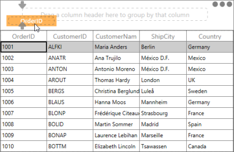
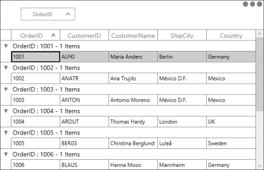
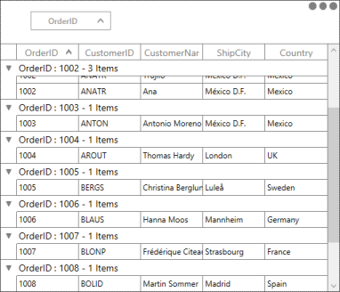
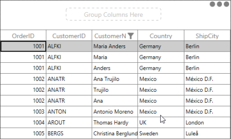

# Grouping

This section explains you how to group the columns in DataGrid. Different properties, events and methods available for Grouping are discussed in this section.

### Overview

A Group represents a collection of records that belong to a particular category. The DataGrid control allows you to group the data by one or more columns. When Grouping is applied, the data is organized into a hierarchical structure based on matching field values. 

The records having identical values in the grouped column are combined to form a Group. Each Group is identified by its GroupCaptionRow that is expanded to get the underlying records into view. The GroupCaptionRow carries the information about a particular Group like the Group name, number of items (records) in the Group, etc. It also contains expander that allows you to expand or collapse the Groups individually.

### Properties

The following are the properties used while Grouping.

_Grouping property table_

<table>
<tr>
<td>
Property</td><td>
Type</td><td>
Description</td><td>
Default Value</td></tr>
<tr>
<td>
SfDataGrid.AllowGrouping</td><td>
Boolean</td><td>
Gets or sets a value indicating whether the DataGrid data is grouped by dragging and dropping the column header into GroupDropArea.</td><td>
True</td></tr>
<tr>
<td>
SfDataGrid.AllowFrozenGroupHeaders</td><td>
Boolean</td><td>
Enable or disable the GroupCaptions whether it is freezed while scrolling the DataGrid vertically.</td><td>
False</td></tr>
<tr>
<td>
SfDataGrid.GroupColumnDescriptions</td><td>
ObservableCollection&lt;GroupColumnDescription&gt;</td><td>
Gets the collection of grouped column in DataGrid </td><td>
</td></tr>
<tr>
<td>
SfDataGrid. ShowColumnWhenGrouped</td><td>
Boolean</td><td>
Enables or disables columns shown in header after grouping. </td><td>
True</td></tr>
<tr>
<td>
SfDataGrid.AutoExpandGroups</td><td>
Boolean</td><td>
Specifies the value indicating whether to expand the groups automatically, when column is grouped.</td><td>
False</td></tr>
<tr>
<td>
SfDataGrid.ShowGroupDropArea</td><td>
Boolean</td><td>
Specifies a value that indicates whether GroupDropArea is visible in DataGrid.</td><td>
False</td></tr>
<tr>
<td>
SfDataGrid.IsGroupDropAreaExpanded</td><td>
Boolean</td><td>
Determines a value that indicates whether GroupDropArea is expanded while Grid loads.{{ '' | markdownify }}

{{ '_Note: This property gets effective when SfDataGrid.ShowGroupDropArea property is set to ‘true’._' | markdownify }}</td><td>
False</td></tr>
<tr>
<td>
GridColumn.AllowGrouping</td><td>
Boolean</td><td>
Defines a value that indicates whether the DataGrid is grouped by a column when you drag the column header to GroupDropArea.</td><td>
True</td></tr>
</table>

> _Note: GridColumn.AllowGrouping takes higher priority than DataGrid.AllowGrouping.  When you set AllowGrouping to ‘true’ in DataGrid and AllowGrouping to ‘false’ for particular column then that column is not grouped._

The following screenshot illustrates Group or Ungroup the Column in different ways. DataGrid allows you to group the column in following ways:

* Drag and Drop the column header to GroupDropArea

_DataGrid Grouping by dragging and dropping column header to GroupDropArea_

* By adding the GroupColumnDescription object to SfDataGrid,GroupColumnDescriptions__collections in code contains the following properties:
* ColumnName: Corresponding column name for Grouping.
* Converter: Get the IValueConverter as input that helps to apply the custom grouping.

DataGrid control allows you to add more than one entry in SfDataGrid.GroupColumnDescriptions collection. More than one entry creates the Nested groups and Hierarchical structure.

The following code example illustrates how to perform grouping in XAML.



[XAML]

<Window x:Class="SimpleApplication.MainWindow"

        xmlns="http://schemas.microsoft.com/winfx/2006/xaml/presentation"

        xmlns:x="http://schemas.microsoft.com/winfx/2006/xaml"

        xmlns:Linq="clr-namespace:Syncfusion.Data;assembly=Syncfusion.Data.WPF"

        xmlns:local="clr-namespace:SimpleApplication"

        xmlns:syncfusion="http://schemas.syncfusion.com/wpf"

        Title="MainWindow"

        Width="525"

        Height="200">

    <Window.Resources>

        <local:OrderInfoRepositiory x:Key="data" />

    </Window.Resources>

    <syncfusion:SfDataGrid x:Name="sfdatagrid"

                           AllowGrouping="True"

                           AutoExpandGroups="True"

                           AutoGenerateColumns="True"

                           ColumnSizer="Star"

                           ItemsSource="{Binding OrderInfoCollection,

                                                 Source={StaticResource data}}"

                           ShowGroupDropArea="True">

<syncfusion:SfDataGrid.GroupColumnDescriptions>

<syncfusion:GroupColumnDescription ColumnName="OrderID" />

</syncfusion:SfDataGrid.GroupColumnDescriptions>

    </syncfusion:SfDataGrid>

</Window>




[C#]

sfdatagrid.AllowGrouping = true;

sfdatagrid.ShowGroupDropArea = true;

sfdatagrid.GroupColumnDescriptions.Add(new GroupColumnDescription() { ColumnName = "OrderID" });



The following screenshot displays the output.

_DataGrid with Grouped columns_

### Ungroup the Column

You can ungroup the grouped column in following ways:

* Drag and Drop the corresponding GroupDropAreaItem to column header.

_Ungrouping the column by dragging and dropping the corresponding GroupDropAreaItem to column header._

* Click the close button in GroupDropAreaItem.

_Ungrouping the column by clicking the close button in GroupDropAreaItem_

* Remove the corresponding GroupColumnDescription entry from SfDataGrid.GroupColoumnDescriptions Collection.


[C#]

sfdatagrid.GroupColumnDescriptions.Remove(sfdatagrid.GroupColumnDescriptions.ElementAt(0));

// OR

sfdatagrid.GroupColumnDescriptions.RemoveAt(0);

// OR

var groups = sfdatagrid.GroupColumnDescriptions;

for (int i = groups.Count-1; i >= 0 ; i--)

{

    sfdatagrid.GroupColumnDescriptions.RemoveAt(i);

}



* You can sort grouped columns by using sort indicator in GroupDropAreaItem when you set ShowColumnWhenGrouped to ‘false’.

_Sorted Grouped Columns using sorting indicator in GroupDropAreaItem_

You can freeze the Grouped header. DataGrid provide an interactive support to Freeze the group caption header while scrolling the Grid vertically. Set SfDataGrid_._AllowFrozenGroupHeaders property to ‘true’ in SfDataGrid. The following code example illustrates how to freeze the group caption header. 



[XAML]

<Window x:Class="SimpleApplication.MainWindow"

        xmlns="http://schemas.microsoft.com/winfx/2006/xaml/presentation"

        xmlns:x="http://schemas.microsoft.com/winfx/2006/xaml"

        xmlns:Linq="clr-namespace:Syncfusion.Data;assembly=Syncfusion.Data.WPF"

        xmlns:local="clr-namespace:SimpleApplication"

        xmlns:syncfusion="http://schemas.syncfusion.com/wpf"

        Title="MainWindow"

        Width="525"

        Height="200">

    <Window.Resources>

        <local:OrderInfoRepositiory x:Key="data" />

    </Window.Resources>

    <syncfusion:SfDataGrid x:Name="sfdatagrid"

                           AllowFrozenGroupHeaders="True"

                           AllowGrouping="True"

                           AutoExpandGroups="True"

                           AutoGenerateColumns="False"

                           ColumnSizer="Star"

                           ItemsSource="{Binding OrderInfoCollection,

                                                 Source={StaticResource data}}"

                           ShowColumnWhenGrouped="True"

                           ShowGroupDropArea="True">

        <syncfusion:SfDataGrid.Columns>

            <syncfusion:GridTextColumn MappingName="OrderID" />

            <syncfusion:GridTextColumn AllowGrouping="False" MappingName="CustomerID" />

            <syncfusion:GridTextColumn MappingName="CustomerName" />

            <syncfusion:GridTextColumn MappingName="ShipCity" />

            <syncfusion:GridTextColumn MappingName="Country" />

        </syncfusion:SfDataGrid.Columns>

        <syncfusion:SfDataGrid.GroupColumnDescriptions>

            <syncfusion:GroupColumnDescription ColumnName="OrderID" />

        </syncfusion:SfDataGrid.GroupColumnDescriptions>

    </syncfusion:SfDataGrid>

</Window>


The following screenshot displays the output.

_Freezed group caption header_

The following statements describe you the methods that participate in Expand and Collapse of groups. DataGrid control enables you to expand or collapse the Group by clicking the expander or Group Caption Row. The following methods help to Expand or Collapse the groups in code behind:

* SfDataGrid.ExpandAllGroup(): This method enables you to expand all the groups.
* SfDataGrid.CollapseAllGroup():This method enables you to collapse all the groups.
* SfDataGrid.ExpandGroupsAtLevel(int level): This method expands Group at particular level.
* SfDataGrid.CollapseGroupsAtLevel(int level): This method collapses Group at particular level.
* SfDataGrid.CollapseAllGroup():This method collapses the group at particular level.
* SfDataGrid.ExpandGroup(Group group): This method expands the particular group.
* SfDataGrid.CollapseGroup(Group group): This method collapses the particular group.

The following code example explains you how to call the methods. You can call the methods when the Grid is loading or after the Grid is loaded. 



[C#]

void sfdatagrid_Loaded(object sender, RoutedEventArgs e)

{

    // To Expand or Collapse all groups.

    sfdatagrid.ExpandAllGroup();

    sfdatagrid.CollapseAllGroup();

    // To Expand or Collapse group at level.

    sfdatagrid.ExpandGroupsAtLevel(1);

    sfdatagrid.CollapseGroupsAtLevel(1);

    // To Expand or Collapse particular group.

    var group = (sfdatagrid.View.Groups[0] as Group); 

    sfdatagrid.ExpandGroup(group);

    sfdatagrid.CollapseGroup(group);

}


The following statements describe you the events that participate in Grouping. DataGrid control provides the following events when you expand or collapse the group or when you try to expand particular group these events are called.

* SfDataGrid.GroupExpanding: This event is raised when the group starts to expand that allows you to cancel the expanding action.
* SfDataGrid.GroupExpnaded: This event is raised when the group is expanded.
* SfDataGrid.GroupCollapsing: This event is raised when the group starts to collapse that allows you to cancel the collapsing action.
* SfDataGrid.GroupCollapsed: This event is raised when the group is collapsed. 

You can use this event to cancel Expand or Collapse action by setting cancel to ‘true’. 



[XAML]

<syncfusion:SfDataGrid x:Name="sfdatagrid"

                       AllowGrouping="True"

                       AutoGenerateColumns="True"

                       ColumnSizer="Star"

                       GroupExpanding="sfdatagrid_GroupExpanding"

                       ItemsSource="{Binding OrderInfoCollection}"

                       ShowGroupDropArea="True" />




[C#]

// To Hook Event

sfdatagrid.GroupExpanding +=sfdatagrid_GroupExpanding; 

// To Expand particular group at Execute time.

var group = (sfdatagrid.View.Groups[0] as Group); 

sfdatagrid.ExpandGroup(group);

// To cancel expand

private void sfdatagrid_GroupExpanding(object sender, GroupChangingEventArgs e)

{

    e.Cancel = true;

}



> _Note: These events do not hit when you use ExpandAllGroup (), CollapseAllGroup (), ExpandGroupsAtLevel () and CollapseGropsAtLevel () methods._

### Custom Grouping

CustomGrouping feature enables you to implement CustomGrouping criteria. For each column, you can apply different Grouping criteria.

To achieve the CustomGrouping, you can write the converter that implements IValueConverter, with your CustomGrouping logic. Assign that converter to GroupColumnDescription.Converter__property.

The following code example illustrates the converter used for CustomGrouping.



[C#]

// DataGrid groups the column against return value of this converter.

public class GroupDataTimeConverter : IValueConverter

{

    public object Convert(object value, System.Type targetType, object parameter, CultureInfo culture)

    {

        var saleinfo = value as SalesByDate;

        var dt = DateTime.Now;

        var days = (int)Math.Floor((dt - saleinfo.Date).TotalDays);

        var dayofweek = (int)dt.DayOfWeek;

        var diff = days - dayofweek;

        if (days <= dayofweek)

        {

            if (days == 0)

                return "TODAY";

            if (days == 1)

                return "YESTERDAY";

            return saleinfo.Date.DayOfWeek.ToString().ToUpper();

        }

        if (diff > 0 && diff <= 7)

            return "LAST WEEK";

        if (diff > 7 && diff <= 14)

            return "TWO WEEKS AGO";

        if (diff > 14 && diff <= 21)

            return "THREE WEEKS AGO";

        if (dt.Year == saleinfo.Date.Year && dt.Month == saleinfo.Date.Month)

            return "EARLIER THIS MONTH";

        if (DateTime.Now.AddMonths(-1).Month == saleinfo.Date.Month)

            return "LAST MONTH";

        return "OLDER";

    }

    public object ConvertBack(object value, System.Type targetType, object parameter, CultureInfo culture)

    {

        throw new System.NotImplementedException();

    }

}



The following code example defines how to set the custom converter for group description.



[XAML]      

<Window.Resources>

<local:GroupDateTimeConverter x:Key="customGroupConverter">

</Window.Resources>

<syncfusion:SfDataGrid x:Name="sfGrid"

                       Margin="10,0,30,30"

                       AllowFrozenGroupHeaders="True"

                       AutoGenerateColumns="False"

                       ColumnSizer="Star"

                       GroupCaptionTextFormat=" {ColumnName}: {Key}"

                       ItemsSource="{Binding DailySalesDetails}"

                       NavigationMode="Row"

                       ShowColumnWhenGrouped="False">

    <syncfusion:SfDataGrid.GroupColumnDescriptions>

        <syncfusion:GroupColumnDescription ColumnName="Date" Converter="{StaticResource customGroupDateTimeConverter}" />

    </syncfusion:SfDataGrid.GroupColumnDescriptions>

</syncfusion:SfDataGrid>


The following screenshot displays the output.

_DataGrid with Custom Grouping_

### How To

#### How to customize GroupDropArea Text

You can customize GroupDropArea text by using GroupDropAreaText property. You can add this property to SfDataGrid and provide value in GroupDropArea. The following code example illustrates how to customize GroupDropArea Text.



[XAML]

<Window x:Class="SimpleApplication.MainWindow"

        xmlns="http://schemas.microsoft.com/winfx/2006/xaml/presentation"

        xmlns:x="http://schemas.microsoft.com/winfx/2006/xaml"

        xmlns:Linq="clr-namespace:Syncfusion.Data;assembly=Syncfusion.Data.WPF"

        xmlns:local="clr-namespace:SimpleApplication"

        xmlns:syncfusion="http://schemas.syncfusion.com/wpf"

        Title="MainWindow"

        Width="525"

        Height="200">

    <Window.DataContext>

        <local:OrderInfoRepositiory />

    </Window.DataContext>

    <syncfusion:SfDataGrid x:Name="sfdatagrid"

                           AllowGrouping="True"

                           AutoGenerateColumns="True"

                           ColumnSizer="Star"

                           GroupDropAreaText="Group Columns Here"

                           IsGroupDropAreaExpanded="True"

                           ItemsSource="{Binding OrderInfoCollection}"

                           ShowGroupDropArea="True" />

</Window>



The following screenshot displays Group Columns as GroupDropAreaText in GroupDropArea.

_Group Columns as GroupDropArea Text in GroupDropArea_