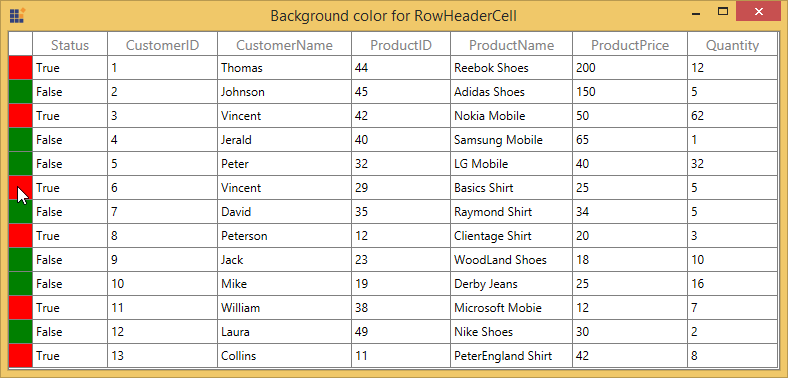
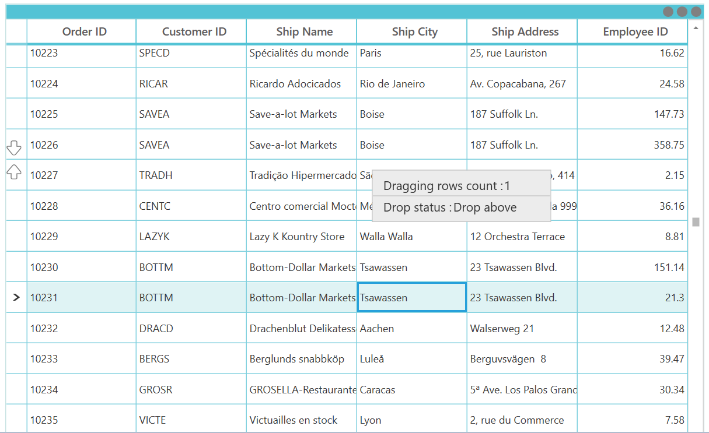

# Interactive Features

## ContextMenu

SfDataGrid provides an entirely customizable menu to expose the functionality on user interface. You can create context menus for different rows in an efficient manner. 

The below code example shows the context menu with command bindings.




<ContextMenu Style="{x:Null}">
    <MenuItem Command="{Binding CopyCommand,Source={StaticResource employeeInfoViewModel}}" 
          CommandParameter="{Binding}" Header="Copy">
    </MenuItem>
</ContextMenu>






public class BaseCommand : ICommand
{

    #region Fields
    readonly Action<object> _execute;
    readonly Predicate<object> _canExecute;
    #endregion

    #region Constructors
    /// 

    /// Creates a new command that can always execute.
    /// 

    /// <param name="execute">The execution logic.</param>

    public BaseCommand(Action<object> execute)
        : this(execute, null)
    {
    }

    /// 

    /// Creates a new command.
    /// 

    /// <param name="execute">The execution logic.</param>
    /// <param name="canExecute">The execution status logic.</param>

    public BaseCommand(Action<object> execute, Predicate<object> canExecute)
    {

        if (execute == null)
        throw new ArgumentNullException("execute");
        _execute = execute;
        _canExecute = canExecute;
    }
    #endregion
    
    #region ICommand Members

    public bool CanExecute(object parameter)
    {
        return _canExecute == null ? true : _canExecute(parameter);
    }
    
    public event EventHandler CanExecuteChanged
    {
        add { CommandManager.RequerySuggested += value; }
        remove { CommandManager.RequerySuggested -= value; }
    }

    public void Execute(object parameter)
    {
        _execute(parameter);
    }
    
    #endregion
}

public class EmployeeInfoViewModel : INotifyPropertyChanged
{

    public EmployeeInfoViewModel()
    {
        CopyCommand = new ContextMenuDemo.BaseCommand(ShowMessage);
    }
    
    private ICommand copyCommand

    public ICommand CopyCommand
    {
        get
        {
            return copyCommand;
        }
        set
        {
            copyCommand = value;
        }
    }
    
    public void ShowMessage(object obj)
    {

        if (obj is GridRecordContextMenuInfo)
        {
            var grid = (obj as GridRecordContextMenuInfo).DataGrid;
            grid.GridCopyPaste.Copy();
        }
    }
}




### ContextMenu based on rows

You can set different context menu for SfDataGrid based on rows.

#### ContextMenu for Records

You can set the context menu for the data rows by using [SfDataGrid.RecordContextMenu](https://help.syncfusion.com/cr/cref_files/wpf/Syncfusion.SfGrid.WPF~Syncfusion.UI.Xaml.Grid.SfGridBase~RecordContextMenu.html) property. 




<syncfusion:SfDataGrid.RecordContextMenu>
    <ContextMenu>
        <MenuItem x:Name="Cut" Header="Cut" />
        <MenuItem x:Name="Copy" Header="Copy"  />
        <MenuItem x:Name="Paste" Header="Paste" />
        <MenuItem x:Name="Delete" Header="Delete" />
    </ContextMenu>
</syncfusion:SfDataGrid.RecordContextMenu>





this.dataGrid.RecordContextMenu = new ContextMenu();
this.dataGrid.RecordContextMenu.Items.Add(new MenuItem() { Header = "Cut" });
this.dataGrid.RecordContextMenu.Items.Add(new MenuItem() { Header = "Copy" });
this.dataGrid.RecordContextMenu.Items.Add(new MenuItem() { Header = "Paste" });
this.dataGrid.RecordContextMenu.Items.Add(new MenuItem() { Header = "Delete" });




While binding the menu item using CommandBinding you can get the command parameter as `GridRecordContextMenuInfo` which contains the record of the corresponding row.




<syncfusion:SfDataGrid.RecordContextMenu>
    <MenuItem Command="{Binding Source={x:Static Member=local:ContextMenuCommands.Copy}}"
              CommandParameter="{Binding}"
              Header="Copy">
    </MenuItem>
</syncfusion:SfDataGrid.RecordContextMenu>





private static void OnCopyClicked(object obj)
{

    if (obj is GridRecordContextMenuInfo)
    {
        var grid = (obj as GridRecordContextMenuInfo).DataGrid;
        var record = (obj as GridRecordContextMenuInfo).Record;
        grid.GridCopyPaste.Copy();
    }
}




#### ContextMenu for Header

You can set the context menu for the header by using [SfDataGrid.HeaderContextMenu](https://help.syncfusion.com/cr/cref_files/wpf/Syncfusion.SfGrid.WPF~Syncfusion.UI.Xaml.Grid.SfGridBase~HeaderContextMenu.html) property. 



<syncfusion:SfDataGrid.HeaderContextMenu>
    <ContextMenu>
        <MenuItem x:Name=" SortAscending " Header="SortAscending" />
        <MenuItem x:Name=" SortDescending " Header="SortDescending" />
        <MenuItem x:Name=" ClearSorting " Header="ClearSorting" />
        <MenuItem x:Name=" ClearFiltering " Header="ClearFiltering" />
        <MenuItem x:Name=" Group by this column " Header="Group by this column" />
        <MenuItem x:Name=" Expand/Collapse Group Drop Area " Header="Expand/Collapse Group Drop Area" />
        <MenuItem x:Name=" BestFit " Header="BestFit" />
    </ContextMenu>
</syncfusion:SfDataGrid.HeaderContextMenu>





this.dataGrid.HeaderContextMenu = new ContextMenu();
this.dataGrid.HeaderContextMenu.Items.Add(new MenuItem() { Header = "SortAscending" });
this.dataGrid.HeaderContextMenu.Items.Add(new MenuItem() { Header = "SortDescending" });
this.dataGrid.HeaderContextMenu.Items.Add(new MenuItem() { Header = "ClearSorting" });
this.dataGrid.HeaderContextMenu.Items.Add(new MenuItem() { Header = " ClearFiltering " });
this.dataGrid.HeaderContextMenu.Items.Add(new MenuItem() { Header = "Group by this column" });
this.dataGrid.HeaderContextMenu.Items.Add(new MenuItem() { Header = "Expand/Collapse Group Drop Area" });
this.dataGrid.HeaderContextMenu.Items.Add(new MenuItem() { Header = "BestFit" });




While binding the menu item using CommandBinding you can get the parameter as `GridColumnContextMenuInfo` which contains the particular GridColumn.




<syncfusion:SfDataGrid.HeaderContextMenu>
    <MenuItem Command="{Binding Source={x:Static Member=local:ContextMenuCommands.SortAscending}}"
              CommandParameter="{Binding}"
              Header="Sort Ascending">
    </MenuItem>
</syncfusion:SfDataGrid.HeaderContextMenu>





private static void OnSortAscendingClicked(object obj)
{

    if (obj is GridColumnContextMenuInfo)
    {
        var grid = (obj as GridContextMenuInfo).DataGrid;
        var column = (obj as GridColumnContextMenuInfo).Column;
        grid.SortColumnDescriptions.Clear();
        grid.SortColumnDescriptions.Add(new SortColumnDescription() { ColumnName = column.MappingName, SortDirection = ListSortDirection.Ascending });
    }
}




#### ContextMenu for GroupDropArea

You can set the context menu for the GroupDropArea by using [SfDataGrid.GroupDropAreaContextMenu](http://help.syncfusion.com/cr/cref_files/wpf/Syncfusion.SfGrid.WPF~Syncfusion.UI.Xaml.Grid.SfDataGrid~GroupDropAreaContextMenu.html) property. 




<syncfusion:SfDataGrid.GroupDropAreaContextMenu>
    <ContextMenu>
        <MenuItem x:Name=" ExpandAll " Header="ExpandAll" />
        <MenuItem x:Name=" CollapseAll " Header="CollapseAll" />
        <MenuItem x:Name=" ClearGroups " Header="ClearGroups" />
    </ContextMenu>
</syncfusion:SfDataGrid.GroupDropAreaContextMenu>





this.dataGrid.GroupDropAreaContextMenu = new ContextMenu();
this.dataGrid.GroupDropAreaContextMenu.Items.Add(new MenuItem() { Header = "ExpandAll" });
this.dataGrid.GroupDropAreaContextMenu.Items.Add(new MenuItem() { Header = "CollapseAll" });
this.dataGrid.GroupDropAreaContextMenu.Items.Add(new MenuItem() { Header = "ClearGroups" });




While binding the menu item using CommandBinding you can get the parameter as `GroupDropAreaContextMenuInfo`. 




<syncfusion:SfDataGrid.GroupDropAreaContextMenu>
    <MenuItem Command="{Binding Source={x:Static Member=local:ContextMenuCommands.ExpandAll}}"
              CommandParameter="{Binding}"
              Header="Expand All">
    </MenuItem>
</syncfusion:SfDataGrid.GroupDropAreaContextMenu>





private static void OnFullExpandClicked(object obj)
{
 
    if (obj is Syncfusion.UI.Xaml.Grid.GridContextMenuInfo)
    {
        var grid = (obj as Syncfusion.UI.Xaml.Grid.GridContextMenuInfo).DataGrid;
        grid.ExpandAllGroup();
    }
}




#### ContextMenu for GroupDropItem

You can set the context menu for the group drop item by using [SfDataGrid.GroupDropItemContextMenu](http://help.syncfusion.com/cr/cref_files/wpf/Syncfusion.SfGrid.WPF~Syncfusion.UI.Xaml.Grid.SfDataGrid~GroupDropItemContextMenu.html) property. 




<syncfusion:SfDataGrid.GroupDropItemContextMenu>
    <ContextMenu>
        <MenuItem x:Name=" ExpandAll " Header="ExpandAll" />
        <MenuItem x:Name=" CollapseAll " Header="CollapseAll" />
        <MenuItem x:Name=" SortAscending " Header="SortAscending" />
        <MenuItem x:Name=" SortDescending " Header="SortDescending" />
        <MenuItem x:Name=" ClearGroup " Header="ClearGroup" />
        <MenuItem x:Name=" ClearSorting " Header="ClearSorting" />
    </ContextMenu>
</syncfusion:SfDataGrid.GroupDropItemContextMenu>





this.dataGrid.GroupDropItemContextMenu = new ContextMenu();
this.dataGrid.GroupDropItemContextMenu.Items.Add(new MenuItem() { Header = "ExpandAll" });
this.dataGrid.GroupDropItemContextMenu.Items.Add(new MenuItem() { Header = "CollapseAll" });
this.dataGrid.GroupDropItemContextMenu.Items.Add(new MenuItem() { Header = "SortAscending" });
this.dataGrid.GroupDropItemContextMenu.Items.Add(new MenuItem() { Header = "SortDescending" });
this.dataGrid.GroupDropItemContextMenu.Items.Add(new MenuItem() { Header = "ClearGroup" });
this.dataGrid.GroupDropItemContextMenu.Items.Add(new MenuItem() { Header = "ClearSorting" });




While binding the menu item using CommandBinding you can get the parameter as `GridColumnContextMenuInfo` which contains the particular GridColumn.




<syncfusion:SfDataGrid.GroupDropItemContextMenu>                            
    <MenuItem Command="{Binding Source={x:Static Member=local:ContextMenuCommands.CollapseAll}}"
              CommandParameter="{Binding}"
              Header="Collapse All">
    </MenuItem>
</syncfusion:SfDataGrid.GroupDropItemContextMenu>





private static void OnFullCollapseClicked(object obj)
{

    if (obj is GridContextMenuInfo)
    {
        var grid = (obj as GridContextMenuInfo).DataGrid;
        grid.CollapseAllGroup();
    }
}




#### ContextMenu for GroupCaptionSummaryRow

You can set the context menu for the group caption by using [SfDataGrid.GroupCaptionContextMenu](http://help.syncfusion.com/cr/cref_files/wpf/Syncfusion.SfGrid.WPF~Syncfusion.UI.Xaml.Grid.SfDataGrid~GroupCaptionContextMenu.html) property. 




<syncfusion:SfDataGrid.GroupCaptionContextMenu>
    <ContextMenu>
        <MenuItem x:Name=" Expand " Header="Expand" />
        <MenuItem x:Name=" Collapse " Header="Collapse" />
    </ContextMenu>
</syncfusion:SfDataGrid.GroupCaptionContextMenu>





this.dataGrid.GroupCaptionContextMenu = new ContextMenu();
this.dataGrid.GroupCaptionContextMenu.Items.Add(new MenuItem() { Header = "Expand" });
this.dataGrid.GroupCaptionContextMenu.Items.Add(new MenuItem() { Header = "Collapse" });




While binding the menu item using CommandBinding you can get the command parameter as `GridRecordContextMenuInfo` which contains the record of the corresponding row.




<syncfusion:SfDataGrid.GroupCaptionContextMenu>
    <MenuItem Command="{Binding Source={x:Static Member=local:ContextMenuCommands.Expand}}"
              CommandParameter="{Binding}"
              Header="Expand" />
</syncfusion:SfDataGrid.GroupCaptionContextMenu>





private static void OnExpandClicked(object obj)
{
 
    if (obj is GridRecordContextMenuInfo)
    {   
        var grid = (obj as GridRecordContextMenuInfo).DataGrid;
        var group = (obj as GridRecordContextMenuInfo).Record as Group;
        grid.ExpandGroup(group);
    }
}




#### ContextMenu for GroupSummaryRow

You can set the context menu for the group summary by using [SfDataGrid.GroupSummaryContextMenu](http://help.syncfusion.com/cr/cref_files/wpf/Syncfusion.SfGrid.WPF~Syncfusion.UI.Xaml.Grid.SfDataGrid~GroupSummaryContextMenu.html) property. 




<syncfusion:SfDataGrid.GroupSummaryContextMenu>
    <ContextMenu>
        <MenuItem x:Name="ClearSummary" Header="ClearSummary" />
    </ContextMenu>
</syncfusion:SfDataGrid.GroupSummaryContextMenu>





this.dataGrid.GroupSummaryContextMenu = new ContextMenu();
this.dataGrid.GroupSummaryContextMenu.Items.Add(new MenuItem() { Header = "ClearSummary" });




While binding the menu item using CommandBinding you can get the command parameter as `GridRecordContextMenuInfo` which contains the record of the corresponding row.




<syncfusion:SfDataGrid.GroupSummaryContextMenu>
    <MenuItem Command="{Binding Source={x:Static Member=local:ContextMenuCommands.ClearSummary}}"
              CommandParameter="{Binding}"
              Header="Clear Summary">
    </MenuItem>
</syncfusion:SfDataGrid.GroupSummaryContextMenu>





private static void OnClearSummaryClicked(object obj)
{
 
    if (obj is GridRecordContextMenuInfo)
    {
        var grid = (obj as GridRecordContextMenuInfo).DataGrid;
  
        if (grid.GroupSummaryRows.Any())
        grid.GroupSummaryRows.Clear();
    }
}




#### ContextMenu for TableSummaryRow

You can set the context menu for the table summary by using [SfDataGrid.TableSummaryContextMenu](http://help.syncfusion.com/cr/cref_files/wpf/Syncfusion.SfGrid.WPF~Syncfusion.UI.Xaml.Grid.SfDataGrid~TableSummaryContextMenu.html) property. 




<syncfusion:SfDataGrid.TableSummaryContextMenu>
    <ContextMenu>
        <MenuItem x:Name="TableSummaryCount" Header="Count" />
        <MenuItem x:Name="TableSummaryMax" Header="Max" />
        <MenuItem x:Name="TableSummaryMin" Header="Min" />
        <MenuItem x:Name="TableSummaryMin" Header="Average" />
        <MenuItem x:Name="TableSummaryMin" Header="Sum" />
    </ContextMenu>
</syncfusion:SfDataGrid.TableSummaryContextMenu>





this.dataGrid.TableSummaryContextMenu = new ContextMenu();
this.dataGrid.TableSummaryContextMenu.Items.Add(new MenuItem() { Header = "Count" });
this.dataGrid.TableSummaryContextMenu.Items.Add(new MenuItem() { Header = "Max" });
this.dataGrid.TableSummaryContextMenu.Items.Add(new MenuItem() { Header = "Min" });
this.dataGrid.TableSummaryContextMenu.Items.Add(new MenuItem() { Header = "Average" });
this.dataGrid.TableSummaryContextMenu.Items.Add(new MenuItem() { Header = "Sum" });




While binding the menu item using CommandBinding you can get the command parameter as `GridRecordContextMenuInfo` which contains the record of the corresponding row.




<syncfusion:SfDataGrid.TableSummaryContextMenu>
    <MenuItem Command="{Binding Source={x:Static Member=local:ContextMenuCommands.TotalSummaryCount}}"
              CommandParameter="{Binding}"
              Header="Count">
    </MenuItem>
</syncfusion:SfDataGrid.TableSummaryContextMenu>





private static void OnTotalSummaryCountClicked(object obj)
{

    if (obj is GridRecordContextMenuInfo)
    {
        var grid = (obj as GridRecordContextMenuInfo).DataGrid;
        var record = (obj as GridRecordContextMenuInfo).Record as SummaryRecordEntry;

        if (record != null)
        {
            var summaryRow = new GridSummaryRow() { Name = "totalGroupSummaryRow", Title = "{totalSummary}", ShowSummaryInRow = true };
            summaryRow.SummaryColumns.Add(new GridSummaryColumn() { Name = "totalSummary", MappingName = "EmployeeId", SummaryType = SummaryType.CountAggregate, Format = "Total Employee Count : {Count}" });
            grid.TableSummaryRows.Clear();
            grid.TableSummaryRows.Add(summaryRow);
        }
    }
}




### Events

#### GridContextMenuOpening

[GridContextMenuOpening](http://help.syncfusion.com/cr/cref_files/wpf/Syncfusion.SfGrid.WPF~Syncfusion.UI.Xaml.Grid.SfDataGrid~GridContextMenuOpening_EV.html) event occurs while opening the context menu in SfDataGrid. 

[GridContextMenuEventArgs](http://help.syncfusion.com/cr/cref_files/wpf/Syncfusion.SfGrid.WPF~Syncfusion.UI.Xaml.Grid.GridContextMenuEventArgs.html) has the following members which provides the information about `GridContextMenuOpening` event.

[ContextMenu](http://help.syncfusion.com/cr/cref_files/wpf/Syncfusion.SfGrid.WPF~Syncfusion.UI.Xaml.Grid.GridContextMenuEventArgs~ContextMenu.html) – Gets the corresponding context menu.

[ContextMenuInfo](http://help.syncfusion.com/cr/cref_files/wpf/Syncfusion.SfGrid.WPF~Syncfusion.UI.Xaml.Grid.GridContextMenuEventArgs~ContextMenuInfo.html) – Returns the context menu info based on the row which opens the context menu.

[ContextMenuType](http://help.syncfusion.com/cr/cref_files/wpf/Syncfusion.SfGrid.WPF~Syncfusion.UI.Xaml.Grid.GridContextMenuEventArgs~ContextMenuType.html) – Returns the type of context menu.

[RowColumnIndex](http://help.syncfusion.com/cr/cref_files/wpf/Syncfusion.SfGrid.WPF~Syncfusion.UI.Xaml.Grid.GridContextMenuEventArgs~RowColumnIndex.html) – RowColumnIndex of the context menu which is currently going to open. RowColumnIndex is updated only for the RecordContextMenu and remains left empty.

[Handled](http://help.syncfusion.com/cr/cref_files/wpf/Syncfusion.SfGrid.WPF~Syncfusion.UI.Xaml.Grid.GridHandledEventArgs~Handled.html) – Indicates whether the `GridContextMenuOpening` event is handled or not.

### Customization of context menu

#### Change the menu item when the context menu opening.

You can use the GridContextMenuOpening event to change the menu item when the context menu opening.




<syncfusion:SfDataGrid.RecordContextMenu>
    <ContextMenu>
        <MenuItem Command="{Binding Source={x:Static Member=local:ContextMenuCommands.Cut}}"
                  CommandParameter="{Binding}"
                  Header="Cut">
        </MenuItem>
        <MenuItem Command="{Binding Source={x:Static Member=local:ContextMenuCommands.Copy}}"
                  CommandParameter="{Binding}"
                  Header="Copy">
        </MenuItem>
        <MenuItem Command="{Binding Source={x:Static Member=local:ContextMenuCommands.Paste}}"
                  CommandParameter="{Binding}"
        Header="Paste">
        </MenuItem>
    </ContextMenu>
</syncfusion:SfDataGrid.RecordContextMenu>





this.dataGrid.GridContextMenuOpening += dataGrid_GridContextMenuOpening;

void dataGrid_GridContextMenuOpening(object sender, GridContextMenuEventArgs e)
{
    e.ContextMenu.Items.Clear();

    if(e.ContextMenuType == ContextMenuType.RecordCell)
    {
        e.ContextMenu.Items.Add(new MenuItem() { Header="Record"});
        e.ContextMenu.Items.Add(new MenuItem() { Header = "Data" });
    }
}



       

#### Changing background to the ContextMenu

You can change the appearance of the context menu by customizing the style with TargetType as ContextMenu.




<ContextMenu>
    <MenuItem x:Name="Cut" Header="Cut" />
    <MenuItem x:Name="Copy" Header="Copy" />
    <MenuItem x:Name="Paste" Header="Paste" />
</ContextMenu>




## ColumnChooser

SfDataGrid allows you to show and hide the Columns from the view at runtime via drag and drop using ColumnChooser. You can enable a column chooser in an application by creating an instance for GridColumnChooserController and assign to SfDataGrid.GridColumnDragDropController.

While dropping columns in ColumnChooser window, the particular column will be hidden by setting GridColumn.IsHidden as true.




ColumnChooser chooserWindow;

void MainWindow_Loaded(object sender, RoutedEventArgs e)
{
    chooserWindow = new ColumnChooser(this.dataGrid);
    chooserWindow.Resources.MergedDictionaries.Clear();
    chooserWindow.ClearValue(ColumnChooser.StyleProperty);

    //Resources has been added to the Merged Dictionaries     
    chooserWindow.Resources.MergedDictionaries.Add(this.MainGrid.Resources.MergedDictionaries[0]);
    this.dataGrid.GridColumnDragDropController = new GridColumnChooserController(this.dataGrid, chooserWindow);

    //ColumnChooser Window will open
    chooserWindow.Show();
    chooserWindow.Owner = this;
}




### Custom ColumnChooser

You can create custom UI for the column chooser and you can enable this view manually like below code example. You need to maintain separate collection in ViewModel to maintain the hidden columns which will bound to custom view.




<syncfusion:ChromelessWindow >    
    <Grid>
        <Grid.RowDefinitions>
            <RowDefinition Height="*" />
            <RowDefinition Height="50" />
        </Grid.RowDefinitions>
        <ListBox x:Name="listBox"
                 Grid.Row="0"
                 Margin="0,5"
                 HorizontalAlignment="Stretch"
                 BorderThickness="0"
                 ItemContainerStyle="{StaticResource ListBoxItemStyle1}"
                 ItemsSource="{Binding ColumnCollection}">
            <ListBox.ItemTemplate>
                <StaticResource ResourceKey="MyDataTemplate" />
            </ListBox.ItemTemplate>
        </ListBox>
        <StackPanel Grid.Row="1" Margin="20,0,0,0"
                    VerticalAlignment="Stretch"
                    Background="Transparent"
                    Orientation="Horizontal">
            <Button Margin="5"
                    Click="OKButton_Click"
                    Content="OK"
                    Style="{StaticResource ButtonStyle}" />
            <Button Margin="5"
                    Content="Cancel"
                    IsCancel="True"
                    Style="{StaticResource ButtonStyle}" />
        </StackPanel>
    </Grid>
    <syncfusion:ChromelessWindow.Resources>
        
        <SolidColorBrush x:Key="Item.MouseOver.Background" Color="#1F26A0DA" />
        <SolidColorBrush x:Key="Item.MouseOver.Border" Color="#a826A0Da" />
        <SolidColorBrush x:Key="Item.SelectedInactive.Background" Color="#3DDADADA" />
        <SolidColorBrush x:Key="Item.SelectedInactive.Border" Color="#FFDADADA" />
        <SolidColorBrush x:Key="Item.SelectedActive.Background" Color="#3D26A0DA" />
        <SolidColorBrush x:Key="Item.SelectedActive.Border" Color="#FF26A0DA" />
        
        //ListBoxItem is Customized through the DataTemplate
        
    </syncfusion:ChromelessWindow.Resources>
</syncfusion:ChromelessWindow>







var visibleColumns = this.AssociatedObject.dataGrid.Columns;
ObservableCollection<ColumnChooserItems> totalColumns = GetColumnsDetails(visibleColumns);
CustomColumnChooserViewModel chooserViewModel = new CustomColumnChooserViewModel(totalColumns);
CustomColumnChooser ColumnChooserView = new CustomColumnChooser(chooserViewModel);
ColumnChooserView.Owner = Application.Current.MainWindow;
chooserWindow.Visibility = System.Windows.Visibility.Collapsed;

if ((bool)ColumnChooserView.ShowDialog())
    ClickOKButton(chooserViewModel.ColumnCollection, this.AssociatedObject.dataGrid);
viewModel.ShowColumnChooser = false;

//This will add or remove the Columns from the SfDataGrid

public void ClickOKButton(ObservableCollection<ColumnChooserItems> ColumnCollection, SfDataGrid dataGrid)
{

    foreach (var item in ColumnCollection)
    {
        var column = dataGrid.Columns.FirstOrDefault(v => v.MappingName == item.Name);

        if (column != null)
        {

            if (item.IsChecked == false && !column.IsHidden)
            column.IsHidden = true;

            else if (item.IsChecked == true && column.IsHidden == true)
            {

                if (column.Width == 0)
                    column.Width = 150;
                column.IsHidden = false;
            }
        }
    }
viewModel.ShowColumnChooser = false;
}




### Appearance Customization

You can change the default appearance of the column chooser window by customizing the style of ColumnChooser. You can directly change the Title and WaterMarkText like the below code example.




ColumnChooser chooserWindow;

void MainWindow_Loaded(object sender, RoutedEventArgs e)
{
    chooserWindow = new ColumnChooser(this.dataGrid);
    chooserWindow.Resources.MergedDictionaries.Clear();
    chooserWindow.ClearValue(ColumnChooser.StyleProperty);            
    chooserWindow.Resources.MergedDictionaries.Add(this.MainGrid.Resources.MergedDictionaries[0]);
    this.dataGrid.GridColumnDragDropController = new GridColumnChooserController(this.dataGrid, chooserWindow);
    chooserWindow.Title = "Columns";
    chooserWindow.WaterMarkText = "Drag the columns";
    chooserWindow.Show();
    chooserWindow.Owner = this;
}




## RowHeader

RowHeader is a special type of column used to indicate the currently focused row, editing status, and validation status. You can enable the RowHeader by setting [SfDataGrid.ShowRowHeader](http://help.syncfusion.com/cr/cref_files/wpf/Syncfusion.SfGrid.WPF~Syncfusion.UI.Xaml.Grid.SfGridBase~ShowRowHeader.html) property to true. 




<syncfusion:SfDataGrid x:Name="dataGrid"
ShowRowHeader="True"
ItemsSource="{Binding Orders}"  />





dataGrid.ShowRowHeader = true;




You can change the default width of the RowHeader by using [SfDataGrid.RowHeaderWidth](http://help.syncfusion.com/cr/cref_files/wpf/Syncfusion.SfGrid.WPF~Syncfusion.UI.Xaml.Grid.SfGridBase~RowHeaderWidth.html) property.



<syncfusion:SfDataGrid x:Name="dataGrid"
                       ShowRowHeader="True"
                       RowHeaderWidth="50"
                       ItemsSource="{Binding Orders}"  />



dataGrid.RowHeaderWidth = 50;



### Customizing RowHeader 

#### Display the RowIndex to the RowHeaderCell

You can display the corresponding row index in each RowHeader, by customizing the ControlTemplate of GridRowHeaderCell. You have to bind the RowIndex property to TextBlock.Text like the below code example.







You can get the sample from [here](http://www.syncfusion.com/downloads/support/directtrac/general/ze/WPF-13678149272112665828.zip).

#### Change the CurrentRow Indicator

You can change the CurrentRowIndicator in the RowHeader by customizing the control template of GridRowHeaderCell.







You can get the sample from [here](http://www.syncfusion.com/downloads/support/directtrac/general/ze/ChangingCurrentRowIndicator257326168.zip).

#### Change the BackGround of the RowHeader 

You can change the background color of the RowHeader by customizing the style of the GridRowHeaderCell. You can change the background color with the converter based on the underlying collection.




<Application.Resources>       
    <local:CustomConverter x:Key="converter"/>
    <!--Customizing the RowHeader style--> 
    
</Application.Resources>





public class CustomConverter:IValueConverter
{
 
    public object Convert(object value, Type targetType, object parameter, System.Globalization.CultureInfo culture)
    {

        //Type casting the value as Data class(Business logic)
        var data = value as Data;

        //The Red color is applied to RowHeader if the status value is true otherwise the white color is applied 

        if (data.Status == true)
            return Brushes.Red;

        else
            return Brushes.Green;
    }
    
    public object ConvertBack(object value, Type targetType, object parameter, System.Globalization.CultureInfo culture)
    {
        throw new NotImplementedException();
    }
}




You can get the sample from [here](http://www.syncfusion.com/downloads/support/directtrac/general/ze/BackgroundColorForRowHeader_WPF18250214901515913833.zip).

## Drag and Drop Rows

SfDataGrid allows drag and drop the rows within and between controls by setting the [AllowDraggingRows](https://help.syncfusion.com/cr/cref_files/wpf/sfdatagrid/Syncfusion.SfGrid.WPF~Syncfusion.UI.Xaml.Grid.SfDataGrid~AllowDraggingRows.html) and [AllowDrop](https://msdn.microsoft.com/en-us/library/system.windows.uielement.allowdrop(v=vs.110).aspx) property as true. It is also possible to drag and drop the rows between datagrid and other controls such as ListView and SfTreeGrid. SfDataGrid allows dropping rows when AllowDrop is true and allows dragging when AllowDraggingRows is true.



<Syncfusion:SfDataGrid x:Name="datagrid" 
                               AllowDraggingRows="True"
                               AllowDrop="True"
                               ItemsSource="{Binding Source}"/>



this.datagrid.AllowDraggingRows = true;
this.datagrid.AllowDrop = true;



When dropping, the dragged records can be added above or below to the target record based on its drop position

For example, if you dropped record at the bottom of the targeted record, it will be added below the targeted record.

If you drop over the targeted record, it will be added as a child of that targeted record

### Dragging multiple rows

SfDataGrid allows to drag multiple selected rows. To enable multiple selection, set the [SfDataGrid.SelectionMode](https://help.syncfusion.com/cr/cref_files/wpf/sfdatagrid/Syncfusion.SfGrid.WPF~Syncfusion.UI.Xaml.Grid.SfGridBase~SelectionMode.html) as Multiple or Extended. 

N> The drag selection cannot be performed while the [AllowDraggingRows](https://help.syncfusion.com/cr/cref_files/wpf/sfdatagrid/Syncfusion.SfGrid.WPF~Syncfusion.UI.Xaml.Grid.SfDataGrid~AllowDraggingRows.html) enabled as true in the SfDataGrid.

### Events

SfDataGrid triggers the following events when drag and drop:

#### DragStart

[DragStart](https://help.syncfusion.com/cr/cref_files/wpf/Syncfusion.SfGrid.WPF~Syncfusion.UI.Xaml.Grid.GridRowDragDropController~DragStart_EV.html)  event occurs when you start to drag the records in datagrid. The [GridRowDragStartEventArgs](https://help.syncfusion.com/cr/cref_files/wpf/Syncfusion.SfGrid.WPF~Syncfusion.UI.Xaml.Grid.GridRowDragStartEventArgs.html)  has the following member, which provides information for the DragStart event.
[DraggingRecords](https://help.syncfusion.com/cr/cref_files/wpf/Syncfusion.SfGrid.WPF~Syncfusion.UI.Xaml.Grid.GridRowDragStartEventArgs~DraggingRecords.html): Gets the Records which contains the data associated while dragging the rows. 



this.sfDataGrid.RowDragDropController.DragStart += RowDragDropController_DragStart;

private void RowDragDropController_DragStart(object sender, GridRowDragStartEventArgs e)
{

}




#### DragOver

[DragOver](https://help.syncfusion.com/cr/cref_files/wpf/Syncfusion.SfGrid.WPF~Syncfusion.UI.Xaml.Grid.GridRowDragDropController~DragOver_EV.html) event occurs continuously while record is dragged within the target SfDataGrid. The [GridRowDragOverEventArgs](https://help.syncfusion.com/cr/cref_files/wpf/Syncfusion.SfGrid.WPF~Syncfusion.UI.Xaml.Grid.GridRowDragOverEventArgs.html) has the following members, which provide information for the DragOver event.
[Data](https://help.syncfusion.com/cr/cref_files/wpf/Syncfusion.SfGrid.WPF~Syncfusion.UI.Xaml.Grid.GridRowDragDropEventArgsBase~Data.html): Gets a data object that contains the data associated while dragging the rows. 
[DropPosition](https://help.syncfusion.com/cr/cref_files/wpf/Syncfusion.SfGrid.WPF~Syncfusion.UI.Xaml.Grid.GridRowDragDropEventArgsBase~DropPosition.html): Gets a value indicating the drop position which is based on dropped location 
[IsFromOutSideSource](https://help.syncfusion.com/cr/cref_files/wpf/Syncfusion.SfGrid.WPF~Syncfusion.UI.Xaml.Grid.GridRowDragDropEventArgsBase~IsFromOutSideSource.html): Gets a value indicating whether the dragging item is from same DataGrid or not.
[ShowDragUI](https://help.syncfusion.com/cr/cref_files/wpf/Syncfusion.SfGrid.WPF~Syncfusion.UI.Xaml.Grid.GridRowDragOverEventArgs~ShowDragUI.html): Gets or sets a value indicating the default Dragging UI.  
[TargetRecord](https://help.syncfusion.com/cr/cref_files/wpf/Syncfusion.SfGrid.WPF~Syncfusion.UI.Xaml.Grid.GridRowDragDropEventArgsBase~TargetRecord.html): Gets a value indicating the target record which is going to drop.



this.sfDataGrid.RowDragDropController.DragOver += RowDragDropController_DragOver;

private void RowDragDropController_DragOver(object sender, GridRowDragOverEventArgs e)
{
            
}




#### DragLeave

[DragLeave](https://help.syncfusion.com/cr/cref_files/wpf/Syncfusion.SfGrid.WPF~Syncfusion.UI.Xaml.Grid.GridRowDragDropController~DragLeave_EV.html) event occurs when leave a drag-and-drop operation.The [GridRowDragLeaveEventArgs](https://help.syncfusion.com/cr/cref_files/wpf/Syncfusion.SfGrid.WPF~Syncfusion.UI.Xaml.Grid.GridRowDragLeaveEventArgs.html) has the following members, which provide information for the DragLeave event.
[Data](https://help.syncfusion.com/cr/cref_files/wpf/Syncfusion.SfGrid.WPF~Syncfusion.UI.Xaml.Grid.GridRowDragDropEventArgsBase~Data.html): Gets a data object that contains the data associated while dragging the rows. 
[DropPosition](https://help.syncfusion.com/cr/cref_files/wpf/Syncfusion.SfGrid.WPF~Syncfusion.UI.Xaml.Grid.GridRowDragDropEventArgsBase~DropPosition.html): Gets a value indicating the drop position which is based on dropped location 
[IsFromOutSideSource](https://help.syncfusion.com/cr/cref_files/wpf/Syncfusion.SfGrid.WPF~Syncfusion.UI.Xaml.Grid.GridRowDragDropEventArgsBase~IsFromOutSideSource.html): Gets a value indicating whether the dragging item is from same DataGrid or not.
[TargetRecord](https://help.syncfusion.com/cr/cref_files/wpf/Syncfusion.SfGrid.WPF~Syncfusion.UI.Xaml.Grid.GridRowDragDropEventArgsBase~TargetRecord.html): Gets a value indicating the target record which is going to drop.



this.sfDataGrid.RowDragDropController.DragLeave += RowDragDropController_DragLeave;

private void RowDragDropController_DragLeave(object sender, GridRowDragLeaveEventArgs e)
{
            
}




#### Drop

[Drop](https://help.syncfusion.com/cr/cref_files/wpf/Syncfusion.SfGrid.WPF~Syncfusion.UI.Xaml.Grid.GridRowDragDropController~Drop_EV.html) event occurs when a record is dropping within the target SfDataGrid.The  [GridRowDropEventArgs](https://help.syncfusion.com/cr/cref_files/wpf/Syncfusion.SfGrid.WPF~Syncfusion.UI.Xaml.Grid.GridRowDropEventArgs.html) has the following members, which provide information for the Drop event.
[Data](https://help.syncfusion.com/cr/cref_files/wpf/Syncfusion.SfGrid.WPF~Syncfusion.UI.Xaml.Grid.GridRowDragDropEventArgsBase~Data.html): Gets a data object that contains the data associated while dragging the rows. 
[DraggingRecords](https://help.syncfusion.com/cr/cref_files/wpf/Syncfusion.SfGrid.WPF~Syncfusion.UI.Xaml.Grid.GridRowDragStartEventArgs~DraggingRecords.html): Gets the Records which contains the data associated while dragging the rows. 
[DropPosition](https://help.syncfusion.com/cr/cref_files/wpf/Syncfusion.SfGrid.WPF~Syncfusion.UI.Xaml.Grid.GridRowDragDropEventArgsBase~DropPosition.html): Gets a value indicating the drop position which is based on dropped location 
[IsFromOutSideSource](https://help.syncfusion.com/cr/cref_files/wpf/Syncfusion.SfGrid.WPF~Syncfusion.UI.Xaml.Grid.GridRowDragDropEventArgsBase~IsFromOutSideSource.html): Gets a value indicating whether the dragging item is from same DataGrid or not.
[TargetRecord](https://help.syncfusion.com/cr/cref_files/wpf/Syncfusion.SfGrid.WPF~Syncfusion.UI.Xaml.Grid.GridRowDragDropEventArgsBase~TargetRecord.html): Gets a value indicating the target record which is going to drop.



this.sfDataGrid.RowDragDropController.Drop += RowDragDropController_Drop;

private void RowDragDropController_Drop(object sender, GridRowDropEventArgs e)
{
            
}




#### Dropped

[Dropped](https://help.syncfusion.com/cr/cref_files/wpf/Syncfusion.SfGrid.WPF~Syncfusion.UI.Xaml.Grid.GridRowDragDropController~Dropped_EV.html) event occurs when a record is dropping within the target SfDataGrid.The  [GridRowDroppedEventArgs](https://help.syncfusion.com/cr/cref_files/wpf/Syncfusion.SfGrid.WPF~Syncfusion.UI.Xaml.Grid.GridRowDroppedEventArgs.html) has the following members, which provide information for the Drop event.
[Data](https://help.syncfusion.com/cr/cref_files/wpf/Syncfusion.SfGrid.WPF~Syncfusion.UI.Xaml.Grid.GridRowDragDropEventArgsBase~Data.html): Gets a data object that contains the data associated while dragging the rows. 
[DropPosition](https://help.syncfusion.com/cr/cref_files/wpf/Syncfusion.SfGrid.WPF~Syncfusion.UI.Xaml.Grid.GridRowDragDropEventArgsBase~DropPosition.html): Gets a value indicating the drop position which is based on dropped location 
[IsFromOutSideSource](https://help.syncfusion.com/cr/cref_files/wpf/Syncfusion.SfGrid.WPF~Syncfusion.UI.Xaml.Grid.GridRowDragDropEventArgsBase~IsFromOutSideSource.html): Gets a value indicating whether the dragging item is from same DataGrid or not.
[TargetRecord](https://help.syncfusion.com/cr/cref_files/wpf/Syncfusion.SfGrid.WPF~Syncfusion.UI.Xaml.Grid.GridRowDragDropEventArgsBase~TargetRecord.html): Gets a value indicating the target record which is going to drop.



this.sfDataGrid.RowDragDropController.Dropped += RowDragDropController_Dropped;

private void RowDragDropController_Dropped(object sender, GridRowDroppedEventArgs e)
{

}




### Customizing row drag and drop operation

#### Disable dragging of certain rows

You can restrict the dragging of certain rows in SfDataGrid by using the  [GridRowDragDropController.DragStart](https://help.syncfusion.com/cr/cref_files/wpf/Syncfusion.SfGrid.WPF~Syncfusion.UI.Xaml.Grid.GridRowDragDropController~DragStart_EV.html) event.



this.sfDataGrid.RowDragDropController.DragStart += RowDragDropController_DragStart;

private void RowDragDropController_DragStart(object sender, Syncfusion.UI.Xaml.Grid.GridRowDragStartEventArgs e)
{
    var records = e.DraggingRecords;
    var orders = records[0] as Orders;
    // You can restrict the dragging for certain rows based on the record value also. 
    var rowIndex = this.sfDataGrid.ResolveToRowIndex(orders);
    var recordIndex = this.sfDataGrid.ResolveToRecordIndex(rowIndex);
    if (recordIndex > 5)
        e.Handled = true;
}




#### Disable dropping in certain rows

You can restrict the dropping the records in certain rows in SfDataGrid by using the [GridRowDragDropController.Drop](https://help.syncfusion.com/cr/cref_files/wpf/Syncfusion.SfGrid.WPF~Syncfusion.UI.Xaml.Grid.GridRowDragDropController~Drop_EV.html) event.



this.sfDataGrid.RowDragDropController.Drop += RowDragDropController_Drop;

private void RowDragDropController_Drop(object sender, GridRowDropEventArgs e)
{
    var record = e.TargetRecord;
    if (record == null)
        return;
    var orders = (record as RecordEntry).Data as Orders;
    // You can restrict the dropping for certain rows based on the target record value also. 
    var rowIndex = this.sfDataGrid.ResolveToRowIndex(orders);
    var recordIndex = this.sfDataGrid.ResolveToRecordIndex(rowIndex);
    if (recordIndex > 5)
        e.Handled = true;
}




#### Disable the default drag UI

You can disable the draggable popup by setting the [ShowDragUI](https://help.syncfusion.com/cr/cref_files/wpf/Syncfusion.SfGrid.WPF~Syncfusion.UI.Xaml.Grid.GridRowDragOverEventArgs~ShowDragUI.html) as false in the [DragOver](https://help.syncfusion.com/cr/cref_files/wpf/Syncfusion.SfGrid.WPF~Syncfusion.UI.Xaml.Grid.GridRowDragDropController~DragOver_EV.html) event of  [GridRowDragDropController.DragOver](https://help.syncfusion.com/cr/cref_files/wpf/Syncfusion.SfGrid.WPF~Syncfusion.UI.Xaml.Grid.GridRowDragDropController~DragOver_EV.html) event .



this.sfDataGrid.RowDragDropController.DragOver += RowDragDropController_DragOver;

private void RowDragDropController_DragOver(object sender, GridRowDragOverEventArgs e)
{
    e.ShowDragUI = false;
}




#### Customizing draggable Popup

To customize draggable popup, use the [RowDragDropTemplate](https://help.syncfusion.com/cr/cref_files/wpf/sfdatagrid/Syncfusion.SfGrid.WPF~Syncfusion.UI.Xaml.Grid.SfDataGrid~RowDragDropTemplate.html) property in the SfDataGrid.



<DataTemplate x:Key="template">
            <Border x:Name="border" Width="250"  
                            Background="#ececec" 
                            BorderBrush="#c8c8c8"  Height="60"
                            BorderThickness="1.2">

                <Grid  VerticalAlignment="Center" 
                          HorizontalAlignment="Left">
                    <Grid.RowDefinitions>
                        <RowDefinition Height="Auto"/>
                        <RowDefinition Height="Auto"/>
                        <RowDefinition Height="Auto"/>
                    </Grid.RowDefinitions>
                    <Grid.ColumnDefinitions>
                        <ColumnDefinition Width="Auto"/>
                        <ColumnDefinition Width="Auto"/>
                    </Grid.ColumnDefinitions>

                    <TextBlock Padding="12,0,0,0" Text="Dragging rows count :" FontSize="14" FontFamily="Segoe UI" 
                                       Foreground="#333333" FontWeight="Regular" Background="SkyBlue" />

                    <TextBlock Text="{Binding DraggingRecords.Count}" FontSize="14" 
                                       FontFamily="Segoe UI"
                                       FontWeight="Regular" 
                                       Foreground="#333333" 
                                       Grid.Column="1" Margin="-100,0,0,0"/>

                    <Separator  Grid.Row="1" Height="2" BorderBrush="#c8c8c8"
                                        HorizontalAlignment="Stretch"  BorderThickness="1"
                                        VerticalAlignment="Stretch"  Width="250"/>

                    <TextBlock Text="Drop status:" 
                                       Foreground="#333333"
                                       Padding="12,0,0,0" Background="SkyBlue"
                                       FontFamily="Segoe UI" 
                                       FontWeight="Regular" 
                                       FontSize="14"
                                       Grid.Row="2"/>

                    <TextBlock Text="{Binding DragStatus}" 
                                       FontSize="14"
                                       FontFamily="Segoe UI"
                                       FontWeight="Regular"
                                       Foreground="#333333" 
                                       Margin="-163,0,0,0"
                                       Grid.Row="2" 
                                       Grid.Column="1"/>
                </Grid>
            </Border>
 </DataTemplate>

<Syncfusion:SfDataGrid x:Name="datagrid" 
                               AllowDraggingRows="True"
                               AllowDrop="True"
                               RowDragDropTemplate="{StaticResource template}"
                               ItemsSource="{Binding Source}"/>




### Row drag and drop between SfDataGrid and ListView

To perform dragging between the ListView and SfDataGrid, by using the [GridRowDragDropController.DragStart](https://help.syncfusion.com/cr/cref_files/wpf/Syncfusion.SfGrid.WPF~Syncfusion.UI.Xaml.Grid.GridRowDragDropController~DragStart_EV.html) and [GridRowDragDropController.Drop](https://help.syncfusion.com/cr/cref_files/wpf/Syncfusion.SfGrid.WPF~Syncfusion.UI.Xaml.Grid.GridRowDragDropController~Drop_EV.html) events. And you must set the AllowDrop property as true in the ListView while doing the drag and drop operation from SfDataGrid with ListView control.



this.dataGrid.RowDragDropController.DragStart += sfGrid_DragStart;
this.dataGrid.RowDragDropController.Drop += sfGrid_Drop;
this.listView.PreviewMouseMove += ListView_PreviewMouseMove;
this.listView.Drop += ListView_Drop;

/// 

/// customize the DragStart event.Restrict the certain record from dragging.
/// 

/// <param name="sender"></param>
/// <param name="e"></param>
private void sfGrid_DragStart(object sender, GridRowDragStartEventArgs e)
{
    var draggingRecords = e.DraggingRecords[0] as OrderInfo;
    if (draggingRecords.CustomerName == "Martin")
    {
        e.Handled = true;
    }

}
       

/// 

/// Customize the Drop event.restrict the certain record and Drop position from drop.
/// 

/// <param name="sender"></param>
/// <param name="e"></param>
private void sfGrid_Drop(object sender, GridRowDropEventArgs e)
{
    if (e.IsFromOutSideSource)
    {
        ObservableCollection<object> DraggingRecords = new ObservableCollection<object>();
        if (e.Data.GetDataPresent("ListViewRecords"))
            DraggingRecords = e.Data.GetData("ListViewRecords") as ObservableCollection<object>;
        else
            DraggingRecords = e.Data.GetData("Records") as ObservableCollection<object>;

        var draggingRecords = DraggingRecords[0] as OrderInfo;

        int dropIndex = (int)e.TargetRecord;

        var dropPosition = e.DropPosition.ToString();
               
        IList collection = AssociatedObject.sfGrid.View.SourceCollection as IList;

        if (dropPosition == "DropAbove")
        {
            dropIndex--;
            collection.Insert(dropIndex, draggingRecords);
        }
        else
        {
            dropIndex++;
            collection.Insert(dropIndex, draggingRecords);
        }

    (AssociatedObject.listView.ItemsSource as ObservableCollection<OrderInfo>).Remove(draggingRecords as OrderInfo);
        e.Handled = true;

    }
}

/// 

/// List view initiates the DragDrop operation
/// 

/// <param name="sender"></param>
/// <param name="e"></param>
private void ListView_PreviewMouseMove(object sender, MouseEventArgs e)
{
    if (e.LeftButton == MouseButtonState.Pressed)
    {
        ListBox dragSource = null;

                
        var records = new ObservableCollection<object>();
                
        ListBox parent = (ListBox)sender;

        dragSource = parent;

        object data = GetDataFromListBox(dragSource, e.GetPosition(parent));

        records.Add(data);

        var dataObject = new DataObject();
        dataObject.SetData("ListViewRecords", records);
        dataObject.SetData("ListView", AssociatedObject.listView);

        if (data != null)
        {
            DragDrop.DoDragDrop(parent, dataObject, DragDropEffects.Move);
        }

    }
    e.Handled = true;
}

/// 

/// Get the data from list box control
/// 

/// <param name="source"></param>
/// <param name="point"></param>
/// <returns></returns>
private static object GetDataFromListBox(ListBox source, Point point)
{
    UIElement element = source.InputHitTest(point) as UIElement;
    if (element != null)
    {
        object data = DependencyProperty.UnsetValue;
        while (data == DependencyProperty.UnsetValue)
        {
            data = source.ItemContainerGenerator.ItemFromContainer(element);
            if (data == DependencyProperty.UnsetValue)
            {
                element = VisualTreeHelper.GetParent(element) as UIElement;
            }
            if (element == source)
            {
                return null;
            }
        }
        if (data != DependencyProperty.UnsetValue)
        {
            return data;
        }
    }
    return null;
}

        
       

/// 

/// ListView Drop event.
/// 

/// <param name="sender"></param>
/// <param name="e"></param>
private void ListView_Drop(object sender, DragEventArgs e)
{
            
    ObservableCollection<object> DraggingRecords = new ObservableCollection<object>();
    if (e.Data.GetDataPresent("ListViewRecords"))
    {
        DraggingRecords = e.Data.GetData("ListViewRecords") as ObservableCollection<object>;

        var listViewRecord = DraggingRecords[0] as OrderInfo;
                
            (AssociatedObject.listView.ItemsSource as ObservableCollection<OrderInfo>).Remove(listViewRecord);
            (this.AssociatedObject.DataContext as ViewModel).OrdersListView.Add(listViewRecord );
               
                
    }
    else
    {
        DraggingRecords = e.Data.GetData("Records") as ObservableCollection<object>;
                
        var record = DraggingRecords[0] as OrderInfo;
                
            this.AssociatedObject.sfGrid.View.Remove(record);
            (this.AssociatedObject.DataContext as ViewModel).OrdersListView.Add(record);
               
               
    }
            
}




You can download the sample(https://github.com/SyncfusionExamples/how-to-drag-and-drop-rows-between-datagrid-and-listview-in-wpf).

### Row drag and drop between two SfDataGrids

To perform the dragging operation between  two datagrid by using the [GridRowDragDropController.DragStart](https://help.syncfusion.com/cr/cref_files/wpf/Syncfusion.SfGrid.WPF~Syncfusion.UI.Xaml.Grid.GridRowDragDropController~DragStart_EV.html) , [GridRowDragDropController.Drop](https://help.syncfusion.com/cr/cref_files/wpf/Syncfusion.SfGrid.WPF~Syncfusion.UI.Xaml.Grid.GridRowDragDropController~Drop_EV.html) , [GridRowDragDropController.DragOver](https://help.syncfusion.com/cr/cref_files/wpf/Syncfusion.SfGrid.WPF~Syncfusion.UI.Xaml.Grid.GridRowDragDropController~DragOver_EV.html) and [GridRowDragDropController.Dropped](https://help.syncfusion.com/cr/cref_files/wpf/Syncfusion.SfGrid.WPF~Syncfusion.UI.Xaml.Grid.GridRowDragDropController~Dropped_EV.html) events.



this.firstDataGrid.RowDragDropController.DragStart += sfGrid_DragStart;
this.firstDataGrid.RowDragDropController.Drop += sfGrid_Drop;
this.firstDataGrid.RowDragDropController.Dropped += sfGrid_Dropped;
this.secondDataGrid.RowDragDropController.DragOver += grid_DragOver;

/// 

/// customize the DragStart event.Restrict the certain record from dragging.
/// 

/// <param name="sender"></param>
/// <param name="e"></param>
private void sfGrid_DragStart(object sender, GridRowDragStartEventArgs e)
{
    var record = e.DraggingRecords[0] as OrderInfo;
    if (record.CustomerName == "Martin")
    {
        e.Handled = true;
    }

}

/// 

/// Customize the DragOver event.Disable the DragUI
/// 

/// <param name="sender"></param>
/// <param name="e"></param>
private void grid_DragOver(object sender, GridRowDragOverEventArgs e)
{
    e.ShowDragUI = false;
    e.Handled = true;

}

/// 

/// Customize the Drop event
/// 

/// <param name="sender"></param>
/// <param name="e"></param>
private void sfGrid_Drop(object sender,GridRowDropEventArgs e)
{
    var record = e.DraggingRecords[0] as OrderInfo;
           
    var dropPosition = e.DropPosition.ToString();
    if (dropPosition == "DropAbove")
    {
        e.Handled = true;
    }
    if (record.ShipCity == "Mexico D.F.")
    {
        e.Handled = true;
    }
}

/// 

/// Customize the Dropped event.
/// 

/// <param name="sender"></param>
/// <param name="e"></param>
private void sfGrid_Dropped(object sender, GridRowDroppedEventArgs e)
{
    ObservableCollection<object> draggingRecords = new ObservableCollection<object>();

    draggingRecords = e.Data.GetData("Records") as ObservableCollection<object>;
            
    var items = draggingRecords[0] as OrderInfo;

    var records = AssociatedObject.firstDataGrid.View.Records.ToList();
            
    IList collection = AssociatedObject.firstDataGrid.ItemsSource as IList;
            
    for (int i = 0; i < records.Count; i++)
    {
                
        var orderData = records[i].Data as OrderInfo;
        if (orderData.OrderID == items.OrderID)
        {
            collection.Remove(items);
            collection.Insert(i, orderData);
        }
                
    }
    AssociatedObject.firstDataGrid.ItemsSource = collection;
           

}




You can download the sample(https://github.com/SyncfusionExamples/how-to-drag-and-drop-rows-between-two-wpf-datagrids).

### Row drag and drop between SfDataGrid and SfTreeGrid

To perform the dragging operation between  SfDataGrid and SfTreeGrid by using the [GridRowDragDropController.Drop](https://help.syncfusion.com/cr/cref_files/wpf/Syncfusion.SfGrid.WPF~Syncfusion.UI.Xaml.Grid.GridRowDragDropController~Drop_EV.html) and [TreeGridRowDragDropController.Drop](https://help.syncfusion.com/cr/cref_files/wpf/Syncfusion.SfGrid.WPF~Syncfusion.UI.Xaml.TreeGrid.TreeGridRowDragDropController~Drop_EV.html) events.



this.sfDataGrid.RowDragDropController.Drop += sfDataGrid_Drop;
this.sfTreeGrid.RowDragDropController.Drop += sfTreeGrid_Drop;

/// 

/// Customized TreeGrid Drop event.
/// 

/// <param name="sender"></param>
/// <param name="e"></param>
private void sfTreeGrid_Drop(object sender, TreeGridRowDropEventArgs e)
{
    if (e.IsFromOutSideSource)
    {
                
        var draggingRecord = e.Data.GetData("Records") as ObservableCollection<object>;
                
        var record = draggingRecord[0] as EmployeeInfo;
                
        var dropPosition = e.DropPosition.ToString();
               
        var newItem = new EmployeeInfo();

        var rowIndex =AssociatedObject.sfTreeGrid.ResolveToRowIndex(e.TargetNode.Item);
                
        if (dropPosition != "None" && rowIndex != -1)
        {
            if (AssociatedObject.sfTreeGrid.View is TreeGridSelfRelationalView)
            {
                var treeNode = e.TargetNode;
                if (treeNode == null)
                    return;
                       
                var data = treeNode.Item;

                AssociatedObject.sfTreeGrid.SelectionController.SuspendUpdates();
                        
                var dropIndex = -1;

                TreeNode parentNode = null;

                if (dropPosition == "DropBelow" || dropPosition == "DropAbove")
                {
                    parentNode = treeNode.ParentNode;
                    var parentNodeItems = parentNode.Item as EmployeeInfo;
                    newItem = new EmployeeInfo() { FirstName = record.FirstName, LastName = record.LastName, ID = record.ID, Salary = record.Salary, Title = record.Title, ReportsTo = parentNodeItems.ID };

                }

                else if (dropPosition == "DropAsChild")
                {

                    if (!treeNode.IsExpanded)
                        AssociatedObject.sfTreeGrid.ExpandNode(treeNode);
                    parentNode = treeNode;
                    var parentNodeItems = parentNode.Item as EmployeeInfo;
                    newItem = new EmployeeInfo() { FirstName = record.FirstName, LastName = record.LastName, ID = record.ID, Salary = record.Salary, Title = record.Title, ReportsTo = parentNodeItems.ID };

                }

                IList sourceCollection = null;
                        

                if (dropPosition == "DropBelow" || dropPosition == "DropAbove")
                {

                    if (treeNode.ParentNode != null)
                    {
                        var collection = AssociatedObject.sfTreeGrid.View.GetPropertyAccessProvider().GetValue(treeNode.ParentNode.Item, AssociatedObject.sfTreeGrid.ChildPropertyName) as IEnumerable;

                        sourceCollection = GetSourceListCollection(collection);
                    }

                    else
                    {

                        sourceCollection = GetSourceListCollection(AssociatedObject.sfTreeGrid.View.SourceCollection);
                    }
                    dropIndex = sourceCollection.IndexOf(data);

                    if (dropPosition == "DropBelow")
                    {
                        dropIndex += 1;
                    }
                }

                else if (dropPosition == "DropAsChild")
                {
                    var collection = AssociatedObject.sfTreeGrid.View.GetPropertyAccessProvider().GetValue(data, AssociatedObject.sfTreeGrid.ChildPropertyName) as IEnumerable;

                    sourceCollection = GetSourceListCollection(collection);

                    if (sourceCollection == null)
                    {
                        var list = data.GetType().GetProperty(AssociatedObject.sfTreeGrid.ChildPropertyName).PropertyType.CreateNew() as IList;

                        if (list != null)
                        {
                            AssociatedObject.sfTreeGrid.View.GetPropertyAccessProvider().SetValue(treeNode.Item, AssociatedObject.sfTreeGrid.ChildPropertyName, list);
                            sourceCollection = list;
                        }
                    }
                    dropIndex = sourceCollection.Count;

                }
                sourceCollection.Insert(dropIndex, newItem);

                AssociatedObject.sfTreeGrid.SelectionController.ResumeUpdates();
                (AssociatedObject.sfTreeGrid.SelectionController as TreeGridRowSelectionController).RefreshSelection();
                e.Handled = true;
            }
        }
        AssociatedObject.sfDataGrid.View.Remove(record);
    }
}

      
      
/// 

/// Gets the source collection of TreeGrid
/// 

/// <param name="collection"></param>
/// <returns></returns>
private IList GetSourceListCollection(IEnumerable collection)
{
    IList list = null;
    if (collection == null)
        collection = AssociatedObject.sfTreeGrid.View.SourceCollection;
    if ((collection as IList) != null)
    {
        list = collection as IList;
    }
    return list;
}

/// 

/// Customize the Drop event.restrict the certain record and Drop position from drop.
/// 

/// <param name="sender"></param>
/// <param name="e"></param>
private void sfDataGrid_Drop(object sender, GridRowDropEventArgs e)
{
            
    if (e.IsFromOutSideSource)
    {
        var draggingRecord = e.Data.GetData("Nodes") as ObservableCollection<TreeNode>;
                
        var record = draggingRecord[0].Item as EmployeeInfo;

        int dropIndex = (int)e.TargetRecord;

              
        var dropPosition = e.DropPosition.ToString();

        if (record.Title == "Manager")
        {
            e.Handled = true;
            return;
        }
                
                
        IList collection = null;

        collection = AssociatedObject.sfDataGrid.View.SourceCollection as IList;
        if (dropPosition == "DropAbove")
        {
            dropIndex--;
            collection.Insert(dropIndex, record);
                    
        }
        else
        {
            dropIndex++;
            collection.Insert(dropIndex, record);
                   
        }
        AssociatedObject.sfTreeGrid.View.Remove(record);
        e.Handled = true;
    }
}




You can download the sample(https://github.com/SyncfusionExamples/how-to-drag-and-drop-rows-between-datagrid-and-treegrid-in-wpf).