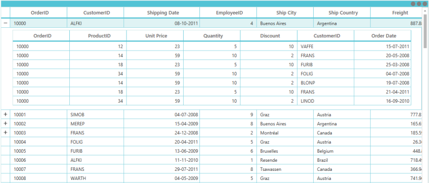
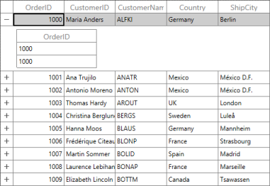
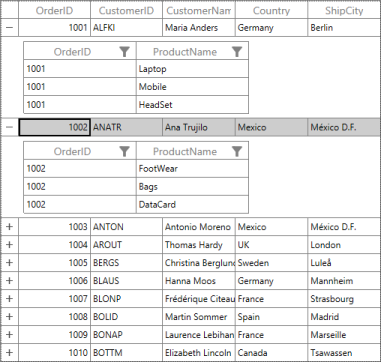

# Master-Details View

This section explains the SfDataGridMaster-DetailsView support, creation of Master-Details View by using the DataTableRelation and Collection property and Events associated with the Master-Details View

## Overview 

The DataGrid displays hierarchical data in the form of nested tables. In a Hierarchical view, each record in the parent table has an associated set of records in the child table. Every record in the parent table contains an Expander button in DataGrid that can be expanded or collapsed to show or hide the underlying records in the child table. The number of tables nested with relations by using a DataGrid control is unlimited.

## Defining Master-DetailsView

DataGrid provides the following properties to define the Master-Details relation:

* DetailsViewDefinition: It manages the entire Master-Details relations for a DataGrid, and this property is an ObservableCollection of ViewDefinition objects.
* AutoGenerateRelations: The DataGrid automatically detects the data relations in a data set to display. By default, a relation is created for each data relation in the data set. Hence, the data relations defined in a data set are sufficient for the DataGrid.

The event that participates to create Master-DetailsView is the AutoGeneratingRelations that rises when AutoGenerateRelations is set to true. AutoGeneratingRelations event handler receives two arguments, namely sender that is the SfDataGrid and AutoGeneratingRelationsArgs that are handled as objects. 

AutoGeneratingRelationsArgs object contains following list of properties.

* GridViewDefinition: This property customizes column behaviors such as filtering, sorting, editing, validation, resizing, and deleting. 
* Cancel:  You can cancel the creation of the ViewDefinition to create Master-DetailsView by setting this property to true.

You can use this event to stop creating relation for a parent row. The following code example illustrates how to cancel the creation.



sfdatagrid.AutoGeneratingRelations += sfdatagrid_AutoGeneratingRelations;

void sfdatagrid_AutoGeneratingRelations(object sender, Syncfusion.UI.Xaml.Grid.AutoGeneratingRelationsArgs e)

{    

    e.Cancel = true;

}


GridViewDefinition element displays the DataGrid control as nested row elementthatderives from the ViewDefinition. It has the following properties:

* RelationalColumn: Gets or sets the property name that is assigned to the ItemsSource for the details view.
* DataGrid:GridViewDefinition has DataGrid property. You can set the properties for the Master-DetailsGrid by using this DataGrid.

In addition, GridViewDefinition supports the following list of properties in the DataGrid:

* DataGrid.HideEmptyGridViewDefinition: Hides the expander from the data row when ItemsSource of Details View is empty.
* DataGrid.SelectedDetailsViewGrid: Gets the selected Details View DataGrid.
* DataGrid.DetailsViewPadding: Gets or sets the padding data row and the Details View DataGrid.

The following code example illustrates how to define the GridViewDefinition.



<syncfusion:SfDataGrid x:Name="dataGrid"

                       HideEmptyGridViewDefinition="True"

                       ItemsSource="{Binding Path=OrdersDetails}"

                       NavigationMode="Cell"

                       ShowGroupDropArea="True">

    <syncfusion:SfDataGrid.DetailsViewDefinition>

        <syncfusion:GridViewDefinition RelationalColumn="OrderDetails">

            <syncfusion:GridViewDefinition.DataGrid>

                <syncfusion:SfDataGrid x:Name="FirstDetailsViewGrid">

                    <syncfusion:SfDataGrid.Columns>

                        <syncfusion:GridTextColumn HeaderText="Order ID" MappingName="OrderID" />

                        <syncfusion:GridTextColumn HeaderText="Customer ID" MappingName="CustomerID" />

                        <syncfusion:GridTextColumn HeaderText="Product ID"

                                                   MappingName="ProductID"

                                                   TextAlignment="Right" />

                        <syncfusion:GridTextColumn HeaderText="Unit Price"

                                                   MappingName="UnitPrice"

                                                   TextAlignment="Right" />

                        <syncfusion:GridTextColumn MappingName="Quantity" TextAlignment="Right" />

                        <syncfusion:GridNumericColumn MappingName="Discount" TextAlignment="Right" />

                        <syncfusion:GridTextColumn HeaderText="Order Date"

                                                   MappingName="OrderDate"

                                                   TextAlignment="Right" />

                    </syncfusion:SfDataGrid.Columns>

                </syncfusion:SfDataGrid>

            </syncfusion:GridViewDefinition.DataGrid>

        </syncfusion:GridViewDefinition>

    </syncfusion:SfDataGrid.DetailsViewDefinition>

</syncfusion:SfDataGrid>


_Data Grid with Master Details View_

> Note: In GridViewDefinition, when you make changes in one child DataGrid, changes are applied to all the child DataGrids at that level. For example, when you resize the first column in the child DataGrid, the same column width is applied to all child DataGrids at that level. This scenario is applicable for features like filetring, sorting, validation and ReOrdering columns. You can use stacked headers also in the Master-Detail View.

The following topics explain different methods available to expand or collapse and events to handle during expanding or collapsing. You can use these methods and events to perform your internal operation like stores details view items source or record.

## Expand or Collapse Master-Details View

The following lists of methods expand or collapse records.

* ExpandAllDetailsView(): Expands all the records in the DataGrid with the Details View.
* CollapseAllDetailsView(): Collapses all the records in the DataGrid with Details View.
* ExpandDetailsViewAt(int recodIndex): Expands the Details View at the specified record index.
* CollapseDetailsViewAt(int recordIndex): Collapses the Details View at the specified record index.

## DataGrid provides the following events to expand or collapse the Master–Details View:

* DetailsViewExpanding: Occurs before expanding the Details View by using the Expander button.
* DetailsViewExpanded: Occurs after expanding the Details View by using the Expander button.
* DetailsViewCollapsing: Occurs before collapsing the Details View by using the Expander button.
* DetailsViewCollapsed: Occurs after collapsing the Details View by using the Expander button.

The SfDataGrid also provides the following events when the DetailsViewDataGrid gets loaded and unloaded.

* DetailsViewLoading:  Fired when the DetailsViewDataGrid is loading in the view. When the record is expanded and ExpandAllDetailsView method is called, this event is fired for each DetailsViewDataGrid that is loading in view. After calling the ExpandAllDetailsView method, some DetailsViewDataGrids may not be currently in view. For these DetailsViewDataGrids, this event is fired when it brings into view.
* DetailsViewUnloading: Fired when the DetailsViewDataGrid is unloading from view. The DetailsViewDataGrid is unloaded when the grid is scrolled out of view and also when the particular DetailsViewDataGrid is collapsed.

#### DetailsViewExpanding Event

The DetailsViewExpandingEvent handler receives two arguments, namely sender that is SfDataGrid and GridDetailsViewExpandingEventArgs that are handled as objects. The GridDetailsViewExpandingEventArgs object contains the following properties:

* Cancel: When this property is set to true, the event is cancelled and the Details View is not expanded.
* Record: Gets the row data.
* DetailsViewItemsSource: It is a dictionary of strings and IEnumerable objects that hold the Relational Column, its key, and the ItemsSource as its value.

When you do not want a particular parent row expanded, then you can wire this event and do it by checking the value from the record property and Cancel it.



void sfdatagrid_DetailsViewExpanding(object sender, GridDetailsViewExpandingEventArgs e)

{

    if((e.Record as OrderInfo).OrderID == 1002)

    e.Cancel = true;

}


## DetailsViewExpanded Event

The DetailsViewExpanded event handler receives two arguments namely sender that is SfDataGrid and GridDetailsViewExpandedEventArgs thatare handled as objects. The GridDetailsViewExpandedEventArgs object contains the following properties:

* Record: Gets the row data.
* DetailsViewItemsSource: It is a dictionary of strings and IEnumerable objects that hold the Relational Column, its key, and the ItemsSource as its value. 

## DetailsViewCollapsing Event

The DetailsViewCollapsing event handler receives two arguments namely sender that is SfDataGrid and GridDetailsViewCollapsingEventArgs that are handled as objects. The GridDetailsViewCollapsingEventArgs object contains the following properties:

* Cancel: When this property is set to true, the event is cancelled and the Details View are not expanded.
* Record: Gets the row data.

When you want to avoid collapsing of the parent row, then you can wire this event and check value from record property and Cancel it.



void sfdatagrid_DetailsViewCollapsing(object sender, 

GridDetailsViewCollapsingEventArgs e)

{

    if ((e.Record as OrderInfo).OrderID == 1002)

    e.Cancel = true;

}


## DetailsViewCollapsed Event

The DetailsViewCollapsed event handler receives two arguments namely sender that isSfDataGrid and GridDetailsViewCollapsedEventArgs that are handled as objects. The GridDetailsViewCollapsedEventArgs object contains the following properties:

* Record: Gets the row data.

You can wire those events from XAML or Code-Behind. For example.



<syncfusion:SfDataGrid x:Name="sfdatagrid"

                       AllowEditing="True"

                       AutoGenerateColumns="True"

                       ColumnSizer="Star"

                       DetailsViewExpanding="sfdatagrid_DetailsViewExpanding"

                       ItemsSource="{Binding OrderInfoCollection}">





sfdatagrid.DetailsViewExpanding += sfdatagrid_DetailsViewExpanding;



## DetailsViewLoading Event

The DetailsViewLoading Event handler receives two arguments, namely sender that is SfDataGrid and DetailsViewLoadingAndUnloadingEventArgs. The DetailsViewLoadingAndUnloadingEventArgs object contains the following property:

* DetailsViewDataGrid: The DetailsViewDataGrid is loaded in the view. 
* By accessingthe DetailsViewDataGrid, you can set the Custom Renderers, Custom SelectionController, ResizingController, GridColumnDragDropController, and GridColumnSizer to the DetailsViewDataGrid.



this.grid.DetailsViewLoading += grid_DetailsViewLoading;

void grid_DetailsViewLoading(object sender, DetailsViewLoadingAndUnloadingEventArgs e)

{

  // Assigns Custom Selection Controller for the DetailsViewDataGrid.

  e.DetailsViewDataGrid.SelectionController = new  CustomSelectionController(e.DetailsViewDataGrid);

}


It is not preferable to change the value of the public properties like AllowFiltering, AllowSorting, SelectionUnit, AllowDeleting, etc., from this event argument. You can set the value for these properties in the RootDataGrid itself (defined in the GridViewDefinition) as follows.



    <syncfusion:SfDataGrid x:Name="sfdatagrid"

                           AutoGenerateColumns="True"

                           ColumnSizer="Star"

                           ItemsSource="{Binding OrderInfoCollection}">

        <syncfusion:SfDataGrid.DetailsViewDefinition>

            <syncfusion:GridViewDefinition RelationalColumn="ProductDetails">

                <syncfusion:GridViewDefinition.DataGrid>

                    <syncfusion:SfDataGrid x:Name="DetailsView"

                                           AllowDeleting="True"

                                           AllowEditing="True"

                                           AllowFiltering="True"

                                           AllowGrouping="True"

                                           AllowSorting="True"

                                           AutoGenerateColumns="False">

                        <syncfusion:SfDataGrid.Columns>

                            <syncfusion:GridTextColumn MappingName="OrderID" />

                            <syncfusion:GridTextColumn MappingName="ProductName" />

                        </syncfusion:SfDataGrid.Columns>

                    </syncfusion:SfDataGrid>

                </syncfusion:GridViewDefinition.DataGrid>

            </syncfusion:GridViewDefinition>

        </syncfusion:SfDataGrid.DetailsViewDefinition>

    </syncfusion:SfDataGrid>

</Window>



## DetailsViewUnloading Event

The DetailsViewUnloading Event handler receives two arguments, namely sender that is SfDataGrid and the DetailsViewLoadingAndUnloadingEventArgs.The DetailsViewLoadingAndUnloadingEventArgs object contains the following property:

* DetailsViewDataGrid : The DetailsViewDataGrid is unloaded from view.



this.grid.DetailsViewUnloading += grid_DetailsViewUnloading; 

void grid_DetailsViewUnloading(object sender, DetailsViewLoadingAndUnloadingEventArgs e)

{ 

}


## Limitations

There are some limitations in the Master-DetailsView. Those are:

* It does not have the AddNewRow support.                            
* It does not support Details view Serialization.                 
* It does not have support to bind SelectedItem, CurrentItem.                    
* GroupDropArea is not available for details view grid.                  

> Note: You can use GroupColumnDescriptions to group the column in Master-Details View.

## Master-Detail View from DataTable relations

This topic explains step by step procedure to create the Master-Details View by using the DataTable relation. The following example explains you how the Relation is created between the two Datatables as in the SQL relation. 

1. Create New Project in the VisualStudio.
2. Add required assemblies as mentioned in the Getting Started.
3. Now create Data Source.
4. Data Source is created in a hierarchical model. You can create two DataTables. One as parent table, another that acts as a child table.
5. Both tables have common property to make a relation. 
6. Your model should be like as follows.

   ### DataTable 1:

			public class DTModel1

			{        

				public DataTable CreateModel()

				{

					var orderInfo = new DataTable();

					orderInfo.Columns.Add("OrderID", typeof(int));

					orderInfo.Columns.Add("CustomerID", typeof(string));

					orderInfo.Columns.Add("CustomerName", typeof(string));

					orderInfo.Columns.Add("Country", typeof(string));

					orderInfo.Columns.Add("ShipCity", typeof(string));                 

					return orderInfo;

				}

			} 

   ### DataTable 2:

			public class DTModel2

			{        

				public DataTable CreateDTChild()

				{

					var productInfo = new DataTable();

					productInfo.Columns.Add("OrderID", typeof(int));

					productInfo.Columns.Add("ProductName", typeof(string));

					return productInfo;

				}       

			} 

   > Note: Both tables have OrderID as common property to make relation.

   Now, populate data for DataTables.

			public class DTRepositiory

			{        

			public static int value=0;        

			public DataTable GetOrdersDetail()

			{

				var orders = (new DTModel1()).CreateModel();

				for (int i = 0; i < 10;i++ )

				{

					var row = GetOrderForDT(i, orders);

					orders.Rows.Add(row);

				}                           

				return orders;

			}

			public DataRow GetOrderForDT(int i, DataTable order)

			{

				var row = order.NewRow();

				row[0] = 1000+i;

				row[1] = cutomerID[i];

				row[2] = cutomerName[i];

				row[3] = country[i];

				row[4] = shipcity[i];                        

				return row;         

			}

			public DataTable GetProductDetail()

			{

				var products = (new DTModel2()).CreateDTChild();

				for (int i = 0; i < 10; i++)

				{

					for (int j = 0; j < (i%2==0? 2:3); j++)

					{

						var row = GetProductsForDT(1000 + i, products);

						products.Rows.Add(row);

					}

				}           

				return products;

			}

			public DataRow GetProductsForDT(int i, DataTable product)

			{           

				var row = product.NewRow();             

				row[0]=i;

				row[1] = productsName[value >= 20 ? value= 0:value++];

				return row;    

			}

			public DataTable GetItemsSource(DataTable t1, DataTable t2)

			{

				DataSet ds = new DataSet();

				ds.Tables.Add(t1);

				ds.Tables.Add(t2);

				ds.Relations.Add(new DataRelation("Orders_Products",   

				ds.Tables[0].Columns["OrderID"], ds.Tables[1].Columns["OrderID"]));

				return ds.Tables[0];

			}

			public string[] cutomerID = new string[]

			{

				"Maria Anders",

				"Ana Trujilo",

				"Antonio Moreno",

				"Thomas Hardy",

				"Christina Berglund",

				"Hanna Moos",

				"Frédérique Citeaux",

				"Martin Sommer",

				"Laurence Lebihan",

				"Elizabeth Lincoln"

			};

			public string[] cutomerName= new string[]

			{

				"ALFKI",

				"ANATR",

				"ANTON",

				"AROUT",

				"BERGS",

				"BLAUS",

				"BLONP",

				"BOLID",

				"BONAP",

				"BOTTM"			

			};

			public string[] country= new string[]

			{

				"Germany",

				"Mexico",

				"Mexico",

				"UK",

				"Sweden",

				"Germany",

				"France",

				"Spain",

				"France",

				"Canada"			

			};

			public string[] shipcity= new string[]

			{

				"Berlin",

				"México D.F.",

				"México D.F.",

				"London",

				"Luleå",

				"Mannheim",

				"Strasbourg",

				"Madrid",

				"Marseille",

				"Tsawassen"			

			};

			public string[] productsName = new string[]

			{

				"Laptop",

				"Mobile",

				"Watch",

				"FootWear",

				"Bike",

				"Car",

				"Tablet",

				"Mouse",

				"CPU",

				"KeyBoard",

				"Bags",

				"Books",

				"Fridge",

				"TV",

				"DeskTop",

				"TelePhone",

				"DataCard",

				"PenDrive", 

				"Camera",

				"MP3"

			};

			}

7. The highlighted lines in the above code example make the Master-Details View.  Now, set ItemsSource byusing the following code example. 

			public class DTViewModel : INotifyPropertyChanged

			{

				public DTRepositiory respository = new DTRepositiory();

				private DataTable orderDetails;

				private DataTable productDetails;

				private DataTable itemsSource;

				public DTViewModel()

				{

					orderDetails = this.respository.GetOrdersDetail();

					productDetails = this.respository.GetProductDetail();

					itemsSource = this.respository.GetItemsSource(orderDetails, productDetails);

				}

				public DataTable OrderDetails

				{

					get { return orderDetails; }

					set

					{

						orderDetails = value;

						RaisePropertyChanged("OrderInfoCollection");

					}

				}

				public DataTable ProductDetails

				{

					get { return productDetails; }

					set

					{

						productDetails = value;

						RaisePropertyChanged("ProductDetails");

					}

				}

				public DataTable ItemsSource

				{

					get { return itemsSource; }

					set

					{

						itemsSource = value;

						RaisePropertyChanged("ItemsSource");

					}

				}

				public event PropertyChangedEventHandler PropertyChanged;

				public void RaisePropertyChanged(string propName)

				{

					if (this.PropertyChanged != null)

						this.PropertyChanged(this, new PropertyChangedEventArgs(propName));

				}

			}

8. Bind ItemsSource to the Grid.

			<Window x:Class="SimpleApplication.MainWindow"

					xmlns="http://schemas.microsoft.com/winfx/2006/xaml/presentation"

					xmlns:x="http://schemas.microsoft.com/winfx/2006/xaml"

					xmlns:local="clr-namespace:SimpleApplication"

					xmlns:syncfusion="http://schemas.syncfusion.com/wpf"

					Title="MainWindow"

					Width="525"

					Height="350">

				<Window.DataContext>

					<local:DTViewModel />

				</Window.DataContext>

				<syncfusion:SfDataGrid x:Name="sfdatagrid"

									   AutoGenerateColumns="True"

									   AutoGenerateRelations="True"

									   ColumnSizer="Star"

									   ItemsSource="{Binding ItemsSource}" />

			</Window>

9. You can enable the AutogGenerateRelations. Internally, the SfDataGrid searches the relation from data set and makes the Nested Grid. To disable it, you can specify the relation names in the RelationalColumn. The following code example illustrates about the AutogGenerateRelations.

			<Window x:Class="SimpleApplication.MainWindow"

					xmlns="http://schemas.microsoft.com/winfx/2006/xaml/presentation"

					xmlns:x="http://schemas.microsoft.com/winfx/2006/xaml"

					xmlns:local="clr-namespace:SimpleApplication"

					xmlns:syncfusion="http://schemas.syncfusion.com/wpf"

					Title="MainWindow"

					Width="525"

					Height="350">

				<Window.DataContext>

					<local:DTViewModel />

				</Window.DataContext>

				<syncfusion:SfDataGrid x:Name="sfdatagrid"

									   AutoGenerateColumns="True"

									   AutoGenerateRelations="False"

									   ColumnSizer="Star"

									   ItemsSource="{Binding ItemsSource}">

					<syncfusion:SfDataGrid.DetailsViewDefinition>

						<syncfusion:GridViewDefinition RelationalColumn="Orders_Products" />

					</syncfusion:SfDataGrid.DetailsViewDefinition>

				</syncfusion:SfDataGrid>

			</Window>

10. The following screenshot renders the output.

   

   _Data Grid with Master-Detail View from DataTable relations_
   {:.prettyprint}

## Master-Detail View from Collection property

Master–Details DataGrid displays a hierarchical data in a tree format. This topic explains the simple procedure to create the Master-Details View DataGrid. 

1. Create a NewWPF Project in Visual Studio.
2. Add required assemblies as mentioned in the Getting Started.
3. Now, create simple Data Source. 
4. Create a business model with the Collection property. This value is displayed in a seperate Grid under the parent record in the Grid. 

   In the following code example, OrderInfo business class directly bounds to the SfDataGrid and it has ProductDetails property of type List<ProductInfo>. ProductDetails are displayed in the Grid like other property. You can display the ProductDetails property collection in a separate Grid under the OrderInfo record in the Grid using the NestedGrid. 

   Add the following code example in a newly created class file and save it as OrderInfo.cs

			public class OrderInfo

			{

				int orderID;

				string customerId;

				string country;

				string customerName;

				string shippingCity;

				List<ProductInfo> productDetails;

				public int OrderID

				{

					get { return orderID; }

					set { orderID = value; }

				}

				public string CustomerID

				{

					get { return customerId; }

					set { customerId = value; }

				}

				public string CustomerName

				{

					get { return customerName; }

					set { customerName = value; }

				}

				public string Country

				{

					get { return country; }

					set { country = value; }

				}

				public string ShipCity

				{

					get { return shippingCity; }

					set { shippingCity = value; }

				}

				public List<ProductInfo> ProductDetails

				{

					get { return productDetails; }

					set { productDetails = value; }

				}

				public OrderInfo(int orderId, string customerName, string country, string

				customerId, string shipCity, List<ProductInfo> productdetails)

				{

					this.OrderID = orderId;

					this.CustomerName = customerName;

					this.Country = country;

					this.CustomerID = customerId;

					this.ShipCity = shipCity;

					this.ProductDetails = productdetails;

				}

			}

   The ProductDetails property is a List of ProductInfo type. Here you can find the class information of the ProductInfo class. You can add the following code example in a newly created class file and save it as ProductInfo.cs file.

    
			public class ProductInfo
			{    
			int orderId;    
			string productName;    
			public int OrderID   
			 {       
			 get { return orderId; }        
			 set { orderId = value; }   
			 }   
			public string ProductName    
			 {        
			 get { return productName; }        
			 set { productName = value; }    
			 }
			}

   > Note: Both parent collection and child collection have key property OrderID.

5. Now, load the data for a prepared collection.  Add the following code example in a newly created class file and save it as OrderInfoRepositiory.cs file_._

			public class OrderInfoRepositiory

			{

				ObservableCollection<OrderInfo> orderCollection;        

				public ObservableCollection<OrderInfo> OrderInfoCollection

				{

					get { return orderCollection; }

					set { orderCollection = value; }

				}

				public OrderInfoRepositiory()

				{

					orderCollection = new ObservableCollection<OrderInfo>();

					this.GenerateProducts();

					OrderInfoCollection = GenerateOrders();            

				}

				public ObservableCollection<OrderInfo> GenerateOrders()

				{

					ObservableCollection<OrderInfo> orders = new ObservableCollection<OrderInfo>();

					orders.Add(new OrderInfo(1001, "Maria Anders", "Germany", "ALFKI", "Berlin", getorder(1001)));

					orders.Add(new OrderInfo(1002, "Ana Trujilo", "Mexico", "ANATR", "México D.F.", getorder(1002)));

					orders.Add(new OrderInfo(1003, "Antonio Moreno", "Mexico", "ANTON", "México D.F.", getorder(1003)));

					orders.Add(new OrderInfo(1004, "Thomas Hardy", "UK", "AROUT", "London", getorder(1004)));

					orders.Add(new OrderInfo(1005, "Christina Berglund", "Sweden", "BERGS", "Luleå", getorder(1005)));

					orders.Add(new OrderInfo(1006, "Hanna Moos", "Germany", "BLAUS", "Mannheim", getorder(1006)));

					orders.Add(new OrderInfo(1007, "Frédérique Citeaux", "France", "BLONP", "Strasbourg", getorder(1007)));

					orders.Add(new OrderInfo(1008, "Martin Sommer", "Spain", "BOLID", "Madrid", getorder(1008)));

					orders.Add(new OrderInfo(1009, "Laurence Lebihan", "France", "BONAP", "Marseille", getorder(1009)));

					orders.Add(new OrderInfo(1010, "Elizabeth Lincoln", "Canada", "BOTTM", "Tsawassen", getorder(1010)));

					return orders;

				}

				List<ProductInfo> prod = new List<ProductInfo>();

				public void GenerateProducts()

				{

						prod.Add(new ProductInfo() { OrderID = 1001, ProductName = "Laptop" });

						prod.Add(new ProductInfo() { OrderID = 1001, ProductName = "Mobile" });

						prod.Add(new ProductInfo() { OrderID = 1001, ProductName = "HeadSet" });

						prod.Add(new ProductInfo() { OrderID = 1002, ProductName = "FootWear" });

						prod.Add(new ProductInfo() { OrderID = 1002, ProductName = "Bags" });

						prod.Add(new ProductInfo() { OrderID = 1002, ProductName = "DataCard" });

						prod.Add(new ProductInfo() { OrderID = 1003, ProductName = "TV" });

						prod.Add(new ProductInfo() { OrderID = 1003, ProductName = "Fridge" });

						prod.Add(new ProductInfo() { OrderID = 1004, ProductName = "Watch" });

						prod.Add(new ProductInfo() { OrderID = 1004, ProductName = "Bike" });

						prod.Add(new ProductInfo() { OrderID = 1005, ProductName = "Car" });

						prod.Add(new ProductInfo() { OrderID = 1005, ProductName = "CPU" });

						prod.Add(new ProductInfo() { OrderID = 1005, ProductName = "KeyBoard" });

						prod.Add(new ProductInfo() { OrderID = 1006, ProductName = "Books" });

						prod.Add(new ProductInfo() { OrderID = 1006, ProductName = "PenDrive" });

						prod.Add(new ProductInfo() { OrderID = 1007, ProductName = "Camera" });

						prod.Add(new ProductInfo() { OrderID = 1008, ProductName = "MP3" });

						prod.Add(new ProductInfo() { OrderID = 1008, ProductName = "DeskTop" });

						prod.Add(new ProductInfo() { OrderID = 1008, ProductName = "MemoryCard" });

				}

				public List<ProductInfo> getorder(int i)

				{

					List<ProductInfo> product = new List<ProductInfo>();

					foreach (var or in prod)

						if (or.OrderID == i)

							product.Add(or);

					return product;

				}

			}

   {:.prettyprint}			

1. Now, open XAML page in your application. Add names space for the SfDataGrid and create simple application with the SfDataGrid.
2. SfDataGrid.DetailsViewDefinition inthe SfDataGrid creates the Master-Detail DataGrid and RelationalColumn property in GridViewDefinition creates ItemsSource to associate the ChildGrid from the Parent Grid Data. 
3. Create Details-ViewGrid as in the following code example. There are some limitations for the Details-View Grid that is refered by using Master-Details View Section.

			<Window x:Class="SimpleApplication.MainWindow"

					xmlns="http://schemas.microsoft.com/winfx/2006/xaml/presentation"

					xmlns:x="http://schemas.microsoft.com/winfx/2006/xaml"

					xmlns:local="clr-namespace:SimpleApplication"

					xmlns:syncfusion="http://schemas.syncfusion.com/wpf"

					Title="MainWindow"

					Width="525"

					Height="350">

				<Window.DataContext>

					<local:OrderInfoRepositiory />

				</Window.DataContext>

				<syncfusion:SfDataGrid AutoGenerateColumns="True"

									   ColumnSizer="Star"

									   ItemsSource="{Binding OrderInfoCollection}">

					<syncfusion:SfDataGrid.DetailsViewDefinition>

					   <syncfusion:GridViewDefinition RelationalColumn="ProductDetails" />

					</syncfusion:SfDataGrid.DetailsViewDefinition>

				</syncfusion:SfDataGrid>

			</Window>

4. Execute the application; Grid is loaded with Master Details Grid. Click the first record’s expander to render the following output.

   

   _Data Grid with Master-Detail View from Collection property_
   {:.prettyprint}
   
## How To

### Populate through Events

By handling the DetailsViewExpanding event, you can populate the NestedGrid with a new ItemsSource or you can modify the existing ItemsSource. To achieve this, you have to set the ItemsSource by using the DetailsViewItemsSource property. The following code example illustrates this.



private void DataGrid_DetailsViewExpanding(object sender, GridDetailsViewExpandingEventArgs e)

{

    e.DetailsViewItemsSource.Clear();

    var orderInfo = e.Record as OrderInfo;

    var itemSource = this.OrdersDetails.Where(customer => customer.OrderID == 

    orderInfo.OrderID);

    e.DetailsViewItemsSource.Add("Details", itemSource);

}




<syncfusion:SfDataGrid x:Name="dataGrid"

                       ItemsSource="{Binding Path=OrdersDetails}"

                       NavigationMode="Cell"

                       ShowGroupDropArea="True">

    <syncfusion:SfDataGrid.DetailsViewDefinition>

        <syncfusion:GridViewDefinition RelationalColumn="Details" />

    </syncfusion:SfDataGrid.DetailsViewDefinition>

</syncfusion:SfDataGrid>


### Refresh UI when adding the Child Grid records to the Grid

When you set the HideEmptyGridViewDefinition to False and add the items to the DetailsView during Execution time, it does not show the DetailsViewExpander until the Grid is refreshed. You can refresh the particular row alone instead of refreshing the entire Grid by using the UpdateDataRow (int rowIndex) method. To access this method, you can include the Syncfusion.UI.Xaml.Grid.Helpers namespace.

UpdateDataRow method has recordindex or record as a parameter to update that particular row.You can include the Syncfusion.UI.Xaml.Grid namespace to access the ResolveToRowIndex(object item) method. The method ResolveToRowIndex resolves index to refresh the Grid.

The following code example shows you how to add the item to the DetailsView in a Button Click.



private void AddItem(object sender, RoutedEventArgs e)

 {

    var Item = DataContext as ViewModel;

    var source = Item.OrdersDetails.Where(data => data.OrderID == 10004).Single();

    var additem1 = new List<OrderDetails>();

    additem1.Add(new OrderDetails(12, 50, 20, 12,8.0, "XYZ", new DateTime(2013, 12, 12)));

    source.OrderDetails=additem1;

    this.dataGrid.UpdateDataRow(dataGrid.ResolveToRowIndex(source));            

  }


### Customize columns Master-Detail view

You can cusomtize columns and other settings for the Master-Details view Grid for a particular level by using the GridViewDefinition.DataGrid property. In the following code example, Columns are customized for the Master-Details view.



<syncfusion:SfDataGrid x:Name="sfdatagrid"

                       AutoGenerateColumns="True"

                       ColumnSizer="Star"

                       ItemsSource="{Binding OrderInfoCollection}">

    <syncfusion:SfDataGrid.DetailsViewDefinition>

        <syncfusion:GridViewDefinition RelationalColumn="ProductDetails">

            <syncfusion:GridViewDefinition.DataGrid>

                <syncfusion:SfDataGrid x:Name="DetailsView" AutoGenerateColumns="False">

                    <syncfusion:SfDataGrid.Columns>

                        <syncfusion:GridTextColumn MappingName="OrderID" />

                        <syncfusion:GridTextColumn MappingName="ProductName" />

                    </syncfusion:SfDataGrid.Columns>

                </syncfusion:SfDataGrid>

            </syncfusion:GridViewDefinition.DataGrid>

        </syncfusion:GridViewDefinition>

    </syncfusion:SfDataGrid.DetailsViewDefinition>

</syncfusion:SfDataGrid>



The following code example explains how to customize column in code behind.



<syncfusion:SfDataGrid x:Name="sfdatagrid"

                       AutoGenerateColumns="True"

                       ColumnSizer="Star"

                       ItemsSource="{Binding OrderInfoCollection}">

    <syncfusion:SfDataGrid.DetailsViewDefinition>

        <syncfusion:GridViewDefinition RelationalColumn="ProductDetails">

            <syncfusion:GridViewDefinition.DataGrid>

                <syncfusion:SfDataGrid x:Name="DetailsView" AutoGenerateColumns="False" />

            </syncfusion:GridViewDefinition.DataGrid>

        </syncfusion:GridViewDefinition>

    </syncfusion:SfDataGrid.DetailsViewDefinition>

</syncfusion:SfDataGrid>





this.DetailsView.Columns.Add(new GridTextColumn() { MappingName = "OrderID" });

this.DetailsView.Columns.Add(new GridTextColumn() { MappingName = "ProductName" });



The following screenshot renders the output of the above code examples. Both gives you the same result.

_Customizing columns Master-Detail view_

You can customize the columns by using the AutoGeneratingRelations event (when you are auto generating the relations) also where you can get GridViewDefintion from the AutoGeneratingRelationsArgs. You can wire that event and customize columns within that event. The following code example explains you how to customize the columns.



sfdatagrid.AutoGeneratingRelations += sfdatagrid_AutoGeneratingRelations;

void sfdatagrid_AutoGeneratingRelations(object sender, Syncfusion.UI.Xaml.Grid.AutoGeneratingRelationsArgs e)

{    

    e.GridViewDefinition.DataGrid.Columns.Add(new GridTextColumn() { MappingName = "OrderID" });                                  

}



The following screenshot displays the output.

_Customized columns Master-Detail view_

### Handle events for Master-Detail View

You can handle events for the actions in the Master-DetailView like in the Parent Grid.You can wire the events by using the GridViewDefinition.DataGrid from XAML or code behind. 



<syncfusion:SfDataGrid.DetailsViewDefinition>

    <syncfusion:GridViewDefinition RelationalColumn="OrderDetails">

        <syncfusion:GridViewDefinition.DataGrid>

            <syncfusion:SfDataGrid x:Name="FirstDetailsViewGrid"                                    

                                   CurrentCellActivating="FirstDetailsViewGrid_CurrentCellActivating"                                   

                                   CurrentCellBeginEdit="FirstDetailsViewGrid_CurrentCellBeginEdit" />

        </syncfusion:GridViewDefinition.DataGrid>

    </syncfusion:GridViewDefinition>

</syncfusion:SfDataGrid.DetailsViewDefinition>




this.FirstDetailsViewGrid.CurrentCellBeginEdit += DetailsView_CurrentCellBeginEdit;

this.FirstDetailsViewGrid.CurrentCellActivating += DetailsView_CurrentCellActivating;


When Autogenerating columns, you can wire event by using the AutoGeneratingRelations event. In AutoGeneratingRelations event, you can access the GridViewDefinition from argument. 



void dataGrid_AutoGeneratingRelations(object sender, Syncfusion.UI.Xaml.Grid.AutoGeneratingRelationsArgs e)

{

    e.GridViewDefinition.DataGrid.CurrentCellBeginEdit += DataGrid_CurrentCellBeginEdit;

    e.GridViewDefinition.DataGrid.CurrentCellActivating += DataGrid_CurrentCellActivating;

}

void DataGrid_CurrentCellActivating(object sender, Syncfusion.UI.Xaml.Grid.CurrentCellActivatingEventArgs args)

{

}

void DataGrid_CurrentCellBeginEdit(object sender, Syncfusion.UI.Xaml.Grid.CurrentCellBeginEditEventArgs args)

{

}


### Set properties for Master-Detail View

Master-Details View Grid has the GridViewDefintion property that has the DataGrid property. You can set properties for the Master-Details view by using the GridViewDefinition.DataGrid property. The following code example explains you how to set properties in Master-Details View by using the XAML.



<Window x:Class="SimpleApplication.MainWindow"

        xmlns="http://schemas.microsoft.com/winfx/2006/xaml/presentation"

        xmlns:x="http://schemas.microsoft.com/winfx/2006/xaml"

        xmlns:local="clr-namespace:SimpleApplication"

        xmlns:syncfusion="http://schemas.syncfusion.com/wpf"

        Title="MainWindow"

        Width="525"

        Height="350">

    <Window.DataContext>

        <local:OrderInfoRepositiory />

    </Window.DataContext>

    <syncfusion:SfDataGrid x:Name="sfdatagrid"

                           AutoGenerateColumns="True"

                           ColumnSizer="Star"

                           ItemsSource="{Binding OrderInfoCollection}">

        <syncfusion:SfDataGrid.DetailsViewDefinition>

            <syncfusion:GridViewDefinition RelationalColumn="ProductDetails">

                <syncfusion:GridViewDefinition.DataGrid>

                    <syncfusion:SfDataGrid x:Name="DetailsView"

                                           AllowDeleting="True"

                                           AllowEditing="True"

                                           AllowFiltering="True"

                                           AllowGrouping="True"

                                           AllowSorting="True"

                                           AutoGenerateColumns="False">

                        <syncfusion:SfDataGrid.Columns>

                            <syncfusion:GridTextColumn MappingName="OrderID" />

                            <syncfusion:GridTextColumn MappingName="ProductName" />

                        </syncfusion:SfDataGrid.Columns>

                    </syncfusion:SfDataGrid>

                </syncfusion:GridViewDefinition.DataGrid>

            </syncfusion:GridViewDefinition>

        </syncfusion:SfDataGrid.DetailsViewDefinition>

    </syncfusion:SfDataGrid>

</Window>


The following code example explains how to set the properties for Master-Details View in code behind.



this.DetailsView.AllowDeleting = true;

this.DetailsView.AllowSorting = true;

this.DetailsView.AllowEditing = true;

this.DetailsView.AllowFiltering = true;



You can set the properties for the Master-Details View in the AutoGeneratingRelations event also where you get GridViewDefintion from the AutoGeneratingRelationsArgs. You can wire that event and customize columns within that event. 



sfdatagrid.AutoGeneratingRelations += sfdatagrid_AutoGeneratingRelations;

void sfdatagrid_AutoGeneratingRelations(object sender, Syncfusion.UI.Xaml.Grid.AutoGeneratingRelationsArgs e)

{

    e.GridViewDefinition.DataGrid.AllowDeleting = true;

    e.GridViewDefinition.DataGrid.AllowEditing = true;

    e.GridViewDefinition.DataGrid.AllowSorting = true;

    e.GridViewDefinition.DataGrid.AllowFiltering = true;            

}


_Master-Details View with set properties_

### Get SelectedItem in DetailsViewGrid

The SfDataGrid has the SelectedDetailsViewGrid property that returns the Selected Details-View Grid when you use GridViewDefinition. You can access the SelectedItem or SelectedItems via the SelectedDetailsViewGrid.SelectedItem property. You can’t access the SelectedItem property via the GridViewDefinition.DataGrid property. 



var data = sfdatagrid.SelectedDetailsViewGrid.SelectedItem;



The following code is to get the selectedItem from the DetailsGrid of Master-DetailsGrid.



var data = sfdatagrid.SelectedDetailsViewGrid.SelectedDetailsViewGrid.SelectedItem;


### Override selection controller in the DetailsViewDataGrid

Like the SfDataGrid, you can override selection controller in the DetailsViewDataGrid also. But, you cannot directly assign custom selection controller to the DataGrid defined in the GridViewDefintion like other properties like AllowEditing, AllowSorting, AllowFiltering, etc. Instead, you can assign custom selection controller to the DetailsViewDataGrid by using the DetailsViewLoading event. The following code illustrates how to assign custom selection controller to the DetailsViewDataGrid.



  public class CustomSelectionController : GridSelectionController

    {

        public CustomSelectionController(SfDataGrid dataGrid):base(dataGrid)

        {

        }

    }





this.grid.DetailsViewLoading += grid_DetailsViewLoading;

void grid_DetailsViewLoading(object sender, DetailsViewLoadingAndUnloadingEventArgs e)

{

  // Assigns Custom Selection Controller for the DetailsViewDataGrid.

  e.DetailsViewDataGrid.SelectionController = new  CustomSelectionController(e.DetailsViewDataGrid);

}
