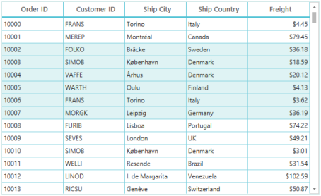
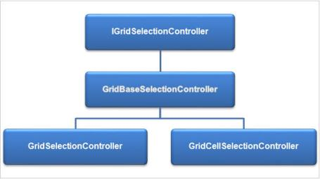
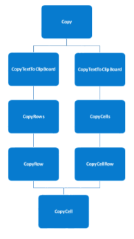
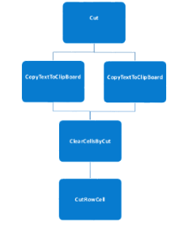

# Selection

This Section explains you about selection behavior, properties, and events that participate in Selection and how to customize the selection controller. SfDataGrid supports two type of Selection behavior.

* Row Selection
* Cell Selection

## Row Selection

The DataGrid control provides an interactive support to select a specific row or group of rows programmatically or by Mouse and Keyboard interactions. To enable this Selection in DataGrid, you can set SfDataGrid.SelectionUnit property to Row. 

## Cell Selection

The DataGrid control provides interactive support to select a specific cell or group of cells programmatically or by Mouse and Keyboard interactions. To enable this Selection in DataGrid, you can set SfDataGrid.SelectionUnit property to Cell or Any and the SfDataGrid.NavigationMode should be Cell. In Any, you can select all cells in particular row by clicking on RowHeader.

N> HeaderRows and TableSummaryRows do not have support for selection.

 Properties

SfDataGrid control provides the following properties for Selection.

_Selection properties table_

<table>
<tr>
<th>
Property Name</th><th>
Type</th><th>
Description</th></tr>
<tr>
<td>
SelectionUnit</td><td>
GridSelectionUnit</td><td>
Gets or sets a value indicating the type of selection in DataGrid control. Different types are Cell, Row and Any.</td></tr>
<tr>
<td>
SelectionController</td><td>
IGridSelectionController</td><td>
Gets or sets the selection controller to handle the selection operations. It is initialized based on SelectionUnit value.</td></tr>
<tr>
<td>
SelectionMode</td><td>
GridSelectionMode</td><td>
Gets or sets the selection behavior in DataGrid control. Different modes are Single, Multiple, Extended and None.</td></tr>
<tr>
<td>
NavigationMode</td><td>
NaviagtionMode</td><td>
Gets or sets the navigation behavior between rows or cells in DataGrid control. </td></tr>
<tr>
<td>
AutoScroller.IsEnabled</td><td>
Boolean</td><td>
Gets or sets the value indicating whether the AutoScroller is enabled or not. </td></tr>
<tr>
<td>
AllowSelectionOnPointerPressed</td><td>
Boolean</td><td>
Allows selection during PointerPressed event. By default, selection occurs during PointerReleased event.</td></tr>
<tr>
<td>
SelectedItem</td><td>
object</td><td>
Gets or sets the record of selected row.  When you have multiple selections in DataGrid control, then SfDataGrid.SelectedItem returns the record of initially selected row. This is maintained only in Row selection.</td></tr>
<tr>
<td>
CurrentItem</td><td>
object</td><td>
Gets or sets the record of current row. When you have multiple selections in DataGrid control, then SfDataGrid.CurrentItem returns the record of current row.</td></tr>
<tr>
<td>
SelectedItems</td><td>
ObservableCollection&lt;object&gt;</td><td>
Gets the collection of selected records. DataGrid control also allows you to manipulate this collection. This is maintained only in Row selection.</td></tr>
<tr>
<td>
CurrentCellInfo</td><td>
GridCellInfo</td><td>
Gets the GridCellInfo of a current cell. GridCellInfo contains the record of current row and column of the current cell. This is maintained only in Cell selection.</td></tr>
<tr>
<td>
CurrentColumn</td><td>
GridColumn</td><td>
Gets the GridColumn of a current cell.</td></tr>
<tr>
<td>
RowSelectionBrush</td><td>
Brush</td><td>
Gets or sets the brush value for selection background in Data Row.</td></tr>
<tr>
<td>
GroupRowSelectionBrush</td><td>
Brush</td><td>
Gets or sets the brush value for selection background in Group caption Row.</td></tr>
<tr>
<td>
CurrentCellBorderBrush</td><td>
Brush</td><td>
Gets or sets the Border color of the current cell when NavigationMode is in Cell.</td></tr>
<tr>
<td>
CurrentCellBorderThickness</td><td>
Thickness</td><td>
Gets or sets the Border width of Current cell when NavigationMode is in Cell</td></tr>
</table>

N> In WPF, MouseDown event is triggered after releasing the finger from touch. Hence AllowSelectionOnPointerPressed API only works for mouse in WPF.

Methods

DataGrid control supports the following public methods for selection:

* SelectAll – Selects all the rows or cells in the Grid. This method does not make any changes when the selection mode is set to Single or None_._

The following code example illustrates how to call SelectAll () method.



private void SelectAll_Click(object sender, RoutedEventArgs e)

{

    sfdatagrid.SelectionMode = GridSelectionMode.Multiple;

    sfdatagrid.SelectAll();

}


When you click on button that contains above code example, all the rows or cells are selected as displayed in the following screenshot.

_DataGrid with SelectAll () method_

* ClearSelections – Clears all selection in Grid.

The following code example illustrates how to use ClearSelections(bool exceptCurrentRow). When exceptCurrentRow is set to true, the current row is not cleared; otherwise, all the selections are cleared.



private void ClearSelection_Click(object sender, RoutedEventArgs e)

{

    sfdatagrid.ClearSelections(true);

}



* MoveCurrentCell – Moves the current cell to corresponding row column index. This method works only when NavigationMode is set to Cell.

The following code example explains you how to use MoveCurrentCell (RowColumnIndexrowColumnIndex). To use RowColumnIndex structure, add Syncfusion.UI.Xaml.ScrollAxis reference.



private void MoveCurrentCell_Click(object sender, RoutedEventArgs e)

{

    RowColumnIndex rowColumnIndex = new RowColumnIndex();

    rowColumnIndex.ColumnIndex =2;

    rowColumnIndex.RowIndex = 2;

    sfdatagrid.MoveCurrentCell(rowColumnIndex);

}



The current cell is moved to third column (‘0’ based index), second row in screenshot.

_DataGrid with MoveCurrentCell method_

* ScrollInView – You can scroll the view to a particular record using ScrollInView (RowColumnIndex rowColumnIndex) method where you can view the record that is not in view also.



sfdatagrid.ScrollInView(new RowColumnIndex() { RowIndex = sfdatagrid.ResolveToRowIndex(7), ColumnIndex = 1 });



* SelectRows – You can select a range of rows programmatically by using SelectRows method. This method effects only in Row selection and the SelectionMode should be Multiple or Extended.

The following code example illustrates how to use SelectRows(int startRowIndex, int endRowIndex).



private void SelectRows_Click(object sender, RoutedEventArgs e)

{

    int rowIndex = this.sfdatagrid.SelectionController.CurrentCellManager.CurrentRowColumnIndex.RowIndex;

    this.sfdatagrid.SelectRows(rowIndex, rowIndex + 4);

}



* SelectCell – You can select a specific cell programmatically by using SelectCell method. This method effects only in Cell selection.

The following code example shows how to use SelectCell(object rowData, GridColumn column) mehtod.



private void SelectCell_Click(object sender, RoutedEventArgs e)

{

    OrderInfoViewModel viewModel = this.sfdatagrid.DataContext as OrderInfoViewModel;

    this.sfdatagrid.SelectCell(viewModel.OrdersListDetails[3], this.sfdatagrid.Columns["CustomerID"]);

}



* SelectCells– You can select a range of cells programmatically by using SelectCells method. This method effects only in Cell selection and the SelectionMode should be Multiple or Extended.

The following code example shows how to use SelectCells(object startRowData, GridColumn startColumn, object endRowData, GridColumn endColumn) method.



private void SelectCells_Click(object sender, RoutedEventArgs e)

{

    OrderInfoViewModel viewModel = this.sfdatagrid.DataContext as OrderInfoViewModel;

    object startRowData = viewModel.OrdersListDetails[3];

    object endRowData = viewModel.OrdersListDetails[6];

    GridColumn startColumn = this.sfdatagrid.Columns["CustomerID"];

    GridColumn endColumn = this.sfdatagrid.Columns["ShipCountry"];

    this.sfdatagrid.SelectCells(startRowData, startColumn, endRowData, endColumn);

}


* UnSelectCell – You can remove the selection from a specific cell programmatically by using UnSelectCell method. This method effects only in Cell selection.

The following code example shows how to use UnSelectCell(object rowData, GridColumn column) mehtod.



private void UnSelectCell_Click(object sender, RoutedEventArgs e)

{

    OrderInfoViewModel viewModel = this.sfdatagrid.DataContext as OrderInfoViewModel;

    this.sfdatagrid.UnSelectCell(viewModel.OrdersListDetails[3], this.sfdatagrid.Columns["CustomerID"]);

}



* UnSelectCells – You can remove the selection from a range of cells programmatically by using UnSelectCells method. This method effects only in Cell selection and the SelectionMode should be Multiple or Extended.

The following code example shows how to use UnSelectCells(object startRowData, GridColumn startColumn, object endRowData, GridColumn endColumn) method.



private void UnSelectCells_Click(object sender, RoutedEventArgs e)

{

    OrderInfoViewModel viewModel = this.sfdatagrid.DataContext as OrderInfoViewModel;

    object startRowData = viewModel.OrdersListDetails[3];

    object endRowData = viewModel.OrdersListDetails[6];

    GridColumn startColumn = this.sfdatagrid.Columns["CustomerID"];

    GridColumn endColumn = this.sfdatagrid.Columns["ShipCountry"];

    this.sfdatagrid.UnSelectCells(startRowData, startColumn, endRowData, endColumn);

}



* GetSelectedCells – Returns the collection of GridCellInfo that contains information about the selected cell. This mehtod effects only in Cell selection.

The following code example shows how to use GetSelectedCells() method.



List<GridCellInfo> selectedCells = this.sfdatagrid.GetSelectedCells();


Events

DataGrid control provides the following two events during selection operation:

* SfDataGrid.SelectionChanging:__Triggers while selecting a row or cell. This event helps to cancel the selection operation.
* SfDataGrid.SelectionChanged:__Triggers after row selection.

The following code example illustrates SelectionChanging event purpose.



void sfdatagrid_SelectionChanging(object sender, GridSelectionChangingEventArgs e)

{

    e.Cancel = true;

}


These two events are triggered with GridSelectionChangingEventArgs and GridSelectionChangedEventArgs that contain the following properties.

* AddedItems- Gets the collection of GridRowInfo or GridCellInfo that is added for selection. 
* RemovedItems- Gets the collection of GridRowInfo or GridCellInfo that is removed from selection. 

N> GridRowInfo is used in Row selection and GridCellInfo is used in Cell selection.

## Row Selection

DataGrid control provides an interactive support for selecting rows in different mode with smooth and ease manner. 

In Row selection, the SfDataGrid.SelectionController.SelectedRows property is maintained that holds the collection of GridRowInfo. GridRowInfo has the following properties.

* RowData – Returns the record when the selected row is DataRow otherwise returns null.
* RowIndex – Returns the row index of the selected row.
* IsDataRow – Returns the value indicating whether the selected row is DataRow.
* IsAddNewRow – Returns the value indicating whether the selected row is AddNewRow.

### SelectionMode

Row Selection has different modes to do selection as follows.

* Single:__In Single mode, the DataGrid control enables you to select a single__row only. You cannot select more than one row using Shift or Ctrl key.
* Multiple: In Multiple mode, the DataGrid enables you to select more than one row. Selection is not cleared when selecting more than one records. When you click on a selected row, selection is cleared but the current cell selection is maintained when NavigationMode is cell. You can also select more than one row by dragging the mouse, but the selection is not cleared in previously selected rows. 
* Extended: In Extended mode, the DataGrid enables you to select multiple rows. Selection is cleared when selecting more than one cell without pressing Shift or Ctrl in DataGrid control. In this mode, you can also select multiple rows in a smooth way by dragging the mouse.
* None: The DataGrid control disables selection, when the selection type is set to None.

By default, the selection mode is set to Single mode. You can assign the selection mode for DataGrid control using SfDataGrid.SelectionMode property.

The following code example illustrates how to set a selection mode for DataGrid control.	



<syncfusion:SfDataGrid x:Name="sfdatagrid"

                       ItemsSource="{Binding ItemsSource}"

                       SelectionUnit="Row"

                         SelectionMode="Extended" />




sfdatagrid.SelectionMode = Syncfusion.UI.Xaml.Grid.GridSelectionMode.Extended;


### Navigation Mode

Another vital operation in selection with editing is NavigationMode. DataGrid control provides the following two types of NavigationModes.

* Row: This mode does not show the current cell selection and disables cell editing.
* Cell: This mode shows the current cell and enables you to edit the cell.

N> Cell based key navigation is disabled in Row navigation mode.

### Example:

The following code example shows a DataGrid in row navigation mode.



<syncfusion:SfDataGrid x:Name="datagrid"

                       ItemsSource="{Binding ItemsSource}"

                       NavigationMode="Row"

                         SelectionUnit="Row"

                         SelectionMode="Extended" />



The following screenshot shows a DataGrid in Row Navigation Mode.

_DataGrid in Row Navigation Mode_

The following screenshot shows a DataGrid in Cell Navigation Mode.

_DataGrid in Cell Navigation Mode_

## Cell Selection

DataGrid control provides an interactive support for selecting cells in different mode with smooth and ease manner. 

In Cell Selection, the SfDataGrid.SelectionController.SelectedCells property is maintained that holds the collection of GridSelectedCellsInfo. GridSelectedCellsInfo has the following properties.

* RowData – Returns the record when the selected cell is DataRow otherwise returns null.
* ColumnCollection – Returns the collection of GridColumn that have been selected in DataRow.
* RowIndex – Returns the row index when the selected cell is SummaryRow or AddNewRow otherwise returns -1.
* IsDataRow – Returns the value indicating if the selected cell is DataRow.
* IsAddNewRow – Returns the value indicating if the selected cell is AddNewRow.

### SelectionMode

Cell Selection has different modes to select the cells in DataGrid control.

* Single:__In Single mode, the DataGrid control enables you to select a single__Cell only. You cannot select more than one Cell using Shift or Ctrl key.
* Multiple: In Multiple modes, the DataGrid enables you to select more than one Cell. When you click on a selected Cell, the selection is cleared. But the current cell selection is maintained on same cell. You can also select more than one cell by dragging the mouse, but the selection is not cleared in this mode of selection. 
* Extended: In Extended mode, the DataGrid enables you to select multiple Cells. The previously selected cells are cleared when selecting any cell without pressing__SHIFT__or CTRL keys. In this mode, you can also select multiple cells by dragging the mouse over the GridCells.
* None: The DataGrid control disables selection, when the selection type is set to None.

By default, the selection mode is set to Single mode. You can assign the selection mode for DataGrid control using SfDataGrid.SelectionMode property.

### Navigation Mode

In Cell selection, NavigationMode should always be Cell instead of Row. Selection is not maintained as expected when NavigationMode is set as Row.

### Example:

The following code example shows a DataGrid in Cell selection.



<syncfusion:SfDataGrid x:Name="syncgrid"

                       ItemsSource="{Binding OrdersListDetails}"

                       SelectionUnit="Cell"

                       NavigationMode="Cell"

                       SelectionMode="Extended">



The following screenshot shows a DataGrid inCell Selection.

_DataGrid in Cell selection_

### Customizing Selection operations

Selection related operations are handled in Selection Controllers of SfDataGrid and it is possible to override and customize the Selection Controller to achieve some custom behaviors. The selection controller class hierarchy is shown as follows.

_Selectiom Operations_

The GridSelectionController and GridCellSelectionController have been derived from GridBaseSelectionController that contains abstract methods and properties. You can customize the selection behaviors in two different controllers; GridSelectionConroller and GridCellSelectionController.

* GridSelectionController – GridSelectionController is responsible for Row selection. The selection related operations are handled by this controller when SfDataGrid.SelectionUnit is set as Row.
* GridCellSelectionController – GridCellSelectionController is responsible for Cell selection. The selection related operations are handled by this controller when SfDataGrid.SelectionUnit is set as Cell or Any.

 Properties

GridBaseSelectionController contains the following properties to handle the selection.

_GridBaseSelectionController properties table_

<table>
<tr>
<th>
Property Name</th><th>
Description</th></tr>
<tr>
<td>
CurrentCellManager</td><td>
Gets or sets the current cell manager of DataGrid.> {{ '' | markdownify }}

{{ '_Note: You can edit and navigate the current cell using CurrentCellManager._' | markdownify }}</td></tr>
<tr>
<td>
SelectedRows</td><td>
Gets the collection of GridRowInfo that is selected row information in DataGrid control. SelecteRows are maintained only in Row selection.</td></tr>
<tr>
<td>
SelectedCells</td><td>
Gets the collection of GridSelectedCellsInfo that is selected cells information in DataGrid control. SelecteCells are maintained only in Row selection</td></tr>
<tr>
<td>
IsSuspended</td><td>
Gets or sets the value indicating the selection process is suspended or not. It is suspended for selection property changes doing in internal codes.</td></tr>
<tr>
<td>
RowHoverBackgroundBrush</td><td>
Gets or sets the brush value for Row hover highlighting.</td></tr>
<tr>
<td>
RowSelectionBrush</td><td>
Gets or sets the brush value for Row Selection.</td></tr>
<tr>
<td>
GroupRowSelectionBrush</td><td>
Gets or sets the brush value for Selection brush in group caption and group summary rows.</td></tr>
</table>

Methods

GridBasSelectionController contains some important methods to handle selection as follows.

_GridBasSelectionController methods table_

<table>
<tr>
<th>
Method Name</th><th>
Description</th></tr>
<tr>
<td>
CreateCurrentCellManager</td><td>
Creates the new instance for CurrentCellManager property.</td></tr>
<tr>
<td>
ProcessOnAddNewRow</td><td>
Updates the selection when new row is committed or changed the position of the AddNewRow.</td></tr>
<tr>
<td>
ProcessOnSortChanged</td><td>
Updates the selection based on SelectedRows or SelectedCells when sorting is applied to any column.</td></tr>
<tr>
<td>
ProcessOnFilterPopupOpened</td><td>
Updates the selection when AddNewRow is in EditMode.</td></tr>
<tr>
<td>
ProcessOnFilterApplied</td><td>
Updates the selection based on SelectedRows or SelectedCells when filtering is applied on any column.</td></tr>
<tr>
<td>
ProcessOnPageChanged</td><td>
Updates the selection when move on to next page.</td></tr>
<tr>
<td>
ProcessOnGroupChanged</td><td>
Updates the selection based on SelectedRows or SelectedCells when grouping is applied for any column.</td></tr>
<tr>
<td>
ClearDetailsViewGridSelections</td><td>
Clears all the selection in specified nested grid.</td></tr>
<tr>
<td>
AutoScrollerValudChanged</td><td>
Invoked when AutoScroller scrolls the rows or columns.</td></tr>
<tr>
<td>
CheckIsLastRow</td><td>
Returns the value indicating whether the current row is last row for all parent and child grids.</td></tr>
</table>
_GridSelectionController methods table_

<table>
<tr>
<th>
Method Name</th><th>
Description</th></tr>
<tr>
<td>
HandlePointerOperation</td><td>
Handles all pointer operations (Pressed, Release, Moved, Tapped and Double-Tapped) that are performed in grid cell. </td></tr>
<tr>
<td>
HandleKeyDown</td><td>
Handles all key operations on SfDataGrid.</td></tr>
<tr>
<td>
HandleGridOperations</td><td>
Handles all DataGrid operations (Sorting, Filtering, Grouping, Paging, AddNewRow and Pasting operations) that are performed in a DataGrid control.</td></tr>
<tr>
<td>
HandleSelectionPropertyChanged</td><td>
Handles when Selection property values (SelectedIndex, SelectedItem and SelectionMode) are changed.</td></tr>
<tr>
<td>
HandleCollectionsChanged</td><td>
Handles when the collection change operations (SelectedItems, Columns and DataSource) are performed.</td></tr>
<tr>
<td>
HandleGroupExpandAndCollapse</td><td>
Handles when group expands or collapses.</td></tr>
<tr>
<td>
HandleDetailsViewPointerOperations</td><td>
Handles pointer operations on DetailsView Grid.</td></tr>
<tr>
<td>
HandleDetailsViewKeyOperations</td><td>
Handles key operations on DetailsView Grid. </td></tr>
<tr>
<td>
ClearSelections</td><td>
Clears all the selection and removes the current cell. The current row selection is not removed when exceptCurrentRow is set true.</td></tr>
</table>

### Customizing Row Selection

Many of the supplementary properties and methods involved in selection operation of GridSelectionController implement the GridBaseSelectionController. You can customize the Row selection behavior by overriding some methods in GridSelectionController. 

Methods

The following list provides some important methods that is defined in GridSelectionController.

_GridSelectionController methods table_

<table>
<tr>
<th>
Method Name</th><th>
Description</th></tr>
<tr>
<td>
ProcessPointerPressed</td><td>
Invoked when unhandled MouseDown event occurs in GridCell. This method is implemented to handle the selection in DataGrid control for this event.</td></tr>
<tr>
<td>
ProcessPointerReleased</td><td>
Invoked when unhandled MouseUp event occurs in GridCell. This method is implemented to handle the selection in DataGrid control for this event.</td></tr>
<tr>
<td>
ProcessPointerMoved</td><td>
Invoked when unhandled MouseMove event occurs in GridCell. This method is implemented to handle the selection in DataGrid control for this event.</td></tr>
<tr>
<td>
ProcessKeyDown</td><td>
Invoked when unhandled KeyDown event occurs in GridCell. This method is implemented to handle selection and editing in DataGrid control for this event.</td></tr>
<tr>
<td>
ProcessOnTapped</td><td>
Invoked when single click on a GridCell. It moves the CurrentCell to an edit mode when EditTriger is set to OnTap.</td></tr>
<tr>
<td>
ProcessOnDoubleTapped</td><td>
Invoked when double click on a GridCell. It moves the CurrentCell to an edit mode when EditTriger is set to OnDoubleTap.</td></tr>
<tr>
<td>
AddSelection</td><td>
Adds the selection to specified rows.</td></tr>
<tr>
<td>
RemoveSelection</td><td>
Removes the selection from specified rows.</td></tr>
<tr>
<td>
RefreshSelectedRows</td><td>
Updates the selection in DataGrid control based on SelectedRows collection.</td></tr>
<tr>
<td>
RefreshSelectedItems</td><td>
Updates the selection in DataGrid control based on SfDataGrid.SelectedItems collection.</td></tr>
<tr>
<td>
ProcessCurrentItemChanged</td><td>
Updates the current cell selection in DataGrid control based on value changed in CurrentItem. This method moves the current cell to specified current item.</td></tr>
<tr>
<td>
ProcessSelectedItemChanged</td><td>
Updates the selection in DataGrid control based on value changed in SelectedItem.</td></tr>
<tr>
<td>
ProcessSelectedItemsChanged</td><td>
Updates the selection in DataGrid control based on manipulation done in SelectedItems collection.</td></tr>
<tr>
<td>
RemoveRows</td><td>
Removes the selected records from DataGrid control. </td></tr>
</table>

The following code example illustrates to override methods and how to handle operations. The extended class GridSelectionControllerExt is your new SelectionController. Therefore, you need to assign newly created one to existing SelectionController that overrides existing SelectionController.

 Example:

The following code example shows how to select a row based on values in specfic column. This can be achieved by   overriding ProcessPointerReleased method in GridSelectionContrller.



sfdatagrid.SelectionController = new GridSelectionControllerExt(sfdatagrid);

…

public class GridSelectionControllerExt : GridSelectionController

{

    public GridSelectionControllerExt(SfDataGrid dataGrid)

        : base(dataGrid)

    { }

    protected override void ProcessPointerReleased(MouseButtonEventArgs args, Syncfusion.UI.Xaml.ScrollAxis.RowColumnIndex rowColumnIndex)

    {

        if (this.DataGrid.SelectionMode == GridSelectionMode.Multiple)

        {

            var previouCurrentRowColumnIndex = this.CurrentCellManager.CurrentRowColumnIndex;

            if (!this.CurrentCellManager.HandlePointerOperation(args, rowColumnIndex))

                return;

            var record = this.DataGrid.GetRecordAtRowIndex(rowColumnIndex.RowIndex);

            if (record == null)

                return;

            var propertyDescriptor = this.DataGrid.View.GetPropertyAccessProvider();

            var cellValue = propertyDescriptor.GetValue(record, "ShipCountry");

            var records = this.DataGrid.View.Records.Where(item => (item.Data as Orders).ShipCountry.Equals(cellValue));

            records.ForEach(item =>

                {

                    int rowIndex = this.DataGrid.ResolveToRowIndex(((Syncfusion.Data.RecordEntry)item).Data);

                    this.ProcessSelection(rowIndex, previouCurrentRowColumnIndex, SelectionReason.PointerReleased);

                });

        }

        else

            base.ProcessPointerReleased(args, rowColumnIndex);

    }

}


### Customizing Cell Selection

You can customize the Cell selection by overriding GridCellSelectionController that is implemented from GridBaseSelectionController. You can change the behavior of Cell selection by overriding some virtual methods in GridCellSelectionController.

 Methods

The following list provides some important public methods that are defined in GridCellSelectionController.

_GridCellSelectionController methods table_

<table>
<tr>
<th>
Method Name</th><th>
Description</th></tr>
<tr>
<td>
ProcessPointerPressed</td><td>
Invoked when unhandled MouseDown event occurs in GridCell. This method is implemented to handle the selection in DataGrid control for this event.</td></tr>
<tr>
<td>
ProcessPointerReleased</td><td>
Invoked when unhandled MouseUp event occurs in GridCell. This method is implemented to handle the selection in DataGrid control for this event.</td></tr>
<tr>
<td>
ProcessPointerMoved</td><td>
Invoked when unhandled MouseMove event occurs in GridCell. This method is implemented to handle the selection in DataGrid control for this event.</td></tr>
<tr>
<td>
ProcessKeyDown</td><td>
Invoked when unhandled KeyDown event occurs in GridCell. This method is implemented to handle selection and editing in DataGrid control for this event.</td></tr>
<tr>
<td>
ProcessOnTapped</td><td>
Invoked when single click on a GridCell. It moves the CurrentCell to an edit mode when EditTriger is set to OnTap.</td></tr>
<tr>
<td>
ProcessOnDoubleTapped</td><td>
Invoked when double click on a GridCell. It moves the CurrentCell to an edit mode when EditTriger is set to OnDoubleTap.</td></tr>
<tr>
<td>
AddSelection</td><td>
Adds the selection to specified cells</td></tr>
<tr>
<td>
RemoveSelection</td><td>
Removes the selection from specified cells.</td></tr>
<tr>
<td>
ProcessCurrentItemChanged</td><td>
Updates the current cell selection in DataGrid control based on value changed in CurrentItem. This method moves the current cell to specified current item.</td></tr>
</table>

 Example:

The following code example shows how to override the GridCellSelectionController. Here the new class GridCellSelectionControllerExt is created and assigned to SfDataGrid.SelectionController. This code shows how to change the RowSelectionBrush when pressing down arrow key. It should be changed when the Freight value of the record is greater than 100.



sfdatagrid.SelectionController = new GridCellSelectionControllerExt(sfdatagrid);

…

public class GridCellSelectionControllerExt : GridCellSelectionController

{

    public GridCellSelectionControllerExt(SfDataGrid dataGrid)

        : base(dataGrid)

    {

    }

    protected override void ProcessKeyDown(KeyEventArgs args)

    {

        if (args.Key == Key.Down || (args.Key == Key.Enter && !SelectionHelper.CheckControlKeyPressed()))

        {

            if(this.DataGrid.SelectedDetailsViewGrid != null && this.DataGrid.IsInDetailsViewIndex(this.CurrentCellManager.CurrentRowColumnIndex.RowIndex))

            {

                this.DataGrid.SelectedDetailsViewGrid.SelectionController.HandleKeyDown(args);

                return;

            }

            var previousRowColumnIndex = this.CurrentCellManager.CurrentRowColumnIndex;

            int nextRowIndex = this.GetNextRowIndex(this.CurrentCellManager.CurrentRowColumnIndex.RowIndex);

            int lastRowIndex = this.DataGrid.ResolveToRowIndex(this.DataGrid.View.Records.Count - 1);

            if (nextRowIndex >= lastRowIndex && nextRowIndex == this.CurrentCellManager.CurrentRowColumnIndex.RowIndex)

                return;

            if (SelectionHelper.CheckShiftKeyPressed() && this.DataGrid.SelectionMode == GridSelectionMode.Extended && this.CurrentCellManager.CurrentRowColumnIndex.RowIndex == nextRowIndex)

                nextRowIndex = this.GetNextRowIndex(nextRowIndex);

            if (this.DataGrid.DetailsViewDefinition.Count > 0)

            {

                var record = this.DataGrid.GetRecordAtRowIndex(nextRowIndex);

                while (this.DataGrid.IsInDetailsViewIndex(nextRowIndex))

                {

                    nextRowIndex = this.GetNextRowIndex(nextRowIndex);

                    if (record == null)

                        return;

                }

            }

            RowColumnIndex rowColIndex = new RowColumnIndex(nextRowIndex, this.CurrentCellManager.CurrentRowColumnIndex.ColumnIndex);

            if (!this.CurrentCellManager.HandleKeyNavigation(args, rowColIndex))

                return;

            if (SelectionHelper.CheckShiftKeyPressed())

                this.ProcessShiftSelection(rowColIndex, previousRowColumnIndex, args.Key);

            else

                this.ProcessSelection(rowColIndex, SelectionReason.KeyPressed);

            this.ScrollInViewFromBottom(this.CurrentCellManager.CurrentRowColumnIndex.RowIndex);

            args.Handled = true;

        }

        else if (args.Key == Key.Up)

        {

            if (this.DataGrid.SelectedDetailsViewGrid != null && this.DataGrid.IsInDetailsViewIndex(this.CurrentCellManager.CurrentRowColumnIndex.RowIndex))

            {

                this.DataGrid.SelectedDetailsViewGrid.SelectionController.HandleKeyDown(args);

                return;

            }

            var previousRowColumnIndex = this.CurrentCellManager.CurrentRowColumnIndex;

            int prevRowIndex = this.GetPreviousRowIndex(this.CurrentCellManager.CurrentRowColumnIndex.RowIndex);

            int actuallIndex = prevRowIndex;

            if (actuallIndex <= this.DataGrid.ResolveStartIndexBasedOnPosition() && actuallIndex == this.CurrentCellManager.CurrentRowColumnIndex.RowIndex)

                return;

            if (SelectionHelper.CheckShiftKeyPressed() && this.DataGrid.SelectionMode == GridSelectionMode.Extended && this.CurrentCellManager.CurrentRowColumnIndex.RowIndex == actuallIndex)

                actuallIndex = this.GetPreviousRowIndex(actuallIndex);

            if (this.DataGrid.DetailsViewDefinition.Count > 0)

            {

                while (this.DataGrid.IsInDetailsViewIndex(actuallIndex))

                {

                    actuallIndex = this.GetPreviousRowIndex(actuallIndex);

                    if (actuallIndex == this.DataGrid.ResolveStartIndexBasedOnPosition())

                        return;

                }

            }

            RowColumnIndex rowColIndex = new RowColumnIndex(actuallIndex, this.CurrentCellManager.CurrentRowColumnIndex.ColumnIndex);

            if (!this.CurrentCellManager.HandleKeyNavigation(args, rowColIndex))

                return;

            if (SelectionHelper.CheckShiftKeyPressed())

                this.ProcessShiftSelection(rowColIndex, previousRowColumnIndex, args.Key);

            else

                this.ProcessSelection(rowColIndex, SelectionReason.KeyPressed);

            this.ScrollInViewFromTop(this.CurrentCellManager.CurrentRowColumnIndex.RowIndex);

            args.Handled = true;

        }

        else

            base.ProcessKeyDown(args);

    }

}



N> To use GetRecordAtRowIndex method, you can refer Syncfusion.UI.Xaml.Grid.Helper.

## Current Cell and Navigations

GridCurrentCellManager provides support to edit and navigate current cell navigation operations in DataGrid. You can access the GridCurrentCellManager using SfDataGrid.SelectionController.CurrentCellManager property.

Properties:

_Property Table_

<table>
<tr>
<th>
Property Name</th><th>
Description</th></tr>
<tr>
<td>
CurrentRowColumnIndex</td><td>
Gets or sets the current cell row and column index.</td></tr>
<tr>
<td>
CurrentCell</td><td>
Gets or sets the current cell column base.</td></tr>
<tr>
<td>
HasCurrentCell</td><td>
Checks the value of current cell. Returns True when the current cell column base value is not null.</td></tr>
</table>

 Methods:

_Methods Table_

<table>
<tr>
<th>
Method Name</th><th>
Description</th></tr>
<tr>
<td>
BeginEdit</td><td>
Starts an edit operation in current cell. </td></tr>
<tr>
<td>
EndEdit</td><td>
Ends an edit operation in current cell.</td></tr>
</table>

 Events:

_Eevents Table_

<table>
<tr>
<th>
Event Name</th><th>
Description</th></tr>
<tr>
<td>
CurrentCellActivatingEvent</td><td>
Triggered when the CurrentCell is moving from one cell to another.</td></tr>
<tr>
<td>
CurrentCellActivatedEvent</td><td>
Triggered when the CurrentCell is moved from one cell to another.</td></tr>
<tr>
<td>
CurrentCellBeginEditEvent</td><td>
Triggered when the CurrentCell goes to edit mode.</td></tr>
<tr>
<td>
CurrentCellEndEidtEvent</td><td>
Triggered when the CurrentCell goes to normal mode from edit mode.</td></tr>
</table>

The following code example tells you how to access CurrentCell related information.



var currencell= sfdatagrid.SelectionController.CurrentCellManager.CurrentCell;



The following list provides you navigation on Grid cell in DataGrid. It needs a NavigationMode as Cell and SelectionMode as Single, Multiple and Extend to perform navigation. 

This list provides you navigation behavior with Single selection mode. In all cases selection is also changed.

_Navigation Table_

<table>
<tr>
<th>
Events</th><th>
Description</th></tr>
<tr>
<td>
Up/Down, Shift+Up/Down</td><td>
Currentcell or currentrow moves upward or downward.</td></tr>
<tr>
<td>
CTRL+Up/Down</td><td>
CurrentCell or Row moves to First or last row.</td></tr>
<tr>
<td>
Right/Left</td><td>
CurrentCell moves to next cell within same row. </td></tr>
<tr>
<td>
CTRL+Right/Left</td><td>
CurrentCell moves to right end or left end of the last cell of same row. </td></tr>
<tr>
<td>
PageUp/PageDown</td><td>
CurrentCell or row moves to first and last visible row.</td></tr>
<tr>
<td>
Home/End</td><td>
Current cell moves to last or first cell of same row.</td></tr>
<tr>
<td>
CTRL+Home/End</td><td>
CurrentCell moves to first cell of first row or last cell of last row.</td></tr>
<tr>
<td>
Tab</td><td>
Currentcell moves to next cell.</td></tr>
<tr>
<td>
Shift+Tab</td><td>
CurrentCell moves to previous cell.</td></tr>
<tr>
<td>
Enter</td><td>
CurrentCell moves downward (next row).</td></tr>
<tr>
<td>
CTRL+Enter</td><td>
EndEdit and remains in same cell.</td></tr>
<tr>
<td>
Space</td><td>
Only in Multiple selection mode to select or unselect specific row or cell.</td></tr>
</table>

N> The listed key navigation behaves same as multiple selection. But current cell moves selection, does not move in single selection. In extended mode, all selection modes are like single mode other than Shift+UP/Down selects multiple records and move towards its direction._

You can stop the navigation by cancelling CurrenCellActivating event. The following code example describes that.



void sfdatagrid_CurrentCellActivating(object sender, CurrentCellActivatingEventArgs args)

{

    args.Cancel = true;

}


## Clipboard Operations

This section explains to you the Clipboard operations support in SfDataGrid and also explains how you can customize the Clipboard operations by overriding GridCutCopyPaste class. 

### Overview

SfDataGrid supports the clipboard operations such as cut, copy and paste data within the SfDataGrid control and between other applications such as Notepad.

### Copy and Paste Option

In SfDataGrid, by setting the properties GridCopyOption and GridPasteOption,you can define the behavior of cut, copy, and paste. The default value of GridCopyOption is CopyData and GridPasteOption is PasteData.

### GridCopyOption

* None: Disables Copy in SfDataGrid.
* CopyData: Copy the selected records from the SfDataGrid.
* CutData: Cut the selected records from the SfDataGrid.
* IncludeHeaders: Copy the selected records from the SfDataGrid, including corresponding headers when setting it along with CopyData or CutData.
* IncludeFormat: Copy the selected records from the SfDataGrid along with its format.

#### GridPasteOption

* None: Disables Paste in SfDataGrid.
* PasteData: Enables the Paste operation from clipboard to SfDataGrid. When an incompatible value is pasted into a cell, the pasting operation is skipped for that particular cell.
* ExcludeFirstLine: Paste the data from the clipboard onto SfDataGrid without the first line of the clipboard.

The following code example shows how to define the cut, copy and paste behaviors.



//Copy or Cut the record with Header and Format

this.sfdatagrid.GridCopyOption = GridCopyOption.CutData | GridCopyOption.CopyData | GridCopyOption.IncludeHeaders | GridCopyOption.IncludeFormat;

//Paste the data with ExcludeFirstLine

this.sfdatagrid.GridPasteOption = GridPasteOption.PasteData | GridPasteOption.ExcludeFirstLine;



### Events

The SfDataGrid control provides the following events when performing clipboard operations.

### GridCopyContent

This event is triggered when you copy or cut data in SfDataGrid. The GridCopyContentEventArgs object contains the Handled property, and when it is set as True, it indicates that the event is handled and you can change the behavior of the copy or cut based on your requirement.

### GridPasteContent

This event is triggered when pasting data in SfDataGrid. The GridCopyContentEventArgs object contains the Handled property, when it is set to True, it indicates that the event is handled and you can change the behavior of the paste based on your requirement.

### CopyGridCellContent

This event is triggered when the copy operation is being performed for each cell. A GridCopyPasteCellEventArgs object contains the Handled property, and when it is set to True, it indicates that the event is handled and that particular cell is not copied in the clipboard. A GridCopyPasteCellEventArgs object contains the following arguments.

* Column: It contains the corresponding column of particular cell.
* RowData: It contains the respective row data of particular cell.
* ClipBoardValue: It contains the respective copied CellValue of particular cell.

### PasteGridCellContent

This event is triggered when the paste operation is performing for each cell. A GridCopyPasteCellEventArgs object contains the Handled property, when it is set to True, it indicates that the event is handled and that particular cell is not pasted in the SfDataGrid. A GridCopyPasteCellEventArgs object contains the following argument.

* Column: It contains the corresponding column of particular cell.
* RowData: It contains the respective row data of particular cell.
* ClipBoardValue: It contains the respective copied data for particular cell.

 Methods

In SfDataGrid.GridCopyPaste contains the following methods for performing clipboard operations from coding.

_Methods_

<table>
<tr>
<th>
Method  Name</th><th>
Property Type</th><th>
Description</th></tr>
<tr>
<td>
Cut</td><td>
Cut()</td><td>
This method copies the selected records and sets the default value or null or empty. It is called when Ctrl+x is pressed.</td></tr>
<tr>
<td>
Copy</td><td>
Copy()</td><td>
This method copies the selected records. It is called when Ctrl+c is pressed.</td></tr>
<tr>
<td>
Paste</td><td>
Paste()</td><td>
This method pastes the selected records. It is called when Ctrl+v is pressed.</td></tr>
<tr>
<td>
CopyRowsToClipboard</td><td>
CopyRowsToClipboard(int startRecordIndex, int endRecordIndex)</td><td>
This method copies the data from the start record index to end record index.</td></tr>
</table>

The following code example shows how to call the above methods for processing the clipboard operations.



this.datagrid.GridCopyPaste.Cut();

this.datagrid.GridCopyPaste.Copy();

this.datagrid.GridCopyPaste.Paste();



### Overriding GridCutCopyPaste 

You can customize the cut, copy and paste operations in SfDataGrid by overriding the GridCutCopyPaste class that is implemented from the IGridCopyPaste interface. The following methods are properties present in the GridCutCopyPaste class where you can override and customize the copy paste operations. Refer the How To section to see the examples for overriding GridCutCopyPaste class.

The following code example shows how to assign the overriding class to SfDataGrid.GridCopyPaste.



this.sfdatagrid.GridCopyPaste = new CustomCopyPaste(sfdatagrid);



_Copy_

<table>
<tr>
<th>
Method  Name</th><th>
Parameters</th><th>
Description</th></tr>
<tr>
<td>
CopyTextToClipBoard</td><td>
CopyTextToClipBoard(ObservableCollection&lt;object&gt; records, bool cut)     </td><td>
Sorts the SelectedRecords in the order it is present in SfDataGrid and invokes the CopyRows method. When you are processing the cut operation, it invokes the ClearCellsByCut method also.</td></tr>
<tr>
<td>
CopyRows</td><td>
CopyRows(ObservableCollection&lt;object&gt; CopiedRecords, ref StringBuilder text)</td><td>
Invokes CopyRow method by passing each record in CopiedRecords</td></tr>
<tr>
<td>
CopyRow</td><td>
CopyRow(object record, ref StringBuilder text)</td><td>
Invokes the CopyCell method by passing the copied record and each column in SfDataGrid.Columns</td></tr>
<tr>
<td>
CopyTextToClipBoard</td><td>
CopyTextToClipBoard(GridSelectedCellsCollection selectedCells, bool cut)</td><td>
Invokes the CopyCells method and when you processing the cut operation, it invokes the ClearCellsByCut method. </td></tr>
<tr>
<td>
CopyCells</td><td>
CopyCells(GridSelectedCellsCollection selectedCells, StringBuilder text)</td><td>
​Sorts the selected cells in the order it is present in SfDataGrid and invokes the CopyCellRow by passing SelectedCellInfo.</td></tr>
<tr>
<td>
CopyCellRow</td><td>
CopyCellRow(GridSelectedCellsInfo cellRow, ref StringBuilder text)</td><td>
Invokes the CopyCell by passing copied record and Column.</td></tr>
<tr>
<td>
CopyCell</td><td>
CopyCell(object record, GridColumn column, ref StringBuilder text)</td><td>
In this method, based on row data and column it gets the corresponding cell value.</td></tr>
</table>

_Cut_

<table>
<tr>
<th>
Method  Name</th><th>
Property Type</th><th>
Description</th></tr>
<tr>
<td>
ClearCellsByCut</td><td>
ClearCellsByCut(ObservableCollection&lt;object&gt; selectedCells)</td><td>
Separates the record and columns and invokes CutRowCell method.</td></tr>
<tr>
<td>
CutRowCell</td><td>
CutRowCell(object rowData, GridColumn column)</td><td>
Property in rowdata corresponding to column resets it to back to its default value. </td></tr>
</table>

_Paste_

<table>
<tr>
<th>
Method  Name</th><th>
Property Type</th><th>
Description</th></tr>
<tr>
<td>
PasteTextToRow</td><td>
PasteTextToRow()</td><td>
Separates the clipboard content into number of rows and invokes PasteToRows method by passing copied clipboard text rows.</td></tr>
<tr>
<td>
PasteToRows</td><td>
PasteToRows(object copiedRecords)</td><td>
Gets the selected records and invokes the PasteToRow method by passing clipboard text row and selected record</td></tr>
<tr>
<td>
PasteToRow</td><td>
PasteToRow(object copiedRecord, object selectedRecords)</td><td>
Separates the clipboard text rows and invokes the PasteToCell method by passing selected record, column and clipboard text.</td></tr>
<tr>
<td>
PasteTextToCell</td><td>
PasteTextToCell()</td><td>
Separates the clipboard content into number of clipboard text rows and invokes PasteToCells methods by passing copied records.</td></tr>
<tr>
<td>
PasteToCells</td><td>
PasteToCells(object copiedRecords )</td><td>
Gets the selected records and invokes the PasteToRow method by passing the clipboard text record and selected record</td></tr>
<tr>
<td>
PasteToCell</td><td>
PasteToCell(object copyValue, GridColumn column, object rowData)</td><td>
Checks the column type and gets the provider and invokes CommitValue method by passing rowdata, column, provider, copied value.​</td></tr>
<tr>
<td>
CommitValue</td><td>
CommitValue(object rowData, GridColumn column, IPropertyAccessProvider provider, object changedValue)</td><td>
Gets the type of paste column from GetPropertyType method, checks that copy text to paste column type by using the CanConvertToType method and set the clipboard text value to selected cell.</td></tr>
<tr>
<td>
GetPropertyType</td><td>
GetPropertyType(GridColumn column, object rowData)</td><td>
Gets the type of paste column from GetPropertyType method, check that copy text to paste column type by using the CanConvertToType method and sets the clipboard value to selected cell.</td></tr>
<tr>
<td>
CanConvertToType</td><td>
CanConvertToType(object value, ref Type type)</td><td>
Check copied text is compatible for pasting or not.</td></tr>
</table>

The following layout shows the method flow in GridCutCopyPaste andwhere you can override it.

_Copy Operation_

_Cut Operation_

_Paste Operation_

### How to

### How to copy one cell and paste into many cells

By default, you can copy one cell and paste it into another cell when Cell Selection is enabled in SfDataGrid. The following code example shows how to copy one cell and paste it into all the selected cells by overriding PasteToCell method in GridCutCopyPaste class. Here the new class CustomCopyPaste has been created and assigned to SfDataGrid.GridCopyPaste. 



<syncfusion:SfDataGrid x:Name="sfdatagrid"

                       ItemsSource="{Binding Products}"

                       SelectionUnit="Cell"

                       SelectionMode="Extended"

                       AutoGenerateColumns="True"/>




this.sfdatagrid.GridCopyPaste = new CustomCopyPaste(sfdatagrid);

…….

public class CustomCopyPaste  : GridCutCopyPaste

{

    public CustomCopyPaste(SfDataGrid sfgrid)

        : base(sfgrid)

        {

        }

    protected override void PasteToCell(object record, GridColumn column, object rowData)

    {

        var test = Clipboard.GetText();

        string[] clipboardtext = Regex.Split(test, @"\r\n");

        clipboardtext = Regex.Split(clipboardtext[0], @"\t");

        //Get the ClipbordText and check if the clipboard text is more than one cell

        //means call the base.

        if (clipboardtext.Count() > 1)

        {

            base.PasteToCell(record, column, rowData);

            return;

        }

        //Get the selected cells for paste the copied cell 

        var selectedcells = this.dataGrid.GetSelectedCells();

        int selectedcellscount = selectedcells.Count;

        for (int i = 0; i < selectedcellscount; i++)

        {

            record = selectedcells[i].RowData;

            column = selectedcells[i].Column;

            //Call PasteToCell method with paticular record of selectedcells,

            // Column of selected records and rowdata

            base.PasteToCell(record, column, rowData);

        }

    }

}


### How to copy one row and paste into many rows

By default you can able to copy one row and paste it into another row. The following code example shows how to copy one row and paste it into all selected rows by overriding the PasteToRow method in the GridCutCopyPaste class. A new class CustomCopyPaste has been created and assigned to SfDataGrid.GridCopyPaste here. 



<syncfusion:SfDataGrid x:Name="sfdatagrid"

                       ItemsSource="{Binding Products}"

                       SelectionUnit="Row"

                       SelectionMode="Extended"

                       AutoGenerateColumns="True"/>





this.sfdatagrid.GridCopyPaste = new CustomCopyPaste(sfdatagrid);

…….

public class CustomCopyPaste  : GridCutCopyPaste

{

    public CustomCopyPaste(SfDataGrid sfgrid)

        : base(sfgrid)

        {

        }

    protected override void PasteToRow(object copiedRecord, object selectedRecords)

    {

        var text = Clipboard.GetText();

        string[] clipboardtext = Regex.Split(text, @"\r\n");

        //Get the ClipbordText and check if the clipboard text is more than one row

        //means call the base.

        if (clipboardtext.Count() > 1)

        {

            base.PasteToRow(copiedRecord, selectedRecords);

            return;

        }

        var selectedrecord = this.dataGrid.SelectedItems;

        for (int i = 0; i < selectedrecord.Count; i++)

        {

            //Get the Selected records for paste the copied row.

            selectedRecords = selectedrecord[i];

            // Call the PasteToRow methos with copyiedrecord and selectedreocord

            base.PasteToRow(copiedRecord, selectedRecords);

        }

    }

}


### How to select the pasted records after pasting

By default after pasting also SfDataGrid maintains the previously selected records as it is. When you want to select the pasted records after the Paste operation, then you can achieve your requirement by overriding the PasteToRows and PasteToRow methods in GridCutCopyPaste class. Here the new class CustomCopyPaste has been created and assigned to SfDataGrid.GridCopyPaste. This code is applicable for SelectionUnit as Row.



<syncfusion:SfDataGrid x:Name="sfdatagrid"

                       ItemsSource="{Binding Products}"

                       SelectionUnit="Row"

                       SelectionMode="Extended"

                       AutoGenerateColumns="True"/>




this.sfdatagrid.GridCopyPaste = new CustomCopyPaste(sfdatagrid);

…….

public class CustomCopyPaste  : GridCutCopyPaste

{

    public CustomCopyPaste(SfDataGrid sfgrid)

        : base(sfgrid)

        {

        }

public class CustomCopyPaste  : GridCutCopyPaste

{

    public CustomCopyPaste(SfDataGrid sfgrid)

        : base(sfgrid)

        {

        }

    //Creating the new list for add the selected records

    public List<object> selecteditem = new List<object>();

    protected override void PasteToRows(object clipboardrows)

    {

        base.PasteToRows(clipboardrows);

       //Using the SelectionController apply the selection for Pasted records

        this.dataGrid.SelectionController.HandleGridOperations(new GridOperationsHandlerArgs(GridOperation.Paste, selecteditem));

    }

    protected override void PasteToRow(object clipboardcontent, object selectedRecords)

    {

        //Added the selected record to list

        selecteditem.Add(selectedRecords);

        base.PasteToRow(clipboardcontent, selectedRecords);

    }

}


### How to add the copied rows as new rows in SfDataGrid while pasting

By default while pasting, it changes the values of the already existing records based on clipboard content. The following code example shows how to add the copied records as new rows in SfDataGrid by overriding the PasteToRows method in GridCutCopyPaste class. Here the new class CustomCopyPaste has been created and assigned to SfDataGrid.GridCopyPaste. 



<syncfusion:SfDataGrid x:Name="sfdatagrid"

                       ItemsSource="{Binding Products}"

                       SelectionUnit="Row"

                       SelectionMode="Extended"

                       AutoGenerateColumns="True"/>




this.sfdatagrid.GridCopyPaste = new CustomCopyPaste(sfdatagrid);

…….

public class CustomCopyPaste  : GridCutCopyPaste

{

    public CustomCopyPaste(SfDataGrid sfgrid)

        : base(sfgrid)

        {

        }

    protected override void PasteToRows(object clipboardrows)

    {

        var copiedRecord = (string[])clipboardrows;

        int copiedrecordscount = copiedRecord.Count();

        //Based on the clipboard count added the new record for paste

        if (copiedrecordscount > 0)

        {

            //Get the viewmodel for adding the record

            var rec = this.dataGrid.DataContext as ViewModel;

            for (int i = 0; i < copiedrecordscount; i++)

            {

                //Create the new instance for Model, for adding the new record

                Product entity = new Product();

                for (int j = 0; j < this.dataGrid.Columns.Count; j++)

                {

                    var record = copiedRecord[i];

                    string[] recc = Regex.Split(record, @"\t");

                    //Adding the new record by using PasteToCell method by passing the 

                    //created data, particular column, and clipboard value

                    this.PasteToCell(entity, this.dataGrid.Columns[j], recc[j]);

                }

                //Added the pasted record in collection

                rec.Products.Add(entity);

            }

        }

    }

}


## How To

### What is difference between CurrentItem and SelectedItem

This following table differentiates GridCurrentItem and SelectedItem.

_Difference between CurrentItem and SelectedItem_

<table>
<tr>
<th>
SelectionMode</th><th>
CurrentItem</th><th>
SelectedItem</th></tr>
<tr>
<td>
Single</td><td>
The row focused is CurrentItem.</td><td>
The row that is selected is SelectedItem</td></tr>
<tr>
<td>
Multiple and Extended</td><td>
The row focused is CurrentItem and in navigation it travels from CurrentItem among the selected items.</td><td>
The row is selected initially among the selected items.</td></tr>
</table>

N> In Single mode both the CurrentItem and SelectedItem properties have same item. Grid Selected Items are collections of your selected records.

### How to copy records without using mouse pointer

SfDataGrid supports to copy records without using mouse, to select records and paste it to Excel, Notepad and Word. You can make use of Copy (), Cut () and Paste () methods that are available in GridCopyPaste class of SfDataGrid. The following code example explains you how to do it.



void sfdatagrid_Loaded(object sender, RoutedEventArgs e)

{

    //The following code example sets you a current record. That is not selected by you.

    RowColumnIndex rowcolumnIndex = new RowColumnIndex();

    rowcolumnIndex.RowIndex = 2;

    rowcolumnIndex.ColumnIndex = 2;

    this.sfdatagrid.SelectionController.MoveCurrentCell(rowcolumnIndex);  

   //The following code copy the content for you without interaction to grid.

    sfdatagrid.GridCopyPaste.Copy();

}



Add above code example in one application. Now you can paste content in another application. The same method you can use for single filed and Multiple Records, 

### How to scroll to SelectedIndex in SfDataGrid

SfDataGrid provides the method that scrolls to particular record is ScrollInView (RowColumnIndex rowColumnIndex) where you can view the record that is not in View port.

The following code example illustrates Pass row index as SelectedIndex and some appropriate value for ColumnIndex that is in view.



sfdatagrid.ScrollInView(new RowColumnIndex() { RowIndex = sfdatagrid.SelectedIndex=7, ColumnIndex = 1 });


This scrolls the Grid to selected index of record.

### How to change the Foreground of SelectedRow

This topic explains you how to change the Foreground of SelecetdRow. SfDataGrid has an Element named VirtualizingCellsControl. You can edit the style of this element and write style for Foreground. The following steps explain you how to change the Foreground of SelectedRow.

* Open your WPF application in Blend for Visual Studio 2013 that is used in SfDataGrid control.
* Right-click on SfDataGrid. When you don’t find this control in Objects and Timeline__panel, you can GoToAssets and click on SfDatarid, (type in search box that brings to view).
* You can find Edit Additional Templates.
* Click on that, it renders you Edit Row Style, Select it.
* Save it with some name.
* You can see the following code example in your Window.Resources.
* You can add highlighted part to your code.





The following screenshot illustrates the output. To differentiate you can use RowSelectionBrush to highlight the selected row.

_Changed Foreground of SelectedRow_