# UI Automation

Microsoft UI Automation is the new accessibility framework for Microsoft Windows, available on all operating systems that support Windows Presentation Foundation (WPF). UI Automation provides accessibility to most UI elements and it provides the information about UI element to the end user. You can interact with the UI by using automated test scripts. To know more about UI Automation, refer the MSDN page [here](https://msdn.microsoft.com/en-us/library/ms747327(v=vs.110).aspx).

SfDataGrid supports the following types of UI Automation,

1. Coded UI
2. Quick Test Professional

## Coded UI Test

Automated tests that drive your application through its user interface (UI) are known as Coded UI Tests (CUITs). These tests include functional testing of the UI controls. SfDataGrid supports CUITs Coded UI automation that helps you create automated tests for inner elements and records the sequence of actions. While dragging the crosshair that is shown in CodedUITestBuilder, on UI elements, it shows the properties of the respective UI elements and you can also add assertion for each of the properties.

SfDataPager and SfMultiColumnDropDownControl support Coded UI Test automation.

Provided here are three levels of support in Coded UI Test automation.

_Coded UI Test_

<table>
<tr>
<th>
Levels</th><th>
Description</th></tr>
<tr>
<th>
Level – 1</th><th>
Record and Detect the UI Elements when you perform any actions in the Control.</th></tr>
<tr>
<th>
Level – 2</th><th>
Provide custom properties for UI elements when you drag the Crosshair to any UI element.</th></tr>
<tr>
<th>
Level – 3</th><th>
Coded UI Test Builder generates code from recorded session and custom class is implemented to access custom properties, so the generated code is simplified.</th></tr>
</table>

### Requirements and Configuration

Coded UI provides support only in Visual Studio Ultimate and Visual Studio Premium. For more information about the platforms and configurations that are supported by coded UI tests, refer this [link](https://msdn.microsoft.com/en-us/library/dd380742.aspx).

To test SfDataGrid with CUITs, build the Extension Project and place it in the mentioned location. You can get the Extension Project of SfDataGrid from [this](http://www.syncfusion.com/downloads/support/directtrac/115592/Syncfusion.VisualStudion.Extension.WPF-57940060.zip) location.

1. Open the Extension Project and build it.
2. You can get the Syncfusion.VisualStudio.TestTools.UITest.SfGridExtension.dll from bin folder. 

The above assembly must be placed into the following directory based on your Visual Studio version.

For Visual Studio 2010: C:\Program Files (x86)\Common Files\Microsoft Shared\VSTT\10.0\UITestExtensionPackages

For Visual Studio 2012: C:\Program Files (x86)\Common Files\Microsoft Shared\VSTT\11.0\UITestExtensionPackages

For Visual Studio 2013: C:\Program Files (x86)\Common Files\Microsoft Shared\VSTT\12.0\UITestExtensionPackages

> Note: Syncfusion.VisualStudio.TestTools.UITest.SfGridExtension.dll need to be installed in GAC location. Please refer the MSDN link for_ [GAC](https://msdn.microsoft.com/en-us/library/ex0ss12c(v=vs.80).aspx) _installation.

### Getting Started

This topic shows you how to create a CodedUITest project and test the SfDataGrid application. 

1. Create a new WPF application or open an existing WPF application with SfDataGrid and enable Coded UI Test in SfDataGrid. To enable CUITs, you need to set AutomationPeerHelper.EnableCodedUI__as True and access the AutomationPeerHelper class from Syncfusion.UI.Xaml.Grid__namespace as shown in the following code example,

			using Syncfusion.UI.Xaml.Grid;

			public MainWindow()

			{

			 InitializeComponent();

			 AutomationPeerHelper.EnableCodedUI = true;

			}

2. Build the application and launch the .exe file from the bin folder.          
3. Create a Coded UI Test Project as shown in the following screenshot.               

   

   _Add New Project_

4. After you create a new Coded UI project, a CUIT file is added automatically and the Generate Code dialog box appears. In this, choose Record actions, edit UI map or add assertions.

   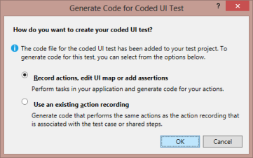

   _Generate Code for Coded UI Test_

5. Now the Coded UI project Visual Studio gets minimized and CodedUITestBuilder appears in the bottom right corner of your window. You can record the actions by clicking Start Recording in CodedUITestBuilder.

   

   _CodedUITestBuilder_

6. You can also open the CodedUITestBuilder from existing Coded UI project by right clicking on the CodedUITestMethod1 in CUIT file and clicking the Generate Code For Coded UI Test as shown in the following screenshot. You can see the same CodedUITestBuilder in the bottom right corner of the window.

   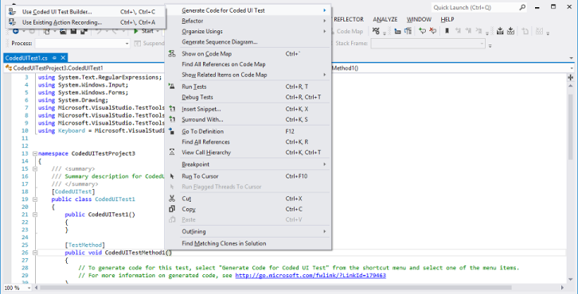

   _CodedUITestMethod_

7. Now you can drag the Crosshairs on to the UI elements of your WPF SfDataGrid application and it shows the available properties of the inner UI elements in SfDataGrid.
8. You can record the actions made on UI elements by clicking Record button on the CodedUITest builder. For example you can record the action of changing the cell value in SfDataGrid. Click the Pause button to finish the record.

   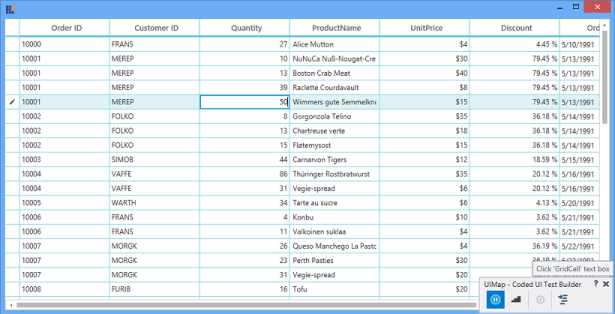

   _CodedUITest_

9. Once the record is completed, click the GenerateCode icon in CodedUITestBuilder for generate a test method. Then close the CodedUITestBuilder and you can see the generated code for cell value changed action as follows.

			public void RecordedMethod1()

			  {

				 #region Variable Declarations

				 WpfText uIMEREPText = this.UIWpfWindow.UISfDataGridCustom.UIGridCellCustom4.UIMEREPText;

				 WpfEdit uIGridCellEdit = this.UIWpfWindow.UISfDataGridCustom.UIGridCellEdit;

				 WpfSfGridCell uIGridCellCustom11 = this.UIWpfWindow.UISfDataGridCustom.UIGridCellCustom11;

				 WpfSfGridCell uIGridCellCustom12 = this.UIWpfWindow.UISfDataGridCustom.UIGridCellCustom12;

				  #endregion

			 }

10. You can also create an assertion to check the modified cell value. Drag the crosshair to the modified cell, and the Assertion window appears. The properties for control (Cell) is now listed in the Assertion dialog box. You can add assertion by clicking the Generate Code button in CodedUITestBuilder.

    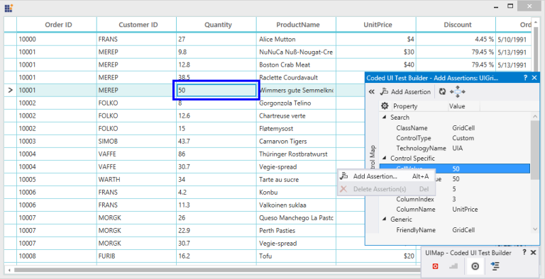

    _Assertion window_

11. After all tests and assertion are created, right-click on the Test method and click Run Tests to run the test as follows.

    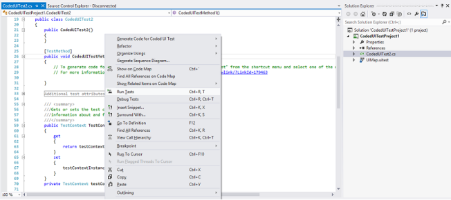

    _Run Test_
	{:.prettyprint}

### Tables for Properties 

The following properties are for each of the UI elements in SfDataGrid.

_UI Elements:_

<table>
<tr>
<th>
UI Elements</th><th>
Properties</th></tr>
<tr>
<th>
DataGrid</th><th>
RowCountColumnCountSelectionModeSelectionUnitSelectedIndexSelectedItemCount</th></tr>
<tr>
<th>
GridCell</th><th>
CellValueFormattedValueRowIndexColumnIndexColumnName</th></tr>
<tr>
<th>
GridHeaderCellControl</th><th>
MappingNameIsFilterAppliedFilterIconVisibilitySortDirectionSortNumberVisibility</th></tr>
<tr>
<th>
GridRowHeaderCell</th><th>
RowErrorMessageRowIndexState</th></tr>
<tr>
<th>
GroupDropArea</th><th>
IsExpandedGroupDropAreaText</th></tr>
<tr>
<th>
DetailsViewDataGrid</th><th>
RowCountColumnCountSelectionModeSelectionUnitSelectedIndexSelectedItemCount</th></tr>
<tr>
<th>
GroupDropAreaItem</th><th>
GroupNameSortDirection</th></tr>
<tr>
<th>
GridStackedHeaderCellControl</th><th>
      Default Properties </th></tr>
<tr>
<th>
GridTableSummaryCell</th><th>
      Default Properties</th></tr>
<tr>
<th>
GridGroupSummaryCell</th><th>
      Default Properties</th></tr>
<tr>
<th>
GridCaptionSummaryCell</th><th>
      Default Properties</th></tr>
<tr>
<th>
GridDetailsViewExpanderCellControl</th><th>
      Default Properties</th></tr>
<tr>
<th>
GridIndentCell</th><th>
      Default Properties</th></tr>
</table>

The following properties are for SfMultiColumnDropDownControl.

_SfMultiColumnDropDownControl Properties_

<table>
<tr>
<th>
UI Elements</th><th>
Properties</th></tr>
<tr>
<th>
SfMultiColumnDropDownControl</th><th>
AllowAutoCompleteAllowNullInputAllowImmediatePopupAllowIncrementalFilteringAllowCaseSensitiveFilteringAllowSpinOnMouseWheelDisplayMemberIsDropDownOpenSelectedIndexValueMember</th></tr>
</table>

The following properties are for SfDataPager.

_SfDataPager Properties_

<table>
<tr>
<th>
UI Elements</th><th>
Properties</th></tr>
<tr>
<th>
SfDataPager</th><th>
AccentBackgroundAccentForegroundAutoEllipsisModeAutoEllipsisTextDisplayModeEnableGridPagingNumericButtonCountOrientationPageCountPageSizeUseOnDemandPaging</th></tr>
</table>

### How To

### How to Enable CodedUI Test in SfDataGrid

To enable CodedUI Test in SfDataGrid, set AutomationPeerHelper.EnableCodedUI__to True. You can use the AutomationPeerHelper class from Syncfusion.UI.Xaml.Grid__namespace.



using Syncfusion.UI.Xaml.Grid;

public MainWindow()

{

 InitializeComponent();

 AutomationPeerHelper.EnableCodedUI = true;

}


### Quick Test Professional (QTP)

QTP is an automated testing software designed for testing various software applications and environments. It performs functional and regression testing through a user interface, such as native GUI or Web interface. It works by identifying the objects in the application user interface or web page and performing desired operations. It is usually used for UI based Test-case automation.

QTP enables you to test standard Windows application, Web Objects, ActiveX controls and Visual Basic applications.

Syncfusion provides Essential QTP that contains custom libraries, that help recognize Syncfusion controls. These custom libraries are built with the help of .Net add-in extensibility.

SfDataPager and SfMultiColumnDropDownControl supports QTP Test automation.

> Note: It also support for UFT (QTP latest version).

### Installation and Configuration

### For UFT Installation

While installing the UFT, make sure that the WPF Add-in is installed. Otherwise, install it.

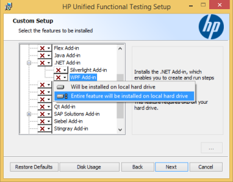

_UFT - WPF Add in_

### Essential Syncfusion QTP Installation

The following procedure illustrates how to install Essential Test Studio:

Double-click the Syncfusion Essential Test Studio__Setup file. 

> Note: Setup - Syncfusion Essential QuickTest Professional dialog box opens.

_Setup - Essential QuickTest Professional Welcome screen_

Click Next. The User Information dialog box opens. 

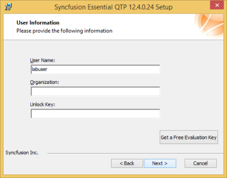

_User Information screen_

Enter the User Name, Organization and Unlock Key in the corresponding text boxes provided. 

Click Next. 

> Note: The unlock key is validated.

Select the installation folder dialog box opens. 

_Select the installation folder_

To install in the default location, click Next. 

> Note: You can also browse to choose a location by clicking Browse.

Installation type dialog box opens.

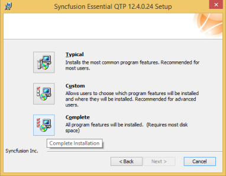

_Installation type_

Choose from the options listed. For example, to install the complete setup, click Complete.

Click Next. The Ready to Install dialog box opens.

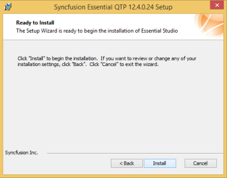

_Ready to install screen_

Click Install to continue with the installation.

### Configuration:

After installing the Syncfusion Essential Test Studio, you need to ensure that Syncfusion.CNG and SyncfusionTestObjetcs.XML files are located inthe following location. 

* C:\Program Files\HP\QuickTestProfessional\dat\Extensibility\WPF\Syncfusion
* C:\Program Files\HP\QuickTestProfessional\dat\Extensibility\WPF\

Also ensure that Syncfusion.SfGridQTP.WPF.dll is inthe following location.

* C:\Program Files\HP\QuickTest Professional\dat\Extensibility\WPF\Syncfusion

When your system does not contain Syncfusion.CNG , SyncfusionTestObjetcs.XML and  Syncfusion.SfGridQTP.WPF.dll  files, you can get it from the following location,

* C:\Program Files\Syncfusion\Essential QTP\12.4.0.24\WPF\bin\
 
>Note: By Default QTP supports higher Framework version installed in your machine. When you want to make use of SfDataGrid in a lower framework version, you need to copy and paste the SfGridQTP.WPF DLL in preferred locations.

>DLL Copy Location: C:\Program Files\Syncfusion\Essential QTP\12.4.0.24\WPF\bin\

>DLL Paste Location: C:\Program Files\HP\QuickTestProfessional\data\Extensibility\WPF\Syncfusion

 

### Getting Started

Essential Quick Test Professional lets you test applications with different Syncfusion controls and allows playback of scripts. 

The following is a list of chapters containing information that guide you through the functionality of this software:

1. Creating and Recording a Test
2. Running a Test
3. Editing a Test
4. Saving a Test
5. Running the Saved Test

### Creating and Recording a Test

#### To create a new test:

1. Open QTP by double-clicking the QuickTest Professional icon. 
 
   > Note: The QuickTest Professional – Add-in Manager window is displayed.

2.Select the WPF check box under the Add-in header. This ensures that WPF add-in is installed. Also you need to check the Syncfusion add-in to detect the Syncfusion Controls. When it is not selected, you cannot access the Syncfusion controls.

   

   _QuickTest Professional - Add-In Manager_

3. Click OK. 
 
   > Note: The QuickTest Professional – [Start Page] window opens. There are two tabs namely Start Page and Test in the main pane of the window. The content under the Start Page tab is displayed by default.

   

   _Quick Test Professional – [Start Page]_

4. Click the New Test icon in the Start Page. 

   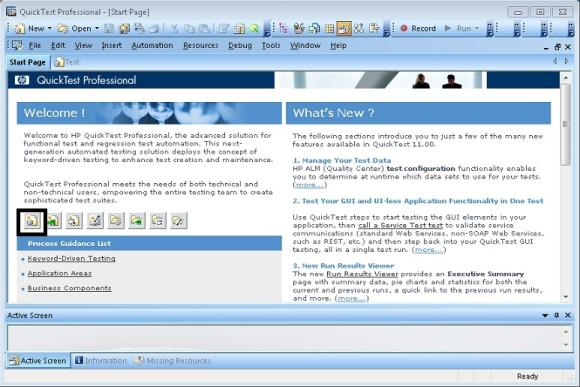

   _Quick Test Professional – [Start Page] showing New Test icon_

5. A new test is created. 
   > Note: You can also create a new test by selecting the Test tab in the main pane of the window or Test sub-menu under the New menu in the menu bar.

6. Click Record in the toolbar to start the recording. 

   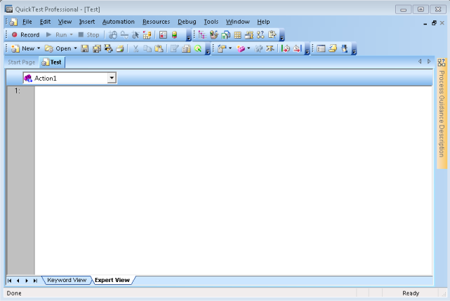

   _Quick Test Professional – [Test] Window showing Record tool_

   >Note: Record and Run Settings dialog box opens.

   

   _Record and Run Settings-Web tab_

7. Select the Windows Application tab. 

   >_Note: The content under the tab is displayed._

   

   _Record and Run Settings-Windows Applications_
 
   >_Note: The Record and run only option is selected by default._

8. Select the following checkbox to ensure that only the applications opened by QuickTest and added applications are tested.
   * Applications opened by Quick Test
   * Applications opened via the Desktop (by the Window shell)
   * Applications specified below
9. To add an application for testing, click the + button in the Application details.

   > _Note:The Application Details dialog box opens._

   

   _Application Details_

10. For Application field, browse and select the path of the application that has to be tested by clicking 

    button.
11. For working folder field, browse and select the path of the working folder by clicking 
    button.
12. Select the Launch application check box, to launch the application immediately after clicking OK. 
13. Select Include descendant processes check box, to include all the processes that are descendant to the current process. 

    > Note:Both Launch application and Include descendant processes check boxes are selected by default

14. Click OK. 
 
    > Note: The path of the application and working folder are displayed in the Application details frame as shown in the following screenshot.

    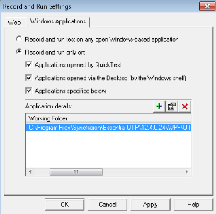

    _Record and Run Settings with application location._

15. Click OK. 
 
    >Note: The recording starts. The application in the given path is opened as shown in the following screenshot.

    

    _Application using SfDataGrid Recording_
	{:.prettyprint}

### Running a Test

On recording, all the user actions performed in the control are just noted with the corresponding method names of the Syncfusion namespace. The errors can be checked while running a test. To run a test: 

1. Click Run in the toolbar. 
>  Note: Run dialog box opens. The Results Location tab is selected by default.

_Run dialog_

### Editing a Test

The editing of a test can be done either in the Keyword view or in the Expert view. You can switch between these views by selecting the required tab at the bottom left of the QTP screen. 

### Editing in Expert View

This view is especially provided for the experts in VB Script. In the Expert view, the VB scripts are generated while recording. You can also manually write scripts to the existing scripts in this view. So, this view can be used as a tool for managing the testing process in a more controlled manner. You can add scripts to trigger events manually. 

The following image shows adding a script line to the Expert View pane.

_Edit in Expert view_

### Editing in Keyboard View

The keyword view is meant for people with no expertise in VB scripts. Keyword view contains the controls used, the user-actions or operations performed, values involved in the operation and the documentation summary in a table format. The controls used are listed under the Item header in a tree-view format as shown in the following screenshot:

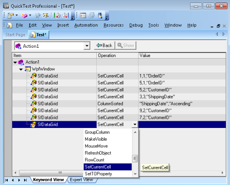

_Edit in Keyword view_

### Saving a Test

Saving a test is as simple as saving any other document or picture. To save a test:

1.Click the Save button in the toolbar. The Save Test dialog box opens.   

                

_Save Test Dialog_        

2.Select the location, to save the file from the Look in drop-down list.                                     
3.Type the name of the file to be saved in the File name text box.                                           
4.Click Save.                                           
5.The test is saved.                                                                         

### Running the Saved Test

The tests that have been saved can be replayed later. For running such tests:

1. Click Open on the toolbar. 
> Note: The Open Test dialog box opens with a list of saved tests.

 _Open Test dialog_

1.Select the required test.                                                   
2.Click Open.                                               

> Note: The saved test is opened with its name and the complete path as the name of the window. By default, Expert View of the Test is opened.

### Tables for Properties and Methods

_SfDataGrid_

<table>
<tr>
<th>
Method</th><th>
Description</th><th>
Parameters </th><th>
Return Type </th></tr>
<tr>
<th>
void SetCurrentCell(int row,int col);</th><th>
To Set the CurrentCell.</th><th>
 int row, int col</th><th>
Void</th></tr>
<tr>
<th>
void GroupColumn(strin columnName);</th><th>
To Group the Column</th><th>
String columnName</th><th>
Void</th></tr>
<tr>
<th>
void UnGroupColumn(string columnName);</th><th>
To Un Group the column</th><th>
String columnName</th><th>
Void</th></tr>
<tr>
<th>
void SortColumn(string columnName,string state);</th><th>
To Sort the column</th><th>
string columnName,string state</th><th>
Void</th></tr>
<tr>
<th>
void BeginEdit(int row,int col);</th><th>
To Enter the Edit mode for particular cell</th><th>
int row,int col</th><th>
Void</th></tr>
<tr>
<th>
void EndEdit();</th><th>
To EndEdit the current cell</th><th>
NA</th><th>
Void</th></tr>
</table>
_Properties_

<table>
<tr>
<th>
Properties</th><th>
Description </th><th>
Type</th><th>
Data Type</th></tr>
<tr>
<th>
Int RowCount</th><th>
Gets the RowCount of the SfDataGrid</th><th>
N/A</th><th>
Int</th></tr>
<tr>
<th>
Int ColumnCount</th><th>
Gets the ColumnCount of the SfDataGrid</th><th>
N/A</th><th>
Int</th></tr>
</table>

The following images show QTP test for SfDataGrid.
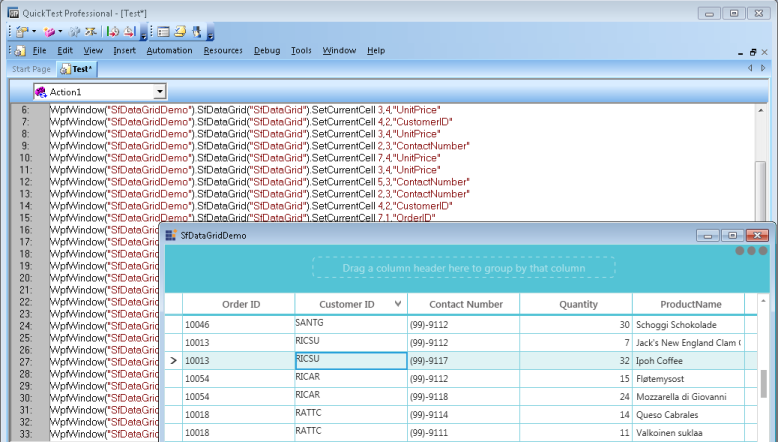

_SfDataGrid QTP Test_

_SfMulticolumnDropDownControl_

<table>
<tr>
<th>
Method</th><th>
Description</th><th>
Parameters </th><th>
Return Type </th></tr>
<tr>
<th>
void SetSelectedIndex(int index);</th><th>
To set the SelectedIndex from the Popup</th><th>
 Int index</th><th>
Void</th></tr>
<tr>
<th>
void ShowPopup();</th><th>
To open the Popup</th><th>
NA</th><th>
Void</th></tr>
<tr>
<th>
void HidePopup();</th><th>
To Close the Popup</th><th>
NA</th><th>
Void</th></tr>
</table>

The following image shows the QTP Test for SfMultiColumnDropDownControl.

_SfMultiColumnDropDownControl QTP Test_

_SfDataPager_

<table>
<tr>
<th>
Method</th><th>
Description</th><th>
Parameters </th><th>
Return Type </th></tr>
<tr>
<th>
void SetCurrentPage(int pageIndex</th><th>
To set the current page in SfDataPager</th><th>
 Int pageIndex</th><th>
Void</th></tr>
</table>

_SfDataPager QTP Test_
