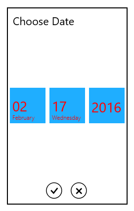

# Appearance and Styling

## Accent Brush	

The AccentBrush property is used to decorate the hot spots of a control with a solid color.



	<Grid Background="{StaticResource ApplicationPageBackgroundThemeBrush}">

        <syncfusion:SfDatePicker  VerticalAlignment="Center"

                                HorizontalAlignment="Center"

                                Width="200"

                                AccentBrush="Green"/>

	</Grid>



The following image shows the control with various Accent brushes:

## Selected Foreground

The SelectedForeground property is used to change the foreground color of  the Selected Date



	<Grid Background="{StaticResource ApplicationPageBackgroundThemeBrush}">

        <syncfusion:SfDatePicker VerticalAlignment="Center"

                         HorizontalAlignment="Center"

                         Width="200">

            <syncfusion:SfDatePicker.SelectorStyle>

                

            </syncfusion:SfDatePicker.SelectorStyle>

        </syncfusion:SfDatePicker>

	</Grid>



