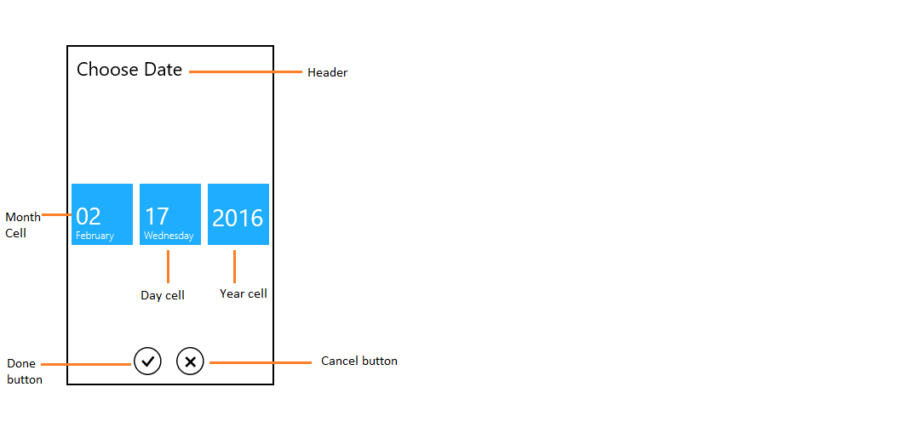
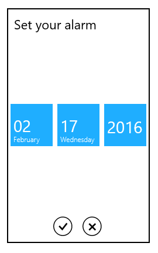
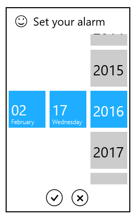
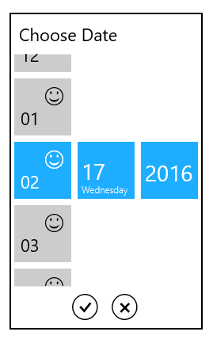

# SfDateSelector

The SfDateSelector control opens inside the drop-down popup.

The visual elements of the date selector can be customized using the [SelectorStyle](https://help.syncfusion.com/cr/wpf/Syncfusion.SfInput.Wpf~Syncfusion.Windows.Controls.Input.SfDatePicker~SelectorStyle.html) property.

## Header

The header property defines the top part of the SfDateSelector.



	<syncfusion:SfDatePicker VerticalAlignment="Center"

                               HorizontalAlignment="Center"

                               Width="200">

            <syncfusion:SfDatePicker.SelectorStyle>

                

            </syncfusion:SfDatePicker.SelectorStyle>

	</syncfusion:SfDatePicker>



## HeaderTemplate

The header template property is used to decorate the header.



	<syncfusion:SfDatePicker VerticalAlignment="Center" 

                               HorizontalAlignment="Center"

                               Width="200">

            <syncfusion:SfDatePicker.SelectorStyle>

                

            </syncfusion:SfDatePicker.SelectorStyle>        
            </syncfusion:SfDatePicker>



## Cell template

The cell template property is used to decorate the selection box with custom visuals. 

N> The DataContext of Selection box is Syncfusion.UI.Xaml.Primitives.DateTimeWrapper.

## DayCellTemplate

The [DayCellTemplate](https://help.syncfusion.com/cr/wpf/Syncfusion.SfInput.Wpf~Syncfusion.Windows.Controls.Input.SfDateSelector~DayCellTemplate.html) property is used to decorate the day cell selection box.



	<syncfusion:SfDatePicker VerticalAlignment="Center"

                               HorizontalAlignment="Center"

                               Width="200">

            <syncfusion:SfDatePicker.SelectorStyle>

                

            </syncfusion:SfDatePicker.SelectorStyle>

	</syncfusion:SfDatePicker>



## MonthCellTemplate

 The [MonthCellTemplate](https://help.syncfusion.com/cr/wpf/Syncfusion.SfInput.Wpf~Syncfusion.Windows.Controls.Input.SfDateSelector~MonthCellTemplate.html) property is used to decorate the month cell selection box. 



	<syncfusion:SfDatePicker VerticalAlignment="Center"

                               HorizontalAlignment="Center"

                               Width="200">

            <syncfusion:SfDatePicker.SelectorStyle>

                

            </syncfusion:SfDatePicker.SelectorStyle>

        </syncfusion:SfDatePicker>



## YearCellTemplate

The [YearCellTemplate](https://help.syncfusion.com/cr/wpf/Syncfusion.SfInput.Wpf~Syncfusion.Windows.Controls.Input.SfDateSelector~YearCellTemplate.html) property is used to decorate the year cell selection box.



	<syncfusion:SfDatePicker VerticalAlignment="Center"

                               HorizontalAlignment="Center"

                               Width="200">

            <syncfusion:SfDatePicker.SelectorStyle>

                

            </syncfusion:SfDatePicker.SelectorStyle>      
			</syncfusion:SfDatePicker>

			
			
