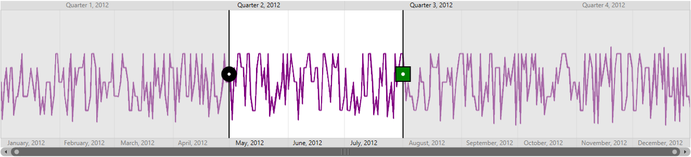

# Interactivity

The date-time range navigator control provides interactive features such as zooming and panning. This control has a resizable scrollbar, which is used to zoom in large amount of data and navigate to particular timespan by moving the scroll bar.

The ZoomPosition and ZoomFactor properties of the chart axis can be bound with the SfDateTimeRangeNavigator.

## Properties

<table>
<tr>
<th>
Property</th><th>
Description</th></tr>
<tr>
<td>
[`ZoomPosition`](https://help.syncfusion.com/cr/cref_files/wpf/sfchart/Syncfusion.SfChart.WPF~Syncfusion.UI.Xaml.Charts.SfRangeNavigator~ZoomPosition.html)</td><td>
Represents the zoom position of the selected range.</td></tr>
<tr>
<td>
[`ZoomFactor`](https://help.syncfusion.com/cr/cref_files/wpf/Syncfusion.SfChart.WPF~Syncfusion.UI.Xaml.Charts.SfRangeNavigator~ZoomFactor.html)</td><td>
Represents the zoom factor of the selected range.</td></tr>
<tr>
<td>
[`SelectedData`](https://help.syncfusion.com/cr/cref_files/wpf/sfchart/Syncfusion.SfChart.WPF~Syncfusion.UI.Xaml.Charts.SfDateTimeRangeNavigator~SelectedData.html)</td><td>
Gets the selected data between selected ranges.</td></tr>
<tr>
<td>
[`ShowGridLines`](https://help.syncfusion.com/cr/cref_files/wpf/Syncfusion.SfChart.WPF~Syncfusion.UI.Xaml.Charts.SfDateTimeRangeNavigator~ShowGridLines.html)</td><td>
Shows the gridlines inside the content.</td></tr>
<tr>
<td>
[`Minimum`](https://help.syncfusion.com/cr/cref_files/wpf/Syncfusion.SfChart.WPF~Syncfusion.UI.Xaml.Charts.SfDateTimeRangeNavigator~Minimum.html)</td><td>
Sets the minimum or starting range of the navigator.</td></tr>
<tr>
<td>
[`Maximum`](https://help.syncfusion.com/cr/cref_files/wpf/Syncfusion.SfChart.WPF~Syncfusion.UI.Xaml.Charts.SfDateTimeRangeNavigator~Maximum.html)</td><td>
Sets the maximum or ending range of the navigator.</td></tr>
<tr>
<td>
[`ViewRangeStart`](https://help.syncfusion.com/cr/cref_files/wpf/Syncfusion.SfChart.WPF~Syncfusion.UI.Xaml.Charts.SfRangeNavigator~ViewRangeStart.html)</td><td>
Gets the start value of the selected range.</td></tr>
<tr>
<td>
[`ViewRangeEnd`](https://help.syncfusion.com/cr/cref_files/wpf/Syncfusion.SfChart.WPF~Syncfusion.UI.Xaml.Charts.SfRangeNavigator~ViewRangeEnd.html)</td><td>
Gets the end value of the selected range.</td></tr>
<tr>
<td>
[`EnableDeferredUpdate`](https://help.syncfusion.com/cr/cref_files/wpf/Syncfusion.SfChart.WPF~Syncfusion.UI.Xaml.Charts.SfDateTimeRangeNavigator~EnableDeferredUpdate.html)</td><td>
Enables deferred scrolling and panning.</td></tr>
<tr>
<td>
[`DeferredUpdateDelay`](https://help.syncfusion.com/cr/cref_files/wpf/Syncfusion.SfChart.WPF~Syncfusion.UI.Xaml.Charts.SfDateTimeRangeNavigator~DeferredUpdateDelay.html)</td><td>
Gets or sets the delay value when the EnableDeferredUpdate is enabled.</td></tr>
</table>

## Events

<table>
<tr>
<th>
Event</th><th>
Parameters</th><th>
Description</th></tr>
<tr>
<td>
[`ValueChanged`](https://help.syncfusion.com/cr/cref_files/wpf/sfchart/Syncfusion.SfChart.WPF~Syncfusion.UI.Xaml.Charts.SfRangeNavigator~ValueChanged_EV.html)</td><td>
ValueChanged (Object sender, EventArgs e)</td><td>
This event is triggered when the position of the scrollbar is changed</td></tr>
</table>





<chart:SfChart x:Name="financialChart">            

  <chart:SfChart.PrimaryAxis>

         <chart:CategoryAxis Name="axis1" ZoomPosition="{Binding ElementName=RangeNavigator, Path=ZoomPosition, Mode=TwoWay}" 
         
                             ZoomFactor="{Binding ElementName=RangeNavigator, Path=ZoomFactor, Mode=TwoWay}"

                             Header="Date" LabelFormat="MMM/dd" 

                             LabelTemplate="{StaticResource labelTemplate}" />                

  </chart:SfChart.PrimaryAxis>            

  <chart:SfChart.SecondaryAxis>                

                  <chart:NumericalAxis  />  

</chart:SfChart.SecondaryAxis>            

<chart:CandleSeries Name="series" ItemsSource="{Binding StockPriceDetails}" XBindingPath="_Date"  High="High" Open="Open" Close="Close" Low="Low"  Label="Candleseries">            

</chart:CandleSeries>        

</chart:SfChart>        

<chart:SfDateTimeRangeNavigator x:Name="RangeNavigator" ItemsSource="{Binding StockPriceDetails}" XBindingPath="_Date" >                

	<chart:SfDateTimeRangeNavigator.Content>                   

		<chart:SfLineSparkline ItemsSource="{Binding StockPriceDetails}"   YBindingPath="High" > 

        </chart:SfLineSparkline>                

	</chart:SfDateTimeRangeNavigator.Content>            

</chart:SfDateTimeRangeNavigator>





SfDateTimeRangeNavigator rangeNavigator = new SfDateTimeRangeNavigator()
{

    ItemsSource = new ViewModel().StockPriceDetails,

    XBindingPath = "Date",

    VerticalAlignment = VerticalAlignment.Top

};

SfLineSparkline sparkline = new SfLineSparkline()
{

    ItemsSource = new ViewModel().StockPriceDetails,

    YBindingPath = "High"

};

rangeNavigator.Content = sparkline;

Grid.SetColumn(rangeNavigator, 1);

SfChart chart = new SfChart();

chart.PrimaryAxis = new CategoryAxis()
{

    PlotOffset = 25,

    Header = "Date",

    LabelFormat = "MMM/dd",

    ZoomPosition = rangeNavigator.ZoomPosition,

    ZoomFactor = rangeNavigator.ZoomFactor

};

chart.SecondaryAxis = new NumericalAxis();

CandleSeries candleSeries=new CandleSeries ()
{

    ItemsSource = new ViewModel().StockPriceDetails,

    High ="High", Low = "Low",

    Open ="Open", Close ="Close",

    XBindingPath ="Date",

    Label ="CandleSeries"

};

chart.Series.Add(candleSeries);





The following screenshot illustrates selecting one quarter of data.

The following screenshot illustrates the control after zooming into weeks of data from 6 months of data.

## Thumb style customization

The date-time range navigator control provides the following properties to customize the elements such as upper bar, lower bar, left thumb, and right thumb.

<table>
<tr>
<th>
Property</th><th>
Description</th></tr>
<tr>
<td>
[`LeftThumbStyle`](https://help.syncfusion.com/cr/cref_files/wpf/sfchart/Syncfusion.SfChart.WPF~Syncfusion.UI.Xaml.Charts.SfDateTimeRangeNavigator~LeftThumbStyle.html)</td><td>
Defines the style for the left thumb of the navigator.</td></tr>
<tr>
<td>
[`RightThumbStyle`](https://help.syncfusion.com/cr/cref_files/wpf/Syncfusion.SfChart.WPF~Syncfusion.UI.Xaml.Charts.SfDateTimeRangeNavigator~RightThumbStyle.html)</td><td>
Defines the style for the right thumb of the navigator.</td></tr>
<tr>
<td>
[`LineStyle`](https://help.syncfusion.com/cr/cref_files/wpf/Syncfusion.SfChart.WPF~Syncfusion.UI.Xaml.Charts.ThumbStyle~LineStyle.html)</td><td>
Defines the style for line in the left or right thumb.</td></tr>
<tr>
<td>
[`SymbolTemplate`](https://help.syncfusion.com/cr/cref_files/wpf/Syncfusion.SfChart.WPF~Syncfusion.UI.Xaml.Charts.ThumbStyle~SymbolTemplate.html)</td><td>
Defines the style for symbol placed in the left or right thumb.</td></tr>
</table>





<syncfusion:SfDateTimeRangeNavigator x:Name="navigator">

    <syncfusion:SfRangeNavigator.Resources>

        <DataTemplate x:Key="symbolTemplate">

            <Grid>

                <Ellipse Height="40" Width="40"  Fill="Green" Stroke="Black"
                                 
                                 VerticalAlignment="Center" StrokeThickness="2"/>

                <Ellipse Height="7" Width="7" Fill="White" 

                         VerticalAlignment="Center"/>
                        
            </Grid>

        </DataTemplate>

    </syncfusion:SfRangeNavigator.Resources>

    <syncfusion:SfDateTimeRangeNavigator.RightThumbStyle>

        <syncfusion:ThumbStyle SymbolTemplate="{StaticResource symbolTemplate}"/>

    </syncfusion:SfDateTimeRangeNavigator.RightThumbStyle>

</syncfusion:SfDateTimeRangeNavigator>





ThumbStyle thumbStyle = new ThumbStyle()
{

    SymbolTemplate = grid.Resources["symbolTemplate"] as DataTemplate

};

SfDateTimeRangeNavigator rangeNavigator = new SfDateTimeRangeNavigator()
{

    ItemsSource = new ViewModel().StockPriceDetails,

    XBindingPath = "Date",

    RightThumbStyle = thumbStyle

};





The following screenshot illustrates the control after customizing the right thumb.

## Higher and lower bars customization

<table>
<tr>
<th>
Property</th><th>
Description</th></tr>
<tr>
<td>
[`HigherBarGridLineStyle`](https://help.syncfusion.com/cr/cref_files/wpf/Syncfusion.SfChart.WPF~Syncfusion.UI.Xaml.Charts.SfDateTimeRangeNavigator~HigherBarGridLineStyle.html)</td><td>
Defines the style for gridlines of upper labels bar.</td></tr>
<tr>
<td>
[`LowerBarGridLineStyle`](https://help.syncfusion.com/cr/cref_files/wpf/Syncfusion.SfChart.WPF~Syncfusion.UI.Xaml.Charts.SfDateTimeRangeNavigator~LowerBarGridLineStyle.html)</td><td>
Defines the style for gridlines of lower labels bar.</td></tr>
<tr>
<td>
[`HigherBarTickLineStyle`](https://help.syncfusion.com/cr/cref_files/wpf/Syncfusion.SfChart.WPF~Syncfusion.UI.Xaml.Charts.SfDateTimeRangeNavigator~HigherBarTickLineStyle.html)</td><td>
Defines the style for ticklines of upper labels bar.</td></tr>
<tr>
<td>
[`LowerBarTickLineStyle`](https://help.syncfusion.com/cr/cref_files/wpf/Syncfusion.SfChart.WPF~Syncfusion.UI.Xaml.Charts.SfDateTimeRangeNavigator~LowerBarTickLineStyle.html)</td><td>
Defines the style for ticklines of lower labels bar.</td></tr>
</table>
