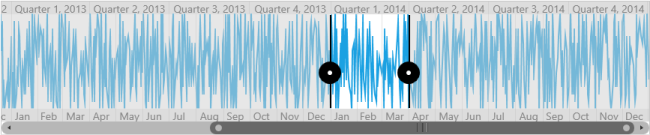

# Label Customization

The SfDateTimeRangeNavigator helps the user to visualize large data in a simplified manner. The timespan of the data is represented in the Higher Level Bar and Lower Level Bar. The timespan in default calculated smartly and provide the suitable DateTime format and Interval for the given data.

User can also set the Interval which they think suitable for their data, this can be done by using Interval Property as in below code snippet. 

### Property

<table>
<tr>
<th>
Property</th><th>
Description</th></tr>
<tr>
<td>
Intervals</td><td>
Used to set the Interval type which need to be displayed in the Navigator</td></tr>
</table>



<syncfusion:SfDateTimeRangeNavigator x:Name="rangepicker" ItemsSource="{Binding power}"  XBindingPath="Date" >

	<syncfusion:SfDateTimeRangeNavigator.Intervals> 

		<syncfusion:Interval IntervalType="Quarter"/>

		<syncfusion:Interval IntervalType="Month"/>

	</syncfusion:SfDateTimeRangeNavigator.Intervals>

	<syncfusion:SfDateTimeRangeNavigator.Content>

		<syncfusion:SfChart   >

			<syncfusion:SfChart.PrimaryAxis>

				<syncfusion:CategoryAxis Visibility="Collapsed" />

			</syncfusion:SfChart.PrimaryAxis>

			<syncfusion:SfChart.SecondaryAxis>

				<syncfusion:NumericalAxis Visibility="Collapsed" />

			</syncfusion:SfChart.SecondaryAxis>

			<syncfusion:FastLineBitmapSeries XBindingPath="Date" ItemsSource="{Binding power}" YBindingPath="Value">

				</syncfusion:FastLineBitmapSeries>

		</syncfusion:SfChart>

		</syncfusion:SfDateTimeRangeNavigator.Content>

</syncfusion:SfDateTimeRangeNavigator>



Following is the screenshot of showing only Quarter and Month intervals in the Navigator

Quarter and Month intervals in the Navigator
{:.caption}

## The Interval has the following types 

* Year
* Quarter
* Month
* Week
* Day
* Hour

The auto timespan format simplifies the visual representation of data while zooming in with the below formats.

_List of Intervals_

<table>
<tr>
<th>
Intervals</th><th>
Examples</th></tr>
<tr>
<td>
HourInterval</td><td>
7/21/2011 12:00:00 AM -> 12 AM7/21/2011 12:00:00 AM -> 12A</td></tr>
<tr>
<td>
DayInterval</td><td>
7/21/2011 12:00:00 AM -> Thursday, July 21, 20117/21/2011 12:00:00 AM -> Thu, Jul 21, 20117/21/2011 12:00:00 AM -> Thursday, 217/21/2011 12:00:00 AM -> Thu, 21</td></tr>
<tr>
<td>
WeekInterval</td><td>
7/21/2011 12:00:00 AM -> Week 29, July, 20117/21/2011 12:00:00 AM -> Week 29, Jul, 20117/21/2011 12:00:00 AM -> Week 297/21/2011 12:00:00 AM -> W29</td></tr>
<tr>
<td>
MonthInterval</td><td>
7/21/2011 12:00:00 AM -> July, 20117/21/2011 12:00:00 AM -> July7/21/2011 12:00:00 AM -> Jul7/21/2011 12:00:00 AM -> J</td></tr>
<tr>
<td>
QuarterInterval</td><td>
7/21/2011 12:00:00 AM -> Quarter 3, 20117/21/2011 12:00:00 AM -> Quarter 37/21/2011 12:00:00 AM -> Q3, 20117/21/2011 12:00:00 AM -> Q3</td></tr>
<tr>
<td>
YearInterval</td><td>
7/21/2011 12:00:00 AM -> 2011</td></tr>
</table>

## Label Style Customization

Label Style can be customized using the LabelBarStyle property and this can be applied to the HigherLevelBarStyle or LowerLevelBarStyle.



<chart:SfDateTimeRangeNavigator.HigherLevelBarStyle>

	<chart:LabelBarStyle Background="Red" LabelHorizontalAlignment="Left">

		<chart:LabelBarStyle.LabelStyle>

			

		</chart:LabelBarStyle.LabelStyle>

	</chart:LabelBarStyle>

</chart:SfDateTimeRangeNavigator.HigherLevelBarStyle>



Following is the screenshot of Label HorizontalAlignment set to left.

Label HorizontalAlignment set to left
{:.caption}
