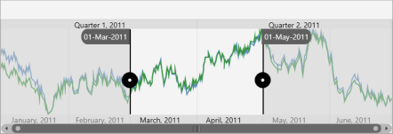

# ToolTip Support

DateTimeRangeNavigator control provides ToolTip support for Sliders. Sliders are used to select a particular region of data in the DateTimeRangeNavigator control. ToolTips for sliders show the selected start and end date time values. You can even view exact date values to the precision of milliseconds.

## Properties

The following properties are used to customize the ToolTip Settings for the DateTimeRangeNavigator control.

_Property Table_

<table>
<tr>
<th>
Property Name</th><th>
Description</th></tr>
<tr>
<td>
ShowToolTip</td><td>
Shows or hides the tooltip.</td></tr>
<tr>
<td>
ToolTipLabelFormat</td><td>
Sets the date time label format for the tooltip.</td></tr>
<tr>
<td>
LeftToolTipTemplate</td><td>
Sets the data template for the left tooltip.</td></tr>
<tr>
<td>
RightToolTipTemplate</td><td>
Sets the data template for the right tooltip.</td></tr>
</table>



<chart:SfDateTimeRangeNavigator x:Name="RangeNavigator" 

ItemsSource="{Binding StockPriceDetails}" XBindingPath="_Date" 

ShowToolTip="true" ToolTipLabelFormat ="MMM/dd/yyyy">

<chart:SfDateTimeRangeNavigator.LeftToolTipTemplate>

<DataTemplate>

-----------------------

</DataTemplate>

</chart:SfDateTimeRangeNavigator.LeftToolTipTemplate>

<chart:SfDateTimeRangeNavigator.Content>

</chart:SfDateTimeRangeNavigator.Content>

</chart:SfDateTimeRangeNavigator>



_DateTimeRangeNavigator with tooltip_

