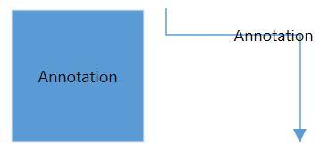
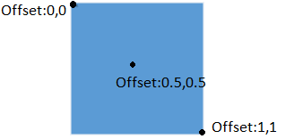
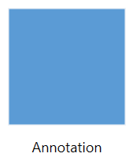
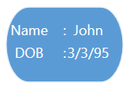
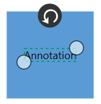
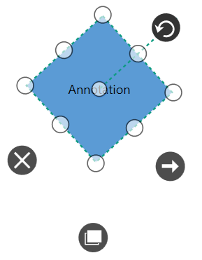

# Annotation

Annotation is a block of text that can be displayed over a Node or Connector. Annotation is used to textually represent an object with a string that can be edited at run time.You can add Multiple Labels to a Node/Connector.

## Define Annotation

'Annotation' property of Node/Connector should be initialized with the Collection. Annotation itself having the properties to update the position, alignment and interaction with this.




<!--Initialize the SfDiagram-->
<syncfusion:SfDiagram x:Name="diagram">
 <!--Initialize the NodeCollection-->
 <syncfusion:SfDiagram.Nodes>
  <syncfusion:NodeCollection>
   <!--Initialize the Node-->
   <syncfusion:NodeViewModel UnitHeight="100" UnitWidth="100" OffsetX="100" OffsetY="100" Shape="{StaticResource Rectangle}">
    <syncfusion:NodeViewModel.Annotations>
     <!--Initialize the AnnotationCollection-->
     <syncfusion:AnnotationCollection>
      <!--Initialize the Annotation-->
      <syncfusion:AnnotationEditorViewModel Content="Annotation">
      </syncfusion:AnnotationEditorViewModel>
     </syncfusion:AnnotationCollection>
    </syncfusion:NodeViewModel.Annotations>
   </syncfusion:NodeViewModel>
  </syncfusion:NodeCollection>
 </syncfusion:SfDiagram.Nodes>
</syncfusion:SfDiagram>





//Define the NodeCollection
diagram.Nodes = new NodeCollection();
//Define the Node
NodeViewModel node = new NodeViewModel()
{
    UnitHeight = 100,
    UnitWidth = 100,
    OffsetX = 100,
    OffsetY = 100,
    Shape = new RectangleGeometry() { Rect = new Rect(0, 0, 10, 10) },
    //Define the AnnotationCollection
    Annotations = new AnnotationCollection()
    {
        //Define the Annotation
        new AnnotationEditorViewModel()
        {
            Content="Annotation",
        }
    }
};
//Adding Node to Collection
(diagram.Nodes as ObservableCollection<NodeViewModel>).Add(node);




N> Annotation for Connector also similar to Node.

## Alignment

Annotation can be aligned relative to the Node boundaries. It has Margin, Offset, Horizontal and Vertical Alignment settings. It is quite tricky when all four alignments are used together but gives you more control over alignment.

### Annotation of Node

### Offset

The `Offset` property of IAnnotation is used to align the Annotations based on fractions. 0 represents Top/Left corner, 1 represents Bottom/Right corner, and 0.5 represents half of Width/Height.

The following image shows the relationship between the Annotation position (black colored circle) and Offset (fraction values).

### Horizontal and Vertical alignments

The `HorizontalAlignment` property of IAnnotation is used to set how the Annotation is horizontally aligned at the Annotation position determined from the fraction values. The `VerticalAlignment` property is used to set how Annotation is vertically aligned at the Annotation position.




//Define the NodeCollection
diagram.Nodes = new NodeCollection();
//Define the Node
NodeViewModel node = new NodeViewModel()
{
    UnitHeight = 100,
    UnitWidth = 100,
    OffsetX = 100,
    OffsetY = 100,
    Shape = new RectangleGeometry() { Rect = new Rect(0, 0, 10, 10) },
    //Define the AnnotationCollection
    Annotations = new AnnotationCollection()
    {
        //Define the Annotation
        new AnnotationEditorViewModel()
         {
             Content="Annotation",
             HorizontalAlignment=HorizontalAlignment.Left,
             VerticalAlignment=VerticalAlignment.Top,
             Offset=new Point(0,0),
         }
    }
};
//Adding Node to Collection
(diagram.Nodes as ObservableCollection<NodeViewModel>).Add(node);




| Horizontal Alignment | Vertical Alignment | Output with Offset(0,0) |
|---|---|---|
| Left | Top |  |
| Center | |  |
| Right | |  |
| Left | Center |  |
| Center | |  |
| Right | |  |
| Left | Bottom |  |
| Center | |  |
| Right | |  |

### Margin

`Margin` is an absolute value used to add some blank space in any one of its four sides. You can displace the Annotations with the `Margin` property. The following code example illustrates how to align an Annotation based on its Offset, HorizontalAlignment, VerticalAlignment and Margin values.



//Define the NodeCollection
diagram.Nodes = new NodeCollection();
//Define the Node
NodeViewModel node = new NodeViewModel()
{
    UnitHeight = 100,
    UnitWidth = 100,
    OffsetX = 100,
    OffsetY = 100,
    Shape = new RectangleGeometry() { Rect = new Rect(0, 0, 10, 10) },
    //Define the AnnotationCollection
    Annotations = new AnnotationCollection()
    {
        //Define the Annotation
        new AnnotationEditorViewModel()
        {
            Content="Annotation",
            HorizontalAlignment=HorizontalAlignment.Center,
            VerticalAlignment=VerticalAlignment.Top,
            Offset=new Point(0.5,1),
            Margin=new Thickness(0,10,0,0),
        }
    }
};
//Adding Node to Collection
(diagram.Nodes as ObservableCollection<NodeViewModel>).Add(node);




### Annotation of Connector

### Offset

The `Offset` property of IAnnotation is used to align the Annotations based on fractions. 0 represents Top/Left corner, 1 represents Bottom/Right corner, and 0.5 represents half of Width/Height.

The following image shows the relationship between the Annotation position (black colored circle) and Offset (fraction values).

### Margin

`Margin` is an absolute value used to add some blank space in any one of its four sides. You can displace the Annotations with the `Margin` property. The following code example illustrates how to align an Annotation based on its Offset, and Margin values.




//Define the ConnectorCollection
diagram.Connectors = new ConnectorCollection();
//Define the Connector
ConnectorViewModel connector = new ConnectorViewModel()
{
    SourcePoint=new Point(200,50),
    TargetPoint=new Point(300,150),
    //Define the AnnotationCollection
    Annotations = new AnnotationCollection()
    {
        //Define the Annotation
        new AnnotationEditorViewModel()
        {
            Content = "Annotation",
            //Initialize the Margin
            Margin = new Thickness(120, 120, 0, 0),
            //Initialize the Offset
            Offset = new Point(0, 0)
        }
    }
};
//Adding Connector to Collection
(diagram.Connectors as ObservableCollection<ConnectorViewModel>).Add(connector);




## Wrapping

When text overflows Node boundaries, you can control it by using Text Wrapping. So, it is wrapped into multiple lines. The Wrapping property of Annotation defines how the Content should be wrapped.




//Define the AnnotationCollection
Annotations = new AnnotationCollection()
{
    //Define the Annotation
    new AnnotationEditorViewModel()
    {
        Content = "Annotation with wrapping text",
        //Define the WrapText
        WrapText=TextWrapping.Wrap,
    }
}




| Values | Description | Node | Connector|
|---|---|---|---|
| NoWrap | Text will not be wrapped. |  |  |
| Wrap | Text-wrapping occurs when the text overflows beyond the available Node width. |  |  |
| WrapWithOverflow | Text-wrapping occurs when the text overflows beyond the available Node width. However, the text may overflow beyond the Node width in the case of a very long word. |  |  |

## Appearance 

`EditTemplate` and `ViewTemplate` can be customized using Annotation.




<DataTemplate x:Key="viewtemplate">
  <TextBlock Text="{Binding Path=Content, Mode=TwoWay}" FontStyle="Italic" 
             FontSize="12" FontFamily="TimesNewRomen"
             TextDecorations="Underline" FontWeight="Bold"
             Foreground="Black"/> 
</DataTemplate>







//Define the Annotation
AnnotationEditorViewModel annotation = new AnnotationEditorViewModel()
{
    Content = "Annotation",
    //Define the ViewTemplate
    ViewTemplate = this.Resources["viewtemplate"] as DataTemplate
};




## Interaction

Annotation can be Selectable, Draggable, Resizable, Rotatable and Editable.The Interaction can be controlled by Annotation and it's Parent (Node/Connector).




//Define the Annotation
AnnotationEditorViewModel annotation = new AnnotationEditorViewModel()
{
    Content = "Annotation",
    //Define the Constraints
    Constraints = AnnotationConstraints.Default,
};




For AnnotationConstraints please refer to [AnnotationConstraints](https://help.syncfusion.com/cr/cref_files/wpf/sfdiagram/Syncfusion.SfDiagram.WPF~Syncfusion.UI.Xaml.Diagram.AnnotationConstraints.html "AnnotationConstraints").

## Rotation
Automatic annotation orientation based on Parent(Node/Connector) or Page direction. To make Annotation of the Node as always horizontal when Node is rotated. We have provided `RotationReference` property to the Annotation.




//Define the Annotation
AnnotationEditorViewModel annotation = new AnnotationEditorViewModel()
{
    Content = "Annotation",
    //Define the RotationReference
    RotationReference=RotationReference.Page
};




The below image represents " RotationReference=RotationReference.Page" for Annotation (Node).

## Multiple Annotations

You can add any number of Annotations to a Node or Connector.
For sample, please refer to [MultipleAnnotation](http://www.syncfusion.com/downloads/support/directtrac/153031/ze/MultipleAnnotation1970891699 "MultipleAnnotation").

