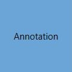
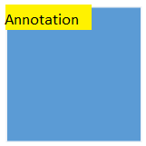
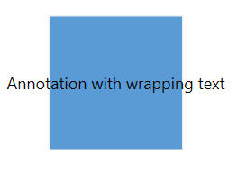
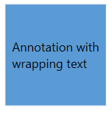
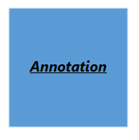
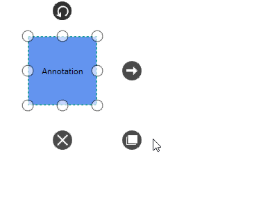

# Annotation

Annotation is a block of text that can be displayed over a Node or Connector. Annotation is used to textually represent an object with a string that can be edited at run time.Multiple annotations can be added to a node/connector.

## Define Annotation

An Annotation can be added to a Node/Connector by defining the annotation object and adding that to the annotation collection of the Node/Connector. The `Content` property of annotation defines the text to be displayed. The following code illustrates how to create a annotation.




            <!--Initialize the SfDiagram-->
            <syncfusion:SfDiagram x:Name="diagram">
                <!--Initialize the NodeCollection-->
                <syncfusion:SfDiagram.Nodes>
                    <syncfusion:NodeCollection>
                        <!--Initialize the Node-->
                        <syncfusion:NodeViewModel UnitHeight="100" UnitWidth="100" OffsetX="100" OffsetY="100">
                            <syncfusion:NodeViewModel.Annotations>
                                <!--Initialize the AnnotationCollection-->
                                <syncfusion:AnnotationCollection>
                                    <!--Initialize the Annotation-->
                                    <syncfusion:AnnotationEditorViewModel Content="Annotation">
                                    </syncfusion:AnnotationEditorViewModel>
                                </syncfusion:AnnotationCollection>
                            </syncfusion:NodeViewModel.Annotations>
                        </syncfusion:NodeViewModel>
                    </syncfusion:NodeCollection>
                </syncfusion:SfDiagram.Nodes>
            </syncfusion:SfDiagram>





            //Initialize the NodeCollection
            diagram.Nodes = new NodeCollection();
            //Initialize the NodeViewModel
            NodeViewModel node = new NodeViewModel()
            {
                UnitWidth = 100,
                UnitHeight = 100,
                OffsetX = 100,
                OffsetY = 100,
                //Initialize the AnnotationCollection
                Annotations = new ObservableCollection<IAnnotation>()
                {
                    //Initialize the Annotation
                    new AnnotationEditorViewModel()
                    {
                        Content="Annotation"
                    }
                }
            };
            // Add the node to diagram.Nodes
            (diagram.Nodes as NodeCollection).Add(node);




N> Annotation for Connector also similar to Node.

## Alignment

Annotation can be aligned relative to the node boundaries. It has Margin, Offset, Horizontal, and Vertical alignment settings. It is quite tricky when all four alignments are used together but gives more control over `Alignment`.

### Annotation of Node

### Offset

The `Offset` property of annotation is used to align the annotations based on fractions. 0 represents top/left corner, 1 represents bottom/right corner, and 0.5 represents half of width/height.

Set the size for a nodes annotation by using `UnitWidth` and `UnitHeight` properties.

The following image shows the offset (fraction values) based on node and size of the annotation.

### Horizontal and Vertical Alignments

The `HorizontalAlignment` property of IAnnotation is used to set how the Annotation is horizontally aligned at the Annotation position determined from the fraction values. The `VerticalAlignment` property is used to set how Annotation is vertically aligned at the Annotation position.




//Define the NodeCollection
diagram.Nodes = new NodeCollection();
//Define the Node
NodeViewModel node = new NodeViewModel()
{
    UnitHeight = 100,
    UnitWidth = 100,
    OffsetX = 100,
    OffsetY = 100,
    Shape = new RectangleGeometry() { Rect = new Rect(0, 0, 10, 10) },
    //Define the AnnotationCollection
    Annotations = new AnnotationCollection()
    {
        //Define the Annotation
        new AnnotationEditorViewModel()
         {
             Content="Annotation",
             HorizontalAlignment=HorizontalAlignment.Left,
             VerticalAlignment=VerticalAlignment.Top,
             Offset=new Point(0,0),
         }
    }
};
//Adding Node to Collection
(diagram.Nodes as ObservableCollection<NodeViewModel>).Add(node);




| Horizontal Alignment | Vertical Alignment | Output with Offset(0,0) |
|---|---|---|
| Left | Top |  |
| Center | |  |
| Right | |  |
| Left | Center |  |
| Center | |  |
| Right | |  |
| Left | Bottom |  |
| Center | |  |
| Right | |  |

### Margin

`Margin` is an absolute value used to add some blank space in any one of its four sides. The annotations can be displaced with the margin property. The following code example illustrates how to align a annotation based on its Offset, HorizontalAlignment, VerticalAlignment, and Margin values.




<!--Initialize the Annotation-->
 <syncfusion:AnnotationEditorViewModel Content="Annotation" Offset="0.5,1" VerticalAlignment="Top" Margin="0,10,0,0"/>
 



    //Initialize the Annotation
    AnnotationEditorViewModel annotation = new AnnotationEditorViewModel()
    {
         Content = "Annotation",
         VerticalAlignment = VerticalAlignment.Top,
         Offset = new Point(0.5, 1),
         Margin = new Thickness(0, 10, 0, 0),
     };




### Annotation of Connector

### Length

The `Length` property of Annotation is used to align the Annotations based on fractions. 0 represents Top/Left corner, 1 represents Bottom/Right corner, and 0.5 represents half of Width/Height.

The following image shows the relationship between the Annotation position and Length (fraction values).

### Margin

`Margin` is an absolute value used to add some blank space in any one of its four sides. You can displace the Annotations with the `Margin` property. The following code example illustrates how to align an Annotation based on its Offset, and Margin values.




 <!--Initialize the Annotation-->
     <syncfusion:AnnotationEditorViewModel Content="Annotation" RotationReference="Page" Length="1" VerticalAlignment="Top" Margin="0,10,0,0"/>                          
                                



    //Initialize the Annotation
     AnnotationEditorViewModel annotation = new AnnotationEditorViewModel()
            {
                Content = "Annotation",
                VerticalAlignment = VerticalAlignment.Top,
                Length = 1,
                Margin = new Thickness(0, 10, 0, 0),
                // Decide to apply orientation or rotation based on segment when annotation positioned.
                RotationReference = RotationReference.Page
            };




## Wrapping

When text overflows Node boundaries, you can control it by using `WrapText` property. So, it is wrapped into multiple lines. The Wrapping property of Annotation defines how the Content should be wrapped.




//Define the AnnotationCollection
Annotations = new AnnotationCollection()
{
    //Define the Annotation
    new AnnotationEditorViewModel()
    {
        Content = "Annotation with wrapping text",
        //Define the WrapText
        WrapText=TextWrapping.Wrap,
    }
}




| Values | Description | Node |
|---|---|---|---|
| NoWrap | Text will not be wrapped. |  |
| Wrap | Text-wrapping occurs when the text overflows beyond the available Node width. |  |
| WrapWithOverflow | Text-wrapping occurs when the text overflows beyond the available Node width. However, the text may overflow beyond the Node width in the case of a very long word. |  |

## Appearance 

`EditTemplate` and `ViewTemplate` can be customized using Annotation.




<DataTemplate x:Key="viewtemplate">
  <TextBlock Text="{Binding Path=Content, Mode=TwoWay}" FontStyle="Italic" 
             FontSize="12" FontFamily="TimesNewRomen"
             TextDecorations="Underline" FontWeight="Bold"
             Foreground="Black"/> 
</DataTemplate>







//Define the Annotation
AnnotationEditorViewModel annotation = new AnnotationEditorViewModel()
{
    Content = "Annotation",
    //Define the ViewTemplate
    ViewTemplate = this.Resources["viewtemplate"] as DataTemplate
};




## Interaction

Annotation can be Select, Drag, Resize and Rotate by using `AnnotationConstraints`.The Interaction can be controlled by Annotation and it's Parent (Node/Connector).
To explore about Annotation Constraints, please refer to the [Annotation Constraints](https://help.syncfusion.com/cr/cref_files/wpf/Syncfusion.SfDiagram.WPF~Syncfusion.UI.Xaml.Diagram.AnnotationConstraints.html) .




AnnotationEditorViewModel annotation = new AnnotationEditorViewModel()
            {
                Content = "Annotation",
                Constraints = AnnotationConstraints.Default,
            };




### Reference for Rotation

 * `RotationReference` property of the Annotation is to define the rotation based on Page/its host(Node/Connector).To explore about Rotate Reference property, please refer to the [RotationReference](https://help.syncfusion.com/cr/cref_files/wpf/Syncfusion.SfDiagram.WPF~Syncfusion.UI.Xaml.Diagram.RotationReference.html) . 




AnnotationEditorViewModel annotation = new AnnotationEditorViewModel()
            {
                Content = "Annotation",
                Constraints = AnnotationConstraints.Default,
                RotationReference = RotationReference.Parent,
            };




* [AnnotationChanged](https://help.syncfusion.com/cr/cref_files/wpf/Syncfusion.SfDiagram.WPF~Syncfusion.UI.Xaml.Diagram.AnnotationChangedEventArgs.html) event will notify the action, state of action and value changes.

## Multiple Annotations

You can add any number of Annotations to a Node or Connector.
For sample, please refer to [MultipleAnnotation](http://www.syncfusion.com/downloads/support/directtrac/239374/ze/MultipleAnnotation-627408298 "MultipleAnnotation").

