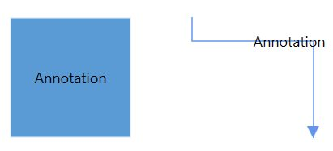
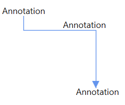

# Annotation

Annotation is a block of text that can be displayed over a node or connector. Annotation is used to textually represent an object with a string that can be edited at run time. Multiple annotations can be added to a node or connector.

## Define annotation

An annotation can be added to a node or connector by defining the annotation object and adding that to the annotation collection of the node or connector. The `Content` property of `AnnotationEditorViewModel` class defines the text to be displayed. The following code explains how to create an annotation.



<!--Initialize the SfDiagram-->
<syncfusion:SfDiagram x:Name="diagram">
    <!--Initialize the NodeCollection-->
    <syncfusion:SfDiagram.Nodes>
        <syncfusion:NodeCollection>
            <!--Initialize the Node-->
            <syncfusion:NodeViewModel UnitWidth="100" UnitHeight="100" OffsetX="100" OffsetY="100" Shape="{StaticResource Rectangle}" >
                <syncfusion:NodeViewModel.Annotations>
                    <!--Initialize the AnnotationCollection-->
                    <syncfusion:AnnotationCollection>
                        <!--Initialize the Annotation-->
                        <syncfusion:AnnotationEditorViewModel Content="Annotation"/>
                    </syncfusion:AnnotationCollection>
                </syncfusion:NodeViewModel.Annotations>
            </syncfusion:NodeViewModel>
        </syncfusion:NodeCollection>
    </syncfusion:SfDiagram.Nodes>
    <!--Initialize the Connector-->
    <syncfusion:SfDiagram.Connectors>
        <!--Initialize the ConnectorCollection-->
        <syncfusion:ConnectorCollection>
            <!--Initialize the Connector-->
            <syncfusion:ConnectorViewModel SourcePoint="200,50" TargetPoint="300,150">
                <syncfusion:ConnectorViewModel.Annotations>
                    <!--Initialize the AnnotationCollection-->
                    <syncfusion:AnnotationCollection>
                        <!--Initialize the Annotation-->
                        <syncfusion:AnnotationEditorViewModel Content="Annotation"/>
                    </syncfusion:AnnotationCollection>
                </syncfusion:ConnectorViewModel.Annotations>
            </syncfusion:ConnectorViewModel>
        </syncfusion:ConnectorCollection>
    </syncfusion:SfDiagram.Connectors>
</syncfusion:SfDiagram>




//Initialize the diagram
SfDiagram diagram = new SfDiagram();

//Initialize the NodeViewModel
NodeViewModel node = new NodeViewModel()
    {
        UnitWidth = 100,
        UnitHeight = 100,
        OffsetX = 100,
        OffsetY = 100,
        Shape = new RectangleGeometry() { Rect = new Rect(0, 0, 10, 10) },
        //Initialize the AnnotationCollection
        Annotations = new ObservableCollection<IAnnotation>()
            {
                //Initialize the Annotation
                new AnnotationEditorViewModel()
                    {
                        Content="Annotation"
                    }
                }
            };

        //Initialize the ConnectorViewModel
        ConnectorViewModel connector = new ConnectorViewModel()
            {
                SourcePoint = new Point(200, 50),
                TargetPoint = new Point(300, 150),
                //Initialize the AnnotationCollection
                Annotations = new ObservableCollection<IAnnotation>()
                {
                    //Initialize the Annotation
                    new AnnotationEditorViewModel()
                    {
                        Content="Annotation"
                    }
                }
            };

// Add the node into Nodes collection
(diagram.Nodes as NodeCollection).Add(node);

// Add the Connector into connectors collection
(diagram.Connectors as ConnectorCollection).Add(connector);



## Multiple Annotations

You can add any number of annotations to a node or connector.
For sample, please refer to [MultipleAnnotation](https://www.syncfusion.com/downloads/support/directtrac/239374/ze/MultipleAnnotation-2076131568 "MultipleAnnotation").




<!--Initialize the AnnotationCollection-->
<syncfusion:AnnotationCollection>
    <!--Initialize the multiple annotation-->
    <syncfusion:AnnotationEditorViewModel Content="Annotation"/>
    <syncfusion:AnnotationEditorViewModel Content="Annotation"/>
    <syncfusion:AnnotationEditorViewModel Content="Annotation"/>
</syncfusion:AnnotationCollection>
                                



//Initialize the AnnotationCollection
Annotations = new ObservableCollection<IAnnotation>()
    {
        //Initialize the multiple annotation
        new AnnotationEditorViewModel()
            {
                Content = "Annotation",
            },
        new AnnotationEditorViewModel()
            {
                Content = "Annotation",
            },
        new AnnotationEditorViewModel()
            {
                Content = "Annotation",
            },




 &ensp;&ensp;&ensp;&ensp;&ensp; 
