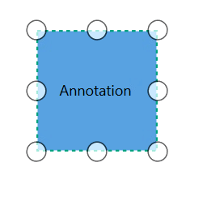

# How to Drag the Annotation

Dragging process can be applied over annotation and dragging can be controlled by Annotation and it's Parent (Node/Connector).
To explore about Annotation Constraints, please refer to the [Annotation Constraints](https://help.syncfusion.com/cr/cref_files/wpf/Syncfusion.SfDiagram.WPF~Syncfusion.UI.Xaml.Diagram.AnnotationConstraints.html).

## Dragging the Annotation

Dragging of annotation can be enabled by using `Constraints` property `AnnotationEditorViewModel` class and setting its value as `AnnotationConstraints.Draggable`





<!--Initialize the AnnotationCollection-->
<syncfusion:AnnotationCollection>
    <!--Initialize the AnnotationEditorViewModel-->
    <syncfusion:AnnotationEditorViewModel Content="Annotation" Constraints="Draggable"/>
</syncfusion:AnnotationCollection>
                                




//Initialize the AnnotationCollection
Annotations = new ObservableCollection<IAnnotation>()
    {
        //Initialize the Annotation Draggable constraint
        new AnnotationEditorViewModel()
            {
                Content = "Annotation",
                Constraints = AnnotationConstraints.Draggable 
            }
    }




### How to restrict the dragging area

Diagram allows you to specify the amount of dragging area around the annotation by enabling `Constraints` as `AnnotationConstraints.DragLimit` and dragging area can be specified by using `DragLimit` property. you could not drag the annotation behind this drag limit value. Default value is (10, 10, 10, 10).




<!--Initialize the AnnotationCollection-->
<syncfusion:AnnotationCollection>
    <!--Initialize the AnnotationEditorViewModel with drag limit value-->
    <syncfusion:AnnotationEditorViewModel Content="Annotation" Constraints="Draggable,DragLimit" DragLimit="40,80,40,40"/>
</syncfusion:AnnotationCollection>
                                



//Initialize the AnnotationCollection
Annotations = new ObservableCollection<IAnnotation>()
    {
        //Initialize the Annotation with drag limit value
        new AnnotationEditorViewModel()
            {
                Content = "Annotation",
                Constraints = AnnotationConstraints.Draggable | AnnotationConstraints.DragLimit,
                DragLimit = new Thickness(40,80,40,40),
            }
    }




| Property | Value | Output |
|---|---|---|---|
| DragLimit | (10,10,10,10) |  |
| | |  |
