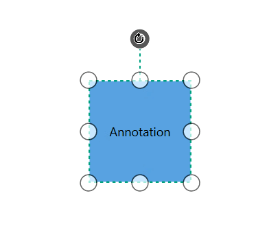
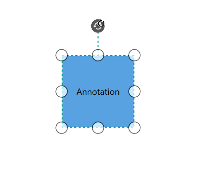

# How to Rotate the Annotation

Rotation process can be applied over annotation and rotation can be controlled by Annotation and it's Parent (Node/Connector).
To explore about Annotation Constraints, please refer to the [Annotation Constraints](https://help.syncfusion.com/cr/cref_files/wpf/Syncfusion.SfDiagram.WPF~Syncfusion.UI.Xaml.Diagram.AnnotationConstraints.html).

## Rotating the Annotation

Rotation of annotation can be enabled by using `Constraints` property `AnnotationEditorViewModel` class and setting its value as `AnnotationConstraints.Rotatable`




<!--Initialize the AnnotationCollection-->
<syncfusion:AnnotationCollection>
    <!--Initialize the AnnotationEditorViewModel-->
    <syncfusion:AnnotationEditorViewModel Content="Annotation" Constraints="Selectable,Rotatable"/>
</syncfusion:AnnotationCollection>
                                



//Initialize the AnnotationCollection
Annotations = new ObservableCollection<IAnnotation>()
    {
        //Initialize the Annotation Rotatable constraint
        new AnnotationEditorViewModel()
            {
                Content = "Annotation",
                Constraints = AnnotationConstraints.Selectable | AnnotationConstraints.Rotatable
            }
    }




### How to customize the annotation rotation

 `RotationReference` property of the Annotation is to define the rotation based on Page/its host(Node/Connector).To explore about Rotate Reference property, please refer to the [RotationReference](https://help.syncfusion.com/cr/cref_files/wpf/Syncfusion.SfDiagram.WPF~Syncfusion.UI.Xaml.Diagram.RotationReference.html) . 




<!--Initialize the AnnotationCollection-->
<syncfusion:AnnotationCollection>
    <!--Initialize the AnnotationEditorViewModel with rotation reference-->
    <syncfusion:AnnotationEditorViewModel Content="Annotation" RotationReference="Parent"/>
</syncfusion:AnnotationCollection>
                                



//Initialize the AnnotationCollection
Annotations = new ObservableCollection<IAnnotation>()
    {
        //Initialize the Annotation with rotation reference
        new AnnotationEditorViewModel()
            {
                Content = "Annotation",
                RotationReference = RotationReference.Parent,
            }
    }




| Values | Description | Node |
|---|---|---|---|
| Page | While rotating the node, annotation will not be rotated. |  |
| Wrap | While rotating the node, annotation also will be rotated with node. |  |

