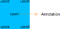
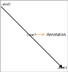

### Annotations

The Annotations property of the SfDiagram provides support to add annotations to the Diagraming objects (Node and Connector).

Customizing the Appearance of the Annotations

Template for Editing Annotations

You can specify a template for editing an annotation by using the DataTemplate property. The default template for editing an annotation is TextBox.

[XAML]

&lt;DataTemplate x:Key="edittemplate"&gt;

<TextBox Text="{Binding Path=Content, Mode=TwoWay}" 

ManipulationMode="None" AcceptsReturn="True">

&lt;/TextBox&gt;

&lt;/DataTemplate&gt;

Template for Viewing Annotations

You can specify a template for viewing an annotation by using the DataTemplate property. The default template for viewing an annotation is TextBlock.

[XAML]

&lt;DataTemplate x:Key="viewtemplate"&gt;

&lt;Border Padding="10"&gt;

&lt;TextBlock Text="{Binding Path=Content, Mode=TwoWay}" FontWeight="ExtraBold" FontSize="15" FontFamily="Times New Roman"&gt;

      &lt;/TextBlock&gt;

&lt;/Border&gt;

&lt;/DataTemplate&gt;

The following code example shows how to create an annotation.

[C#]

new AnnotationEditorViewModel()

{

Content="Label1",

Alignment=ConnectorAnnotationAlignment.Center ,

HorizontalAlignment=HorizontalAlignment.Center,

VerticalAlignment=VerticalAlignment.Center,

EditTemplate=this.Resources["edittemplate"] as DataTemplate,

ViewTemplate=this.Resources["viewtemplate"] as DataTemplate

}

Editing Annotations

You can edit an annotation by double-clicking it. When a node is double-clicked, the first annotation displayed enters the Edit mode.

{:.image }

Adding the Annotations to Nodes

The following code example shows how to add annotations to a Node:

[C#]

// Creating Node

ObservableCollection<NodeViewModel> nodes = new ObservableCollection<NodeViewModel>();

NodeViewModel n = new NodeViewModel();

n.OffsetX = 800;

n.OffsetY = 200;

n.Width = 100;

n.Height = 100;

n.Foreground = new SolidColorBrush(Colors.Black);

n.ContentTemplate = this.Resources["NodeTemplate"] as DataTemplate;

// Creates Annotation Collection

n.Annotations = new ObservableCollection<IAnnotation>()

{

new AnnotationEditorViewModel()

{

Content="Label1",

Alignment=ConnectorAnnotationAlignment.Center ,

HorizontalAlignment=HorizontalAlignment.Center,

VerticalAlignment=VerticalAlignment.Center

},

new AnnotationEditorViewModel()

{

Content="Label2", 

HorizontalAlignment=HorizontalAlignment.Left, 

VerticalAlignment=VerticalAlignment.Top

},

new AnnotationEditorViewModel()

{

Content="Label3", 

HorizontalAlignment=HorizontalAlignment.Right, 

VerticalAlignment=VerticalAlignment.Top

},

new AnnotationEditorViewModel()

{

Content="Label4", 

HorizontalAlignment=HorizontalAlignment.Left, 

VerticalAlignment=VerticalAlignment.Bottom

},

new AnnotationEditorViewModel()

{

Content="Label5", 

HorizontalAlignment=HorizontalAlignment.Right, 

VerticalAlignment=VerticalAlignment.Bottom

}            

};

// Adds Nodes to the SfDiagram

nodes.Add(n);

diagramcontrol.Nodes = nodes;

{:.image }

Adding Annotations to Connectors

The following code example shows how to add annotations to a Connector:

[C#]

// Creates Connector

ObservableCollection<ConnectorViewModel> lines = new ObservableCollection<ConnectorViewModel>();

ConnectorViewModel c = new ConnectorViewModel();

c.TargetPoint = new Point(300, 300);

c.SourcePoint = new Point(100, 100);

c.Foreground = new SolidColorBrush(Colors.Black);

// Creates Annotator Collection

c.Annotations = new ObservableCollection<IAnnotation>()

{

new AnnotationEditorViewModel()

{

Content="Label1", 

Alignment=ConnectorAnnotationAlignment.Center

},

new AnnotationEditorViewModel()

{

Content="Label2", 

Alignment=ConnectorAnnotationAlignment.Source

},
new AnnotationEditorViewModel()

{

Content="Label3", 

Alignment=ConnectorAnnotationAlignment.Target

}

};

// Adds connector to the SfDiagram

lines.Add(c);

diagramcontrol.Connectors = lines;

{:.image }

