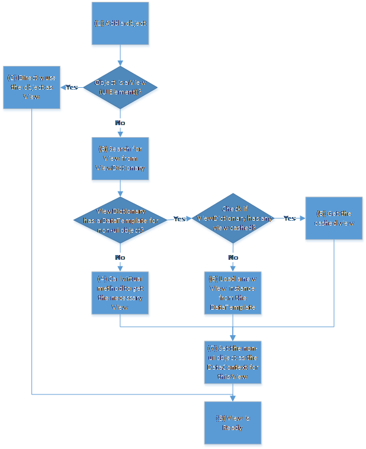

# Appendix

The following topics are discussed in the following section:

* Rendering
* Bitwise Operations

## Rendering

Diagram consists of many internal controls like Node, Connector, Port, Annotations, and so on. These controls can be added and manipulated in different ways. This has been discussed in detail in the following topics:

* Diagram Objects are used for representing Diagram Elements
* Usage of Scenario, Advantages, and Disadvantages of Diagram Objects
* Mapping a View
* Workflow

### Diagram Objects used for representing Diagram Elements

SfDiagram uses various data types to represent Diagram Objects; all data types must implement the corresponding interfaces. The supported data types are listed in the following table:

<table>
<tr>
<th>
Diagram Element</th><th colspan = "3">
Diagram Object</th></tr>
<tr>
<td>
</td><td>
Interface(Objects that  implement this interface)</td><td>
ViewModel (Predefined Objects that implement the required interface)</td><td>
View (Control that is shown in the View)</td></tr>
<tr>
<td>
Annotation</td><td>
IAnnotationINodeAnnotationIConnectorAnnotation</td><td>
AnnotationEditorViewModel</td><td>
AnnotationEditor</td></tr>
<tr>
<td>
Connector</td><td>
IConnector</td><td>
ConnectorViewModel</td><td>
Connector</td></tr>
<tr>
<td>
Group</td><td>
IGroup</td><td>
GroupViewModel</td><td>
Group</td></tr>
<tr>
<td>
Node</td><td>
INode</td><td>
NodeViewModel</td><td>
Node</td></tr>
<tr>
<td>
Port</td><td>
IPortINodePort</td><td>
NodePortViewModel</td><td>
NodePort</td></tr>
<tr>
<td>
Selector</td><td>
ISelector</td><td>
SelectorViewModel</td><td>
Selector</td></tr>
</table>

### Usage of Scenario, Advantages and Disadvantages of Diagram Objects

The following table illustrates the usage of scenario, advantages and disadvantages of Diagram Objects.

<table>
<tr>
<th>
Diagram Object</th><th>
Usage Scenario</th><th>
Advantages</th><th>
Disadvantages</th></tr>
<tr>
<td>
Interface</td><td rowspan = "2">
To follow MVVM pattern.To support large sets of data through virtualization with better performance and reduce memory usage. When required, business objects can directly be used as the source for diagram objects, instead of using types defined in the diagram library.Direct access to the View is not required (as per MVVM guidelines). New properties, commands, behaviors can be added and bound between View and ViewModel to overcome this limitation.</td><td>
Directly use the business objects just by implementing the required interface.High possibility of accessing objects in Non-UI thread.</td><td>
Have to implement all the properties in interfaces.Object needs to be updated on moving to a new version as new properties may be added to new version.</td></tr>
<tr>
<td> 
ViewModel</td><td>
Directly use the business objects just by deriving required ViewModel.High possibility of accessing objects in Non-UI thread.</td><td>
When the business object already has a base class, the business object cannot derive this ViewModel.</td></tr>
<tr>
<td>
View</td><td>
When diagram is not widely used in the application with limited set of data. MVVM pattern is not required.Quick and easy development as everything is directly accessible.</td><td>
Easy access to View anywhere.Simpler and easy to use.</td><td>
When requirements keep growing, huge implementation in a single class can make it unclear.Trying to access this object in a Non-UI thread leads to an exception. During Virtualization, performance and memory usage are not as good as using Non-UI objects.</td></tr>
</table>

### Mapping View for Non-UI Objects

A Non-UI element can be visualized as a Node, Connector or any Diagram Element by using the following methods:

* ViewDictionary
* Calling Virtual Methods

### ViewDictionary

ViewDictionary is used for creating and reusing Views for Non-UI elements. Scrolling in Diagram with Virtualization enabled causes objects to get into view and off view very frequently. This ViewDictionary recycles the view by caching the view when an object goes off view, and reuses the same view when another object comes into view. This improves the performance of SfDiagram that has a huge set of Diagrams by keeping the count of visuals to a minimum.

ViewDictionary consists of a collection of DiagramKeyValue &lt;DataTemplate&gt; a particular Non-UI object is mapped to a DataTemplate by using a Key. The criteria for mapping are as follows:

1. Key specified in Non-UI element and the DiagramKeyValue should be equal.
2. If Key is a Type, the Non-UI element’s Type should be assignable to key set to DiagramKeyValue.

The following steps illustrate how to add, delete or recycle a View from the ViewDictionary:

1. When a view is requested for a Non-UI element based on a matching key, a view is created from the Data Template and returned. 
2. When such a Non-UI element is deleted, and it has a matching key found in ViewDictionary, the view is not deleted. Instead, it is cached for future use.
3. When another Non-UI element requires the same view, a cached view is returned. When a cache is not available, a new view is loaded from the provided Data Template.

### Calling Virtual Methods

When there is no View found in the ViewDictionary, following virtual methods can be called to get a view. As these are virtual methods, they can be overridden by deriving the SfDiagram class. The following virtual methods are used to create a View for Non-UI elements.

* Node - SfDiagram.GetNodeForItemOverride()
* Connector - SfDiagram.GetConnectorForItemOverride()
* Group - SfDiagram.GetGroupForItemOverride()
* Selector - SfDiagram.GetSelectorForItemOverride()

### Workflow

The following is the internal workflow for creating a view on Diagram Objects:

1. Add objects to be visualized into the Diagram.
2. When the added object is already a View, it can be used directly.
3. When the added object is a Non-UI object (ViewModel or object that implements the necessary interface), Diagram searches for a matching View by using ViewDictionary.
4. When a matching View is not found, a View is created though Virtual methods.
5. When there is no cached view, a new View instance is loaded from the Data Template stored in the ViewDictionary.
6. The Non-UI object is set as the Data Context for the view that is created or reused dynamically.
7. View is ready for use.

## Bitwise Operations

In this section, Bitwise Operations are illustrated by using Graph Constraints. The same can be reproduced while working with Node Constraints, Connector Constraints or Port Constraints

### Add Operation

You can add or enable multiple values at a time by using Bitwise ‘|’ (OR) operator.



SfDiagram diagramcontrol=new SfDiagram();

diagramcontrol.Constraints = GraphConstraints.Pannable | GraphConstraints.Zoomable;



In the preceding example, SfDiagram control is both Pannable and Zoomable.

### Remove Operation

You can remove or disable values by using Bitwise ‘&~’ (XOR) operator.



SfDiagram diagramcontrol=new SfDiagram();

diagramcontrol.Constraints = diagramcontrol.Constraints &~ GraphConstraints.Zoomable;



In the preceding example, Zoomable property is disabled in SfDiagram control, but all the other constraints are enabled.

### Check Operation

You can check any value by using Bitwise ‘&’ (AND) operator.



SfDiagram diagramcontrol=new SfDiagram();

if((diagramcontrol.Constraints & GraphConstraints.Zoomable)== GraphConstraints.Zoomable)



In the preceding example, a check is made on whether the zoom constraints are enabled in the SfDiagram control. The expression returns a zoom constraint, when the SfDiagram control constraints have zoom constraints.

N> ZoomPan property needs to be enabled for the above settings to take effect.