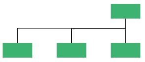
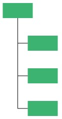
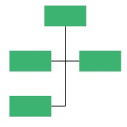
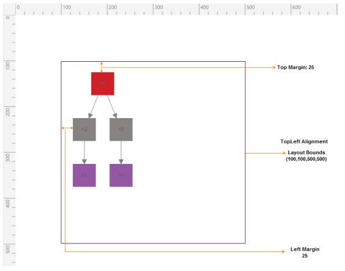

# Automatic Layout

SfDiagram provides support to auto-arrange the nodes in the Diagram area that is referred as **Layout**. It includes the following layout modes.

* Hierarchical Tree Layout
* Radial Tree
* Organizational Layout

## Hierarchical Tree Layout

The Hierarchical tree Layout arranges nodes in a tree-like structure, where the nodes in the hierarchical layout may have multiple parents. There is no need to specify the layout root.
To arrange the nodes in hierarchical structure, you need to specify the [LayoutType](https://help.syncfusion.com/cr/cref_files/wpf/sfdiagram/Syncfusion.SfDiagram.WPF~Syncfusion.UI.Xaml.Diagram.Layout.DirectedTreeLayout~Type.html "LayoutType") as hierarchical tree.

N> SpaceBetweenSubTrees property of the DirectedTreeLayout will no longer efficient. Please use HorizontalSpacing and VerticalSpacing.




<local:Employees x:Key="Employees">
<local:Employee Empid="0" Role="Project Management"></local:Employee>
<local:Employee Empid= "1"  Role= "R and D Team" Team= "0"/>
<local:Employee Empid= "3"  Role= "Philosophy" Team= "1"/>
<local:Employee Empid= "4"  Role= "Organization" Team= "1"/>
<local:Employee Empid= "156"  Role= "HR Team" Team= "0"/>
<local:Employee Empid= "13"  Role= "Recruitment" Team= "156"/>
<local:Employee Empid= "113"  Role= "Training" Team= "156"/>
<local:Employee Empid= "17"  Role= "Production and Sales Team" Team= "0"/>
<local:Employee Empid= "119"  Role= "Design" Team= "17"/>
<local:Employee Empid= "19"  Role= "Operation" Team= "17"/>
</local:Employees>
<!--Initializes the Layout-->
<syncfusion:DirectedTreeLayout x:Key="treeLayout" Orientation="TopToBottom" Type="Hierarchical"
HorizontalSpacing="80" VerticalSpacing="50"
SpaceBetweenSubTrees="20"/>

<!--Initializes the LayoutManager-->
<syncfusion:LayoutManager x:Key="layoutManager" Layout="{StaticResource treeLayout}" />




## Radial-Tree Layout

The Radial-Tree Layout is a specification of the Directed Tree Layout Manager that employs a circular layout algorithm for locating the Diagram Nodes. The Radial-Tree Layout arranges Nodes in a circular layout, positioning the root Node at the center of the graph and the child Nodes in a circular fashion around the root. Sub-trees formed by the branching of child Nodes are located radically around the child Nodes. 
The arrangement results in an ever-expanding concentric arrangement with radial proximity to the root Node indicating the Node level in the hierarchy. However, it is necessary to specify a layout root for the tree layout, as the Radial-Tree Layout positions the Nodes based on the [LayoutRoot](https://help.syncfusion.com/cr/cref_files/wpf/sfdiagram/Syncfusion.SfDiagram.WPF~Syncfusion.UI.Xaml.Diagram.Layout.RadialTreeLayout~LayoutRoot.html "LayoutRoot").




<local:Employees x:Key="Employees">
	<local:Employee Empid="0" Role="Project Management"></local:Employee>
	<local:Employee Empid= "1"  Role= "R and D Team" Team= "0"/>
	<local:Employee Empid= "3"  Role= "Philosophy" Team= "1"/>
	<local:Employee Empid= "4"  Role= "Organization" Team= "1"/>
	<local:Employee Empid= "156"  Role= "HR Team" Team= "0"/>
	<local:Employee Empid= "13"  Role= "Recruitment" Team= "156"/>
	<local:Employee Empid= "113"  Role= "Training" Team= "156"/>
	<local:Employee Empid= "17"  Role= "Production Team" Team= "0"/>
	<local:Employee Empid= "119"  Role= "Design" Team= "17"/>
	<local:Employee Empid= "19"  Role= "Operation" Team= "17"/>
	<local:Employee Empid= "18"  Role= "Sales Team" Team= "0"/>
	<local:Employee Empid= "113"  Role= "Support and Maintenance" Team= "18"/>
	<local:Employee Empid= "117"  Role= "Customer Interaction" Team= "18"/>
</local:Employees>

<!--Initializes the Layout-->
<syncfusion:RadialTreeLayout x:Key="treeLayout"
HorizontalSpacing="80" VerticalSpacing="50"
SpaceBetweenSubTrees="20"/>

<!--Initializes the LayoutManager-->
<syncfusion:LayoutManager x:Key="layoutManager" Layout="{StaticResource treeLayout}" />




## Organization Layout 

An organizational chart is a Diagram that displays the structure of an organization and relationships. To create an organizational chart, Type should be set as LayoutType.Organization.
For LayoutType Please refer to, [LayoutType](https://help.syncfusion.com/cr/cref_files/wpf/sfdiagram/Syncfusion.SfDiagram.WPF~Syncfusion.UI.Xaml.Diagram.Layout.DirectedTreeLayout~Type.html "LayoutType")




_//Initializes data source_
<local:Employees x:Key="Employees">
<local:Employee Empid="0" Role="Project Management"></local:Employee>
<local:Employee Empid= "1"  Role= "R and D Team" Team= "0"/>
<local:Employee Empid= "3"  Role= "Philosophy" Team= "1"/>
<local:Employee Empid= "4"  Role= "Organization" Team= "1"/>
<local:Employee Empid= "5"  Role= "Technology" Team= "1"/>
<local:Employee Empid= "7"  Role= "Funding" Team= "1"/>
<local:Employee Empid= "8"  Role= "Resource Allocation" Team= "1"/>
<local:Employee Empid= "9"  Role= "Targeting" Team= "1"/>
<local:Employee Empid= "11"  Role= "Evaluation" Team= "1"/>
<local:Employee Empid= "156"  Role= "HR Team" Team= "0"/>
<local:Employee Empid= "13"  Role= "Recruitment" Team= "156"/>
<local:Employee Empid= "113"  Role= "Training" Team= "156"/>
<local:Employee Empid= "112"  Role= "Employee Relation" Team= "156"/>
<local:Employee Empid= "14"  Role= "Record Keeping" Team= "156"/>
<local:Employee Empid= "15"  Role= "Compensations and Benefits" Team= "12"/>
<local:Employee Empid= "16"  Role= "Compliances" Team= "12"/>
<local:Employee Empid= "17"  Role= "Production and Sales Team" Team= "0"/>
<local:Employee Empid= "119"  Role= "Design" Team= "17"/>
<local:Employee Empid= "19"  Role= "Operation" Team= "17"/>
<local:Employee Empid= "20"  Role= "Support" Team= "17"/>
<local:Employee Empid= "21"  Role= "Quality Assurance" Team= "17"/>
<local:Employee Empid= "23"  Role= "Customer Interaction" Team= "17"/>
<local:Employee Empid= "24"  Role= "Support and Maintenance" Team= "17"/>
<local:Employee Empid= "25"  Role= "Task Coordination" Team= "17"/>
</local:Employees>

<!--Initializes the Layout-->
<syncfusion:DirectedTreeLayout x:Key="treeLayout" Orientation="TopToBottom" Type="Organization"
HorizontalSpacing="80" VerticalSpacing="50"
SpaceBetweenSubTrees="20"/>

<!--Initializes the LayoutManager-->
<syncfusion:LayoutManager x:Key="layoutManager" Layout="{StaticResource treeLayout}" />




Organizational chart layout starts parsing from root and iterate through all its child elements. ‘GetLayoutInfo’ method provides necessary information of a Node’s children and the way to arrange (Orientation, Type etc.) them. You can customize the arrangements by overriding this function as explained.

## Get Layout Info

User can change ChartType and Orientation by using GetLayoutInfo event of the SfDiagram. This event will fire for each Node added in Layout when the layout is getting updated. Default ChartType us Alternate and default orientation is Vertical.
For GetLayoutInfo Please refer to, [GetLayoutInfo](https://help.syncfusion.com/cr/cref_files/wpf/sfdiagram/Syncfusion.SfDiagram.WPF~Syncfusion.UI.Xaml.Diagram.IGraphInfo~GetLayoutInfo_EV.html "GetLayoutInfo").

**Event Arguments:**

| Event args | Property | Description |
|---|---|---|
| LayoutInfoArgs | Item | Added item when layout is getting updated. |
| | Type | Gets or sets the organizational chart type. |
| | Orientation | Gets or sets the organizational chart orientation. |




// Registering an event 

(diagramcontrol.Info as IGraphInfo).GetLayoutInfo += diagramcontrol_GetLayoutInfo;

void diagramcontrol_GetLayoutInfo(object sender, LayoutInfoArgs args)
{
    if (!args.HasSubTree)
    {
        args.Type = ChartType.Alternate;
        args.Orientation = Orientation.Vertical;
    }
}




The following table illustrates the different chart orientations and chart types. 

| Orientation | Type | Description | Example |
|---|---|---|---|
| Horizontal | Left | Arranges the child Nodes Horizontally at the Left side of Parent. |  |
| | Right | Arranges the child Nodes Horizontally at the Right side of Parent. |  |
| | Center | Arranges the child Nodes horizontally at the Center side of parent. |  |
| Vertical | Left | Vertically arranges the children at the Left side of Parent. |  |
| | Right | Vertically arranges the children at the Right side of Parent. |  |
| | Alternate | Vertically arranges the children at both Left and Right sides of Parent. |  |

## Customize Layout

Diagram layouts can be arranged at the custom positions based upon the layout bounds, margins, and alignments. For LayoutManager please refer to, [LayoutManager](https://help.syncfusion.com/cr/cref_files/wpf/sfdiagram/Syncfusion.SfDiagram.WPF~Syncfusion.UI.Xaml.Diagram.Layout.LayoutManager.html "LayoutManager").




diagramcontrol.LayoutManager = new LayoutManager()
{
	Layout = new DirectedTreeLayout()
	{
       	   Type = LayoutType.Hierarchical,
	       HorizotalAlignment = HorizontalAlignment.Left,
		   VerticalAlignment = VerticalAlignment.Top,
	       Bounds = new Rect(100, 100, 500, 500),
	       Margin = new Thickness(25, 25, 25, 25) 
	}
};




