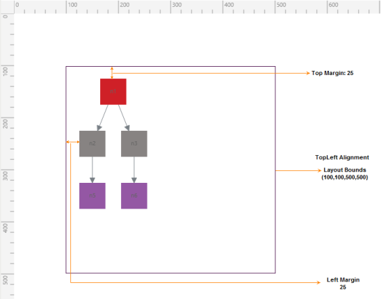

### Automatic Layouts

SfDiagram provides support to specify automatic layouts for nodes. It includes the following layout modes:

* Directed-Tree Layout
* Radial-Tree Layout

Directed-Tree Layout

The Directed-Tree layout mode enables you to arrange the nodes in a tree-like structure. This layout can be applied to any diagram that comprises a directed tree graph with unique root and child nodes. This creates the diagrams easier because the node position is determined automatically based on the connections. However, it is necessary to specify a layout root for the tree layout, as the Directed-Tree layout positions the nodes based on the layout root.

[C#]

// Creates Layout

diagramcontrol.LayoutManager = new LayoutManager()

{

Layout = new DirectedTreeLayout()

{

HorizontalSpacing = 50,

VerticalSpacing = 100,

SpaceBetweenSubTrees = 50

}

};

// Creates Nodes

ObservableCollection<NodeViewModel> nodes = new ObservableCollection<NodeViewModel>();

Node n1 = AddNode("Steve-CEO");

Node n2 = AddNode("Kevin-MKT_Manager ");            

Node n3 = AddNode("Peter-Manager ");            

Node n4 = AddNode("John-Manager ");            

Node n5 = AddNode("Mary-CSE ");

Node n6 = AddNode("Jim-CSE ");

// Creates Connections

ObservableCollection<ConnectorViewModel> lines = new ObservableCollection<ConnectorViewModel>();

Connector line1 = AddConnector(n1, n2);            

Connector line2 = AddConnector(n1, n3);            

Connector line3 = AddConnector(n1, n4);

Connector line4 = AddConnector(n3, n5);            

Connector line5 = AddConnector(n3, n6);

// Adds Nodes to the SfDiagram

nodes.Add(n1);

nodes.Add(n2);

nodes.Add(n3);

nodes.Add(n4);

nodes.Add(n5);

nodes.Add(n6);

diagramcontrol.Nodes = nodes;    

// Adds Connections to the SfDiagram

lines.Add(line1);

lines.Add(line2);

lines.Add(line3);

lines.Add(line4);

lines.Add(line5);

diagramcontrol.Connectors = lines;

private Node AddNode(string name)

{

Node n = new Node()

{

Width = 100, Height = 50, OffsetX = 500, OffsetY = 300,

ContentTemplate = this.Resources["NodeTemplate"] as DataTemplate,

Foreground = new SolidColorBrush(Colors.Black),

Annotations = new ObservableCollection<IAnnotation>()

{

new AnnotationEditorViewModel()

{

Content=name, HorizontalAlignment=HorizontalAlignment.Center,

VerticalAlignment=VerticalAlignment.Center

}

}

};

return n;

}

private Connector AddConnector(Node source, Node target)

{

Connector line = new Connector()

{

SourceNode = source,

TargetNode = target,

ConnectorGeometryStyle = this.Resources["LineStyle"] as Style,

TargetDecorator = GetPath(),

TargetDecoratorStyle = this.Resources["LineStyle1"] as Style

};

return line;

}

{:.image }

Radial-TreeLayout

The Radial-TreeLayout is a specialization of the Directed Tree Layout Manager that employs a circular layout algorithm for locating the diagram nodes. The Radial-Tree Layout arranges nodes in a circular layout, positioning the root node at the center of the graph and the child nodes in a circular fashion around the root. Sub-trees formed by the branching of child nodes are located radially around the child nodes. This arrangement results in an ever-expanding concentric arrangement with radial proximity to the root node indicating the node level in the hierarchy. However, it is necessary to specify a layout root for the tree layout, as the Radial-Tree layout positions the nodes based on the layout root.

[C#]

ObservableCollection<NodeViewModel> nodes = new ObservableCollection<NodeViewModel>();

ObservableCollection<ConnectorViewModel> lines = new ObservableCollection<ConnectorViewModel>();

diagramControl.LayoutManager = new LayoutManager()

{

Layout = new RadialTreeLayout()

};

(diagramControl.LayoutManager.Layout as RadialTreeLayout).HorizontalSpacing = 10;

(diagramControl.LayoutManager.Layout as RadialTreeLayout).VerticalSpacing = 30;

Node head = addNode(toggle, 0);

ConnectNode(head, Flower(4));

(diagramControl.LayoutManager.Layout as RadialTreeLayout).LayoutRoot = head;  

// Creates a tree of nodes

private List<Node> Flower(int p)

{

List<Node> nodes1 = new List<Node>();

for (int i = 0; i < p; i++)

{ 

Node n = addNode(toggle, p);

nodes1.Add(n);

toggle = !toggle;

ConnectNode(n, Flower(p - 4));

toggle = !toggle;

}

if (p <= 0)

{

nodes1.Add(addNode(toggle, -1));

nodes1.Add(addNode(toggle, -1));

}

return nodes;

}

// Creates a Node

private Node addNode(bool toggle, int lev)

{

Node n = new Node();

// n.Level = lev + 1;

n.Shape = new EllipseGeometry() { RadiusX = 15, RadiusY = 15 };

n.ShapeStyle = GetStyle();
n.Height = n.Width;

nodes.Add(n);

diagramcontrol.Nodes = nodes;

return n;

}

//Connects a node with a collection of nodes

private void ConnectNode(Node head, List<Node> tail)

{

foreach (Node t in tail)

{

Connector lc = new Connector();

diagramControl.DefaultConnectorType = ConnectorType.Line;

lc.SourceNode = head;

lc.TargetNode = t;

Connectors.Add(lc);

diagramcontrol.Connectors = Lines;

}

}

{:.image }

Updating the Layout

When changes are made to content in the SfDiagram, for example, linking new nodes or adding new connectors, the layout has to be updated to create space for adding the new content. The following code example illustrates how to update the layout in the SfDiagram:

[C#]

SfDiagram diagramcontrol=new SfDiagram();

(diagramcontrol.LayoutManager.Layout as DirectedTreeLayout).UpdateLayout();

Layout Bounds, Margins, and Alignments

Description

Diagram layouts can be arranged at the custom positions based upon the layout bounds, margins, and alignments.

Examples

Layout Alignments and Bounds

[C#]

diagramControl.LayoutManager = new LayoutManager()

                {

                    Layout = new DirectedTreeLayout() 

                    {

                        HorizontalSpacing=30, 

                        VerticalSpacing=50, 

                        HorizotalAlignment=HorizontalAlignment.Left,

                        VerticalAlignment=VerticalAlignment.Top,

                        Bounds=new Rect(100,100,500,500),

                        Margin=new Thickness(25,25,25,25) 

                    }

                };

{:.image }

