# Commands

There are several commands provided in the SfDiagram control. These commands can be executed from XAML or C# as shown in the following code examples. Some commands require parameters to be executed.

Execute commands without parameters





IGraphInfo graphInfo = (sfDiagram.Info as IGraphInfo);

graphInfo.Commands.Flip.Execute(null);    





<Button x:Name="Flip" 

		Command="{Binding Path=Info.Commands.Flip, ElementName=sfDiagram}" 

		Content="Flip" />
		




Here, the sfDiagram refers to an instance of SfDiagram. 

## Customizing the Object Size

Object size commands enable selected Diagram objects on the page to be resized. The selected objects are resized in proportion to the first object in the selection list.

### SameHeight Command

The SameHeight command enables selected objects to be resized to the same height of the first object in the selection list.

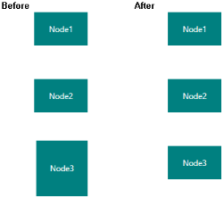

Height Customization
{:.caption}

### SameWidth Command

The SameWidth command enables the selected objects to be resized to the same width of the first object in the selection list.

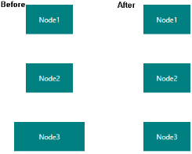

Width Customization
{:.caption}

### SameSize Command

The SameSize command enables selected objects to be resized to the same height and width of the first object in the selection list.

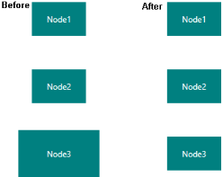

Height and Width Customization
{:.caption}

## Customizing the Object Position

Object position commands enable you to change the z-index value of the selected objects (nodes and connectors) on the page. These commands provide support to control overlapping objects.

### BringToFront Command

The BringToFront command enables you to move the selected object over other objects by increasing the z-index to its maximum value. 

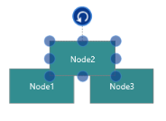

Order Commands
{:.caption}

### SendToBack Command

The SendToBack command enables you to move the selected object behind all other objects by setting the z-index to _zero_.  

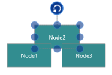

SendToBack
{:.caption}

### MoveForward Command

The MoveForward command increases the z-index value of the selected object by 1.

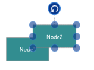

MoveForward
{:.caption}

### SendBackward Command

The SendBackward command decreases the z-index value of the selected object by 1.

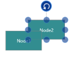

SendBackward
{:.caption}

## Customizing the Object Alignment

Object alignment commands enable you to align selected objects (nodes and connectors) on a page with respect to a reference object. The first object in the selection is considered the reference object.

### AlignLeft Command

The AlignLeft command enables you to align all selected objects along the left corner of the reference object.

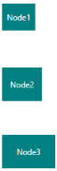

AlignLeft
{:.caption}

### AlignCenter Command

The AlignCenter command enables you to center all seletced objects vertically. It aligns selected objects to the center with respect to the horizontal axis by changing the x-coordinate of the object.

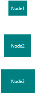

AlignCenter
{:.caption}

### AlignRight Command

The AlignRight command enables you to align all selected objects along the right corner of the reference object.

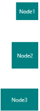

AlignRight
{:.caption}

### AlignTop Command

The AlignTop command enables you to align all selected objects along the top surface of the reference object.

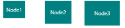

AlignTop
{:.caption}

### AlignMiddle Command

The AlignMiddle command enables you to center all selected objects horizontally. It aligns selected objects to the center with respect to the vertical axis by changing the y-coordinate of the object.

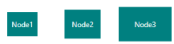

AlignMiddle
{:.caption}

### AlignBottom Command

The AlignBottom command enables you to align all selected objects along the bottom surface of the reference object.

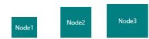

AlignBottom
{:.caption}

## Customizing the Space between Objects

Spacing commands enable you to place selected objects on the page at equal intervals from each other. The objects are spaced within the bounds of the first and last objects in the selection.

### SpaceAcross Command

The SpaceAcross command spaces selected objects with equal horizontal distance between them.

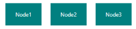

SpaceAcross
{:.caption}

### SpaceDown Command

The SpaceDown command spaces selected objects with equal vertical distance between them.

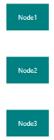

SpaceDown
{:.caption}

## Undoing or Redoing Actions

The Undo command reverses the last editing action performed. For example, some of the basic operations performed on Diagram objects such as translation, rotation, resizing, grouping, ungrouping, changing z-order, addition, deletion, and so on, can be reversed. The Redo command restores the last editing action when no other actions have occurred since the last undo.

## Nudge Commands

Commands enable you to move the selected objects on the page toward the top, bottom, left, or right by 1 pixel. 

### NudgeUp Command

The NudgeUp command moves the selected object towards the top by 1 pixel.

### NudgeDown Command

The NudgeDown command moves the selected object towards the bottom by 1 pixel.

### NudgeRight Command

The NudgeRight command moves the selected object towards the right by 1 pixel.

### NudgeLeft Command

The NudgeLeft command moves the selected object towards the left by 1 pixel.

### Clipboard Commands

Clipboard commands are used to perform cut, copy, and paste operations. 

Clipboard commands allow you to cut or copy selected Diagram objects to the Clipboard and paste the valid Clipboard content into the Diagram.

### Cut Command

Cuts the selected objects from the Diagram to the Clipboard. 

### Copy Command

Copies the selected objects from the Diagram to the Clipboard. 

### Paste Command

Pastes the valid contents of the Clipboard into the Diagram. 

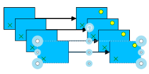

Pasting Diagram Objects
{:.caption}

### Duplicate Command

This command copies the selected objects from the Diagram and pastes the copied content into the Diagram.

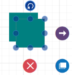
{:.caption}

### Flip Commands

Flip commands are used to mirror a Diagram object’s content.

### Execute Group Command

Group Commands are used to group the nodes.

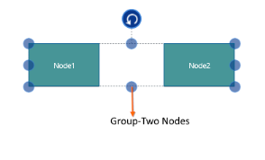

### Execute UnGroup Command

UnGroup Command are used to ungroup the grouped nodes.

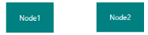

## Parameter

To customize flipping, a parameter of type IFlipParameter has to be passed.

### IFlipParameter Properties

<table>
<tr>
<th>
Property</th><th>
Description</th><th>
Value</th></tr>
<tr>
<td>
Flip</td><td>
Gets or sets whether the object is to be mirrored horizontally, vertically, or both.</td><td>
Enum FlipFlip.HorizontalFlipFlip.VerticalFlipFlip.Flip</td></tr>
</table>

### Execute Flip Command



 (sfdiagram.Info as IGraphInfo).Commands.Flip.Execute(null);
    


When the parameter is null, the object is flipped both horizontally and vertically.



IGraphInfo graphInfo = sfdiagram.Info as IGraphInfo;

FlipParameter flipParam = new FlipParameter();

 // Horizontal Flip	

 flipParam.Flip = Flip.HorizontalFlip;

 graphInfo.Commands.Flip.Execute(flipParam);

 //Vertical Flip

 flipParam.Flip = Flip.VerticalFlip;

 graphInfo.Commands.Flip.Execute(flipParam);



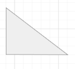

Without Flip
{:.caption}

<table>
<tr>
<td>
{{ '' | markdownify }}

</td><td>
{{ '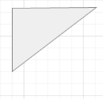'| markdownify }}

</td><td>
{{ '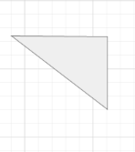' | markdownify }}

</td></tr>
<tr>
<td>
{{ '_Horizontal Flip_' | markdownify }}</td><td>
{{ '_Vertical Flip_' | markdownify }}</td><td>
{{ '_Flip_' | markdownify }}</td></tr>
</table>

### FitToPage Commands

FitToPage commands are used to bring the entire Diagram into the view.

#### Parameter

To use the FitToPage command, a parameter of type IFitToPageParameter has to be passed.

<table>
<tr>
<th>
Property</th><th>
Description</th><th>
Value</th></tr>
<tr>
<td>
FitToPage</td><td>
Gets or sets whether the Diagram is to fit into the view in terms of its width, height, or entirety.</td><td>
Enum FitToPageFitToPage.FitToPageFitToPage.FitToHeightFitToPage.FitToWidth</td></tr>
<tr>
<td>
Margin</td><td>
Gets or sets the margin value from the view to Diagram.</td><td>
Thickness</td></tr>
</table>

Fits the Entire Diagram into the View



IGraphInfo graphInfo = sfdiagram.Info as IGraphInfo;

 graphInfo.Commands.FitToPage.Execute(

     new FitToPageParameter()

     {

           Margin = new Thickness(25),

           //To fit the diagram with respect to width/height use FitToWidth or FitToHeight.

           FitToPage = FitToPage.FitToPage

    });

(or)

 graphInfo.Commands.FitToPage.Execute(null);



### Zoom Commands

Zoom commands are used to zoom in and out of the Diagram.

To execute zoom commands, parameters of type IZoomParameter (IZoomManipulationParameter, IZoomPositionParameter, or IZoomPointerParameter) have to be passed.

<table>
<tr>
<th>
Property</th><th>
Description</th><th>
Value</th></tr>
<tr>
<td>
ManipulationArgs</td><td>
Gets or sets the ManipulationDeltaRoutedEventArgs associated with the desired zoom function.</td><td>
ManipulationDeltaRoutedEventArgs</td></tr>
</table>

### IZoomPositionParameter Properties

<table>
<tr>
<th>
Property</th><th>
Description</th><th>
Value</th></tr>
<tr>
<td>
ZoomTo</td><td>
Gets or sets the zoom level where the Diagram is to be zoomed.</td><td>
double</td></tr>
<tr>
<td>
ZoomFactor</td><td>
Gets or sets the percentage of scale value for each ZoomIn or ZoomOut function.</td><td>
double</td></tr>
<tr>
<td>
FocusPoint</td><td>
Gets or sets the point of focus while zooming.</td><td>
Point</td></tr>
<tr>
<td>
ZoomCommand</td><td>
Gets or sets whether zoom in or zoom out has to be performed.</td><td>
Enum ZoomCommandZoomCommand.ZoomInZoomCommand.ZoomOut</td></tr>
</table>

<table>
<tr>
<th>
Property</th><th>
Description</th><th>
Value</th></tr>
<tr>
<td>
PointerArgs</td><td>
Gets or sets the PointerRoutedEventArgs associated with the desired zoom function.</td><td>
PointerRoutedEventArgs</td></tr>
<tr>
<td>
ZoomCommand</td><td>
Gets or sets whether zoom in or zoom out has to be performed.</td><td>
Enum ZoomCommandZoomCommand.ZoomInZoomCommand.ZoomOut</td></tr>
</table>

### Execute ZoomCommand



 IGraphInfo graphInfo = sfdiagram.Info as IGraphInfo;

 //Zoom to a particular scale.

 graphInfo.Commands.Zoom.Execute(

              new ZoomPositionParamenter() { ZoomTo = 2 , ZoomCommand=ZoomCommand.ZoomOut});

 //Zoom out based on zoom factor.

 graphInfo.Commands.Zoom.Execute(

              new ZoomPositionParamenter() 

              { 

                    ZoomFactor = 0.2,                       

                    ZoomCommand=ZoomCommand.ZoomOut
              });



### Reset Commands

Reset commands are used to reset horizontal offset, vertical offset, and zoom level of the Diagram.

To execute a reset command, a parameter of type IReset has to be passed.

<table>
<tr>
<th>
Property</th><th>
Description</th><th>
Value</th></tr>
<tr>
<td>
Reset</td><td>
Gets or sets the reset function</td><td>
Enum ResetReset.Zoom – To reset zoom level to 1,Reset.Pan – To reset offsets to 0,Reset.ZoomPan</td></tr>
</table>

### Execute ResetCommand



  IGraphInfo graphInfo = sfdiagram.Info as IGraphInfo;

 graphInfo.Commands.Reset.Execute( new ResetParameter() { Reset = Reset.ZoomPan });
 


### Draw Commands

Draw commands are used to draw connections. They take parameters of type IDrawParameter.

<table>
<tr>
<th>
Property</th><th>
Description</th><th>
Value</th></tr>
<tr>
<td>
DrawingTool</td><td>
Gets or sets a tool to draw.</td><td>
Enum DrawingToolDrawingTool.Connector</td></tr>
<tr>
<td>
Point</td><td>
Gets or sets the start point for drawing.</td><td>
Point</td></tr>
<tr>
<td>
Node</td><td>
Gets or sets the source node of the new connection.</td><td>
object</td></tr>
<tr>
<td>
Port</td><td>
Gets or sets the source port of the new connection.</td><td>
object</td></tr>
<tr>
<td>
PressedEventArgs</td><td>
Gets or sets the PressedEventArgs.</td><td>
PointerRoutedEventArgs</td></tr>
</table>

### Execute DrawCommand



 void button_PointerPressed(object sender, PointerRoutedEventArgs evtArgs)

 {

     IGraphInfo graphInfo = sfdiagram.Info as IGraphInfo;

     Point? sourcePoint = new Point(200, 200);

     graphInfo.Commands.Draw.Execute(

              new DrawParameter(

                       DrawingTool.Connector,

                       evtArgs,

                       sourcePoint, 

                       sourceNode,

                       sourcePort)

              );

 }



## Command Manager

Command manager is used to map between user gestures (keyboard, mouse) with commands. Refer to the following table for inbuilt commands with Key Gesture and Mouse Gesture.

List of Commands and Key Gesture: 

<table>
<tr>
<th>
Command</th><th>
Key</th><th>
Key Modifiers</th></tr>
<tr>
<td>
Copy</td><td>
C</td><td>
Control</td></tr>
<tr>
<td>
Cut</td><td>
X</td><td>
Control</td></tr>
<tr>
<td>
Paste</td><td>
V</td><td>
Control</td></tr>
<tr>
<td>
Duplicate</td><td>
D</td><td>
Control</td></tr>
<tr>
<td>
Undo</td><td>
Z</td><td>
Control</td></tr>
<tr>
<td>
Redo</td><td>
Y</td><td>
Control</td></tr>
<tr>
<td>
MoveLeft</td><td>
Left</td><td>
</td></tr>
<tr>
<td>
MoveUp</td><td>
Up</td><td>
</td></tr>
<tr>
<td>
MoveRight</td><td>
Right</td><td>
</td></tr>
<tr>
<td>
MoveDown</td><td>
Down</td><td>
</td></tr>
<tr>
<td>
Delete</td><td>
Delete</td><td>
</td></tr>
<tr>
<td>
SelectAll</td><td>
A</td><td>
Control</td></tr>
<tr>
<td>
Group</td><td>
G</td><td>
Control</td></tr>
<tr>
<td>
UnGroup</td><td>
G</td><td>
Control</td></tr>
<tr>
<td>
SendToBack</td><td>
[</td><td>
Control + Shift</td></tr>
<tr>
<td>
SendBackward</td><td>
[</td><td>
Control</td></tr>
<tr>
<td>
BringToFront</td><td>
]</td><td>
Control + Shift</td></tr>
<tr>
<td>
BringForward</td><td>
] </td><td>
Control</td></tr>
</table>

List of Commands and Key Gestures with Parameter:

<table>
<tr>
<th>
Command</th><th>
Key</th><th>
KeyModifier</th><th>
Parameter</th></tr>
<tr>
<td>
Zoom</td><td>
-</td><td>
Control</td><td>
new ZoomPositionParamenter {   ZoomCommand=ZoomCommand.ZoomOut} </td></tr>
<tr>
<td>
Zoom</td><td>
+</td><td>
Control</td><td>
new ZoomPositionParamenter {   ZoomCommand = ZoomCommand.ZoomIn }</td></tr>
<tr>
<td>
Reset</td><td>
0</td><td>
Control</td><td>
new ResetParameter {   Reset = Diagram.Reset.ZoomPan }</td></tr>
<tr>
<td>
FitToPage</td><td>
0</td><td>
Control + Menu</td><td>
new FitToPageParameter {  FitToPage = Diagram.FitToPage.FitToPage,  Margin = new Thickness(20) }</td></tr>
</table>

List of Commands and Mouse Gesture with Parameter: 

<table>
<tr>
<th>
Command</th><th>
Scroll State</th><th>
Parameter</th></tr>
<tr>
<td>
Vertical Scroll using ‘Zoom’ command</td><td>
Scroll</td><td>
new ZoomPointerParamenter {     ZoomCommand = ZoomCommand.VerticalScroll}</td></tr>
</table>

List of Commands and Key and Mouse Gestures with Parameter:

<table>
<tr>
<th>
Command</th><th>
KeyModifiers</th><th>
ScrollState</th><th>
Parameter</th></tr>
<tr>
<td>
Horizontal Scroll using ‘Zoom’ command</td><td>
Shift</td><td>
Scroll</td><td>
new ZoomPointerParamenter {     ZoomCommand = ZoomCommand.HorizondalScroll}</td></tr>
<tr>
<td>
Zoom</td><td>
Control</td><td>
Scroll</td><td>
new ZoomPointerParamenter { ZoomCommand = ZoomCommand.ZoomIn |   ZoomCommand.ZoomOut}</td></tr>
</table>

N> When different commands are registered for the same key / mouse gestures, you need to handle the command while execution.

### Custom Commands:

User defined commands can also be created and mapped with existing gesture by using command manager.The following code example explains how to register mouse key gesture with Parameter to Save Command (Control + S)

### Creates a user defined command: Save command

 

//Creates ICommand

private ICommand _save;

public ICommand Save

{

  get { return _save; }

  set { _save = value; }

}

//Initializes Command

Save = new DelegateCommand(OnSaveCommand);

//Executes Command

private async void OnSaveCommand(object obj)

{

    var picker = new FileSavePicker();

    // set appropriate file types

    picker.FileTypeChoices.Add(".xaml", new List<string> { ".xaml" });

    picker.DefaultFileExtension = ".xaml";

    object parameter =(obj as IGestureParameter).Parameter;

    picker.SuggestedFileName = parameter.ToString();

    StorageFile file = await picker.PickSaveFileAsync();

    using (var fileStream = await file.OpenStreamForWriteAsync())

      {

          sfdiagram.Save(fileStream);

      }
}



Map user defines command with key gesture:

 

//Adds new Command to CommandManager-Cntrl +S =>Save

sfdiagram.CommandManager.Commands.Add

(

   new GestureCommand()

    {

       Command = Save,

       Gesture = new Gesture

       {

          KeyModifiers = VirtualKeyModifiers.Control,

          KeyState = CoreVirtualKeyStates.Down,

          Key = VirtualKey.S

       },

       //Parameter is name of the File(.XAML)

       Parameter = "diagram"

   }

);



